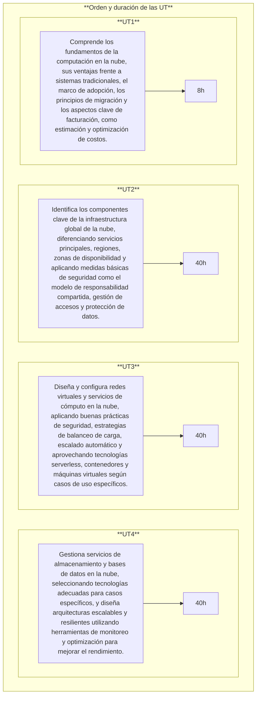

# **Introducción a la nube pública**
{.cincozero}
 

## **1. - Calendario escolar**

<!-- Aclarar horas de practicas
Aclarar fechas de las practicas -->

## **2. - Horario de sesiones**

## **3. - Contenidos del módulo**
A continuación, se presentan los contenidos de este módulo tal y como aparecen en el <a href=https://ceice.gva.es/documents/388109149/391641510/ANEXOS_Optativas_Propuesta_Decreto_Curris_LFP_GMGS.pdf>**Anexo X: Módulos optativos**</a>, seguiendo las <a href=https://ceice.gva.es/documents/388109149/392955746/Instrucciones_optativas_FP_definitivas_firmado_.pdf>**Instrucciones de la dirección de formación profesional**</a> sobre la oferta de módulos optativos para el curso 2025-2026.

### **3.1. - Introducción a la Nube:**  
- ¿Qué es la computación en la nube? 
- Ventajas de la nube frente a sistemas tradicionales.
- Introducción al ecosistema de la nube. 
- Principios de migración a la nube.

### **3.2. - Facturación y Economía de la Nube:**
- Aspectos fundamentales de los precios. 
- Uso de herramientas como la calculadora de costos.
- Modelos de soporte técnico. 
- Gestión de costos y herramientas para calcular costos.

### **3.3 - Infraestructura Global y Servicios Principales:**
- Infraestructura global. 
- Categorías de servicios. 
- Exploración de la consola de administración.
- Navegación por la infraestructura global y servicios principales.

### **3.4 - Seguridad en la Nube:**
- Modelo de responsabilidad compartida. 
- Identidad y gestión de acceso. 
- Protección de cuentas y datos. 
- Conformidad y mejores prácticas de seguridad. 
- Introducción a la gestión de accesos.

### **3.5 - Redes y Entrega de Contenido:**
- Conceptos básicos de redes. 
- Configuración de Red Virtual. 
- Seguridad en redes y diseño de arquitecturas. 
- Servicios de enrutamiento y distribución de contenido. 
- Crear una Red Virtual y lanzar un servidor web.

### **3.6 - Informática y Escalado Automático:**
- Introducción a los servicios de cómputo. 
- Uso de máquinas virtuales y Lambda.
- Balanceo de carga y escalado automático. 
- Escalado y balanceo de la carga de una arquitectura.

### **3.7 - Almacenamiento y Bases de Datos:**
- Servicios de almacenamiento: disco duro en nube, almacenamiento, EFS. 
- Introducción a bases de datos: Relacionales, No SQL y otros servicios. 
- Creación y gestión de una base de datos.
- Selección de tecnologías de almacenamiento.

### **3.8 - Arquitectura y Monitoreo:**
- Principios del marco de trabajo: Well-Architected.
- Uso de herramientas como Monitorización y asistentes de infraestructura. 
- Diseño de arquitecturas resilientes y escalables.
- Interpretación de recomendaciones de optimización.

## **4. - Metodología de aprendizaje**
1. Exposición de los **aspectos teóricos** para que después **sean aplicados mediante prácticas y ejercicios**.  

1. Prácticas **individuales y/o colectivas**. 

1. **Actividades voluntarias** de investigación y ampliación para **profundizar en los conocimientos adquiridos**.  

1. **PBL (Problem Based Learning)**. Se planteará un problema real, y los alumnos elaborarán una solución. 

1. Proyección de vídeos. 

## **5. - Evaluación** 
1. Las evaluaciones serán **por resultados de aprendizaje RA**. <a href=https://www.boe.es/boe/dias/2023/07/22/pdfs/BOE-A-2023-16889.pdf>R.D. 659/2023</a>. 
1. Los resultados de aprendizaje y criterios de evaluación asociados al módulo **Introducción a la nube pública** constituyen los logros que los alumnos/as tienen que alcanzar para **superar el módulo**.
1. Cada resultado de aprendizaje **RA** se evalúa a través de los criterios de evaluación **CE**. Los **CE** actúan como “desglose” del **RA**, facilitando medir de forma objetiva si el aprendizaje se ha alcanzado.

### **5.1. - Relación entre Criterios de Evaluación y Resultados de Aprendizaje**
**Los criterios de evaluación** asociados a los **resultados de aprendizaje** son los siguientes:

=== "RA 1"
    |RA1. Comprende los fundamentos de la computación en la nube, sus ventajas frente a sistemas tradicionales, el marco de adopción, los principios de migración y los aspectos clave de facturación, como estimación y optimización de costos.||
    |-|-|
    |**a)** Se ha comprendido los conceptos fundamentales de la computación en la nube.|15%|  
    |**b)** Se ha demostrado la capacidad para explicar las ventajas de la nube frente a sistemas tradicionales.|15%|  
    |**c)** Se ha participado en actividades relacionadas con el ecosistema de servicios en la nube.|15%|
    |**d)** Se han identificado los principios básicos de la facturación y costos en la nube.|5%|
    |**e)** Se ha hecho uso correcto de herramientas para estimar y gestionar presupuestos.|10%|
    |**f)** Se ha participado en actividades prácticas sobre gestión de costos.|15%|
    
=== "RA 2"
    |RA2. Identifica los componentes clave de la infraestructura global de la nube, diferenciando servicios principales, regiones, zonas de disponibilidad y aplicando medidas básicas de seguridad como el modelo de responsabilidad compartida, gestión de accesos y protección de datos.||
    |-|-|
    |**a)** Se ha adquirido conocimiento de los componentes de una infraestructura global en la nube. |15%|
    |**b)** Se ha demostrado la capacidad para explorar y describir las principales categorías de servicios disponibles.|25%|
    |**c)** Se ha realizado una evaluación del uso adecuado de servicios básicos en ejercicios prácticos.|10%|
    |**d)** Se ha comprendido el modelo de responsabilidad compartida en la nube.|15%|
    |**e)** Se ha aplicado medidas de seguridad básicas mediante herramientas de gestión de acceso.|15%|
    |**f)** Se han realizado ejercicios sobre gestión de usuarios y políticas de seguridad.|10%|

=== "RA 3"
    |RA3. Diseña y configura redes virtuales y servicios de cómputo en la nube, aplicando buenas prácticas de seguridad, estrategias de balanceo de carga, escalado automático y aprovechando tecnologías serverless, contenedores y máquinas virtuales según casos de uso específicos.||
    |-|-|
    |**a)** Se ha realizado el diseño y configuración de redes virtuales privadas.|10%|
    |**b)** Se ha aplicado buenas prácticas de seguridad en redes y arquitecturas.|15%|
    |**c)** Se ha participado activamente en la creación y configuración de una red funcional.|10%|
    |**d)** Se ha realizado la selección de servicios de computación adecuados según casos de uso.|15%|
    |**e)** Se ha llevado a cabo la configuración y gestión de balanceo de carga y escalado automático.|10%|
    |**f)** Se han desarrollado prácticas relacionadas con la optimización de recursos computacionales.|10%|

=== "RA 4"
    |RA4. Gestiona servicios de almacenamiento y bases de datos en la nube, seleccionando tecnologías adecuadas para casos específicos, y diseña arquitecturas escalables y resilientes utilizando herramientas de monitoreo y optimización para mejorar el rendimiento.||
    |-|-|
    |**a)** Se ha realizado la diferenciación entre tecnologías de almacenamiento en la nube.|10%|
    |**b)** Se ha llevado a cabo la configuración y gestión de bases de datos en un entorno de nube.|15%|
    |**c)** Se ha trabajado en la resolución de problemas prácticos sobre almacenamiento y bases de datos.|10%|
    |**d)** Se ha diseñado arquitecturas escalables y resilientes basadas en las mejores prácticas.|15%|
    |**e)** Se ha hecho uso de herramientas de monitoreo y recomendaciones de optimización.|15%|
    |**f)** Se ha participado en actividades que simulen el análisis y mejora de arquitecturas existentes.|15%|

    
### **5.2. - Metodología de evaluación**
1. La evaluación será **contínua**.   
2. Se basará en la comprobación de la superación de los **resultados de aprendizaje RA**.
3. La evaluación se hará por **RA's** sobre todos los **CE's** del currículo.

### **5.3. - Instrumentos de evaluación**
1. Exámenes.  
    - Preguntas tipo test.
    - Examen escrito (ejercicios).          
1. Tareas entregables.  
1. Exposiciones orales.  
1. Prácticas en empresa.

### **5.4. - Responsable evaluación de los RA's y/o CE's**
1. Evaluación por profesor:
**Todos lo que no se evaluarán en empresa**.

1. Evaluación por tutor empresa: 
=== "RA 1"
    CE Tutor prácticas (Empresa). 

=== "RA 2"
    Profesor módulo (Instituto).

=== "RA 3"
    Profesor módulo (Instituto).

=== "RA 4"
    Profesor módulo (Instituto).

## **6. - Criterio de superación del módulo**
### **6.1. - Nota final**
La nota final será la suma ponderada de **los resultados de aprendizaje** obtenidos en cada evaluación.  

La superación del módulo requerirá obtener una media mínima de **5 sobre 10 en cada resultado de aprendizaje**. 

En caso de no superar el módulo, el alumna/o dispondrá de un proceso de recuperación orientado a reforzar específicamente los resultados de aprendizaje no alcanzados.

|Resultado de aprendizaje|Porcentage|
|-|-|
|**RA1.** Comprende los fundamentos de la computación en la nube, sus ventajas frente a sistemas tradicionales, el marco de adopción, los principios de migración y los aspectos clave de facturación, como estimación y optimización de costos.|25%|
|**RA2.** dentifica los componentes clave de la infraestructura global de la nube, diferenciando servicios principales, regiones, zonas de disponibilidad y aplicando medidas básicas de seguridad como el modelo de responsabilidad compartida, gestión de accesos y protección de datos.|25%|
|**RA3.** Diseña y configura redes virtuales y servicios de cómputo en la nube, aplicando buenas prácticas de seguridad, estrategias de balanceo de carga, escalado automático y aprovechando tecnologías serverless, contenedores y máquinas virtuales según casos de uso específicos.|25%|
|**RA4.** Gestiona servicios de almacenamiento y bases de datos en la nube, seleccionando tecnologías adecuadas para casos específicos, y diseña arquitecturas escalables y resilientes utilizando herramientas de monitoreo y optimización para mejorar el rendimiento.|25%|

### **6.2. - Instrumentos de recuperación**
- Se propondrá a los alumnos una serie de **recuperaciones** que le permitirán recuperar los **criterios de evaluación** no superados.
- Si el alumno **no entrega los trabajos obligatorios o presenta tasas de absentismo elevadas**, perderá la evaluación continua y deberá presentarse a la evaluación **ordinaria** y/o **extraordinaria**.  

### **6.3. - Calendario de evaluaciones**
- Evaluación inicial (primer mes).
- **Una evaluación parcial por cada trimestre**. 
    - Se daran las notas de los **RA** completados y también la nota **parcial** de los **RA** incompletos.
    - Para tener el aprobado será necesario haber alcanzado una puntuación superior o igual a 5 en los **Resultados de Aprendizaje RA** completados.

- **Evaluación ordinaria** y **extraordinaria**: Permitiran recuperar los **RA no superados**.
 
 
## **7. - Secuenciación y duración de cada Unidad de Trabajo**
Por motivos de simplicidad **se asocia un RA a cada tema. Los temas se dibidirán en varias Unidad de Trabajo (UT)**.  

   
 

| **Licencia Creative Commons:** | |
| - | - |
|  { .by-nc-nd-eu_ } | **Reconocimiento-NoComercial-CompartirIgual CC BY-NC-SA:**  No se permite un uso comercial de la obra original ni de las posibles obras derivadas, la distribución de la cuales se debe hace con una licencia igual a la que regula la obra original. | 