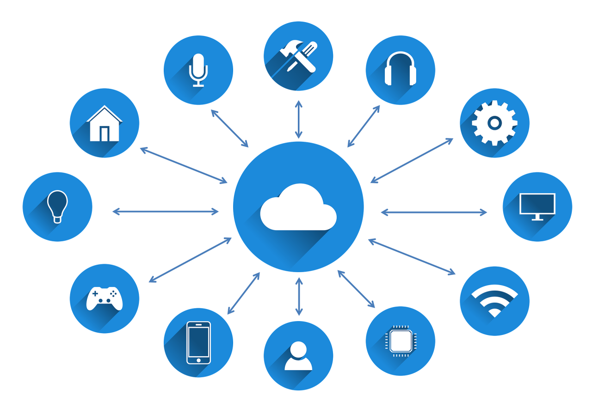
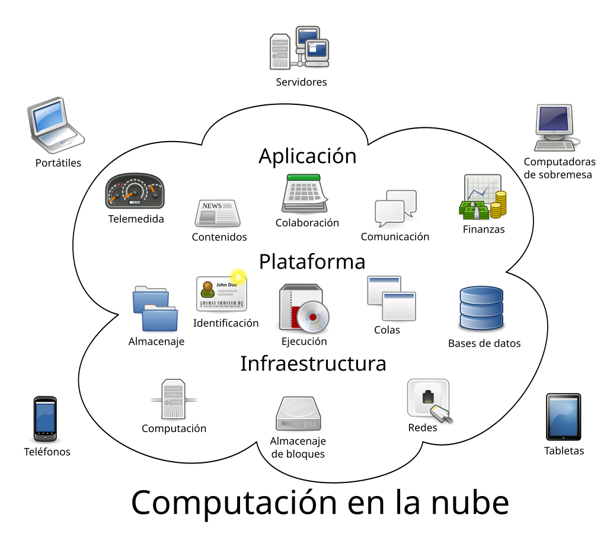
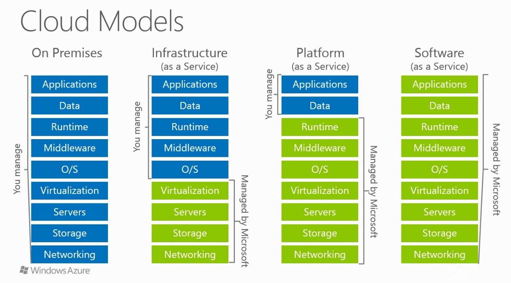
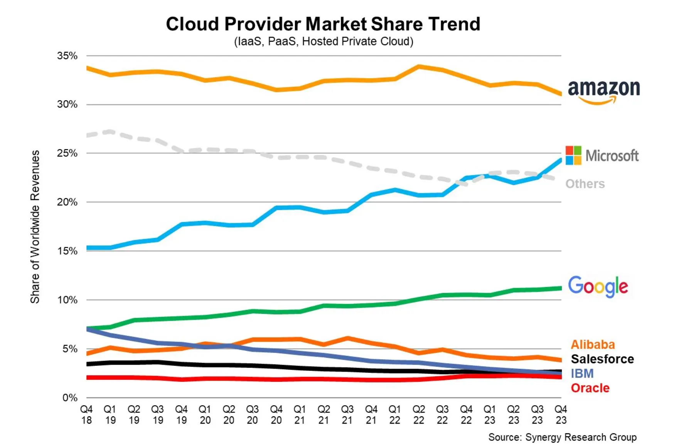

{ .cincozero }
 

## **Arquitecturas empresariales**
### **Introducción**
En el entorno empresarial, la infraestructura de TI es un componente crítico para el funcionamiento de cualquier organización. Tradicionalmente, las empresas gestionaban sus propios servidores, almacenamiento y redes, adoptando lo que se conoce como **arquitectura on premise**. Este enfoque permite **un control total** sobre los recursos y la seguridad, pero también implica altos costos de mantenimiento, actualización y escalabilidad.

Con la llegada del **cloud computing**, las organizaciones pueden acceder a recursos de computación, almacenamiento y aplicaciones de manera flexible, escalable y bajo demanda, sin necesidad de poseer físicamente toda la infraestructura. Este cambio ha dado lugar a distintos modelos de arquitectura empresarial que combinan recursos internos y servicios en la nube, permitiendo a las empresas optimizar costos, mejorar la disponibilidad y adaptarse rápidamente a nuevas necesidades tecnológicas.

### **Arquitecturas on premise**
También llamadas in-house, son aquellas en las que la empresa adquiere y gestiona directamente el hardware y la infraestructura de TI. En este modelo, la organización tiene control total sobre los recursos, la seguridad y la configuración, pero también asume la responsabilidad completa del mantenimiento, las actualizaciones y la escalabilidad de sus sistemas.

### **Arquitecturas cloud**
En este caso, parte o la totalidad de los recursos están virtualizados y no son propiedad directa de la empresa, sino que se consumen como servicios ofrecidos por un proveedor externo.

Podemos distinguir entre:

- **Nube pública**  
Los recursos virtualizados son compartidos entre varios clientes y se accede a ellos a través de internet. Pertenecen y son administrados por un proveedor de servicios en la nube, que ofrece capacidad de cómputo, almacenamiento y otros recursos de forma flexible, rápida y con pago por uso o suscripción.

- **Nube privada**  
Los recursos virtualizados son exclusivos de una única organización y se ejecutan en un entorno dedicado, que puede estar alojado en las instalaciones de la empresa o gestionado por un tercero en un centro de datos externo. Se accede normalmente mediante redes privadas o conexiones seguras, y proporciona mayor control y personalización.

- **Arquitecturas híbridas**  
Combinan elementos de la nube privada y la nube pública, ofreciendo gran flexibilidad para ejecutar cargas de trabajo en el entorno más adecuado según cada necesidad.

    - Permiten que las aplicaciones críticas y los datos confidenciales se mantengan en entornos privados, mientras que aplicaciones menos sensibles, entornos de prueba o picos de demanda pueden aprovechar recursos públicos.

    - Este modelo es muy común, ya que facilita una migración progresiva hacia la nube, coexistiendo con la infraestructura ya existente (on premise) y permitiendo ampliar recursos cuando sea necesario.

## Cloud computing
### Introducción
El cloud computing o **computación en la nube** es la entrega de recursos informáticos, como servidores, almacenamiento, bases de datos, software y redes, **a través de Internet** a cambio de **pago por uso**. 

Este modelo permite a las organizaciones y a los usuarios acceder a multitud de servicios, de forma remota, **eliminando la necesidad de gestionar** su propia infraestructura física y reduciendo los costes operativos. 

### Ventajas de la computación en la nube
- Reducción de costes iniciales: Eliminación de los gastos de compra y mantenimiento de hardware y software. En caso de necesitar más recursos, se puede ampliar la infraestrutura que hemos desplegado con solo **unos pocos clics**. 

- Pago por uso: Solo se paga por el tiempo de uso (cantidad + capacidad) de los recursos informáticos que hemos contratado. 

- Escalabilidad: Los recursos informáticos pueden aumentarse o disminuirse rápidamente según las necesidades de cada momento.

- Flexibilidad y accesibilidad: Los servicios se pueden acceder desde cualquier lugar del mundo. Los recursos se pueden ajustar fácilmente a las necesidades de la empresa/proyecto, de manera casi instantánea. 

- Alta disponibilidad: capacidad de una aplicación para seguir operativa incluso ante fallos, gracias a la redundancia de recursos en varias zonas y servidores.

- Mejora de la latencia: al estar los recursos distribuidos globalmente, se puede desplegar la aplicación en regiones cercanas a los usuarios, reduciendo el tiempo de respuesta.
 
- Tolerancia a fallos, ya que ofrecen una arquitectura de respaldo de copias de seguridad y a prueba de ataques.

- Alcance global: cualquier usuario autorizado puede acceder o actualizar información desde cualquier lugar del mundo, en cualquier momento y mediante cualquier dispositivo.

- Cálculo de costes de manera predictiva ya que sólo se paga por los recursos que se utilizan.

### Servicios en la nube
En el modelo de computación en la nube, los recursos informáticos se ofrecen como servicios, lo que permite a las empresas y usuarios acceder a una infraestructura, plataformas y aplicaciones sin necesidad de adquirir y mantener hardware o software propios.

{ .cincozero }

Estos servicios se organizan en distintos niveles según el grado de control y responsabilidad del usuario:

- IaaS (Infrastructure as a Service)

- PaaS (Platform as a Service)

- SaaS (Software as a Service)

Cada modelo responde a distintas necesidades y niveles de gestión, desde el mayor control (IaaS) hasta la mayor comodidad y abstracción (SaaS).

{ .sietecinco }
 

#### Iaas (Infrastructure as a Service)
- La infraestructura como servicio (IaaS) es la categoría más flexible de servicios en la nube, ya que proporciona la cantidad máxima de control para los recursos en la nube.  
En un modelo IaaS, el proveedor de nube es responsable de mantener el hardware, la conectividad de red (a Internet) y la seguridad física. 

- **El cliente es responsable de todo lo demás** (Instalación, configuración y mantenimiento del sistema operativo, configuración de red, configuración de base de datos y almacenamiento, etc).

- Con IaaS, básicamente se está alquilando el hardware en un centro de datos en la nube, pero lo que hace con ese hardware le corresponde al cliente. 

#### PaaS (Platform as a Service)
- La plataforma como servicio (PaaS) se sitúa entre el alquiler de infraestructura (IaaS) y el uso de aplicaciones completamente gestionadas (SaaS).
  
- En este modelo, el proveedor cloud ofrece no solo la infraestructura, sino también una plataforma completa con entornos de desarrollo, servidores de aplicaciones, frameworks, bases de datos y herramientas de integración para que los usuarios puedan crear, probar y desplegar sus aplicaciones personalizadas.

- El cliente no necesita administrar el hardware, el sistema operativo, las licencias ni las actualizaciones de la plataforma, ya que el proveedor se encarga de su mantenimiento, escalabilidad y seguridad.

- La seguridad y calidad de la aplicación desarrollada sigue siendo responsabilidad del cliente.

#### SaaS (Software as a Service)
El modelo SaaS es el más completo desde el punto de vista del producto en la nube, ya que el usuario accede a una aplicación totalmente desarrollada y lista para usar.

El cliente no compra el software, sino que paga una suscripción o un modelo de pago por uso para acceder a la aplicación, normalmente a través de un navegador web, una app o incluso integraciones mediante API, desde cualquier dispositivo con conexión a internet.

El proveedor administra todo: el software, la infraestructura subyacente, las actualizaciones, la disponibilidad y la seguridad. El cliente solo debe gestionar el uso de la aplicación (por ejemplo, configurar usuarios, permisos o datos).

Aunque es el modelo menos flexible en cuanto a personalización, es el más fácil de implementar y requiere menos conocimientos técnicos.

#### **Modelo de responsabilidad compartida**
En cloud computing, el modelo de responsabilidad compartida define claramente qué tareas corresponden al proveedor de servicios en la nube y cuáles son responsabilidad del cliente, dependiendo del tipo de servicio contratado (IaaS, PaaS o SaaS).  
La idea es que la seguridad y la gestión no son completamente delegadas: cada parte tiene un rol específico.

 
{ .sietecinco }
 

- **IaaS (Infrastructure as a Service)**  
    **Proveedor:** administra centros de datos, servidores, almacenamiento, red, virtualización y, en muchos casos, la seguridad física y de la plataforma.

    **Cliente:** gestiona sistemas operativos, parches, configuraciones de red (firewalls, reglas), aplicaciones, datos, copias de seguridad y gestión de identidades.

- **PaaS (Platform as a Service)**
    **Proveedor:** gestiona todo lo anterior y añade plataformas de desarrollo, servidores de aplicaciones, bases de datos, middleware y entornos de ejecución.  

    **Cliente:** es responsable del código, la lógica de negocio, la configuración de la aplicación y la protección de los datos que maneja.

- **SaaS (Software as a Service)**
    **Proveedor:** gestiona la infraestructura, la plataforma y el software completo, incluyendo actualizaciones, mantenimiento y seguridad del servicio.

    **Cliente:** se ocupa del uso correcto del software, la configuración de usuarios, permisos, cumplimiento normativo y la protección de la información que introduce.

**Importancia del modelo de responsabilidad compartida**  
- Evita malentendidos: ayuda a saber quién debe actuar ante incidentes.
- Mejora la seguridad: obliga a ambas partes a cumplir con sus responsabilidades.
- Cumplimiento normativo: es clave en auditorías y certificaciones.

## **Plataformas Cloud**
Actualmente existen numerosos proveedores que ofrecen servicios en la nube, clasificados según el **modelo de servicio** (IaaS, PaaS, SaaS). A continuación, se presentan los más conocidos y utilizados:  

### **Proveedores de nube pública**

- **Amazon Web Services (AWS)** – [AWS](https://aws.amazon.com/es/)  
  Amazon fue uno de los primeros proveedores cloud y ha mantenido un crecimiento constante. AWS ofrece una plataforma confiable utilizada por miles de empresas en todo el mundo, con servicios en todas las capas (IaaS, PaaS y SaaS).  

- **Microsoft Azure** – [Azure](https://azure.microsoft.com)  
  Azure ha experimentado un fuerte crecimiento en los últimos años y ofrece una amplia gama de servicios en la nube, incluyendo IaaS, PaaS y SaaS.  

- **Google Cloud Platform (GCP)** – [Google](https://cloud.google.com)  
  Google tardó en consolidarse en el mercado cloud, pero actualmente GCP es ampliamente utilizada por grandes empresas, ofreciendo servicios tanto de infraestructura como de plataforma y aplicaciones.  

### **Nube privada**

- **OpenStack** – [Openstack](https://www.openstack.org)  
  Es un proyecto de **software de infraestructura en la nube de código abierto**, ampliamente utilizado para crear nubes privadas. OpenStack es uno de los proyectos open source más activos y flexibles del mundo, permitiendo a las empresas controlar su infraestructura y mantener entornos privados seguros.  

### Ejemplos de proveedores según tipo de servicio

| Tipo de Servicio | Proveedor | Descripción |
|-----------------|-----------|-------------|
| **IaaS** | AWS EC2 | Máquinas virtuales con CPU, memoria y almacenamiento configurables. |
|  | Azure VMs | Máquinas virtuales equivalentes en Microsoft Azure. |
|  | Google Compute Engine | Máquinas virtuales equivalentes en Google Cloud. |
| **PaaS** | AWS RDS, AWS Lambda | Servicios de bases de datos gestionadas y funciones *serverless*. |
|  | Google App Engine | Plataforma para alojamiento y despliegue web. |
|  | Heroku | Plataforma que permite desplegar aplicaciones en la nube de manera sencilla. |
| **SaaS** | Microsoft 365 | Paquete ofimático completo en la nube. |
|  | Aplicaciones web de Google | Correo electrónico, calendario, almacenamiento y más. |
|  | Trello, Notion, GitHub, Dropbox, Spotify | Gestión de tareas, repositorios de código, almacenamiento en la nube y servicios multimedia. |

## **Estado actual del mercado Cloud**
El **cloud computing** se ha consolidado como un pilar fundamental de la transformación digital, permitiendo a empresas de todos los tamaños acceder a recursos de computación bajo demanda. Los principales proveedores lideran un mercado global en constante crecimiento, con importantes inversiones estratégicas en países [como España](https://www.aboutamazon.es/noticias/aws/nueva-inversion-de-15700-millones-de-aws-en-espana).

### **Principales proveedores y su posición global**
En el cuarto trimestre de 2024, el gasto global en servicios en la nube **aumentó un 20%** interanual, alcanzando los 86 mil millones de dólares. Durante todo el año 2024, el gasto también creció un 20%, pasando de 267,7 mil millones de dólares en 2023 a 321,3 mil millones de dólares en 2024.

El principal impulsor de este crecimiento fue la expansión de los modelos de inteligencia artificial (IA), que aceleró significativamente la adopción de la nube. Para la segunda mitad de 2024, los principales proveedores de nube reportaron retornos positivos de sus inversiones en IA, y las aplicaciones de IA tuvieron un impacto notable en el desempeño general de su negocio en la nube.

A medida que la competencia en el mercado de IA se intensifica, los hiperescaladores de la nube planean aumentar aún más sus inversiones en infraestructura cloud y de IA en 2025 para satisfacer la creciente demanda.  

- **Amazon Web Services (AWS)**
    - **Cuota de mercado global:** 33% (Q4 2024)
    - **Facturación:** >$100.000.000.000$ (+19% interanual)
    - **Inversiones en España:** $15 mil millones en 2024 para expandir infraestructura cloud y AI, 6,800 empleos generados

- **Microsoft Azure**
    - **Cuota de mercado global:** 20%  
    - **Facturación:** >$75.000.000.000$ (+31% interanual)
    - **Inversiones en España:** expansión de servicios cloud y AI

- **Google Cloud**
    - **Cuota de mercado global:** 11%
    - **Facturación:** >$50.000.000$ (+32% interanual)
    - **Inversiones:** contratos estratégicos de infraestructura cloud y AI, incluyendo acuerdos con grandes empresas

- **Proveedores europeos (ej. OVHcloud, SAP, Deutsche Telekom)**
  - **Cuota de mercado en Europa:** 15%
  - **Inversiones en España:** OVHcloud lanzó dos zonas locales de nube pública en Madrid, asegurando cumplimiento de residencia de datos

### **Mercado en España**

- **Tamaño estimado:** $9.66 mil millones en 2025; crecerá a $21.84 mil millones en 2030 (Tasa anual 17.7%)
- **Tendencias:** expansión de infraestructura cloud, servicios de AI y cumplimiento normativo

### **Cuotas de mercado globales**
{ .cincozero }

Como podemos ver en la imagen, AWS sigue disponiendo de la mayor cuota de mercado, siguida cada vez más de cerca por Microsoft y su cloud Azure.

[Articulo completo](https://www.canalys.com/newsroom/worldwide-cloud-service-q4-2024) de canalsys.

## **Enlaces de interés**
<a href=https://aws.amazon.com/es/getting-started/cloud-essentials>Conceptos básicos de la nube de AWS</a>.  
<a href=https://es.wikipedia.org/wiki/Computaci%C3%B3n_en_la_nube>Wikipedia</a>.  
<a href=https://learn.microsoft.com/es-es/training/paths/  microsoft-azure-fundamentals-describe-cloud-concepts>Microsoft Azure, conceptos de la nube</a>.
