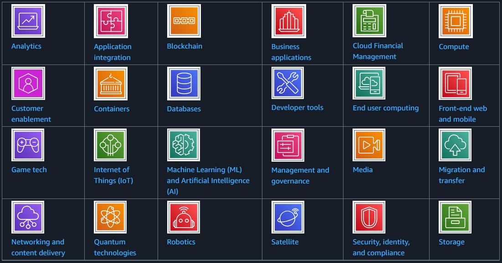
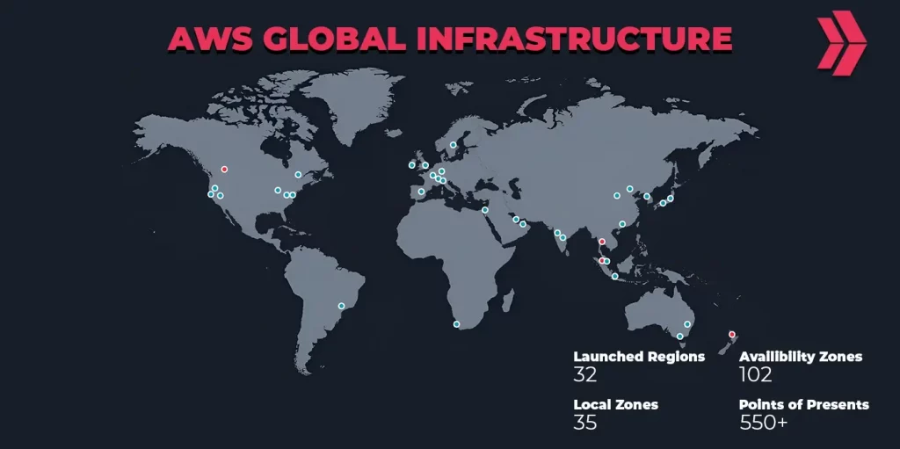
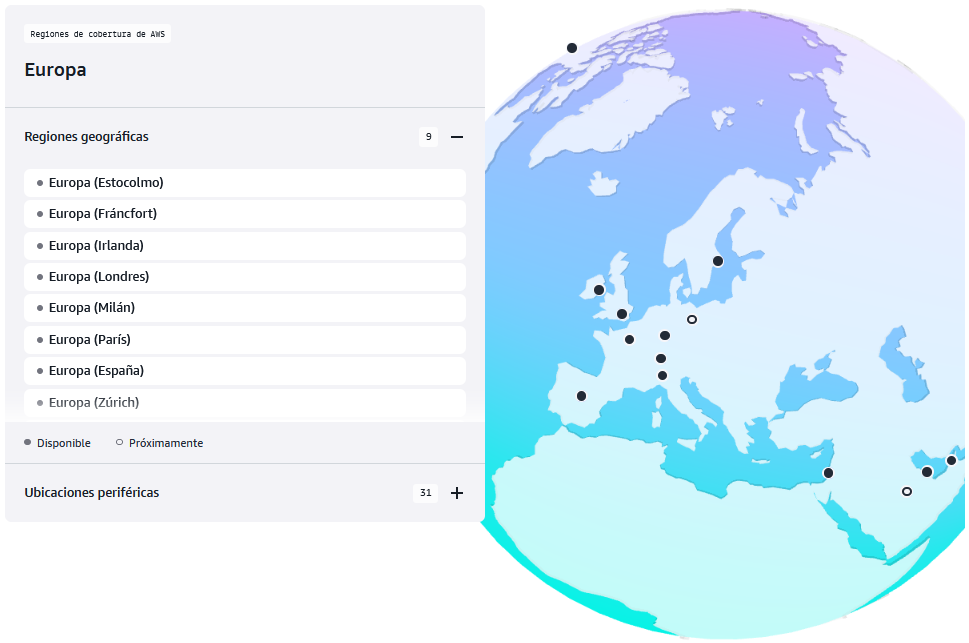
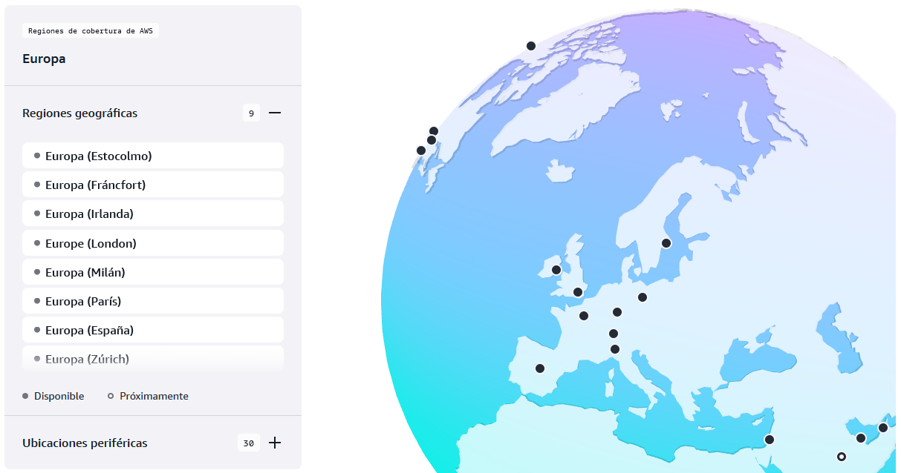
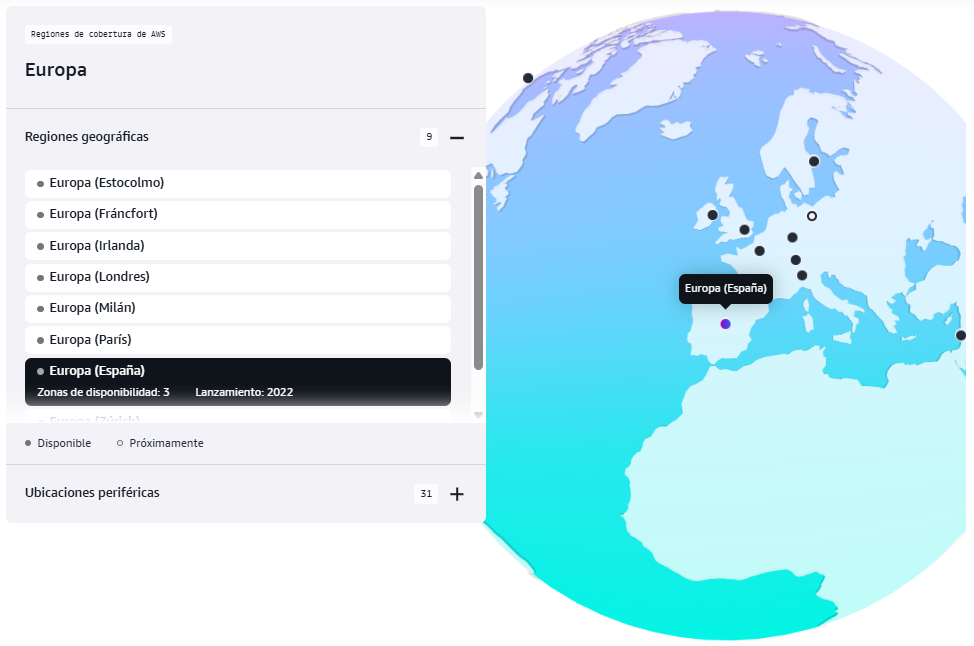
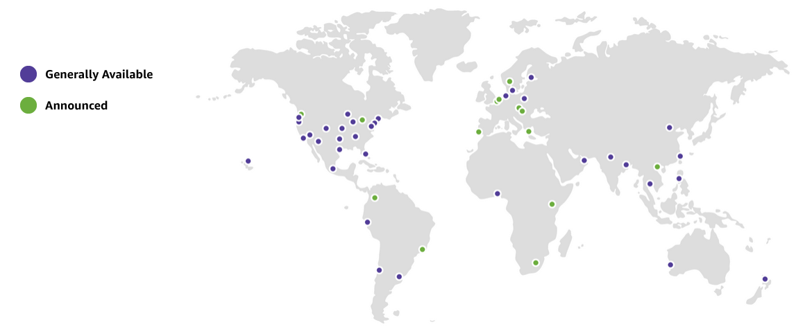
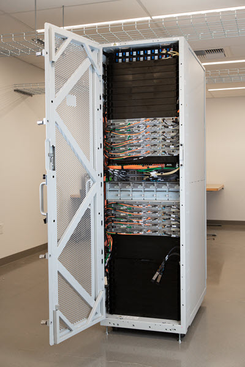
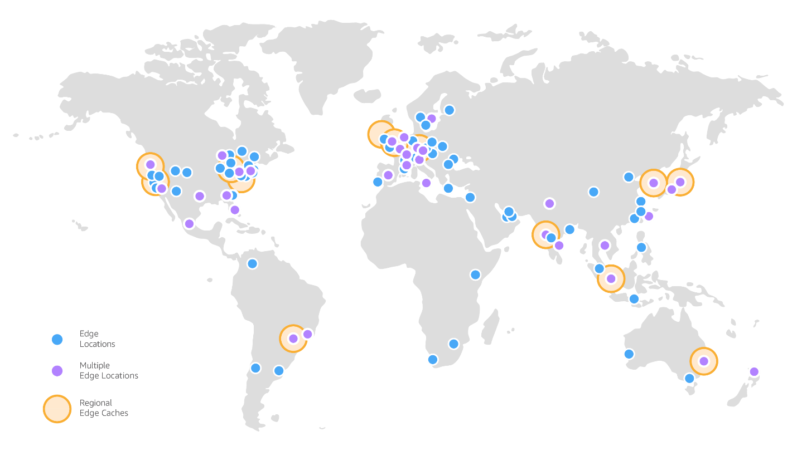
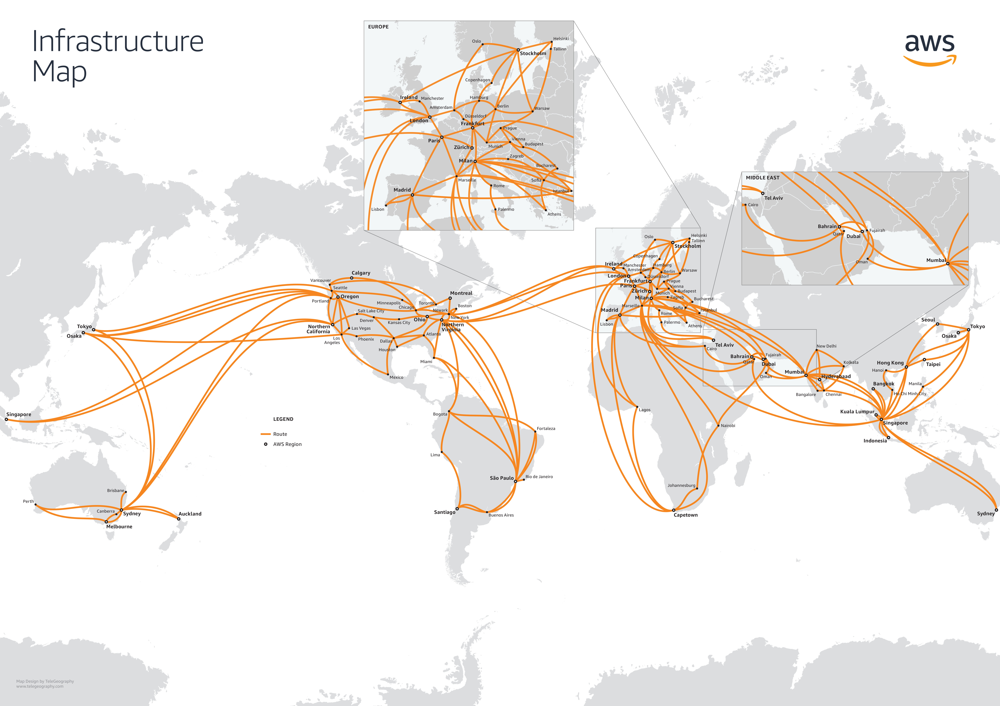

{ .cincozero .marginbottom40}

**Resultados de aprendizaje y criterios de evaluacion que se evaluarán en esta unidad.**  

| **Resultados de aprendizaje de la unidad didáctica:** |
||
| **RA. 1:** Comprende los fundamentos de la computación en la nube, sus ventajas frente a sistemas tradicionales, el marco de adopción, los principios de migración y los aspectos clave de facturación, como estimación y optimización de costos.|  

|**Criterios de evaluación de la unidad didáctica:**|
||
|**c)** Se ha participado en actividades relacionadas con el ecosistema de servicios en la nube.|

## 1- Orígenes de AWS

**Amazon Web Services (AWS)** nació como una rama de Amazon enfocada en ofrecer servicios tecnológicos a otras empresas.

Sus orígenes se remontan a principios de la década de 2000, cuando Amazon, como compañía de comercio electrónico, enfrentaba el reto de escalar su infraestructura interna para manejar millones de usuarios y grandes volúmenes de datos.

- **2000-2002** Amazon tenía una infraestructura muy fragmentada. Cada equipo desarrollaba sus propias herramientas, lo que generaba ineficiencias. Para resolverlo, comenzaron a crear una plataforma interna estandarizada de servicios reutilizables.  

- **2002** Amazon decidió abrir parte de estas capacidades a desarrolladores externos a través de APIs (por ejemplo, para su marketplace). Esto sentó las bases del concepto de ofrecer “servicios como producto”.

- **2003** Durante una reunión ejecutiva, se planteó la visión de ofrecer a terceros la misma infraestructura que Amazon usaba internamente, pero como un servicio en la nube. Esto incluía cómputo, almacenamiento y bases de datos bajo demanda.  

- **2004** Se desarrollaron servicios iniciales como S3 (Simple Storage Service) y EC2 (Elastic Compute Cloud). El objetivo era ofrecer recursos bajo demanda, pagados por uso.  

- **2006** Lanzamiento oficial, AWS se lanzó al público con S3 y EC2, marcando el nacimiento de la nube moderna. A partir de ahí, fue añadiendo más servicios como RDS (base de datos relacional), CloudFront (CDN) y otros.  

- **2025** Servicios ofrecidos por AWS en la actualidad.  
[{.margintop10}](https://docs.aws.amazon.com/whitepapers/latest/aws-overview/amazon-web-services-cloud-platform.html?pg=cloudessentials)

Buscador de productos [aquí](https://aws.amazon.com/es/products/).

## 2- Infraestructura global de AWS

{.margintop10}

### 2.1 Definición

- La infraestructura global de AWS es el conjunto de componentes físicos y lógicos que AWS ha desplegado en todo el mundo para ofrecer sus servicios en la nube de forma segura, escalable y de baja latencia.  

- Está diseñada para que los clientes puedan ejecutar aplicaciones y almacenar datos cerca de sus usuarios finales, cumpliendo requisitos de disponibilidad, redundancia y cumplimiento normativo.

- Sus principales elementos son las **regiones** y las **zonas de disponibilidad** pero no son los únicos, otros elementos como las **zonas locales** los **outposts** y **puntos de presencia** también forman parte de la infraestructura global de AWS.

- Más información [aquí](https://aws.amazon.com/es/about-aws/global-infrastructure/).

### 2.2 Regiones globales (Regions)

- Es la forma que tiene AWS de segmentar el planeta para prestar sus servicios.
- Son ubicaciones físicas en todo el mundo que agrupan varios centros de datos repartidos por **regiones geográficas**.
- Cada región **es independiente** y está aislada de las demás regiones.

- Regiones de cobertura de AWS en Europa.  
{.marco .margintop10}

- Más información [aquí](https://aws.amazon.com/es/about-aws/global-infrastructure)

!!! question "Cuántas regiones globales tiene AWS?"

### 2.3 Regiones geográficas

{.marco .margintop10}

AWS agrupa sus regiones en grandes áreas geográficas (a veces llamadas "geografías" o "partitions"):

Dentro de cada región global, encontraremos una serie de regiones geograficas como la lista de aquí abajo.

- América del Norte: EE. UU. (este y oeste), Canadá, México.
- América del Sur: Brasil.
- Europa: Irlanda, Londres, Fráncfort, París, Estocolmo, Milán, España, Zúrich.
- Oriente Medio: Baréin, Emiratos Árabes Unidos (Dubái).
- África: Sudáfrica (Ciudad del Cabo).
- Asia-Pacífico: Tokio, Seúl, Singapur, Sídney, Mumbai, Hong Kong, Yakarta, entre otras.
- China: Pekín y Ningxia (operadas de forma independiente por socios locales debido a la normativa china).
- AWS GovCloud: regiones aisladas destinadas a agencias gubernamentales de EE. UU. con requisitos especiales de cumplimiento (ITAR, FedRAMP, etc.).

Esta clasificación permite a los clientes elegir la región más adecuada según latencia, cumplimiento normativo o residencia de datos, sin necesidad de que exista una jerarquía real entre las regiones (todas son independientes entre sí, aunque estén agrupadas conceptualmente por continente).

Al igual que las regiones, **las regiones geográficas son independientes las unas de las otras**.  

### 2.4 Zonas de Disponibilidad (Availability Zones, AZs)

- Cada región geográfica contiene dos o más **zonas de disponibilidad (AZ)**.

- Una AZ es **un conjunto de uno o más centros de datos independientes**, con energía, refrigeración y redes redundantes.

- Dentro de una región de AWS, las **Zonas de Disponibilidad (AZs)** están conectadas mediante **enlaces privados de alta velocidad y baja latencia**, lo que permite replicar datos y distribuir cargas de trabajo entre ellas. Al mismo tiempo, cada AZ está **físicamente separada** (generalmente en ubicaciones distintas) para reducir el riesgo de que un único evento (fallo eléctrico, desastre natural, etc.) afecte a todas las AZs de la región.  

- Esto es lo que permite a AWS ofrecer **alta disponibilidad**, **tolerancia a fallos** y **recuperación ante desastres**.

- Zonas de disponibilidad para la región de AWS España.  
{.margintop10 .marco}

Más información sobre regiones, regiones geográficas y zonas de disponibilidad [aquí](https://docs.aws.amazon.com/es_es/global-infrastructure/latest/regions/aws-regions.html)

!!! question "Preguntas"
    - ¿Cómo se llama la región de AWS para España?
    - ¿Cuantas zonas de disponibilidad tiene la región 'España'?
    - ¿Dónde se encuentran ubicadas las zonas de disponibilidad de AWS en España?  

### 2.5 Zonas locales (local zones)

- Las **local zones de AWS** son un tipo de infraestructura que ubica servicios de AWS **cerca de grandes centros de población e industria**. Por ejemplo, se pueden usar servicios como computación y almacenamiento en la zona local para aplicaciones que requieren unas latencias ultrabajas.

- Las **zonas locales** cuentan con entrada y salida de internet a nivel local para reducir la latencia, pero también están conectadas a su **Región principal** a través de la red privada de Amazon. Esto proporciona a las aplicaciones que se ejecutan en las Zonas locales de AWS un acceso rápido, seguro y fluido a todos los servicios disponibles en esa región.

- Zonas locales actuales (2025).  
{.margintop20 .marco}

Más info sobre las zonas locales [aquí](https://aws.amazon.com/es/about-aws/global-infrastructure/localzones).

### 2.6 AWS Outposts

{.margintop20 .original}

- **AWS Outposts** es una familia de soluciones que llevan la infraestructura y los servicios de AWS a prácticamente **cualquier entorno local (on-premise)** (o edge location).

- Las soluciones de Outposts permiten extender y ejecutar servicios nativos de AWS **en las instalaciones del cliente**, y están disponibles en una variedad de formatos, desde servidores Outposts de 1U y 2U, hasta racks de 42U y despliegues de múltiples racks.

- Con AWS Outposts, se pueden ejecutar servicios de AWS de forma local y conectarte a una amplia gama de servicios disponibles en la Región principal de AWS.

- Más info [aquí](https://aws.amazon.com/es/outposts/)

### 2.7 Points of presence (PoPs)

1. **Los Points of Presence (PoPs)** de AWS son ubicaciones físicas distribuidas en todo el mundo que AWS utiliza para acercar el contenido y los servicios a los usuarios finales, reduciendo la latencia y mejorando el rendimiento.

1. Dentro de los PoPs se incluyen dos tipos principales:

      1. **Edge Locations** (Ubicaciones de borde)  
      A diferencia de las Regiones y Zonas de Disponibilidad (AZ), que son centros de datos completos, las Edge locations son centros de datos más pequeños y están distribuidos geográficamente más cerca de los usuarios finales.
      1. **Regional Edge Caches**  
      Son cachés de contenido más grandes que se ubican entre las Edge Locations y las regiones principales.
      Sirven para reducir la carga sobre las regiones al almacenar contenido que no cambia con frecuencia.

1. **Distribución física de las edge location y regional edge cachés.**
{.marco .original .margintop10 }

1. Más info [aquí](https://docs.aws.amazon.com/whitepapers/latest/aws-fault-isolation-boundaries/points-of-presence.html)

### 2.8 Red troncal global (AWS Global Network)

{ .original .marco .margintop10}

- Conecta todas las regiones, AZs y puntos de presencia a través de una red privada de alta capacidad y baja latencia.
- Esto evita depender del Internet Público para la comunicación interna.
- Más información sobre la red troncal de AWS [aquí](https://aws.amazon.com/es/blogs/networking-and-content-delivery/demystifying-aws-data-transfer-services-to-build-secure-and-reliable-applications/).

## 3 Tarea - RA1-CEc

!!! exercise "Responder a las siguientes preguntas. Podeís acceder a cualquier recurso pero es importante que la redacción sea personal."  
    !!! question "Regiones y zonas de disponibilidad"  
        - ¿Qué es una región de AWS?
        - ¿Qué es una zona de disponibilidad (AZ)?
        - ¿Por qué AWS no recomienda desplegar todo en una sola AZ?

    !!! question "Mapa de regiones:"  
        - Usando el sitio oficial [AWS Global Infrastructure](https://aws.amazon.com/about-aws/global-infrastructure/), localizad **al menos 5 regiones** de AWS en distintos continentes.
        - Anotad:

            1. Nombre de la región (ej. *eu-west-1*).
            1. Ciudad/país aproximado.
            1. Número de zonas de disponibilidad disponibles en esa región.

    !!! question "Caso práctico:"  
        Una empresa de streaming quiere dar servicio a usuarios en Europa, América y Asia.

           1. ¿Qué regiones escogeríais para desplegar la aplicación y por qué?
           1. ¿Cómo distribuiríais los recursos entre varias AZs para garantizar **alta disponibilidad**?
           1. ¿Qué riesgos tendría concentrar la infraestructura en una sola región?

    !!! warning "Condiciones de la entrega."  
        Subir el documento con vuestras respuestas a la tarea RA1-CEc de Aules.

## 4 Enlaces de interés

[Canal de YT de AWS](https://www.youtube.com/user/AmazonWebServices/Cloud)  
[Wikipedia](https://es.wikipedia.org/wiki/Amazon_Web_Services)  
[Infraestructura global de AWS](https://aws.amazon.com/es/about-aws/global-infrastructure)  
[whitepapers de AWS infraestructure](https://docs.aws.amazon.com/whitepapers/latest/aws-fault-isolation-boundaries/aws-infrastructure.html)
