{ .sietecinco }
<br>

## **Preliminares**
Descargar una distribución de **Linux ligera** (Lubuntu, Mint) e instalarla sobre una máquina virtual.

## **Learner Lab**
### **Invitación a Learner Lab** 
En vuestros **correos corporativos** habréis recibido un mensaje de **AWS Academy**.

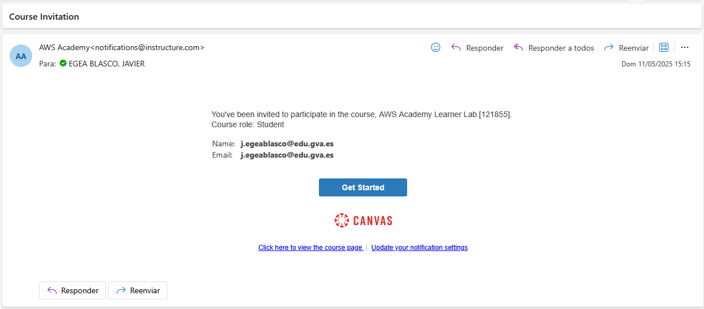

Si habéis recibido ese correo, significa que se os ha dado de alta en un laboratorio (Leaner Lab) donde haremos la formación del curso.  
Este laboratorio cuenta con un presupuesto de 50$. Como lo veremos a lo largo del curso, convendrá **administrarlo correctamente**.  
Si se excede el límite de 50$, el acceso quedará bloqueado y no será posible recuperar los trabajos realizados en él.

### **Registro en AWS Academy**
1. Hacer click en **Comenzar** y registraros en el servicio que se indica.
1. Luego os saldrá una ventana que os pedirá de acceder a vuestra cuenta de **Canvas**.  
Si no tenéis cuenta de Canvas, pinchar en **Create my account**.  
<br>
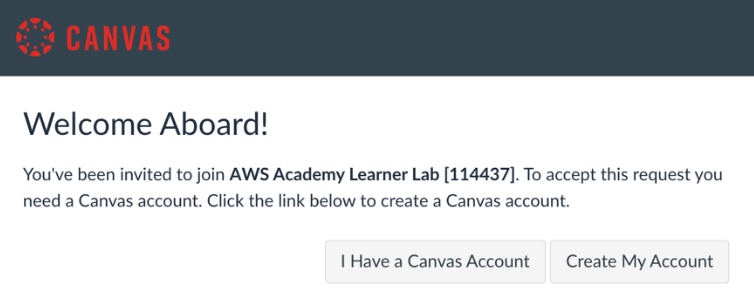{ .cincozero }
<br>

1. Un vez registrados, podréis acceder a vuestra cuenta de AWS Academy.  
<br>
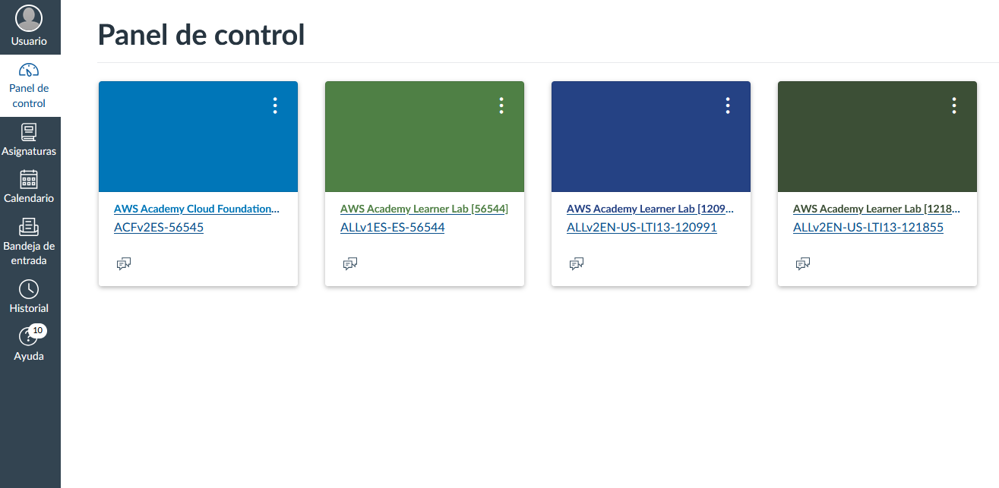{ .cincozero }

### **Acceso al curso**
Pinchar en el curso. Si es la primera vez que usáis el **Learner Lab** sólo os aparecerá un curso.   
<br>
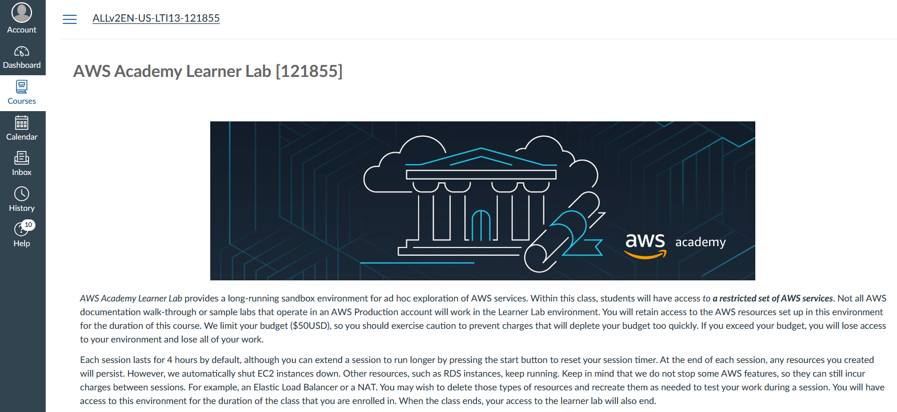{ .cincozero }
<br>

### **Acceder al laboratorio**
1. Seguir el enlace **Launch AWS Acedemy Leaner Lab**.  
<br>
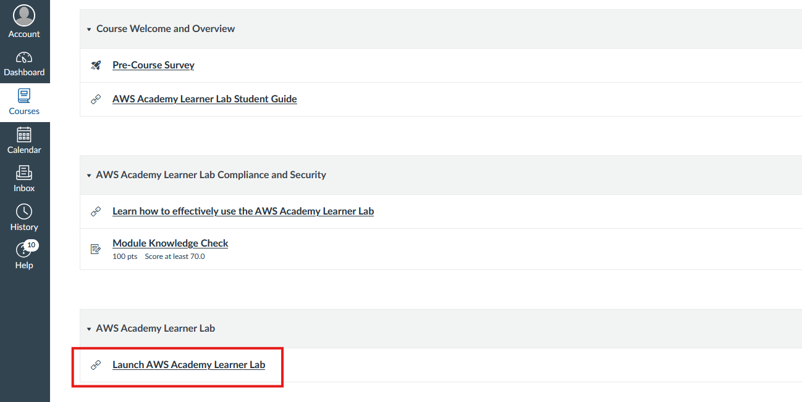{ .cien }
<br>  

1. El siguiente paso será lanzar el laboratorio de AWS.  
Previamente tendremos que conceder permisos y decir que nos hemos leído los términos
de uso.  
<br>
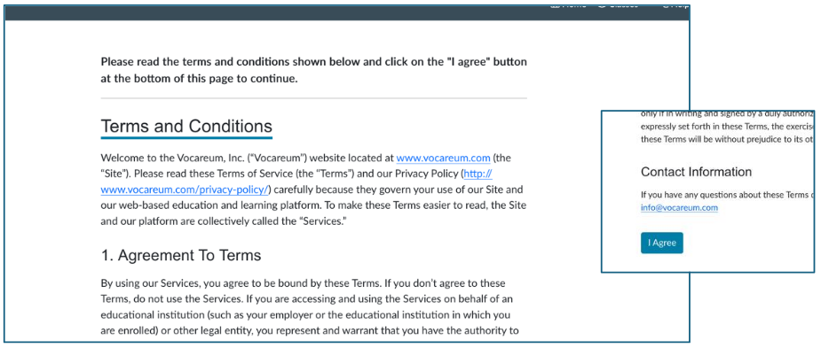{ .cincozero }
<br>

1. Una vez aceptados los términos y condiciones, esperar a que aparezca el spinner de **vocareum**  
<br>
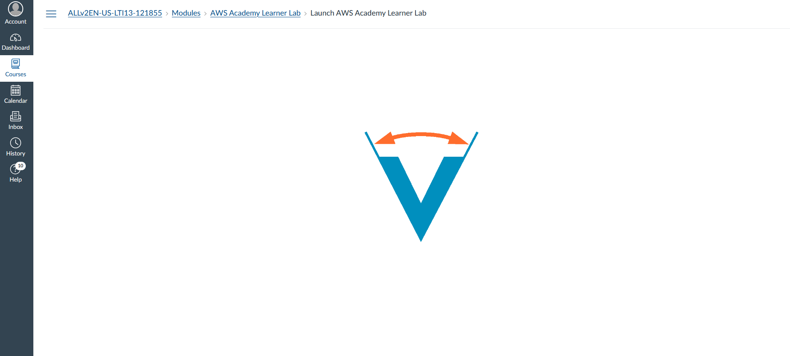{ .cincozero }
<br>  

1. Si todo ha ido bien, accederemos al **Learner Lab**.  
<br>
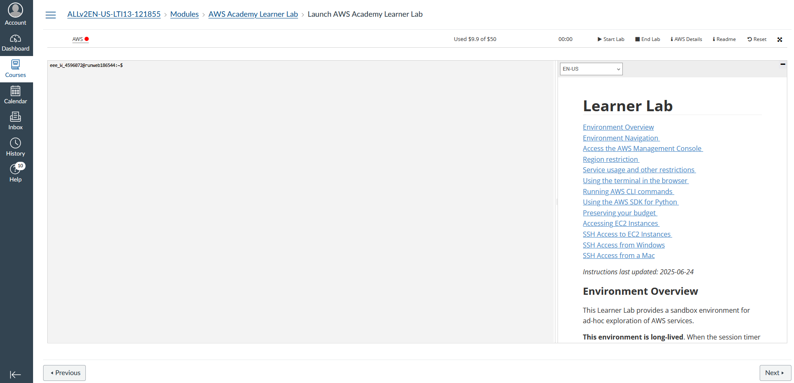{ .cien }
<br>  

### **Lanzar el laboratorio**
Para poder acceder a la consola de AWS y poder empezar a usar sus servicios pulsaremos **Start Lab**.  
Una vez iniciado, dispondremos de una sesión de 4 horas de duración para hacer las prácticas. Si vemos que nos vamos a quedar cortos de tiempo, siempre podremos pulsar de nuevo **Start Lab** antes de que finalicen las 4 horas.  

<br>
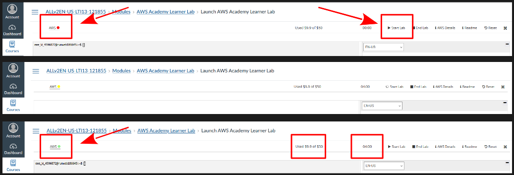
<br> 

**Consecuencias de apurar el tiempo del learner lab:**  
1. Se cierra la sesión al llegar al tiempo máximo autorizado.  
2. Todas los servicios se paran, es decir, **dejamos de pagar por utilizarlos**.   
3. **Seguimos pagando por tener creados esos servicios**. Por lo cual, durante las prácticas, **siempre** se deberá eliminar los **servicios** que ya no utilizaremos. 

## **Panel de AWS**
Una vez que el enlace de AWS haya pasado a **color verde**, hacemos clic en él y accederemos al panel de control de AWS.


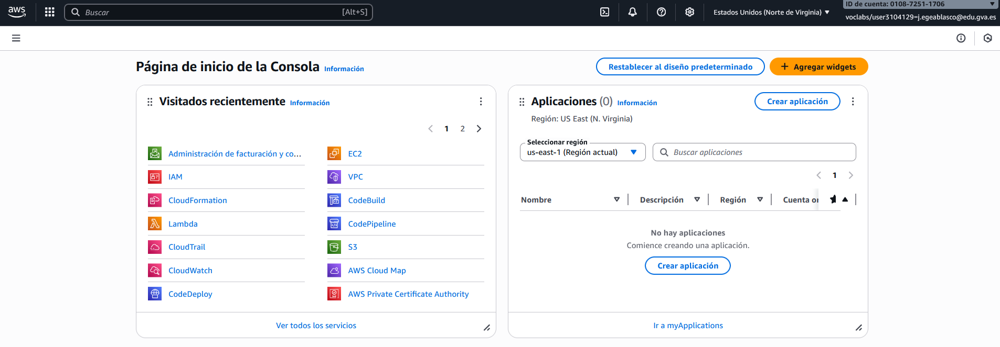
<br>  

!!! Exercice "Ejercicio 1"  
    Localizar vuestras credenciales de usuario.

!!! Exercice "Ejercicio 2"  
    ¿En qué región nos encontramos nada más acceder con nuestra cuenta de alumno a AWS?    
    ¿Podemos acceder a otras regiones como, por ejemplo, España (Madrid)?
    ¿Podemos ver las zonas de disponibilidad dentro de la región que tenemos asignada?

## **Tarea 1 - Creación de una alerta de costes**
Ir a **Administración de facturación y costos** y crear una alerta de costos con las siguientes condiciones.  

1. Umbral de coste alcanzado: 5$.
2. Frecuencia de las altertas: Resúmenes semanales.

## **Instalar el cliente de AWS CLI**
AWS CLI es el cliente de AWS mediante el cual podremos utilizar la terminal para poder
trabajar con nuestro entorno. 
En el siguiente [enlace](https://docs.aws.amazon.com/es_es/cli/latest/userguide/getting-started-install.html) encontraréis las instrucciones de instalación del CLI de AWS.    

Una vez finalizada la instalación podremos comprobar la versión instalada con el comando:
```bash
~ $ aws --version
```
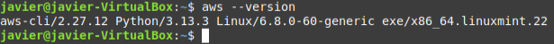{ .sietecinco }

## **Introducir las credenciales del laboratorio en el cliente de AWS**
Tenemos el **laboratorio** en marcha y el **cliente** de AWS instalado. Para poder conectarnos desde nuestra máquina a nuestro cliente de AWS (y sobre todo a los servivios que crearemos en él) necesitaremos autenticarnos. Para ello  utilizaremos las credenciales del
laboratorio para configurar nuestro cliente.

1. Credenciales del laboratorio en el apartado AWS Details.  
<br>
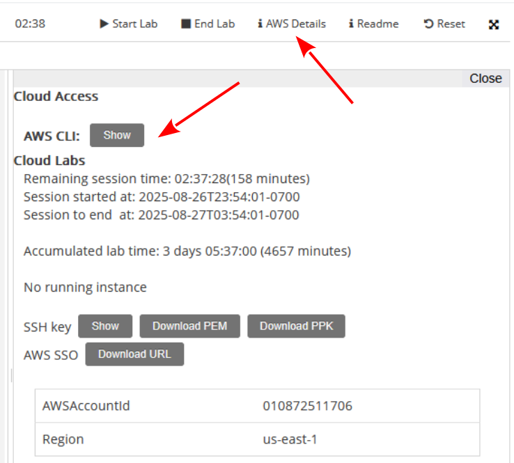{ .cincozero }  
<br>

1. Credenciales de AWS CLI  
<br>
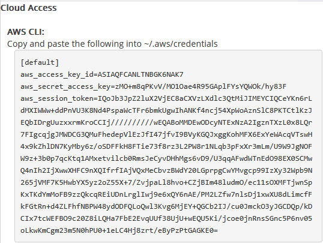{ .cincozero }  
<br>

1. Para cargar las credenciales del laboratorio en nuestra máquina usaremos **aws configure** y pondremos los datos que nos irá pidiendo.
```bash
~$ aws configure
```
<br>
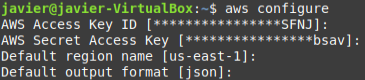{ .original }  
<br>

1. Para finalizar y poder conectarse desde nuestro cliente, haremos lo siguiente:
    - Accedemos a la carpeta **.aws** (creada con aws configure) de nuestra máquina y editamos el archivo **credentials**.  
    ```bash
    ~$ cd .aws
    ~$ .aws/nano credentials
    ```
    <br>
    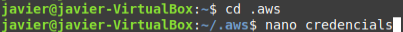{ .original }  
    <br>

    
    - A continuación borramos **todo el contenido** y copiamos **toda la información de AWS
Details**.  
<br>
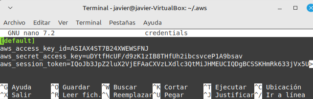{ .original }  
<br>

1. Si todo ha ido bien, al ejecutar el comando **aws sts get-caller-identity** nos devolverá:

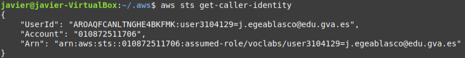{ .original }  
<br>

**Nota:**   
Habrá que repetir este proceso cada vez que cambie el token de sesión y necesitemos usar comandos de CLI desde nuestra máquina para trabajar sobre nuestra nube de AWS. No suele ser habitual, pero en caso de hacer **un reset del laboratorio** (borrado total de todo el entorno creado) es posible que haya que repetir el proceso. 

<br>
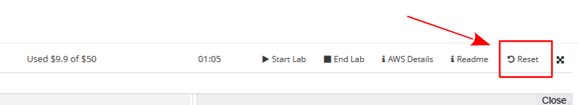{ .original }  
<br>


## Enlaces de interés
Documentación de [AWS](https://docs.aws.amazon.com).