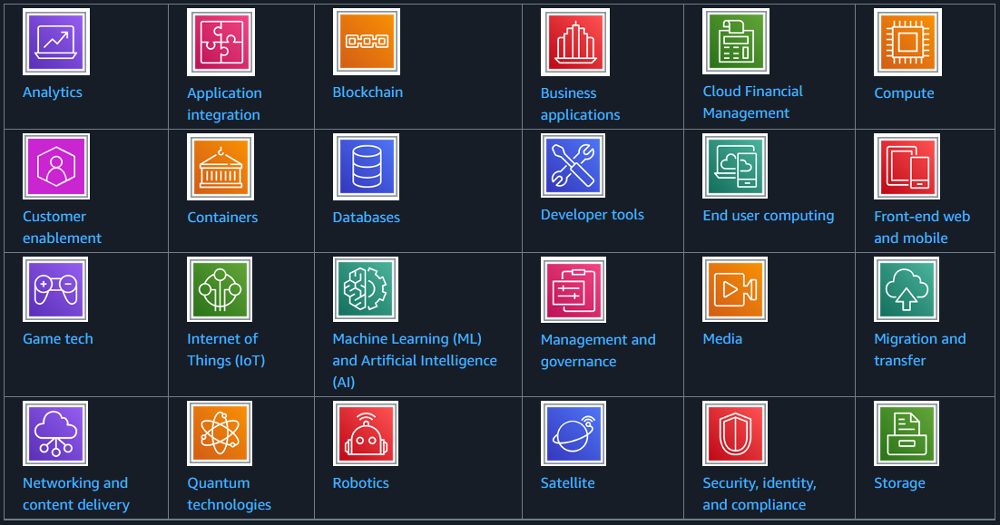
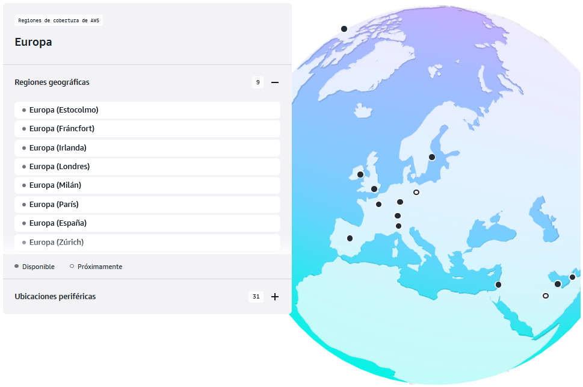
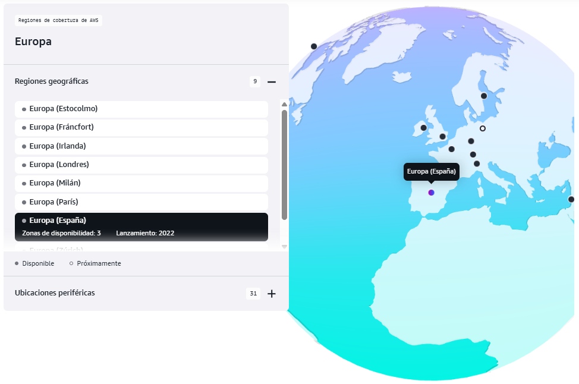
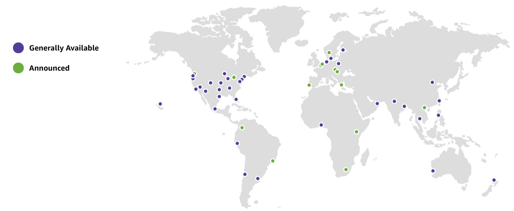
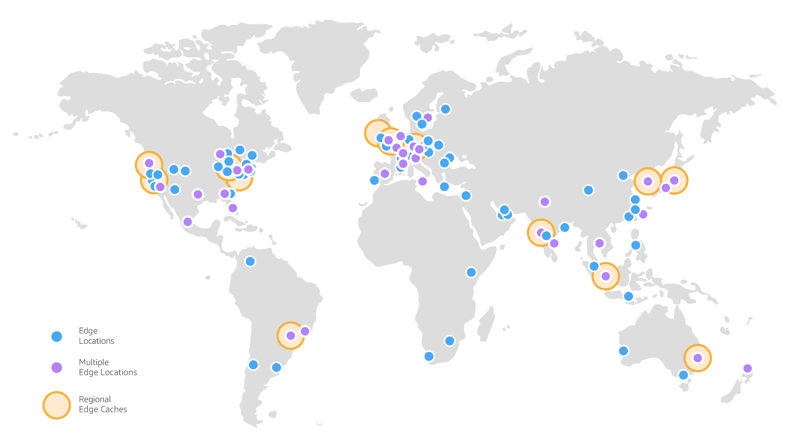

{ .cincozero }
 

## **Orígenes de AWS**
Amazon Web Services (AWS) nació como una rama de Amazon enfocada en ofrecer servicios tecnológicos a otras empresas. Sus orígenes se remontan a principios de la década de 2000, cuando Amazon, como compañía de comercio electrónico, enfrentaba el reto de escalar su infraestructura interna para manejar millones de usuarios y grandes volúmenes de datos.

- 2000-2002 Amazon tenía una infraestructura muy fragmentada. Cada equipo desarrollaba sus propias herramientas, lo que generaba ineficiencias. Para resolverlo, comenzaron a crear una plataforma interna estandarizada de servicios reutilizables.  
 
- 2002 Amazon decidió abrir parte de estas capacidades a desarrolladores externos a través de APIs (por ejemplo, para su marketplace). Esto sentó las bases del concepto de ofrecer “servicios como producto”.   
 
- 2003 Durante una reunión ejecutiva, se planteó la visión de ofrecer a terceros la misma infraestructura que Amazon usaba internamente, pero como un servicio en la nube. Esto incluía cómputo, almacenamiento y bases de datos bajo demanda.  
 
- 2004 Se desarrollaron servicios iniciales como S3 (Simple Storage Service) y EC2 (Elastic Compute Cloud). El objetivo era ofrecer recursos bajo demanda, pagados por uso.  
 
- 2006 Lanzamiento oficial, AWS se lanzó al público con S3 y EC2, marcando el nacimiento de la nube moderna. A partir de ahí, fue añadiendo más servicios como RDS (base de datos relacional), CloudFront (CDN) y otros.  
 
- 2025 Servicios ofertados por AWS en la actualidad.  
 

## **Infraestructura global de AWS**
### **Definición**
La infraestructura global de AWS es el conjunto de componentes físicos y lógicos que AWS ha desplegado en todo el mundo para ofrecer sus servicios en la nube de forma segura, escalable y de baja latencia.  

Está diseñada para que los clientes puedan ejecutar aplicaciones y almacenar datos cerca de sus usuarios finales, cumpliendo requisitos de disponibilidad, redundancia y cumplimiento normativo.

Sus principales elementos son las **regiones** y las **zonas de disponibilidad** pero no son los únicos, otros elementos como las **zonas locales** los **outposts** y **puntos de presencia** también forman parte de la infraestructura global de AWS.

### Regiones (Regions)
Son ubicaciones físicas en todo el mundo que agrupan varios centros de datos.
Cada región **es independiente** y está aislada de las demás.

Regiones de cobertura de AWS en Europa.  
 

[Regiones de AWS](https://aws.amazon.com/es/about-aws/global-infrastructure)

### Zonas de Disponibilidad (Availability Zones, AZs)
Cada región contiene dos o más zonas de disponibilidad (AZ).

Una AZ es un conjunto de uno o más centros de datos independientes, con energía, refrigeración y redes redundantes.

Dentro de una región de AWS, las **Zonas de Disponibilidad (AZs)** están conectadas mediante **enlaces privados de alta velocidad y baja latencia**, lo que permite replicar datos y distribuir cargas de trabajo entre ellas. Al mismo tiempo, cada AZ está **físicamente separada** (generalmente en ubicaciones distintas) para reducir el riesgo de que un único evento (fallo eléctrico, desastre natural, etc.) afecte a todas las AZs de la región.  
Esto es lo que permite a AWS ofrecer **alta disponibilidad**, **tolerancia a fallos** y **recuperación ante desastres**.

Zonas de disponibilidad para la región de AWS España.  
 

### Zonas locales (local zones)
Las **local zones de AWS** son un tipo de infraestructura que ubica servicios de AWS **cerca de grandes centros de población e industria**. Por ejemplo, se pueden usar servicios como computación y almacenamiento en la zona local para aplicaciones que requieren unas latencias ultrabajas.

Las **zonas locales** cuentan con entrada y salida de internet a nivel local para reducir la latencia, pero también están conectadas a su **Región principal** a través de la red privada de Amazon. Esto proporciona a las aplicaciones que se ejecutan en las Zonas locales de AWS un acceso rápido, seguro y fluido a todos los servicios disponibles en esa región.

Zonas locales actuales (2025).  
 

Más info sobre las zonas locales [aquí](https://aws.amazon.com/es/about-aws/global-infrastructure/localzones).

### AWS Outposts
**AWS Outposts** es una familia de soluciones que llevan la infraestructura y los servicios de AWS a prácticamente **cualquier entorno local (on-premise)** (o edge location). 

Las soluciones de Outposts permiten extender y ejecutar servicios nativos de AWS **en las instalaciones del cliente**, y están disponibles en una variedad de formatos, desde servidores Outposts de 1U y 2U, hasta racks de 42U y despliegues de múltiples racks.

Con AWS Outposts, se pueden ejecutar servicios de AWS de forma local y conectarte a una amplia gama de servicios disponibles en la Región principal de AWS. 

Más info [aquí](https://aws.amazon.com/es/outposts/)

### Points of presence (PoPs)
**Los Points of Presence (PoPs)** de AWS son ubicaciones físicas distribuidas en todo el mundo que AWS utiliza para acercar el contenido y los servicios a los usuarios finales, reduciendo la latencia y mejorando el rendimiento.

Dentro de los PoPs se incluyen dos tipos principales:

1. **Edge Locations** (Ubicaciones de borde)  
A diferencia de las Regiones y Zonas de Disponibilidad (AZ), que son centros de datos completos, las Edge locations son centros de datos más pequeños y están distribuidos geográficamente más cerca de los usuarios finales.
1. **Regional Edge Caches**  
Son cachés de contenido más grandes que se ubican entre las Edge Locations y las regiones principales.
Sirven para reducir la carga sobre las regiones al almacenar contenido que no cambia con frecuencia.

 
**Distribución física de las edge location y regional cachés.**

Más info [aquí](https://docs.aws.amazon.com/whitepapers/latest/aws-fault-isolation-boundaries/points-of-presence.html)

### Red troncal global (AWS Global Network)
Conecta todas las regiones, AZs y puntos de presencia a través de una red privada de alta capacidad y baja latencia.
Esto evita depender exclusivamente de Internet público para la comunicación interna.

## Enlaces de interés
[Canal de YT de AWS](https://www.youtube.com/user/AmazonWebServices/Cloud)  
[Wikipedia](https://es.wikipedia.org/wiki/Amazon_Web_Services)  
[Infraestructura global de AWS](https://aws.amazon.com/es/about-aws/global-infrastructure)  
[whitepapers de AWS infraestructure](https://docs.aws.amazon.com/whitepapers/latest/aws-fault-isolation-boundaries/aws-infrastructure.html)