# **UT. 3 - AWS Academy y control de costos**

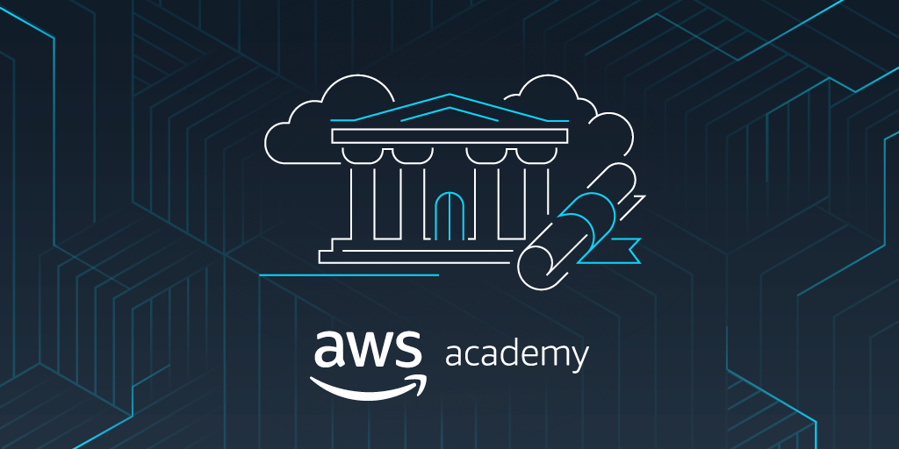{ .sietecinco }

<br>

**Resultados de aprendizaje y criterios de evaluacion que se evaluarán en esta unidad.**  

| **Resultados de aprendizaje de la unidad didáctica:** |
|-|
| **RA. 1:** Comprende los fundamentos de la computación en la nube, sus ventajas frente a sistemas tradicionales, el marco de adopción, los principios de migración y los aspectos clave de facturación, como estimación y optimización de costos.|  


|**Criterios de evaluación de la unidad didáctica:**|
||
|**d)** Se han identificado los principios básicos de la facturación y costos en la nube.|
|**e)** Se ha hecho uso correcto de herramientas para estimar y gestionar presupuestos.| 

<br>


## **1 - Preliminares**
Descargar una distribución de **Linux ligera** (Lubuntu, Mint) e instalarla sobre una máquina virtual.

## **2 - Learner Lab**
### **2.1 - Invitación a Learner Lab** 
En vuestros **correos corporativos** habréis recibido un mensaje de **AWS Academy**.

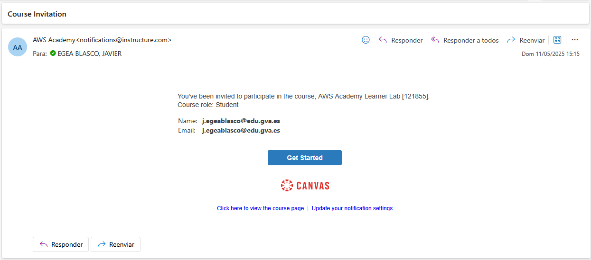

Si habéis recibido ese correo, significa que se os ha dado de alta en un laboratorio (Leaner Lab) donde haremos la formación del curso.  
Este laboratorio cuenta con un presupuesto de 50$. Como lo veremos a lo largo del curso, convendrá **administrarlo correctamente**.  
Si se excede el límite de 50$, el acceso quedará bloqueado y no será posible recuperar los trabajos realizados en él.

### **2.2 - Registro en AWS Academy**
1. Hacer click en **Comenzar** y registraros en el servicio que se indica.
1. Luego os saldrá una ventana que os pedirá de acceder a vuestra cuenta de **Canvas**.  
Si no tenéis cuenta de Canvas, pinchar en **Create my account**.  
<br>
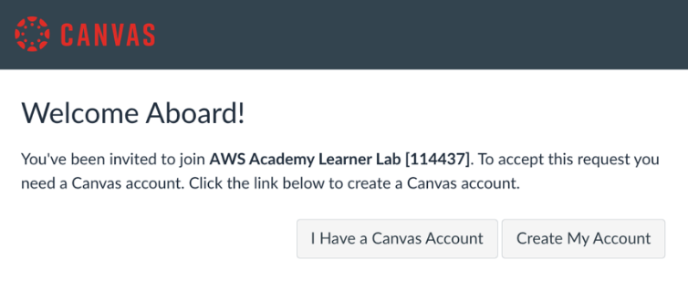{ .cincozero }
<br>

1. Un vez registrados, podréis acceder a vuestra cuenta de AWS Academy.  
<br>
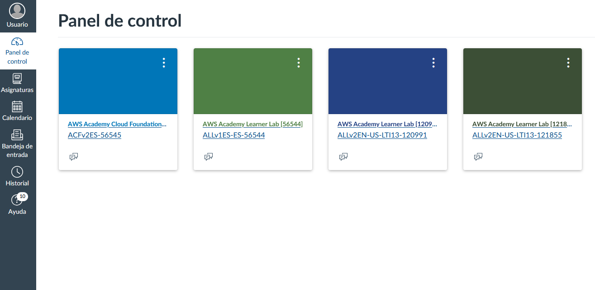{ .cincozero }

### **2.3 - Acceso al curso**
Pinchar en el curso. Si es la primera vez que usáis el **Learner Lab** sólo os aparecerá un curso.   
<br>
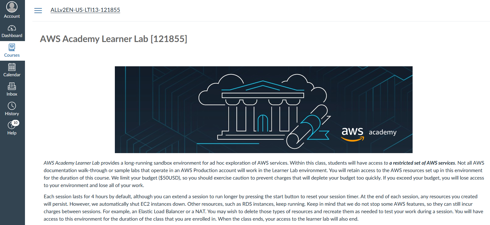{ .cincozero }
<br>

### **2.4 - Acceder al laboratorio**
1. Seguir el enlace **Launch AWS Acedemy Leaner Lab**.  
<br>
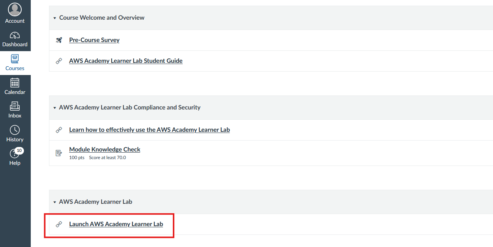{ .cien }
<br>  

1. El siguiente paso será lanzar el laboratorio de AWS.  
Previamente tendremos que conceder permisos y decir que nos hemos leído los términos
de uso.  
<br>
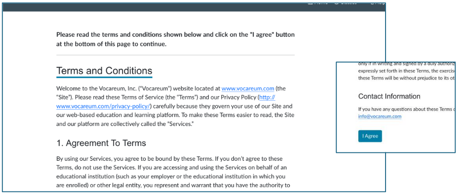{ .cincozero }
<br>

1. Una vez aceptados los términos y condiciones, esperar a que aparezca el spinner de **vocareum**  
<br>
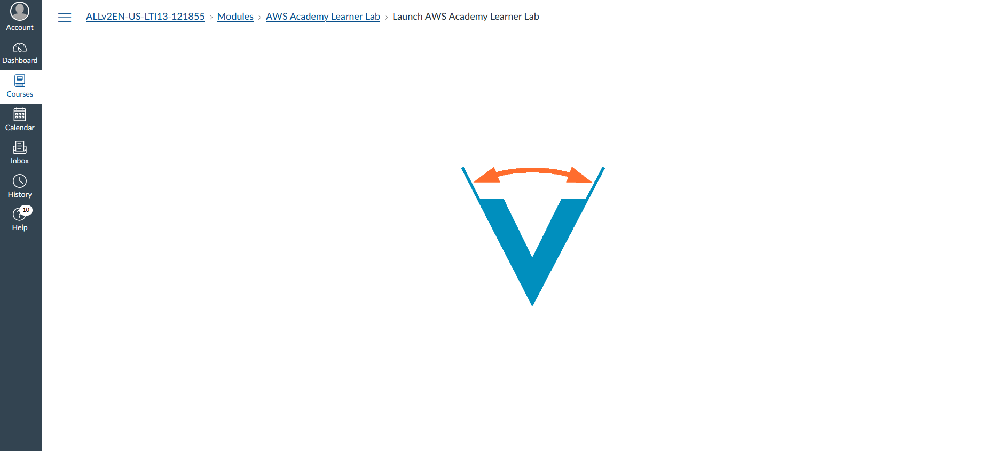{ .cincozero }
<br>  

1. Si todo ha ido bien, accederemos al **Learner Lab**.  
<br>
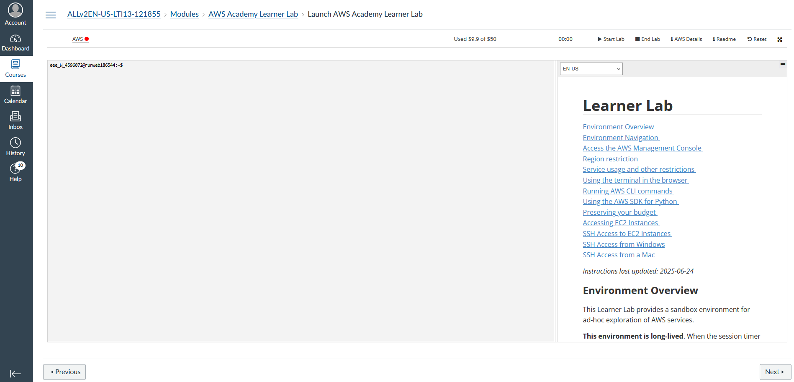{ .cien }
<br>  

### **2.5 - Lanzar el laboratorio**
Para poder acceder a la consola de AWS y poder empezar a usar sus servicios pulsaremos **Start Lab**.  
Una vez iniciado, dispondremos de una sesión de 4 horas de duración para hacer las prácticas. Si vemos que nos vamos a quedar cortos de tiempo, siempre podremos pulsar de nuevo **Start Lab** antes de que finalicen las 4 horas.  

<br>
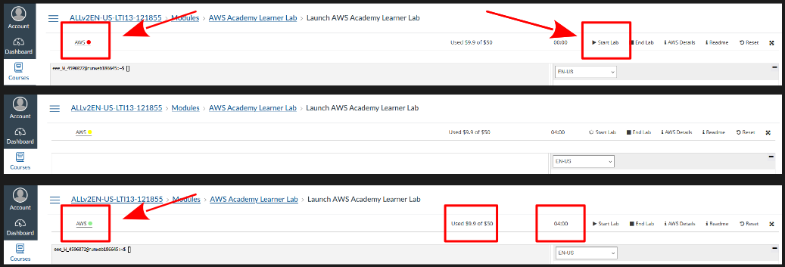
<br> 

**Consecuencias de apurar el tiempo del learner lab:**  
1. Se cierra la sesión al llegar al tiempo máximo autorizado.  
2. Todas los servicios se paran, es decir, **dejamos de pagar por utilizarlos**.   
3. **Seguimos pagando por tener creados esos servicios**. Por lo cual, durante las prácticas, **siempre** se deberá eliminar los **servicios** que ya no utilizaremos. 

### **2.6 - Panel de AWS**
Una vez que el enlace de AWS haya pasado a **color verde**, hacemos clic en él y accederemos al panel de control de AWS.


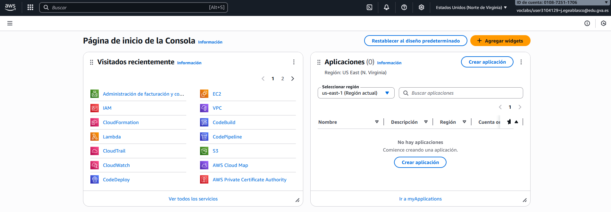
<br>  

!!! Exercice "Ejercicio 1"  
    Localizar vuestras credenciales de usuario.

!!! Exercice "Ejercicio 2"  
    ¿En qué región nos encontramos nada más acceder con nuestra cuenta de alumno a AWS?    
    ¿Podemos acceder a otras regiones como, por ejemplo, España (Madrid)?
    ¿Podemos ver las zonas de disponibilidad dentro de la región que tenemos asignada?


### **2.7 - Instalar el cliente de AWS CLI**
AWS CLI es el cliente de AWS mediante el cual podremos utilizar la terminal para poder
trabajar con nuestro entorno. 
En el siguiente [enlace](https://docs.aws.amazon.com/es_es/cli/latest/userguide/getting-started-install.html) encontraréis las instrucciones de instalación del CLI de AWS.    

Una vez finalizada la instalación podremos comprobar la versión instalada con el comando:
```bash
~ $ aws --version
```
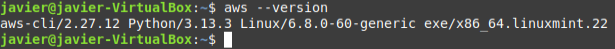{ .sietecinco }

### **2.8 - Introducir las credenciales del laboratorio en el cliente de AWS**
Tenemos el **laboratorio** en marcha y el **cliente** de AWS instalado. Para poder conectarnos desde nuestra máquina a nuestro cliente de AWS (y sobre todo a los servivios que crearemos en él) necesitaremos autenticarnos. Para ello  utilizaremos las credenciales del
laboratorio para configurar nuestro cliente.

1. Credenciales del laboratorio en el apartado AWS Details.  
<br>
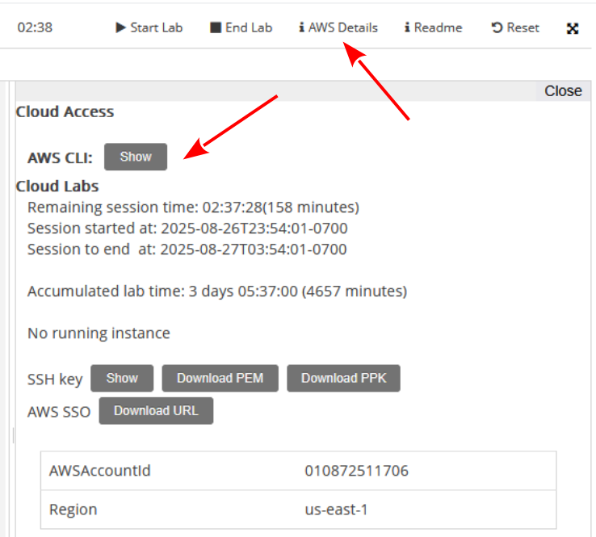{ .cincozero }  
<br>

1. Credenciales de AWS CLI  
<br>
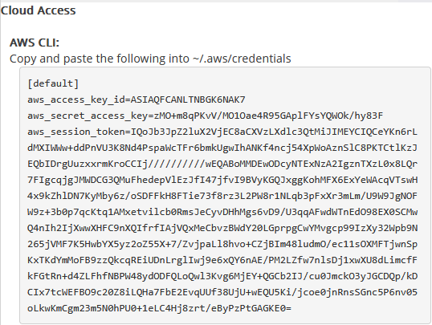{ .cincozero }  
<br>

1. Para cargar las credenciales del laboratorio en nuestra máquina usaremos **aws configure** y pondremos los datos que nos irá pidiendo.
```bash
~$ aws configure
```
<br>
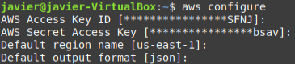{ .original }  
<br>

1. Para finalizar y poder conectarse desde nuestro cliente, haremos lo siguiente:
    - Accedemos a la carpeta **.aws** (creada con aws configure) de nuestra máquina y editamos el archivo **credentials**.  
    ```bash
    ~$ cd .aws
    ~$ .aws/nano credentials
    ```
    <br>
    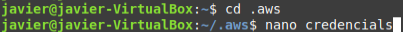{ .original }  
    <br>

    
    - A continuación borramos **todo el contenido** y copiamos **toda la información de AWS
Details**.  
<br>
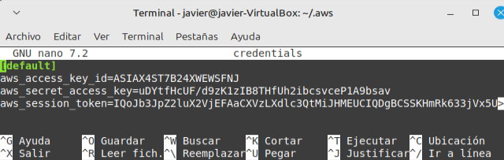{ .original }  
<br>

1. Si todo ha ido bien, al ejecutar el comando **aws sts get-caller-identity** nos devolverá:

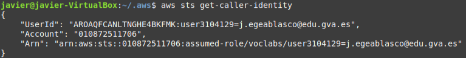{ .original }  
<br>

**Nota:**   
Habrá que repetir este proceso cada vez que cambie el token de sesión y necesitemos usar comandos de CLI desde nuestra máquina para trabajar sobre nuestra nube de AWS. No suele ser habitual, pero en caso de hacer **un reset del laboratorio** (borrado total de todo el entorno creado) es posible que haya que repetir el proceso. 

<br>
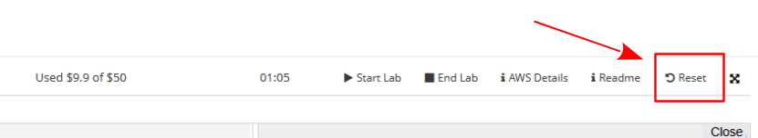{ .original }  
<br>

### **2.9 - Cerrar el Learner Lab**
Para cerrar el **Learner Lab** basta con pulsar el botón de **End Lab**.  
Todos los servicios que tengamos se detendrán pero **seguirán existiendo y AWS nos facturará por tenerlos**.

<br>
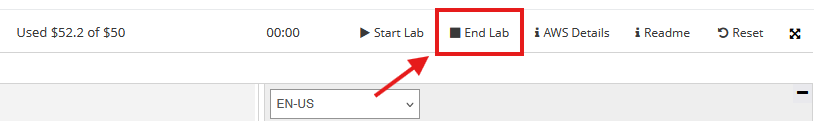{ .original }  
<br>

## **3 - Costes de los servicios en AWS (y de la nube en general)**
En AWS **la facturación y la optimización de costos** son dos áreas básicas que todo usuario debe conocer para **evitar sorpresas en la factura** y aprovechar mejor los recursos. 

### **3.1 - Conceptos básicos para la administración de costes en AWS**

* **Modelo de pago por uso**  
  Solo se paga por los recursos que se consumen (horas de cómputo, GB almacenados, transferencias de datos...).

* **Niveles gratuitos (Free Tier)**  
  AWS ofrece un nivel gratuito con ciertos límites (por ejemplo, 750 h/mes en EC2 t2.micro durante 12 meses) para aprender y probar servicios.

* **Precios regionales**  
  El coste puede variar entre regiones.


 

### **3.2 - Planes y estrategias de uso**  
En AWS existen varios **planes y estrategias de uso** que permiten **optimizar los costes**, es decir, pagar menos por un mismo recurso. 

#### **a. Instancias bajo demanda (On-Demand)**
* Se paga por **hora o segundo de uso**, sin compromisos a largo plazo.
* **Ventaja:** flexibilidad máxima, perfecto para cargas variables o temporales.
* **Desventaja:** es más caro que otros planes si el uso es continuo.

#### **b. Instancias reservadas (Reserved Instances, RI)**
* Compromiso a usar una instancia **por 1 o 3 años**, a cambio de un **descuento significativo** (30–70 %).
* **Tipos de pago:**
    1. Pago completo por adelantado: → máximo descuento.
    1. Pago parcial: → descuento medio.
    1. Pago mensual: → descuento menor, más flexible.
* **Ventaja:** ideal para cargas estables y continuas.
* **Desventaja:** compromiso a largo plazo.

#### **c. Savings Plans**
* Son similares a las RIs, pero más **flexibles**: no se está ligado a una instancia concreta.
* Compromiso a gastar **cierta cantidad de dinero** durante 1 o 3 años para obtener descuentos.
* **Tipos:**

    1. **Compute Savings Plans:** → se aplica a cualquier tipo de instancia EC2, incluso regiones o familias distintas.
    1. **EC2 Instance Savings Plans:** → descuentos específicos para una familia de instancias en una región.  

* **Ventaja:** combina ahorro y flexibilidad.

#### **d. Instancias Spot (Spot Instances)**
* Son **instancias sobrantes de AWS** que se venden a precio reducido (hasta 90 % más barato que On-Demand).
* **Ventaja:** muy barato para cargas **flexibles o tolerantes a interrupciones**, como procesamiento batch o pruebas.
* **Desventaja:** AWS puede interrumpir la instancia si necesita la capacidad.

#### **e. Optimización de almacenamiento y servicios adicionales**  
Aunque no son “planes de uso” como tal, se combinan con ellos para reducir costes:  

* **S3 Storage Classes:** Standard, Standard-IA, Glacier → para ajustar coste según frecuencia de acceso.
* **Lifecycle policies:** mover archivos automáticamente entre tipos de almacenamiento según antigüedad.
* **Auto Scaling:** encender y apagar instancias automáticamente según demanda.

#### **f. Resumen**

| Plan/Servicio               | Cuándo usarlo                    | Descuento/ventaja principal      |
| --------------------------- | -------------------------------- | -------------------------------- |
| On-Demand                   | Uso temporal o variable          | Flexibilidad máxima              |
| Reserved Instances          | Cargas estables y continuas      | 30–70 % de descuento             |
| Savings Plans               | Uso estable pero flexible        | Ahorro y flexibilidad combinados |
| Spot Instances              | Procesos batch o interrumpibles  | Hasta 90 % más barato            |
| Optimización almacenamiento | Datos según frecuencia de acceso | Reduce costes de almacenamiento  |


### **3.3 - Consola de Billing & Cost Management**
  Desde la consola de AWS se puede:

  * Ver facturas detalladas por servicio y por región.
  * Configurar presupuestos y alertas.
  * Descargar informes para análisis.
  <br>

#### **a. Acceder al panel de facturación de AWS**
Después de iniciar sesión en su cuenta, en el menú de la cuenta, seleccione `Panel de facturación`.

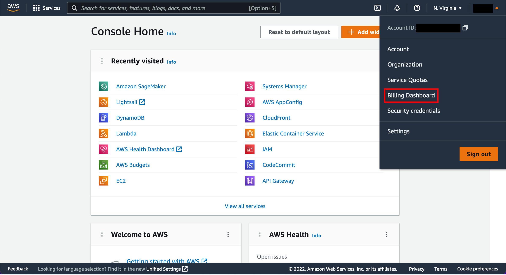{.sietecinco}

<br>

#### **b. Revisar el panel de facturación**
En la sección **Resumen de AWS**, se podrá ver un resumen de los costos del mes hasta la fecha. También se podrá ver la tendencia de los costos de los cinco servicios principales durante los tres a seis períodos de facturación cerrados más recientes. 

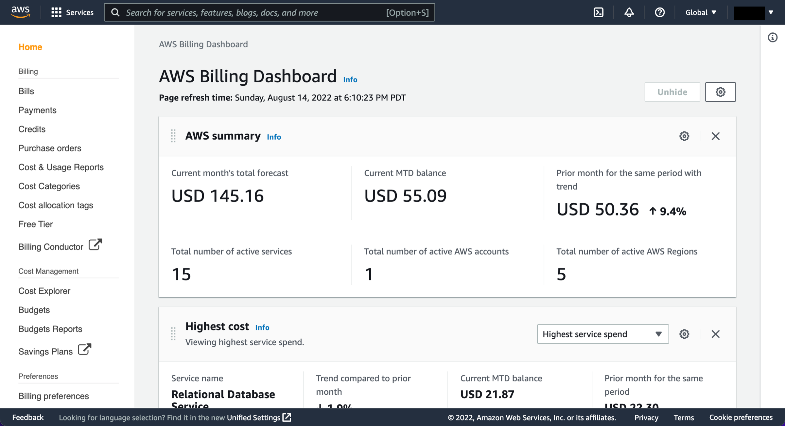{.sietecinco}

<br>

#### **c. Modificar las alertas de correo electrónico del límite de uso** 
De manera predeterminada, la mayoría de las cuentas se activan automáticamente para recibir alertas por correo electrónico respecto del límite **del nivel gratuito de AWS** cuando el uso de su servicio excede el 85 % de un límite determinado.
 
Para cambiar quién recibe estas alertas por correo electrónico, seleccione **Preferencias de facturación** en la barra de navegación izquierda.
 
Para que otras personas puedan recibir alertas de uso del nivel gratuito, agregue su dirección de correo electrónico en el campo de Dirección de correo electrónico y seleccione Guardar preferencias. 

<br>


### **3.4 - Creación de un controlador de costos básico**
En este apartado crearemos un controlador de costos en la **consola de facturación** de AWS con **AWS Budgets**. Se establecerán tres notificaciones: una por si sus costos alcanzan el 80 % de su presupuesto, otra por si se pronostica que sus costos excederán su presupuesto y otra si sus costos exceden el presupuesto asignado.

#### **a. Crear un presupuesto**
En el menú de navegación de la izquierda, seleccione **Presupuestos** y, a continuación, seleccione **Crear un presupuesto** en la página de la consola de AWS Budgets. 

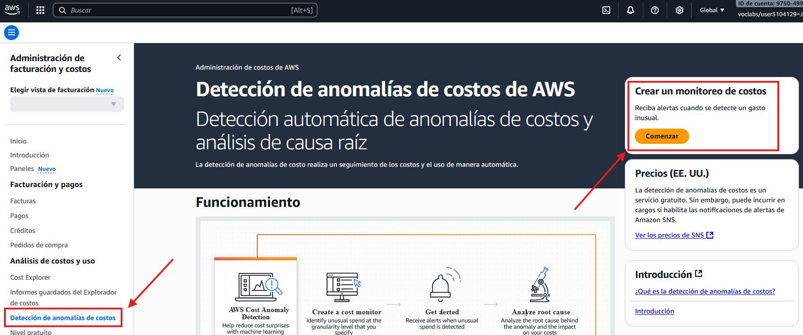{.sietecinco}

<br>

#### **b. Elejir el tipo de presupuesto**
En la página **Elegir tipo de presupuesto**, elija **Presupuesto de costos** en Tipos de presupuesto.

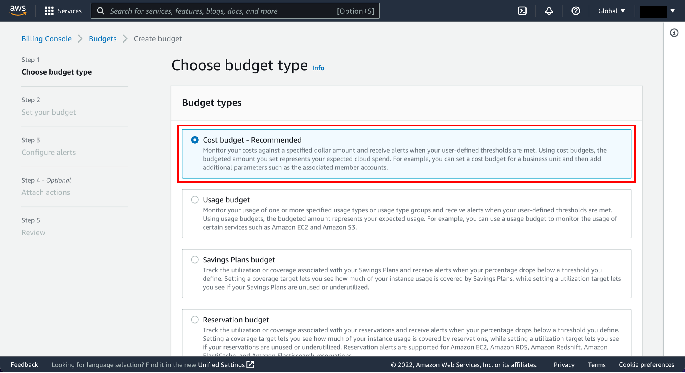{.sietecinco}

<br>

#### **c. Establecer los detalles del presupuesto**
En la página **Defina su presupuesto**, editar el campo **Nombre del presupuesto** y personalizarlo. 
 
En la sección Establecer el importe del presupuesto, mantener las selecciones predeterminadas e introducir 100 USD en el campo **Introduzca el importe presupuestado (USD)**.
 
En la sección **Parámetros de presupuesto**, se puede utilizar estas características para crear presupuestos que rastreen los costos asociados con un **conjunto particular** de servicios de AWS. 

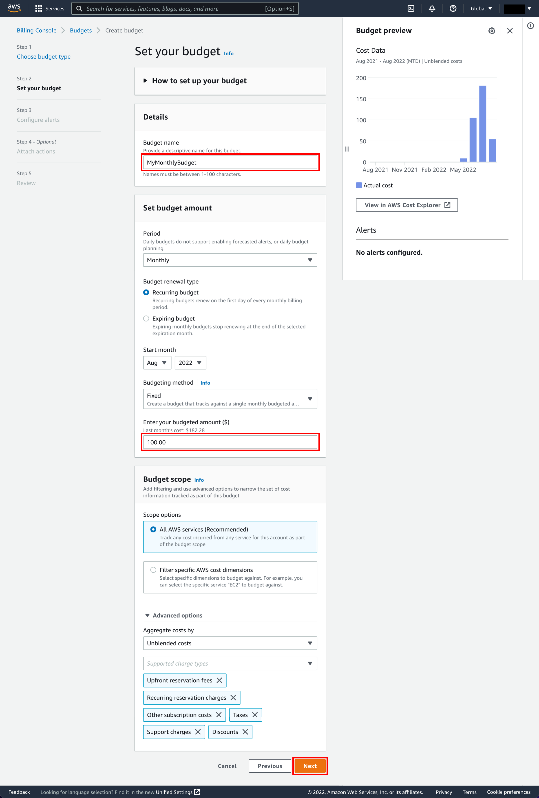{.sietecinco}

<br>

#### **d. Tarea RA1-CEd Billing dashboard**
Realizar una captura de pantalla de vuestro **Panel de facturación**. 

#### **e. Tarea RA1-CEf Creación de una alerta de costes y un resumen de facturación**
!!! task "Ir a **Administración de facturación y costos** y crear lo siguiente:"
    **Alerta de costos con las siguientes condiciones:**    
    &nbsp;&nbsp;&nbsp;&nbsp;1. Presupuesto: 50$   
    &nbsp;&nbsp;&nbsp;&nbsp;2. Umbral de la alerta: 50%.  
    &nbsp;&nbsp;&nbsp;&nbsp;3. Correos: **El vuestro** y el del profesor: j.egeablasco@edu.gva.es  
    &nbsp;&nbsp;&nbsp;&nbsp;4. Frecuencia de las alertas: Resúmenes semanales.  

    **Resumen de facturación:**    
    &nbsp;&nbsp;&nbsp;&nbsp;1. Frecuencia de regeneración: Semanal   
    &nbsp;&nbsp;&nbsp;&nbsp;2. Día de la semana de emisión: Martes  
    &nbsp;&nbsp;&nbsp;&nbsp;3. Correos: **El vuestro** y el del profesor: j.egeablasco@edu.gva.es  

    **Condiciones de la entrega**
    subir una captura de pantalla de la alerta a la tarea **RA1-CEd** de Aules

**Ayuda:** Como crear [una alerta de costes](https://www.youtube.com/watch?v=O0sofGVT7uw) en AWS. 

### **3.5 - Presupuesto de una infraestructura básica**
Para estimar de forma precisa el coste de desplegar una infraestructura en la nube es fundamental utilizar herramientas que nos permitan simularla.  
Para ello, AWS ofrece una **Calculadora de Costes oficial**, con la que se puede configurar servicios (instancias EC2, almacenamiento, bases de datos, redes ...) y obtener de esa manera un presupuesto aproximado antes de su puesta en marcha.

Se puede acceder a la calculadora en el siguiente enlace: [AWS Pricing Calculator](https://calculator.aws/#/)

<br>

#### **a. Precios**
Antes de usar la calculadora podremos ver en la pestaña precios el coste de los diferentes servicios de AWS. 

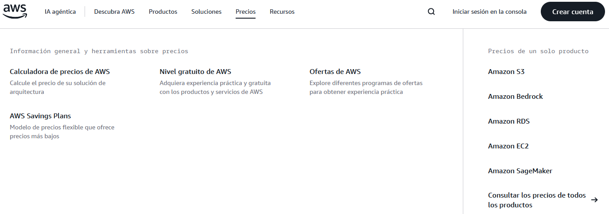{.sietecinco}

<br>

#### **b. Ejemplo de cálculo de coste de una infraestructura**
Para ello usaremos la calculadora de AWS. Como se puede ver en la imagen, primero agregaremos los servicios, luego los configuraremos y para terminar tendremos una estimación bastante exacta del coste de la infraestructura que queremos implementar.

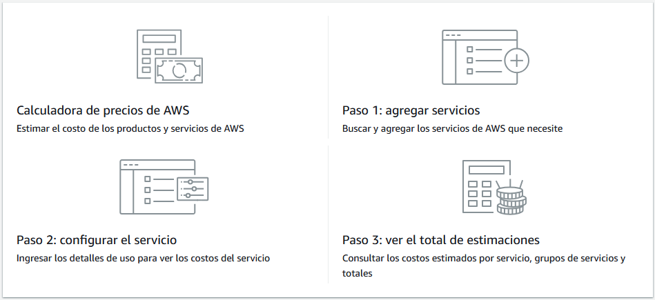{.sietecinco}

<br>

:one: **Añadir servicio**  
En este caso usaremos una instancia de Amazon EC2.

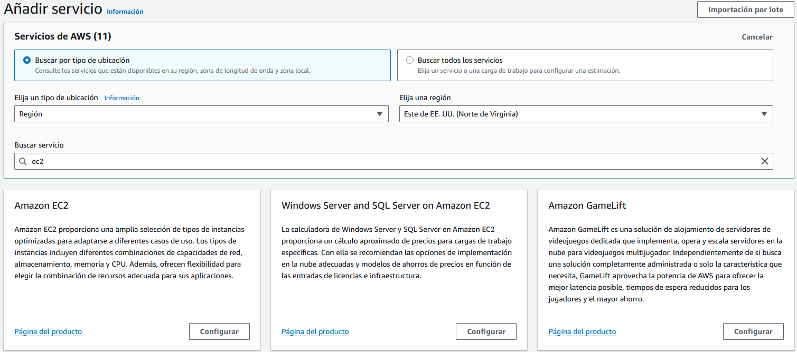{.sietecinco}

<br>

:two: **Configurar el servicio**  
:two: :one: Elegimos la región dónde montaremos la infraestructura (recordar que el precio de los servicios puede variar de una región a otra).  

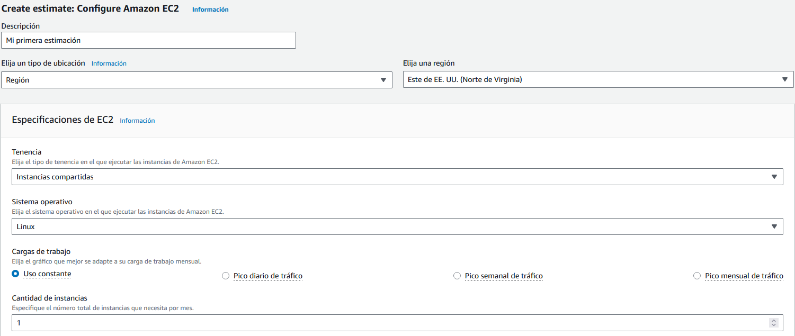{.sietecinco}

<br>

:two: :two: Dentro del tipo de instancias de EC2 seleccionamos una instancia **t4g.micro** 

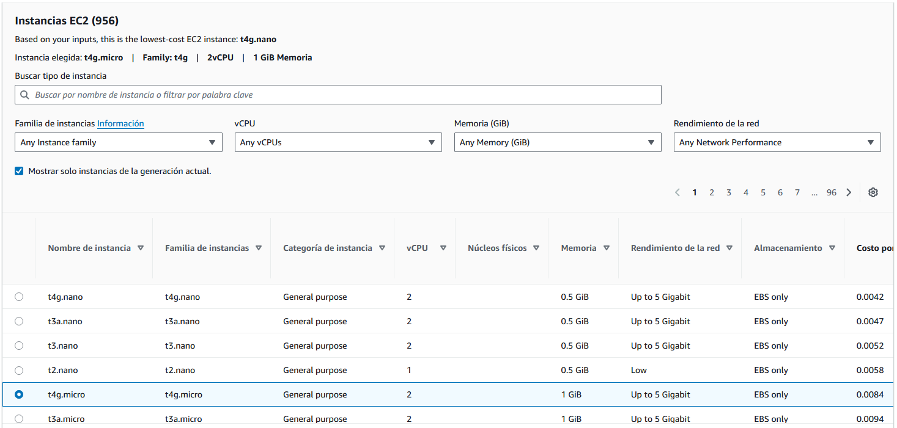{.sietecinco}

<br>

:two: :three: Dejamos la opciones de pago por defecto.

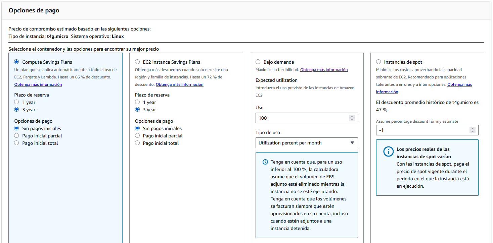{.sietecinco}

<br>

:two: :four: Definimos una unidad de almacenamiento

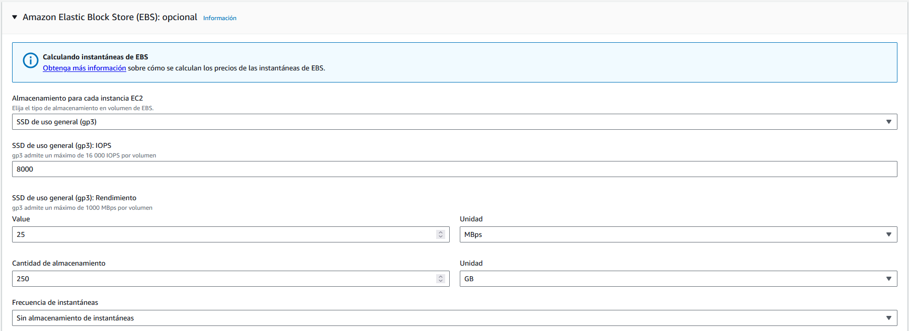{.sietecinco}

<br>

!!! question "¿Por qué debemos definir una unidad de almacenamiento?"

<br>

:two: :five: Definimos la cantidad de datos transferidos

{.sietecinco}

<br>

:three: Estimación del servicio  
Pulsamos guardar y ver resumen y obtendremos el presupuesto. 

{.sietecinco}

<br>

#### **c. Tarea RA1-CEe Estimación del coste de una página web**
!!! task "Ir a **calculadora de costes oficial** y crear un presupuesto con las siguientes especificaciones:"
    | **Componente** | **Parámetro** | **Valor** |
    |-|-|-|
    | **General** | Región | Europe (Spain) `eu-south-2` | 
    | | Periodo de cálculo| Mensual |
    | | Modelo de precios | On-Demand |
    | **Instancia Web (EC2)** | Tipo de instancia | t3.small |
    | | Nº de instancias | 1 |
    | | Sistema operativo | Linux |
    | | Horas/mes | 730 h |
    | **Almacenamiento Web (EBS)** | Tipo de volumen | gp3 | 
    | | Capacidad (GB) | 50 GB |
    | | IOPS adicionales | 0 (3.000 incluidas) |
    | | Throughput adicional | 0 (125 MB/s incluidos) |
    | | Snapshots (GB/mes)  | 20 GB | 
    | **Instancia Base de Datos (EC2)** | Tipo de instancia | t3.medium |
    | | Nº de instancias | 1 | | 
    | |Sistema operativo | Linux |
    | | Horas/mes | 730 h |
    | **Almacenamiento BD (EBS)** | Tipo de volumen | gp3 |
    | | Capacidad (GB) | 200 GB |
    | | IOPS adicionales | 3.000 IOPS extra (para llegar a 6.000 totales) |
    | | Throughput adicional | 0 (125 MB/s incluidos) |
    | | Snapshots (GB/mes) | 100 GB |
    | **Transferencia de Datos**    | Data Transfer Out to Internet (GB/mes) | 150 GB (100 GB gratuitos + 50 GB facturables)  |
    | | Data Transfer In (GB/mes) | 50 GB (gratis) |
    | | Tráfico entre AZs (GB/mes) | 0 |
    | **Red / IP** | Nº de Elastic IPs | 2 (una por instancia) |
    | | Horas asociadas | 730 h (gratis mientras estén asociadas) |
    | | NAT Gateway | 0 |
    | **Servicios adicionales** | CloudWatch Logs (GB/mes) | 10 GB |
    | | Load Balancer | No |
    | **Observaciones / notas** | Picos de tráfico asumidos; crecimiento de BD previsto 20 % anual. |                                                |

    
    **Condiciones de la entrega:**  
    Subir una captura del presupuesto final después de introducir todos los datos.

!!! question "Buscar información para un hosting convencional de similares caracteristicas y comparar precios."


### **3.6 - Resumen de servicios para el control de costos en AWS** 
:one: &nbsp;&nbsp;**Herramientas esenciales de AWS**  

|Herramienta |	Para qué sirve |	Beneficio principal |
|-|-|-|
|Cost Explorer |	Ver y analizar gastos |	Identifica dónde se gasta más |
|AWS Budgets |	Alertas de gastos |	Evita sorpresas en la factura |
|Cost Reports |	Detalles de uso |	Analiza cada céntimo gastado |
|Organizations |	Control multi-cuenta |	Una sola factura para todo |

<br>
:two: &nbsp;&nbsp;**3 formas inmediatas de ahorrar**

- Usa instancias reservadas: ahorra hasta 72%
- Implementa Spot Instances: ahorra hasta 90%
- Activa Savings Plans: ahorra hasta 66%

<br>
:three: &nbsp;&nbsp;**Uso del panel de facturación**  
El panel se actualiza cada 24 horas y muestra entre otras cosas:

|¿Qué se ve? |	¿Qué significa?| 	¿Cuándo se actualiza?|
|-|-|:-:|
|Gastos actuales |	Lo que se lleva gastado este mes |	Cada día|
|Predicción| 	Lo que AWS cree que se gastará |	Cada día|
|Top servicios| 	Dónde más se gastas	|Cada día|
|Historial |	Gasto histórico mes a mes| 	Cada mes|

:four: &nbsp;&nbsp;**Términos comunes de facturación**  

|Término |	¿Qué es?|
|-|-|
|On-Demand |	Pago por uso, sin compromisos |
|Savings Plans| 	Descuentos con permanencia de 1 a 3 años|
|Spot Instances |	Ahorros grandes |
|Reserved Instances |	Descuentos por reservar con specs fijas|

:five: &nbsp;&nbsp;**Problemas Frecuentes de Facturación**  

|Problema| 	Solución| 	Acción preventiva|
|-|-|-|
|Recursos olvidados |	Instancias EC2, volúmenes EBS, Ip's elásticas o snapshots olvidados generan costes aunque no se usen. |	Activar alertas de CloudWatch.|
|Tamaño inadecuado de recursos |	No usar instancias sobredimensionadas ni almacenamiento innecesario. |	**Right-sizing**: ajustar el recurso al uso real.|
|Almacenamiento mal optimizado| S3 ofrece clases de almacenamiento más baratas para datos poco accedidos (**S3 Glacier**, **S3 Infrequent Access**).| Hacer **lifecycle policies** para mover datos automáticamente.|
|Región mal elegida|Algunas regiones son más baratas que otras.|Ver si influye la latencia y las normativas.|
|No configurar alertas|Configurar en Billing → *Budgets* y *Cost Anomaly Detection* para recibir avisos si los gastos superan un umbral.|Crear alertas|

## **4 - Enlaces de interés**
Documentación de [AWS](https://docs.aws.amazon.com).  
[Aspectos básicos de control de costes en AWS](https://aws.amazon.com/es/getting-started/cost-optimization-essentials)  
[Supervision y control de costes](https://docs.aws.amazon.com/es_es/res/latest/ug/cost-management.html)  
Tutorial para controlar los [costos de AWS](https://aws.amazon.com/es/getting-started/hands-on/control-your-costs-free-tier-budgets/?ref=gsrchandson&id=itprohandson)  
[Calculadora de costos](https://calculator.aws/#/)  