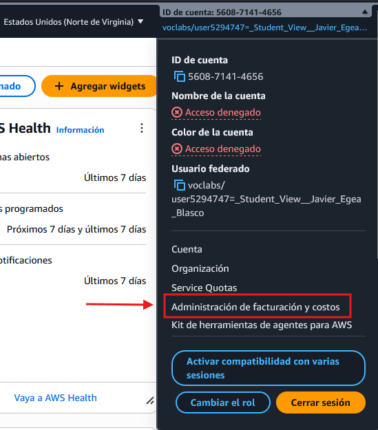
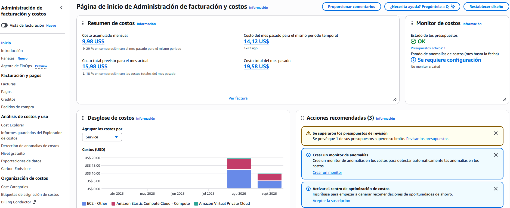
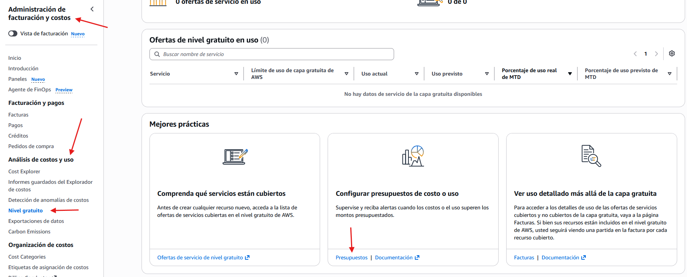
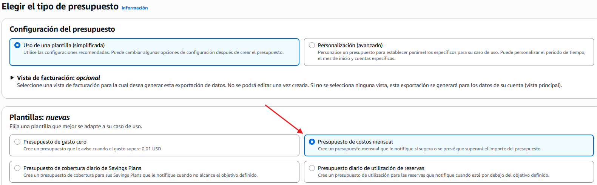
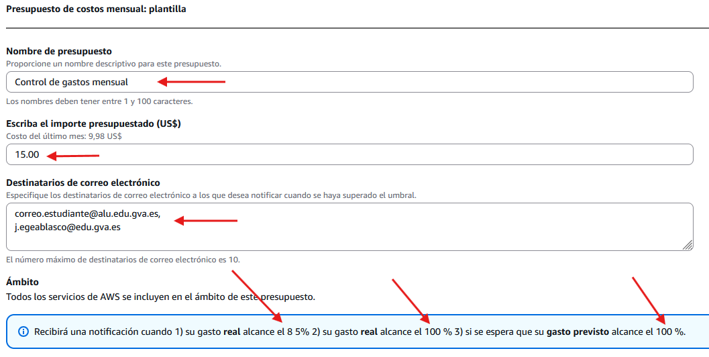
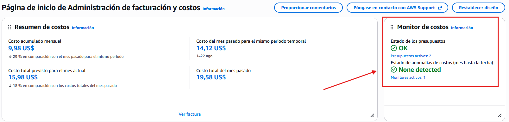
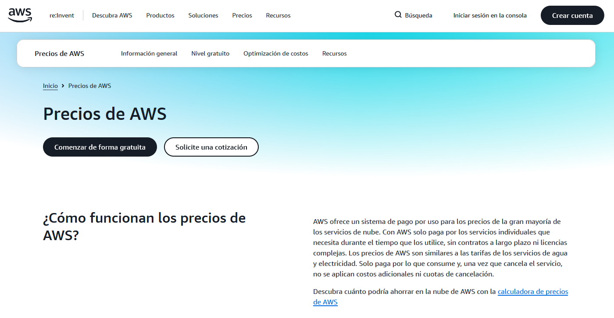
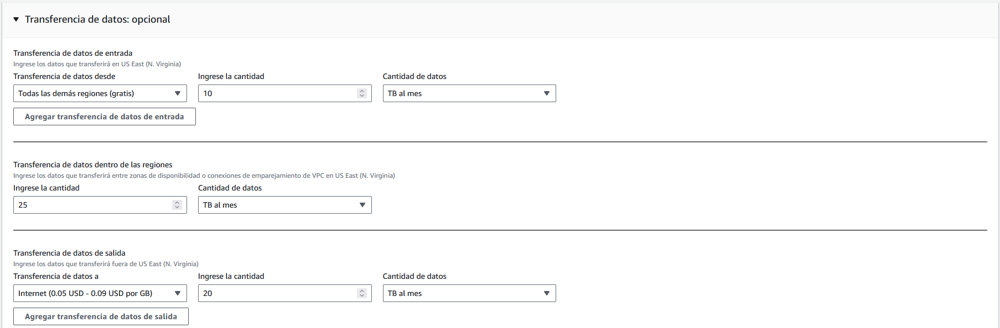
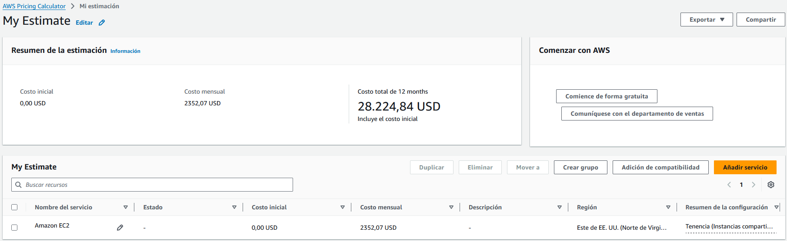

{ .original .marginbottom40 }

**Resultados de aprendizaje y criterios de evaluacion que se evaluarán en esta unidad.**  

| **Resultados de aprendizaje de la unidad didáctica:** |
||
| **RA. 1:** Comprende los fundamentos de la computación en la nube, sus ventajas frente a sistemas tradicionales, el marco de adopción, los principios de migración y los aspectos clave de facturación, como estimación y optimización de costos.|  

|**Criterios de evaluación de la unidad didáctica:**|
||
|**d)** Se han identificado los principios básicos de la facturación y costos en la nube.|
|**e)** Se ha hecho uso correcto de herramientas para estimar y gestionar presupuestos.|
|**f)** Se ha participado en actividades prácticas sobre gestión de costos.|

## 1 - Preliminares

- Descargar una distribución de **Linux ligera** (Lubuntu, Mint) e instalarla sobre una máquina virtual.

## 2 - Learner Lab

### 2.1 Invitación a Learner Lab

-En vuestros **correos corporativos** habréis recibido un mensaje de **AWS Academy**.


- Si habéis recibido ese correo, significa que se os ha dado de alta en un laboratorio (Leaner Lab) donde haremos la formación del curso.  
- Este laboratorio cuenta con un presupuesto de 50$. Como lo veremos a lo largo del curso, convendrá **administrarlo correctamente**.  
- Si se excede el límite de 50$, el acceso quedará bloqueado y no será posible recuperar los trabajos realizados en él.

### 2.2 Registro en AWS Academy

1. Hacer click en **Comenzar** y registraros en el servicio que se indica.
1. Luego os saldrá una ventana que os pedirá de acceder a vuestra cuenta de **Canvas**.  
Si no tenéis cuenta de Canvas, pinchar en **Create my account**.  
{ .cien .margintop10 .marco .marginbottom40}
1. Un vez registrados, podréis acceder a vuestra cuenta de AWS Academy.
{ .cien .margintop10 .marco}

### 2.3 Acceso al curso

- Pinchar en el curso.
- Si es la primera vez que usáis el **vuestra cuenta de AWS** sólo os aparecerá un curso.
{ .cien .marco .margintop10}

### 2.4 Acceder al laboratorio

1. Seguir el enlace **Launch AWS Acedemy Leaner Lab**.  
{ .cien .marco .margintop10 .marginbottom20 }
1. El siguiente paso será lanzar el laboratorio de AWS.  
Previamente tendremos que conceder permisos y decir que nos hemos leído los términos
de uso.  
{ .cien .marco .margintop10 .marginbottom20 }
1. Una vez aceptados los términos y condiciones, esperar a que aparezca el spinner de **vocareum**  
{ .cien .marco .margintop10 .marginbottom20 }
1. Si todo ha ido bien, accederemos al portal del **Learner Lab**.  
{ .cien .marco .margintop10 }
  
### 2.5 Lanzar el laboratorio

{.margintop10 .marginbottom20}

- Para acceder a la consola de AWS y empezar a trabajar, pulsaremos **Start Lab**.  
- Disponemos de una sesión activa de **4 horas** de duración para realizar las prácticas.
- Si necesitamos más tiempo, podemos pulsar de nuevo **Start Lab** antes de que expiren las 4 horas para renovar el contador a 4 horas adicionales.  

**Comportamiento al finalizar el tiempo del Learner Lab:**  

1. **Expiración de la sesión:** Al llegar al tiempo límite, se cierra el acceso a la consola web de AWS.  
2. **Persistencia de los datos:** **No se pierde la configuración ni los archivos almacenados** en discos persitentes (EBS) o buckets (S3). Los datos permanecen guardados en la cuenta para la siguiente sesión.
3. **Estado de los servicios:** Las instancias y servicios activos **NO se apagan automáticamente** al caducar el temporizador de 4 horas, por lo que **seguirán consumiendo el crédito disponible** del laboratorio.
4. **Gestión del presupuesto:** Para evitar agotar el crédito ($50 USD):
   - Al terminar de trabajar, debemos pulsar **Stop Lab** para detener el cómputo de las máquinas.
   - Al finalizar completamente una práctica, **debemos eliminar todos los recursos creados** que ya no vayamos a utilizar.

### 2.6 Panel de AWS

Una vez que el enlace de AWS haya pasado a **color verde**, hacemos clic en él y accederemos al panel de control de AWS.


!!! Exercice "Ejercicio 1"  
    Localizar vuestras credenciales de usuario.

!!! Exercice "Ejercicio 2"  

    1. ¿En qué región nos encontramos nada más acceder con nuestra cuenta de alumno a AWS?
    1. ¿Podemos acceder a otras regiones como, por ejemplo, España (Madrid)?
    1. ¿Podemos ver las zonas de disponibilidad dentro de la región que tenemos asignada?

### 2.7 Instalar el cliente CLI de AWS en nuestra máquina virtual

- AWS CLI es el cliente de AWS mediante el cual podremos utilizar la terminal para poder trabajar con nuestro entorno.
- En el siguiente [enlace](https://docs.aws.amazon.com/es_es/cli/latest/userguide/getting-started-install.html) encontraréis las instrucciones de instalación del CLI de AWS.

- Una vez finalizada la instalación podremos comprobar la versión instalada con el comando:

      ```bash
      ~ $ aws --version
      ```

{ .sietecinco }

### 2.8 Introducir las credenciales del laboratorio en el cliente de AWS

1. Tenemos el **laboratorio** en marcha y el **cliente** de AWS instalado.
1. Para poder conectarnos desde nuestra máquina a nuestro cliente de AWS (y sobre todo a los servivios que crearemos en él) necesitaremos autenticarnos.
1. Para ello  utilizaremos las credenciales del laboratorio para configurar nuestro cliente.

1. Acceso a las credenciales del usuario (AWS Details).  
{ .sietecinco .marco .marginbottom20 .margintop10}  
1. Ejemplo de credenciales de usuario de AWS  
{ .seiszero .marco .marginbottom20 .margintop10}  
1. Para cargar las credenciales del laboratorio en nuestra máquina usaremos **aws configure** y pondremos los datos que nos irá pidiendo.
        ```bash
        ~$ aws configure
        ```
{ .original .marginbottom20 }  
1. Para finalizar y poder conectarse desde nuestro cliente, haremos lo siguiente:

    - Accedemos a la carpeta **.aws** (creada con aws configure) de nuestra máquina y editamos el archivo **credentials**.  
            ```bash
            ~$ cd .aws
            ~$ .aws/nano credentials
            ```
    { .original .marginbottom20 }  
    - A continuación borramos **todo el contenido** y copiamos **toda la información de AWS
Details**.  
{ .original .margintop10 .marginbottom20}  
    - Si todo ha ido bien, al ejecutar el comando **aws sts get-caller-identity** nos devolverá:
    { .original .margintop10 .marginbottom20}  

!!! warning "Importante:"
    1. Deberemos repetir este proceso cada vez que cambie el token de sesión y necesitemos usar comandos de CLI desde nuestra máquina para trabajar sobre nuestra nube de AWS.
    1. **No suele ser habitual**, pero, en caso de hacer **un reset del laboratorio** (borrado total de todo el entorno creado), es posible que haya que repetir el proceso.
    { .original .marco .margintop10 .marginbottom20}  

### 2.9 - Cerrar el Learner Lab

- Para cerrar el **Learner Lab** basta con pulsar el botón de **End Lab**.  
{ .ochocinco .marco .margintop10 .marginbottom20}  
- Todos los servicios que tengamos se detendrán pero **seguirán existiendo y AWS nos facturará por tenerlos**.

## 3 - Costes de los servicios en AWS (y de la nube en general)

En AWS **la facturación y la optimización de costos** son dos áreas básicas que todo usuario debe conocer para **evitar sorpresas en la factura** y aprovechar mejor los recursos.

### 3.1 Conceptos básicos para la administración de costes en AWS

- **Modelo de pago por uso**  
  Solo se paga por los recursos que se consumen (horas de cómputo, GB almacenados, transferencias de datos...).

- **Niveles gratuitos (Free Tier)**  
  AWS ofrece un nivel gratuito con ciertos límites (por ejemplo, 750 h/mes en EC2 t2.micro durante 12 meses) para aprender y probar servicios.

- **Precios regionales**  
  El coste puede variar entre regiones.

### 3.2 Planes y estrategias de uso  

En AWS existen varios **planes y estrategias de uso** que permiten **optimizar los costes**, es decir, pagar menos por un mismo recurso.

#### a. Instancias bajo demanda (On-Demand)

- Se paga por **hora o segundo de uso**, sin compromisos a largo plazo.
- **Ventaja:** flexibilidad máxima, perfecto para cargas variables o temporales.
- **Desventaja:** es más caro que otros planes si el uso es continuo.

#### b. Instancias reservadas (Reserved Instances, RI)

- Compromiso a usar una instancia **por 1 o 3 años**, a cambio de un **descuento significativo** (30–70 %).
- **Tipos de pago:**
    1. Pago completo por adelantado: → máximo descuento.
    1. Pago parcial: → descuento medio.
    1. Pago mensual: → descuento menor, más flexible.
- **Ventaja:** ideal para cargas estables y continuas.
- **Desventaja:** compromiso a largo plazo.

#### c. Savings Plans

- Son similares a las RIs, pero más **flexibles**: no se está ligado a una instancia concreta.
- Compromiso a gastar **cierta cantidad de dinero** durante 1 o 3 años para obtener descuentos.
- **Tipos:**

    1. **Compute Savings Plans:** → se aplica a cualquier tipo de instancia EC2, incluso regiones o familias distintas.
    1. **EC2 Instance Savings Plans:** → descuentos específicos para una familia de instancias en una región.  

- **Ventaja:** combina ahorro y flexibilidad.

#### d. Instancias Spot (Spot Instances)

- Son **instancias sobrantes de AWS** que se venden a precio reducido (hasta 90 % más barato que On-Demand).
- **Ventaja:** muy barato para cargas **flexibles o tolerantes a interrupciones**, como procesamiento batch o pruebas.
- **Desventaja:** AWS puede interrumpir la instancia si necesita la capacidad.

#### e. Optimización de almacenamiento y servicios adicionales

Aunque no son “planes de uso” como tal, se combinan con ellos para reducir costes:  

- **S3 Storage Classes:** Standard, Standard-IA, Glacier → para ajustar coste según frecuencia de acceso.
- **Lifecycle policies:** mover archivos automáticamente entre tipos de almacenamiento según antigüedad.
- **Auto Scaling:** encender y apagar instancias automáticamente según demanda.

#### f. Resumen

| Plan/Servicio               | Cuándo usarlo                    | Descuento/ventaja principal      |
| --------------------------- | -------------------------------- | -------------------------------- |
| On-Demand                   | Uso temporal o variable          | Flexibilidad máxima              |
| Reserved Instances          | Cargas estables y continuas      | 30–70 % de descuento             |
| Savings Plans               | Uso estable pero flexible        | Ahorro y flexibilidad combinados |
| Spot Instances              | Procesos batch o interrumpibles  | Hasta 90 % más barato            |
| Optimización almacenamiento | Datos según frecuencia de acceso | Reduce costes de almacenamiento  |

### 3.3 Consola de Administración de facturación y costos

Desde la consola de AWS se puede:

- Ver facturas detalladas por servicio y por región.
- Configurar presupuestos y alertas.
- Descargar informes para análisis.
- Ver una predicción de costos futuros.
- ...

#### a. Acceder al panel de facturación de AWS

Después de iniciar sesión en su cuenta, en el menú de la cuenta, seleccione `Panel de facturación`.
{.cincozero .marco .margintop10 .marginbottom20}

#### **b. Revisar el panel de facturación**

{.original .marco .margintop10 .marginbottom20}

- En la sección **Resumen de costos**, se podrá ver un resumen de los costos del mes hasta la fecha.
- También se podrá ver la tendencia de los costos de los cinco servicios principales durante los tres a seis períodos de facturación cerrados más recientes.

#### c. Tarea RA1-CEd Billing dashboard

!!! exercise "Tarea RA1-CEd"
    Realizar una captura de pantalla de vuestro **Panel de facturación** y justificar brevemente los valores devueltos.

    !!! warning "Condiciones de la entrega."  
        Subir el documento con vuestras respuestas a la tarea RA1-CEd de Aules.

<!-- #### c. Modificar las alertas de correo electrónico del límite de uso

- De manera predeterminada, la mayoría de las cuentas se activan automáticamente para recibir alertas por correo electrónico respecto del límite **del nivel gratuito de AWS** cuando el uso de su servicio excede el 85 % de un límite determinado.

- Para cambiar quién recibe estas alertas por correo electrónico, seleccione **Preferencias de facturación** en la barra de navegación izquierda.

- Para que otras personas puedan recibir alertas de uso del nivel gratuito, agregue su dirección de correo electrónico en el campo de Dirección de correo electrónico y seleccione Guardar preferencias. -->

### 3.4 Monitor de costos y monitor de presupuestos

En AWS, existen varios tipos de monitores entre los cuales encontraremos:

- **Monitor de costos**.
- **Monitor de presupuestos**.

La diferencia principal radica en su enfoque: un monitor de costos es **reactivo y analítico**, mientras que un monitor de presupuestos es **preventivo y orientado al control**.  

En la consola de AWS, estas dos funciones se corresponden principalmente con **AWS Cost Explorer** (o AWS Cost Anomaly Detection) y **AWS Budgets**.

!!! abstract "Monitor de Costos (AWS Cost Explorer & Anomaly Detection)"  
    Su objetivo es ayudar a entender en qué se está gastando el dinero mediante visualización y análisis de datos históricos y proyecciones.

    !!! tip "Enfoque"
        Diagnóstico e identificación de tendencias.
    !!! success "Qué hace"
        - Muestra gráficos detallados de los gastos pasados y proyectados a futuro.
        - Permite filtrar y agrupar costos por servicio, cuenta, región, etiquetas (tags) o tipo de uso.
        - AWS Cost Anomaly Detection (Detección de anomalías), utiliza aprendizaje automático para avisar si se detecta un pico de gasto inusual fuera de tus patrones normales.

!!! abstract "Monitor de Presupuestos (AWS Budgets)"
    Su objetivo es ayudar a mantenerte dentro de un límite financiero establecido configurando umbrales y alertas en tiempo real.

    !!! tip "Enfoque"
        Control financiero y prevención de sorpresas en la factura.
    !!! success "Qué hace"
        - Permite fijar un costo o uso objetivo diario, mensual, trimestral o anual.
        - Envía notificaciones (vía correo electrónico...) cuando el gasto o uso real (o proyectado) supera un porcentaje de un límite.
        - Permite asociar AWS Budget Actions (no disponible para usuarios de la capa gratuita) para ejecutar acciones automáticas si se supera el presupuesto.

### 3.5 Creación de un monitor de presupuesto con plantilla de AWS

- En este apartado crearemos un monitor de presupuesto de costo o uso usando una plantilla de AWS.
- Con la plantilla se establecerán automáticamente tres notificaciones:
    1. Una si los costos alcanzan el 85% de su presupuesto,
    1. Otra si el gasto real alcanza el 100% del presupuesto,
    1. Otra si se prevee que el gasto alcance el 100% del presupuesto asignado.

#### a. Crear un controlador de presupuesto de costos

- El la consola de AWS buscamos `Análisis de costos y uso`, luego `Nivel gratuito` y para terminar `Configurar presupuestos de costo o uso`.
{.cien .marco .margintop10 .marginbottom20 }

- En la página de `Presupuestos` pulsaremos `Crear presupuestos`  

#### b. Elejir el tipo de presupuesto

En la página **Elegir el tipo de presupuesto**, elegiremos  la plantilla que más se adecúe a nuestras necesidades.
{.cien .marco .margintop10 .marginbottom20 }

#### c. Establecer los detalles del presupuesto

- En la página **Defina su presupuesto**, editar el campo **Nombre del presupuesto** y personalizarlo.
- En la sección Establecer el importe del presupuesto, mantener las selecciones predeterminadas e introducir 100 USD en el campo **Introduzca el importe presupuestado (USD)**.
- En la sección **Parámetros de presupuesto**, se puede utilizar estas características para crear presupuestos que rastreen los costos asociados con un **conjunto particular** de servicios de AWS.

{.cien .marco .margintop10 .marginbottom20 }

### 3.6 Tarea RA1-CEf - Creación de una alerta de costes personalizada y de un monitor de costos

Ejemplo de resultado después de realizar las alertas de los monitores de costos y presupuestos.

{.cien .marco .margintop10 .marginbottom20 }

!!! task "Tarea RA1-CEf"
    **Crear una alerta de costos con las siguientes condiciones:**

    1. Presupuesto: 10$
    1. Periódo: Fecha actual hasta fin de mes.  
    1. Umbral de la alerta: 50%. Desencadenador de la alerta: `Real`  
    1. Destinatarios de correo: **El vuestro** y el del profesor: `j.egeablasco@edu.gva.es`  

    **Crear un monitor de costos con las siguientes condiciones:**
    
    1. Nombre del supervisor: Supervisor de cuenta
    1. Nombre de la suscripción: Vuestro nombre
    1. Frecuencia de las alertas: Semanal   
    1. Destinatarios de las alertas: **El correo del alumno** y el del profesor: j.egeablasco@edu.gva.es  
    1. Umbral: 40$  
    
    !!! tip "Ayuda:"
        Como crear [una alerta de costes](https://www.youtube.com/watch?v=O0sofGVT7uw) en AWS.
    
    !!! warning "Condiciones de la entrega."  
        Subir el documento con vuestras respuestas a la tarea RA1-CEf de Aules.

### 3.7 Presupuesto de una infraestructura básica

- Para estimar de forma precisa el coste de desplegar una infraestructura en la nube es fundamental utilizar herramientas que nos permitan simularla.  
- Para ello, AWS ofrece una **Calculadora de Costes oficial**, con la que se puede configurar servicios (instancias EC2, almacenamiento, bases de datos, redes ...) y obtener de esa manera un presupuesto aproximado antes de su puesta en marcha.
- Se puede acceder a la calculadora pinchando en el siguiente enlace: [AWS Pricing Calculator](https://calculator.aws/#/)

#### 3.7.1 Precios

Antes de usar la calculadora podremos consultar en la pestaña precios el coste de los diferentes servicios de AWS.

[{.cien .marco}](https://aws.amazon.com/es/pricing/)

#### 3.7.2 Ejemplo de cálculo de coste de una infraestructura

- Para ello usaremos la calculadora de AWS.
- Como se puede ver en la imagen:  
{.cien .margintop10 .marginbottom20}

    1. Primero agregaremos los servicios,
    1. Luego los configuraremos,
    1. Para terminar tendremos una estimación bastante exacta del coste de la infraestructura que queremos implementar.

##### 3.7.2.1 Añadir servicio

En este caso usaremos una instancia de Amazon EC2.

{.leftoriginal}

##### 3.5.2.2 Configurar el servicio

- Elegimos la región dónde montaremos la infraestructura (recordar que el precio de los servicios puede variar de una región a otra).  
{.original .margintop10 .marginbottom20 .marco}

- Dentro del tipo de instancias de EC2 seleccionamos una instancia **t4g.micro**
{.original .margintop10 .marginbottom20 .marco}

- Dejamos la opciones de pago por defecto.
{.original .margintop10 .marginbottom20 .marco}

- Definimos una unidad de almacenamiento
{.original .margintop10 .marginbottom20 .marco}

!!! question "¿Por qué debemos definir una unidad de almacenamiento?"

- Definimos la cantidad de datos transferidos
{.original .margintop10 .marginbottom20 .marco}

- Estimación del servicio  
Pulsamos guardar y ver resumen y obtendremos el presupuesto.
{.original .margintop10 .marginbottom20 .marco}

#### 3.7.3 Tarea RA1-CEe Estimación del coste de una página web

!!! task "Tarea RA1-CEe"
    Ir a **calculadora de costes oficial** y crear un presupuesto con las siguientes especificaciones:

    | **Componente** | **Parámetro** | **Valor** |
    |-|-|-|
    | **General** | Región | Europe (Spain) `eu-south-2` |
    | | Periodo de cálculo| Mensual |
    | | Modelo de precios | On-Demand |
    | **Instancia Web (EC2)** | Tipo de instancia | t3.small |
    | | Nº de instancias | 1 |
    | | Sistema operativo | Linux |
    | | Horas/mes | 730 h |
    | **Almacenamiento Web (EBS)** | Tipo de volumen | gp3 | 
    | | Capacidad (GB) | 50 GB |
    | | IOPS adicionales | 0 (3.000 incluidas) |
    | | Throughput adicional | 0 (125 MB/s incluidos) |
    | | Snapshots (GB/mes)  | 20 GB | 
    | **Instancia Base de Datos (EC2)** | Tipo de instancia | t3.medium |
    | | Nº de instancias | 1 | | 
    | |Sistema operativo | Linux |
    | | Horas/mes | 730 h |
    | **Almacenamiento BD (EBS)** | Tipo de volumen | gp3 |
    | | Capacidad (GB) | 200 GB |
    | | IOPS adicionales | 3.000 IOPS extra (para llegar a 6.000 totales) |
    | | Throughput adicional | 0 (125 MB/s incluidos) |
    | | Snapshots (GB/mes) | 100 GB |
    | **Transferencia de Datos**    | Data Transfer Out to Internet (GB/mes) | 150 GB (100 GB gratuitos + 50 GB facturables)  |
    | | Data Transfer In (GB/mes) | 50 GB (gratis) |
    | | Tráfico entre AZs (GB/mes) | 0 |
    | **Red / IP** | Nº de Elastic IPs | 2 (una por instancia) |
    | | Horas asociadas | 730 h (gratis mientras estén asociadas) |
    | | NAT Gateway | 0 |
    | **Servicios adicionales** | CloudWatch Logs (GB/mes) | 10 GB |
    | | Load Balancer | No |
    | **Observaciones / notas** | Picos de tráfico asumidos; crecimiento de BD previsto 20 % anual. |                                                |

    !!! warning "Condiciones de la entrega."  
        Subir el documento con vuestras respuestas a la tarea RA1-CEe de Aules.

!!! question "Buscar información para un hosting convencional de similares caracteristicas y comparar precios."

### 3.8 Resumen de servicios para el control de costos en AWS

#### 3.8.1 Herramientas de costos esenciales de AWS  

|Herramienta |Para qué sirve |Beneficio principal |
||||
|Cost Explorer |Ver y analizar gastos |Identifica dónde se gasta más |
|AWS Budgets |Alertas de gastos |Evita sorpresas en la factura |
|Cost Reports |Detalles de uso |Analiza cada céntimo gastado |
|Organizations |Control multi-cuenta |Una sola factura para todo |

#### 3.8.2 Formas inmediatas de ahorrar

- Usar instancias reservadas: ahorra hasta 72%
- Implementar Spot Instances: ahorra hasta 90%
- Activar Savings Plans: ahorra hasta 66%

#### 3.8.3 Uso del panel de facturación

El panel se actualiza cada 24 horas y muestra entre otras cosas:

|¿Qué se ve? |¿Qué significa?|¿Cuándo se actualiza?|
|||:-:|
|Gastos actuales |Lo que se lleva gastado este mes |Cada día|
|Predicción|Lo que AWS cree que se gastará |Cada día|
|Top servicios|Dónde más se gastas|Cada día|
|Historial |Gasto histórico mes a mes|Cada mes|

#### 3.8.4 Términos comunes de facturación  

|Término |¿Qué es?|
|||
|On-Demand |Pago por uso, sin compromisos |
|Savings Plans|Descuentos con permanencia de 1 a 3 años|
|Spot Instances |Ahorros grandes |
|Reserved Instances |Descuentos por reservar con specs fijas|

#### 3.8.5 Problemas Frecuentes de Facturación

|Problema|Solución|Acción preventiva|
||||
|Recursos olvidados |Instancias EC2, volúmenes EBS, Ip's elásticas o snapshots olvidados generan costes aunque no se usen. |Activar alertas de CloudWatch.|
|Tamaño inadecuado de recursos |No usar instancias sobredimensionadas ni almacenamiento innecesario. |**Right-sizing**: ajustar el recurso al uso real.|
|Almacenamiento mal optimizado| S3 ofrece clases de almacenamiento más baratas para datos poco accedidos (**S3 Glacier**, **S3 Infrequent Access**).| Hacer **lifecycle policies** para mover datos automáticamente.|
|Región mal elegida|Algunas regiones son más baratas que otras.|Ver si influye la latencia y las normativas.|
|No configurar alertas|Configurar en Billing → *Budgets* y *Cost Anomaly Detection* para recibir avisos si los gastos superan un umbral.|Crear alertas|

## 4 - Enlaces de interés

Documentación de [AWS](https://docs.aws.amazon.com).  
[Aspectos básicos de control de costes en AWS](https://aws.amazon.com/es/getting-started/cost-optimization-essentials)  
[Supervision y control de costes](https://docs.aws.amazon.com/es_es/res/latest/ug/cost-management.html)  
Tutorial para controlar los [costos de AWS](https://aws.amazon.com/es/getting-started/hands-on/control-your-costs-free-tier-budgets/?ref=gsrchandson&id=itprohandson)  
[Calculadora de costos](https://calculator.aws/#/)
