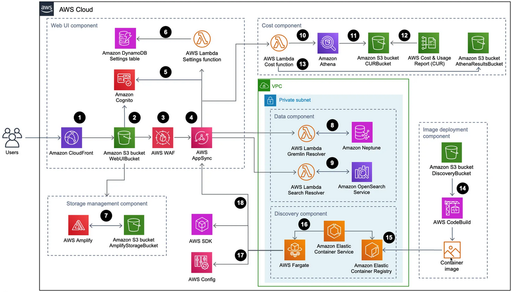
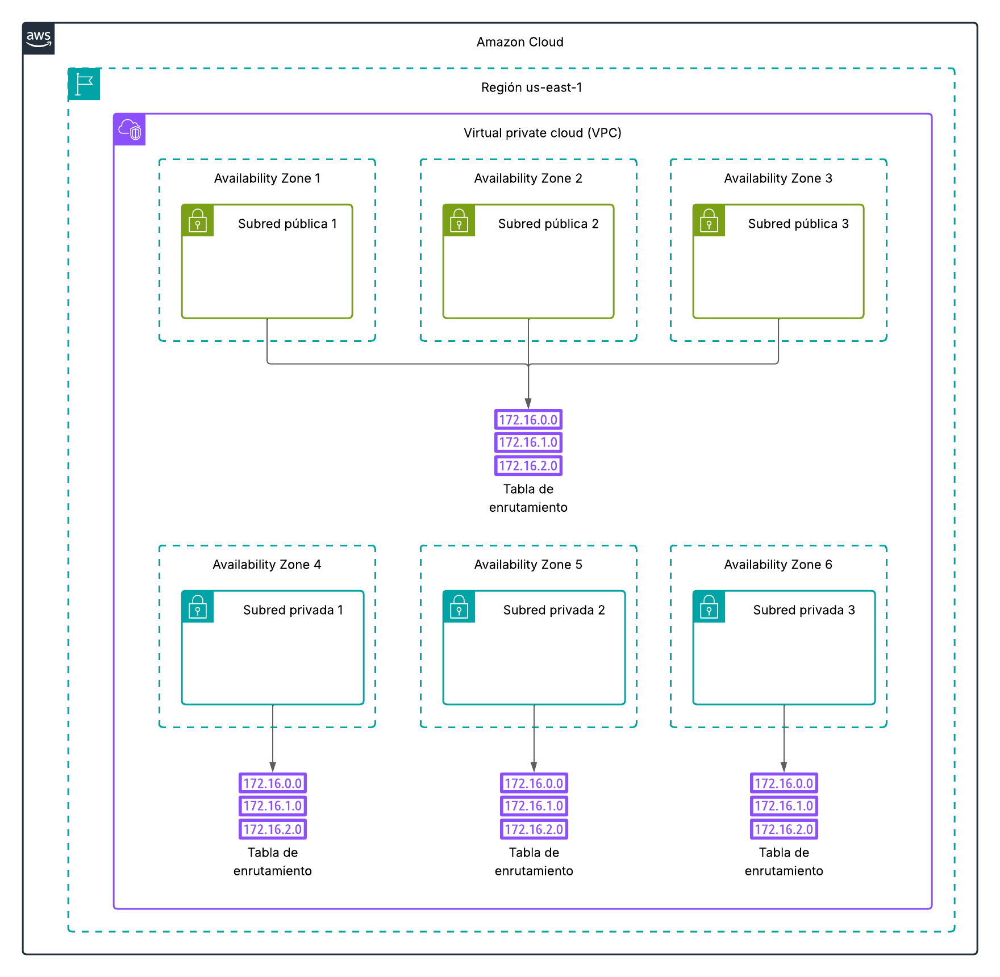
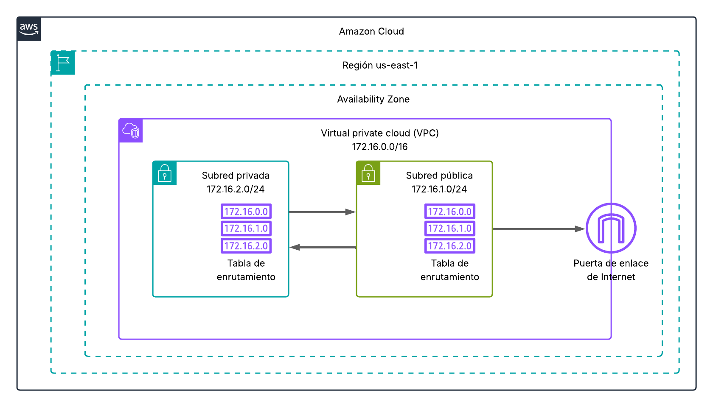

{ .sietecinco }
 

## **Infraestruturas en AWS**
Las **infraestructuras** de **AWS** son el conjunto de servicios y recursos que permiten desplegar aplicaciones, almacenar datos, procesar información y ofrecer servicios de red en la nube. 

### Componentes principales de la infraestructura en AWS  
1. **Regiones y Zonas de disponibilidad (AZs)**  
Define la región (y las zonas de disponibilidad) donde crearemos nuestra insfraestrutura.        

1. **Red y conectividad (VPC)**  
Es la red virtual en la que implementaremos nuestra infraestructura.  
Una vez creada la VPC podremos (deberemos) configurar subredes públicas y privadas, tablas de enrutamiento, gateways (Internet Gateway, NAT Gateway) y reglas de seguridad (Security Groups).

1. **Instancias EC2**
Una **instancia EC2** es, básicamente, una máquina virtual que implementaremos en nuestra VPC.
Las instancias son escalables (CPU, RAM, SSD) y gestionadas desde la consola de AWS o mediante API.  
También nos encontraremos con los servicios:       
    * **Elastic Load Balancer (ELB)**: Distribuye tráfico entre varias instancias.
    * **Auto Scaling**: Ajusta automáticamente la capacidad según la demanda.
    * **Lambda** (Serverless): Ejecuta código sin gestionar servidores.

1. **Almacenamiento**
    * **Amazon S3**: Almacenamiento de objetos altamente escalable.
    * **Amazon EBS**: Volúmenes de bloque para EC2.
    * **Amazon EFS**: Sistema de archivos compartido y elástico.
    * **Glacier/Deep Archive**: Almacenamiento de bajo coste para datos fríos.

5. **Bases de datos y análisis**
    * **RDS (Relational Database Service)** (MySQL, PostgreSQL, SQL Server, Oracle).
    * **Amazon Aurora**: Compatible con MySQL/PostgreSQL y optimizada para la nube.
    * **DynamoDB**: Base de datos NoSQL de baja latencia.
   
6. **Seguridad y gestión**
    * **IAM (Identity and Access Management)**, control de acceso y permisos. &rarr; Capado en Learner Lab.
    * **AWS Organizations**: Gestión de varias cuentas.
    * **CloudTrail y CloudWatch**: Auditoría, monitorización y logging.

### **VPC**
Una **VPC (Virtual Private Cloud)** en AWS es una red virtual aislada dentro de la nube de Amazon que permite definir y controlar un entorno de red. Es la base sobre la que se despliegan la mayoría de los servicios de AWS. 
Más información [aquí](https://docs.aws.amazon.com/es_es/vpc/latest/userguide/what-is-amazon-vpc.html)

#### **Elementos principales para la creación de una VPC**  

- **Subredes**
Divisiones dentro de la VPC que pueden ser públicas (accesibles desde internet) o privadas (sin acceso directo desde internet).
- **Direccionamiento IP** (CIDR Block)  
El rango de direcciones IP que define la red de la VPC.
- **Enrutamiento** (Route Tables)  
Definen las rutas de tráfico dentro de la VPC y hacia afuera. 
- **Puertas de enlace**, Internet Gateway (IGW)  
Componente que permite a las subredes públicas comunicarse con internet.
- **Puntos de conexión** para conectarse a Servicios de AWS de forma privada.
- **NAT Gateway / NAT Instance:** Permite que instancias en subredes privadas salgan a internet sin ser accesibles desde fuera.
- **Peering y Transit Gateway:** Conectan varias VPC entre sí.
- **VPN o AWS Direct Connect:** Para conectar la VPC con tu infraestructura local.

#### Tarea 1 - Creación de una VPC
En esta tarea crearemos una VPC que nos permetrá ir familiarizandonos con la consola de AWS y entendiendo los conceptos básicos que forman parte de las redes privadas virtuales.

{ .sietecinco }

!!! Exercice "**Pregunta 1**" 
    La imagen contiene un error de concepto: ¿Cuál?

1. Crear **a mano** una VPC que use el **CIDR 10.1.0.0/16** en la **región us-east-1** con el nombre MiPrimeraVPC.  
1. Esta VPC dispondrá de **3 subredes públicas**, **cada una en una zona de disponibilidad**.   
    - us-east-1a con CIDR block 10.1.1.0/24 y de nombre SubRed_Pública_1  
    - us-east-1b con CIDR block 10.1.2.0/24 y de nombre SubRed_Pública_2 
    - us-east-1c con CIDR block 10.1.3.0/24 y de nombre SubRed_Pública_3 
1. Esta VPC dispondrá de **3 subredes privadas**, **cada una en una zona de disponibilidad**. 
    - us-east-1a con CIDR block 10.1.11.0/24 y de nombre SubRed_Privada_1
    - us-east-1B con CIDR block 10.1.12.0/24 y de nombre SubRed_Privada_2
    - us-east-1c con CIDR block 10.1.13.0/24 y de nombre SubRed_Privada_3
1. Las redes públicas deberán compartir la misma tabla de enrutamiento.
1. Cada red privada dispondrá de su propia tabla de enrutamiento. 

1. Repetir el ejercicio anterior pero esta vez usando **el asistente de AWS**.

1. Eliminar las VPC's, subredes y tablas de enrutamiento creadas.

!!! Exercice "**Pregunta 2**" 
    ¿Cuantas direcciones IP admite la VPC?

!!! Exercice "**Pregunta 3**" 
    ¿Cuantas direcciones IP admite una subred de CIDR 10.1.1.0/25?

#### **Enrutamiento de subredes y puerta de salida**
Como acabamos de ver en la práctica anterior, un VPC se puede dividir en varias subredes. 
En este apartado veremos las configuraciones a aportar para que las diferentes subredes puedan comunicarse entre si y tambien acceder a internet. 

- **Routes tables (tablas de enrutamiento)**
De manera general, las tablas de enrutamiento (RT) contienen una lista de rutas que determinan hacia qué redes se debe direccionar el tráfico procedente de las instancias dentro de la subred.

- En AWS las RT's contienen una lista de rutas que indican hacia dónde debe dirigirse el tráfico que sale de la subred.
    - Cada subred de una VPC **está asociada a una única tabla de enrutamiento**. Si no se le asigna ninguna tabla, AWS le asignará por defecto la **RT principal**.
    - Varias subredes pueden compartir **una misma tabla de enrutamiento**.

- Cada ruta dentro de la tabla tiene dos partes:
    - Destino (CIDR) → la red a la que se desea llegar (ejemplo: 10.0.0.0/16, 0.0.0.0/0).
    - Target (puerta de salida) → el recurso al que se envía el tráfico (Internet Gateway, NAT Gateway, otro destino dentro de la VPC, etc.).

- Las instancias no deciden a dónde enviar el tráfico, lo hace la tabla de enrutamiento de la subred en la que están.

- Es de práctica habitual tener al menos 2 RT's en una VPC.
    - Una tabla de enrutamiento para las redes privadas (redes a las que **no se puede** acceder desde internet).
    - Una tabla de enrutamiento para las redes públicas (redes a las que **si se puede** acceder desde internet).

- **Internet gateway (puerta de enlace)**
Una puerta de enlace (gateway) es el dispositivo que permite que un equipo de una red local pueda comunicarse con otras redes (por ejemplo, con Internet).
En AWS, el concepto es el mismo, pero en lugar de tener un router físico, se usan recursos gestionados por la nube que cumplen esa función.

🔑 Tipos principales de puertas de enlace en AWS
- Internet Gateway (IGW): Es la puerta de enlace que permite la comunicación entre la VPC y Internet.
- NAT Gateway (Network Address Translation): Puerta de enlace para que las **subredes privadas puedan salir a Internet**, pero sin permitir conexiones entrantes desde Internet.
- IP elástica: Es una **dirección IPv4 pública estática** que se puede asignar a los recursos dentro de una VPC en AWS. No permenece a la VPC sino a la cuenta de usuario de AWS. Permite mantener la IP pública de una instancia aunque la paremos y lanzemos de nuevo.   
- IGW de solo salida: Similar al Internet Gateway, pero solo para **tráfico saliente de IPv6**. 

#### Tarea 2 - Creación de una VPC con acceso a internet
Realizar el siguiente escenario y poblar las tablas de enroutamiento de las subredes públicas y privadas.

{ .sietecinco }

## **Enlaces de interés**
Documentación de [AWS](https://docs.aws.amazon.com).
Más info sobre las [tablas de enroutamiento](https://docs.aws.amazon.com/es_es/vpc/latest/userguide/VPC_Route_Tables.html).
Más info sobre las [puertas de enlace](https://docs.aws.amazon.com/vpc/latest/userguide/VPC_Internet_Gateway.html).

