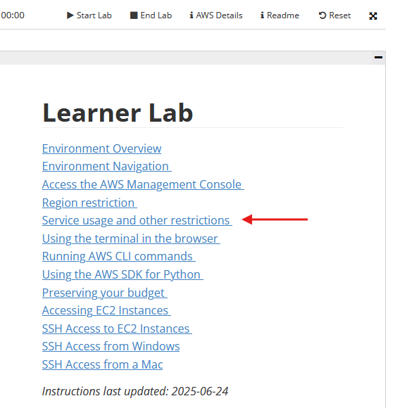
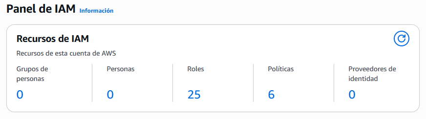
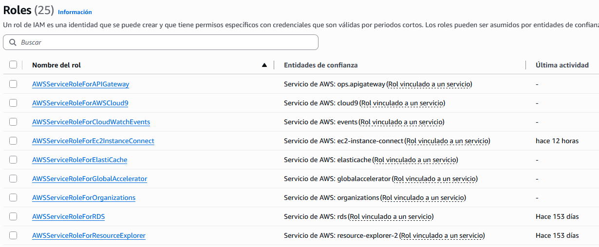
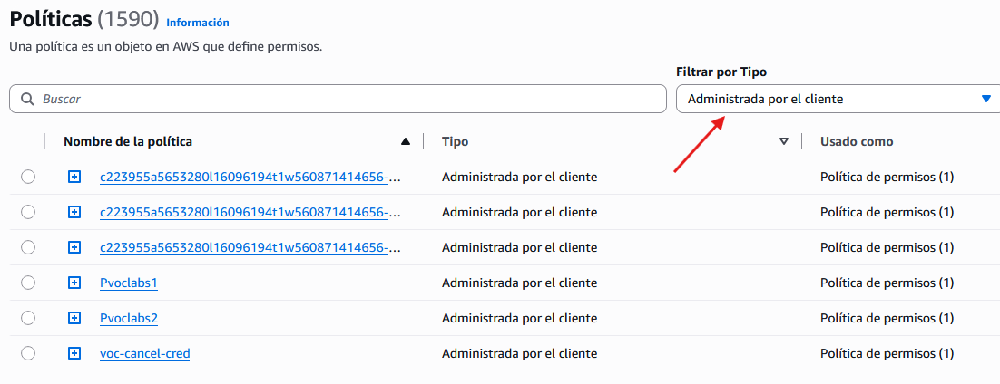

{ .cien .marco .marginbottom30}

**Resultados de aprendizaje y criterios de evaluacion que se evaluarán en esta unidad.**  

| **Resultados de aprendizaje de la unidad didáctica:** |
||
| **RA. 2:** Identifica los componentes clave de la infraestructura global de la nube, diferenciando servicios principales, regiones, zonas de disponibilidad y aplicando medidas básicas de seguridad como el modelo de responsabilidad compartida, gestión de accesos y protección de datos.|  

|**Criterios de evaluación de la unidad didáctica:**|
||
|**a)** Se ha adquirido conocimiento de los componentes de una infraestructura global en la nube. |

## 1 - Infraestruturas en AWS

Las **infraestructuras** de **AWS** son el conjunto de servicios y recursos que permiten desplegar aplicaciones, almacenar datos, procesar información y ofrecer servicios de red en la nube.

### 1.1 - Componentes principales de la infraestructura en AWS

1. **Regiones y Zonas de disponibilidad (AZs)**
    - Define la región (y las zonas de disponibilidad) donde crearemos nuestra insfraestrutura.

1. **Red y conectividad (VPC)**
    - Es la red virtual en la que implementaremos nuestra infraestructura.  
    - Una vez creada la VPC podremos configurar subredes públicas y privadas, tablas de enrutamiento, gateways (Internet Gateway, NAT Gateway) y reglas de seguridad (Security Groups).

1. **Instancias EC2**  
    - Una **instancia EC2** es, básicamente, una máquina virtual que implementaremos en nuestra VPC.
    - Las instancias son escalables (CPU, RAM, SSD) y gestionadas desde la consola de AWS o mediante API.

1. **Servicios**
    - **Elastic Load Balancer (ELB)**: Distribuye tráfico entre varias instancias.
    - **Auto Scaling**: Ajusta automáticamente la capacidad según la demanda.
    - **Lambda** (Serverless): Ejecuta código sin gestionar servidores.

1. **Almacenamiento**
    - **Amazon S3**: Almacenamiento de objetos altamente escalable.
    - **Amazon EBS**: Volúmenes de bloque para EC2.
    - **Amazon EFS**: Sistema de archivos compartido y elástico.
    - **Glacier/Deep Archive**: Almacenamiento de bajo coste para datos fríos.

1. **Bases de datos y análisis**
    - **RDS (Relational Database Service)** (MySQL, PostgreSQL, SQL Server, Oracle).
    - **Amazon Aurora**: Compatible con MySQL/PostgreSQL y optimizada para la nube.
    - **DynamoDB**: Base de datos NoSQL de baja latencia.

1. **Seguridad y gestión**
    - **IAM (Identity and Access Management)**, control de acceso y permisos (muy restringido en Learner Lab).
    - **AWS Organizations**: Gestión de varias cuentas.
    - **CloudTrail y CloudWatch**: Auditoría, monitorización y logging.

    !!! tip "¿Qué es IAM?"

        1. **IAM** (Identity and Access Management) es el servicio de AWS que permite gestionar el acceso a     los recursos de tu cuenta de forma segura. Con IAM se puede controlar **quién** (usuarios, grupos,  roles) **puede hacer qué** (acciones) **sobre qué recursos** (S3, EC2, etc.) **y bajo qué    condiciones**.

        1. **Los elementos principales de IAM son:**

            - **Usuarios (Users):** identidades individuales (personas o aplicaciones) con credenciales propias.
            - **Grupos (Groups):** conjuntos de usuarios a los que se les aplican los mismos permisos.
            - **Roles (Roles):** identidades temporales que pueden asumir usuarios, servicios o aplicaciones, sin necesidad de credenciales fijas.

                !!! warning "Un rol de IAM es una identidad de AWS con permisos específicos"
                    - No está asociada a una persona en concreto (a diferencia de un usuario).
                    - En vez de tener credenciales fijas (usuario/contraseña o access keys permanentes), un rol se asume temporalmente por quien lo necesite, y AWS le entrega credenciales de seguridad temporales mientras dura esa sesión.

            - **Políticas (Policies):** documentos JSON que definen permisos (qué acciones están permitidas o denegadas sobre qué recursos).

                !!! warning "Las políticas son el mecanismo que "activa" los permisos de usuarios"
                    - sin una política adjunta, una identidad de IAM no puede hacer nada.
                    - Ejemplo de política básica.
                    ```json
                    {
                      "Version": "2012-10-17",
                      "Statement": [
                        {
                          "Effect": "Allow",
                          "Action": "s3:GetObject",
                          "Resource": "arn:aws:s3:::mi-bucket/*"
                        }
                      ]
                    }
                    ```           

        1. **En Learner Lab, no se tiene acceso a IAM.** AWS Academy restringe este servicio porque:
            - La cuenta viene con un rol predefinido (generalmente voclabs o similar) que tiene permisos limitados.
            - Así pues, no se puede crear usuarios, grupos ni roles. 
            - Si entramos a la consola de IAM, veremos una vista muy limitada o directamente un mensaje de acceso denegado (AccessDenied) al intentar crear o modificar recursos de IAM.
            - Sí podemos ver el rol de laboratorio existente y a veces consultar políticas ya asignadas.

    !!! tip "Recursos y políticas disponibles para el ROL voclabs"
        - Podemos acceder a todos los recursos disponibles con el ROL voclabs desde la consola del   **Laboratorio de AWS Academy**.  
        {.marco .seiszero}
        - **Panel de IAM:**  
        Si vamos a IAM → Panel de IAM veremos que tenemos asignados **25 roles y 6 políticas**.
        {.marco .cien .margintop10 .marginbottom20}
        - **Roles:**  
        {.marco .cien .margintop10 .marginbottom20}
        - **Políticas:**
        {.marco .cien .margintop10 .marginbottom20}

### 1.2 VPC

- Una **VPC (Virtual Private Cloud)** en AWS es una red virtual aislada dentro de la nube de Amazon que permite definir y controlar un entorno de red.
- Es la base sobre la que se despliegan la mayoría de los servicios de AWS.

Más información [aquí](https://docs.aws.amazon.com/es_es/vpc/latest/userguide/what-is-amazon-vpc.html)

#### **1.2.1 - Elementos principales de una VPC**  

- **Subredes**  
Divisiones dentro de la VPC que pueden ser públicas (accesibles desde internet) o privadas (sin acceso directo desde internet).
- **Direccionamiento IP** (CIDR Block)  
El rango de direcciones IP que define la red de la VPC.
- **Enrutamiento** (Route Tables)  
Definen las rutas de tráfico dentro de la VPC y hacia afuera.
- **Puertas de enlace**, Internet Gateway (IGW)  
Componente que permite a las subredes públicas comunicarse con internet.
- **Puntos de conexión**  
Permiten conectarse a Servicios de AWS de forma privada.
- **NAT Gateway / NAT Instance:**  
Permiten que instancias en subredes privadas salgan a internet sin ser accesibles desde fuera.
- **Peering y Transit Gateway:**  
Conectan varias VPC entre sí.
- **VPN o AWS Direct Connect:**  
Permiten conectar una VPC con una infraestructura local.

#### 1.2.2 Tarea RA2-CEa-1 - Creación de una VPC

En esta tarea crearemos una VPC que nos permetrá ir familiarizandonos con la consola de AWS y entendiendo los conceptos básicos que forman parte de las redes privadas virtuales (VPC).

{ .original }

!!! Exercice "Pregunta 1"
    - La imagen contiene un error de concepto: ¿Cuál?
    - ¿Qué le falta al esquema para ser coherente con el concepto de subredes públicas y privadas?

1. Crear **a mano** una VPC que use el **CIDR 10.1.0.0/16** en la **región us-east-1** con el nombre MiPrimeraVPC.  
1. Esta VPC dispondrá de **3 subredes públicas**, **cada una en una zona de disponibilidad**.
    - us-east-1a con CIDR block 10.1.1.0/24 y de nombre SubRed_Pública_1  
    - us-east-1b con CIDR block 10.1.2.0/24 y de nombre SubRed_Pública_2
    - us-east-1c con CIDR block 10.1.3.0/24 y de nombre SubRed_Pública_3
1. Esta VPC dispondrá de **3 subredes privadas**, **cada una en una zona de disponibilidad**.
    - us-east-1a con CIDR block 10.1.11.0/24 y de nombre SubRed_Privada_1
    - us-east-1b con CIDR block 10.1.12.0/24 y de nombre SubRed_Privada_2
    - us-east-1c con CIDR block 10.1.13.0/24 y de nombre SubRed_Privada_3
1. Eliminar las VPC's, subredes y tablas de enrutamiento creadas.

1. Repetir el ejercicio anterior pero esta vez usando **el asistente de AWS**.

!!! Exercice "Pregunta 2"
    ¿Cuantas direcciones IP admite la VPC?

!!! Exercice "Pregunta 3"
    ¿Cuantas direcciones IP admite una subred de CIDR 10.1.1.0/25?

!!! warning "Condiciones de la entrega"

    - Realizar capturas de pantalla del mapa de recursos de la VPC. 
    - Comentar brevemente cada captura para entender a qué corresponde y subir el documento a la tarea correspondiente de AULES.

#### 1.2.3 Enrutamiento de subredes y puerta de enlace

- Como acabamos de ver en la práctica anterior, un VPC se debe dividir entre varias subredes.
- A continuación veremos las configuraciones a aportar para que las diferentes subredes puedan comunicarse entre si y también, acceder a internet.

#### 1.2.3.1 Tablas de enrutamiento

!!! info "Routes tables (tablas de enrutamiento)"
    Las tablas de enrutamiento (RT) contienen una lista de rutas que determinan hacia qué redes (o subredes) se debe direccionar el tráfico procedente (de las instancias) de las subredes.

!!! success "RT's en AWS"
    1. Cada subred de una VPC **está asociada a una única tabla de enrutamiento**. Si no se le asigna ninguna tabla, AWS le asignará por defecto la **RT principal**.
    1. Varias subredes pueden compartir **una misma tabla de enrutamiento**.
    1. Cada ruta dentro de la tabla tiene dos partes:
        - Destino (CIDR) → la red a la que se desea llegar (ejemplo: 10.0.0.0/16, 0.0.0.0/0).
        - Target (puerta de salida) → el recurso al que se envía el tráfico (Internet Gateway, NAT Gateway, otro destino dentro de la VPC,etc.).
    1. Las instancias no deciden a dónde enviar el tráfico, lo hace la tabla de enrutamiento de la subred a la que están asociadas.
    1. Es de práctica habitual tener al menos 2 RT's en una VPC.
    1. Una tabla de enrutamiento para las redes privadas (redes a las que **no se puede** acceder desde internet).
    1. Una tabla de enrutamiento para las redes públicas (redes a las que **si se puede** acceder desde internet).

!!! example "Ejemplo de tabla de enrutamiento en AWS"
    {.original .marco}

    - En este ejemplo, vemos cómo el tráfico destinado a la red 172.18.0.0/16 se enruta localmente, es decir, todo el tráfico interno dentro de ese rango IP se queda dentro de la VPC.
    - También vemos cómo el tráfico con destino a direcciones no especificadas (0.0.0.0/0) se enruta hacia la puerta de enlace de Internet (IGW) para salir de la VPC.

#### 1.2.3.2 Internet gateway (IGW - puerta de enlace)

- Una puerta de enlace (gateway) es el dispositivo que permite que un equipo de una red local pueda comunicarse con otras redes (por ejemplo, con Internet).  
- En AWS, el concepto es el mismo, pero en lugar de tener un router físico, se usan recursos gestionados por la nube que cumplen esa función.

!!! info "Tipos principales de puertas de enlace en AWS"  
    - **Internet Gateway (IGW):** Es la puerta de enlace que permite la comunicación entre la VPC y Internet.
    - **NAT Gateway (Network Address Translation):** Puerta de enlace para que las **subredes privadas puedan salir a Internet**, pero sin permitir conexiones entrantes desde Internet.
    - **IP elástica:** Es una **dirección IPv4 pública estática** que se puede asignar a los recursos dentro de una VPC en AWS. **No permenece a la VPC** sino a la cuenta de usuario de AWS. Permite mantener la IP pública de una instancia aunque la paremos y lanzemos de nuevo.
    - **IGW de solo salida:** Similar al Internet Gateway, pero solo para **tráfico saliente de IPv6**.

#### 1.2.4 Tarea RA2-CEa-2 - Creación de una VPC con acceso a internet

Realizar el siguiente escenario y poblar las tablas de enrutamiento de las subredes públicas y privadas.

{ .original }

!!! warning "Condiciones de la entrega"

    - Realizar capturas de pantalla del mapa de recursos de la VPC. 
    - Realizar capturas de la tabla de enrutamiento de la subred pública y privada. 
    - Comentar brevemente cada captura para entender a qué corresponde y subir el documento a la tarea correspondiente de AULES.

## 2 - Enlaces de interés

Documentación de [AWS](https://docs.aws.amazon.com).  
Más info sobre las [tablas de enroutamiento](https://docs.aws.amazon.com/es_es/vpc/latest/userguide/VPC_Route_Tables.html).  
Más info sobre las [puertas de enlace](https://docs.aws.amazon.com/vpc/latest/userguide/VPC_Internet_Gateway.html).
