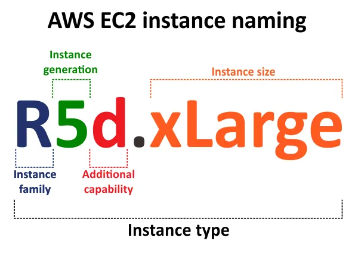

{ .sietecinco }
 

## **Introducción**
Uno de los servicios más utilizados de AWS es **Amazon EC2 (Elastic Compute Cloud)**, que permite lanzar y administrar **instancias**, es decir, **máquinas virtuales** que funcionan de manera similar a un ordenador físico.  

Estas instancias pueden configurarse con distintos sistemas operativos, hardware para adaptarse a las necesidades de cada proyecto (aplicación web, base de datos...).

Al igual que cualquier dispositivo, las instancias necesitan un mecanismo de control de tráfico para **garantizar su seguridad**. En este contexto aparecen los **grupos de seguridad** (Security Groups, SG). Un grupo de seguridad no es más que un firewall virtual, que supervisa (y restrinje) el tráfico entrante y saliente a las instancias.

En conjunto, las EC2 y los SG constituyen la base de la infraestructura en la nube: las instancias proporcionan la capacidad de cómputo, mientras que los grupos de seguridad ofrecen la primera línea de defensa para proteger los recursos desplegados.

## **Instancias EC2**
Como hemos dicho, una instancia EC2 es básicamente una computadora en la nube. Al igual que los equipos físicos se caracterizan por una serie de características como la potencia de computo, su RAM y otras que veremos a continuación.

**Nomenclatura de las instancias EC2**  
El nombre de la instancia define las especificaciones de la misma es decir, la familia, la generación, la capacidad adicional y el tamaño.

{.doscinco}

- **Familia**  
La familia define la optimización principal de la máquina, dicho en otras palabras, el uso preferente que debemos dar a esas máquinas.  
C → Compute Optimized. Para cargas de trabajo que requieren mucha CPU (alta relación CPU/memoria).  
M → General Purpose. Equilibrio entre CPU, memoria y almacenamiento. Usadas para la mayoría de aplicaciones estándar.  
R → Memory Optimized. Diseñadas para cargas de trabajo que requieren gran cantidad de memoria en relación con la CPU.  
I → Storage Optimized (I/O Optimized). Pensadas para cargas que requieren altísimo rendimiento en disco local (NVMe/SSD).   
G → **Graphics / GPU-based**. Para machine learning (basadas en GPU NVIDIA).  
P → **Accelerated Computing (GPU)**. Para entrenamiento de deep learning, computación científica, simulaciones de alto nivel.  
X → Extra Memory Optimized. Instancias con terabytes de RAM, usadas para grandes bases de datos o aplicaciones que requieren mucha memoria.  
 

- **Generaciones**  
Representan la evolución tecnológica de las instancias. Cada nueva generación trae mejor rendimiento, menor coste por hora y mejor eficiencia energética.  
Se identifican por el número que acompaña a la familia.  
👉 Ejemplo:  
      - t2.micro → 2ª generación de instancias de uso general.  
      - t3.micro → 3ª generación, más eficiente que t2.  
      - t4g.micro → 4ª generación, basada en procesadores ARM Graviton2 de AWS.  
   

- **Capacidad adicional**  
La capacidad adicional de EC2 se refiere a esas optimizaciones extra (almacenamiento, red, EBS, GPU, bare metal, etc.) que hacen que dos instancias de la misma familia y tamaño puedan comportarse de forma distinta.  
Las letras utilizadas en el nombre de instancia y las propiedades asociadas se explican en la tabla siguiente.  

       |Nombre |Propiedad|Ejemplo|
       |-|-|-|
       |a|Procesador AMD|m5a|
       |d|Almacenamiento SSD NVMe local|m5d|
       |e|Capacidad extra|P6e|
       |g|Procesador Graviton(ARM)|m6g|
       |n|Redes de alta velocidad|c5n|
       |z|Alta frecuencia de CPU|m5zn|
       |.metal|Bare metal|m8g.metal|
             
- **Tamaño de la instancia**

El tamaño de la instancia de AWS EC2 muestra el número de recursos de hardware (capacidad) aprovisionados a la instancia. Diferentes tamaños de instancia de AWS pueden utilizar el mismo hardware pero con diferentes ampliaciones. A veces, instancias de distintos tamaños pueden ejecutarse en hardware diferente, por ejemplo, utilizar dispositivos de almacenamiento SSD o HDD. Un ejemplo sencillo es la cantidad de memoria. El tamaño de instancia más bajo contiene la menor cantidad de memoria, y los tamaños de instancia de AWS EC2 más grandes contienen proporcionalmente más memoria.

Para mayor comodidad, veamos cuatro tamaños de instancia AWS EC2 para instancias R5d y visualicémoslos en la imagen siguiente.

    xlarge es la instancia más pequeña de nuestra comparación de instancias EC2 utilizada en este ejemplo, y este tamaño de instancia llena el área más baja de un rectángulo.
    2xlarge ocupa el doble de superficie en el rectángulo que la instancia R5d.xlarge.
    4xlarge es cuatro veces mayor que R5d .xlarge y dos veces mayor que R5d.2xlarge.
    8xlarge tiene una capacidad igual a ocho instancias R5d .xlarge, cuatro instancias R5d.2xlarge o dos instancias R5d.4xlarge.

https://www.nakivo.com/es/blog/the-definitive-guide-to-aws-ec2-instance-types/
https://dondeaprendoaws.com/blog/tipos-y-tamanos-de-instancias-ec2-guia-completa/

---
https://docs.aws.amazon.com/es_es/AWSEC2/latest/UserGuide/ComponentsAMIs.html

hay que hablar de las AMI
---

EC2 está diseñado para integrarse con otros servicios de Amazon Web Services, como Amazon S3 o Amazon SQS, el primero como almacenamiento de soporte y el segundo para la automatización del envío de notificaciones. Además, Amazon EC2 incluye herramientas complementarias de optimización como:

    Amazon EC2 Container Service: sirve para gestionar los contenedores Docker dentro de un clúster de instancias en Amazon EC2. Mediante la API, se pueden desplegar y suprimir aplicaciones de contenedores Docker y otro tipo de opciones dentro del entorno virtual.
    Elastic Load Balancing: permite distribuir de forma automática el tráfico que reciben las aplicaciones entre distintas instancias de Amazon EC2. Al distribuir de forma equilibrada el tráfico, la carga necesaria para cada instancia se reduce, así como la posibilidad de errores por sobrecarga.
    Auto Scaling: como su nombre indica, este servicio para Amazon EC2 permite escalar de forma automática la capacidad de las instancias. De esta forma, se podrá mantener en ejecución el número de máquinas virtuales adecuadas para la carga de trabajo de las instancias de Amazon EC2.
    Amazon CloudWatch: un servicio web disponible para los usuarios de AWS que muestra datos en tiempo real sobre el uso de recursos de las instancias de Amazon EC2. La CPU o la cantidad de tráfico web son los elementos básicos que analiza este servicio, aunque puede instalarse software adicional en una instancia si se desea monitorizar la memoria, el espacio en disco o la carga de trabajo.

---

familia de la instancia: t,m,c,r,x,p,g,z
generacion de la instancia: 1,2,3...6
sufijos: nano, micro, small, medium, large,... 8xlarge

---
Cuando lanzas una instancia EC2 con acceso a Internet, AWS puede darle automáticamente una **IP pública dinámica**.

* Problema: si la instancia se detiene y vuelve a iniciarse, esa IP **cambia**.
* Solución: si necesitas una IP que no cambie (para DNS, aplicaciones críticas, accesos seguros, etc.), usas una **Elastic IP**.

---

## ⚙️ Funcionamiento básico

1. **Asignación**

   * Pides una IP elástica desde la consola de AWS (o vía CLI/API).
   * AWS te reserva una dirección IPv4 pública.

2. **Asociación**

   * La puedes asociar a:

     * Una **instancia EC2**.
     * Una **interfaz de red (ENI)**.
     * Un **NAT Gateway**.

3. **Reasignación**

   * Si tu instancia falla, puedes **reasignar la IP** a otra instancia en cuestión de segundos, sin necesidad de cambiar DNS o configuraciones externas.

---

## 💡 Características importantes

* **Gratis solo si está en uso**: AWS **no cobra** por una IP elástica que esté asociada a una instancia en ejecución.
  Pero si la reservas y no la usas, sí genera coste (para evitar desperdicio de direcciones IPv4).
* Son solo **IPv4**. En IPv6 no hacen falta porque las direcciones son abundantes y estables.
* Una cuenta AWS tiene un **límite predeterminado** de EIPs (normalmente 5 por región), aunque puedes pedir aumento.

---

## 🎯 Ejemplo práctico

Imagina que tienes una aplicación en una instancia EC2:

* Si solo usas la IP pública automática y la instancia se reinicia → **la IP cambia** → tus usuarios no podrán conectarse si la tenían guardada.
* Si usas una **Elastic IP** → la IP se mantiene siempre igual, aunque detengas, reinicies o reemplaces la máquina.

---

👉 En resumen:
Una **Elastic IP en AWS** es como tener una **dirección fija en Internet** para tus recursos, lo que te da **estabilidad y flexibilidad** en caso de fallos o cambios en la infraestructura.

---

¿Quieres que te prepare un **esquema visual con un ejemplo** de cómo una IP elástica se reasigna entre instancias EC2 en caso de fallo?

IGW de solo salida: Similar al Internet Gateway, pero solo para **tráfico saliente de IPv6**. 

https://www.youtube.com/watch?v=DSkO0ZJ8PxA

https://www.youtube.com/watch?v=lTUUJBa1dp4&list=PLDbrnXa6SAzV0J3Un9jRnbbFpuQH-_y-C&index=11

https://www.youtube.com/watch?v=iAYYssYrGms

https://www.youtube.com/watch?v=CGmTvukObOw

## **Grupos de seguridad**

## **Tarea 1**
file:///C:/Users/titan/Documents/Javier128/Eclipse/AWS/Arqui%20y%20despliegues%20en%20AWS/Tema%202/Tema2.VPC-IGW-subred.pdf

## **Enlaces de interés**
Documentación de [AWS](https://docs.aws.amazon.com).
Instancias [EC2](https://docs.aws.amazon.com/es_es/ec2/?icmpid=docs_homepage_featuredsvcs).
Tipos de instancias [EC2](https://aws.amazon.com/es/ec2/instance-types).

https://docs.aws.amazon.com/es_es/vpc/latest/userguide/VPC_Route_Tables.html
https://docs.aws.amazon.com/vpc/latest/userguide/VPC_Internet_Gateway.html
