# **UT. 5 - Instancias y seguridad en AWS**

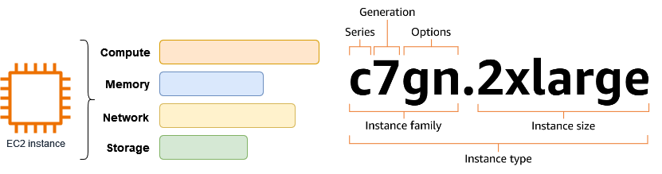{ .sietecinco }

<br>

**Resultados de aprendizaje y criterios de evaluacion que se evaluarán en esta unidad.**  

| **Resultados de aprendizaje de la unidad didáctica:** |
|-|
| **RA. 2:** Identifica los componentes clave de la infraestructura global de la nube, diferenciando servicios principales, regiones, zonas de disponibilidad y aplicando medidas básicas de seguridad como el modelo de responsabilidad compartida, gestión de accesos y protección de datos.|  


|**Criterios de evaluación de la unidad didáctica:**|
||
|**b)** Se ha demostrado la capacidad para explorar y describir las principales categorías de servicios disponibles.|
|**c)** Se ha realizado una evaluación del uso adecuado de servicios básicos en ejercicios prácticos.|
|**d)** Se ha comprendido el modelo de responsabilidad compartida en la nube.|

| **Resultados de aprendizaje de la unidad didáctica:** |
|-|
|**RA. 3:** Diseña y configura redes virtuales y servicios de cómputo en la nube, aplicando buenas prácticas de seguridad, estrategias de balanceo de carga, escalado automático y aprovechando tecnologías serverless, contenedores y máquinas virtuales según casos de uso específicos.|
|-|
|**a)** Se ha realizado el diseño y configuración de redes virtuales privadas.|20%|
|**b)** Se ha aplicado buenas prácticas de seguridad en redes y arquitecturas.|20%|
|**c)** Se ha participado activamente en la creación y configuración de una red funcional.|15%|

<br>

  

## **1 - Introducción**
Uno de los servicios más utilizados de AWS es **Amazon EC2 (Elastic Compute Cloud)**, que permite lanzar y administrar **instancias**, es decir, **máquinas virtuales** que funcionan de manera similar a un ordenador físico.  

Estas **instancias** pueden configurarse con distintos sistemas operativos, hardware para adaptarse a las necesidades de cada proyecto (aplicación web, base de datos...).

Al igual que cualquier dispositivo, las instancias necesitan un mecanismo de control de tráfico para **garantizar su seguridad**. En este contexto aparecen los **grupos de seguridad** (Security Groups, SG). Un grupo de seguridad no es más que un **firewall virtual**, que supervisa y restrinje el tráfico entrante y saliente de las instancias.

En conjunto, las EC2 y los SG constituyen la base de la infraestructura en la nube: las instancias proporcionan la capacidad de cómputo, mientras que los grupos de seguridad ofrecen la primera línea de defensa para proteger los recursos desplegados.

## **2 - Instancias EC2**
### **2.1 - Instancias de AWS**
Como hemos dicho, una instancia EC2 (**E**lastic **C**loud **C**ompute) es básicamente una computadora en la nube.  
**Al igual que los equipos físicos**, las instancias se caracterizan por una serie de características como potencia de computo, RAM y otras características que veremos a continuación.

**Nomenclatura de las instancias EC2**  
El nombre de la instancia define las especificaciones de la misma es decir, la familia, la generación, la capacidad adicional y el tamaño.

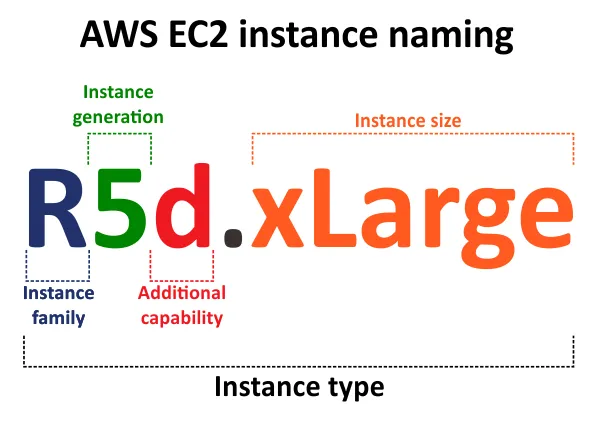{.doscinco}

- **Familia**  
La familia define la optimización principal de la máquina, dicho en otras palabras, el uso preferente que debemos dar a esas máquinas.  

      |Familia|Aplicación|
      |:-:|-|
      |C|  Compute Optimized. Para cargas de trabajo que requieren mucha CPU (alta      relación CPU/memoria).  |
      |M | General Purpose. Equilibrio entre CPU, memoria y almacenamiento. Usadas para       la mayoría de aplicaciones estándar.  |
      |R| Memory Optimized. Diseñadas para cargas de trabajo que requieren gran     cantidad de memoria en relación con la CPU.  |
      |I| Storage Optimized (I/O Optimized). Pensadas para cargas que requieren     altísimo rendimiento en disco local (NVMe/SSD).   |
      |G | **Graphics / GPU-based**. Para machine learning (basadas en GPU NVIDIA).  |
      |P|  **Accelerated Computing (GPU)**. Para entrenamiento de deep learning,     computación científica, simulaciones de alto nivel.  |
      |X|  Extra Memory Optimized. Instancias con terabytes de RAM, usadas para grandes       bases de datos o aplicaciones que requieren mucha memoria.  |


- **Generación**  
Representan la evolución tecnológica de las instancias. Cada nueva generación trae mejor rendimiento, menor coste por hora y mejor eficiencia energética.  
La generación de una instancia EC2 se identifica por el número que acompaña a la familia.<br>  
**Ejemplos:**  

      |Instancias|Descripción|
      |-|-|
      |t**2**.micro | 2ª generación de instancias de uso general.  |
      |t**3**.micro | 3ª generación, más eficiente que t2.  |
      |t**4**g.micro | 4ª generación, basada en procesadores ARM Graviton2 de AWS. |

  

- **Capacidad adicional**  
La capacidad adicional de EC2 se refiere a esas optimizaciones extra (almacenamiento, red, EBS, GPU, bare metal, etc.) que hacen que dos instancias de la misma familia y tamaño puedan comportarse de forma distinta.  
Las letras utilizadas en el nombre de instancia y las propiedades asociadas se explican en la tabla siguiente.  

       |Nombre |Propiedad|Ejemplo|
       |-|-|-|
       |a|Procesador AMD|m5a|
       |d|Almacenamiento SSD NVMe local|m5d|
       |e|Capacidad extra|P6e|
       |g|Procesador Graviton(ARM)|m6g|
       |n|Redes de alta velocidad|c5n|
       |z|Alta frecuencia de CPU|m5zn|
       |.metal|Bare metal|m8g.metal|
             
- **Tamaño de la instancia**  
El **tamaño de una instancia de EC2 en AWS** se refiere a la combinación de recursos de hardware virtualizados (vCPU, memoria RAM, almacenamiento y capacidad de red) que se asignan a una máquina virtual. En otras palabras, define la **potencia y capacidad de cómputo** que tendrá la instancia dentro de la familia de instancias elegida.  
<br>
 

      **Tabla comparativa de tamaños de instancias:**  

      | Instancia   | vCPU | RAM (GB) | Almacenamiento (GB) | Red (Gbit/s) | Ancho de banda de EBS | Precio USD/h (% aumento) |
      |-------------|------|----------|----------------------|--------------|------------------------|--------------------------|
      | r5d.xlarge  | 4    | 32       | 1 x 150             | Hasta 10     | Hasta 4750             | 0.288                    |
      | r5d.2xlarge | 8    | 64       | 1 x 300             | Hasta 10     | Hasta 4750             | 0.576 (+100%)            |
      | r5d.4xlarge | 16   | 128      | 2 x 300             | Hasta 10     | 4750                   | 1.152 (+100%)            |
      | r5d.8xlarge | 32   | 256      | 2 x 600             | 10           | 6800                   | 2.304 (+100%)            |
<br>

### **2.2 - AMI (Amazon Machine Image)**
Una AMI es una plantilla que contiene la información necesaria para lanzar una instancia de EC2. Es como si fuera la `imagen base` de una máquina virtual.

Cada AMI incluye:

* **Un sistema operativo** (Amazon Linux, Ubuntu, Windows Server, etc.).
* **Software preinstalado** (Apache, Nginx, MySQL, Docker, etc.).
* **Configuración de permisos** (qué usuarios pueden usar la AMI, no es posible hacerlo con las cuentas de ALB).
* **Configuración de volumen raíz** (el disco donde se instala el sistema).
* ...

Cuando se lanza una **instancia EC2**, se elige una AMI como punto de partida, y a partir de ahí la instancia puede configurarse, modificarse y **personalizarse**.

#### **2.2.1 - Tipos de AMI**

1. **AMIs públicas**

     * Disponibles en el catálogo de AWS.
     * Incluyen imágenes oficiales de Amazon (Amazon Linux, Windows, etc.) y distribuciones de Linux mantenidas por la comunidad o proveedores (Ubuntu, Debian, RHEL…).

2. **AMIs privadas**

     * Creadas por **un usuario**.
     * Solo accesibles para la cuenta propietaria (posibilidad de compartir).

3. **AMIs del AWS Marketplace**

     * Imágenes de terceros (generalmente de pago) con aplicaciones ya listas (WordPress, SAP, soluciones de seguridad, etc.).

#### **2.2.2 - Regiones y AMIs**

* Una AMI está **ligada a una región**.
* Si se necesita usarla en otra región, se debe **copiar**.

#### **2.2.3 - Crear una AMI**

Se pueden crear AMI's desde:

1. **Una instancia EC2 existente** → Tomar un snapshot y convertir en AMI.
2. **Un snapshot de EBS** → Luego convertir en AMI.
3. **Importar una VM** (desde VMware, VirtualBox o Hyper-V con la herramienta VM Import/Export).

### **2.3 - EBS (Elastic Block Store)**
**EBS (Elastic Block Store)** es el servicio de **almacenamiento en bloque** que se usa para las instancias EC2. Dicho en otras palabras, es el **disco duro** de las instancias y se puede usar para instalar el sistema operativo, guardar bases de datos, etc.

#### **2.3.1 - Concepto básico**
!!! info "Características principales"
    * **Persistente**: los datos persisten aunque la instancia EC2 se detenga o se termine (si el volumen no se borra automáticamente al terminar la instancia).
    * **Redimensionable**: Se puede cambiar el tamaño, tipo o rendimiento sin reiniciar la instancia (en muchos casos).
    * **Alta disponibilidad**: cada volumen EBS se replica automáticamente dentro de la zona de disponibilidad (AZ) para protegerlo de fallos de hardware.
    * **Snapshots**: Se pueden programar copias de seguridad incrementales en S3 (Snapshots EBS).
    * **Tipos de volumen**: AWS ofrece varios tipos (SSD y HDD) adaptados a rendimiento y coste:  
    &nbsp;&nbsp;&nbsp;&nbsp; **gp3/gp2**: SSD de uso general.  
    &nbsp;&nbsp;&nbsp;&nbsp; **io1/io2**: SSD de alto rendimiento para IOPS elevados.  
    &nbsp;&nbsp;&nbsp;&nbsp; **st1**: HDD optimizado para throughput.  
    &nbsp;&nbsp;&nbsp;&nbsp; **sc1**: HDD de bajo coste para datos menos usados.

---
#### **2.3.2 - Uso con EC2**
* Al lanzar una instancia EC2, se crea automáticamente un volumen EBS para el sistema operativo.
* Se puede **adjuntar** varios volúmenes EBS a una misma instancia EC2.
* **Se deben montar** como dispositivos de bloque en el sistema operativo y luego se formatean y usan como cualquier disco.
* Es posible **desadjuntar** un volumen de una instancia y **adjuntarlo** a otra (útil para migrar datos).
---

#### **2.3.3 - Otros tipos de almacenamientos de AWS**

* **Instance store**: almacenamiento efímero local (desaparece al detener/terminar la instancia).
* **S3**: almacenamiento de objetos, no en bloques.
* **EFS**: almacenamiento de archivos (compartido NFS).
---
### **2.4 - Tarea RA2-CEb**
Realizar el siguiente escenario.
De momento, no tener en cuenta los grupos de seguridad.  

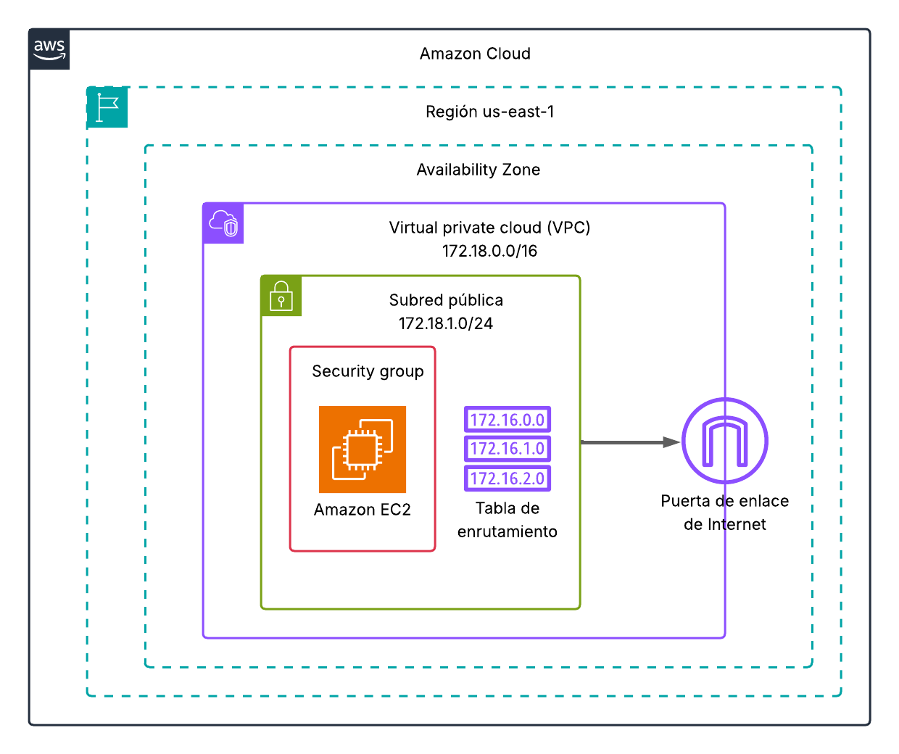{ .sietecinco }

!!! question "Preguntas a responder:"
    1. Suponiendo que queremos usar la EC2 de la subred pública como servidor web (frontend), ¿Qué debemos hacer para ampliar la infraestructura e incorporar un servidor para el backend?
    2. Queremos, además, guardar imágenes, PDFs y vídeos para que los clientes puedan descargarlos.  
    ¿Qué tipo de almacenamiento de AWS sería el más adecuado?  
    Buscar un ejemplo de tipo de almacenamiento adecuado en AWS. 
---

#### **2.4.1 - Infraestructura de red básica**
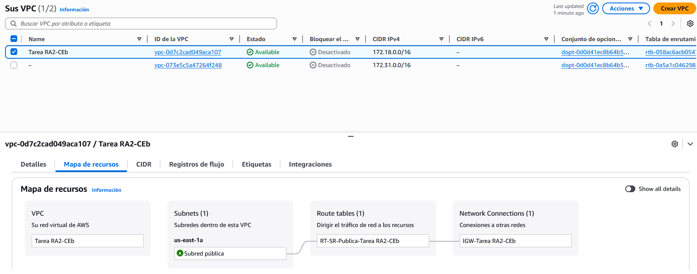{ .original .marco }
<br>

#### **2.4.2 - Lanzar instancia 1/4**
!!! tip "Vamos a EC2"
Una vez dentro del menú de instancias veremos los apartados principales de EC2

- **Instances (Instancias):**  
Donde se puede lanzar, detener, reiniciar o terminar instancias EC2.

- **Images (Imágenes):**
Donde se puede gestionar las AMIs, que son plantillas para lanzar nuevas instancias con un sistema operativo y software preinstalado.

- **Elastic Block Store (EBS):**
Servicio de almacenamiento en bloques persistente. Permite crear y asociar volúmenes a las instancias EC2.  
**Nota:** EBS no es específico de EC2 pero, tiene su propio menú aquí.

- **Network & Security (Red y seguridad):**
Desde aquí se gestion los Security Groups, Elastic IPs, Key Pairs y VPCs asociadas a las instancias.
Básicamente, es donde se definen las reglas de seguridad y de conectividad.

- **Load Balancing (Balanceo de carga):**
Sección para crear y administrar Elastic Load Balancers (ELB), que reparten el tráfico entre varias instancias.

- **Auto Scaling:**
Aquí se configuran los **Auto Scaling Groups**, que crean o destruyen instancias automáticamente según las métricas (CPU, tráfico, etc.) para mantener el rendimiento.

!!! tip "Lanzamos una instancia."
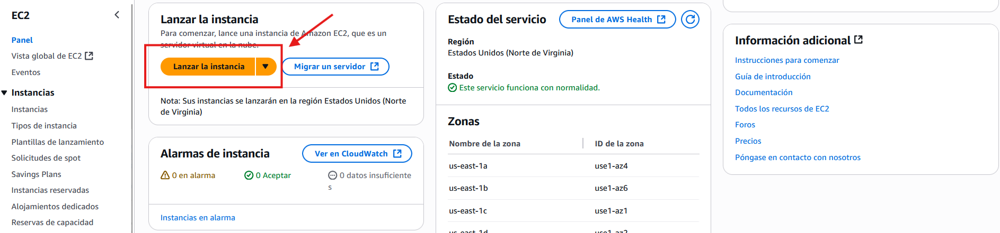{ .original .marco }
<br>

#### **2.4.3 - Lanzar instancia 2/4**
1. Damos un nombre a la instancia.
1. Seleccionamos el tipo de instancia y la AMI adecuada a nuestras necesidades.

    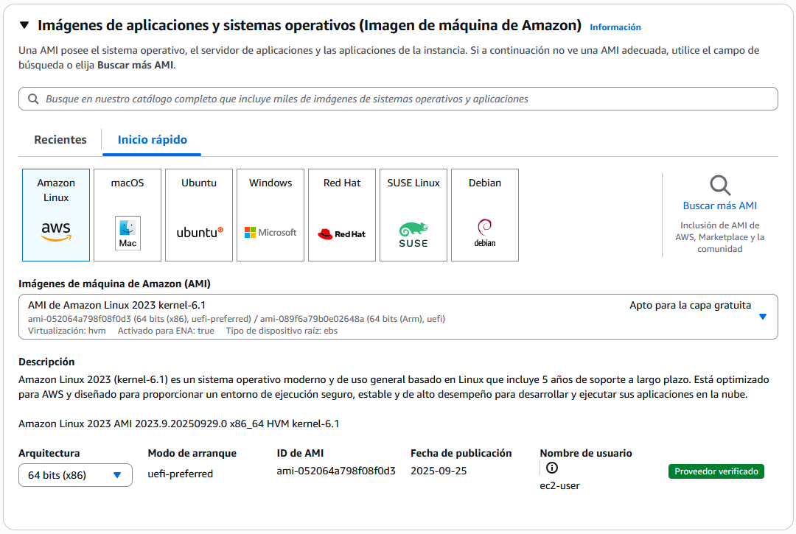{ .original }
    <br>
    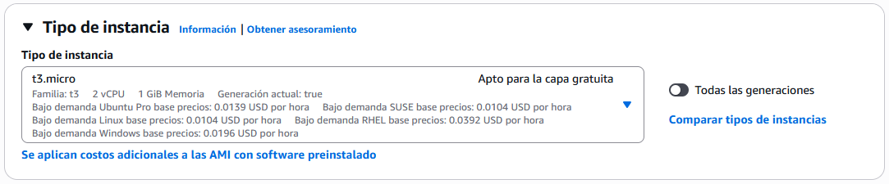{ .original }
    <br>

#### **2.4.4 - Lanzar instancia 3/4**
1. Elegimos el par de claves con el que podremos conectarnos por SSH a nuestra instancia.
  
    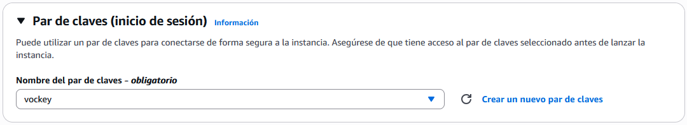{ .original }
<br>

1. Configuración de red y seguridad

    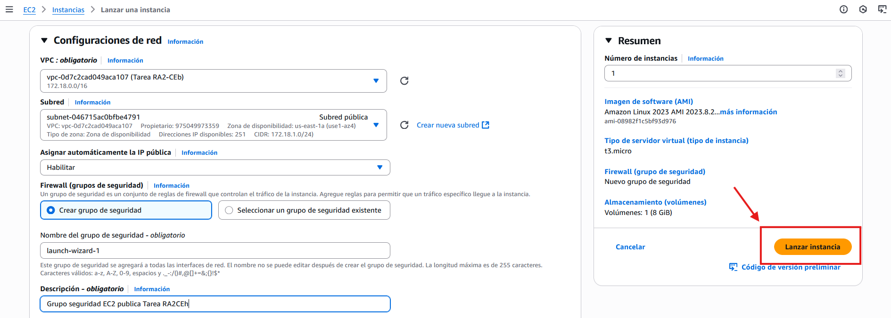{ .original }
<br>    

#### **2.4.5 - Lanzar instancia 4/4**
1. Elegimos el tamaño del almacenamiento del volumen raíz. 


    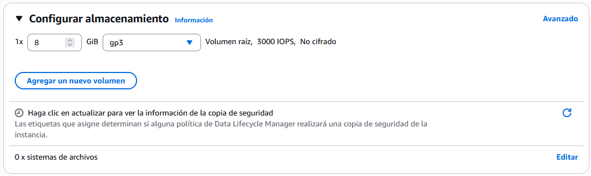{ .original }
<br>    

1. Modificar volumen (sí necesario)  
Es posible **aumentar** el tamaño del volumen raíz. Para ello, basta con detener la instancia, ir al menú de los volumenes EBS y modificar el tamaño.  
**Nota:** Ampliar la capacidad del volumen no presenta ninguna dificultad. Reducirlo implica realizar una **snapshot del mismo**, **eliminar** el EBS original, **crear y poner otro** de menor tamaño.     

    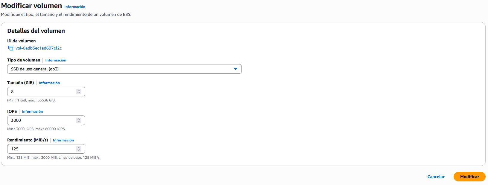{ .original .marco }
<br>   

#### **2.4.6 - Panel de control de las instancias**
- **Instancias**

    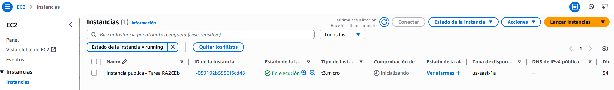{ .original .marco }
<br>

- **Resumen de las instancias**  
**Nota:** Asegurarse de que tenemos un IPv4 pública. De lo contrario no será posible conectarse remotamente con la instancia.

    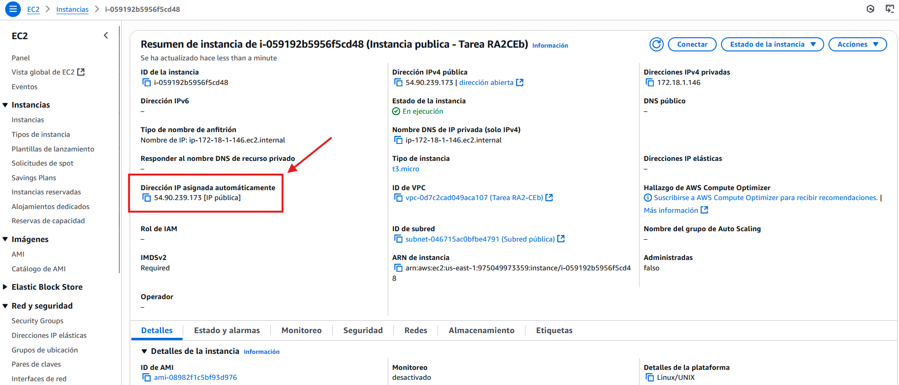{ .original .marco }
<br>

#### **2.4.7 - Conexión remota con la instancia**
El laboratorio crea por defecto una clave llamada **vockey**. Esa llave que ya hemos usado a la hora de configurar nustra instancia EC2 permitirá a un cliente SSH conectarse a ella de forma remota.

1. **Descargar el archivo de clave privada labsuser.pem**  
El fichero labsuser.pem se encuentra disponible en **AWS Academy Learner Lab** en `AWS Details`.
El fichero labsuser.pem contiene la parte privada de la clave que necesitará el cliente SSH para conectarse a la EC2 en la cual se encuentra instalada la parte pública de la clave.

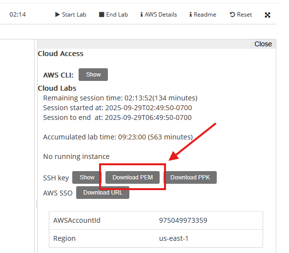{ .cincozero .marco }
<br>

1. **Cambiar los permisos del archivo labsuser.pem**  
Para cambiar los permisos a solo lectura por el propietario usaremos:
```bash
chmod 400 labsuser.pem
```
<br>

1. **Conexión remota por SSH a la instancia**  
Para conectarnos a la instancia por SSH usaremos el cliente de ssh con los siguientes argumentos:
```bash
ssh -i labsuser.pem ec2-user@3.90.114.96   
```

    !!! info "Explicación del comando"
        🔹**ssh:** Cliente de Secure Shell, que permite conectarte de forma remota y segura a otro equipo.  
        🔹**-i labsuser.pem:** La opción -i especifica la clave privada (**labsuser.pem**) que se usará para autenticarse.  
        🔹**ec2-user@3.90.114.96:** Indica usuario y dirección de la instancia a la que nos queremos conectar.   

    !!! info "¿Cómo saber nuestro nombre de usuario?"
        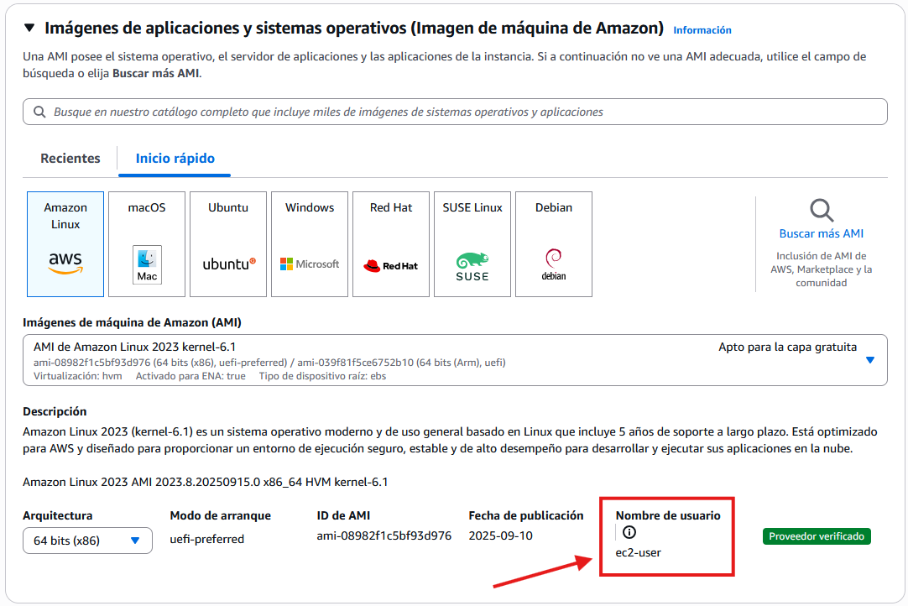 

    !!! info "¿Cómo saber la ip de la instancia?"
        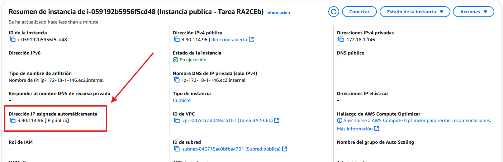 
<br>

#### **2.4.8 - Conexión con la instancia desde la consola de AWS**  
También es posible conectarse a la instancia desde el panel de control de AWS.

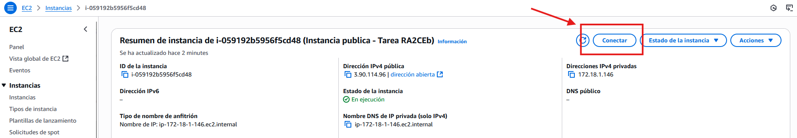{ .original .marco }

<br>

Una vez hecha la conexión podremos usar ese servicio virtualizado.

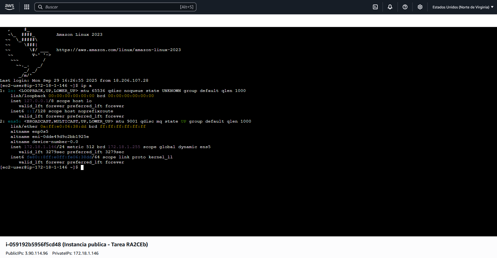{ .original .marco }

<br>

#### **2.4.9 - Realizar Ping a la instancia**  
Si queremos realizar un ping a la instancia desde cualquier ordenador veremos que no es posible.

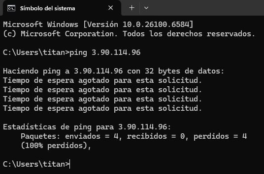{ .cincozero }
<br>

Para poder realizar el ping deberemos agregar reglas **al grupo de seguridad de la instancia**. En este caso añadiremos una regla de protocolo de mensajes de control de Internet **ICMP**.  

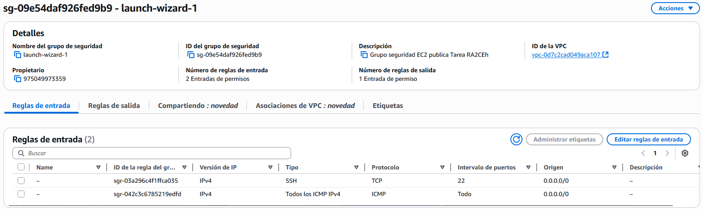{ .original .marco }
<br>

Después de agregar la regla ICMP sí que será posible realizar un ping a nuestra instancia.   

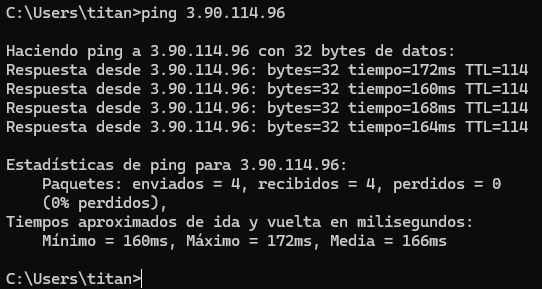{ .cincozero }
<br>

#### **2.4.10 - Modificar el tamaño de un EBS**
Aunque en la consola de EC2 podamos gestionar los volúmenes EBS asociados a nuestras instancias, EC2 y EBS son **servicios independientes** dentro de AWS.

1. **Modificar volumen**
Desde el menú de la instancia o directamente desde el menú EBS seleccionamos modificar volumen y lo ajustamos al tamaño deseado (p.e. 20 GiB).

      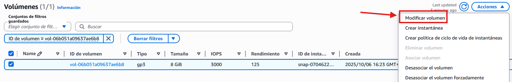{ .original .marco }
 <br>

    No saldrá el siguiente mensaje de advertencia:

      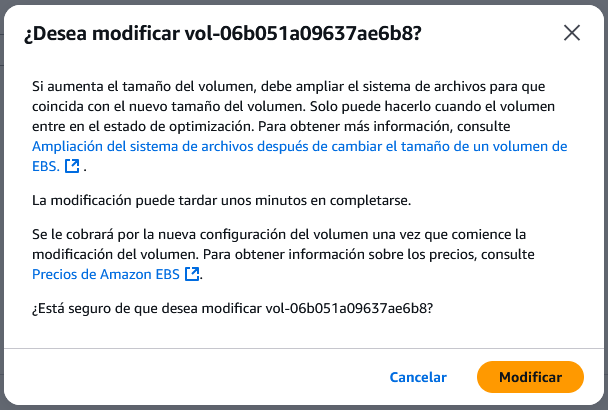{ .cincozero }
 <br>
    Confirmamos y seguimos.

<br>

1. **Ampliación de un sistema de archivos después de cambiar el tamaño de un volumen de Amazon EBS (solo EC2 amazon linux)**  
Toda la información [aquí](https://docs.aws.amazon.com/es_es/ebs/latest/userguide/recognize-expanded-volume-linux.html)  

    !!! tip "Conéctarse a la instancia con SSH y listar dispositivos (de bloque)."  
    Utilizaremos el comando **lsblk** para comparar el tamaño de la partición con el tamaño del volumen.
    
    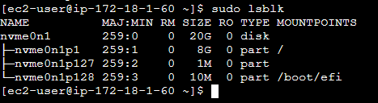{ .original }
    <br>

    !!! tip "Ampliar la partición"  
    Si no coincide el tamaño del volumen con el tamaño de la partición deberemos ampliarla con **growpart**. 
    
    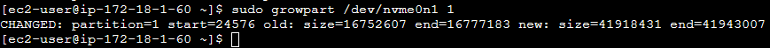{ .original }
    <br>
    
    !!! tip "Comprobar que la partición se ha ampliado"  

    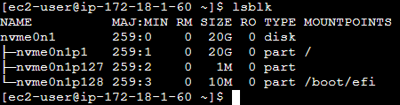{ .original }
    <br>

    !!! tip "Comprobar el tamaño del sistema de archivos"  
    Con **df -hT** podemos comprobar el tamaño y el tipo de sistema de archivos de cada dispositivo. En este caso, verificaremos si **/dev/nvme0n1p1** (la partición actual) y **/dev/nvme1n1** (el nuevo volumen EBS) tienen el mismo tamaño.
    Si el tamaño del nuevo volumen es mayor, será necesario ampliar el sistema de archivos para aprovechar todo el espacio adicional disponible en el volumen.  

    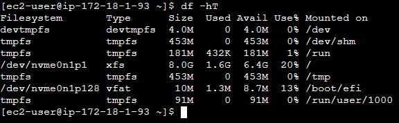{ .original }
    <br>
  
    !!! tip "Ampliar el sistema de archivos"  
    Para un sistema de archivos XFS usaremos **xfs_growfs**.    

    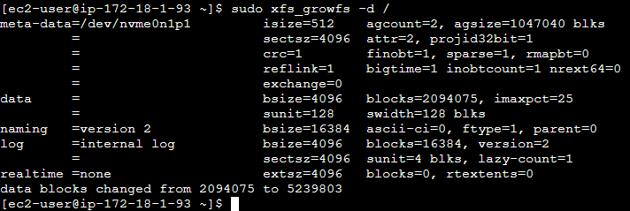{ .original }
    <br>

    Comprobamos de nuevo el tamaño de la partición:
    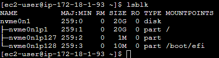{ .original }
    <br>

    Ya podemos usar esa partición.  
<br>

#### **2.4.11 - Añadir un EBS a la instancia**  
En muchos casos puede resultar necesario añadir volúmenes EBS adicionales a una instancia, ya sea para ampliar capacidad, separar datos del sistema operativo, realizar migraciones o incluso compartir información entre diferentes instancias (adjuntando y desadjuntando volúmenes).

1. **Crear un volumen EBS**

      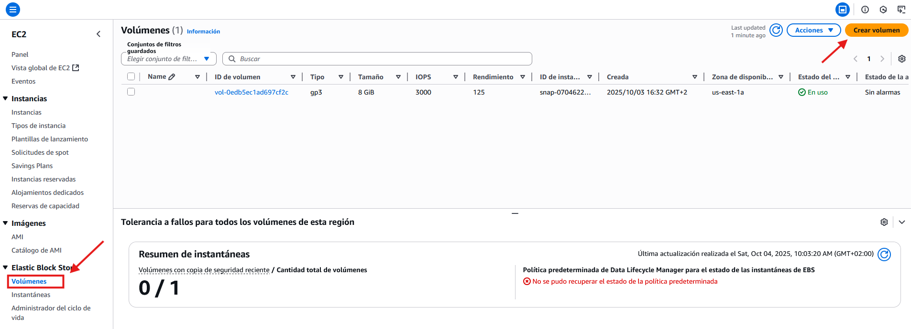{ .original .marco }
 <br>

    **Nota importante:**  
    El volumen debe crearse en la misma **zona de disponibilidad** que la EC2. 

    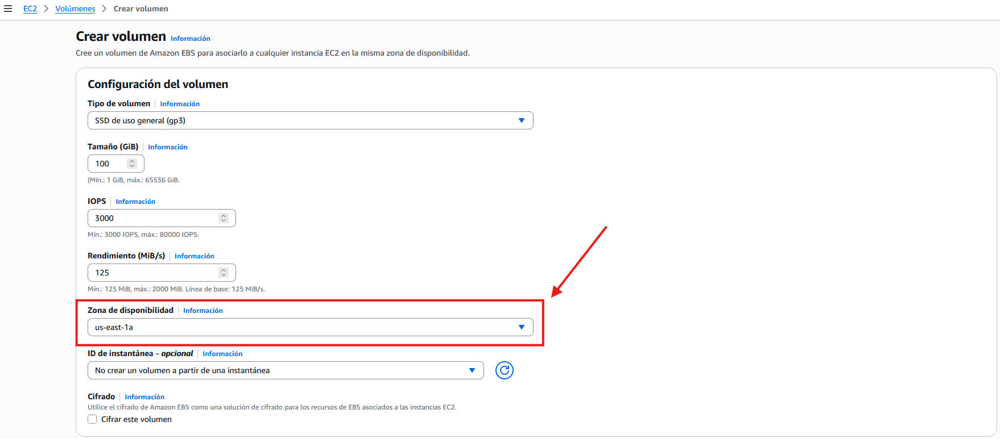{ .original .marco }
 <br>

1. **Adjuntar el volumen EBS a la instancia EC2**  
Si volvemos al menú de volúmenes EBS, veremos que el nuevo volumen aparece como disponible.

    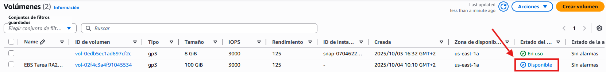{ .original .marco }
 <br>

    Seleccionamos el EBS disponible y lo asociamos.

    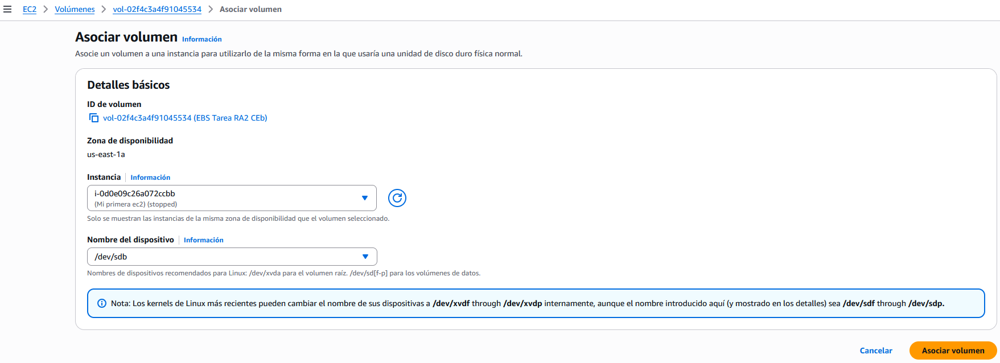{ .original .marco }
 <br>

    Si volvemos a la EC2, en el apartado **Almacenamiento** veremos los EBS asociados a la instancia.

    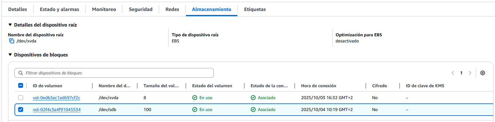{ .original .marco }
 <br>

1. **Adjuntar un volumen de Amazon EBS a una instancia de Amazon EC2**  
Toda la información [aquí](https://docs.aws.amazon.com/es_es/ebs/latest/userguide/ebs-attaching-volume.html)  

    !!! tip "Conéctarse a la instancia mediante SSH"  
    Utilizaremos el comando **lsblk** para ver los dispositivos de disco disponibles y sus puntos de montaje (si los hay).
    
    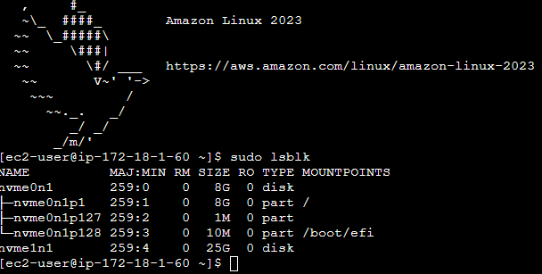{ .original }
    <br>
    
    Como podemos ver en la imagen el volumen adjunto es **/dev/nvme1n1**. No tiene particiones ni se ha montado aún.  

    !!! tip "Determinar si hay un sistema de archivos en el volumen"  
    Utilizaremos el comando **file -s** para obtener información sobre un dispositivo. Si el resultado es **data**, significa que no se encuentra ningún sistema de archivos en el dispositivo. 

    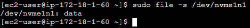{ .original }
    <br>

    !!! tip "Obtener información sobre todos los dispositivos asociados a la instancia"  
    Utilizaremos el comando **lsblk -f** para obtener información sobre todos los dispositivos asociados a la instancia. 

    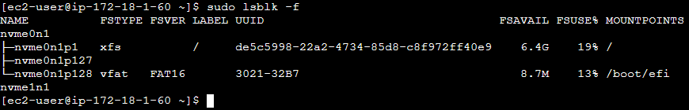{ .original }
    <br>

    La columna FSTYPE muestra el tipo de sistema de archivos. Si la columna está vacía para un dispositivo específico, significa que el dispositivo no tiene un sistema de archivos.

    !!! tip "Crear un sistema de archivos"  
    Si tenemos un volumen vacío, crearemos el sistema de archivos con **mkfs -t**.  

    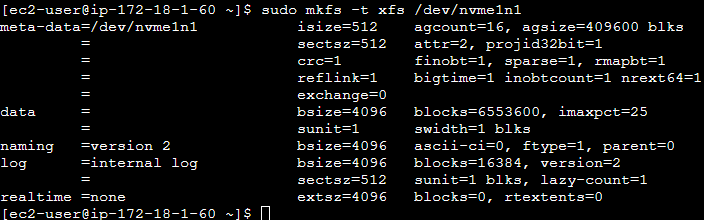{ .original }
    <br>
  
    !!! tip "Crear un directorio para el punto de montaje"  
    Utilizaremos el comando **mkdir** para crear un directorio para el punto de montaje del volumen.   

    { .original }
    <br>

    !!! tip "Montar el volumen"  
    Montaremos el volumen con **mount**.   

    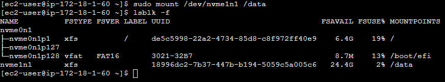{ .original }
    <br>

    !!! tip "Montar el volumen automáticamente después de un reinicio"  
    :one: Usaremos **blkid** para encontrar el **UUID** del dispositivo.   

    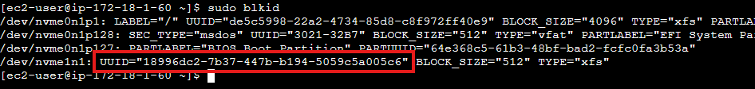{ .original }
    <br>
    :two: Editamos el archivo **/etc/fstab** (p.e. nano ) y añadimos los campos UUID, el punto de montaje, el sistema de archivos y las opciones de montaje.  


    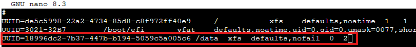{ .original }
    <br>

    :three: Verificar que la entrada funciona correctamente.  
    Para ello usaremos:
    ```bash
    sudo umount /data
    sudo mount -a
    ```
    Para desmontar y montar automáticamente el dispositivo. Si no hay errores la operación se habrá realizado correctamente.

    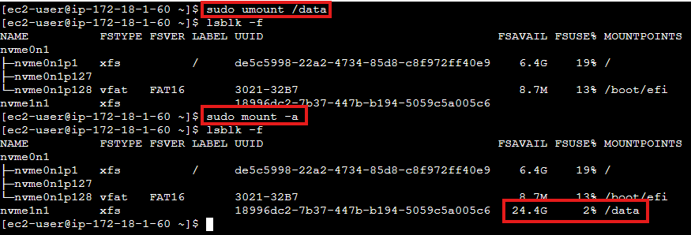{ .original }
    <br>

#### **2.4.12 - Condiciones de entrega de la tarea RA2-CEb**  

!!! warning "Condiciones de la entrega" 
    
    - Realizar capturas de pantalla del mapa de recursos de la VPC. 
    - Realizar capturas de pantalla del ping desde vuestro ordenador a la instancia. 
    - Realizar capturas de pantalla de la conexión por SSH a la instancia desde vuestro ordenador. 
    - Realizar capturas de pantalla con el tamaño del EBS de la instancia modificado. 
    - Realizar capturas de pantalla con el nuevo EBS asociado a la instancia. 
    - Comentar brevemente cada captura para entender a qué corresponde y subir el documento a la tarea correspondiente de AULES.
## **3 - Grupos de seguridad (SG) y listas de control de acceso (ACL)**


### **3.1 - Introducción**
Los **grupos de seguridad** y las **ACL de red y de VPC** son componentes fundamentales de la **seguridad** en un entorno de nube. Aunque funcionan de manera similar a los **firewalls**, no son exactamente lo mismo, ya que presentan diferencias en su uso y alcance.

Dentro del modelo de **nube pública**, el proveedor está obligado contractualmente a cumplir con su parte del modelo de **responsabilidad compartida**. Sin embargo, la configuración de los grupos de seguridad es **responsabilidad del cliente**.

Por defecto, al lanzar una instancia **EC2 en AWS**, la única regla permitida es la apertura del **puerto 22** para el **acceso SSH**.

Para garantizar el correcto despliegue de las aplicaciones, será necesario ampliar las reglas de los grupos de seguridad, asegurando siempre que estas configuraciones no comprometan la seguridad del entorno.

### **3.2 - Grupos de seguridad**
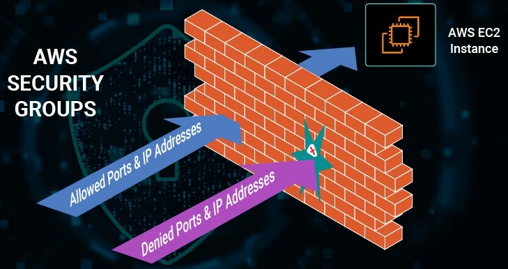{ .sietecinco }
    <br>
!!! tip "¿Qué es un grupo de seguridad?"

Un grupo de seguridad es **un conjunto de reglas de firewall virtual** que controlan el **tráfico entrante y saliente** de una **instancia**.  
- **Tráfico entrante:** Qué puede entrar a la instancia.  
- **Tráfico saliente:** Qué puede salir de la instancia.

>**Ejemplo:**   
>- **Permitir** que todo el mundo (0.0.0.0/32) visite mi sitio web en el puerto 443 (HTTPS).  
>- **Bloquear todo lo demás** (entre otros, rechazar conexiones HTTP sobre el puerto 80).

Los grupos de seguridad se aplican a **nivel de instancia**, no a **nivel de subred** (de esa función se encargan las **ACL de red**).
<br>

!!! tip "Características de un grupo de seguridad"

1. Todo lo que no está **permitido explícitamente** está **prohibido**.
1. Configuración por defecto del SG:
    - **Tráfico entrante:** Solo se aceptan conexiones SSH sobre el puerto 22 (TCP).
    - **Tráfico saliente:** Todo está permitido. Es decir, la instancia puede conectarse a cualquier IP.
1. Los grupos de seguridad son por naturaleza **con estado** (*stateful*):  
   las respuestas al tráfico permitido se **aceptan automáticamente** sin necesidad de una regla explícita en la dirección opuesta.  
   No obstante, esto **no significa que la entrada y la salida sean simétricas**, sino que **el tráfico de retorno** está permitido.
   > **Ejemplo:**  
   > - Si **permites tráfico ICMP de salida**, la instancia podrá hacer `ping` a cualquier IP pública.  
   > - Las **respuestas ICMP** (eco reply) se permitirán automáticamente.  
   > - Pero si no tienes una regla ICMP de **entrada**, **nadie podrá iniciar un ping hacia la instancia**.

1. **Las reglas de un SG no tienen orden de prioridad**.  
   Todas se evalúan **en conjunto** y solo pueden **permitir tráfico**.  
   Si no existe una regla que lo permita, el tráfico se **deniega por defecto**.
1. Una instancia **debe tener** un grupo de seguridad.   
1. Varias instancias **pueden compartir** un mismo grupo de seguridad.   
1. Los grupos de seguridad **son específicos a una zona y VPC**.


!!! tip "Configuración de las reglas de entrada y salida."

Para que una instancia funcione correctamente **y esté segura**, es imprescindible definir **las reglas de entrada (inbound) y de salida (outbound) del grupo de seguridad (SG)**:  

- **Reglas de entrada:**  
Controlan qué tráfico puede entrar a la instancia desde Internet u otras redes.  
Por defecto las EC2 solo aceptan conexiones SSH. 

    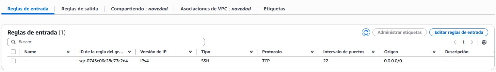{.original .marco}
<br>

    >**Ejemplo:**  
        &nbsp;&nbsp;&nbsp;&nbsp;**Permitir** el puerto 80 (HTTP) o 443 (HTTPS) para que una web sea accesible públicamente.  
        &nbsp;&nbsp;&nbsp;&nbsp;**Restringir** todo lo que no sea necesario: Todo lo que no está **permitido explicitamente** está  prohibido.  

<br>

- **Reglas de salida:**  
Controlan qué tráfico puede salir desde la instancia **hacia otras redes o Internet**.  
**Por defecto**, AWS permite todo el **tráfico de salida**.

    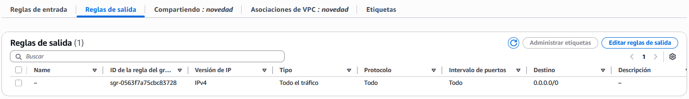{.original .marco}
<br>

- **El destino** y el **origen** del tráfico puede ser un **CIDR** o **otro grupo de seguridad** (lo veremos más adelante).  
    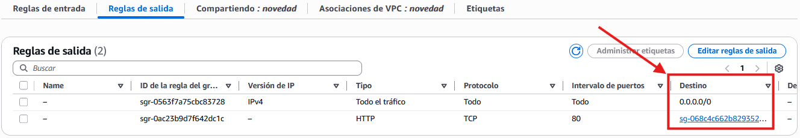{.original .marco}
<br>

- **Resumen:**

    | Tipo de regla         | Qué tráfico puede iniciar una conexión        | Ejemplo                           |
    | --------------------- | ---------------------------------------------------- | --------------------------------- |
    | **Entrada (Inbound)** | Qué tráfico puede **iniciar** conexión **hacia** la instancia.  | Permitir SSH (22) desde determinadas IP's.     |
    | **Salida (Outbound)** | **Hacia** qué destinos puede **iniciar** conexión la instancia. | Permitir HTTP (80) hacia Internet. |


### **3.3 - Ejemplo de SG**  
En el siguiente ejemplo tenemos una VPC, una subred con **una instancia EC2**, una puerta de enlace de Internet y **un grupo de seguridad**.  
Como hemos dicho **el grupo de seguridad se asigna a la instancia** y actúa como un firewall virtual.  
El único tráfico que llega a la instancia es el permitido por las reglas del grupo de seguridad. 

- **Infraestructura**
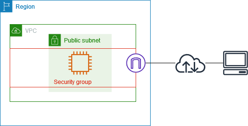{.original}  
<br>

- **Configuración de las reglas de entrada de la instancia** 

    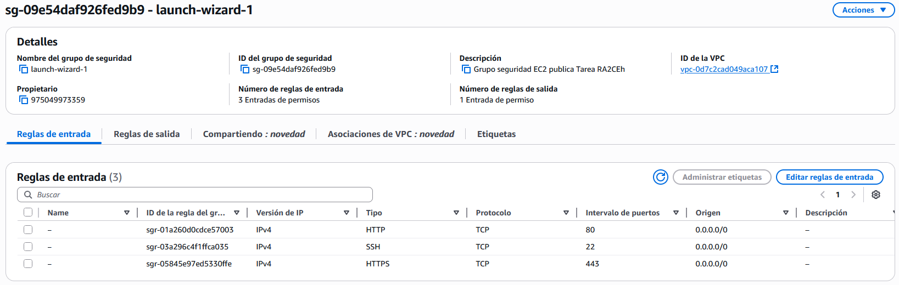{.original .marco}  

### **3.4 - Tarea RA2-CEc (parte 1)**  
1. Retomar el escenario de la tarea RA2-CEb. 
1. Ampliar el escenario con una segunda instancia que se encontrará en una subred privada.
El escenario quedará de la siguiente manera:
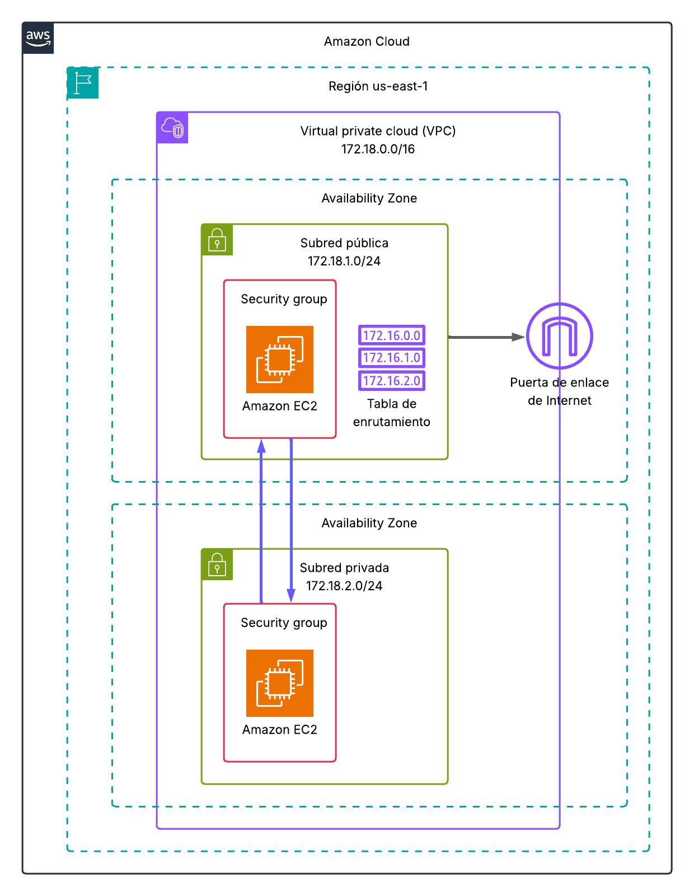{.sietecinco}  

1. Poblar las RT para que las instancias de las subredes solo se puedan comunicar **la una con la otra y no con toda la VPC**.  
1. Poblar los grupos de seguridad de la siguiente manera:  

     |Instancia	|Subred	|Grupo de Seguridad	|Reglas de Entrada|	Reglas de Salida|
     |-|-|-|-|-|
     |Web|	Pública	|SG-Web|	80, 443 desde Internet;  22 desde IP admin	|Todo permitido (o restringir a lo necesario)|
     |DB	|Privada|	SG-DB|	3306 desde SG-Web	|Todo permitido (o restringir a lo necesario)|

### **3.5 - ACL de red**
{ .doscinco }
    <br>

!!! tip "¿Qué es una lista de control de acceso ACL?"
Las **Network ACL (NACL)** son un componente de seguridad que actúa a nivel de **subred** dentro de una **VPC**.

<br>
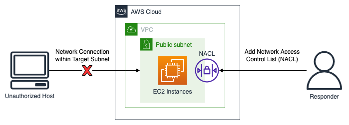{.sietecinco}  

!!! tip "Características de las NACL"
1. **Se aplican a nivel de subred**: Todas las instancias dentro de esa subred quedan sujetas a las reglas de la ACL.  
1. Cada **VPC** en AWS tiene **una ACL por defecto**, y se pueden crear ACLs personalizadas para afinar el control del tráfico.
1. **Son sin estado** (stateless): No recuerdan el estado de la conexión. Por ejemplo, si se permite el tráfico entrante en un puerto, **también se debe** permitir explícitamente el tráfico de salida de respuesta.
1. **Soportan reglas de entrada y salida**:    
      * Reglas de entrada → Controlan tráfico **entrante a la subred**.
      * Reglas de salida → Controlan tráfico **saliente desde la subred**.
1. **Orden numérico de las reglas**
      * Cada regla tiene un número (del 1 al 32766).
      * Se evalúan en **orden ascendente** → la primera regla que coincida se aplica, y se ignoran las siguientes.
1. **Acciones posibles**
      * `ALLOW`: Permitir tráfico.
      * `DENY`: Bloquear tráfico.
1. **ACL por defecto**  

    !!! warning "¡Por defecto, todo está abierto en las NACL!"
        * La **NACL por defecto** de una VPC permite todo el tráfico entrante y saliente.
        * Las **ACL personalizadas** niegan todo el tráfico hasta que se configuren reglas.
        

**Ejemplo de ACL**  
En el siguiente ejemplo, tenemos una VPC con dos subredes.  
Cada **subred tiene una ACL de red**. Cuando el tráfico entra en la VPC, el enrutador envía el tráfico a su destino.    
La ACL de red A determina qué tráfico destinado a la subred 1 puede entrar en la subred 1, y qué tráfico destinado a una ubicación fuera de la subred 1 puede salir de la subred 1.  
Del mismo modo, la ACL de red B determina qué tráfico puede entrar y salir de la subred 2.
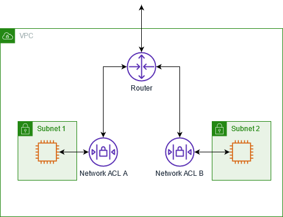{.original}  

Si vamos a AWS y consultamos las ACL de cada red veremos que, como hemos dicho anteriormente, **todo el tráfico entrante y saliente está permitido por defecto**.

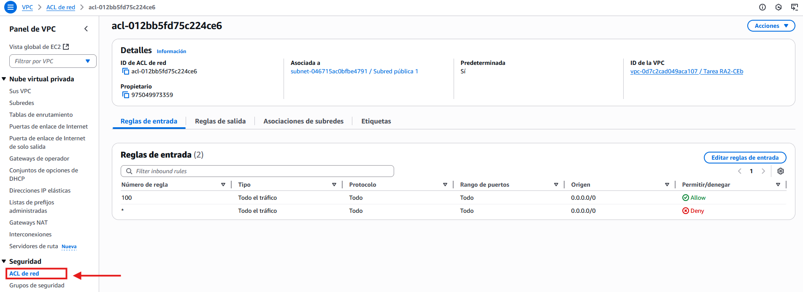{.original}  


<br>

### **3.7 - Tabla comparativa entre SG y ACL**
| Característica                 | **Security Groups (SG)**                                                                                 | **Network ACLs (NACL)**                                                                               |
| ------------------------------ | -------------------------------------------------------------------------------------------------------- | ----------------------------------------------------------------------------------------------------- |
| **Naturaleza**                 | *Stateful* (tienen “efecto memoria”)                                                                     | *Stateless* (no recuerdan conexiones)                                                                 |
| **Nivel de aplicación**        | Asociados a **instancias EC2** (interfaz de red)                                                         | Asociados a **subredes**                                                                              |
| **Reglas de entrada y salida** | Reglas de entrada y salida se procesan **por separado**, pero las respuestas se permiten automáticamente | Se deben definir reglas para entrada **y** salida; si no, el tráfico será bloqueado                   |
| **Orden de evaluación**        | No tienen orden; se procesan todas las reglas                                                            | Se procesan en orden ascendente por número de regla (más bajo = mayor prioridad)                      |
| **Acciones**                   | Solo permiten **Allow** (permitir tráfico)                                                               | Admiten **Allow** y **Deny** (puedes denegar explícitamente)                                          |
| **Predeterminado**             | Todo el tráfico está **denegado por defecto** (excepto lo que se permita explícitamente)                 | Todo el tráfico está **permitido por defecto** (excepto lo que se niegue explícitamente)              |
| **Casos de uso típicos**       | Control fino del tráfico a instancias (ej. abrir 22/SSH o 443/HTTPS)                                     | Control global a nivel de subred, aplicar restricciones más amplias (ej. denegar rangos IP completos) |

### **3.8 - Tarea RA2-CEc (parte 2)**
1. Ampliar el escenario para que quede de la siguiente manera:
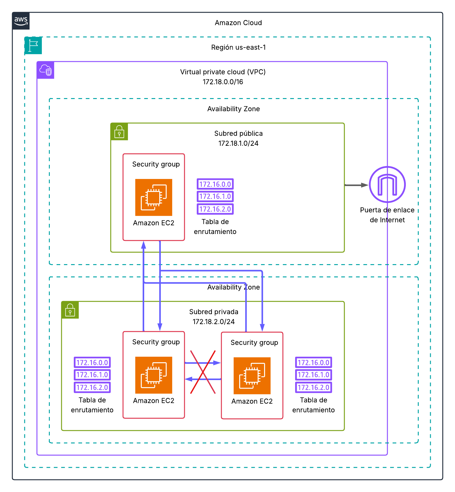{.sietecinco}
1. Reflexionar sobre como impedir que las instancias de la subred privada no puedan establecer conexiones la una con la otra.
1. Realizar las modificaciones necesarias a los SG y ACL para impedir dicho tráfico.
1. Realizar capturas de pantallas de los SG ACL y mapa de recursos de la VPC y subirlas a la tarea **RA2-CEc** de AULES.

### **3.9 - Tarea RA2-CEc (parte 3)**
**Formas de conectarse a las instancias (públicas y privadas).**  

1. **Conexión a la EC2 pública.**  
    - **Conexión a la EC2 pública mediante interfaz de AWS**
    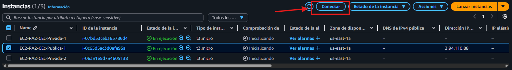{.original} <br> 
    Luego:  
    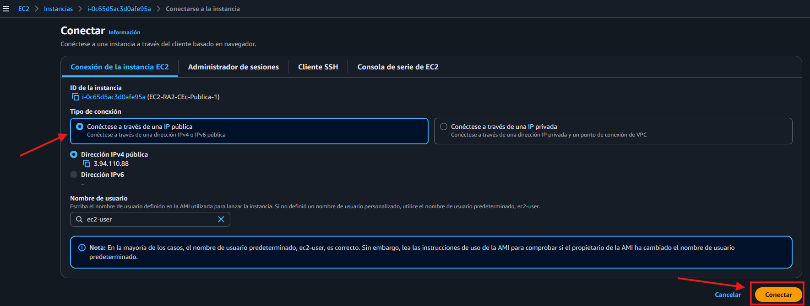{.original}  <br>
    Desde esa conexión podremos hacer ping a las EC2 de la subred privada.
    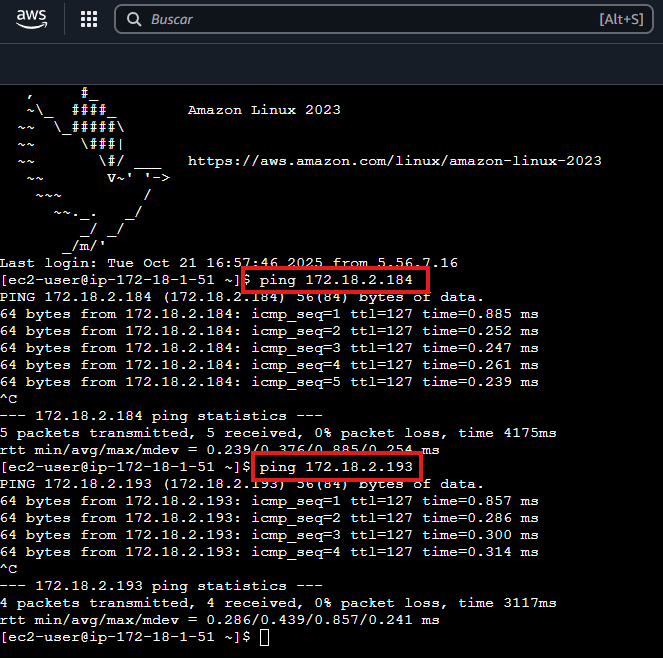{.cincozero}  <br>
  
    - **Conexión a la EC2 pública mediante SSH**
    Como ya hemos visto, en linux usaremos el comando:  
    ```bash 
    ssh -i <CLAVE_PRIVADA> <NOMBRE_DE_USUARIO>@<IP_DE_LA_INSTANCIA>
    ```
    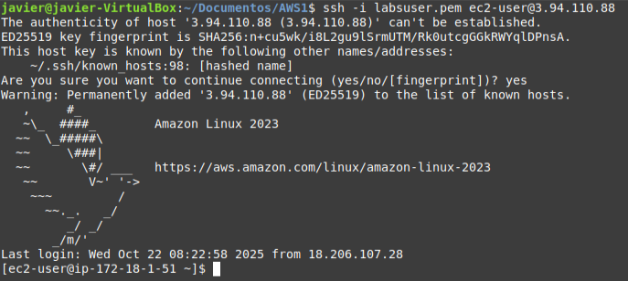{.cincozero}  <br>

    - **Conexión a la EC2 pública mediante AWS CLI y EC2 Instance Connect **  
    Para ello usaremos el comando de aws:  
    ```bash 
    aws ec2-instance-connect ssh --instance-id <ID_DE_LA_INSTANCIA> --os-user <NOMBRE_DE_USUARIO>
    ```
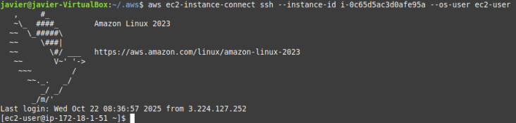{.sietecinco}  <br>


1. **Conexión a las EC2 privadas.**  
    - **Mediante interfaz de AWS**
    El procedimiento es identico al anterior pero, al no disponer de **IP pública** haremos la conexión a través de un punto de conexión.<br>  
    **Nota importante:**
    Para crear el punto de conexión, se recomienda usar el mismo grupo de seguridad que el de la instancia a la que queremos acceder.   
    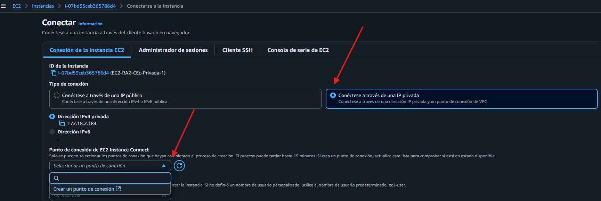{.sietecinco}  <br>
    Luego
    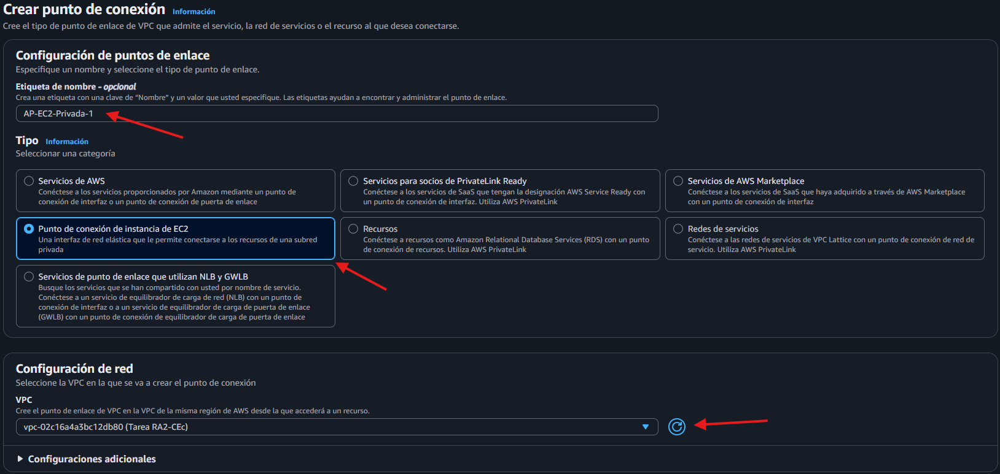{.sietecinco}
    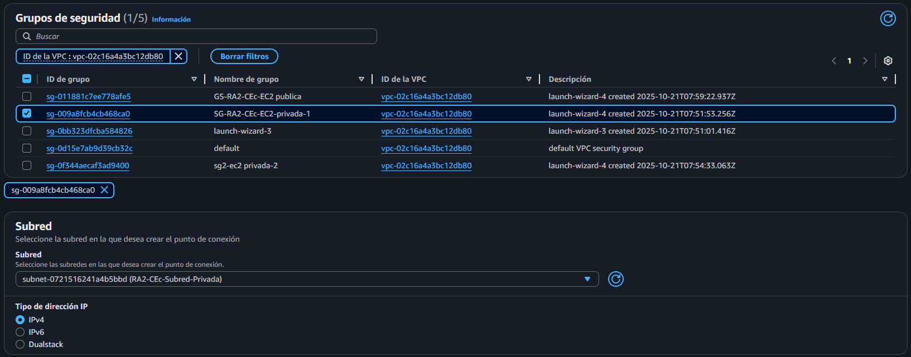{.sietecinco}  <br>
    Esperamos a que esté disponible... Puede tardar varios minutos.
    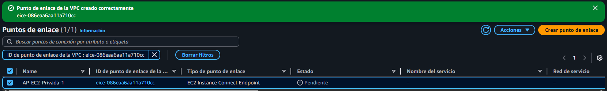{.sietecinco}  <br>
    Una vez disponible, lo seleccionamos y seguimos con la conexión.
    {.sietecinco}  <br>
    Intentaremos conectarnos pero no podremos hacerlo.
    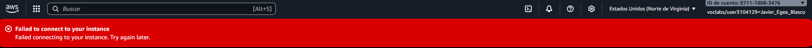{.sietecinco}  <br>

    
    - **Conexión mediante AWS CLI y EC2 Instance Connect EndPoint**  
    Para ello usaremos el comando de aws:  
    ```bash
    aws ec2-instance-connect ssh --instance-id i-1234567890example --connection-type eice
    ```
    Que nos devolverá el siguiente error:
    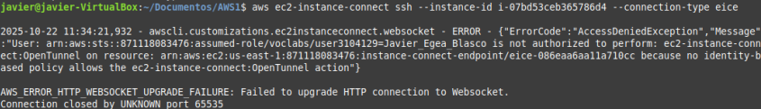{.sietecinco}  <br>
    Ese error se debe a las limitaciones de los permisos del usuario **labrole** dentro del recurso IAM (Identity and Access Management).
    Si vamos a **IAM → Panel**, veremos que nuestra cuenta tiene 24 roles asignados...
    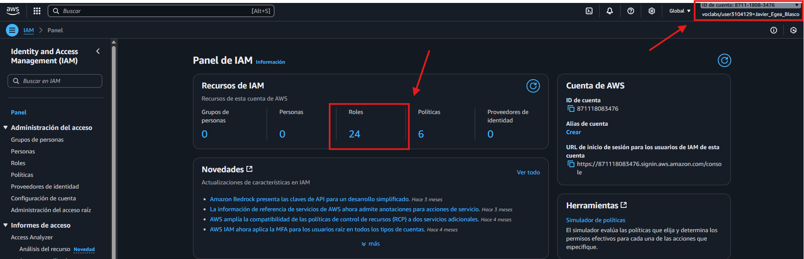{.sietecinco}  <br>
    ...Dentro de los cuales encontraremos el LabRole.
    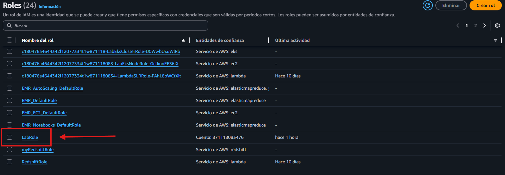{.sietecinco}  <br>
    Dentro de LabRole encontraremos la política de permisos de ese rol. De disponer de las credenciales necesarias, podriamos agregar más roles a nuestro usuario (y apmpliar o reducir la política de permisos). Con el rol asignado por el **learner lab** no es posible hacerlo.
    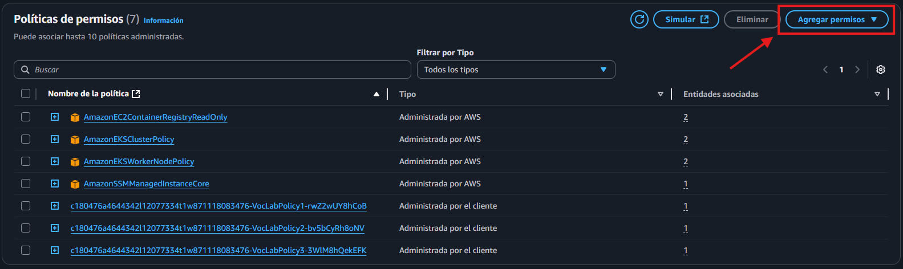{.sietecinco}  <br>

    - **Conexión mediante instancia bastión**  
    En este caso, utilizaremos la instancia pública a la que tenemos acceso como una instancia bastión. Es decir, primero nos conectaremos a ella y, desde allí, estableceremos una conexión SSH hacia las instancias ubicadas en la subred privada.
    Para poder conectarnos por SSH a la EC2 de la subred privada, necesitaremos trasladar el archivo de la clave privada a la EC2 pública.  
    Mover nuestra clave privada no se considera una buena práctica desde el punto de vista de la seguridad informática, pero nos permitirá familiarizarnos con nuevas funcionalidades de AWS.

        - **Opción 1: Mover archivo con scp**  
        En este caso usaremos el comando `scp` (Secure CoPy) para enviar el archivo *.pem desde la máquina local a la instancia EC2 pública.<br>  
        En linux usaremos el comando:  
        ```bash
        scp -i <ARCHIVO_PEM> <ARCHIVO_A_TRANSFERIR> <NOMBRE_DE_USUARIO>@<IP_DE_LA_INSTANCIA>:<RUTA_ARCHIVO_DESTINO>
        ```  
        Donde -i especifica la clave privada.<br>
        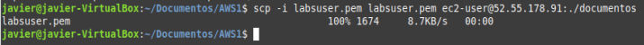{.original}<br>  
        A partir de entonces, ya tendremos disponible dentro de nuestra EC2 pública la clave privada para conectarnos a las EC2 privadas.
        
        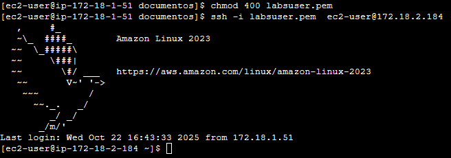{.original}  <br>

        - **Opción 2: Mover archivo.pem con Cloud9**  
        Cloud9 es un entorno de desarrollo integrado (IDE) basado en la nube que permite escribir, ejecutar y depurar código directamente desde el navegador web, sin necesidad de instalar nada en el equipo local.  
        Está completamente integrado con los servicios de AWS (como EC2, Lambda, S3 o CloudFormation) y propone una terminal Linux completa dentro del entorno, como si estuvieramos conectado por SSH a una instancia EC2.

            !!! warning "Nota importante:"
                Cloud9 no es un servicio para mover archivos. Es un IDE para compartir, ejecutar y depurar código sin necesidad de tener ningún programa instalado en nuestro ordenador local.  
                Lo usaremos como excusa para descubrir sus funcionalidades y por la facilidad que incorpora a la hora de subir y descargar archivos.

            **Creamos el entorno.**
            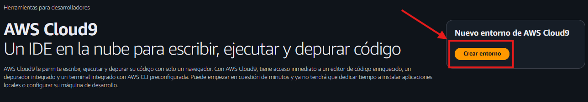{.original}  <br>
            Rellenamos los campos necesarios.
            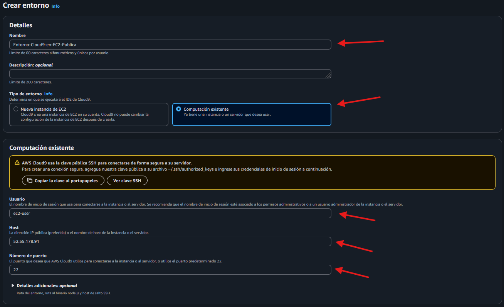{.original}  <br>
            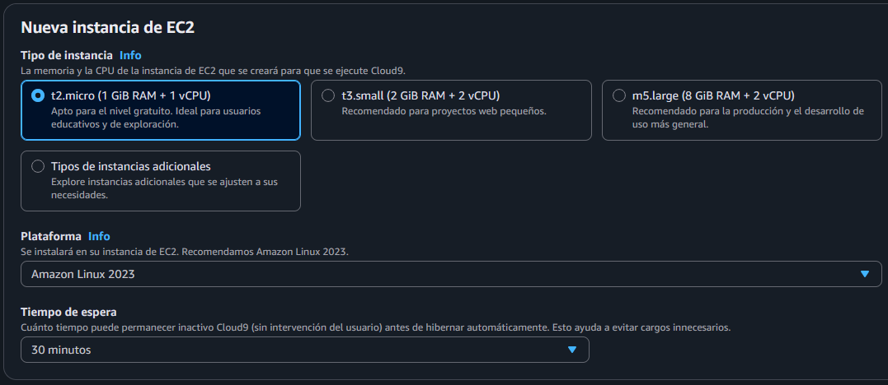{.original}  <br>
            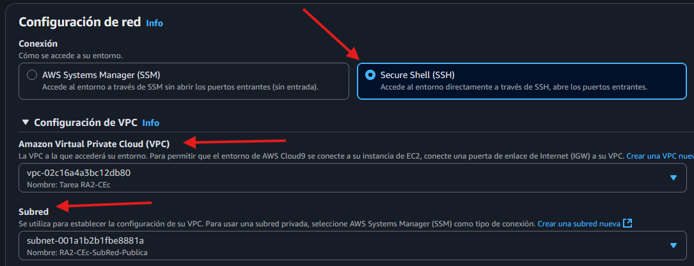{.original}  <br>
            Esperamos a que el servicio esté disponible y luego ya lo podremos usar.
            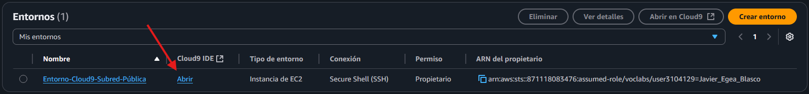{.original}  <br>
            Ejemplo de ejecución de un programa de python.
            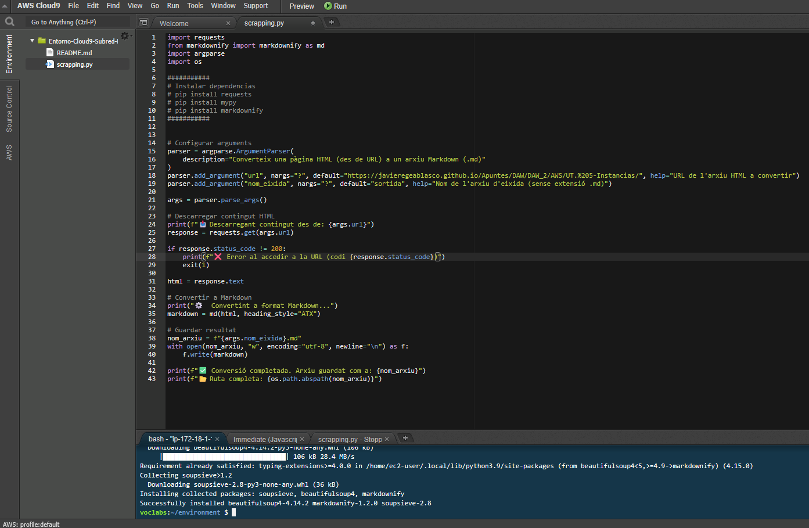{.original}  <br>
            Intentamos conectarnos por ssh a cualquier otra instancia pero tampoco funciona.
            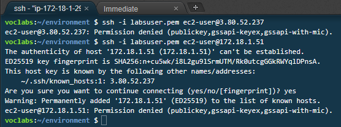{.original}  <br>


### **3.10 - Condiciones de entrega de la tarea RA2-CEc**
Mediante conexiones a las diferentes instancias, comprobar (mediantes ping) que las configuraciones de los grupos de seguridad y de las listas de control de acceso a las subredes (NACL) cumplen (o no) con los objetivos propuestos (instancias de la subred privada aisladas).  

!!! warning "Condiciones de la entrega" 
    1. Realizar capturas de pantallas de los pings entre instancias de la subred privada.  
    1. Realizar capturas de pantallas de los pings entre instancias de la subred privada y la instancia de la subred pública.
    1. Comentar brevemente cada captura para entender a qué corresponde.
    1. ¿Qué conclusión podemos sacar?  
    1. Subir el documento a la tarea correspondiente de AULES.

## **4 - NAT gateway**
- NAT gateway es un servicio de traducción de direcciones de red (NAT) que permite a las instancias de una subred privada tener acceso a Internet o a otros servicios de AWS, **sin exponer** sus IP privadas.
- Este servicio resulta particularmente útil por necesidad de los servicios de las EC2 de la subred privada (p.e. actualización de software) a la vez que impide que servicios externos inicien una conexión con esas instancias.

### **4.1 - Características de un NAT Gateway de AWS**
1. Solo existe un tipo de NAT Gateway, pero puede actuar como:  

    - NAT Gateway público: cuando está en una subred pública y tiene asociada una Elastic IP (EIP).
    - NAT Gateway privado: cuando está en una subred privada y se usa para enrutar tráfico hacia otra VPC o VPN, sin acceso a Internet.  

1. Debe crearse en una zona de disponibilidad específica (AZ).
1. Soporta los protocolos: TCP, UDP y ICMP.
1. No se le puede asociar un grupo de seguridad (Security Group); en su lugar, se controlan los accesos mediante las Listas de Control de Acceso (ACLs) de red.


### **4.2 - Tipos de despliegue** 
- **NAT Gateway público**  
!!! info "" 
    Se ubica en una subred pública.  
    Se le asigna una Elastic IP.
    Permite que las instancias en una subred privada puedan acceder a Internet. 
    No permite que el tráfico desde Internet inicie conexiones hacia las instancias privadas.

- **NAT Gateway privado**
!!! info ""
    Se ubica en una subred privada pero se usa en conjunto con un Transit Gateway o una VPN/Direct Connect.
    No tiene Elastic IP.
    Sirve para enrutamiento privado: Las instancias en una subred privada pueden comunicarse con otras redes (VPCs, etc.) y ocultan sus direcciones privadas detrás de una IP en el lado del NAT.

- **Resumen comparativo:**
!!! info ""
    | **Característica**        | **NAT Gateway Público**                                                        | **NAT Gateway Privado**                                 |
    | ------------------------- | ------------------------------------------------------------------------------ | ------------------------------------------------------- |
    | **Ubicación**             | Subred pública                                                                 | Subred privada                                          |
    | **Elastic IP**            | Requiere una Elastic IP                            | No necesita Elastic IP           |
    | **Acceso a Internet**     | Permite que las instancias privadas accedan a Internet                         | No tiene acceso directo a Internet                      |
    | **Rutas (Route Table)**   | Las subredes privadas deben tener una ruta hacia el NAT Gateway                | Se usa para enrutar tráfico hacia otra VPC o VPN        |
    | **Uso típico**            | Salida a Internet desde instancias privadas (actualizaciones, descargas, etc.) | Comunicación privada entre redes sin exposición pública |
    | **Seguridad**             | No admite SG's, solo ACL de red                | No admite SG, solo ACL de red           |
    | **Alta disponibilidad**   | Se debe desplegar **uno por zona de disponibilidad (AZ)**     | Uno por AZ si se requiere redundancia            |
    | **Protocolos soportados** | TCP, UDP, ICMP                                            | TCP, UDP, ICMP                  |

### **4.3 - Tarea RA2-CEd**
Para realizar la tarea retomaremos el escenario de la **Tarea RA2-CEc**, y pondremos un NAT gateway público para que las instancias de la subred privada puedan acceder a internet.

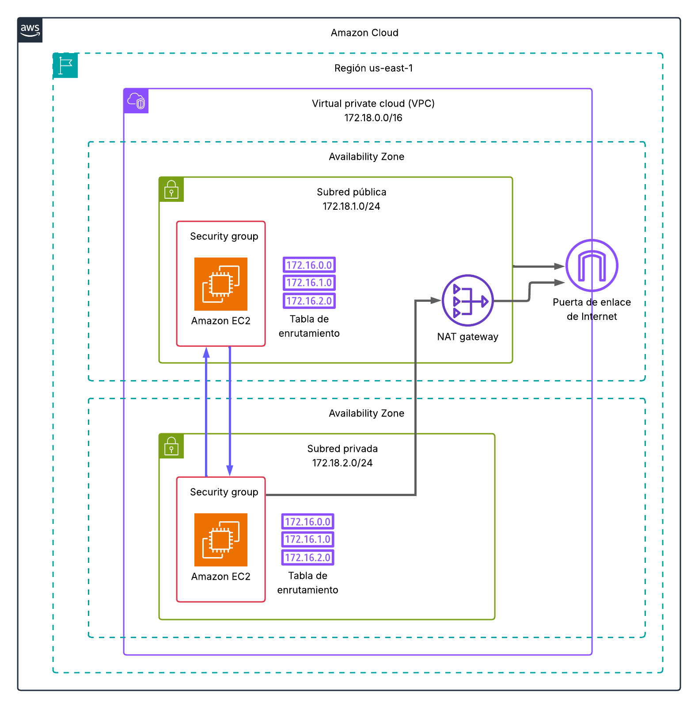{.sietecinco}  

Este esquema tiene un error de concepto aunque siempre se representa de esa manera ¿Cuál?

### **4.3.1 - Crear el NAT Gateway**
Vamos al menú de NAT Gateway y creamos nuestro NAT Gateway.  
Si no tenemos ninguna IP elástica, dejaremos que AWS le asigne una. 

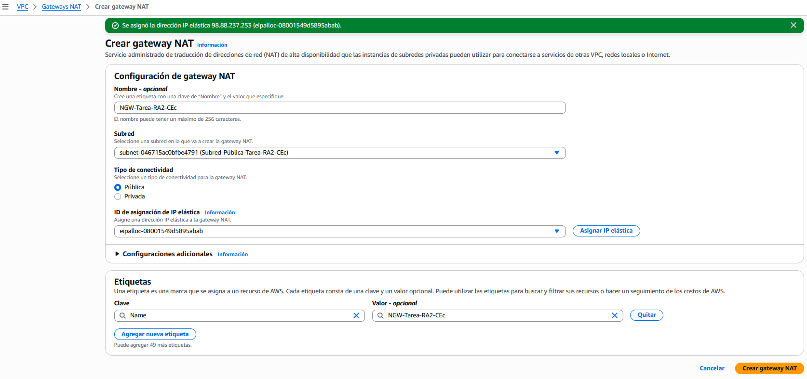{.original .marco}  

### **4.3.2 - Modificar la tabla de enrutamiento**
Enlazamos todo el tráfico hacia internet de la tabla de enrutamiento de la subred privada hacia el NAT Gateway

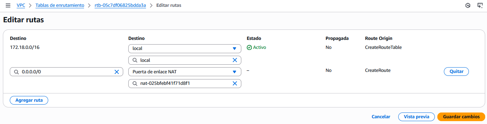{.original .marco}  

### **4.3.3 - Conexión a la EC2 de la subred privada**
Al carecer, la EC2 de la subred privada de IP pública, para poder conectarnos a ella, primero deberemos conectarnos a la EC2 de la subred pública, y luego, desde ella, conectarnos a la EC2 de la subred privada. 

!!! info "Preparación de las variables de entorno"
Antes de conectar por SSH a una instancia, es recomendable preparar el entorno de autenticación cargando la clave privada en el agente SSH.

1. Ejecutar ssh-agent en segundo plano
```bash
eval $(ssh-agent)
```

1. Cargar en memoria la clave privada de la instancia
```bash
ssh-add labsuser.pem
```

1. Comprobar las claves añadidas al agente ssh
```bash
ssh-add -l 
```

!!! tip "¿Por qué usar ssh-agent?"
    El agente SSH permite mantener las claves privadas cargadas en memoria durante la sesión.  
    **Ventajas:**  
    - Evita tener que escribir la ruta o la contraseña de la clave en cada conexión.  
    - Mejora la seguridad, ya que la clave no se guarda en texto plano ni se reenvía en cada conexión.  
    - Facilita la autenticación si se conectan varias veces a la misma instancia o a distintos servidores dentro del mismo entorno.

<br>
!!! info "Conexión a la instancia EC2 mediante SSH"
Una vez configurado el agente SSH y cargada la clave privada, nos conectaremos a la instancia EC2 de la subred pública.

```bash
ssh -A ec2-user@dirección-ip-pública
```
**Nota:**  
Con la **opción -A**, las claves se mantienen en memoria.  
Ya no es necesario utilizar la **opción -i** para especificar la clave privada que se usará.

<br>
!!! info "Conexión a la instancia EC2 de la subred privada"
Una vez conectados a la instancia pública, desde ella nos conectaremos a la instancia de la subred privada.  
```bash
ssh ec2-user@direccion-ip-privada
```
<br>

### **4.3.4 - Condiciones de entrega de la tarea RA2-CEd**
!!! task "Tarea RA2-CEd: Pruebas de ping"
    **Comprobar:**  
    Realizar una prueba de ping de las 2 instancias hacia internet (p.e google.es).  
    Realizar capturas (3 capturas en total).


<br>

## **5 - Reglas encadenadas en grupos de seguridad**
Como hemos visto, AWS ofrece diferentes herramientas para proteger una infraestructura en la nube, como los grupos de seguridad (**Security Groups**) y las listas de control de acceso a red (**NACL**).  
Una funcionalidad especialmente interesante es la posibilidad de encadenar grupos de seguridad (**Security Groups Chaining**), lo que permite aplicar un modelo de seguridad por capas dentro de una VPC.

**Comprendiendo el encadenamiento de grupos de seguridad**  

- Encadenar grupos de seguridad significa referenciar un grupo de seguridad dentro de otro.  
- De esta forma, se pueden crear reglas que **solo permiten el tráfico procedente de instancias asociadas a un grupo de seguridad concreto**, añadiendo una capa adicional de control y segmentación del tráfico.

<br>
!!! tip "Ejemplo:"
    **Tenemos:**

    1. Un grupo de seguridad para los servidores web, que permite conexiones HTTP y HTTPS.
    1. Otro grupo de seguridad para los servidores de base de datos, que **solo acepta tráfico desde el grupo de seguridad del servidor web**.

De esa manera, conseguimos un entorno más seguro, en el que cada capa (web, base de datos, etc.) solo puede comunicarse con las capas que realmente necesita.

Esta técnica facilita una gestión más ordenada y modular de la seguridad, ya que podemos reutilizar y combinar grupos de seguridad según las necesidades de cada componente de la infraestructura.

### **Tarea RA3-CEab**
Para entender mejor la posiblidad de las reglas encadenas, usaremos el siguiente escenario:

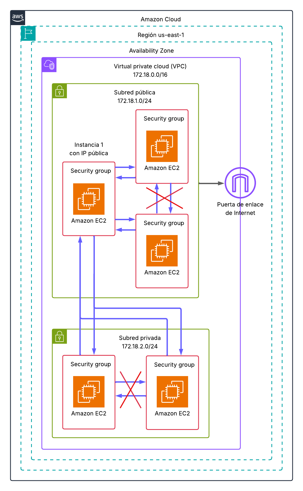{.cincozero .marco}  

**Condiciones especificas de la infraestructura:**

1. Lanzar 3 instancias en la subred pública. La **instancia 1 tendrá IP pública**, las otras 2 no. 
1. Los grupos de seguridad de las instancias (2 y 3) de la subred pública serán encadenados **directamente** al grupo de seguridad de la instancia 1.
1. Lanzar 2 instancias en la subred privada y encadenar los grupos de seguridad de esas instancias al grupo de seguridad de la instancia 1.

**Comprobaciones a realizar:**  

1. Realizar una conexión SSH a la **instancia 1**.
1. Desde la instancia 1 realizar pings al resto de instancias (4 pings en total). 
1. Propagarse a una de las 2 instancias de la subred pública y realizar pings a las otras instancias (4 pings en total). Si no hay errores solo se podrá hacer ping a la instancia 1. Al resto de instancias (2 en la subred pública y 2 en la subred privada, no se les podrá hacer ping.)
1. Desde la instancia dónde nos encontramos, intentar propagarse a otra instancia (da igual que sea de la subred pública o privada). 
1. Desde la instancia 1, propagarse a una de las instancias de la subred privada y realizar pings a las otras instancias (4 pings en total). 

**Ejemplos de pings entre instancias:**

!!! tip "Instancia 1 al resto de instancias"
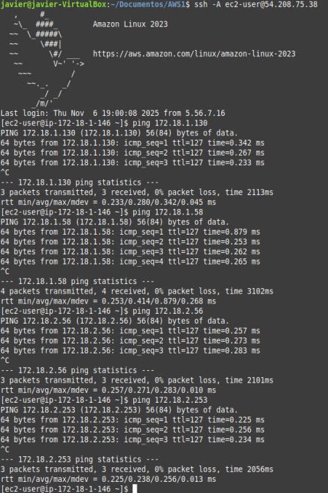{.cincozero}  

!!! tip "Instancia subred pública al resto de instancias"
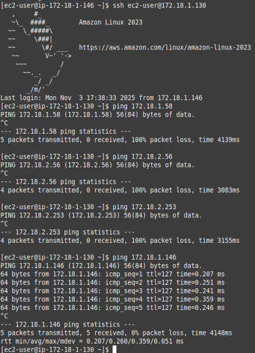{.cincozero}  

!!! tip "Instancia subred privada al resto de instancias"
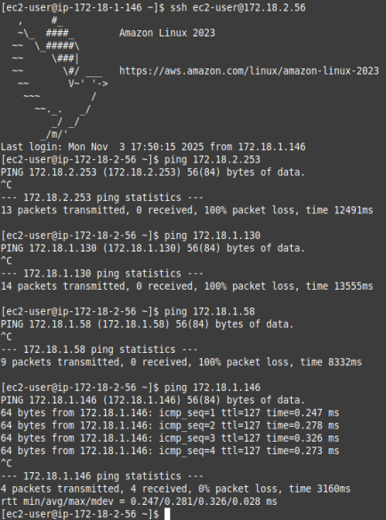{.cincozero}  

<br>
!!! warning "Condiciones de la entrega:"  
    - Realizar capturas de pantalla de los pings entre instancias. 
    - Comentar brevemente cada captura para entender a qué corresponde
    - Subir el documento a la tarea correspondiente de AULES.

## **6 - Caso práctico**
### Tarea RA3-CEc: Montar un servidor web y una base de datos mysql 
**Escenario propuesto:**
{.sietecinco}  
!!! task "Tarea RA3-CEc (continuación): Montar un servidor web y un agente mysql"
    **1. Instancia pública**  
    Instalar un servidor web Apache, que será accesible desde cualquier equipo externo a la VPC por el puerto 80, utilizando tanto su nombre DNS como su dirección IP pública.

    **2. Instancia privada**  
    Instala un servicio de MySQL. 

    **3. Conexión a la BBDD**  
    Conectarse a la instancia de la subred pública y realizar una prueba de conexión **al servidor de base de datos**. Para esa conexión, se utilizará un cliente mysql.

    **4. Realizar capturas**  
    De la conexión a la base de datos.  
    El servidor web desplegado.  


<!-- instalar firewall sobre una EC2 Amazon linux 
-Instalar el firewall
sudo dnf install firewalld -y
-Habilitar y levantar
sudo systemctl enable firewalld
sudo systemctl start firewalld
-Comprobar su estado:
sudo firewall-cmd --state
-Configurar las instancias
sudo firewall-cmd --permanent --add-rich-rule='rule family="ipv4" source address="172.18.2.184" reject' && sudo firewall-cmd --reload
sudo firewall-cmd --permanent --add-rich-rule='rule family="ipv4" source address="172.18.2.193" reject' && sudo firewall-cmd --reload -->


## **Enlaces de interés**
Documentación de [AWS](https://docs.aws.amazon.com)  
Instancias [EC2](https://docs.aws.amazon.com/es_es/ec2/?icmpid=docs_homepage_featuredsvcs)  
Tipos de instancias [EC2](https://aws.amazon.com/es/ec2/instance-types)  
Controlar el tráfico hacia los recursos de AWS mediante [grupos de seguridad](https://docs.aws.amazon.com/es_es/vpc/latest/userguide/vpc-security-groups.html#security-group-basics)  
[Grupos de seguridad de instancias EC2](https://docs.aws.amazon.com/es_es/AWSEC2/latest/UserGuide/ec2-security-groups.html)  
Control del tráfico de la subred con [listas de control de acceso a la red](https://docs.aws.amazon.com/es_es/vpc/latest/userguide/vpc-network-acls.html)  
Tipos y caracteristicas de las [EBS](https://docs.aws.amazon.com/es_es/ebs/latest/userguide/ebs-volume-types.html)  
[Gateways NAT](https://docs.aws.amazon.com/es_es/vpc/latest/userguide/vpc-nat-gateway.html)  
[Ampliar volúmenes EBS](https://docs.aws.amazon.com/es_es/ebs/latest/userguide/recognize-expanded-volume-linux.html)  
[Adjuntar volúmenes EBS](https://docs.aws.amazon.com/es_es/ebs/latest/userguide/ebs-attaching-volume.html)  
[Rquisitos para CE2 Instance Connect](https://docs.aws.amazon.com/es_es/AWSEC2/latest/UserGuide/ec2-instance-connect-prerequisites.html)  
[EC2 Instance Connect](https://docs.aws.amazon.com/AWSEC2/latest/UserGuide/ec2-instance-connect-methods.html#connect-linux-inst-eic-cli-ssh)  

