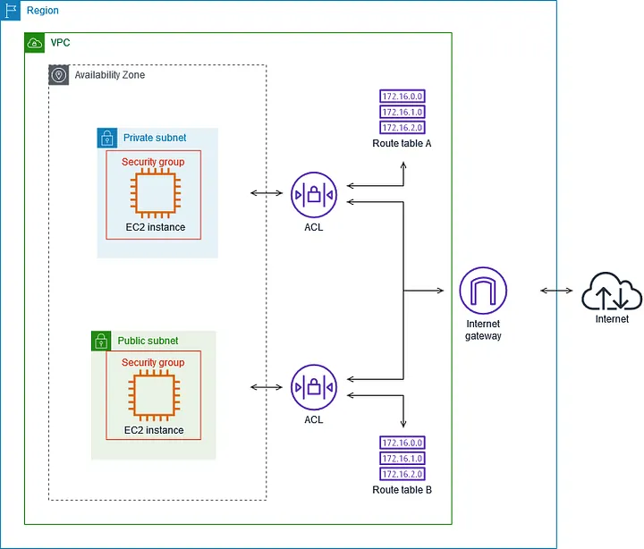

# **UT. 5 - Instancias y seguridad en AWS**

{ .sietecinco }

<br>

**Resultados de aprendizaje y criterios de evaluacion que se evaluarán en esta unidad.**  

| **Resultados de aprendizaje de la unidad didáctica:** |
|-|
| **RA. 2:** Identifica los componentes clave de la infraestructura global de la nube, diferenciando servicios principales, regiones, zonas de disponibilidad y aplicando medidas básicas de seguridad como el modelo de responsabilidad compartida, gestión de accesos y protección de datos.|  


|**Criterios de evaluación de la unidad didáctica:**|
||
|**b)** Se ha demostrado la capacidad para explorar y describir las principales categorías de servicios disponibles.|
|**c)** Se ha realizado una evaluación del uso adecuado de servicios básicos en ejercicios prácticos.|
|**d)** Se ha comprendido el modelo de responsabilidad compartida en la nube.|
|**e)** Se ha aplicado medidas de seguridad básicas mediante herramientas de gestión de acceso.|
|**f)** Se han realizado ejercicios sobre gestión de usuarios y políticas de seguridad.|

<br>


## **1 - Introducción**
Uno de los servicios más utilizados de AWS es **Amazon EC2 (Elastic Compute Cloud)**, que permite lanzar y administrar **instancias**, es decir, **máquinas virtuales** que funcionan de manera similar a un ordenador físico.  

Estas **instancias** pueden configurarse con distintos sistemas operativos, hardware para adaptarse a las necesidades de cada proyecto (aplicación web, base de datos...).

Al igual que cualquier dispositivo, las instancias necesitan un mecanismo de control de tráfico para **garantizar su seguridad**. En este contexto aparecen los **grupos de seguridad** (Security Groups, SG). Un grupo de seguridad no es más que un **firewall virtual**, que supervisa y restrinje el tráfico entrante y saliente de las instancias.

En conjunto, las EC2 y los SG constituyen la base de la infraestructura en la nube: las instancias proporcionan la capacidad de cómputo, mientras que los grupos de seguridad ofrecen la primera línea de defensa para proteger los recursos desplegados.

## **2 - Instancias EC2**
### **2.1 - Instancias de AWS**
Como hemos dicho, una instancia EC2 (**E**lastic **C**loud **C**ompute) es básicamente una computadora en la nube.  
**Al igual que los equipos físicos**, las instancias se caracterizan por una serie de características como potencia de computo, RAM y otras características que veremos a continuación.

**Nomenclatura de las instancias EC2**  
El nombre de la instancia define las especificaciones de la misma es decir, la familia, la generación, la capacidad adicional y el tamaño.

{.doscinco}

- **Familia**  
La familia define la optimización principal de la máquina, dicho en otras palabras, el uso preferente que debemos dar a esas máquinas.  

      |Familia|Aplicación|
      |:-:|-|
      |C|  Compute Optimized. Para cargas de trabajo que requieren mucha CPU (alta      relación CPU/memoria).  |
      |M | General Purpose. Equilibrio entre CPU, memoria y almacenamiento. Usadas para       la mayoría de aplicaciones estándar.  |
      |R| Memory Optimized. Diseñadas para cargas de trabajo que requieren gran     cantidad de memoria en relación con la CPU.  |
      |I| Storage Optimized (I/O Optimized). Pensadas para cargas que requieren     altísimo rendimiento en disco local (NVMe/SSD).   |
      |G | **Graphics / GPU-based**. Para machine learning (basadas en GPU NVIDIA).  |
      |P|  **Accelerated Computing (GPU)**. Para entrenamiento de deep learning,     computación científica, simulaciones de alto nivel.  |
      |X|  Extra Memory Optimized. Instancias con terabytes de RAM, usadas para grandes       bases de datos o aplicaciones que requieren mucha memoria.  |


- **Generación**  
Representan la evolución tecnológica de las instancias. Cada nueva generación trae mejor rendimiento, menor coste por hora y mejor eficiencia energética.  
La generación de una instancia EC2 se identifica por el número que acompaña a la familia.<br>  
**Ejemplos:**  

      |Instancias|Descripción|
      |-|-|
      |t**2**.micro | 2ª generación de instancias de uso general.  |
      |t**3**.micro | 3ª generación, más eficiente que t2.  |
      |t**4**g.micro | 4ª generación, basada en procesadores ARM Graviton2 de AWS. |

  

- **Capacidad adicional**  
La capacidad adicional de EC2 se refiere a esas optimizaciones extra (almacenamiento, red, EBS, GPU, bare metal, etc.) que hacen que dos instancias de la misma familia y tamaño puedan comportarse de forma distinta.  
Las letras utilizadas en el nombre de instancia y las propiedades asociadas se explican en la tabla siguiente.  

       |Nombre |Propiedad|Ejemplo|
       |-|-|-|
       |a|Procesador AMD|m5a|
       |d|Almacenamiento SSD NVMe local|m5d|
       |e|Capacidad extra|P6e|
       |g|Procesador Graviton(ARM)|m6g|
       |n|Redes de alta velocidad|c5n|
       |z|Alta frecuencia de CPU|m5zn|
       |.metal|Bare metal|m8g.metal|
             
- **Tamaño de la instancia**  
El **tamaño de una instancia de EC2 en AWS** se refiere a la combinación de recursos de hardware virtualizados (vCPU, memoria RAM, almacenamiento y capacidad de red) que se asignan a una máquina virtual. En otras palabras, define la **potencia y capacidad de cómputo** que tendrá la instancia dentro de la familia de instancias elegida.  
<br>
 

      **Tabla comparativa de tamaños de instancias:**  

      | Instancia   | vCPU | RAM (GB) | Almacenamiento (GB) | Red (Gbit/s) | Ancho de banda de EBS | Precio USD/h (% aumento) |
      |-------------|------|----------|----------------------|--------------|------------------------|--------------------------|
      | r5d.xlarge  | 4    | 32       | 1 x 150             | Hasta 10     | Hasta 4750             | 0.288                    |
      | r5d.2xlarge | 8    | 64       | 1 x 300             | Hasta 10     | Hasta 4750             | 0.576 (+100%)            |
      | r5d.4xlarge | 16   | 128      | 2 x 300             | Hasta 10     | 4750                   | 1.152 (+100%)            |
      | r5d.8xlarge | 32   | 256      | 2 x 600             | 10           | 6800                   | 2.304 (+100%)            |
<br>

### **2.2 - AMI (Amazon Machine Image)**
Una AMI es una plantilla que contiene la información necesaria para lanzar una instancia de EC2. Es como si fuera la `imagen base` de una máquina virtual.

Cada AMI incluye:

* **Un sistema operativo** (Amazon Linux, Ubuntu, Windows Server, etc.).
* **Software preinstalado** (Apache, Nginx, MySQL, Docker, etc.).
* **Configuración de permisos** (qué usuarios pueden usar la AMI, no es posible hacerlo con las cuentas de ALB).
* **Configuración de volumen raíz** (el disco donde se instala el sistema).
* ...

Cuando se lanza una **instancia EC2**, se elige una AMI como punto de partida, y a partir de ahí la instancia puede configurarse, modificarse y **personalizarse**.

#### **2.2.1 - Tipos de AMI**

1. **AMIs públicas**

     * Disponibles en el catálogo de AWS.
     * Incluyen imágenes oficiales de Amazon (Amazon Linux, Windows, etc.) y distribuciones de Linux mantenidas por la comunidad o proveedores (Ubuntu, Debian, RHEL…).

2. **AMIs privadas**

     * Creadas por **un usuario**.
     * Solo accesibles para la cuenta propietaria (posibilidad de compartir).

3. **AMIs del AWS Marketplace**

     * Imágenes de terceros (generalmente de pago) con aplicaciones ya listas (WordPress, SAP, soluciones de seguridad, etc.).

#### **2.2.2 - Regiones y AMIs**

* Una AMI está **ligada a una región**.
* Si se necesita usarla en otra región, se debe **copiar**.

#### **2.2.3 - Crear una AMI**

Se pueden crear AMI's desde:

1. **Una instancia EC2 existente** → Tomar un snapshot y convertir en AMI.
2. **Un snapshot de EBS** → Luego convertir en AMI.
3. **Importar una VM** (desde VMware, VirtualBox o Hyper-V con la herramienta VM Import/Export).

### **2.3 - EBS (Elastic Block Store)**
**EBS (Elastic Block Store)** es el servicio de **almacenamiento en bloque** que se usa para las instancias EC2. Dicho en otras palabras, es el **disco duro** de las instancias y se puede usar para instalar el sistema operativo, guardar bases de datos, etc.

#### **2.3.1 - Concepto básico**
!!! info "Características principales"
    * **Persistente**: los datos persisten aunque la instancia EC2 se detenga o se termine (si el volumen no se borra automáticamente al terminar la instancia).
    * **Redimensionable**: Se puede cambiar el tamaño, tipo o rendimiento sin reiniciar la instancia (en muchos casos).
    * **Alta disponibilidad**: cada volumen EBS se replica automáticamente dentro de la zona de disponibilidad (AZ) para protegerlo de fallos de hardware.
    * **Snapshots**: Se pueden programar copias de seguridad incrementales en S3 (Snapshots EBS).
    * **Tipos de volumen**: AWS ofrece varios tipos (SSD y HDD) adaptados a rendimiento y coste:  
    &nbsp;&nbsp;&nbsp;&nbsp; **gp3/gp2**: SSD de uso general.  
    &nbsp;&nbsp;&nbsp;&nbsp; **io1/io2**: SSD de alto rendimiento para IOPS elevados.  
    &nbsp;&nbsp;&nbsp;&nbsp; **st1**: HDD optimizado para throughput.  
    &nbsp;&nbsp;&nbsp;&nbsp; **sc1**: HDD de bajo coste para datos menos usados.

---
#### **2.3.2 - Uso con EC2**
* Al lanzar una instancia EC2, se crea automáticamente un volumen EBS para el sistema operativo.
* Se puede **adjuntar** varios volúmenes EBS a una misma instancia EC2.
* **Se deben montar** como dispositivos de bloque en el sistema operativo y luego se formatean y usan como cualquier disco.
* Es posible **desadjuntar** un volumen de una instancia y **adjuntarlo** a otra (útil para migrar datos).
---

#### **2.3.3 - Otros tipos de almacenamientos de AWS**

* **Instance store**: almacenamiento efímero local (desaparece al detener/terminar la instancia).
* **S3**: almacenamiento de objetos, no en bloques.
* **EFS**: almacenamiento de archivos (compartido NFS).
---
### **2.4 - Tarea RA2-CEb**
Realizar el siguiente escenario.
De momento, no tener en cuenta los grupos de seguridad.  

{ .sietecinco }

!!! question "Preguntas a responder:"
    1. Suponiendo que queremos usar la EC2 de la subred pública como servidor web (frontend), ¿Qué debemos hacer para ampliar la infraestructura e incorporar un servidor para el backend?
    2. Queremos, además, guardar imágenes, PDFs y vídeos para que los clientes puedan descargarlos.  
    ¿Qué tipo de almacenamiento de AWS sería el más adecuado?  
    Buscar un ejemplo de tipo de almacenamiento adecuado en AWS. 
---

#### **2.4.1 - Infraestructura de red básica**
{ .original .marco }
<br>

#### **2.4.2 - Lanzar instancia 1/3**
!!! tip "Vamos a EC2"
Una vez dentro del menú de instancias veremos los apartados principales de EC2

- **Instances (Instancias):**  
Donde se puede lanzar, detener, reiniciar o terminar instancias EC2.

- **Images (Imágenes):**
Donde se puede gestionar las AMIs, que son plantillas para lanzar nuevas instancias con un sistema operativo y software preinstalado.

- **Elastic Block Store (EBS):**
Servicio de almacenamiento en bloques persistente. Permite crear y asociar volúmenes a las instancias EC2.  
**Nota:** EBS no es específico de EC2 pero, tiene su propio menú aquí.

- **Network & Security (Red y seguridad):**
Desde aquí se gestion los Security Groups, Elastic IPs, Key Pairs y VPCs asociadas a las instancias.
Básicamente, es donde se definen las reglas de seguridad y de conectividad.

- **Load Balancing (Balanceo de carga):**
Sección para crear y administrar Elastic Load Balancers (ELB), que reparten el tráfico entre varias instancias.

- **Auto Scaling:**
Aquí se configuran los **Auto Scaling Groups**, que crean o destruyen instancias automáticamente según las métricas (CPU, tráfico, etc.) para mantener el rendimiento.

!!! tip "Lanzamos una instancia."
{ .original .marco }
<br>

#### **2.4.3 - Lanzar instancia 2/3**
1. Damos un nombre a la instancia.
1. Seleccionamos el tipo de instancia, la AMI adecuada a nuestras necesidades.

    { .original .marco }
    <br>

#### **2.4.4 - Lanzar instancia 3/3**
1. Elegimos el par de claves con el que podremos conectarnos por SSH a nuestra instancia.
1. Configuración de seguridad
    { .original .marco }

<br>    

#### **2.4.5 - Panel de control de las instancias**
- **Instancias**
    { .original .marco }
<br>

- **Resumen de las instancias**  
**Nota:** Asegurarse de que tenemos un IPv4 pública. De lo contrario no será posible conectarse remotamente con la instancia.
    { .original .marco }
<br>

#### **2.4.6 - Conexión remota con la instancia**
El laboratorio crea por defecto una clave llamada **vockey**. Esa llave que ya hemos usado a la hora de configurar nustra instancia EC2 permitirá a un cliente SSH conectarse a ella de forma remota.

1. **Descargar el archivo de clave privada labsuser.pem**  
El fichero labsuser.pem se encuentra disponible en **AWS Academy Learner Lab** en `AWS Details`.
El fichero labsuser.pem contiene la parte privada de la clave que necesitará el cliente SSH para conectarse a la EC2 en la cual se encuentra instalada la parte pública de la clave.

{ .cincozero .marco }
<br>

1. **Cambiar los permisos del archivo labsuser.pem**  
Para cambiar los permisos a solo lectura por el propietario usaremos:
```bash
chmod 400 labsuser.pem
```
<br>

1. **Conexión remota por SSH a la instancia**  
Para conectarnos a la instancia por SSH usaremos el cliente de ssh con los siguientes argumentos:
```bash
ssh -i labsuser.pem ec2-user@3.90.114.96   
```

    !!! info "Explicación del comando"
        🔹**ssh:** Cliente de Secure Shell, que permite conectarte de forma remota y segura a otro equipo.  
        🔹**-i labsuser.pem:** La opción -i especifica la clave privada (**labsuser.pem**) que se usará para autenticarse.  
        🔹**ec2-user@3.90.114.96:** Indica usuario y dirección de la instancia a la que nos queremos conectar.   

    !!! info "¿Cómo saber nuestro nombre de usuario?"
         

    !!! info "¿Cómo saber la ip de la instancia?"
         
<br>

#### **2.4.7 - Conexión con la instancia desde la consola de AWS**  
También es posible conectarse a la instancia desde el panel de control de AWS.

{ .original .marco }

<br>

Una vez hecha la conexión podremos usar ese servicio virtualizado.

{ .original .marco }

<br>

#### **2.4.8 - Realizar Ping a la instancia**  
Si queremos realizar un ping a la instancia desde cualquier ordenador veremos que no es posible.

{ .cincozero }
<br>

Para poder realizar el ping deberemos agregar reglas **al grupo de seguridad de la instancia**. En este caso añadiremos una regla de protocolo de mensajes de control de Internet **ICMP**.  

{ .original .marco }
<br>

Después de agregar la regla ICMP sí que será posible realizar un ping a nuestra instancia.   

{ .cincozero }

## **3 - Grupos de seguridad y listas de control de acceso (ACL)**
### **3.1 - Introducción**
Los **grupos de seguridad** y las **ACL de red y de VPC** son componentes fundamentales de la **seguridad** en un entorno de nube. Aunque funcionan de manera similar a los **firewalls**, no son exactamente lo mismo, ya que presentan diferencias en su uso y alcance.

Dentro del modelo de **nube pública**, el proveedor está obligado contractualmente a cumplir con su parte del modelo de **responsabilidad compartida**. Sin embargo, la configuración de los grupos de seguridad es **responsabilidad del cliente**.

Por defecto, al lanzar una instancia **EC2 en AWS**, la única regla permitida es la apertura del **puerto 22** para el **acceso SSH**.

Para garantizar el correcto despliegue de las aplicaciones, será necesario ampliar las reglas de los grupos de seguridad, asegurando siempre que estas configuraciones no comprometan la seguridad del entorno.

### **3.2 - Grupos de seguridad**
En AWS, un grupo de seguridad es **un conjunto de reglas de firewall virtual** que controlan el **tráfico entrante y saliente** de una **instancia**.

Los grupos de seguridad se aplican a **nivel de instancia**, no a **nivel de subred** (esa función la cumplen las **ACL de red**).

Los grupos de seguridad son **con estado** (stateful): la entrada es igual a la salida. El tráfico que cumple **una regla en una dirección también se permitirá automáticamente en la dirección opuesta** sin tener una regla explícita para ello.

**Las reglas no tienen un orden de prioridad**. Las reglas de un grupo de seguridad no tienen prioridad ni orden. Todas se evalúan en conjunto y únicamente permiten tráfico. Si no existe una regla que lo permita, el tráfico se deniega por defecto.

!!! warning "Configuración de las reglas de entrada y salida."
    Para que una instancia funcione correctamente **y esté segura**, es imprescindible definir las reglas de entrada (inbound) y de salida (outbound) del grupo de seguridad:  

    - **Reglas de entrada:**  
    Controlan qué tráfico puede entrar a la instancia desde Internet u otras redes.  
    <u>Ejemplo:</u>  
    &nbsp;&nbsp;&nbsp;&nbsp;**Permitir** el puerto 80 (HTTP) o 443 (HTTPS) para que una web sea accesible públicamente.  
    &nbsp;&nbsp;&nbsp;&nbsp;**Restringir** todo lo que no sea necesario: Todo lo que no está **permitido explicitamente** está prohibido.  

    - **Reglas de salida:**  
    Controlan qué tráfico puede salir desde la instancia **hacia otras redes o Internet**.  
    **Por defecto**, AWS permite todo el **tráfico de salida**.


### **3.3 - Ejemplo de SG**  
En el siguiente ejemplo tenemos una VPC, una subred con **una instancia EC2**, una puerta de enlace de Internet y **un grupo de seguridad**.  
Como hemos dicho **el grupo de seguridad se asigna a la instancia** y actúa como un firewall virtual.  
El único tráfico que llega a la instancia es el permitido por las reglas del grupo de seguridad. 

- **Infraestructura**
{.original}  
<br>

- **Configuración de las reglas de entrada de la instancia** 

    {.original .marco}  

### **3.4 - Tarea RA2-CEc**  
1. Retomar el escenario de la tarea RA2-CEb. 
1. Ampliar el escenario con una segunda instancia que se encontrará en una subred privada.
El escenario quedará de la siguiente manera:
{.sietecinco}  

1. Poblar las RT para que las instancias de las subredes solo se puedan comunicar **la una con la otra y no con toda la VPC**.  
1. Poblar los grupos de seguridad de la siguiente manera:  

     |Instancia	|Subred	|Grupo de Seguridad	|Reglas de Entrada|	Reglas de Salida|
     |-|-|-|-|-|
     |Web|	Pública	|SG-Web|	80, 443 desde Internet;  22 desde IP admin	|Todo permitido (o restringir a lo necesario)|
     |DB	|Privada|	SG-DB|	3306 desde SG-Web	|Todo permitido (o restringir a lo necesario)|

### **3.5 - ACL de red**
Las **Network ACL (NACL)** son un componente de seguridad que actúa a nivel de **subred** dentro de una **VPC**.

<br>
{.sietecinco}  

1. **Se aplican a nivel de subred**: Todas las instancias dentro de esa subred quedan sujetas a las reglas de la ACL.  
1. Cada **VPC** en AWS tiene **una ACL por defecto**, y se pueden crear ACLs personalizadas para afinar el control del tráfico.
1. **Son sin estado** (stateless): No recuerdan el estado de la conexión. Por ejemplo, si se permite el tráfico entrante en un puerto, **también se debe** permitir explícitamente el tráfico de salida de respuesta.
1. **Soportan reglas de entrada y salida**:    
      * Reglas de entrada → Controlan tráfico **entrante a la subred**.
      * Reglas de salida → Controlan tráfico **saliente desde la subred**.
1. **Orden numérico de las reglas**
      * Cada regla tiene un número (del 1 al 32766).
      * Se evalúan en **orden ascendente** → la primera regla que coincida se aplica, y se ignoran las siguientes.
1. **Acciones posibles**
      * `ALLOW`: Permitir tráfico.
      * `DENY`: Bloquear tráfico.
1. **ACL por defecto**  
!!! warning "¡Todo está abierto en las ACL por defecto!"
       * La **ACL por defecto** de una VPC permite todo el tráfico entrante y saliente.
       * Las **ACL personalizadas** niegan todo el tráfico hasta que se configuren reglas.

**Ejemplo de ACL**  
En el siguiente ejemplo, tenemos una VPC con dos subredes. Cada **subred tiene una ACL de red**. Cuando el tráfico entra en la VPC, el enrutador envía el tráfico a su destino.    
La ACL de red A determina qué tráfico destinado a la subred 1 puede entrar en la subred 1, y qué tráfico destinado a una ubicación fuera de la subred 1 puede salir de la subred 1.  
Del mismo modo, la ACL de red B determina qué tráfico puede entrar y salir de la subred 2.
{.original}  

Si vamos a AWS y consultamos las ACL de cada red veremos que, como hemos dicho anteriormente, **todo el tráfico entrante y saliente está permitido por defecto**.

{.original}  


<br>

### **3.7 - Tabla comparativa entre SG y ACL**
| Característica                 | **Security Groups (SG)**                                                                                 | **Network ACLs (NACL)**                                                                               |
| ------------------------------ | -------------------------------------------------------------------------------------------------------- | ----------------------------------------------------------------------------------------------------- |
| **Naturaleza**                 | *Stateful* (tienen “efecto memoria”)                                                                     | *Stateless* (no recuerdan conexiones)                                                                 |
| **Nivel de aplicación**        | Asociados a **instancias EC2** (interfaz de red)                                                         | Asociados a **subredes**                                                                              |
| **Reglas de entrada y salida** | Reglas de entrada y salida se procesan **por separado**, pero las respuestas se permiten automáticamente | Se deben definir reglas para entrada **y** salida; si no, el tráfico será bloqueado                   |
| **Orden de evaluación**        | No tienen orden; se procesan todas las reglas                                                            | Se procesan en orden ascendente por número de regla (más bajo = mayor prioridad)                      |
| **Acciones**                   | Solo permiten **Allow** (permitir tráfico)                                                               | Admiten **Allow** y **Deny** (puedes denegar explícitamente)                                          |
| **Predeterminado**             | Todo el tráfico está **denegado por defecto** (excepto lo que se permita explícitamente)                 | Todo el tráfico está **permitido por defecto** (excepto lo que se niegue explícitamente)              |
| **Casos de uso típicos**       | Control fino del tráfico a instancias (ej. abrir 22/SSH o 443/HTTPS)                                     | Control global a nivel de subred, aplicar restricciones más amplias (ej. denegar rangos IP completos) |

## **4 - NAT gateway sobre subredes privadas**
<!-- https://www.youtube.com/watch?v=JhC5XJ3b9t0 -->

## **5 - IP elástica**
<!-- https://www.youtube.com/watch?v=ZRwsQNMlM2g -->
### **3.8 - Tarea RA2-CEd**
Escenario de una VPC con NACL, SG y 


<!-- (https://www.corestack.io/aws-security-best-practices/aws-nacl/) -->
Entender el concepto de responsabilidad compartida en el desarrollo de una infraestructura en AWS.
<!-- https://jayendrapatil.com/aws-vpc-security-group-vs-nacls/ -->
<!-- https://docs.aws.amazon.com/es_es/vpc/latest/userguide/nacl-examples.html -->

<!-- https://www.raulprietofernandez.net/blog/packet-tracer/configuracion-de-acls-con-packet-tracer -->
<!-- Acceder por ssh a la instancia y comprobar su dirección ip privada.  -->
 
<!-- https://medium.com/@mrdevsecops/network-acls-security-group-68f2dd901ee6 -->

<!-- ## amplicacio
hablar de los nat para permitir a las ec2 de las subredes privadas poder acceder a inet sin tener ipv4 pública. -->

<!-- modelo responsabilidad compartida https://www.corestack.io/aws-security-best-practices/aws-security-group-best-practices/ -->

<!-- SR publica -->
<!-- 📥 Reglas de entrada (Inbound Rules) -->
<!-- | Nº  | Regla                    | Protocolo | Puerto(s)  | Origen                          | Descripción                                                                |
| --- | ------------------------ | --------- | ---------- | ------------------------------- | -------------------------------------------------------------------------- |
| 100 | Permitir HTTP            | TCP       | 80         | 0.0.0.0/0                       | Acceso web desde cualquier lugar                                           |
| 110 | Permitir HTTPS           | TCP       | 443        | 0.0.0.0/0                       | Acceso web seguro desde cualquier lugar                                    |
| 120 | Permitir SSH             | TCP       | 22         | X.X.X.X/32                      | Acceso de administración desde IP del profesor (ej. IP pública del centro) |
| 130 | Permitir tráfico interno | TCP/UDP   | 1024–65535 | Subred interna (CIDR de la VPC) | Respuestas de conexiones internas                                          |
| 140 | Denegar todo lo demás    | ALL       | ALL        | 0.0.0.0/0                       | Política de seguridad implícita                                            | -->

<!-- 📤 Reglas de salida (Outbound Rules) -->
<!-- | Nº  | Regla                 | Protocolo | Puerto(s)  | Destino   | Descripción                                             |
| --- | --------------------- | --------- | ---------- | --------- | ------------------------------------------------------- |
| 100 | Permitir HTTP         | TCP       | 80         | 0.0.0.0/0 | Salida para actualizaciones y llamadas API              |
| 110 | Permitir HTTPS        | TCP       | 443        | 0.0.0.0/0 | Salida segura para actualizaciones y servicios externos |
| 120 | Permitir DNS          | UDP       | 53         | 0.0.0.0/0 | Resolución de nombres                                   |
| 130 | Permitir respuestas   | TCP/UDP   | 1024–65535 | 0.0.0.0/0 | Respuestas de tráfico iniciado por la subred            |
| 140 | Denegar todo lo demás | ALL       | ALL        | 0.0.0.0/0 | Regla de seguridad explícita                            | -->

<!-- subred privada -->
<!-- 📥 Reglas de entrada (Inbound Rules) — Subred privada (BD)
| Nº  | Regla                          | Protocolo | Puerto(s)  | Origen                    | Descripción                                    |
| --- | ------------------------------ | --------- | ---------- | ------------------------- | ---------------------------------------------- |
| 100 | Permitir MySQL                 | TCP       | 3306       | CIDR de la subred pública | Acceso de la app web al motor de BD            |
| 110 | Permitir PostgreSQL (opcional) | TCP       | 5432       | CIDR de la subred pública | Acceso en caso de usar Postgres                |
| 120 | Permitir tráfico interno       | TCP/UDP   | 1024–65535 | CIDR de la VPC            | Comunicación interna                           |
| 130 | Permitir ICMP                  | ICMP      | ALL        | CIDR de la VPC            | Permitir ping interno (opcional, para pruebas) |
| 140 | Denegar todo lo demás          | ALL       | ALL        | 0.0.0.0/0                 | Seguridad por defecto                          |

📤 Reglas de salida (Outbound Rules) — Subred privada (BD)
| Nº  | Regla                 | Protocolo | Puerto(s)  | Destino   | Descripción                                            |
| --- | --------------------- | --------- | ---------- | --------- | ------------------------------------------------------ |
| 100 | Permitir HTTP         | TCP       | 80         | 0.0.0.0/0 | Actualizaciones y descargas (a través del NAT Gateway) |
| 110 | Permitir HTTPS        | TCP       | 443        | 0.0.0.0/0 | Descargas seguras (a través del NAT Gateway)           |
| 120 | Permitir DNS          | UDP       | 53         | 0.0.0.0/0 | Resolución de nombres                                  |
| 130 | Permitir respuestas   | TCP/UDP   | 1024–65535 | 0.0.0.0/0 | Respuestas de tráfico iniciado desde la BD             |
| 140 | Denegar todo lo demás | ALL       | ALL        | 0.0.0.0/0 | Seguridad explícita                                    | -->

<!-- grupos de seguridad
🖥️ Instancia EC2 en la subred pública (Servidor Web)

Esta será la máquina accesible desde Internet.

Reglas de entrada (Inbound)

HTTP (80/TCP) → Origen: 0.0.0.0/0 → Acceso web desde cualquier sitio.

HTTPS (443/TCP) → Origen: 0.0.0.0/0 → Acceso seguro desde cualquier sitio.

SSH (22/TCP) → Origen: X.X.X.X/32 (IP pública del profesor/centro) → Administración segura solo desde la IP autorizada.

(No hace falta configurar salida, porque SG permite todo el tráfico saliente por defecto.)

🖥️ Instancia EC2 en la subred privada (Base de Datos)

Esta máquina solo debe ser accesible por el servidor web.

Reglas de entrada (Inbound)

MySQL (3306/TCP) → Origen: SG del servidor web → Solo el servidor web puede conectarse a la BD.

PostgreSQL (5432/TCP) (si se usa) → Origen: SG del servidor web → Acceso restringido desde la app web.

SSH (22/TCP) → Origen: SG del servidor web (o bastion host si lo usas) → Acceso indirecto desde la red pública vía salto. -->


## **Enlaces de interés**
Documentación de [AWS](https://docs.aws.amazon.com).
Instancias [EC2](https://docs.aws.amazon.com/es_es/ec2/?icmpid=docs_homepage_featuredsvcs).
Tipos de instancias [EC2](https://aws.amazon.com/es/ec2/instance-types).
Controlar el tráfico hacia los recursos de AWS mediante [grupos de seguridad](https://docs.aws.amazon.com/es_es/vpc/latest/userguide/vpc-security-groups.html#security-group-basics).
[Grupos de seguridad de instancias EC2](https://docs.aws.amazon.com/es_es/AWSEC2/latest/UserGuide/ec2-security-groups.html).
Control del tráfico de la subred con [listas de control de acceso a la red](https://docs.aws.amazon.com/es_es/vpc/latest/userguide/vpc-network-acls.html)
Tipos y caracteristicas de las [EBS](https://docs.aws.amazon.com/es_es/ebs/latest/userguide/ebs-volume-types.html)
[Gateways NAT](https://docs.aws.amazon.com/es_es/vpc/latest/userguide/vpc-nat-gateway.html)

