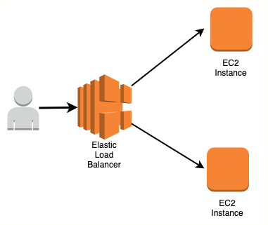

# **UT. 6 - Interconexión, equilibrado y escalado de infraestructuras**

{ .trescinco }

 

**Resultados de aprendizaje y criterios de evaluacion que se evaluarán en esta unidad.**  

| **Resultados de aprendizaje de la unidad didáctica:** |
|-|
| **RA. 3:** Diseña y configura redes virtuales y servicios de cómputo en la nube, aplicando buenas prácticas de seguridad, estrategias de balanceo de carga, escalado automático y aprovechando tecnologías serverless, contenedores y máquinas virtuales según casos de uso específicos.|

|**Criterios de evaluación de la unidad didáctica:**|
||
|**a)** Se ha realizado el diseño y configuración de redes virtuales privadas.|
|**b)** Se ha aplicado buenas prácticas de seguridad en redes y arquitecturas.|
|**c)** Se ha participado activamente en la creación y configuración de una red funcional.|
|**d)** Se ha realizado la selección de servicios de computación adecuados según casos de uso.|
|**e)** Se ha llevado a cabo la configuración y gestión de balanceo de carga y escalado automático.|

 

## **Introducción**
peer connection
escalado automatico
elastic load balancing 
<!-- https://www.grycap.upv.es/cursocloudaws/contenido.php 
https://luisdieguez.com/tutorial-ansible-desde-0-herramienta-de-gestion-de-servidores/
https://ualmtorres.github.io/SeminarioDockerPresentacion/
https://www.youtube.com/watch?v=qNIniDftAcU
https://www.youtube.com/watch?v=TRLK6ZNpjB8

-->

<!-- file:///C:/Users/titan/Documents/Javier128/Eclipse/AWS/Arqui%20y%20despliegues%20en%20AWS/Tema%203/Tema%203.%20NAT%20Gateway,%20reglas%20encadenadas%20y%20subredes%20privadas.pdf -->

 <!-- file:///C:/Users/titan/Documents/Javier128/Modulos/DAW/DAW_2/AWS/UT/UT5/Tema%204/Tema%204.%20Peer%20connection%20y%20transit%20gw.pdf -->

<!-- 

https://www.youtube.com/watch?v=DSkO0ZJ8PxA

https://www.youtube.com/watch?v=lTUUJBa1dp4&list=PLDbrnXa6SAzV0J3Un9jRnbbFpuQH-_y-C&index=11

https://www.youtube.com/watch?v=iAYYssYrGms

https://www.youtube.com/watch?v=CGmTvukObOw -->

## **Enlaces de interés**
Documentación de [AWS](https://docs.aws.amazon.com).

<!-- https://aws.amazon.com/es/products/storage/ -->