# **UT. 6 - Interconexión y balanceo de infraestructuras**
{ .trescinco }
<br>

**Resultados de aprendizaje y criterios de evaluacion que se evaluarán en esta unidad.**  

| **Resultados de aprendizaje de la unidad didáctica:** |
|-|
| **RA. 3:** Diseña y configura redes virtuales y servicios de cómputo en la nube, aplicando buenas prácticas de seguridad, estrategias de balanceo de carga, escalado automático y aprovechando tecnologías serverless, contenedores y máquinas virtuales según casos de uso específicos.|

|**Criterios de evaluación de la unidad didáctica:**|
|-|
|**e)** Se ha llevado a cabo la configuración y gestión de balanceo de carga y escalado automático.|


## **1 - Interconexiones de redes, peer connection (peering) y transit gateway**
### **1.1 - Introducción**
En los entornos de computación en la nube, resulta habitual la necesidad de conectar distintas nubes privadas virtuales (VPC) entre sí o con redes locales. AWS ofrece varios mecanismos para lograr esta interconexión, entre los cuales destacan **VPC Peering y Transit Gateway**.
Ambos servicios cumplen el mismo propósito general (permitir la comunicación entre redes), pero lo hacen a través de enfoques distintos, lo que determina su conveniencia según el tamaño y la complejidad de la infraestructura.

- **VPC Peering**: Establece una **conexión directa punto a punto** entre dos VPC, permitiendo que los recursos de ambas se comuniquen mediante direcciones IP privadas. Este método es especialmente útil en entornos pequeños o cuando se requiere una integración sencilla entre dos VPC.  

- **Transit Gateway**: Actúa como un concentrador central (hub) que interconecta varias VPC y redes locales (on-premises) a través de un único punto de enlace. Esta arquitectura simplifica enormemente la gestión de redes complejas, ya que permite establecer una topología de tipo hub-and-spoke, donde todas las conexiones pasan por el mismo punto central.
Gracias a ello, Transit Gateway ofrece mayor escalabilidad, flexibilidad y control administrativo, siendo la opción más adecuada para organizaciones que gestionan múltiples entornos en AWS.

**Resumen**

|¿Cuándo utilizar VPC Peering?|**¿Cuándo utilizar VPC Peering?**|
|-|-|
|- Se requiere comunicación directa entre dos VPC.|Se gestiona una red extensa y compleja con múltiples VPC.|
|- La topología de red es pequeña y sencilla.|Es necesario conectar redes locales y otros servicios de AWS.|
|- El coste es un factor determinante.|Se desea centralizar la administración de la red.|
||Se priorizan la escalabilidad y la flexibilidad en la arquitectura.|

### **1.2 - Peer connection**
Para familiarizarnos con el peering en AWS, usaremos el siguiente escenario:

{ .seiscinco }

#### **1.2.1 - Crear los elementos básicos**
En un primer momento crearemos:

1. Las 2 VPC (us-east-1 (N. Virginia) y us.east-2 (Oregon)). 
1. Las subredes (públicas) y sus respectivas tablas de enrutamiento.
1. Las instancias EC2 y sus grupos de seguridad para posibilitar pings y conexiones SSH.

#### **1.2.2 - Realizar el peering entre VPC's**
Una vez creada la infraestructura (VPC + subred + EC2 + IGW) iniciaremos las interconección desde la región us-east-1 (N. Virginia).

- Desde el menú VPC buscamos **Interconexiones**. 
  { .lefttrescero .marco .margin2020 } <br>


- En este caso, crearemos la conexión desde la región **us-east-1 / Norte de Virginia**. 
  { .sietecinco .marco .margin2020 } <br>


- Para completar **la solicitud de conexión** necesitaremos la id de la VPC de la región **us-west-2 / Oregón**
  { .sietecinco .marco .margin2020 } <br>


- Petición de conexión creada, pendiente de aceptación.  
  { .sietecinco .marco .margin2020 } <br>


- Hasta que la otra VPC no acepte la conexión, el estado de la misma será "pendiente". 
  { .sietecinco .marco .margin2020 } <br>
  

- En la otra región aceptamos (o rechazamos la petición). 
  { .sietecinco .marco .margin2020 }
  { .cincozero .marco .margin2020 } <br>

- En la otra región aceptamos (o rechazamos la petición). 

#### **1.2.3 - Configuración de la interconexión**
- Para evitar problemas con la resolución de nombres en el servicio de interconexión, en Interconexiones → DNS, habilitaremos la opción de resolver el dns.
  { .original .marco .margin2020 } 
  { .original .marco .margin2020 } <br>

- Si no deja hacerlo, iremos a la VPC receptora y comprobaremos la configuración de DNS. 
  { .sietecinco .marco .margin2020 } <br>
 
#### **1.2.4 - Configuración de la tablas de enrutamiento**
- De la misma manera que para una puerta de enlace de internet (IGW) añadiremos una ruta a las IP's de las VPC's, tanto en la VPC Norte de Virginia como en la VPC Oregón (acordaros de asociar explícitamente la subred a la tabla de enrutamiento).
<br><br>
- **VPC Oregón**
  { .cien .marco .margin2020 } <br>

- **VPC Norte de Virginia**
  { .cien .marco .margin2020 } <br>

#### **1.2.5 - Configuración de los grupos de seguridad de las instancias**
- **EC2 Oregón**
  { .cien .marco .margin2020 } <br>

- **EC2 Norte de Virginia**
  { .cien .marco .margin2020 } <br>

#### **1.2.6 - Pruebas de conexión**
- ping de EC2 Norte de Virginia hacia Oregon  
  { .leftcincocero .margin2020   } <br>

- ping de EC2 Oregon hacia Norte de Virginia  
  { .leftcincocero .margin2020   } <br>

### **1.3 - Transit Gateway**  
Un AWS Transit Gateway (TGW) es un servicio de red de Amazon Web Services diseñado para interconectar de forma centralizada múltiples VPC, conexiones VPN, Direct Connect y redes on-premise dentro de **una misma región**. Actúa como **un router regional** de alto rendimiento, simplificando arquitecturas complejas y reduciendo la necesidad de crear múltiples VPC Peering.

#### **1.3.1 - Escenario**
Para familiarizarnos con el Transit gateway de AWS, usaremos el siguiente escenario:

{ .cincozero }

#### **1.3.2 - Creación del transit gateway**
Una vez implementada la arquitectura de red, pasaremos a crear y configurar el Transit gateway.

{ .marco .ochocinco }<br>
{ .marco .ochocinco }<br>  
Nos esperamos  a que su estado pase de **pending** a **available**.

{ .marco .ochocinco }<br>  

#### **1.3.3 - Conexiones del transit gateway**
Como tenemos 3 VPC's necesitaremos crear 3 conexiones.

{ .marco .ochocinco }<br>
Repetiremos este paso para las otras 2 VPC's.  

{ .marco .sietecinco }<br>
Resultado final con las 3 conexiones creadas.  

{ .marco .sietecinco }<br>

#### **1.3.4 - Modificar las tablas de enrutamiento de las VPC's**
Podemos ver que AWS ha creado una tabla de enrutamiento para el TGW pero, no es aquí donde configuraremos las nuevas rutas sino en la tabla de enrutamiento de cada VPC.

{ .marco .ochocinco }<br>

Tabla de enrutamiento de la VPC-1 (no es necesario ser tan restrictivo con las rutas ya que la propia conexión del TGW se ha creado para una VPC y una subred concreta).

{ .marco .ochocinco }<br>

#### **1.3.5 - Pruebas de conexión**
No conectamos a la instancia 1 (por consola o por SSH) y vemos al hacer ping, que hay comunicacion entre instancias a pesar de encontrarse en VPC's distintas (dentro de una misma región).

{ .cincozero }<br>

#### **1.3.6 - Pruebas adicionales**
!!! exercise "Propargarse a otra instancia y comprobar si esa instancia tiene conexión a internet"
    ¿Qué soluciones podemos aplicar para que las instancias de la VPC-2 y VPC-3 tengan conexión a internet?
 
### **1.4 - Tarea RA3-CEd**
Monta el siguiente escenario:

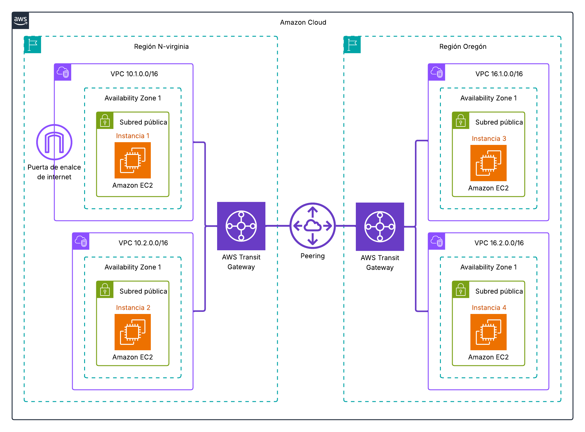{ .sietecinco }<br>

- Se trabajará en 2 regiones distintas (us-east-1 / N-Virginia y us-west-2 / Oregón). 
- En cada región estarán ubicadas dos VPCs con sus correspondientes subredes interconectadas por un Transit Gateway. 
- Para interconectar las regiones usaremos un peer connection pero no desde **Interconexiones** sino desde **Conexiones de gateway de tránsito**. 

    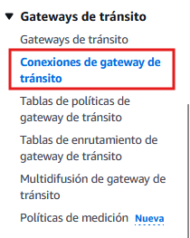{ .marco .leftdoscero }<br>

- Rellenaremos los campos con los datos de nuestros **transit gateways**.

    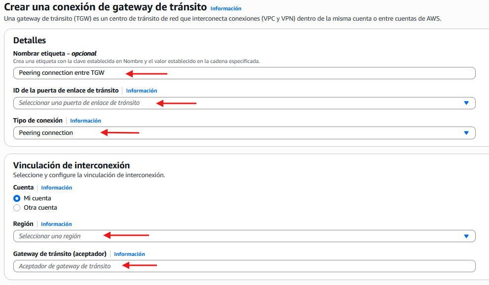{ .marco .leftsietecinco }<br>

- Conectarse a la instancia 1 y realizar capturas de pings al resto de instancias (1 captura + 3 pings). 
- Realizar capturas de la propagación y pings con éxito a todas las instancias del escenario (3 capturas de 3 pings cada una).


## **2 - Equilibrado y escalado de infraestructuras**
### **2.1 - Introducción**
En entornos de computación en la nube, el equilibrio de carga y el escalado automático son dos componentes esenciales para garantizar la disponibilidad, el rendimiento y la eficiencia de las aplicaciones y servicios. .

- **Elastic Load Balancing (ELB)**: Distribuye automáticamente el tráfico entrante entre múltiples instancias de Amazon EC2, contenedores y direcciones IP en una o más zonas de disponibilidad. Esto asegura que ninguna instancia se sobrecargue y que las aplicaciones permanezcan disponibles incluso si una o más instancias fallan.

- **Auto Scaling**: Permite ajustar automáticamente la capacidad de las instancias EC2 en función de las condiciones definidas por el usuario. Esto significa que se pueden añadir o eliminar instancias según la demanda del tráfico, lo que ayuda a mantener el rendimiento óptimo y a controlar los costos operativos.

La combinación de ambos permite crear arquitecturas altamente disponibles, resilientes, rentables y tolerantes a fallos, asegurando que la infraestructura responda adecuadamente a fluctuaciones del tráfico sin intervención manual.

### **2.2 - Elastic Load Balancing (ELB)**
Elastic Load Balancing (ELB) es un servicio de AWS que distribuye automáticamente el tráfico entrante entre múltiples instancias de Amazon EC2, contenedores y direcciones IP en una o más zonas de disponibilidad. ELB ayuda a mejorar la disponibilidad y la tolerancia a fallos de las aplicaciones al garantizar que el tráfico se dirija solo a las instancias saludables. 

Dentro de ELB existen cuatro tipos de balanceadores, cada uno orientado a distintos casos de uso:

| Tipo de balanceador                 | Capa OSI | Casos de uso principales                                                               |
| - | - | - |
| **Application Load Balancer (ALB)** | Capa 7   | Aplicaciones web HTTP/HTTPS, microservicios, routing basado en URLs o cabeceras        |
| **Network Load Balancer (NLB)**     | Capa 4   | Tráfico TCP/UDP de alto rendimiento, baja latencia, millones de conexiones por segundo |
| **Gateway Load Balancer (GWLB)**    | Capa 3   | Integración con firewalls, IDS/IPS y appliances de red                                 |
| **Classic Load Balancer (CLB)**     | Capa 4/7 | Versión heredada; solo recomendado para aplicaciones antiguas                          |

#### **2.2.1 - Escenario propuesto**
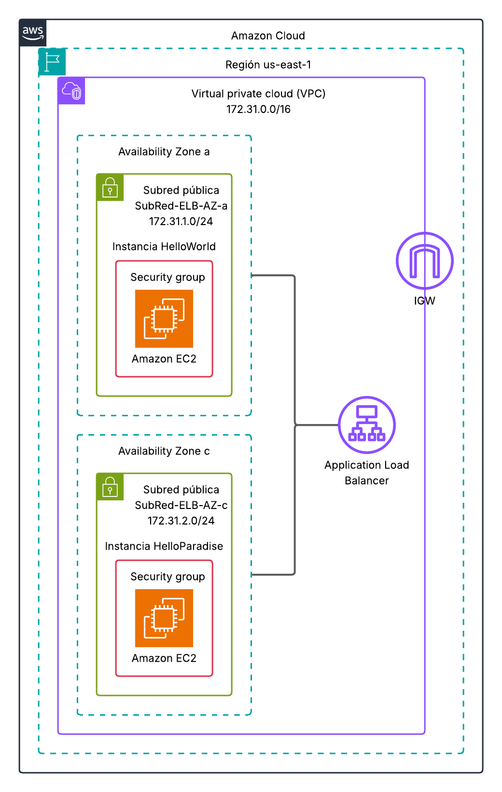{ .cincozero }<br>

Antes de implementar el balanceador de carga, implementaremos la infraestructura base. Para ello contamos con los siguientes elementos:

1. VPC denominada VPC-ELB
    - Rango de direcciones (CIDR): 172.31.0.0/16

1. Subred pública en la zona de disponibilidad “a”
    - Nombre: SubRed-ELB-AZ-a
    - Rango de direcciones (CIDR): 172.31.1.0/24
1. Subred pública en la zona de disponibilidad “c”
    - Nombre: SubRed-ELB-AZ-c
    - Rango de direcciones (CIDR): 172.31.2.0/24
1. Instancias EC2 disponibles para el balanceo
    - HelloWorld
    - HelloParadise
    - Ambas instancias:
        - Se encuentran en zonas de disponibilidad distintas (una en a y otra en c)
        - Disponen de IP pública para permitir el acceso externo 

#### **2.2.2 - Instancias EC2**
A diferencia de las otras prácticas donde solo lanzabamos las instancias sin hacer nada con ellas, en esta instalaremos un servidor web y un archivo indiex.html para comprobar el correcto funcionamiento del equilibrador de carga.

!!! tip "Paso 1 - Detalles avanzados" 
Durante el lanzado de la instancia EC2 buscar el apartado **Detalles avanzados**.

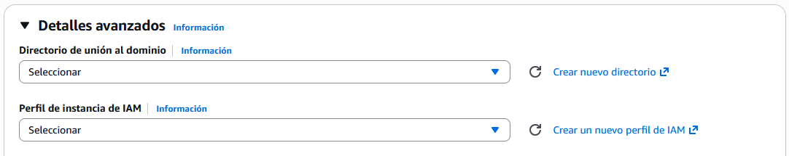{ .ochocinco .marco }<br>

!!! tip "Paso 2 - Datos de usuario"

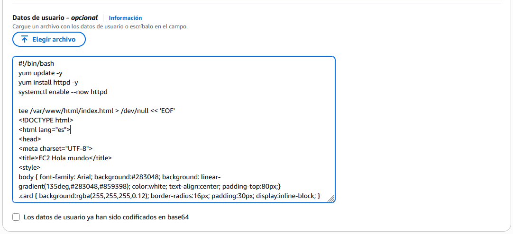{ .ochocinco .marco }<br>

Dentro del campo **Datos de usuario** pondremos un script que se ejecutará al lanzar la instancia.

Adaptar el script para cada instancia, cambiando **Instancia 1** por **Instancia 2** y **Hola mundo** por **Hola paraíso**. 
```bash
#!/bin/bash
yum update -y
yum install httpd -y
systemctl enable --now httpd

sudo tee /var/www/html/index.html > /dev/null <<EOF
<!DOCTYPE html>
<html lang="es">
<head>
<meta charset="UTF-8">
<title>Instancia 1</title>
<style>
body {
    font-family: Arial;
    background: #283048;
    background: linear-gradient(135deg,#283048,#859398);
    color: white;
    text-align: center;
    padding-top: 80px;
}
.card {
    background: rgba(255,255,255,0.12);
    border-radius: 16px;
    padding: 30px;
    display: inline-block;
}
</style>
</head>
<body>
<div class="card">
    <h1>¡Hola mundo!</h1>
    <p>Instancia 1</p>
    <p>Hora: <b id="hora"></b></p>
</div>

<script>
const ahora = new Date();
const hora = String(ahora.getHours()).padStart(2,'0') + ':' +
             String(ahora.getMinutes()).padStart(2,'0') + ':' +
             String(ahora.getSeconds()).padStart(2,'0');

document.getElementById("hora").innerHTML = "<b>" + hora + "</b>";
</script>

</body>
</html>
EOF
```
<br>

#### **2.2.3 - Creación del balanceador de carga**

!!! tip "1. Desde EC2 accedemos a **Balanceadores de carga**"
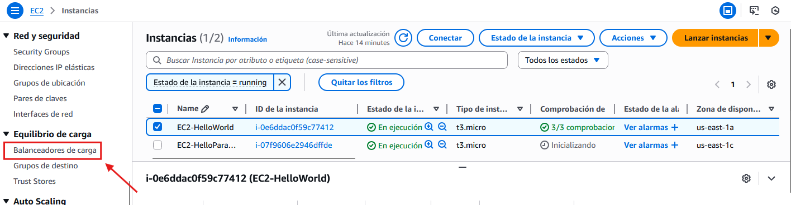{ .ochocinco .marco .margintop20 }<br>
**Configuramos los parámetros principales:**

- Nombre LB-Instancias
- Expuesto a internet
- IP tipo: IPv4

    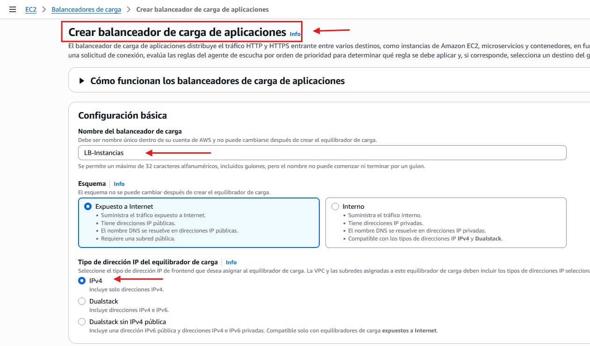{ .ochocinco .marco .margintop20 }<br>

**Mapeo de red.**

- VPC: VPC-ELB
- Seleccionamos SubRed-ELB-AZ-a y SubRed-ELB-AZ-c

    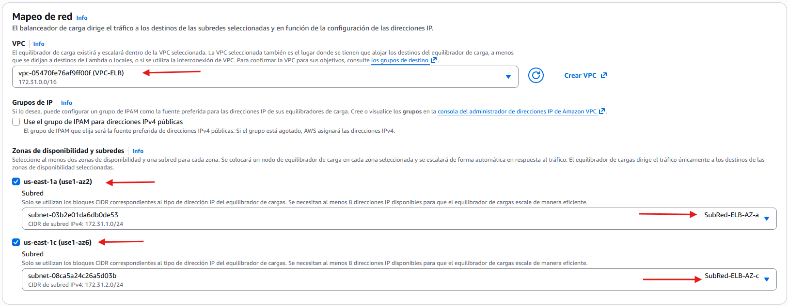{ .ochocinco .marco }<br>

!!! tip "2. Grupos de seguridad"
Creamos un grupo de seguridad para el balanceador de carga , asociamos un SG que permita HTTP (80) desde cualquier origen.
  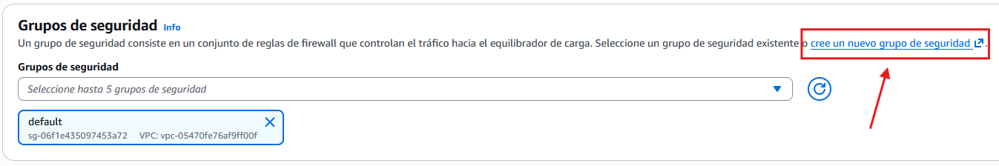{ .ochocinco .marco .margintop20 }<br>
  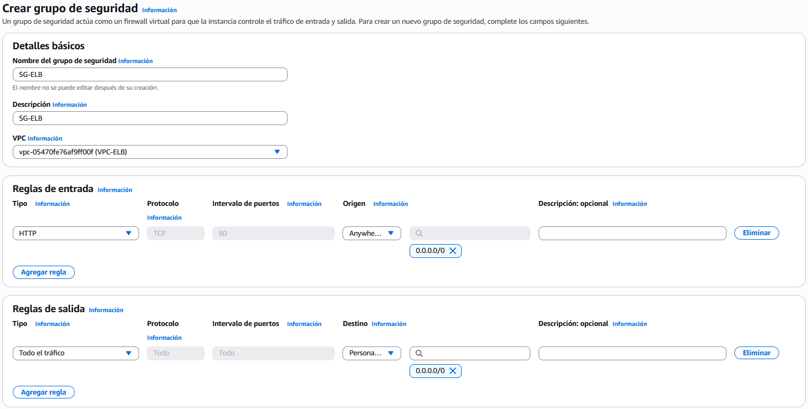{ .ochocinco .marco  }<br>
  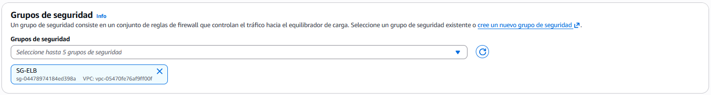{ .ochocinco .marco  }<br>

!!! tip "3. Agentes de escucha y direccionamiento"
En este apartado configuraremos los puertos sobre los cuales el equilibrador de carga aceptará las conexiones entrantes y determinará a qué instancias se redirigirán.

- Protocolo: HTTP / 80
- Acción predeterminada: Reenviar el tráfico al grupo de destino (conjunto de instancias que recibirán las peticiones).  
Si todavía no disponemos de ningún grupo de destino creado, seleccionamos la opción “Agregar grupo de destino” y luego **Cree un grupo de destino** y lo configuramos antes de continuar.
    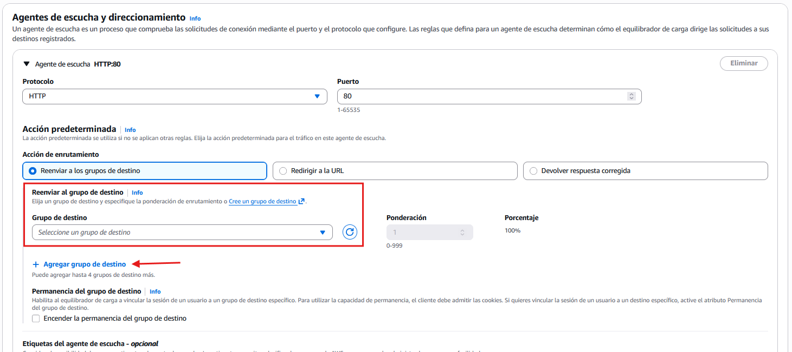{ .cien .marco .margintop20 }<br>
    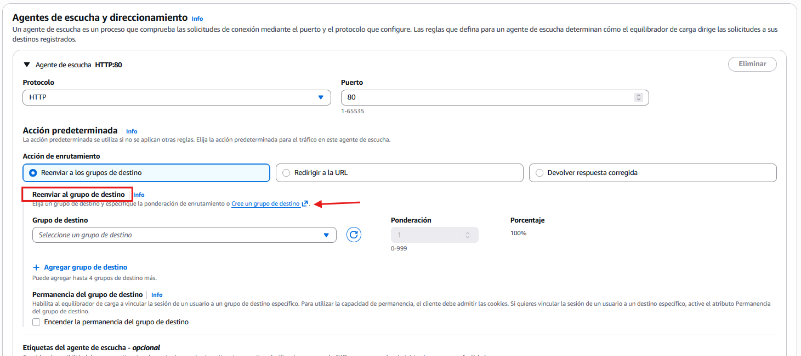{ .cien .marco }<br>

- Crear grupo de destino
    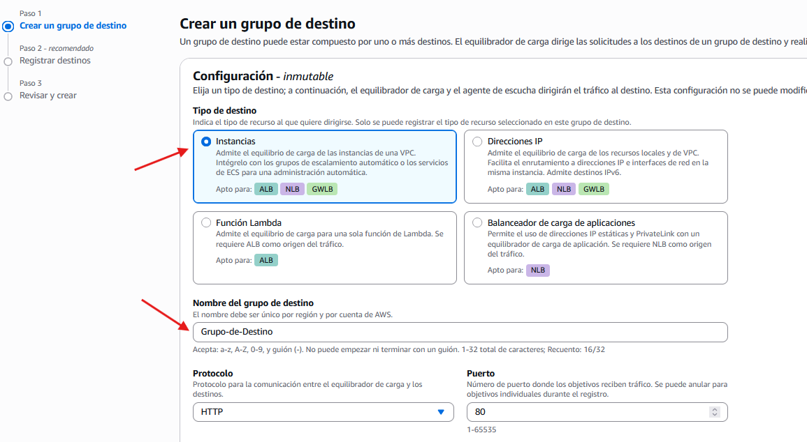{ .cien .marco .margintop20 }<br>
    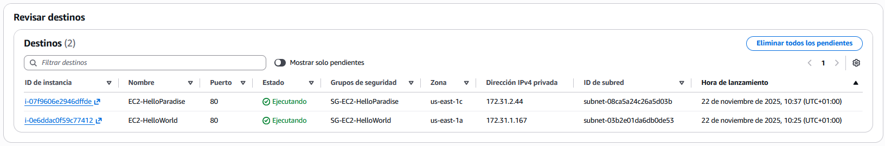{ .cien .marco }<br>

- Revisamos los datos y creamos el grupo de destino
    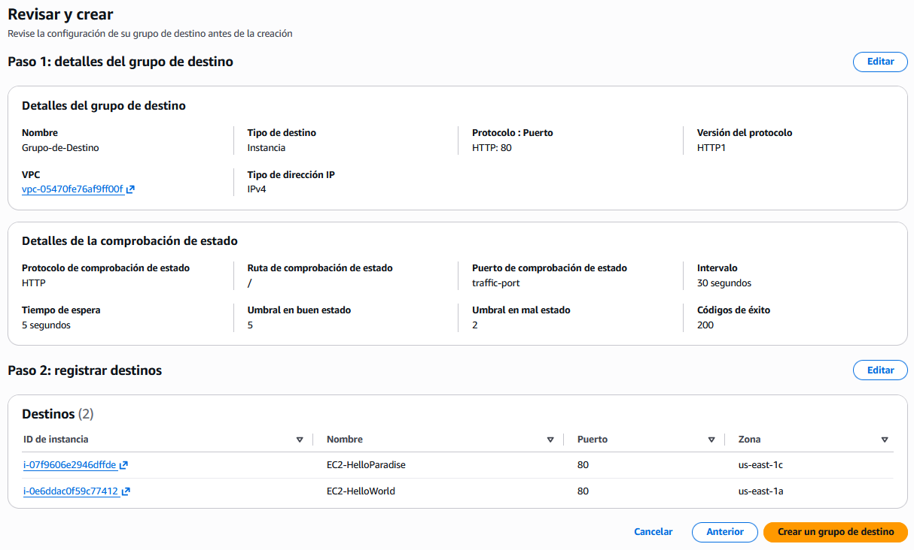{ .cien .marco .margintop20 }<br>

- Finalizamos la creación del equilibrador de carga
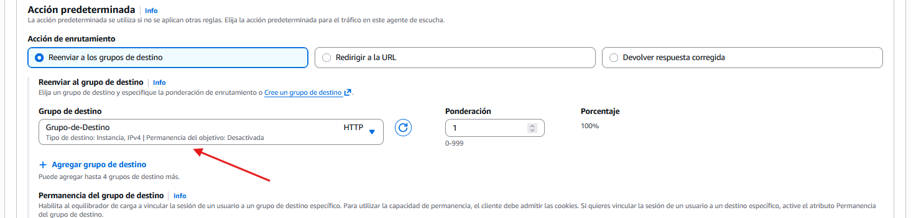{ .cien .marco .margintop20 }<br>
    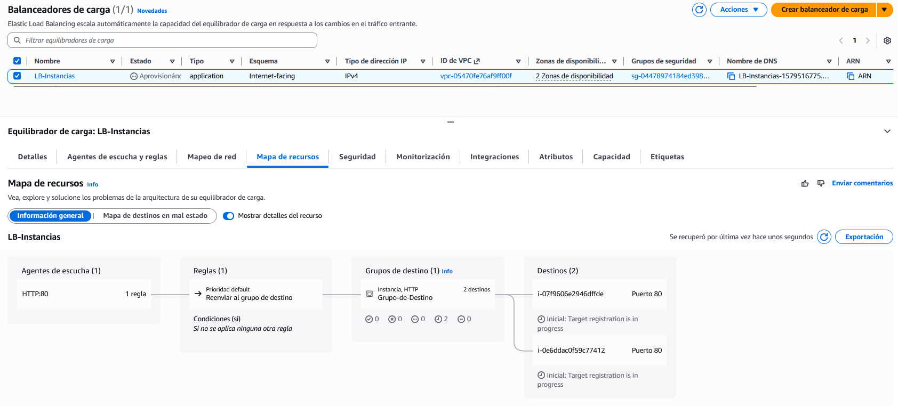{ .cien .marco  }<br>

#### **2.2.4 - Editar los atributos del equilibrador de carga**
Una vez creado el equilibrador de carga, revisaremos y ajustaremos sus atributos para optimizar su funcionamiento. Estos atributos determinan el comportamiento del equilibrador de carga y la forma en que gestiona las peticiones de los usuarios.

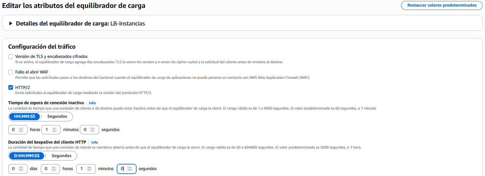{ .cien .marco  }<br>

Dentro de este apartado se pueden ajustar, entre otros, los siguientes parámetros:

- **Tiempo de inactividad de conexión**  
El tiempo de espera de la conexión inactiva es el período de tiempo que una conexión de cliente o de destino existente puede permanecer inactiva, sin que se envíen ni reciban datos, antes de que el equilibrador de carga cierre la conexión.

- **Duración del valor keepalive del cliente HTTP**  
La duración del valor keepalive del cliente HTTP es el tiempo máximo durante el que un Equilibrador de carga de aplicación mantiene una conexión HTTP persistente con un cliente. Una vez transcurrido el tiempo del valor keepalive del cliente HTTP configurado, el Equilibrador de carga de aplicación acepta una solicitud más y, a continuación, devuelve una respuesta que cierra la conexión sin problemas.

- **Protección contra eliminación**  
Para evitar que el equilibrador de carga se elimine por error, puede habilitar la protección contra eliminación. De forma predeterminada, la protección contra eliminación del equilibrador de carga está deshabilitada.

- **Modo de mitigación de desincronización**  
El modo de mitigación de desincronización protege a la aplicación de problemas causados por desincronización HTTP. El equilibrador de carga clasifica cada solicitud en función de su nivel de amenaza, permite solicitudes seguras y, además, mitiga el riesgo según lo especificado en el modo de mitigación que determine.

- **Conservación del encabezado del host**  
Cuando habilita el atributo Conservar encabezado de host, el Equilibrador de carga de aplicación conserva el encabezado Host de la solicitud HTTP y la envía a los destinos sin ninguna modificación. Si el Equilibrador de carga de aplicación recibe varios encabezados Host, los conserva todos. Las reglas de oyente se aplican solo al primer encabezado Host recibido.

#### **2.2.5 - Comprobación del funcionamiento del equilibrador de carga**
!!! tip "Acceso al equilibrador de carga"
A diferencia de las instancias, el acceso al equilibrador de carga solo se puede realizar a través de su DNS.  
**Nota:**  
Aunque las instancias tienen IP pública, también es posible acceder a ellas tanto por IP como por DNS, pero este acceso se realiza directamente a la instancia, no a través del balanceador.

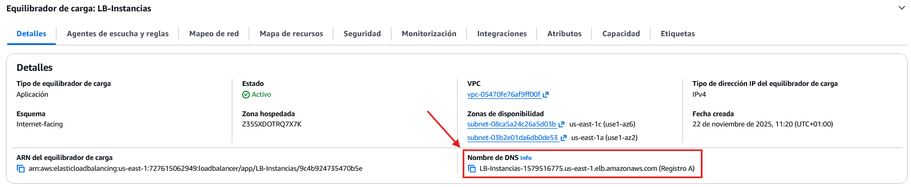{ .cien .marco  }<br>

Si actualizamos repetidamente el navegador para acceder al recurso, observaremos que, en función del balanceo y de la latencia, la respuesta irá alternando entre una instancia y la otra. 

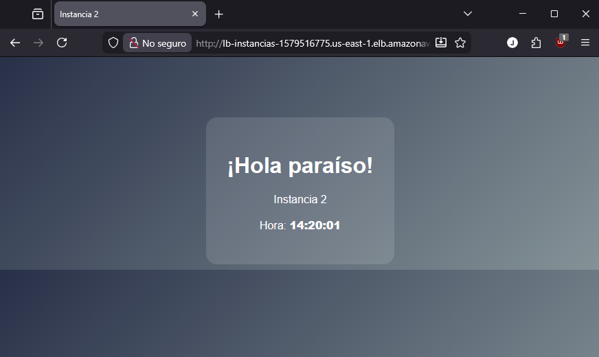{ .cincozero }<br>
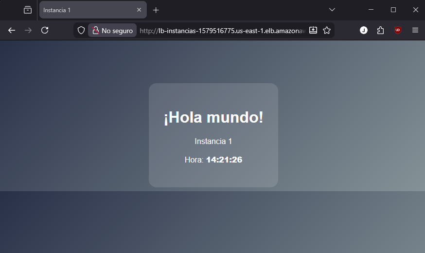{ .cincozero }<br>


### **2.3 - Auto Scaling** 
Auto Scaling permite adaptar la capacidad de cómputo de la infraestructura a la demanda real del sistema.  
AWS ofrece dos enfoques principales:

| Tipo                 |Descripción  |
| - | - |
| **EC2 Auto Scaling** | Escalado automático exclusivo de instancias EC2 mediante Auto Scaling Groups (ASG)        |
| **AWS Auto Scaling** | Escalado automático de múltiples recursos además de EC2, como DynamoDB, Aurora, ECS, etc. | 

**Recursos no disponibles con LabRole.**

## **Enlaces de interés**
Documentación de [AWS](https://docs.aws.amazon.com)  
[Elastic Load Balancing](https://docs.aws.amazon.com/es_es/elasticloadbalancing/latest/userguide/what-is-load-balancing.html)  
[Atributos del Elastic Load Balancing](https://docs.aws.amazon.com/es_es/elasticloadbalancing/latest/application/edit-load-balancer-attributes.html)  
[VPC peering](https://docs.aws.amazon.com/es_es/vpc/latest/peering/what-is-vpc-peering.html)  
[Transit Gateway](https://aws.amazon.com/es/transit-gateway/)  