# **UT. 6 - Interconexión, equilibrado y escalado de infraestructuras**
{ .trescinco }
 

**Resultados de aprendizaje y criterios de evaluacion que se evaluarán en esta unidad.**  

| **Resultados de aprendizaje de la unidad didáctica:** |
|-|
| **RA. 3:** Diseña y configura redes virtuales y servicios de cómputo en la nube, aplicando buenas prácticas de seguridad, estrategias de balanceo de carga, escalado automático y aprovechando tecnologías serverless, contenedores y máquinas virtuales según casos de uso específicos.|

|**Criterios de evaluación de la unidad didáctica:**|
|-|
|**d)** Se ha realizado la selección de servicios de computación adecuados según casos de uso.|
|**e)** Se ha llevado a cabo la configuración y gestión de balanceo de carga y escalado automático.|
    

| **Resultados de aprendizaje de la unidad didáctica:** |
|-|
| **RA. 4:** Gestiona servicios de almacenamiento y bases de datos en la nube, seleccionando tecnologías adecuadas para casos específicos, y diseña arquitecturas escalables y resilientes utilizando herramientas de monitoreo y optimización para mejorar el rendimiento.|

|**Criterios de evaluación de la unidad didáctica:**|
|-|
|**a)** Se ha realizado la diferenciación entre tecnologías de almacenamiento en la nube.|
|**b)** Se ha llevado a cabo la configuración y gestión de bases de datos en un entorno de nube.|
|**c)** Se ha trabajado en la resolución de problemas prácticos sobre almacenamiento y bases de datos.|
|**d)** Se ha diseñado arquitecturas escalables y resilientes basadas en las mejores prácticas.|
|**e)** Se ha hecho uso de herramientas de monitoreo y recomendaciones de optimización.|

## **1 - Interconexiones de redes, peer connection (peering) y transit gateway**
### **1.1 - Introducción**
En los entornos de computación en la nube, resulta habitual la necesidad de conectar distintas nubes privadas virtuales (VPC) entre sí o con redes locales. AWS ofrece varios mecanismos para lograr esta interconexión, entre los cuales destacan **VPC Peering y Transit Gateway**.
Ambos servicios cumplen el mismo propósito general (permitir la comunicación entre redes), pero lo hacen a través de enfoques distintos, lo que determina su conveniencia según el tamaño y la complejidad de la infraestructura.

- **VPC Peering**: Establece una **conexión directa punto a punto** entre dos VPC, permitiendo que los recursos de ambas se comuniquen mediante direcciones IP privadas. Este método es especialmente útil en entornos pequeños o cuando se requiere una integración sencilla entre dos VPC.  

- **Transit Gateway**: Actúa como un concentrador central (hub) que interconecta varias VPC y redes locales (on-premises) a través de un único punto de enlace. Esta arquitectura simplifica enormemente la gestión de redes complejas, ya que permite establecer una topología de tipo hub-and-spoke, donde todas las conexiones pasan por el mismo punto central.
Gracias a ello, Transit Gateway ofrece mayor escalabilidad, flexibilidad y control administrativo, siendo la opción más adecuada para organizaciones que gestionan múltiples entornos en AWS.

**Resumen**

|¿Cuándo utilizar VPC Peering?|**¿Cuándo utilizar VPC Peering?**|
|-|-|
|- Se requiere comunicación directa entre dos VPC.|Se gestiona una red extensa y compleja con múltiples VPC.|
|- La topología de red es pequeña y sencilla.|Es necesario conectar redes locales y otros servicios de AWS.|
|- El coste es un factor determinante.|Se desea centralizar la administración de la red.|
||Se priorizan la escalabilidad y la flexibilidad en la arquitectura.|

### **1.2 - Peer connection**
Para familiarizarnos con el peering en AWS, usaremos el siguiente escenario:

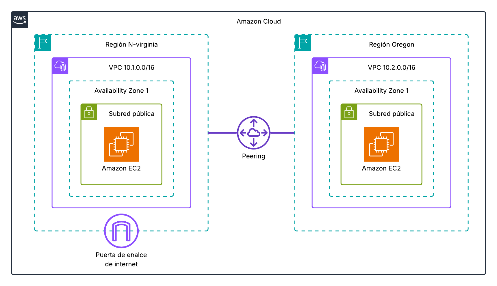{ .seiscinco }

### **1.2.1 - Crear los elementos básicos**
En un primer momento crearemos:

1. Las 2 VPC (us-east-1 (N. Virginia) y us.east-2 (Oregon)). 
1. Las subredes (públicas) y sus respectivas tablas de enrutamiento.
1. Las instancias EC2 y sus grupos de seguridad para posibilitar pings y conexiones SSH.

### **1.2.2 - Realizar el peering entre VPC's**
Una vez creada la infraestructura (VPC + subred + EC2 + IGW) iniciaremos las interconección desde la región us-east-1 (N. Virginia).

- Desde el menú VPC buscamos **Interconexiones**. 
  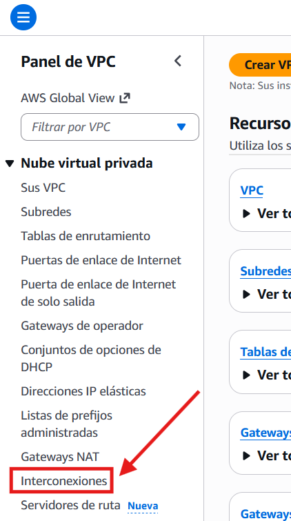{ .lefttrescero .marco .margin2020 }  

- En este caso, crearemos la conexión desde la región **us-east-1 / Norte de Virginia**. 
  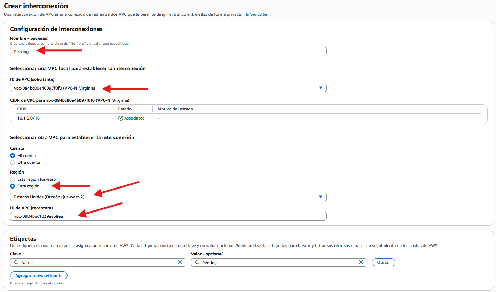{ .sietecinco .marco .margin2020 }  

- Para completar **la solicitud de conexión** necesitaremos la id de la VPC de la región **us-west-2 / Oregón**
  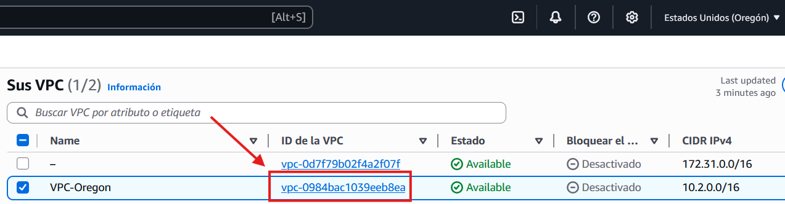{ .sietecinco .marco .margin2020 }  

- Petición de conexión creada, pendiente de aceptación.  
  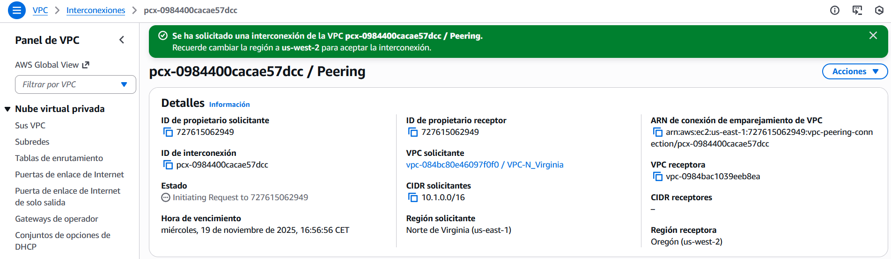{ .sietecinco .marco .margin2020 }  

- Hasta que la otra VPC no acepte la conexión, el estado de la misma será "pendiente". 
  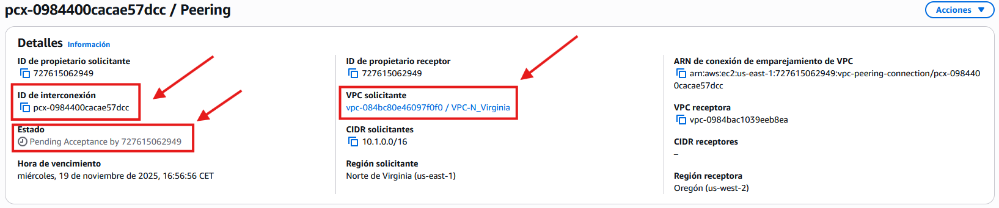{ .sietecinco .marco .margin2020 }  
  

- En la otra región aceptamos (o rechazamos la petición). 
  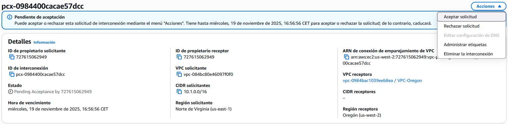{ .sietecinco .marco .margin2020 }
  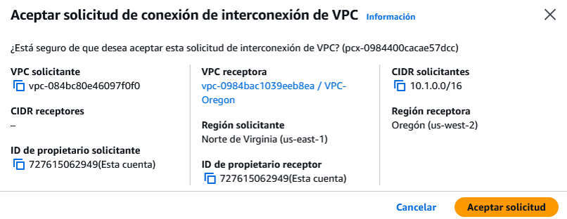{ .cincozero .marco .margin2020 }  

- En la otra región aceptamos (o rechazamos la petición). 

### **1.2.3 - Configuración de la interconexión**
- Para evitar problemas con la resolución de nombres en el servicio de interconexión, en Interconexiones → DNS, habilitaremos la opción de resolver el dns.
  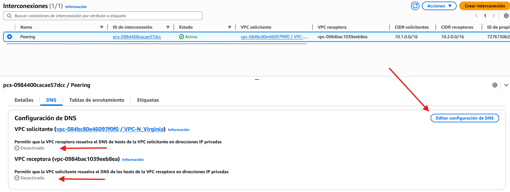{ .original .marco .margin2020 } 
  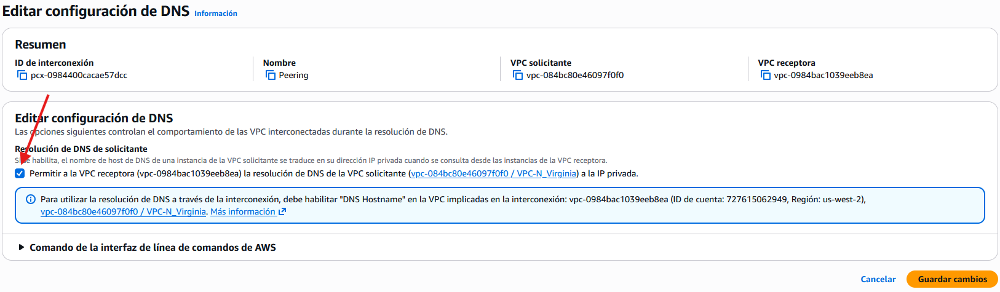{ .original .marco .margin2020 }  

- Si no deja hacerlo, iremos a la VPC receptora y comprobaremos la configuración de DNS. 
  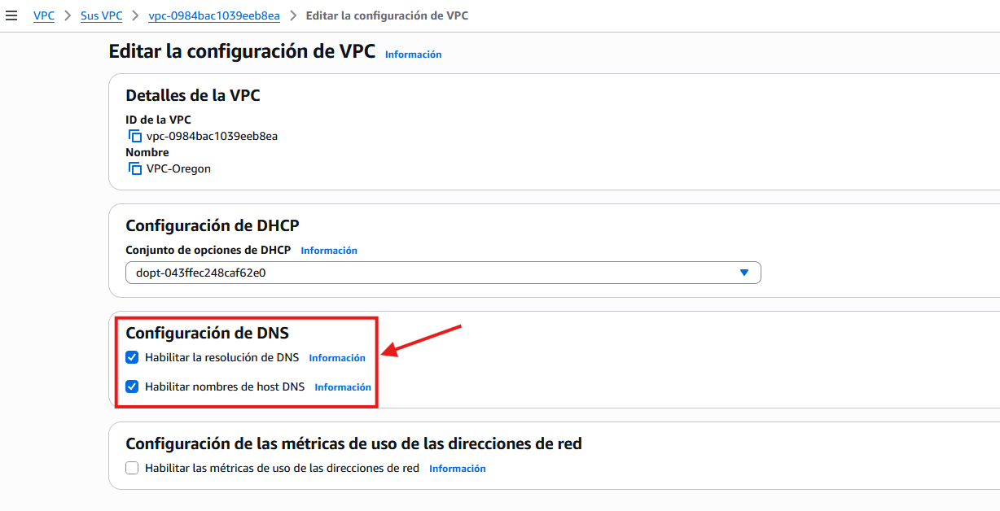{ .sietecinco .marco .margin2020 }  
 
### **1.2.4 - Configuración de la tablas de enrutamiento**
- De la misma manera que para una puerta de enlace de internet (IGW) añadiremos una ruta a las IP's de las VPC's, tanto en la VPC Norte de Virginia como en la VPC Oregón (acordaros de asociar explícitamente la subred a la tabla de enrutamiento).
  
- **VPC Oregón**
  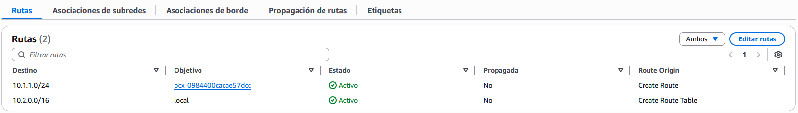{ .cien .marco .margin2020 }  

- **VPC Norte de Virginia**
  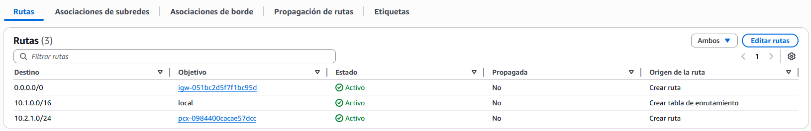{ .cien .marco .margin2020 }  

### **1.2.5 - Configuración de los grupos de seguridad de las instancias**
- **EC2 Oregón**
  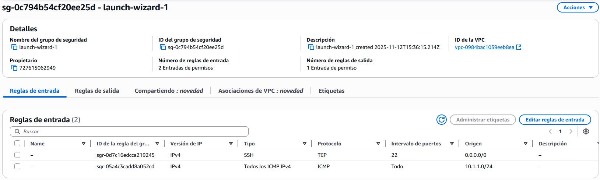{ .cien .marco .margin2020 }  

- **EC2 Norte de Virginia**
  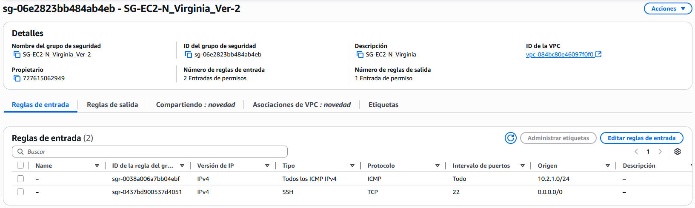{ .cien .marco .margin2020 }  

### **1.2.6 - Pruebas de conexión**
- ping de EC2 Norte de Virginia hacia Oregon  
  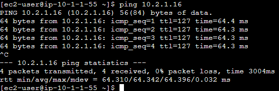{ .leftcincocero .margin2020   }  

- ping de EC2 Oregon hacia Norte de Virginia  
  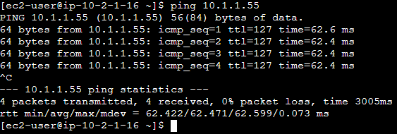{ .leftcincocero .margin2020   }  

### **1.3 - Transit Gateway**  
Un AWS Transit Gateway (TGW) es un servicio de red de Amazon Web Services diseñado para interconectar de forma centralizada múltiples VPC, conexiones VPN, Direct Connect y redes on-premise dentro de **una misma región**. Actúa como **un router regional** de alto rendimiento, simplificando arquitecturas complejas y reduciendo la necesidad de crear múltiples VPC Peering.

#### **1.3.1 - Escenario**
Para familiarizarnos con el Transit gateway de AWS, usaremos el siguiente escenario:

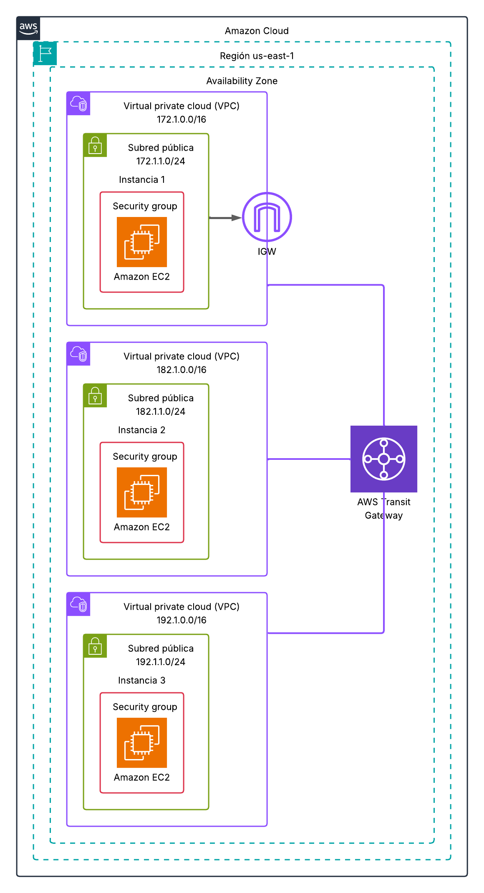{ .cincozero }

#### **1.3.2 - Creación del transit gateway**
Una vez implementada la arquitectura de red, pasaremos a crear y configurar el Transit gateway.

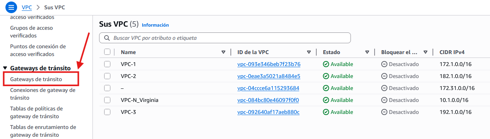{ .marco .ochocinco } 
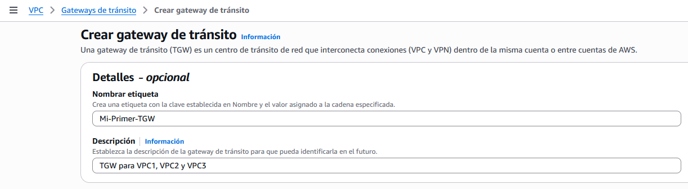{ .marco .ochocinco }   
Nos esperamos  a que su estado pase de **pending** a **available**.

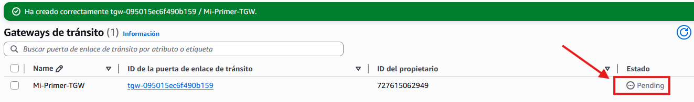{ .marco .ochocinco }   

#### **1.3.3 - Conexiones del transit gateway**
Como tenemos 3 VPC's necesitaremos crear 3 conexiones.

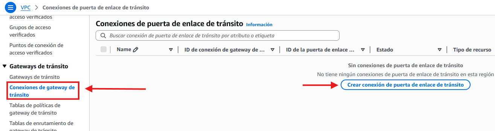{ .marco .ochocinco } 
Repetiremos este paso para las otras 2 VPC's.  

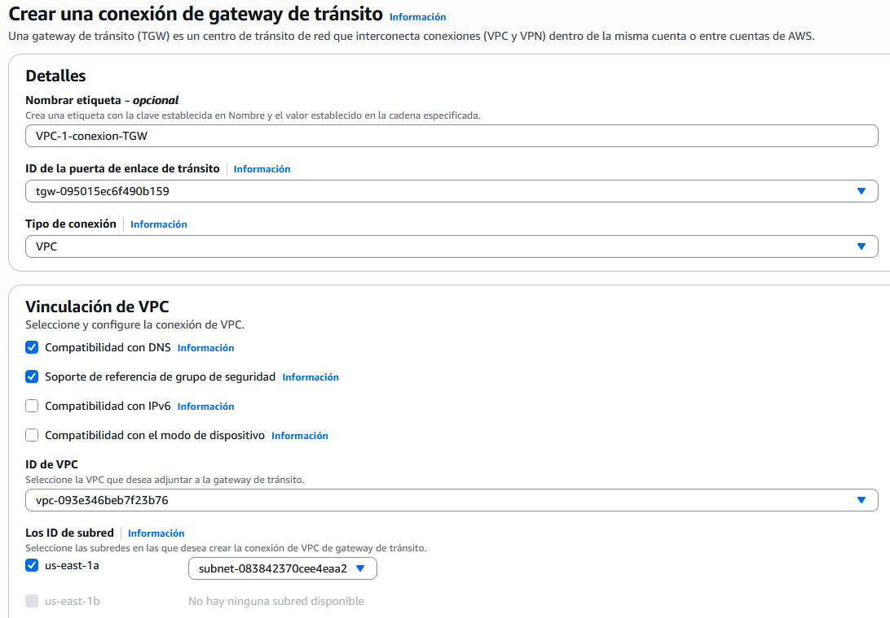{ .marco .sietecinco } 
Resultado final con las 3 conexiones creadas.  

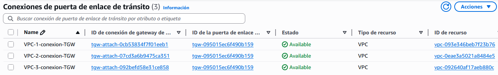{ .marco .sietecinco } 

#### **1.3.4 - Modificar las tablas de enrutamiento de las VPC's**
Podemos ver que AWS ha creado una tabla de enrutamiento para el TGW pero, no es aquí donde configuraremos las nuevas rutas sino en la tabla de enrutamiento de cada VPC.

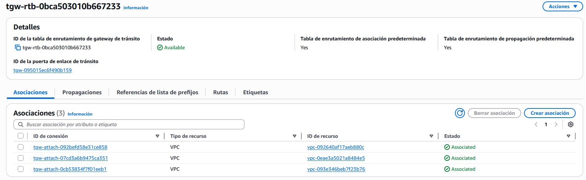{ .marco .ochocinco } 

Tabla de enrutamiento de la VPC-1 (no es necesario ser tan restrictivo con las rutas ya que la propia conexión del TGW se ha creado para una VPC y una subred concreta).

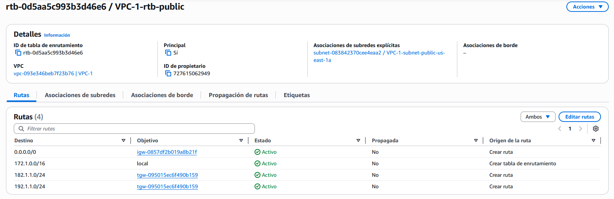{ .marco .ochocinco } 

#### **1.3.5 - Pruebas de conexión**
No conectamos a la instancia 1 (por consola o por SSH) y vemos al hacer ping, que hay comunicacion entre instancias a pesar de encontrarse en VPC's distintas (dentro de una misma región).

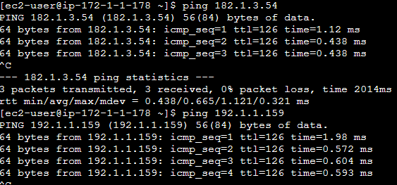{ .cincozero } 

#### **1.3.6 - Pruebas adicionales**
!!! exercise "Propargarse a otra instancia y comprobar si esa instancia tiene conexión a internet"

<!-- bbdd
https://www.youtube.com/watch?v=vp_uulb5phM
https://www.youtube.com/watch?v=eK_umMYxZfM
https://www.youtube.com/watch?v=6E30Yr2UATw
  https://www.youtube.com/watch?v=kNm0z_hRJlw
  https://www.youtube.com/watch?v=wLTFaDebTBY
  https://www.youtube.com/watch?v=BTg1JbmE3x4
  https://www.youtube.com/watch?v=tykcCf-Zz1M -->

<!-- ecs
https://prezi.com/p/5jffku-0bqyl/amazon-elastic-container-service-overview/
https://www.youtube.com/watch?v=TRLK6ZNpjB8
https://www.youtube.com/watch?v=qbEPae8YNbs
https://www.youtube.com/watch?v=NI34uF7VVP8
https://www.youtube.com/watch?v=86Ys0LnMSnY -->
<!-- file:///C:/Users/titan/Documents/Javier128/Modulos/DAW/DAW_2/AWS/UT/UT6/Tema%204/Tema%204.%20Peer%20connection%20y%20transit%20gw.pdf -->

<!-- https://www.youtube.com/watch?v=qMppxz4Ou0A -->
<!-- route 53... 
cloud formation... 
elastic load balancing
Amazon Simple Storage Service (S3) 
Amazon Elastic File System (EFS)
Amazon Elastic Block Store (EBS) -->
<!-- https://docs.aws.amazon.com/AWSCloudFormation/latest/TemplateReference/aws-resource-cloudformation-stack.html 
Building Highly Available Web Application 
https://skillbuilder.aws/learn/2WBTDQFGSV/building-highly-available-web-application/2RW7UC62ZE
recursos de BBDD y buckets:

https://awsacademy.instructure.com/courses/64697/modules#module_773291
https://awsacademy.instructure.com/courses/64697/modules/items/5723370
https://aws.amazon.com/es/products/storage/
-->

    

<!--  

## **Introducción**
peer connection
transit gateway
escalado automatico
elastic load balancing  -->
<!-- https://www.youtube.com/watch?v=89N3u6W01IQ -->
<!-- https://www.grycap.upv.es/cursocloudaws/contenido.php 
https://luisdieguez.com/tutorial-ansible-desde-0-herramienta-de-gestion-de-servidores/
https://ualmtorres.github.io/SeminarioDockerPresentacion/
https://www.youtube.com/watch?v=qNIniDftAcU
https://www.youtube.com/watch?v=TRLK6ZNpjB8

-->

<!-- file:///C:/Users/titan/Documents/Javier128/Eclipse/AWS/Arqui%20y%20despliegues%20en%20AWS/Tema%203/Tema%203.%20NAT%20Gateway,%20reglas%20encadenadas%20y%20subredes%20privadas.pdf -->

 <!-- file:///C:/Users/titan/Documents/Javier128/Modulos/DAW/DAW_2/AWS/UT/UT5/Tema%204/Tema%204.%20Peer%20connection%20y%20transit%20gw.pdf -->

<!-- 

https://www.youtube.com/watch?v=DSkO0ZJ8PxA

https://www.youtube.com/watch?v=lTUUJBa1dp4&list=PLDbrnXa6SAzV0J3Un9jRnbbFpuQH-_y-C&index=11

https://www.youtube.com/watch?v=iAYYssYrGms

https://www.youtube.com/watch?v=CGmTvukObOw -->

## **Enlaces de interés**
Documentación de [AWS](https://docs.aws.amazon.com)  
[Elastic Load Balancing](https://docs.aws.amazon.com/es_es/elasticloadbalancing/latest/userguide/what-is-load-balancing.html)
[VPC peering](https://docs.aws.amazon.com/es_es/vpc/latest/peering/what-is-vpc-peering.html)  
[Transit Gateway](https://aws.amazon.com/es/transit-gateway/)  
<!-- https://aws.amazon.com/es/products/storage/ -->