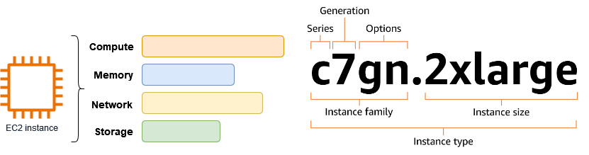

s
{ .sietecinco }
 

## **Introducción**

file:///C:/Users/titan/Documents/Javier128/Eclipse/AWS/Arqui%20y%20despliegues%20en%20AWS/Tema%203/Tema%203.%20NAT%20Gateway,%20reglas%20encadenadas%20y%20subredes%20privadas.pdf

## **Tarea 2:**
lo mismo con una subred privada.
Acceder por ssh a la instancia y comprobar su dirección ip privada. 
 
##
hablar de los nat para permitir a las ec2 de las subredes privadas poder acceder a inet sin tener ipv4 pública.

Cuando lanzas una instancia EC2 con acceso a Internet, AWS puede darle automáticamente una **IP pública dinámica**.

* Problema: si la instancia se detiene y vuelve a iniciarse, esa IP **cambia**.
* Solución: si necesitas una IP que no cambie (para DNS, aplicaciones críticas, accesos seguros, etc.), usas una **Elastic IP**.

---

## ⚙️ Funcionamiento básico

1. **Asignación**

   * Pides una IP elástica desde la consola de AWS (o vía CLI/API).
   * AWS te reserva una dirección IPv4 pública.

2. **Asociación**

   * La puedes asociar a:

     * Una **instancia EC2**.
     * Una **interfaz de red (ENI)**.
     * Un **NAT Gateway**.

3. **Reasignación**

   * Si tu instancia falla, puedes **reasignar la IP** a otra instancia en cuestión de segundos, sin necesidad de cambiar DNS o configuraciones externas.

---

## 💡 Características importantes

* **Gratis solo si está en uso**: AWS **no cobra** por una IP elástica que esté asociada a una instancia en ejecución.
  Pero si la reservas y no la usas, sí genera coste (para evitar desperdicio de direcciones IPv4).
* Son solo **IPv4**. En IPv6 no hacen falta porque las direcciones son abundantes y estables.
* Una cuenta AWS tiene un **límite predeterminado** de EIPs (normalmente 5 por región), aunque puedes pedir aumento.

---

## 🎯 Ejemplo práctico

Imagina que tienes una aplicación en una instancia EC2:

* Si solo usas la IP pública automática y la instancia se reinicia → **la IP cambia** → tus usuarios no podrán conectarse si la tenían guardada.
* Si usas una **Elastic IP** → la IP se mantiene siempre igual, aunque detengas, reinicies o reemplaces la máquina.

---

👉 En resumen:
Una **Elastic IP en AWS** es como tener una **dirección fija en Internet** para tus recursos, lo que te da **estabilidad y flexibilidad** en caso de fallos o cambios en la infraestructura.

https://www.youtube.com/watch?v=DSkO0ZJ8PxA

https://www.youtube.com/watch?v=lTUUJBa1dp4&list=PLDbrnXa6SAzV0J3Un9jRnbbFpuQH-_y-C&index=11

https://www.youtube.com/watch?v=iAYYssYrGms

https://www.youtube.com/watch?v=CGmTvukObOw

## **Enlaces de interés**
Documentación de [AWS](https://docs.aws.amazon.com).
Instancias [EC2](https://docs.aws.amazon.com/es_es/ec2/?icmpid=docs_homepage_featuredsvcs).
Tipos de instancias [EC2](https://aws.amazon.com/es/ec2/instance-types).
Controlar el tráfico hacia los recursos de AWS mediante [grupos de seguridad](https://docs.aws.amazon.com/es_es/vpc/latest/userguide/vpc-security-groups.html#security-group-basics).
[Grupos de seguridad de instancias EC2](https://docs.aws.amazon.com/es_es/AWSEC2/latest/UserGuide/ec2-security-groups.html).
Control del tráfico de la subred con [listas de control de acceso a la red](https://docs.aws.amazon.com/es_es/vpc/latest/userguide/vpc-network-acls.html)
Tipos y caracteristicas de [AMI en Amazon EC2](https://docs.aws.amazon.com/es_es/AWSEC2/latest/UserGuide/ComponentsAMIs.html)

