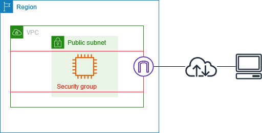

{ .sietecinco }
 

## **Introducción**
Uno de los servicios más utilizados de AWS es **Amazon EC2 (Elastic Compute Cloud)**, que permite lanzar y administrar **instancias**, es decir, **máquinas virtuales** que funcionan de manera similar a un ordenador físico.  

Estas instancias pueden configurarse con distintos sistemas operativos, hardware para adaptarse a las necesidades de cada proyecto (aplicación web, base de datos...).

Al igual que cualquier dispositivo, las instancias necesitan un mecanismo de control de tráfico para **garantizar su seguridad**. En este contexto aparecen los **grupos de seguridad** (Security Groups, SG). Un grupo de seguridad no es más que un firewall virtual, que supervisa (y restrinje) el tráfico entrante y saliente a las instancias.

En conjunto, las EC2 y los SG constituyen la base de la infraestructura en la nube: las instancias proporcionan la capacidad de cómputo, mientras que los grupos de seguridad ofrecen la primera línea de defensa para proteger los recursos desplegados.

## **Instancias EC2**
Como hemos dicho, una instancia EC2 es básicamente una computadora en la nube. Al igual que los equipos físicos se caracterizan por una serie de características como la potencia de computo, su RAM y otras que veremos a continuación.

**Nomenclatura de las instancias EC2**  
El nombre de la instancia define las especificaciones de la misma es decir, la familia, la generación, la capacidad adicional y el tamaño.

{.doscinco}

- **Familia**  
La familia define la optimización principal de la máquina, dicho en otras palabras, el uso preferente que debemos dar a esas máquinas.  
C → Compute Optimized. Para cargas de trabajo que requieren mucha CPU (alta relación CPU/memoria).  
M → General Purpose. Equilibrio entre CPU, memoria y almacenamiento. Usadas para la mayoría de aplicaciones estándar.  
R → Memory Optimized. Diseñadas para cargas de trabajo que requieren gran cantidad de memoria en relación con la CPU.  
I → Storage Optimized (I/O Optimized). Pensadas para cargas que requieren altísimo rendimiento en disco local (NVMe/SSD).   
G → **Graphics / GPU-based**. Para machine learning (basadas en GPU NVIDIA).  
P → **Accelerated Computing (GPU)**. Para entrenamiento de deep learning, computación científica, simulaciones de alto nivel.  
X → Extra Memory Optimized. Instancias con terabytes de RAM, usadas para grandes bases de datos o aplicaciones que requieren mucha memoria.  
 

- **Generación**  
Representan la evolución tecnológica de las instancias. Cada nueva generación trae mejor rendimiento, menor coste por hora y mejor eficiencia energética.  
Se identifican por el número que acompaña a la familia.  
👉 Ejemplo:  
      - t2.micro → 2ª generación de instancias de uso general.  
      - t3.micro → 3ª generación, más eficiente que t2.  
      - t4g.micro → 4ª generación, basada en procesadores ARM Graviton2 de AWS.  
   

- **Capacidad adicional**  
La capacidad adicional de EC2 se refiere a esas optimizaciones extra (almacenamiento, red, EBS, GPU, bare metal, etc.) que hacen que dos instancias de la misma familia y tamaño puedan comportarse de forma distinta.  
Las letras utilizadas en el nombre de instancia y las propiedades asociadas se explican en la tabla siguiente.  

       |Nombre |Propiedad|Ejemplo|
       |-|-|-|
       |a|Procesador AMD|m5a|
       |d|Almacenamiento SSD NVMe local|m5d|
       |e|Capacidad extra|P6e|
       |g|Procesador Graviton(ARM)|m6g|
       |n|Redes de alta velocidad|c5n|
       |z|Alta frecuencia de CPU|m5zn|
       |.metal|Bare metal|m8g.metal|
             
- **Tamaño de la instancia**
El **tamaño de una instancia de EC2 en AWS** se refiere a la combinación de recursos de hardware virtualizados (vCPU, memoria RAM, almacenamiento y capacidad de red) que se asignan a una máquina virtual. En otras palabras, define la **potencia y capacidad de cómputo** que tendrá la instancia dentro de la familia de instancias elegida.  
 
 

      **Tabla comparativa de tamaños de instancias:**  

      | Instancia   | vCPU | RAM (GB) | Almacenamiento (GB) | Red (Gbit/s) | Ancho de banda de EBS | Precio USD/h (% aumento) |
      |-------------|------|----------|----------------------|--------------|------------------------|--------------------------|
      | r5d.xlarge  | 4    | 32       | 1 x 150             | Hasta 10     | Hasta 4750             | 0.288                    |
      | r5d.2xlarge | 8    | 64       | 1 x 300             | Hasta 10     | Hasta 4750             | 0.576 (+100%)            |
      | r5d.4xlarge | 16   | 128      | 2 x 300             | Hasta 10     | 4750                   | 1.152 (+100%)            |
      | r5d.8xlarge | 32   | 256      | 2 x 600             | 10           | 6800                   | 2.304 (+100%)            |
 

## **AMI (Amazon Machine Image)**
Una AMI es una plantilla que contiene la información necesaria para lanzar una instancia de EC2. Es como si fuera la `imagen base` de una máquina virtual.

Cada AMI incluye:

* **Un sistema operativo** (Amazon Linux, Ubuntu, Windows Server, etc.).
* **Software preinstalado** (Apache, Nginx, MySQL, Docker, etc.).
* **Configuración de permisos** (qué usuarios pueden usar la AMI, no es posible hacerlo con las cuentas de ALB).
* **Configuración de volumen raíz** (el disco donde se instala el sistema).
* ...

Cuando se lanza una **instancia EC2**, se elige una AMI como punto de partida, y a partir de ahí la instancia puede configurarse, modificarse y **personalizarse**.

### **Tipos de AMI**

1. **AMIs públicas**

     * Disponibles en el catálogo de AWS.
     * Incluyen imágenes oficiales de Amazon (Amazon Linux, Windows, etc.) y distribuciones de Linux mantenidas por la comunidad o proveedores (Ubuntu, Debian, RHEL…).

2. **AMIs privadas**

     * Creadas por **un usuario**.
     * Solo accesibles para la cuenta propietaria (posibilidad de compartir).

3. **AMIs del AWS Marketplace**

     * Imágenes de terceros (generalmente de pago) con aplicaciones ya listas (WordPress, SAP, soluciones de seguridad, etc.).

### **Regiones y AMIs**

* Una AMI está **ligada a una región**.
* Si se necesita usarla en otra región, se debe **copiar**.

### **Crear una AMI**

Se pueden crear AMI's desde:

1. **Una instancia EC2 existente** → Tomar un snapshot y convertir en AMI.
2. **Un snapshot de EBS** → Luego convertir en AMI.
3. **Importar una VM** (desde VMware, VirtualBox o Hyper-V con la herramienta VM Import/Export).

## **Grupos de seguridad y ACL's**
### **Introducción**
Los **grupos de seguridad** y las **ACL de red y de VPC** son componentes fundamentales de la seguridad en un entorno de nube. Aunque funcionan de manera similar a los **firewalls**, no son exactamente lo mismo, ya que presentan diferencias en su uso y alcance.

Dentro del modelo de **nube pública**, el proveedor está obligado contractualmente a cumplir con su parte del modelo de **responsabilidad compartida**. Sin embargo, la configuración de los grupos de seguridad es **responsabilidad del cliente**.

Por defecto, al lanzar una instancia **EC2 en AWS**, la única regla permitida es la apertura del **puerto 22** para el **acceso SSH**.

Para garantizar el correcto despliegue de las aplicaciones, será necesario ampliar las reglas de los grupos de seguridad, asegurando siempre que estas configuraciones no comprometan la seguridad del entorno.

### **Grupos de seguridad**
En AWS, un grupo de seguridad es **un conjunto de reglas de firewall virtual** que controlan el **tráfico entrante y saliente** de una **instancia**.

Los grupos de seguridad se aplican a **nivel de instancia**, no a **nivel de subred** (esa función la cumplen las **ACL de red**).

Los grupos de seguridad son **con estado** (stateful): la entrada es igual a la salida. El tráfico que cumple **una regla en una dirección también se permitirá automáticamente en la dirección opuesta** sin tener una regla explícita para ello.

**Las reglas no tienen un orden de prioridad**. Las reglas de un grupo de seguridad no tienen prioridad ni orden. Todas se evalúan en conjunto y únicamente permiten tráfico. Si no existe una regla que lo permita, el tráfico se deniega por defecto.

**Ejemplo de SG**  
En el siguiente ejemplo tenemos una VPC, una subred con **una instancia EC2**, una puerta de enlace de Internet y **un grupo de seguridad**.  
Como hemos dicho **el grupo de seguridad se asigna a la instancia** y actúa como un firewall virtual.  
El único tráfico que llega a la instancia es el permitido por las reglas del grupo de seguridad. 
{.original}

### ACL de red
Las **Network ACL (NACL)** son un componente de seguridad que actúa a nivel de **subred** dentro de una **VPC**.

**Se aplican a nivel de subred**: Todas las instancias dentro de esa subred quedan sujetas a las reglas de la ACL.

Cada **VPC** en AWS tiene **una ACL por defecto**, y se pueden crear ACLs personalizadas para afinar el control del tráfico.

**Son sin estado** (stateless): No recuerdan el estado de la conexión. Por ejemplo, si se permite el tráfico entrante en un puerto, **también se debe** permitir explícitamente el tráfico de salida de respuesta.

**Soportan reglas de entrada y salida**:    

   * Reglas de entrada → Controlan tráfico **entrante a la subred**.
   * Reglas de salida → Controlan tráfico **saliente desde la subred**.

**Orden numérico de las reglas**

   * Cada regla tiene un número (del 1 al 32766).
   * Se evalúan en **orden ascendente** → la primera regla que coincida se aplica, y se ignoran las siguientes.

**Acciones posibles**

   * `ALLOW`: Permitir tráfico.
   * `DENY`: Bloquear tráfico.

**ACL por defecto**

   * La **ACL por defecto** de una VPC permite todo el tráfico entrante y saliente.
   * Las **ACL personalizadas** niegan todo el tráfico hasta que se configuren reglas.

**Ejemplo de ACL** 
En el siguiente ejemplo, tenemos una VPC con dos subredes. Cada **subred tiene una ACL de red**. Cuando el tráfico entra en la VPC, el enrutador envía el tráfico a su destino.  
La ACL de red A determina qué tráfico destinado a la subred 1 puede entrar en la subred 1, y qué tráfico destinado a una ubicación fuera de la subred 1 puede salir de la subred 1.  
Del mismo modo, la ACL de red B determina qué tráfico puede entrar y salir de la subred 2.
{.original}

 
### Tabla comparativa entre SG y ACL
| Característica                 | **Security Groups (SG)**                                                                                 | **Network ACLs (NACL)**                                                                               |
| ------------------------------ | -------------------------------------------------------------------------------------------------------- | ----------------------------------------------------------------------------------------------------- |
| **Naturaleza**                 | *Stateful* (tienen “efecto memoria”)                                                                     | *Stateless* (no recuerdan conexiones)                                                                 |
| **Nivel de aplicación**        | Asociados a **instancias EC2** (interfaz de red)                                                         | Asociados a **subredes**                                                                              |
| **Reglas de entrada y salida** | Reglas de entrada y salida se procesan **por separado**, pero las respuestas se permiten automáticamente | Se deben definir reglas para entrada **y** salida; si no, el tráfico será bloqueado                   |
| **Orden de evaluación**        | No tienen orden; se procesan todas las reglas                                                            | Se procesan en orden ascendente por número de regla (más bajo = mayor prioridad)                      |
| **Acciones**                   | Solo permiten **Allow** (permitir tráfico)                                                               | Admiten **Allow** y **Deny** (puedes denegar explícitamente)                                          |
| **Predeterminado**             | Todo el tráfico está **denegado por defecto** (excepto lo que se permita explícitamente)                 | Todo el tráfico está **permitido por defecto** (excepto lo que se niegue explícitamente)              |
| **Casos de uso típicos**       | Control fino del tráfico a instancias (ej. abrir 22/SSH o 443/HTTPS)                                     | Control global a nivel de subred, aplicar restricciones más amplias (ej. denegar rangos IP completos) |

## **Tarea 1:**
Realizar el siguiente escenario y poblar las reglas del grupo de seguridad.
Acceder por ssh a la instancia y comprobar su dirección ip privada. 

{ .sietecinco }

## **Tarea 2:**
lo mismo con una subred privada.
Acceder por ssh a la instancia y comprobar su dirección ip privada. 
 
##
hablar de los nat para permitir a las ec2 de las subredes privadas poder acceder a inet sin tener ipv4 pública.

Cuando lanzas una instancia EC2 con acceso a Internet, AWS puede darle automáticamente una **IP pública dinámica**.

* Problema: si la instancia se detiene y vuelve a iniciarse, esa IP **cambia**.
* Solución: si necesitas una IP que no cambie (para DNS, aplicaciones críticas, accesos seguros, etc.), usas una **Elastic IP**.

---

## ⚙️ Funcionamiento básico

1. **Asignación**

   * Pides una IP elástica desde la consola de AWS (o vía CLI/API).
   * AWS te reserva una dirección IPv4 pública.

2. **Asociación**

   * La puedes asociar a:

     * Una **instancia EC2**.
     * Una **interfaz de red (ENI)**.
     * Un **NAT Gateway**.

3. **Reasignación**

   * Si tu instancia falla, puedes **reasignar la IP** a otra instancia en cuestión de segundos, sin necesidad de cambiar DNS o configuraciones externas.

---

## 💡 Características importantes

* **Gratis solo si está en uso**: AWS **no cobra** por una IP elástica que esté asociada a una instancia en ejecución.
  Pero si la reservas y no la usas, sí genera coste (para evitar desperdicio de direcciones IPv4).
* Son solo **IPv4**. En IPv6 no hacen falta porque las direcciones son abundantes y estables.
* Una cuenta AWS tiene un **límite predeterminado** de EIPs (normalmente 5 por región), aunque puedes pedir aumento.

---

## 🎯 Ejemplo práctico

Imagina que tienes una aplicación en una instancia EC2:

* Si solo usas la IP pública automática y la instancia se reinicia → **la IP cambia** → tus usuarios no podrán conectarse si la tenían guardada.
* Si usas una **Elastic IP** → la IP se mantiene siempre igual, aunque detengas, reinicies o reemplaces la máquina.

---

👉 En resumen:
Una **Elastic IP en AWS** es como tener una **dirección fija en Internet** para tus recursos, lo que te da **estabilidad y flexibilidad** en caso de fallos o cambios en la infraestructura.

https://www.youtube.com/watch?v=DSkO0ZJ8PxA

https://www.youtube.com/watch?v=lTUUJBa1dp4&list=PLDbrnXa6SAzV0J3Un9jRnbbFpuQH-_y-C&index=11

https://www.youtube.com/watch?v=iAYYssYrGms

https://www.youtube.com/watch?v=CGmTvukObOw

## **Enlaces de interés**
Documentación de [AWS](https://docs.aws.amazon.com).
Instancias [EC2](https://docs.aws.amazon.com/es_es/ec2/?icmpid=docs_homepage_featuredsvcs).
Tipos de instancias [EC2](https://aws.amazon.com/es/ec2/instance-types).
Controlar el tráfico hacia los recursos de AWS mediante [grupos de seguridad](https://docs.aws.amazon.com/es_es/vpc/latest/userguide/vpc-security-groups.html#security-group-basics).
[Grupos de seguridad de instancias EC2](https://docs.aws.amazon.com/es_es/AWSEC2/latest/UserGuide/ec2-security-groups.html).
Control del tráfico de la subred con [listas de control de acceso a la red](https://docs.aws.amazon.com/es_es/vpc/latest/userguide/vpc-network-acls.html)
Tipos y caracteristicas de [AMI en Amazon EC2](https://docs.aws.amazon.com/es_es/AWSEC2/latest/UserGuide/ComponentsAMIs.html)

