# **UT. 7 - Dockers y Cloud Formation**
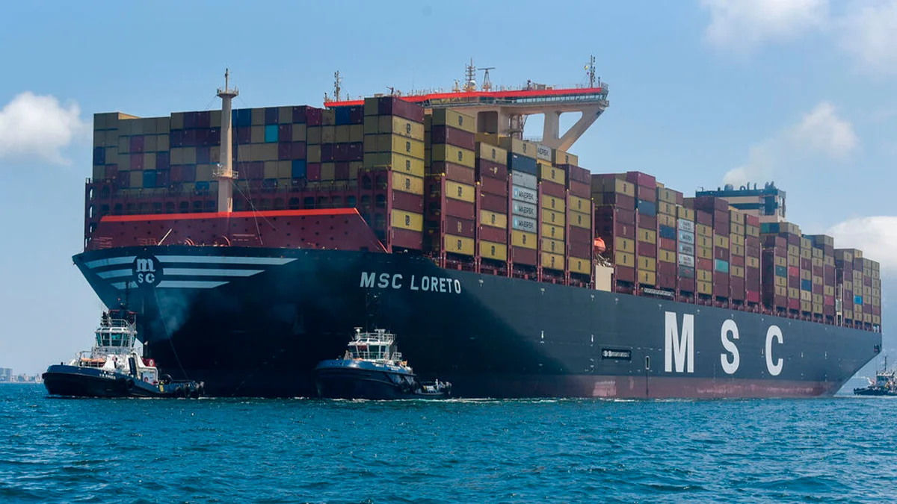{ .trescinco }
<br>

**Resultados de aprendizaje y criterios de evaluacion que se evaluarán en esta unidad.**  

| **Resultados de aprendizaje de la unidad didáctica:** |
|-|
| **RA. 4:** Gestiona servicios de almacenamiento y bases de datos en la nube, seleccionando tecnologías adecuadas para casos específicos, y diseña arquitecturas escalables y resilientes utilizando herramientas de monitoreo y optimización para mejorar el rendimiento.|

|**Criterios de evaluación de la unidad didáctica:**|
|-|
|**d)** Se ha diseñado arquitecturas escalables y resilientes basadas en las mejores prácticas.|
|**e)** Se ha hecho uso de herramientas de monitoreo y recomendaciones de optimización.|

## **1 - Docker**
### **1.1 - Introducción**
Docker es una plataforma que permite crear, empaquetar y ejecutar aplicaciones dentro de **contenedores**.  
**Un contenedor** es un entorno aislado que contiene todo lo necesario para ejecutar una aplicación: código, librerías, configuraciones y dependencias.

### **1.2 - ¿Cómo Funciona Docker?**
Docker funciona mediante **imágenes**, **contenedores** y **mecanismos de aislamiento a nivel de sistema operativo** gestionados por el motor de ejecución **Docker engine**.

### **1.3 - Conceptos clave de docker**
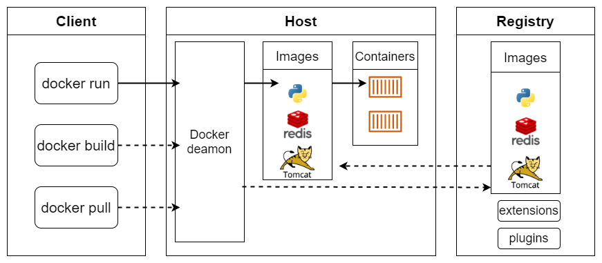{ .sietecinco }

- **Docker Engine**  
Docker Engine es el motor de contenedores de Docker. Utiliza funciones del sistema operativo (especialmente del kernel de Linux) para crear entornos aislados llamados contenedores.
    - **Docker Engine está compuesto por:**
        - Docker Daemon (dockerd)
        - Docker CLI
        - API REST de Docker  

    - **Sus funciones principales son:**  
        - Construir imágenes
        - Ejecutar y supervisar contenedores
        - Gestionar redes, volúmenes y almacenamiento
        - Descargar imágenes desde registros (Docker Hub, **AWS ECR**, etc.)


- **Imagen:**  

    - **La imagen** es **una plantilla de solo lectura** que se utiliza para **crear contenedores**. A partir de una imagen pueden crearse **múltiples contenedores**.
    - Las imágenes, además de tener su sistema de ficheros predefinido, tienen una serie de parámetros predefinidos (comandos, de variables de entorno, etc.) con valores por defecto y que se pueden personalizar en el momento de crear el contenedor.
    - **Docker Engine** permite crear nuevas imágenes basándose en imágenes existentes, normalmente mediante un **Dockerfile**.
    - **Una imagen** está formada por **capas** (layers). Al construir **una nueva imagen**, Docker reutiliza las capas de la imagen original y añade **únicamente las capas modificadas**.  
<br>

- **Contenedor (container)**:  
Un contenedor es un paquete ejecutable independiente que incluye todo lo necesario para ejecutar una aplicación: código, tiempo de ejecución, herramientas del sistema, librerías y configuración. Los contenedores comparten el kernel del sistema anfitrión, lo que los hace ligeros y eficientes.  

    - Son instancias ejecutables de una imagen.  
    - Pueden ser creados, arrancados, detenidos, reiniciados y eliminados.
    - Cada contenedor Docker posee un identificador único (ID) de 64 caracteres (normalmente se utiliza la versión corta de 12 caracteres).
    - Los comandos de Docker aceptan tanto el ID completo como el reducido.
    - Es posible referirse a un contenedor usando solo los primeros caracteres de su ID, siempre que dicho prefijo sea único.  
<br>

- **Dockerfile:**  
Un Dockerfile es un archivo de texto que contiene instrucciones para construir una imagen Docker, incluyendo la imagen base, los paquetes necesarios y la configuración del entorno.  
<br>

- **Registro (registry):**  
Las imágenes Docker se almacenan en registros, que actúan como repositorios de imágenes de contenedores. Docker Hub es el registro público más conocido, aunque las organizaciones suelen emplear registros privados como **AWS ECR**.  
<br>

- **Contenerización:**  
El proceso de empaquetar una aplicación y todas sus dependencias en un contenedor se conoce como contenerización. Gracias a ello, los contenedores pueden ejecutarse de forma uniforme en cualquier sistema que disponga de Docker.

### **1.4 - Kubernetes**
Kubernetes es un sistema que gestiona clusters de servidores y se encarga de ejecutar contenedores (normalmente Docker o cualquier imagen compatible con el estándar OCI) de forma:

- Distribuida
- Resiliente
- Escalable
- Automatizada

Fue desarrollado por Google basándose en más de 10 años de experiencia gestionando contenedores internamente (Borg), y actualmente lo mantiene la Cloud Native Computing Foundation (CNCF).  

<br>

#### **1.4.1 - ¿Para qué sirve Kubernetes?**
Kubernetes ayuda a:

- Ejecutar aplicaciones distribuidas en muchos contenedores.
- Escalar de forma automática cuando aumenta la carga.
- Reiniciar contenedores si fallan.
- Distribuir la carga entre múltiples nodos.
- Actualizar versiones de la aplicación sin interrupciones (rolling updates).
- Programar contenedores en nodos disponibles.
- Gestionar redes y almacenamiento persistente para contenedores.

Es decir, permite ejecutar aplicaciones complejas en producción sin preocuparte de la infraestructura paso a paso.

<br>

#### **1.4.2 - Conceptos básicos de Kubernetes**
Lista de los recursos más importantes dentro de un cluster:

1. **Nodo (Node)**  
Máquina física o virtual donde Kubernetes ejecuta contenedores.  
Puede ser:

    - Master node → gestiona el cluster
    - Worker node → ejecuta las aplicaciones

2. **Pod**  
Es la unidad mínima en Kubernetes.  
Un Pod puede contener uno o varios contenedores que funcionan como una unidad.

3. **Deployment**  
Define:
    - Cuántos Pods se necesitan
    - cómo se actualizan
    - cómo se mantienen en ejecución
    - Kubernetes garantiza que el estado deseado coincida con el estado real.

4. **Service**

    - Abstracción de red:
    - Permite que los Pods sean accesibles dentro o fuera del cluster.

Tipos comunes:

- ClusterIP (interno)
- NodePort
- LoadBalancer (externo, usado en nubes como AWS)

5. **Namespace**
Sirve para organizar recursos dentro del cluster (útil en empresas con varios equipos/proyectos).

6. **Volúmenes (Volumes)**
Permiten persistir datos incluso cuando los Pods mueren y se recrean.
---

## **2 - ¿Cómo desplegar contenedores en AWS?**

AWS proporciona varias herramientas para trabajar con contenedores que permiten:
- Almacenar imágenes de contenedores.
- Orquestar y escalar aplicaciones.
- Ejecutar contenedores con o sin gestión directa de servidores, según el servicio utilizado.

En el caso de **Amazon ECS (Elastic Container Service)**, el proceso general de despliegue es el siguiente:

!!! warning "Pasos generales para desplegar un contenedor en AWS (ECS)"
    - Crear la imagen del contenedor (Dockerfile y build de la imagen).
    - Subir la imagen a un repositorio de AWS (Amazon ECR).
    - Definir la **Task Definition**, donde se especifica cómo debe ejecutarse el contenedor (imagen, CPU, memoria, puertos, variables de entorno, etc.).
    - Preparar la infraestructura de red (VPC, subredes y grupos de seguridad), si no se utiliza la VPC por defecto.
    - Crear un **clúster ECS**, que actúa como contenedor lógico de los recursos de ejecución.
    - Crear un **servicio ECS**, encargado de lanzar y mantener las tareas en ejecución, así como de su escalado y disponibilidad.


### **2.1 - Amazon ECR (Elastic Container Registry)**
Amazon ECR es un registro de contenedores donde almacenar las imágenes Docker.

**Funciones principales:**

- Almacenar imágenes Docker a nivel empresarial.
- Integración nativa con ECS, EKS, Lambda y CodePipeline.
- Control de acceso mediante IAM.
- Alta disponibilidad y cifrado en reposo.

ECR es el punto de partida para desplegar contenedores en AWS, ya que las imágenes deben estar accesibles desde los servicios que las ejecutan.

### **2.2 - Amazon ECS (Elastic Container Service)**
Amazon ECS es la plataforma de orquestación de contenedores de AWS. Permite ejecutar contenedores Docker en dos modos: **EC2** y **Fargate**.

#### **2.2.1 - ECS sobre EC2**
- Los contenedores se ejecutan en instancias EC2 administradas (parcial o totalmente) por el usuario.
- El usuario decide el tamaño, tipo y cantidad de máquinas.
- Dependiendo de la opción elegida, puede requerir aplicar parches, gestionar capacidad y asegurar servidores.

#### **2.2.2 - ECS con Fargate**
- Es un servicio **serverless**: no requiere gestionar máquinas.
- Ejecuta contenedores sin preocuparte por **servidores ni escalado**.
- Pago por uso de cada contenedor.
- Ideal para aplicaciones basadas en microservicios o arquitecturas distribuidas.

### **2.3 - Amazon EKS (Elastic Kubernetes Service)**
Amazon EKS permite desplegar contenedores utilizando Kubernetes, el estándar de orquestación más extendido.

- AWS gestiona el control plane.
- El usuario gestiona los nodos (EC2) o Fargate como backend.
- Total compatibilidad con imágenes Docker o de cualquier estándar OCI.
- Es ideal si se necesita mantener compatibilidad con Kubernetes o en un entorno multi-cloud.

### **2.4 - AWS Lambda**
AWS Lambda permite empaquetar funciones en imágenes Docker de hasta 10 GB.

Esto ofrece ventajas como:

- Usar dependencias complejas no soportadas en Lambda tradicional.
- Migrar aplicaciones que ya se ejecutan en contenedores.
- Unificar pipelines de CI/CD basados en Docker.
- Lambda ejecuta el contenedor como una función serverless, sin servidores.

### **2.5 - AWS App Runner**
AWS App Runner es un servicio de alto nivel para desplegar aplicaciones web y APIs directamente desde:  

- Un repositorio de código
- Una imagen Docker en ECR

Es ideal para desarrolladores que quieren centrarse en el código y dejar toda la infraestructura a AWS.

---

## **3 - ECR**
Cuando se desarrollan aplicaciones con Docker, resulta imprescindible disponer de un repositorio adecuado para almacenar las imágenes generadas.  **Docker Hub** resulta ser una opción idónea para la distribución de **imágenes públicas** pero, el **código propietario** requiere un entorno privado, seguro y con alta disponibilidad. Para este último caso, AWS propone **Amazon Elastic Container Registry (ECR)**.  

ECR es el servicio de registro de contenedores Docker totalmente gestionado por AWS, diseñado para integrarse con otros servicios, como ECS, EKS y Fargate. Este servicio asume la gestión de funciones esenciales, entre ellas el análisis de vulnerabilidades, el control de acceso, el cifrado y la aplicación de políticas de ciclo de vida, todo ello accesible a través de una API.

### **3.1 - Creación de un repositorio privado ECR**
#### **3.1.1 - Acceder a ECR** 
Primero accederemos al servicio tecleando ECR en la barra de búsqueda.

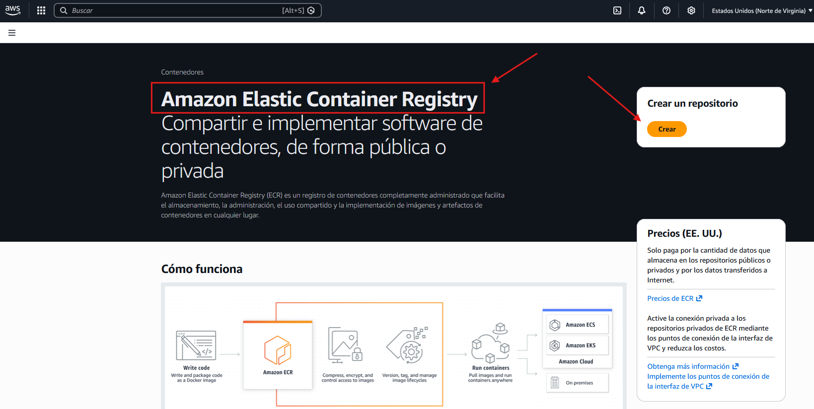{ .sietecinco .marco }  

<br>

#### **3.1.2 - Crear repositorio** 
Creamos nuestro repositorio privado. Indicamos la ruta y en configuración de las etiquetas de imagen seleccionamos immutable.   

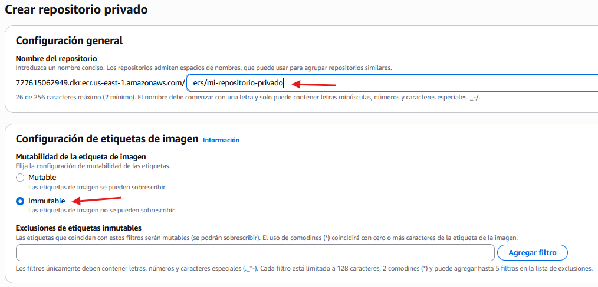{ .sietecinco .marco }

Motivos por los cuales se recomienda seleccionar immutable:

- Evita sobrescrituras accidentales o malintencionadas:  
Una vez publicada una imagen con una etiqueta (v1.0.0, latest...), ya no puede ser reemplazada por otra imagen posterior.

- Garantiza la trazabilidad de versiones  
La inmutabilidad asegura que cada etiqueta corresponde siempre a la misma imagen.

- Mejora la seguridad y aporta estabilidad a los despliegues
Si las etiquetas cambian su contenido, se pueden generar despliegues impredecibles. La inmutabilidad contribuye a que cada despliegue sea reproducible y consistente.

<br>

#### **3.1.3 - Descargar una imagen** 
Para el caso, descargaremos **el servidor web nginx**.

Desde la CLI de AWS hacemos pull sobre la imagen de nginx:

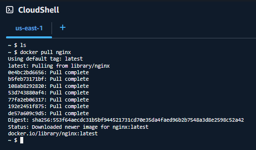{ .cincozero }

**Nota:**  
Si no especificamos ninguna etiqueta, Docker asume automáticamente **latest**. Cualquier versión distinta debe indicarse de forma explícita con el formato **imagen:tag**.  
Por ejemplo, si queremos descargar una imagen especifica de `nginx`, simplemente especificaremos la versión o su nombre.
```bash
docker pull nginx:1.25.3
```

```bash
docker pull nginx:alpine
```

<br>

#### **3.1.4 - Subir la imagen al repositorio** 
Para ello deberemos consultar los comandos de envío en nuestro repositorio → imágenes → ver comandos de envío.  

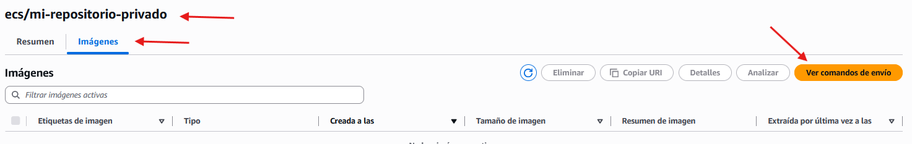{ .nuevezero .marco }

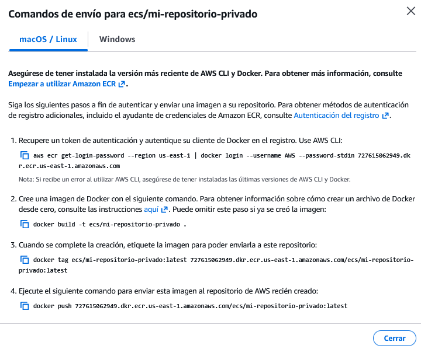{ .seiszero .marco }

<br>
Copiamos la primera línea de comando. Al ejecutar el comando desde la CLI de la interfaz de AWS, no debemos modificar nada.  
Al ya disponer de la imagen, tampoco es necesario ejecutar el segundo comando. 

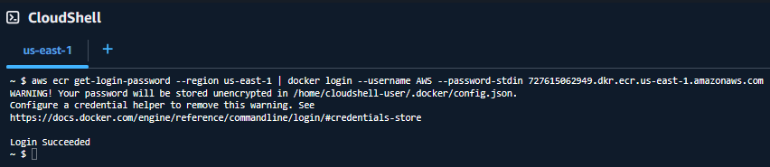{ .ochocinco }

<br>
Ejecutamos el comando 3 con el que etiquetaremos la imagen que subiremos al repositorio.  
Cambiaremos el nombre de la imagen así como la versión para poder modificarla.  

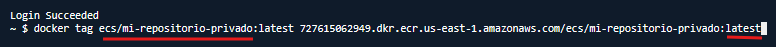{ .ochocinco }

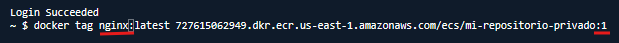{ .ochocinco }

<br>
Finalmente, subimos la imagen.   

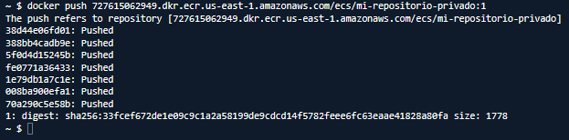{ .ochocinco }

<br>
Si todo ha ido bien, la imagen aparecerá disponible en nuestro repositorio.

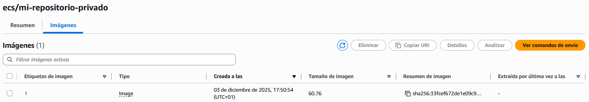{ .cien .marco }  

<br>

## **4 - ECS**
### **4.1 - Introducción**
Amazon ECS (Elastic Container Service) es el servicio de AWS para ejecutar y orquestar contenedores Docker de forma gestionada.

ECS permite desplegar aplicaciones en contenedores sin necesidad de administrar directamente servidores, encargándose de tareas como el arranque, supervisión, escalado y recuperación de los contenedores.

Las aplicaciones se ejecutan dentro de **clusters**, utilizando **infraestructura EC2** (con mayor control) o **Fargate (modelo serverless)**. 

### **4.2 - Acceder a ECS**
Nos dirigimos a **ECS** pero primero deberemos crear **un clúster**.  
En Amazon ECS (Elastic Container Service), **un cluster** es el **contenedor lógico** donde AWS agrupa y gestiona **los recursos de cómputo** que van a ejecutar contenedores Docker.

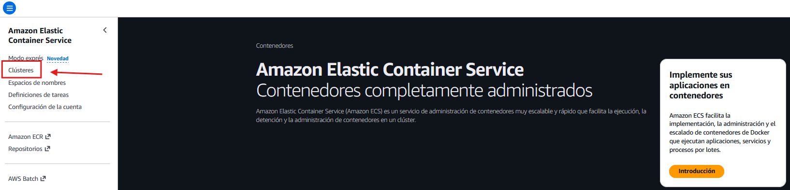{ .nuevezero .marco }

### **4.3 - Crear un clúster**
Creamos nuestro clúster usando la opción **Solo Fargate**, que suele ser la más flexible para la mayoría de los servicios.

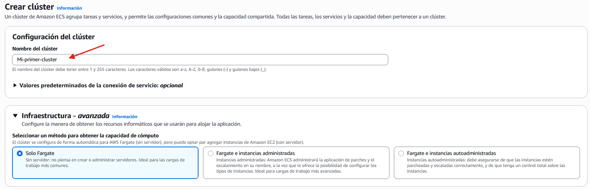{ .nuevezero .marco }

A los pocos instantes tendremos nuestro cluster disponible.

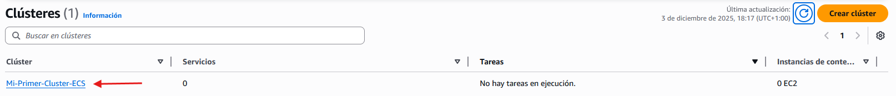{ .nuevezero .marco }

### **4.4 - Crear una tarea**

Una **tarea (Task)** es la **ejecución en tiempo real** de una **definición de tarea (Task Definition)**, que actúa como plantilla.

La definición de tarea especifica:

- La imagen del contenedor a ejecutar.
- Los recursos asignados (CPU y memoria).
- Los puertos, variables de entorno y otros parámetros.

Cuando una tarea se lanza:

- Se ejecuta en un **clúster ECS**.
- Pone en funcionamiento **uno o varios contenedores** según lo definido.
- Permite ejecutar aplicaciones como **microservicios**, **aplicaciones web** o procesos puntuales.

Una tarea puede ejecutarse:

- De forma **puntual** (por ejemplo, una tarea batch).
- O ser gestionada por un **servicio ECS**, que se encarga de mantenerla activa y escalada.


!!! tip "Crear una nueva definición de tarea"
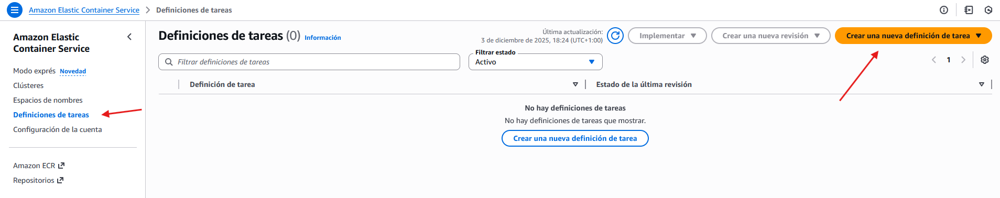{ .nuevezero .marco }

Bajamos:

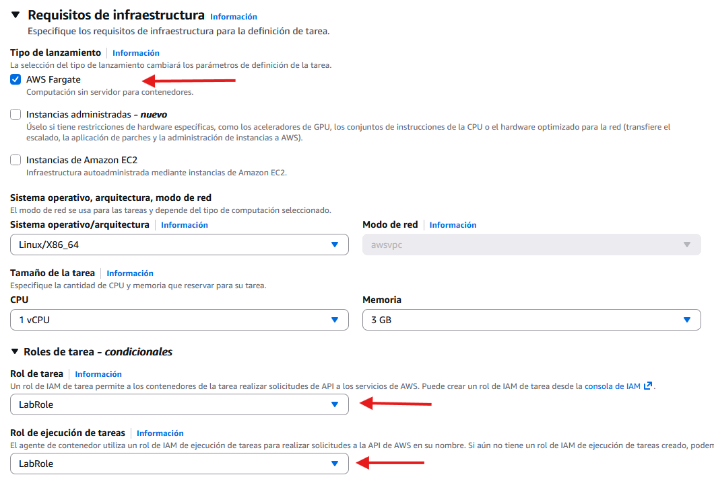{ .nuevezero .marco }

Bajamos: Tendremos que buscar la imagen que hemos subido a nuestro repositorio.

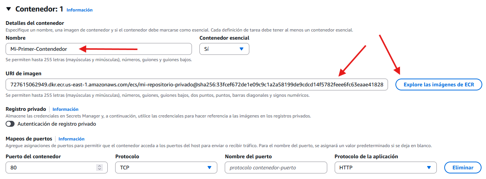{ .nuevezero .marco }

### **4.5 - Desplegar un servicio nuevo**
Para ello creamos un servicio nuevo.
Vamos a Clústeres → Servicios → Crear  

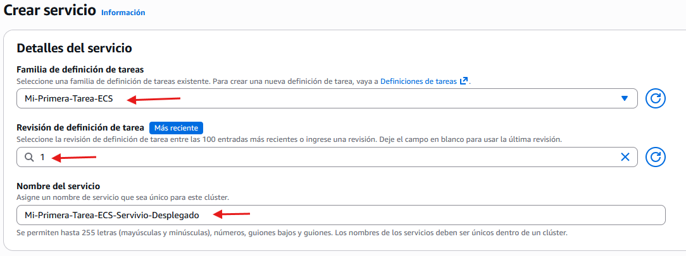{ .nuevezero .marco }

Seleccionamos la VPC sobre la cual se desplegará el servicio.

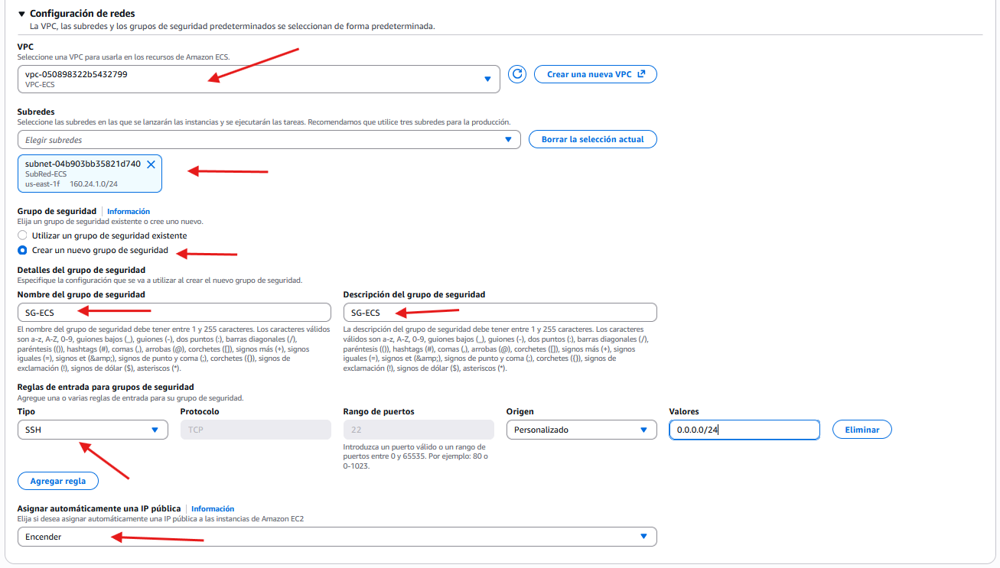{ .nuevezero .marco }

Al cabo de varios minutos ya tendremos nuestro servicio desplegado.

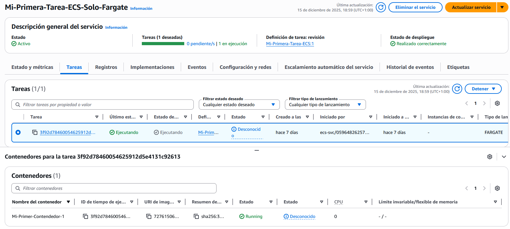{ .nuevezero .marco }


### **4.6 - Comprobación del grupo de seguridad**
Si el servicio se ha levantado correctamente **pero** no es posible acceder a él, posiblemente hay **un problema de configuración del grupo de seguridad de la tarea**.

!!! tip "Acceder al grupo de la seguridad de la tarea"

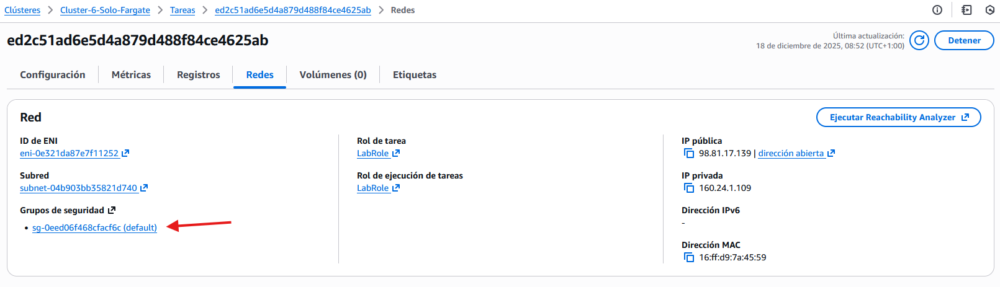{ .original .marco  }

!!! tip "Comprobar que los puertos necesarios al servicio están abiertos"

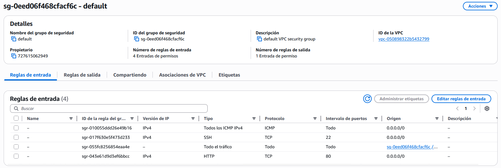{ .original .marco   }

### **4.7 - Comprobación del servicio**
Si vamos a Clústeres → Tareas → Nuestra tarea → Redes podremos acceder al servicio por la IP pública.   

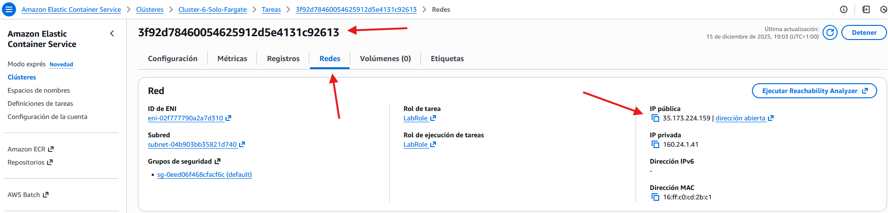{ .nuevezero .marco }

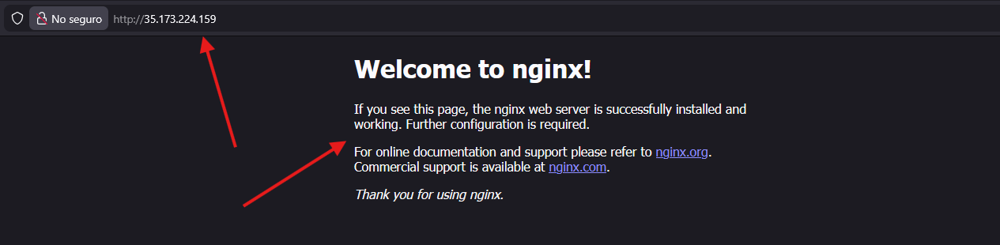{ .nuevezero   }

### **4.8 - Tarea RA4-CEd**
!!! warning "Tarea"
    1. Montar el ejemplo anterior.
    1. Realizar capturas de la imagen subida al repositorio.
    1. Realizar capturas del cluster y del servicio.
    1. Realizar capturas del cluster y de la tarea.
    1. Realizar capturas de los detalles de la tarea.
    1. Realizar capturas del servicio levantado.
    1. Adjuntar las capturas a un documento, y comentar brevemente cada captura.
    1. Subir el documento a AULES en la tarea correspondiente. 

### **4.9 – Creación de una nueva revisión de la definición de tarea**
En este apartado se creará una **nueva revisión de la definición de tarea**, utilizando una versión modificada del contenedor **nginx** empleado anteriormente.

Para ello, se partirá de un **Dockerfile actualizado**, se generará una nueva imagen del contenedor y se publicará en el repositorio correspondiente. A continuación, se registrará una nueva revisión de la Task Definition que referencie dicha imagen, la cual podrá utilizarse para lanzar una nueva tarea o actualizar un servicio existente.

#### **4.9.1 - Crear y subir el Dockerfile**
Para crear el Dockerfile usaremos un archivo index.html específico y subiremos los archivos a la consola de AWS.  

**Ejemplo de Dockerfile**
```bash
FROM nginx:latest

COPY index.html /usr/share/nginx/html
```

**Resultado después de subir el Dockerfile y el index.html a AWS**

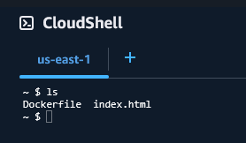{ .original   }

#### **4.9.2 - Subir la imagen a ECR**

!!! tip "Obtener un token de autenticación"
    Para ello vamos **ECR → Registro privado → Repositorios → Imágenes → Ver comandos de envío** y ejecutamos la primera linea de comando.

!!! tip "Crear la imagen"
    Ejecutamos la segunda línea de comando.  

    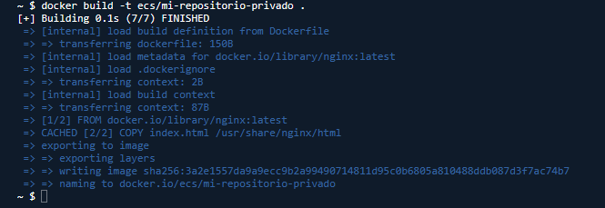{ .original   }

!!! tip "Etiquetar la imagen y subir la imagen al ECR"
    Cambiamos la etiqueta de la imagen que hemos creado.

    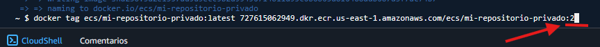{ .original   }
    
    Subimos la imagen a nuestro repositorio. 

    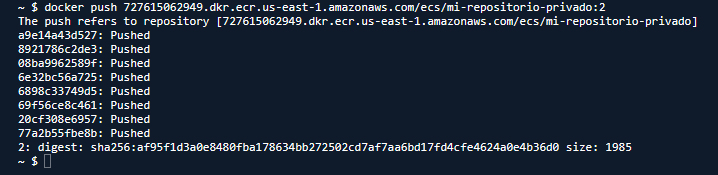{ .original   }

**Nota IMPORTANTE**  
Es posible que no sea posible subir más de una imagen al repositorio por limitaciones del **labrole**.  
Para seguir con la práctica, **borrar la imagen anterior**.

ECR con la nueva imagen subida.  

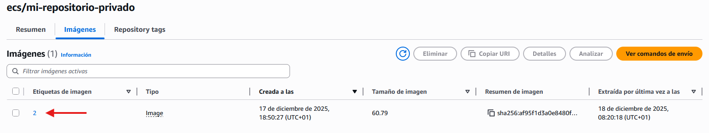{ .nuevezero .marco   }

---

#### **4.9.2 - Crear una revisión de nuestra tarea**

Accedemos a ECS → Definiciones de tareas y creamos una nueva revisión de nuestra definición de tarea.

En ECS, cualquier modificación de una definición genera automáticamente una nueva revisión. 
El servicio no se ve afectado hasta que se actualiza para utilizar dicha revisión.

Una vez actualizamos el servicio, ECS reemplaza progresivamente las tareas que usan la revisión anterior por las nuevas, según la estrategia de despliegue configurada.

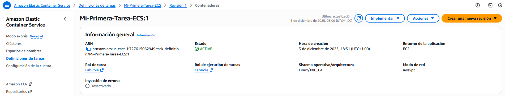{ .nuevezero .marco   }

<br>

Una vez hemos pinchado en el enlace, revisamos que las opciones son las correctas:  

- Tipo de infraestructura (Fargate)

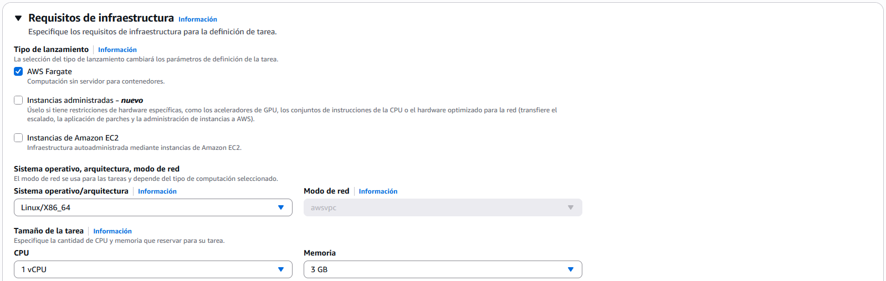{ .nuevezero .marco   }

- Imagen utilizada para la revisión  

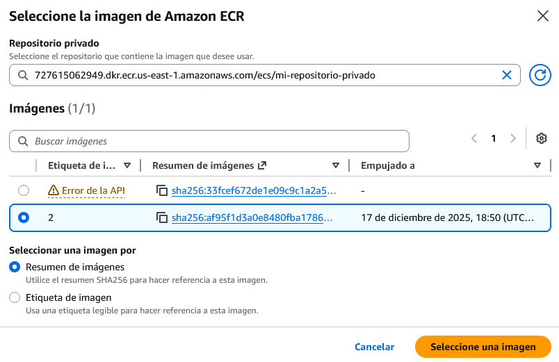{ .seiscinco .marco   }

- Revisión creada

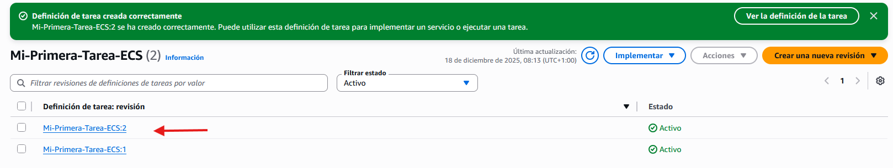{ .nuevezero .marco   }

---

#### **4.9.3 - Actualizar el servicio**

- Actualizaremos el servicio para que use la nueva revisión de nuestra tarea.

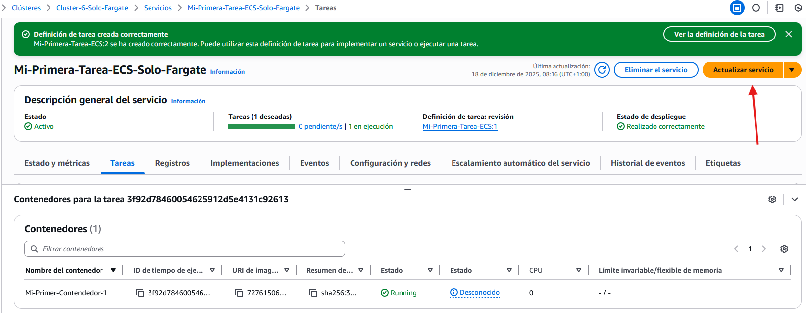{ .nuevezero .marco   }

- Seleccionamos la nueva definición de tarea.

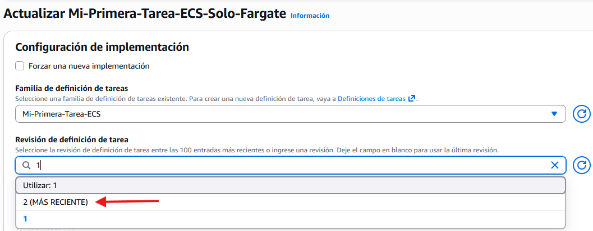{ .nuevezero .marco   }

---

#### **4.9.4 - Comprobar el estado de las tareas**
Si vamos a **cluster → Tareas** veremos como la nueva tarea se va creando y una vez levantada, la anterior tarea se detiene. 

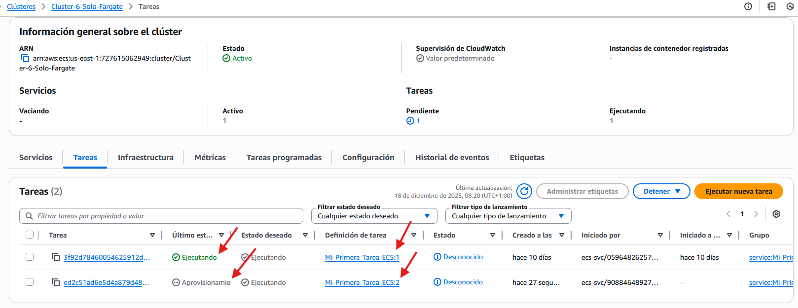{ .nuevezero .marco   }

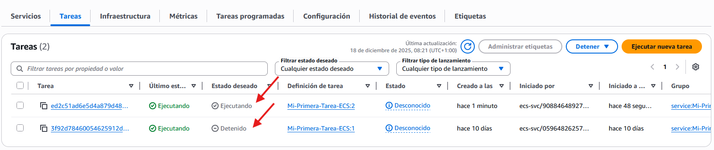{ .nuevezero .marco   }

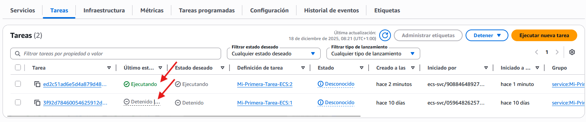{ .nuevezero .marco   }  

---

#### **4.9.5 - Estado del servicio**
Una vez que el servicion está levantado, vamos **Redes**, recuperamos la IP del contenedor y comprobamos el resultado.  

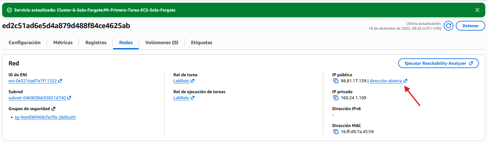{ .nuevezero .marco   }

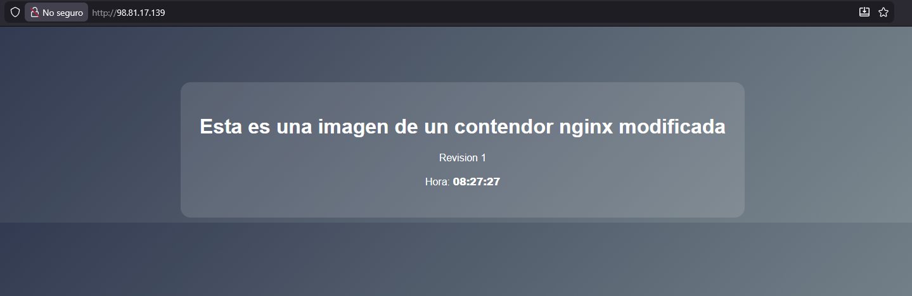{ .nuevezero   }

---

#### **4.9.6 - Registros del contenedor**
En la pestaña **Registros** podremos supervisar todo el tráfico de red desde y hacia nuestro contenedor. 

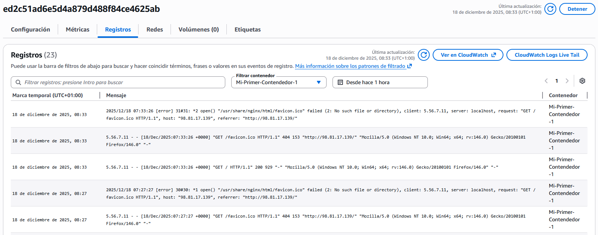{ .original   }

---

#### **4.9.7 - Pilas**
Como podemos ver el despliegue del servicio ha generado una **pila (stack)** que veremos en el siguiente capítulo.

Una pila de **CloudFormation** es una unidad lógica de despliegue que agrupa un conjunto de recursos de AWS (EC2, VPC, subredes, IAM, RDS, etc.) que se crean, actualizan y eliminan conjuntamente a partir de **una plantilla (template)** de CloudFormation.

Dicho de otra manera: una pila es **la instanciación de una plantilla de CloudFormation**.

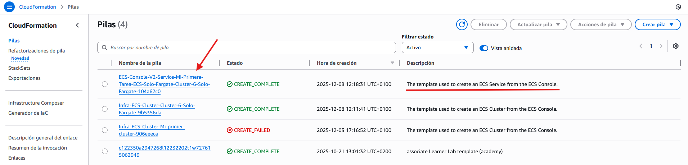{ .original .marco   }<br>

- Si eliminamos la pila, **eliminaremos el servicio**.

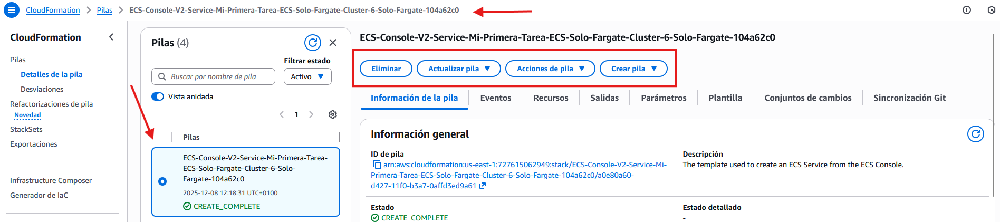{ .original .marco  }<br>

- El archivo de la plantilla con la que se ha creado la pila, puede cargarse y descargarse y tiene 2 formatos: **YAML o JSON** 

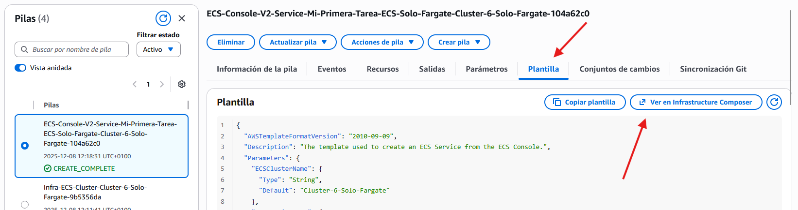{ .original .marco  }<br>

- JSON

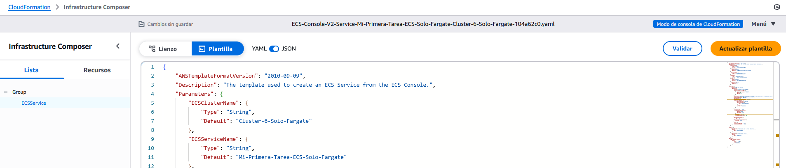{ .original .marco  }<br>  

- YAML

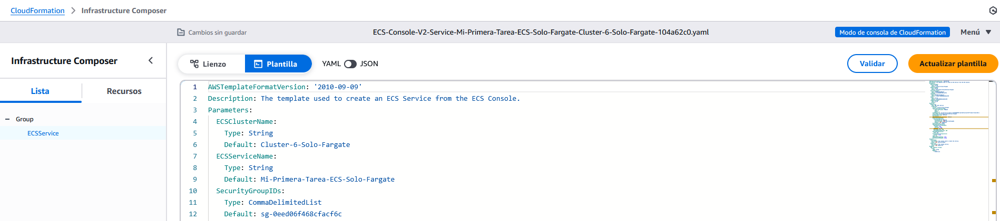{ .original .marco  }<br>  

- También se puede crear una plantilla nueva o modificar una existente con **Infraestructure Composer**

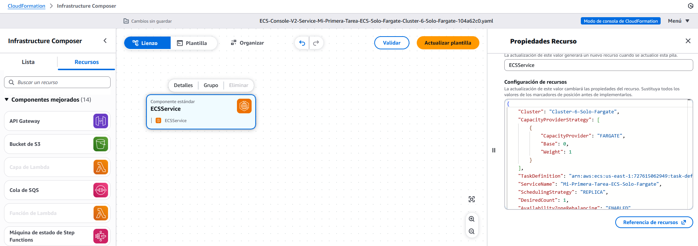{ .original .marco  }<br>


---

## **5 - AWS CloudFormation**

<!-- https://www.youtube.com/watch?v=fNmiLu40d4w -->
<!--  
3. ¿Qué tipo de recursos puede contener una pila?

Una pila puede incluir prácticamente cualquier recurso de AWS, entre otros:

Infraestructura de red:

VPC

Subnets

Internet Gateway

NAT Gateway

Route Tables

Computación:

EC2

Auto Scaling Groups

Launch Templates

Servicios gestionados:

RDS

Load Balancers

ElastiCache

Seguridad:

Security Groups

Roles y políticas IAM

Otros:

S3

CloudWatch

SNS

Todo queda versionado y controlado como código.

4. Ciclo de vida de una pila

Una pila tiene un ciclo de vida bien definido:

CREATE

AWS crea los recursos en el orden correcto según las dependencias.

UPDATE

Se modifica la pila cambiando la plantilla o los parámetros.

DELETE

Se eliminan todos los recursos asociados a la pila.

ROLLBACK

Si ocurre un error, CloudFormation revierte automáticamente los cambios.

Este comportamiento es clave para entornos de prácticas y docencia, ya que evita infraestructuras inconsistentes.

5. Dependencias y orden de creación

CloudFormation gestiona automáticamente las dependencias entre recursos:

Implícitas (por referencias Ref o GetAtt)

Explícitas mediante DependsOn

Esto garantiza que, por ejemplo:

una subred no se cree antes que la VPC,

un EC2 no se cree antes que su Security Group.

6. Parámetros, salidas y reutilización

Las pilas permiten:

Parameters
Personalizar valores como:

CIDR de red

tipo de instancia

nombre del entorno

Outputs
Exportar valores (ID de VPC, IP pública, ARN…) para:

reutilizarlos en otras pilas

crear stacks encadenadas

Esto es fundamental para arquitecturas modulares.

7. Pilas anidadas (Nested Stacks)

Una pila puede incluir otras pilas mediante el recurso:

AWS::CloudFormation::Stack


Ventajas:

Modularidad

Reutilización

Mantenimiento más sencillo

Ejemplo típico:

Pila principal

pila de red

pila de seguridad

pila de cómputo

8. Ventajas clave de usar pilas

Infraestructura como código (IaC)

Despliegues repetibles y auditables

Eliminación limpia de recursos

Reducción de errores manuales

Ideal para entornos educativos, pruebas y producción

9. Relación con otras herramientas

En AWS conviven varias soluciones similares:

CloudFormation (stacks)
Nativa de AWS, declarativa.

Terraform
Multicloud, estado externo.

AWS CDK
Define pilas usando lenguajes como TypeScript o Python, que se traducen a CloudFormation.

Dado tu trabajo reciente con CloudFormation y Terraform, el concepto de pila es especialmente relevante como base común.
 -->


<!-- https://youtu.be/TRLK6ZNpjB8?si=SQ5gCu6KFLiFdez9&t=886 -->

 

  

 
<!-- https://docs.aws.amazon.com/es_es/autoscaling/ec2/userguide/tutorial-ec2-auto-scaling-load-balancer.html -->

<!-- bbdd
https://www.youtube.com/watch?v=vp_uulb5phM
https://www.youtube.com/watch?v=eK_umMYxZfM
https://www.youtube.com/watch?v=6E30Yr2UATw
  https://www.youtube.com/watch?v=kNm0z_hRJlw
  https://www.youtube.com/watch?v=wLTFaDebTBY
  https://www.youtube.com/watch?v=BTg1JbmE3x4
  https://www.youtube.com/watch?v=tykcCf-Zz1M -->


<!-- ecs
https://prezi.com/p/5jffku-0bqyl/amazon-elastic-container-service-overview/
https://www.youtube.com/watch?v=TRLK6ZNpjB8
https://www.youtube.com/watch?v=qbEPae8YNbs
https://www.youtube.com/watch?v=NI34uF7VVP8
https://www.youtube.com/watch?v=86Ys0LnMSnY -->
<!-- file:///C:/Users/titan/Documents/Javier128/Modulos/DAW/DAW_2/AWS/UT/UT6/Tema%204/Tema%204.%20Peer%20connection%20y%20transit%20gw.pdf -->

 
<!-- route 53... 
cloud formation... 
elastic load balancing
Amazon Simple Storage Service (S3) 
Amazon Elastic File System (EFS)
Amazon Elastic Block Store (EBS) -->
<!--  Building Highly Available Web Application 
https://skillbuilder.aws/learn/2WBTDQFGSV/building-highly-available-web-application/2RW7UC62ZE
recursos de BBDD y buckets:

https://aws.amazon.com/es/products/storage/
-->

<!-- https://www.youtube.com/watch?v=89N3u6W01IQ -->
<!-- https://www.grycap.upv.es/cursocloudaws/contenido.php 
https://luisdieguez.com/tutorial-ansible-desde-0-herramienta-de-gestion-de-servidores/
https://ualmtorres.github.io/SeminarioDockerPresentacion/
https://www.youtube.com/watch?v=qNIniDftAcU
https://www.youtube.com/watch?v=TRLK6ZNpjB8

-->

  

 
## **Enlaces de interés**
Documentación de [AWS](https://docs.aws.amazon.com)  
[Docker](https://www.oracle.com/cloud/cloud-native/container-registry/what-is-docker/#docker-explained) explained    
Amazon [Elastic Container Registry](https://docs.aws.amazon.com/es_es/elasticloadbalancing/latest/userguide/what-is-load-balancing.html) Documentation    
[Repositorio privado](https://docs.aws.amazon.com/es_es/AmazonECR/latest/userguide/repository-create.html) de Amazon 
Documentacion de [CloudFormation](https://docs.aws.amazon.com/es_es/cloudformation/)


<!-- === "RA 1"
    |RA1. Comprende los fundamentos de la computación en la nube, sus ventajas frente a sistemas tradicionales, el marco de adopción, los principios de migración y los aspectos clave de facturación, como estimación y optimización de costos.||
    |-|-|
    *|**a)** Se ha comprendido los conceptos fundamentales de la computación en la nube.|20%|  
    *|**b)** Se ha demostrado la capacidad para explicar las ventajas de la nube frente a sistemas tradicionales.|20%|  
    *|**c)** Se ha participado en actividades relacionadas con el ecosistema de servicios en la nube.|15%|
    *|**d)** Se han identificado los principios básicos de la facturación y costos en la nube.|15%|
    *|**e)** Se ha hecho uso correcto de herramientas para estimar y gestionar presupuestos.|15%|
    *|**f)** Se ha participado en actividades prácticas sobre gestión de costos.|15%|
      
=== "RA 2"
    |RA2. Identifica los componentes clave de la infraestructura global de la nube, diferenciando servicios principales, regiones, zonas de disponibilidad y aplicando medidas básicas de seguridad como el modelo de responsabilidad compartida, gestión de accesos y protección de datos.||
    |-|-|
    *|**a)** Se ha adquirido conocimiento de los componentes de una infraestructura global en la nube. |20%|
    *|**b)** Se ha demostrado la capacidad para explorar y describir las principales categorías de servicios disponibles.|20%|
    *|**c)** Se ha realizado una evaluación del uso adecuado de servicios básicos en ejercicios prácticos.|15%|
    *|**d)** Se ha comprendido el modelo de responsabilidad compartida en la nube.|15%|
    *|**e)** Se ha aplicado medidas de seguridad básicas mediante herramientas de gestión de acceso.|15%|
    *|**f)** Se han realizado ejercicios sobre gestión de usuarios y políticas de seguridad.|15%|

=== "RA 3"
    |RA3. Diseña y configura redes virtuales y servicios de cómputo en la nube, aplicando buenas prácticas de seguridad, estrategias de balanceo de carga, escalado automático y aprovechando tecnologías serverless, contenedores y máquinas virtuales según casos de uso específicos.||
    |-|-|
    *|**a)** Se ha realizado el diseño y configuración de redes virtuales privadas.|20%|
    *|**b)** Se ha aplicado buenas prácticas de seguridad en redes y arquitecturas.|20%|
    *|**c)** Se ha participado activamente en la creación y configuración de una red funcional.|15%|
    *|**d)** Se ha realizado la selección de servicios de computación adecuados según casos de uso.|15%|
    *|**e)** Se ha llevado a cabo la configuración y gestión de balanceo de carga y escalado automático.|15%|
    *|**f)** Se han desarrollado prácticas relacionadas con la optimización de recursos computacionales.|15%|

=== "RA 4"
    |RA4. Gestiona servicios de almacenamiento y bases de datos en la nube, seleccionando tecnologías adecuadas para casos específicos, y diseña arquitecturas escalables y resilientes utilizando herramientas de monitoreo y optimización para mejorar el rendimiento.||
    |-|-|
    |**a)** Se ha realizado la diferenciación entre tecnologías de almacenamiento en la nube.|20%|
    |**b)** Se ha llevado a cabo la configuración y gestión de bases de datos en un entorno de nube.|20%|
    |**c)** Se ha trabajado en la resolución de problemas prácticos sobre almacenamiento y bases de datos.|20%|
    |**d)** Se ha diseñado arquitecturas escalables y resilientes basadas en las mejores prácticas.|20%|
    |**e)** Se ha hecho uso de herramientas de monitoreo y recomendaciones de optimización.|10%|
    *|**f)** Se ha participado en actividades que simulen el análisis y mejora de arquitecturas existentes.|10%| -->