# **UT. 8 - Sistemas de almacenamiento y bases de datos en AWS**

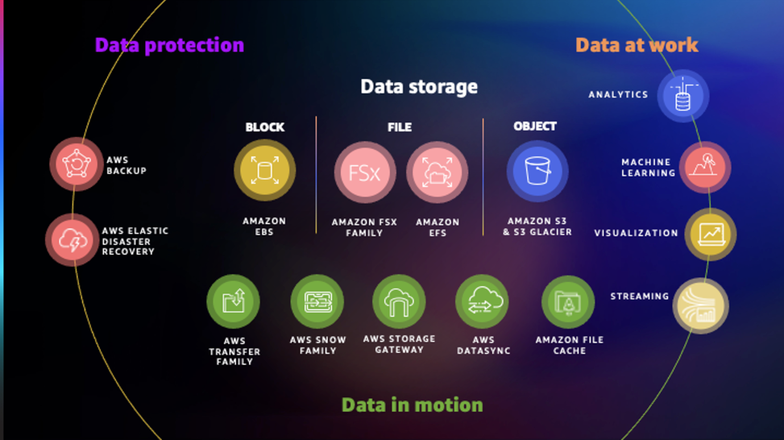{.sietecinco}    
   
 
<br>

**Resultados de aprendizaje y criterios de evaluacion que se evaluarán en esta unidad.**  

| **Resultados de aprendizaje de la unidad didáctica:** |
|-|
| **RA. 4:** Gestiona servicios de almacenamiento y bases de datos en la nube, seleccionando tecnologías adecuadas para casos específicos, y diseña arquitecturas escalables y resilientes utilizando herramientas de monitoreo y optimización para mejorar el rendimiento.|

|**Criterios de evaluación de la unidad didáctica:**|
|-|
|**a)** Se ha realizado la diferenciación entre tecnologías de almacenamiento en la nube.|
|**b)** Se ha llevado a cabo la configuración y gestión de bases de datos en un entorno de nube.|
|**c)** Se ha trabajado en la resolución de problemas prácticos sobre almacenamiento y bases de datos.|
 


## **1 - Sistemas de almacenamiento en AWS**
### **1.1 - Introducción**

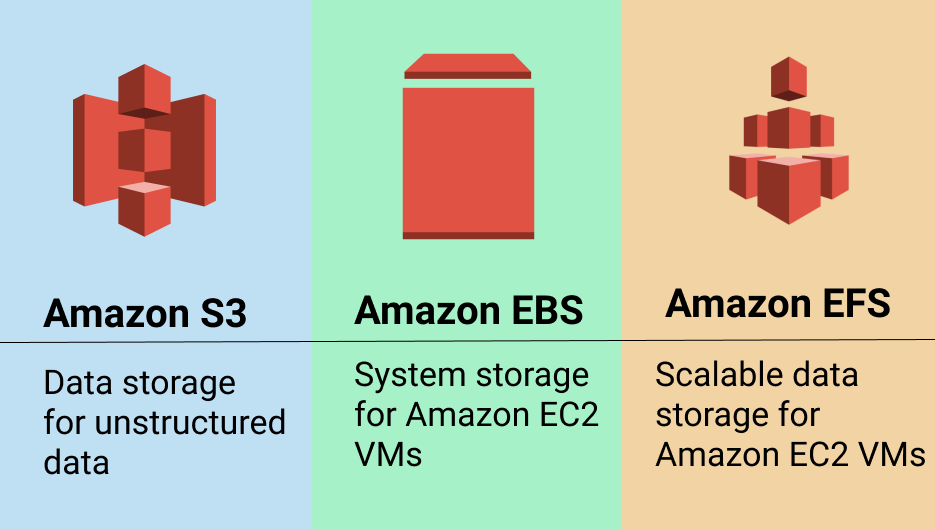{.trescinco}    

Existen multitud de sistemas de almacenamiento en AWS pero, podemos dividirlos en tres grandes categorías, principalmente en función de cómo se accede a los datos y del tipo de uso al que están orientados:

- **Almacenamiento de objetos**:  
Amazon S3 (buckets S3), orientado a datos altamente escalables como imágenes, vídeos o copias de seguridad.
- **Almacenamiento en bloques**:  
Amazon EBS (ya visto en una unidad anterior), utilizado como discos persistentes que se adjuntan a instancias EC2.
- **Almacenamiento de archivos**:  
Amazon EFS, que proporciona sistemas de archivos compartidos, accesibles desde múltiples instancias.

 
 

### **1.2 - Diferencias en almacenamiento por objetos, bloques y archivos**
Las diferencias fundamentales entre el almacenamiento por bloques, archivos y objetos se centran en la forma en que se estructuran, acceden y modifican los datos, así como en su rendimiento y escalabilidad.

---

#### **1.2.1 - Almacenamiento por Bloques (Amazon EBS)**

{.unocinco}    

En el almacenamiento por bloques, los datos se dividen en bloques independientes que funcionan de forma similar a un disco duro tradicional.


- **Modificación de datos:**   
Si se cambia una parte de la información, solo se debe modificar el bloque específico que la contiene, lo que permite baja latencia y alto rendimiento.  
Esto lo hace especialmente adecuado para aplicaciones con operaciones de lectura y escritura frecuentes.

- **Conectividad:**  
Los volúmenes Amazon EBS se adjuntan a instancias EC2 y actúan como **discos persistentes**.  
Normalmente, un volumen EBS solo puede estar conectado a una única instancia EC2, excepto en configuraciones específicas como EBS Multi-Attach.

- **Persistencia:**  
Los datos no se pierden al detener una instancia EC2, ya que el volumen EBS es independiente de la vida de la instancia.  

- **Casos de uso:**  
Bases de datos relacionales.  
Sistemas operativos de EC2.  
Aplicaciones que requieren baja latencia y alto IOPS.

---

#### **1.2.2 - Almacenamiento de Archivos (Amazon EFS)**

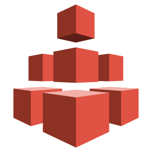{.unocinco}    

Este sistema ofrece **un almacenamiento compartido** al que pueden acceder simultáneamente múltiples instancias.

- **Protocolo y estructura:**  
Utiliza el protocolo de sistemas de archivos de red (NFS) y se comporta de manera similar a un NAS (Network Area Storage).  

- **Escalabilidad y disponibilidad:**  
Es elástico y escala de forma automática a medida que se agregan o eliminan archivos, llegando a niveles de petabytes sin interrumpir las aplicaciones ni necesitar intervención humana.  
Además, es un servicio altamente disponible, diseñado para operar en múltiples zonas de disponibilidad.  

- **Casos de uso:**  
Big Data y entornos de análisis.  
Sistemas de archivos compartidos.  
CMS como WordPress.  
Contenedores y microservicios con almacenamiento compartido.

---

#### **1.2.3 - Almacenamiento de Objetos (Amazon S3)**

{.unocinco} 

En el almacenamiento por objetos, los datos se almacenan como objetos dentro de contenedores llamados buckets.

Cada objeto incluye el **archivo en sí**, un **identificador único (key)** y **metadatos** que ayudan a catalogarlo.  

- **Modificación de datos:**  
A diferencia del almacenamiento por bloques, una modificación en un objeto requiere volver a cargar el archivo entero.  

- **Acceso y escalabilidad:**   
Los objetos son accesibles desde cualquier lugar mediante una URL (sujeto a políticas de seguridad).  
Es una solución extremadamente escalable y, aunque es más lenta en escritura que EBS, es más sencilla y barata.
Es un servicio altamente duradero (99,999999999%) y prácticamente ilimitado en capacidad.  

- **Estructura lógica:**   
Aunque la consola permita navegar mediante "carpetas", en realidad no existen los directorios como tal, el sistema utiliza las keys (nombres de archivo que incluyen prefijos) para simular una jerarquía.  

- **Casos de uso:**  
Copias de seguridad y archivado  
Alojamiento de sitios web estáticos  
Aplicaciones móviles  
Data Lakes y análisis de datos  

<br>

#### **1.2.4 - Resumen**
| Característica | Amazon EBS            | Amazon EFS           | Amazon S3             |
| -------------- | --------------------- | -------------------- | --------------------- |
| Tipo           | Bloques               | Archivos             | Objetos               |
| Acceso         | Una EC2 (normalmente) | Varias EC2           | HTTP/HTTPS            |
| Modificación   | A nivel de bloque     | A nivel de archivo   | Objeto completo       |
| Latencia       | Muy baja              | Baja                 | Mayor                 |
| Escalabilidad  | Limitada por volumen  | Automática           | Ilimitada             |
| Persistencia   | Independiente de EC2  | Independiente de EC2 | Total                 |
| Casos típicos  | BBDD, SO              | CMS, compartido      | Backups, web estática |


### **1.3 - Tarea RA4-CEa-1 - Creación de un Amazon EFS**
#### **1.3.1 - Escenario propuesto**
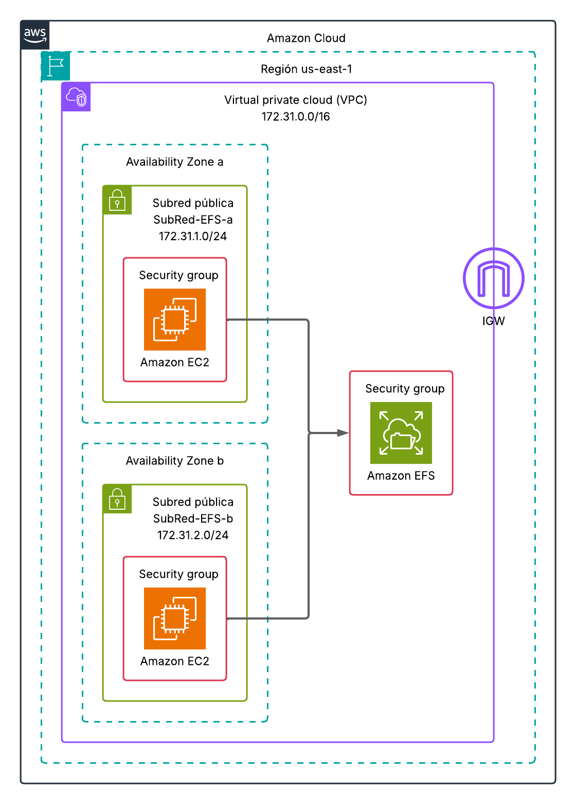{.cincozero} 

El escenario básico consistirá en 2 instancias y una puerta de enlace a internet para poder conectarnos a ellas.

- Una EC2 estará en la zona de disponibilidad a.
- La otra EC2 estará en otra zona de disponibilidad (p.e. b).

Por otra parte crearemos un EFS y su grupo de seguridad. Para mayor seguridad del EFS, el grupo de seguridad solo aceptará conexiones entrantes desde los grupos de seguridad de las instancias EC2. 

Para terminar, instalaremos un cliente NFS en las instancias EC2 para poder comunicarse con el EFS. Además añadiremos una directiva que forzará el encriptado de los datos durante las transferencias entre instancias EC2 y NFS. 

---

#### **1.3.2 - Creación de la infraestructura básica**
Creamos la VPC, las subredes, el IGW y configuramos la tabla de enrutamiento.

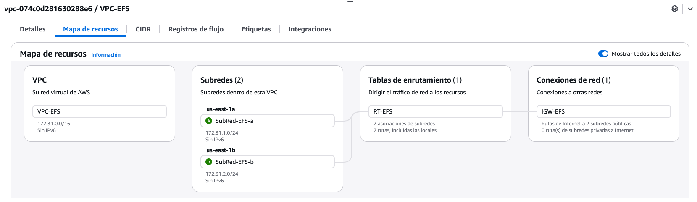{.cien .marco} 

---

#### **1.3.3 - Lanzamiento de las EC2**
Primero crearemos el mismo grupo de seguridad para las 2 instancias y luego lanzaremos las instancias. Cada una en una subred distinta.

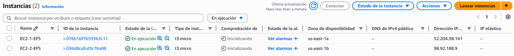{.cien .marco} 

---

#### **1.3.4 - Lanzamiento del EFS**
- Antes de nada, crearemos un grupo de seguridad para el EFS y lo configuraremos para que solo acepte conexiones NFS desde los grupos de seguridad de las instancias que hemos creado.  
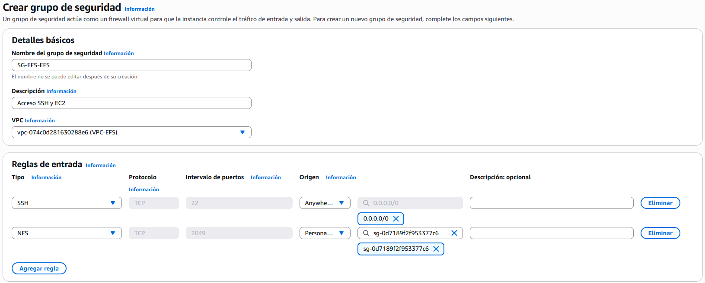{.cien .marco .margintopbottom20} 
 

- Accedemos a los recursos de AWS EFS y creamos nuestro primer EFS.
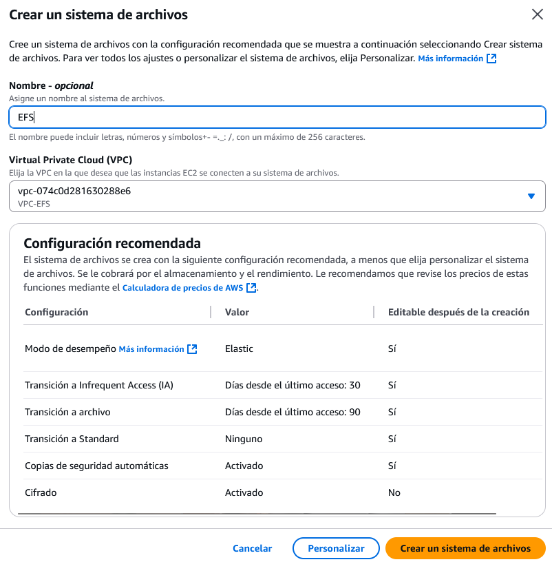{.cincozero .marco .margintopbottom20} 

- Pulsamos personalizar para ver las diferentes configuraciones disponibles.
    - Paso 1
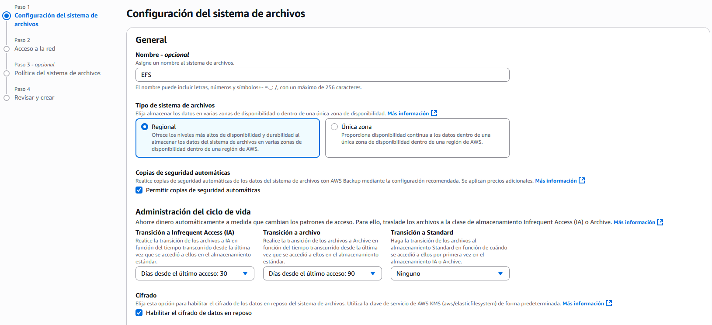{.sietecinco .marco .margintopbottom20}  
    - Paso 2  
    Elegimos los grupos de seguridad de los puntos de montaje para que el NFS solo acepte conexiones desde las instancias EC2 que hemos creado anteriormente.
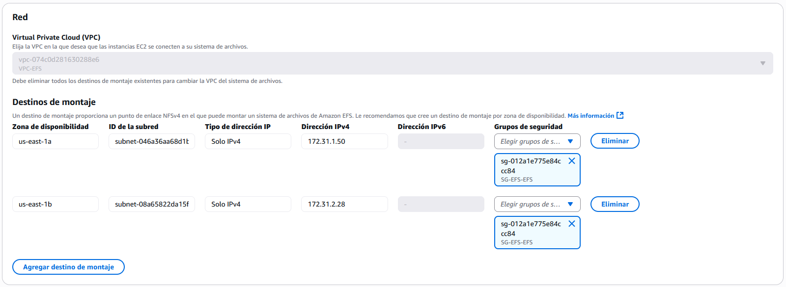{.sietecinco .marco .margintopbottom20}  
    - Paso 3  
    Seleccionamos la política para el cifrado en tránsito.
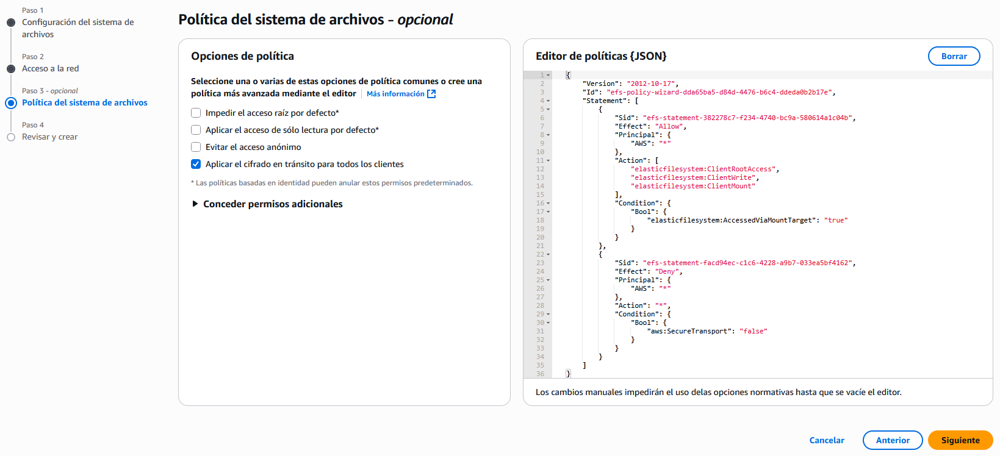{.sietecinco .marco .margintopbottom20}  
    - Paso 4  
    Revisamos y creamos el NFS.
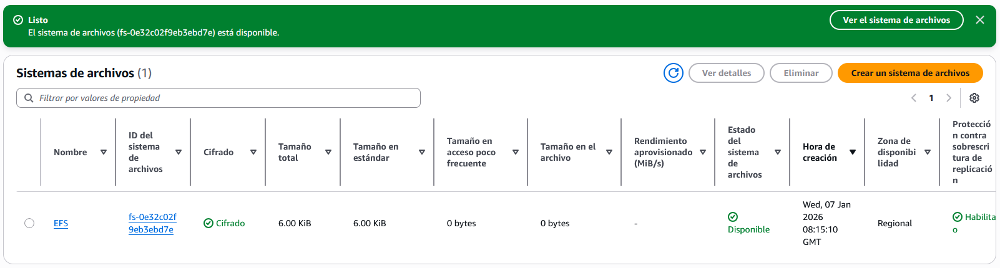{.sietecinco .marco .margintopbottom20}  

#### **1.3.5 - Cliente NFS sobre instancias EC2**
!!! warning "Repetiremos los pasos siguientes en cada instancia EC2"

!!! tip "Crear el punto de montaje"
Accedemos a las intancias EC2 y creamos el punto de montaje 
```bash
mkdir ~/efs
```
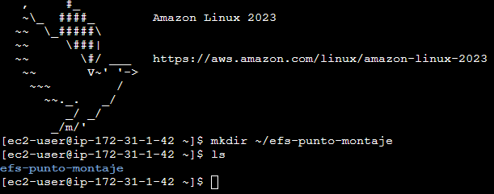{.trescinco }  

<br>

!!! tip "Instalar el cliente NFS"
Normalmente el cliente NFS ya debería estar instalado. 
```bash
sudo yum -y install nfs-utils
```
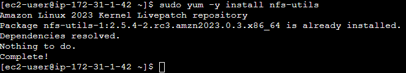{.cincozero }  

También instalaremos el cliente de Amazon EFS **para instancias de Amazon linux**.  
```bash
sudo yum install -y amazon-efs-utils
```
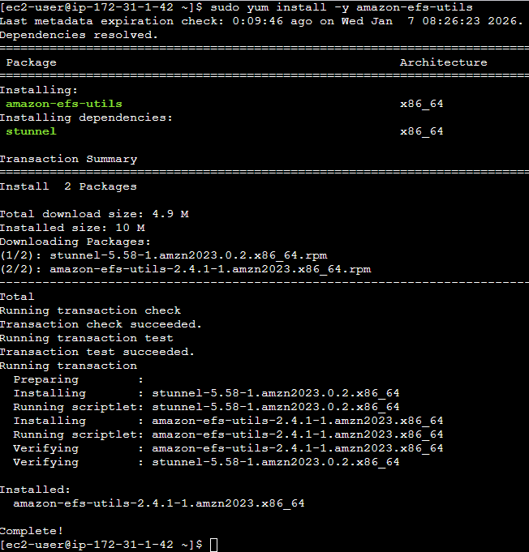{.cincozero }  

<br>

!!! tip "Montar el EFS con el helper de AWS EFS"
Realizaremos el montaje utilizando **el nombre de DNS** del sistema de archivos (podeís ver el comando completo pulsando **Asociar**).

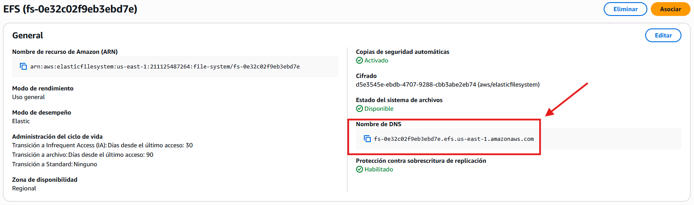{.cien .marco }  
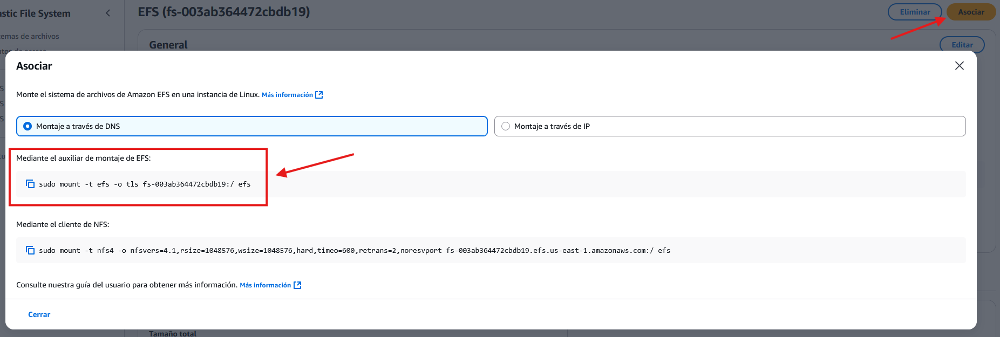{.cien .marco }  
```bash
sudo mount -t efs -o tls fs-003ab364472cbdb19:/ efs
```
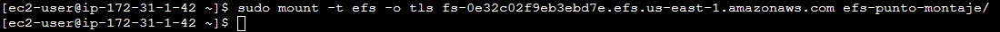{.sietecinco }  

<br>

!!! tip "Primera prueba del EFS"
Nos cambiamos al directorio donde hemos montado el EFS y hacemos una prueba de escritura.
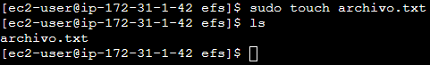{.cincozero }  

Si ahora, desde la otra instancia añadimos contenido al archivo de texto y lo leemos de nuevo, podremos ver la modificaciones aportadas.
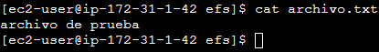{.cuatrozero }  

#### **1.3.6 - Condiciones de la entrega de la tarea RA4-CEa-1**
!!! warning "Condiciones de entrega"
    1. Montar el ejemplo anterior.
    1. Realizar capturas de pantalla del mapa de recursos de la VPC desplegada.
    1. Realizar capturas de pantalla de las 2 instanciasaccediendo al NFS.    
    1. Adjuntar las capturas a un documento, y comentar brevemente cada captura.
    1. Subir el documento a AULES en la tarea correspondiente. 

### **1.4 - Tarea RA4-CEa-2 - Creación de un bucket S3**
#### **1.4.1 - Creación del bucket S3**
Accedemos al servicio S3 para crear el bucket. Es importante recordar que el espacio de **nombres (namespace) de S3 es global**, por lo que el nombre debe ser **único en todo el mundo**. Sin embargo, **S3 es un servicio regional**, por lo que deberemos seleccionar la región más cercana a nuestras instancias para minimizar la latencia.

- Creación del bucket S3.
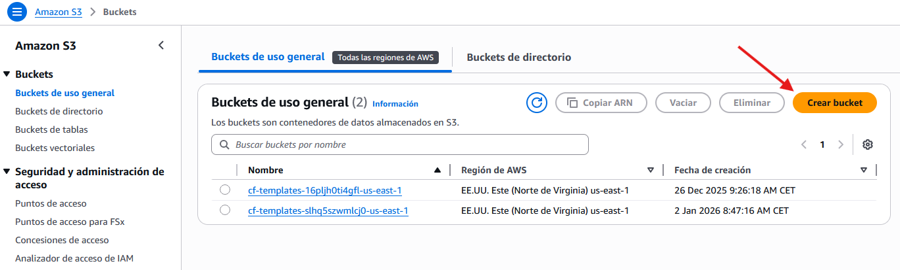{.nuevezero .marco .margintop10 .marginbottom40 }  

- Le damos un nombre único. Si hay errores de sintaxis o el nombre ya está asignado, aparecerá un error. 
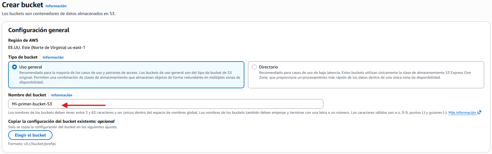{.nuevezero .marco .margintop10 }  
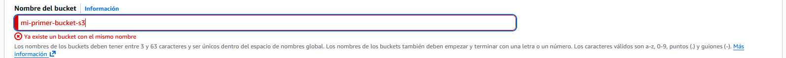{.nuevezero .marco   }  
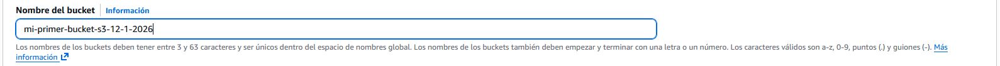{.nuevezero .marco  .marginbottom40 }  


- En **propiedad de objetos** dejamos la opción por defecto.
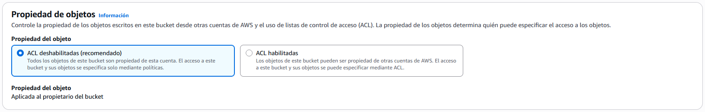{.nuevezero .marco .margintop10 .marginbottom40 }  

- En **configuración de bloqueo de acceso público** dejamos la opción por defecto.
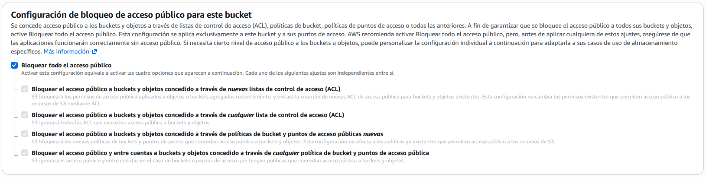{.nuevezero .marco .margintop10 .marginbottom40 }  

- En **control de versiones de buckets** habilitamos el servicio (veremos el porqué más adelante). 
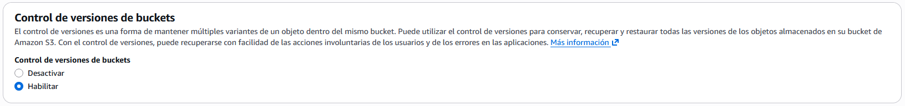{.nuevezero .marco .margintop10 .marginbottom40 }  

- Si queremos, podemos agregar una etiqueta.  
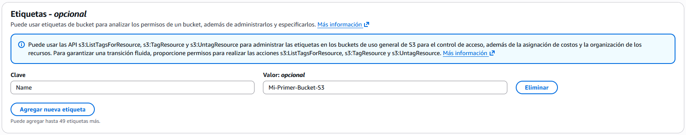{.nuevezero .marco .margintop10 .marginbottom40 }  

- Cifrado predeterminado: Dejamos las opciones por defecto.   
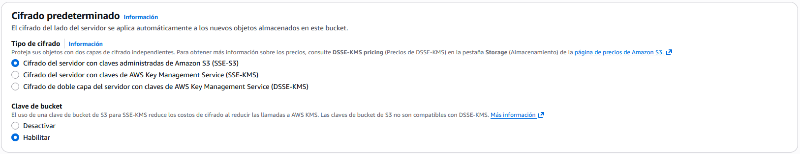{.nuevezero .marco .margintop10 .marginbottom40 }  

- Configuración avanzada. Dejamos el bloqueo de objeto desactivado.
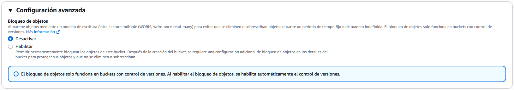{.nuevezero .marco .margintop10  }
- !!! warning "Bloqueo de objetos"  
      - El S3 Object Lock (Bloqueo de Objetos) es una funcionalidad diseñada para evitar que los objetos **sean eliminados o sobrescritos**. 
      - Permite implementar modelos de almacenamiento WORM (Write Once, Read Many), lo cual es vital para **el cumplimiento normativo y la protección contra ataques de ransomware**.   

- Si todo ha ido bien tendremos nuestro bucket S3 creado.
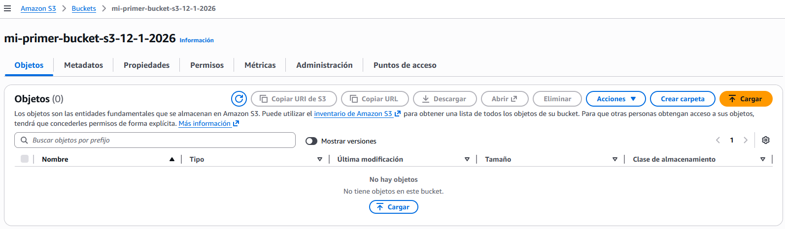{.nuevezero .marco .margintop10 .marginbottom40 }  

#### **1.4.2 - Subir objetos al bucket S3**
- Arrastramos el objeto a subir y pulsamos cargar. 
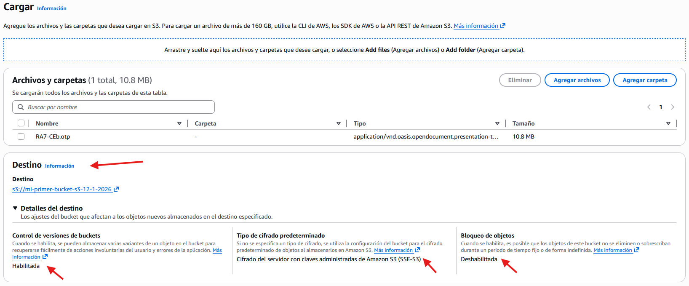{.nuevezero .marco .margintop10   }  
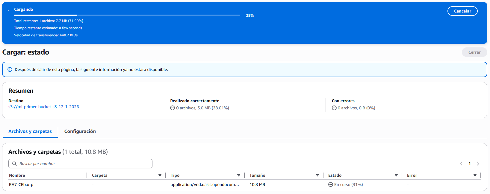{.nuevezero .marco   .marginbottom40 }  

- Una vez subido el archivo podremos acceder a sus propiedades, permisos y versiones (si hemos habilitado el versionado de objetos en el bucket S3).
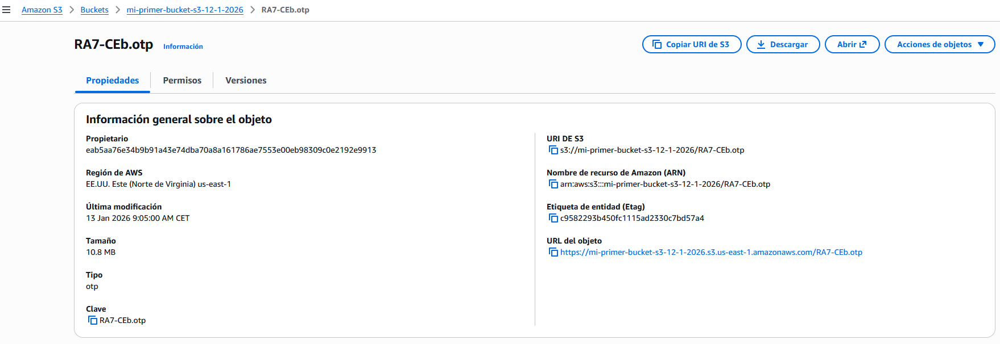{.nuevezero .marco .margintop10  .marginbottom40 }
- En **Propiedades** → **Clase de almacenamiento** podemos ver (y configurar) el tipo de almacenamiento (se aplican tarifas especificas a cada clase de almacenamiento).   
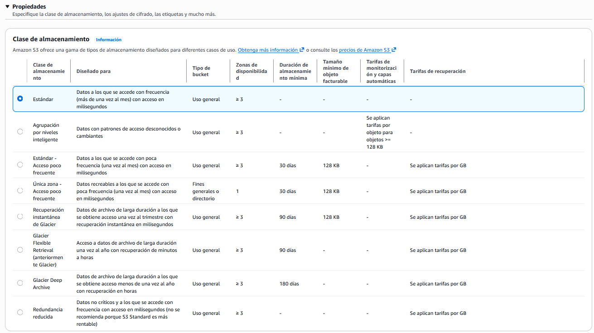{.nuevezero .marco .marginbottom40 .margintop20}  

- En **Permisos**, podemos ver las listas de control de acceso actuales del objeto.   
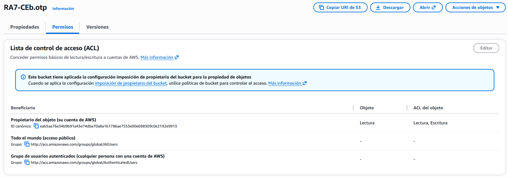{.nuevezero .marco .margintop10 .marginbottom40 }  

#### **1.4.3 - Acceder a los objetos de un bucket S3**
- Si intentamos acceder al objeto veremos que no es posible. Eso se debe a los permisos (lista de control de acceso (ACL)) del propio bucket.  
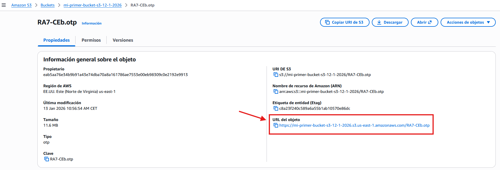{.nuevezero .marco .margintop10   }  
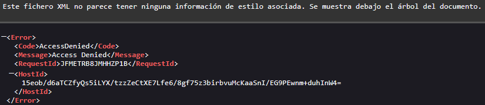{.sietezero    }  
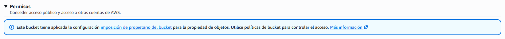{.nuevezero .marco .marginbottom40 }  

#### **1.4.4 - Permitir acceso a los objetos de un bucket S3**
- Para permitir el acceso a los objetos volvemos al bucket S3 y editamos las reglas de bloqueo del acceso público.  
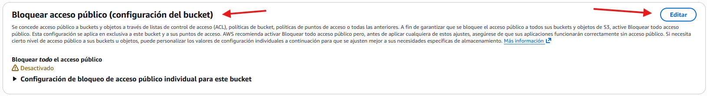{.nuevezero .marco .margintop10  }  
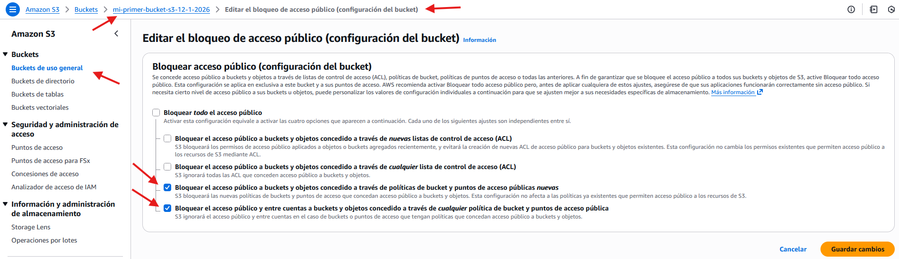{.nuevezero .marco  }  
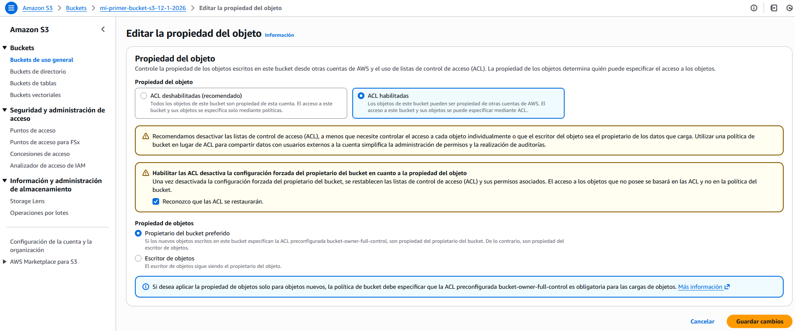{.nuevezero .marco .marginbottom40}  

- Luego ya podremos editar las propiedades de los objetos de nuestro bucket S3.
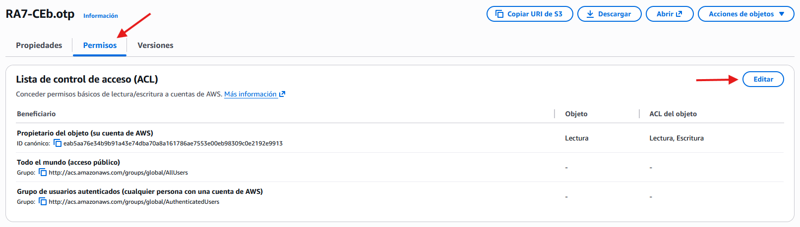{.nuevezero .marco  .margintop10 }  
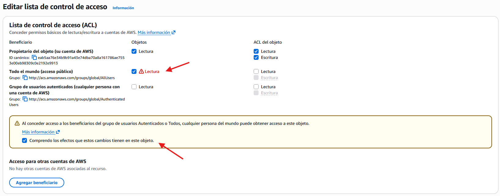{.nuevezero .marco   .marginbottom40 }  

- A partir de entonces **cualquier persona con el enlace** podrá acceder al objeto. 
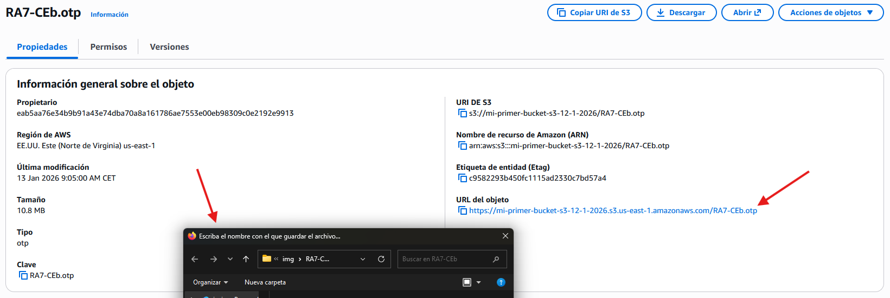{.nuevezero .marco .margintop10 .marginbottom40 }  

#### **1.4.5 - Versionado de un objeto**
Como ya hemos comentado anteriormente, si no tenemos habilitado el versionado de objeto, volver a subir un archivo modificado de un mismo objeto implica **sobreescribir totalmente** el objeto anterior.  

Con el versionado de objetos, podemos crear versiones de un mismo objeto.

- Después de subir un objeto versionado, podremos ver las diferentes versiones existentes en el bucket S3.
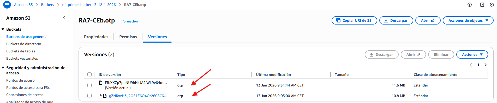{.nuevezero .marco .margintop10 .marginbottom40 }  

- **Tarea: Trabajo a realizar.** Como en el caso anterior deberemos habilitar las ACL para poder acceder al archivo. De lo contrario obtendremos un mensaje de error. 
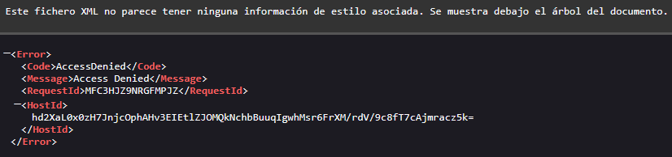{.sietezero .margintop10 }  

#### **1.4.6 - Eliminación de un objeto versionado**
- Si eliminamos el objeto, **en teoría**, debería dejar de esatar disponible.  
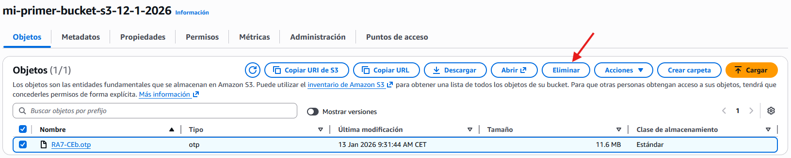{.nuevezero .marco .margintop10 .marginbottom40 }  

- Vista después de la eliminación de objetos.
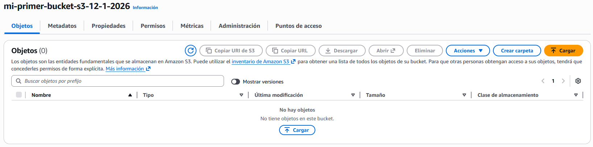{.nuevezero .marco .margintop10 .marginbottom40 }  

- Si habilitamos, **Mostrar versiones**, veremos que, aunque hayamos elminado el objeto, sus versiones siguen disponibles. Este proceder tiene la ventaja de poder recuperar objetos borrados por error, pero también tiene el inconveniente de cargos adicionales por parte de AWS.      
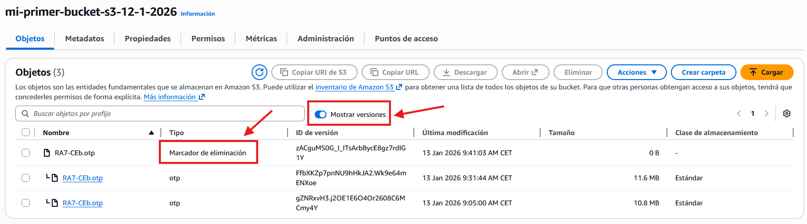{.nuevezero .marco .margintop10 .marginbottom40 }  


#### **1.4.7 - Eliminación de un bucket S3**
- Para eliminar un bucket S3, primero deberemos **vaciarlo**.
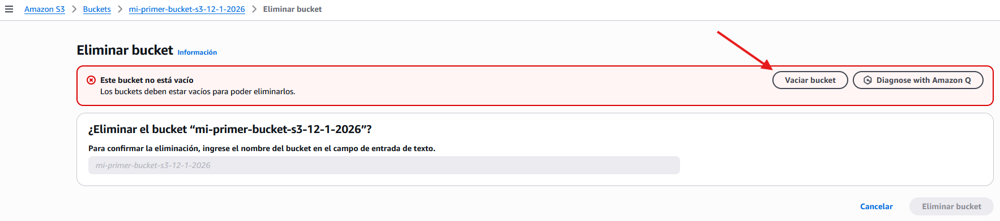{.nuevezero .marco .margintop10 .marginbottom40 }  

- Vaciamos el bucket S3.
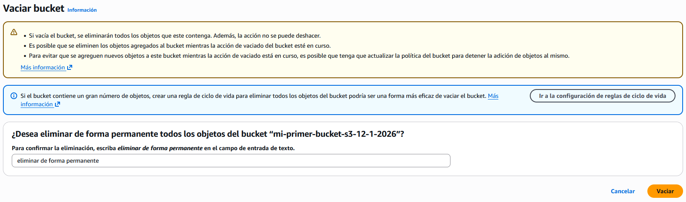{.nuevezero .marco .margintop10 .marginbottom40 }  

- Una vez vaciado el bucket S3, podremos **eliminarlo definitivamente**.
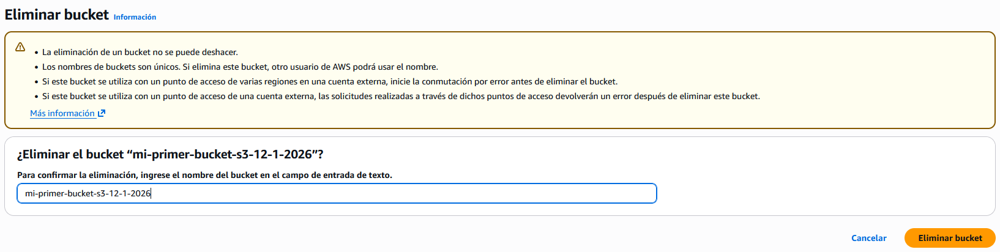{.nuevezero .marco .margintop10 .marginbottom40 }  

#### **1.4.8 - Condiciones de la entrega de la tarea RA4-CEa-2**
!!! warning "Condiciones de entrega"
    1. Montar el ejemplo anterior.
    1. Editar las ACL de la versión 2 del objeto que subireis a vuestro bucket S3.
    1. **Realizar capturas que muestran el acceso mediante URL a las 2 versiones**. 
    1. Adjuntar las capturas a un documento, y comentar brevemente cada captura.
    1. Subir el documento a AULES en la tarea correspondiente. 

## **2 - Servicios de bases de datos en la nube (AWS)**
Los servicios de bases de datos en la nube permiten alojar el servidor de base de datos en la infraestructura de un proveedor de servicios en Internet. Este tipo de servicio se conoce como DBaaS (Database as a Service).

Estos servicios ofrecen muchas de las funcionalidades de un sistema gestor de bases de datos tradicional y, además, incluyen numerosas tareas que normalmente realiza un administrador de bases de datos (DBA), como el aprovisionamiento, las copias de seguridad, la alta disponibilidad, el parcheo o la monitorización.

De esta manera, se reduce el tiempo que un DBA dedica a tareas puramente administrativas, permitiéndole centrarse en actividades de mayor valor añadido, como el diseño de la arquitectura, la optimización del rendimiento o la seguridad de los datos.

Dependiendo del tipo de datos a almacenar, AWS ofrece distintos sabores de DBaaS:

- **Amazon RDS** (Relational Database Service): Para bases de datos relacionales tradicionales (SQL). Soporta motores como MySQL, PostgreSQL, SQL Server y Oracle.

- **Amazon Aurora**: Una base de datos diseñada por AWS que es compatible con MySQL y PostgreSQL pero optimizada para ser mucho más rápida y resiliente en la nube.

- **Amazon DynamoDB**: Un servicio NoSQL (llave-valor) para aplicaciones que necesitan una latencia de milisegundos a cualquier escala (muy usado en aplicaciones móviles y juegos).

### **2.1 - Bases de datos relacionales**
!!! tip "Amazon RDS"
- Amazon RDS es un servicio administrado que permite ejecutar bases de datos relacionales en la nube.  
Al tratarse de un servicio gestionado, RDS se encarga de tareas como la instalación, el mantenimiento y las copias de seguridad, permitiendo que los usuarios se centren en los datos y en el desarrollo de las aplicaciones.

- Una instancia de base de datos es un entorno aislado que puede contener **una o varias bases de datos**, dependiendo del motor seleccionado. Se accede a ella utilizando las mismas herramientas y aplicaciones que en una base de datos tradicional.

- Al crear una instancia en Amazon RDS, es necesario elegir el motor de base de datos. Los motores relacionales soportados por RDS son:
    - MariaDB
    - **MySQL**
    - PostgreSQL
    - **Amazon Aurora** (compatible con MySQL y PostgreSQL)
    - Microsoft SQL Server
    - Oracle

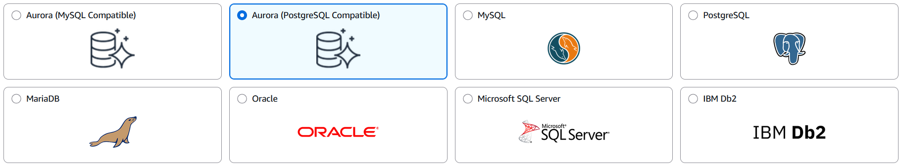{.nuevezero .marco .margintop10 .marginbottom40 }  

- Los recursos de la instancia se definen mediante la clase de instancia y el tipo de almacenamiento, lo que permite ajustar el rendimiento y el coste según las necesidades.

!!! tip "Alta disponibilidad"
Una de las características más importantes de Amazon RDS es la posibilidad de configurar alta disponibilidad mediante una implementación Multi-AZ. En este modo, RDS crea automáticamente una instancia en espera en otra zona de disponibilidad dentro de la misma región y replica los datos de forma síncrona.

Si la instancia principal falla, RDS realiza un failover automático, promoviendo la instancia en espera como nueva instancia principal, lo que reduce el tiempo de inactividad.

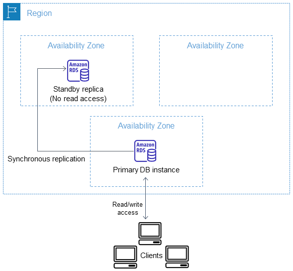{.cincozero .marco .margintop10 .marginbottom40 }  

!!! tip "Replicas de lectura"
Amazon RDS permite crear réplicas de lectura para los motores MySQL, MariaDB, PostgreSQL y Amazon Aurora. En este caso, los cambios realizados en la instancia principal se replican de forma asíncrona en la réplica.

Las réplicas de lectura permiten descargar las consultas de lectura de la instancia principal y mejorar el rendimiento. Estas réplicas pueden promocionarse manualmente a instancia principal y también pueden crearse en otra región, lo que resulta útil para mejorar la latencia de lectura o como apoyo en escenarios de recuperación ante desastres.

{.cincozero .marco .margintop10 .marginbottom40 }  

!!! tip "Supervisión"
Para monitorizar el rendimiento y el estado de una instancia de base de datos en Amazon RDS se utiliza el servicio **Amazon CloudWatch**. Las métricas y gráficos de rendimiento pueden visualizarse directamente desde la consola de Amazon RDS.

Además, es posible suscribirse a los eventos de Amazon RDS para recibir notificaciones sobre cambios relevantes en una instancia de base de datos, como tareas de mantenimiento o incidencias.


#### **2.1.1 - Amazon RDS con MySQL**

!!! tip "Preparación del entorno"
Para la infraestructura de red necesitaremos un mínimo de:

- Una VPC.
- Al menos dos subredes en zonas de disponibilidad distintas (preferiblemente privadas).
- Un grupo de seguridad para la base de datos.  
- La plantilla para lanzar esta infraestrucutura se puede descargar [aquí](./ut8/RDS/plantilla.yaml). 

---

!!! tip "Lanzar una instancia de Amazon RDS con MySQL"  
- Una vez creada la infraestructura, vamos a Aurora and RDS y pulsamos **crear una base de datos**.
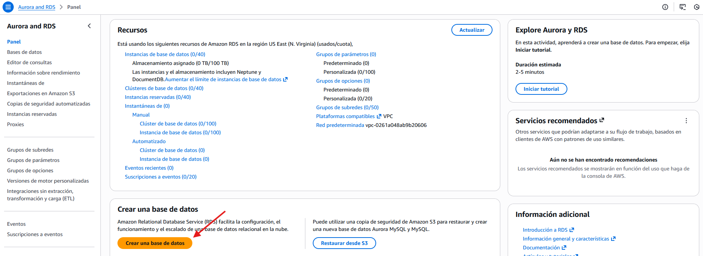{.cien .marco .margintop10 .marginbottom40 }  

- Seleccionamos **Configuración completa** y **MySQL**.  
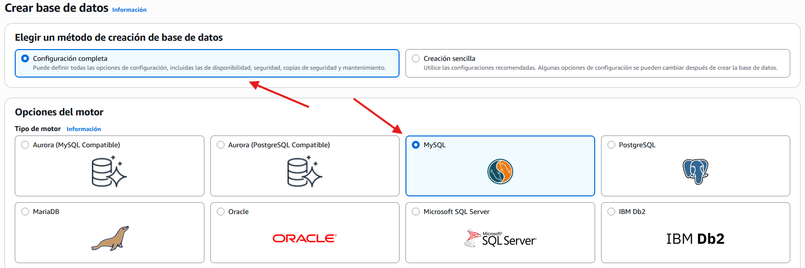{.cien .marco .margintop10 .marginbottom40 }  

- Seleccionamos **la versión del motor** que nos propone por defecto y **entorno de pruebas**.   
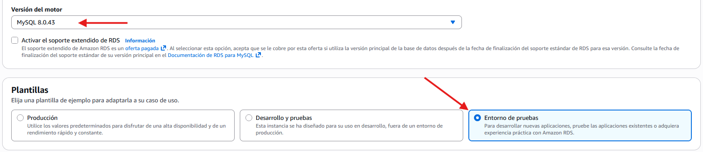{.cien .marco .margintop10 .marginbottom40 }  

- **Disponibilidad y durabilidad**. Al seleccionar **entorno de pruebas**, **Amazon RDS** solo desplegará **una sola instancia (Single-AZ)**, **sin configuración de alta disponibilidad (Multi-AZ)**.   
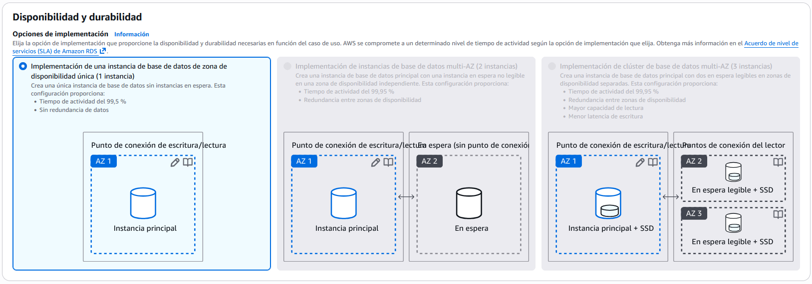{.cien .marco .margintop10 .marginbottom40 }  

- **Configuración:** Damos un identificador a nuestra instancia y introducimos una contraseña. 
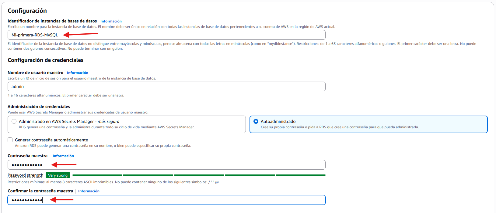{.cien .marco .margintop10 .marginbottom40 }  

- **Configuración de la instancia**. Dejamos los opciones por defecto.
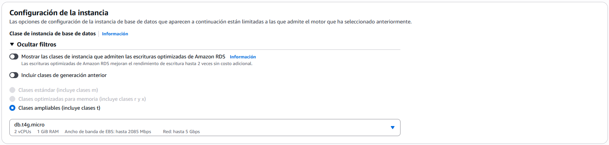{.cien .marco .margintop10 .marginbottom40 }  

- **Almacenamiento**. Dejamos las opciones por defecto. 
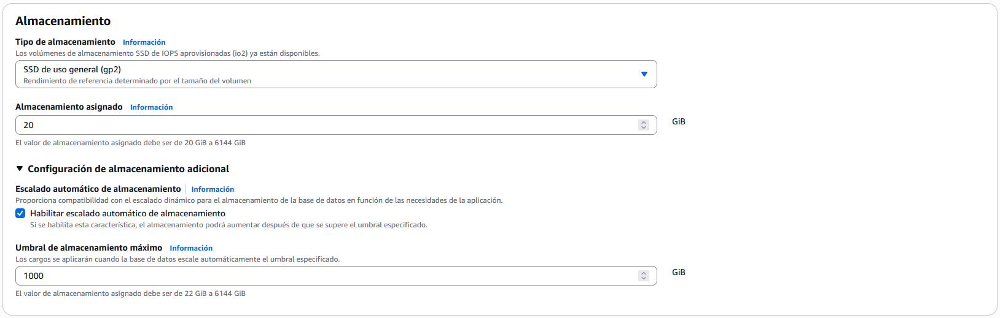{.cien .marco .margintop10 .marginbottom40 }  

- **Conectividad 1/2**. Elegimos la VPC donde se desplegará la instancia de RDS y para poder acceder a ella, le daremos un IP pública. 
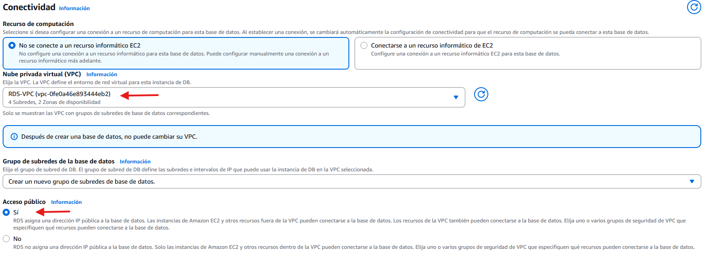{.cien .marco .margintop10 .marginbottom40 }  

- **Conectividad 2/2**. Elegimos el grupo de seguridad que hemos creado con la plantilla y dejamos el resto de opciones con los valores por defecto.  
**Nota importante:** Exponer una instancia de bases de datos a internet **no se puede considerar una buena práctica desde el punto de vista de la seguridad informática**. 
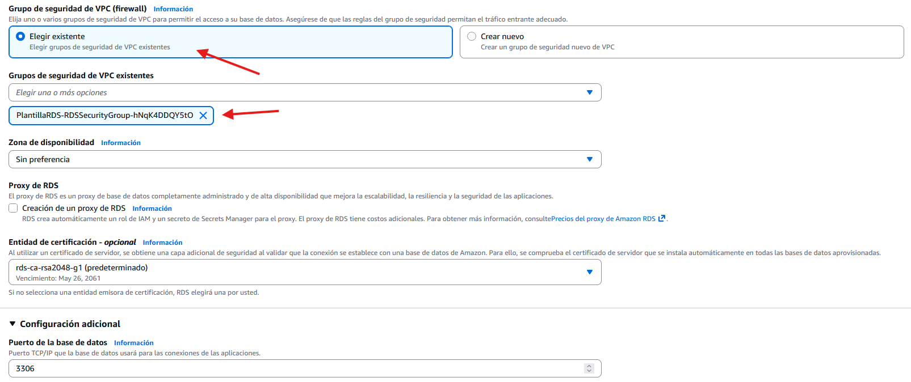{.cien .marco .margintop10 .marginbottom40 }  

---
!!! tip "Creación de la base de datos"

- Empezará después de pulsar **crear base de datos**. 
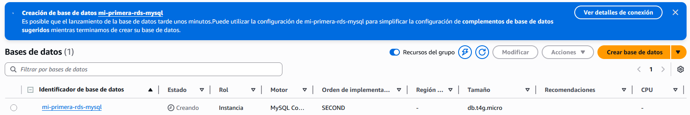{.cien .marco .margintop10 .marginbottom40 }  

- **Punto de enlace**. Una vez creada la base de datos, podremos acceder a ella a través de su punto de enlace.
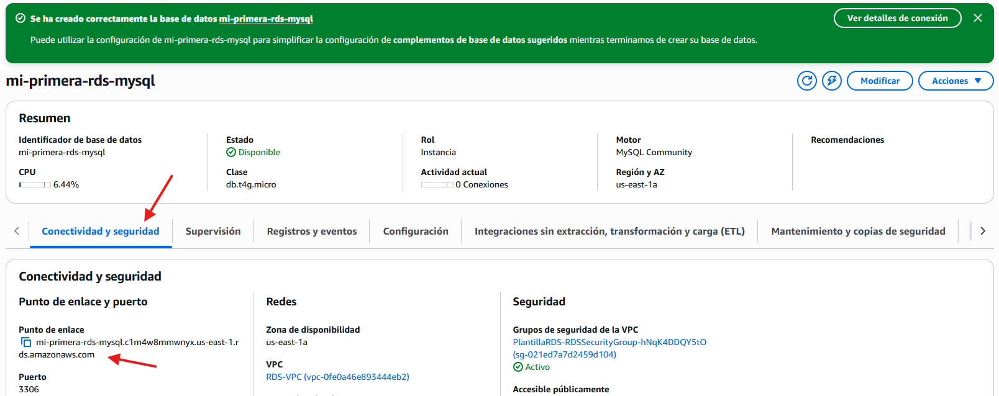{.cien .marco .margintop10 .marginbottom40 }  

---
!!! tip "Conexión desde MySQL Workbench"
- Introducimos el punto de enlace, el usuario y la contraseña y probamos la conexión.  
 
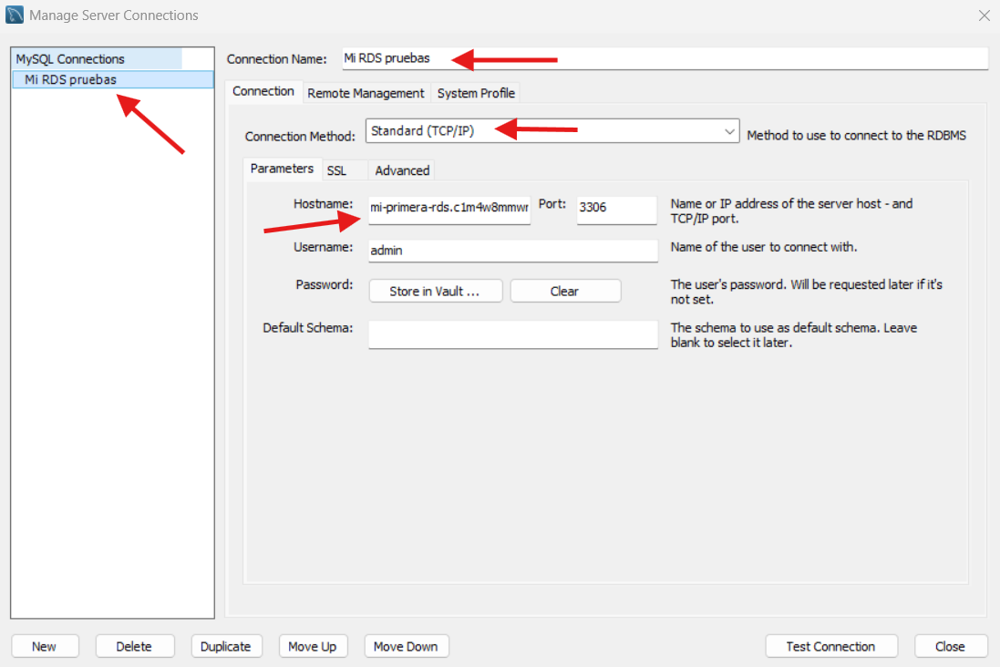{.cincozero .marco .margintop10  .marginbottom40} 
- Vemos que la conexión se ha realizado correctamente...   
 
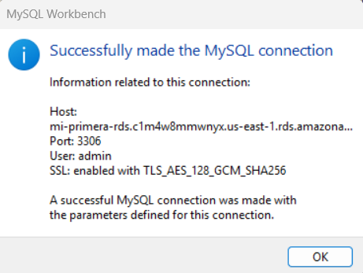{.treszero .marco  .marginbottom40 .margintop10 }  
- ... y ya podemos trabajar con la base de datos.  
 
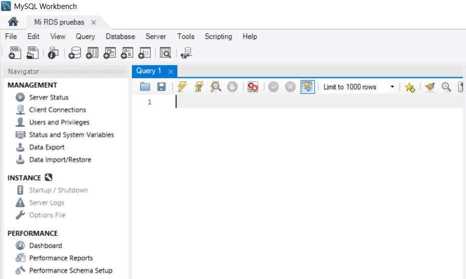{.cincozero .marco .margintop10 .marginbottom40 }  

#### **2.1.2 - Tarea RA4-CEb-1**
En esta tarea, realizaremos un escenario más realista donde la base de datos estará en una red privada y solo se podrá tener acceso a ella desde el grupo de seguridad de una instancia de la subred pública.  
Además usaremos las características de redundancia y disponibilidad (2 réplicas de lectura y despliegue multi-AZ) para mejorar la calidad del servicio.

- **Modificar la VPC**. En este caso RDS requiere de 3 subredes en 3 zonas de disponibilidad distintas, así pues, añadiremos 2 subredes (una pública y otra privada) a nuestra VPC.
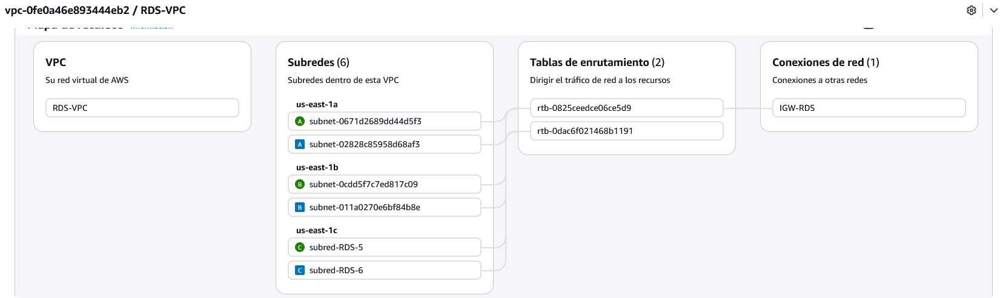{.cien .marco .margintop10 .marginbottom40 }  

- **Crear el servicio RDS com MySQL:** Esta vez elegimos **desarrollo y prueba** e implementación de clúster multi-AZ.
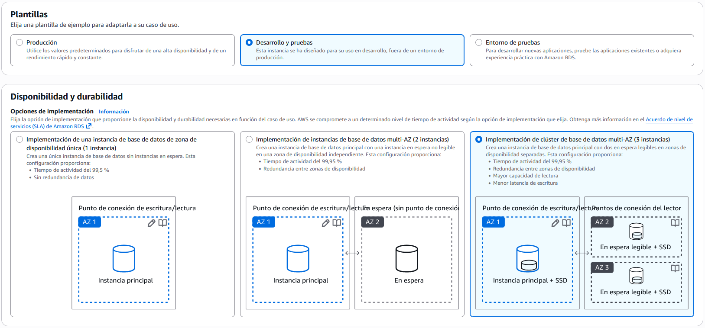{ .marco .margintop10 .marginbottom40 }  

- En **configuración** elegimos **autoadministrado**.
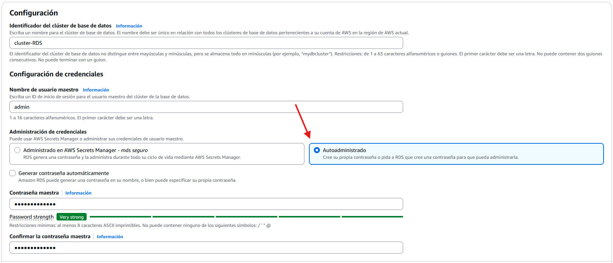{.cien .marco .margintop10 .marginbottom40 }  

- En **conectividad**, si hemos creado una instancia EC2 (para este case una máquina Ubuntu), elegimos **conectarse a un recurso de EC2**.
**Nota:** Por algún motivo desconocido AWS no reconoce automáticamente las nuevas subredes. Tendremos que añadirlas manualmente.
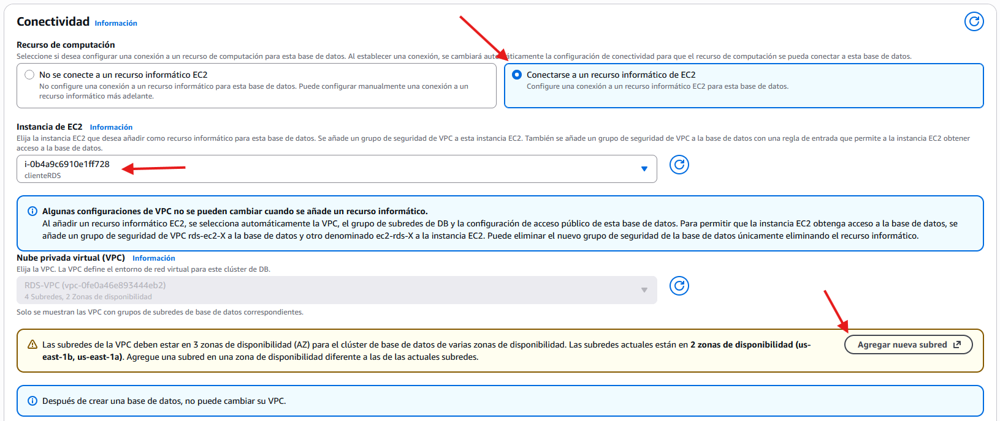{.cien .marco .margintop10 .marginbottom40 }
Primero las seleccionamos.  
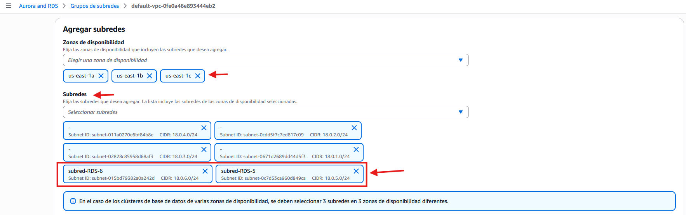{.cien .marco .margintop10   }  
Le damos a refrescar y luego podremos continuar con la configuración de nuestro cluster RDS.  
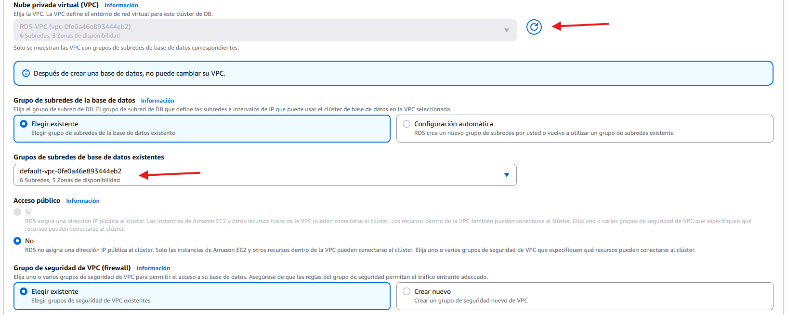{.cien .marco .margintop10 .marginbottom40 }  

- En **grupo de seguridad**, podemos elegir el que hemos creado en la práctica anterior.
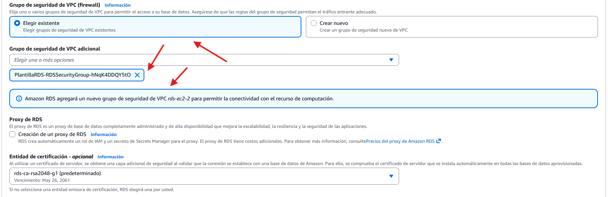{.cien .marco .margintop10 .marginbottom40 }  

- **Implementación del cluster RDS.** Después de crear la base de datos veremos el progreso de su despliegue.
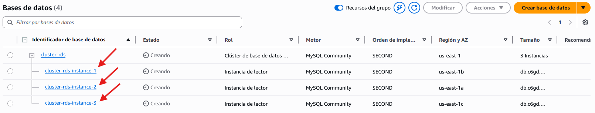{.cien .marco .margintop10 .marginbottom40 }  

- Con el despliegue finalizado, podremos ver los puntos de conexión (lectura/escritura y solo lectura).
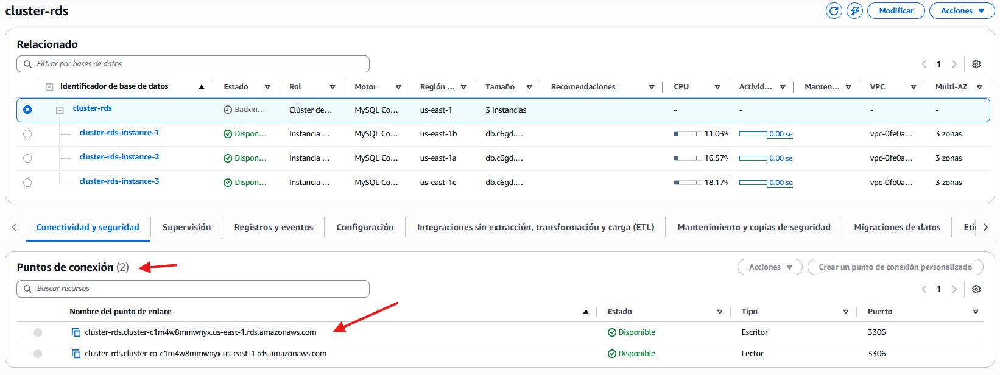{.cien .marco .margintop10 .marginbottom40 }  

- Modificamos el grupo de seguridad del cluster para que solo acepte conexiones desde el grupo de seguridad de la instancia EC2.  
<mark>Realizar captura de pantalla</mark> 
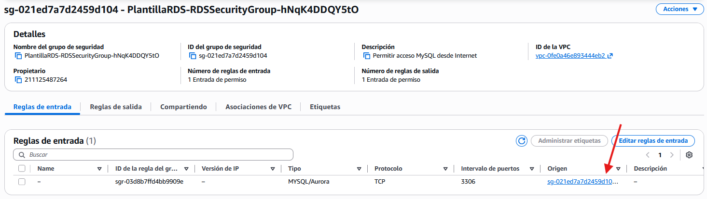{.cien .marco .margintop10 .marginbottom40 }  

- También podemos ver como ha quedado la configuración del grupo de seguridad de la instancia EC2.  
**Nota:** En la imagen podemos ver el nuevo grupo de seguridad y también el de la práctica anterior. 
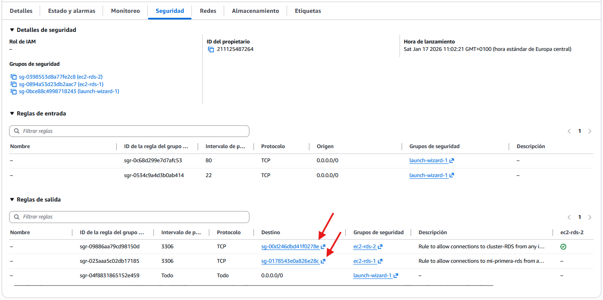{.cien .marco .margintop10 .marginbottom40 }  

- Accedemos a la instancia y nos conectamos a la base de datos desde **el punto de acceso escritor**.  
<mark>Realizar captura de pantalla</mark> 
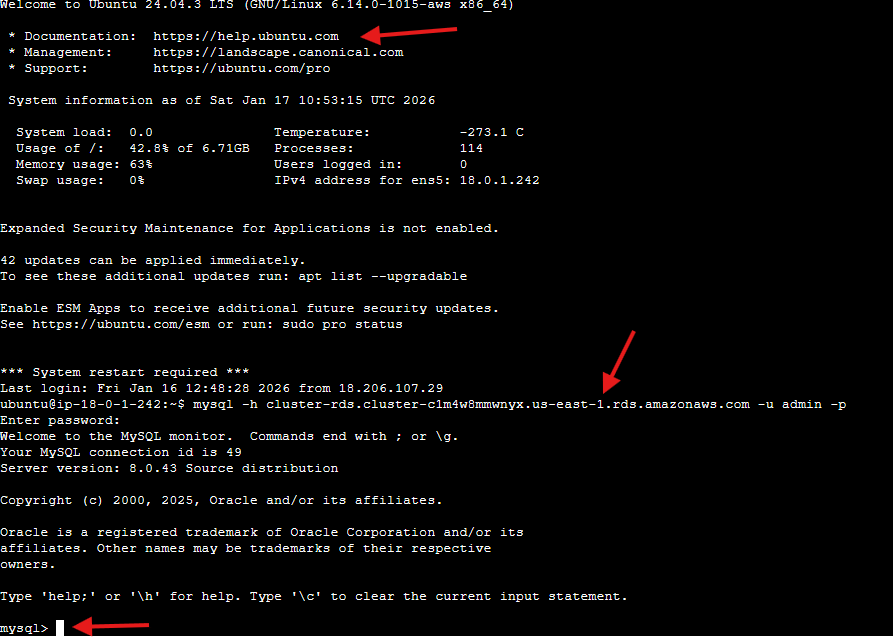{.sietecinco .margintop10 .marginbottom40 }  
Creamos una base de datos.  
<mark>Realizar captura de pantalla</mark> 
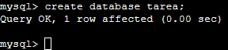{.treszero .margintop10 }  
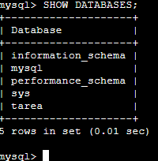{.doszero .marginbottom40 }  

- Si ahora accedemos desde **el punto de acceso lector** veremos que no podemos crear nada.  
<mark>Realizar captura de pantalla</mark> 
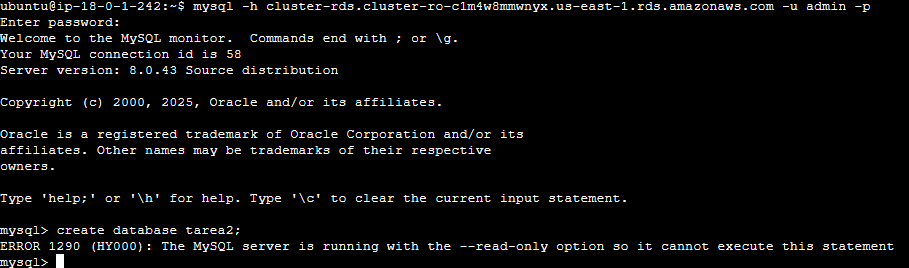{.sietecinco .margintop10 .marginbottom40 }  

- Si provocamos **un fallo del cluster RDS** veremos como AWS se encarga de cambiar la instancia escritora a otra instancia del cluster **sin modificar los puntos de conexión**. 
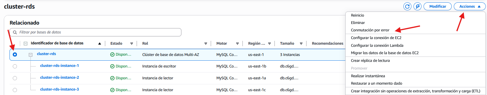{.cien .marco .margintop10 }  
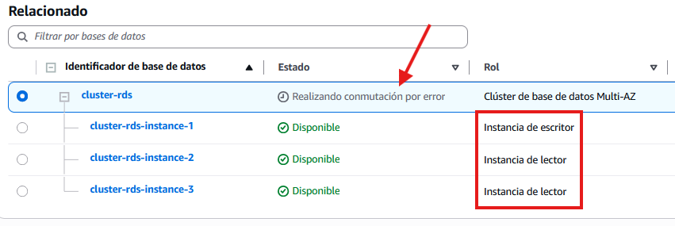{.cincozero .marco .marginbottom40 }
<mark>Realizar captura de pantalla</mark> 
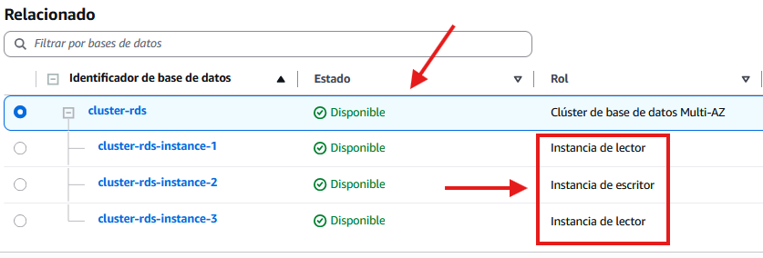{.cincozero .marco .margintop10 .marginbottom40 }  

!!! tip "¿Qué situaciones activan una conmutación por error?"
    El **failover** no solo ocurre cuando algo "explota". Se activa automáticamente ante:
    
    - Pérdida de disponibilidad en la zona de disponibilidad primaria.
    - Pérdida de conectividad de red con la instancia principal.
    - Fallo en el hardware de la unidad física.
    - Mantenimiento del sistema: Como cambios en el tipo de instancia o parches del sistema operativo (AWS realiza el failover para que el tiempo de inactividad sea mínimo).

    Cuando ocurre una conmutación por error, Amazon RDS cambia automáticamente la base de datos principal (primaria) a una instancia de respaldo (standby) ubicada en otra zona de disponibilidad. Esto sucede de forma transparente, minimizando el tiempo de inactividad. Durante este proceso, el tráfico de la base de datos se redirige a la nueva instancia primaria sin intervención del usuario. Después de la conmutación, la base de datos en la zona original se vuelve una instancia de respaldo y permanece en espera de posibles fallos futuros. Este enfoque asegura **alta disponibilidad y recuperación ante desastres** en entornos de producción.


!!! warning "Condiciones de entrega de la tarea RA4-CEb-1"
    1. Realizar capturas de pantalla de los puntos señalados.
    1. Comentar brevemente cada captura para entender a qué corresponde y subir el documento a la tarea correspondiente de AULES.
    1. Después de completar la tarea, **eliminar el cluster o restablecer inmediatamente el laboratorio**, al ser los costes del cluster **muy elevados**. 

---

#### **2.1.3 - Amazon RDS con Aurora**
!!! tip "Introducción:"  
**Amazon Aurora** es un motor de base de datos relacional compatible con **MySQL** y **PostgreSQL** diseñado específicamente para la nube. Se integra dentro del servicio gestionado **Amazon RDS**, facilitando la administración, el escalado y la seguridad de las bases de datos.
<br>

!!! tip "Ventajas Principales:"  

Al ser un motor nativo de AWS, Aurora ofrece beneficios superiores a las implementaciones tradicionales:

1. **Rendimiento:** Hasta 5 veces más rápido que MySQL estándar y 3 veces más que PostgreSQL.
1. **Coste-Efectividad:** Optimiza el uso de recursos mediante la separación de cómputo y almacenamiento.
1. **Alta Disponibilidad:**
    * Replica **6 copias de los datos** en 3 Zonas de Disponibilidad (AZ).
    * Soporta la pérdida de hasta 2 copias sin afectar la escritura.
1. **Backups Continuos:** Realiza copias de seguridad automáticas y constantes en **Amazon S3**, permitiendo la recuperación en cualquier punto del tiempo (PITR).

!!! tip "¿Por qué elegir Aurora sobre RDS MySQL estándar?"

1. **Almacenamiento Auto-escalable:** No es necesario pre-aprovisionar espacio; el almacenamiento crece automáticamente hasta 128 TiB (según la demanda).  
1. **Conmutación por failover rápida:** La conmutación por error se completa generalmente en menos de 30 segundos, mejorando la continuidad del negocio.
1. **Arquitectura de Lectura:** Permite hasta 15 réplicas con una latencia de replicación de milisegundos, ya que todas las instancias comparten el mismo volumen de almacenamiento virtual.
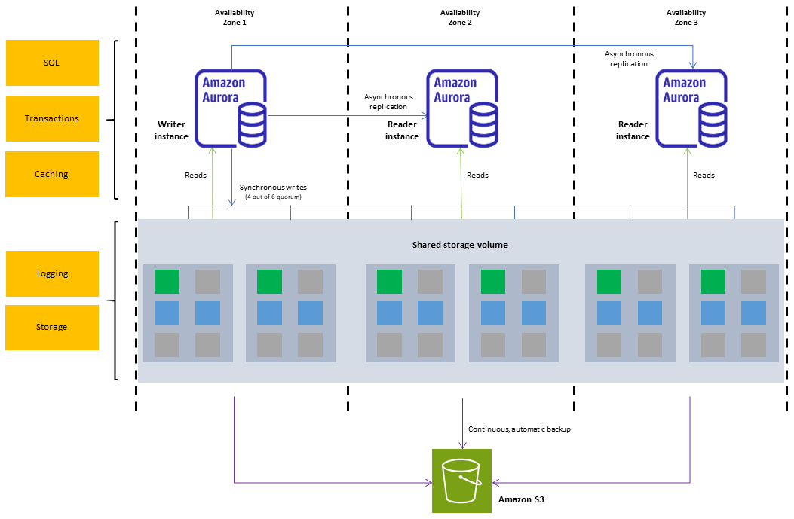{.cien .marco .margintop10 .marginbottom40 }  

!!! tip "Aurora aprovisionado"
En el modo aprovisionado, el usuario define el número y tipo de instancias que formarán el clúster de Aurora. Este modo es adecuado para cargas de trabajo predecibles y estables.  

**Características principales:**

- **Control total:** El usuario tiene control total sobre el número y tipo de instancias.
- **Escalado manual:** El usuario debe ajustar manualmente la capacidad según las necesidades.
- **Coste fijo:** Se paga por las instancias aprovisionadas, independientemente de su uso.

<br>
!!! tip "Aurora serverless"
Amazon Aurora Serverless es una variante de Aurora que funciona bajo demanda, es decir, sin necesidad de gestionar instancias fijas de base de datos.

**Características principales:**

- **Escalado automático:** Ajusta de forma automática la capacidad de cómputo, escalando hacia arriba si hay picos de tráfico y hacia abajo, llegando a “pausarse” si hay pocas consultas.
- **Pago por uso:** Solo se paga por la capacidad de cómputo que realmente se usa. Esta capacidad se mide en ACUs (Aurora Capacity Units).
- **Gestión simplificada:** No es necesario calcular el tamaño ni el número de instancias.

##### **2.1.3.1 - Despliegue de un clúster aprovisionado de Amazon RDS con Aurora** 
- **Selección del motor de la base de datos**.  
Seleccionamos **configuración completa**, **Aurora MySQL compatible**, dejamos la versión del motor por defecto y finalmente, elegimos la plantilla de **desarrollo y pruebas**.
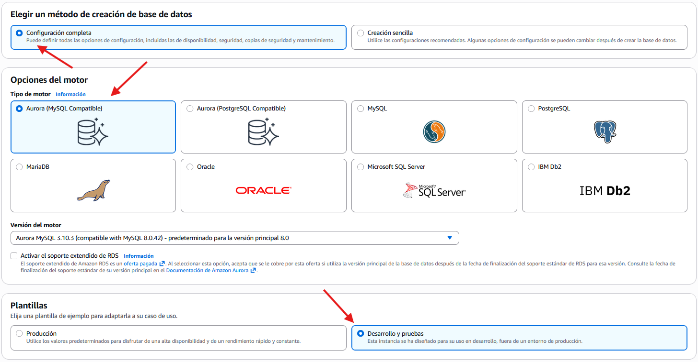{.cien .marco .margintop10 .marginbottom40 }  

- **Selección del motor de la base de datos** 
Identificamos nuestro cluster, seleccionamos **autoadministrado** e introducimos **una contraseña**.
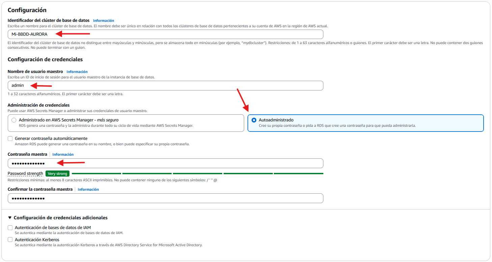{.cien .marco .margintop10 .marginbottom40 }  

- **Configuración del almacenamiento en clúster**.  
Dejamos la opción por defecto.
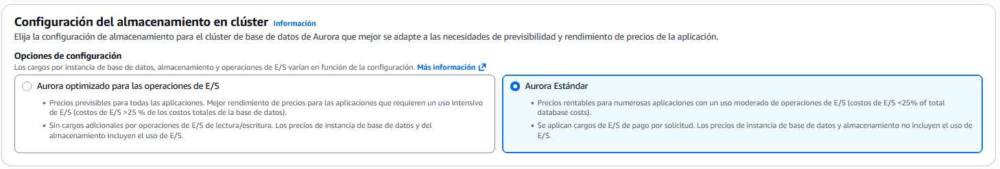{.cien .marco .margintop10 .marginbottom40 }  

- **Configuración de la instancia**  
Seleccionamos **clases ampliables** al ser instancias de rendimiento intermitente ideales para desarrollo, pruebas o cargas de trabajo con picos de tráfico ocasionales. Además, es posible aumentar la potencia de cálculo según sea necesario.
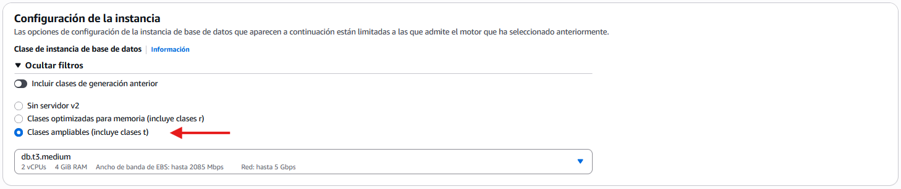{.cien .marco .margintop10 .marginbottom40 }  

- **Disponibilidad y durabilidad**  
Seleccionamos **creación de un nodo de lectura ...**. De esta manera, haremos un despliegue **MultiAZ**. Tendremos una instancia de lectura en otra zona de disponibilidad, lo cual nos permite tener alta disponibilidad y conmutación por error.
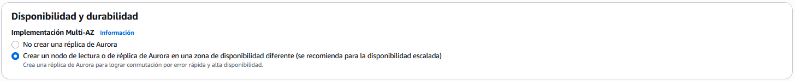{.cien .marco .margintop10 .marginbottom40 }  

- **Conectividad**  
Aprovechamos los recursos creados anteriormente...
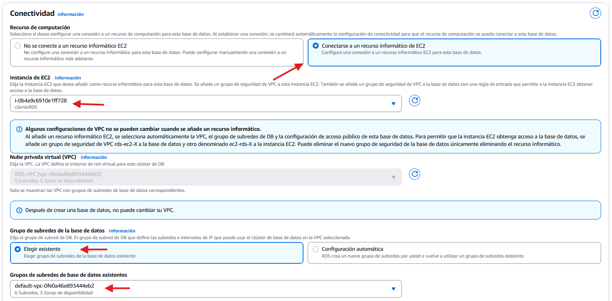{.cien .marco .margintop10 }  
Igualemente, reutilizamos el grupo de seguridad de la tarea anterior.  
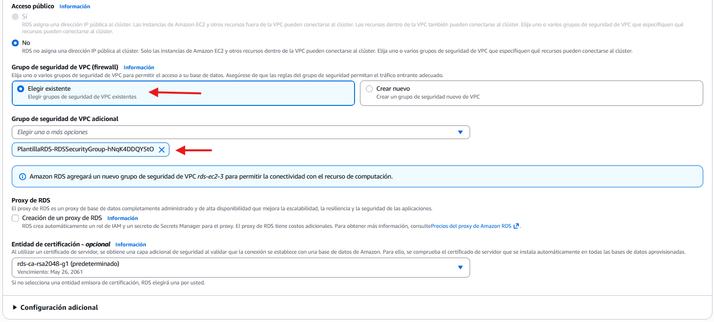{.cien .marco .margintop10 .marginbottom40 }  

- **Supervisión**  
No seleccionamos la **monitorización mejorada** (limitaciones del laboratory). 
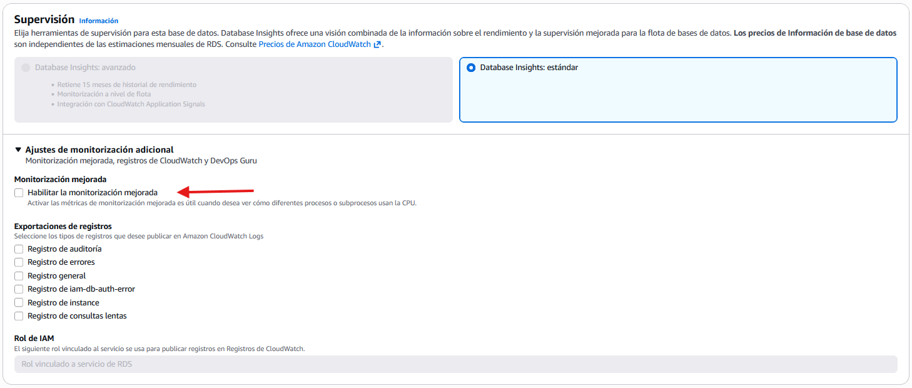{.cien .marco .margintop10 .marginbottom40 }  

- **Lanzamos la creación de nuestro cluster Aurora**
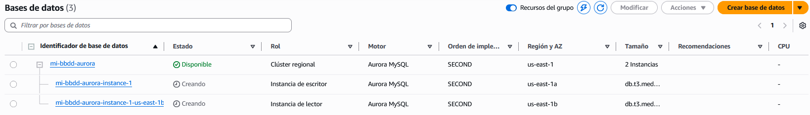{.cien .marco .margintop10 .marginbottom40 }  

##### **2.1.3.2 - Conexión a la base de datos** 
El clúster está formado por dos instancias (lector y escritor), tal y como lo hemos definido en las opciones de creación del clúster de Aurora.
Disponemos de 3 métodos para conectarnos al cluster:

- Fragmentos de código: Proporciona ejemplos de código en varios lenguajes de programación para conectarse a la base de datos.
- Cliente de línea de comandos (cloudshell): Instrucciones para conectarse utilizando herramientas como MySQL CLI.
- Puntos de conexión: Proporciona los endpoints para conectarse a las instancias de lectura y escritura.

En este caso, usaremos el tercer método (EC2 + Ubuntu).
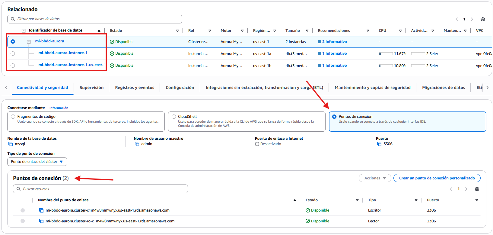{.cien .marco .margintop10 .marginbottom40 }  

Si nos intentamos conectar tendremos **un access denied**. Eso se debe a que no tenemos el SG del cluster Aurora configurado para aceptar conexiones entrantes.  
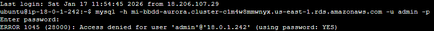{.sietecinco .margintop10   .marginbottom40 }  
Añadimos un regla para que solo acepte conexiones desde el grupo de seguridad de nuestra instancia EC2.
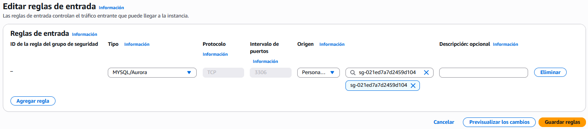{.cien .marco .margintop10 .marginbottom40 }  

Entonces, ya podremos conectarnos sin problemas.
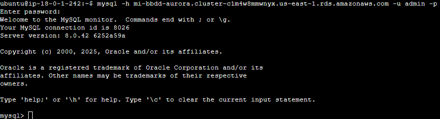{.sietecinco  .margintop10 .marginbottom40 }  


##### **2.1.3.3 – Escalado con Amazon Aurora**

Los clústeres de Amazon Aurora permiten escalar **el almacenamiento y la capacidad de cómputo de forma independiente**, lo que proporciona una gran flexibilidad y eficiencia operativa.

- **Escalado del almacenamiento (escalado horizontal)**  
El almacenamiento en Amazon Aurora es **autoescalable** y crece automáticamente en función de las necesidades de la base de datos, sin intervención del usuario, hasta un máximo de **100 TB**.  
No es necesario aprovisionar el almacenamiento por adelantado, y este es **compartido por todas las instancias del clúster** (instancia escritora y réplicas).
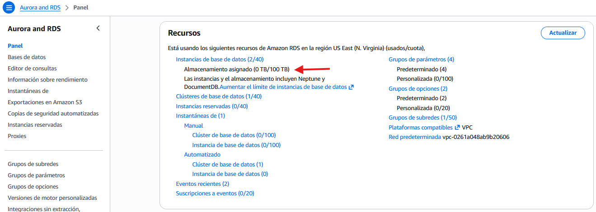{.sietecinco .marco .margintop10 .marginbottom40 }

- **Escalado de la capacidad de cómputo**

  - **Escalado vertical**  
    La capacidad de cómputo se puede aumentar o reducir modificando la **clase de instancia** de las instancias del clúster (por ejemplo, pasar de una instancia más pequeña a una más potente).  
    Esta operación puede realizarse, entre otros métodos, desde la consola de administración de AWS.
    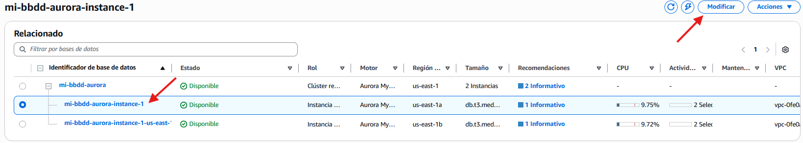{.cien .marco .margintop10  }

    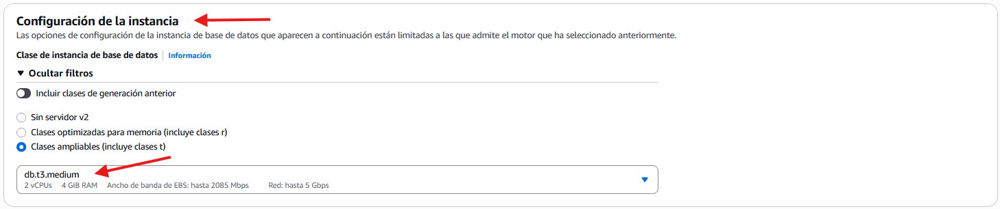{.cien .marco .marginbottom40 }

  - **Escalado horizontal de lectura**  
    Amazon Aurora permite añadir **réplicas de lectura** para distribuir la carga de consultas de lectura. Estas réplicas utilizan el mismo volumen de almacenamiento que la instancia principal y pueden escalar automáticamente según la demanda.
    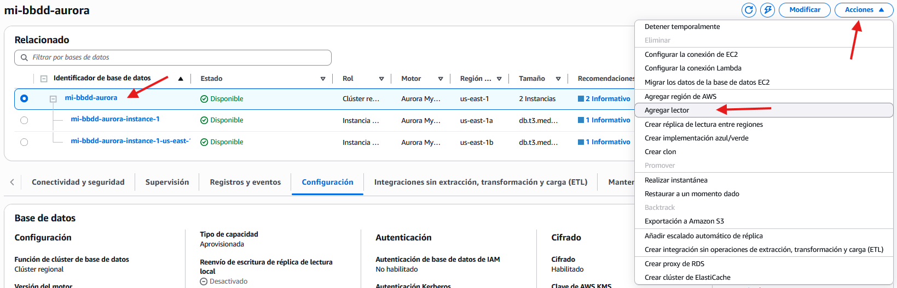{.cien .marco .marginbottom40 .margintop10 }
    Nombramos la nueva instancia de lectura.  
    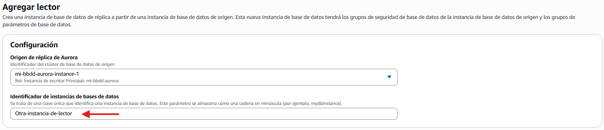{.cien .marco .marginbottom40 .margintop10 }
    Ajustamos su potencia de cómputo.   
    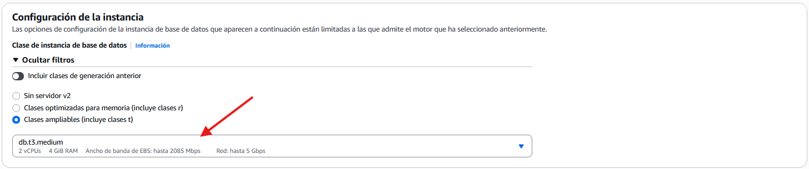{.cien .marco .marginbottom40 .margintop10 }
    Conectividad y zona (AZ) de despliegue.    
    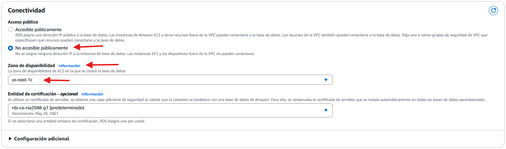{.cien .marco .marginbottom40 .margintop10}
    Por limitacion de ROL no seleccionamos **monitorización mejorada**.    
    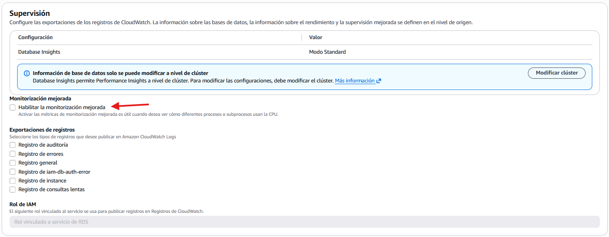{.cien .marco .marginbottom40 .margintop10 }
    Esperamos a que se despliegue la nueva instancia.
    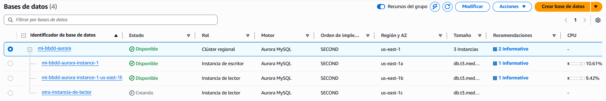{.cien .marco .marginbottom40 .margintop10}
    Aunque el clúster disponga de **dos instancias de lectura** y otra de **lectura / escritura**, Amazon Aurora proporciona únicamente **dos endpoints principales**:
      - Un **endpoint del clúster (writer endpoint)**, que apunta siempre a la instancia escritora.
      - Un **reader endpoint**, que distribuye automáticamente las conexiones de lectura **entre todas las réplicas disponibles**.
      De este modo, las aplicaciones no necesitan conocer ni gestionar las instancias de lectura de forma individual, ya que el balanceo se realiza de manera transparente por Aurora.
    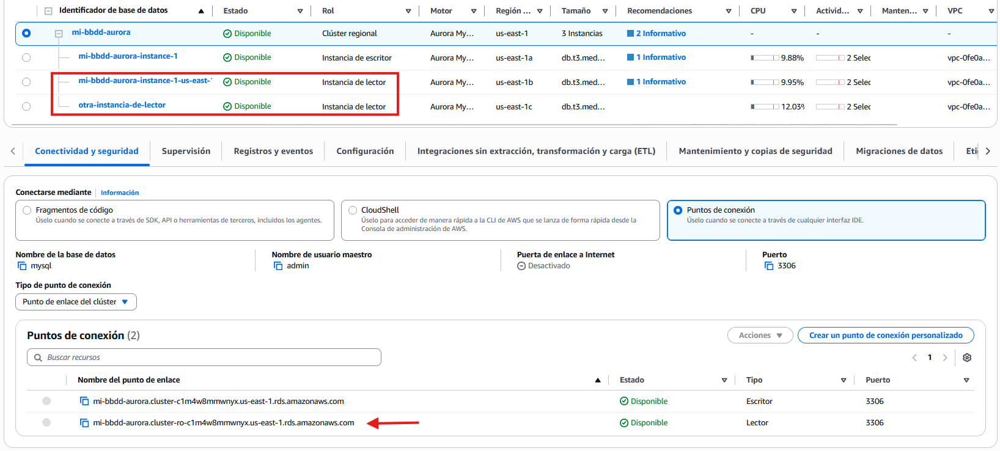{.cien .marco .marginbottom40 .margintop10}
    
  - **Aurora Serverless (opcional)**  
    En Aurora Serverless, la capacidad de cómputo escala automáticamente en función de la carga de trabajo, sin necesidad de gestionar instancias, utilizando unidades de capacidad de Aurora (ACU).


#### **2.1.4 - Tarea RA4-CEb-2**
En esta tarea, desplegaremos la instancia de Aurora RDS anterior y además haremos pruebas de estrés y analizaremos su comportamiento con **cloudWatch**.

#### **2.1.4.1 - Crear un panel de supervisión**
- Accedemos a la pestaña de supervisión.
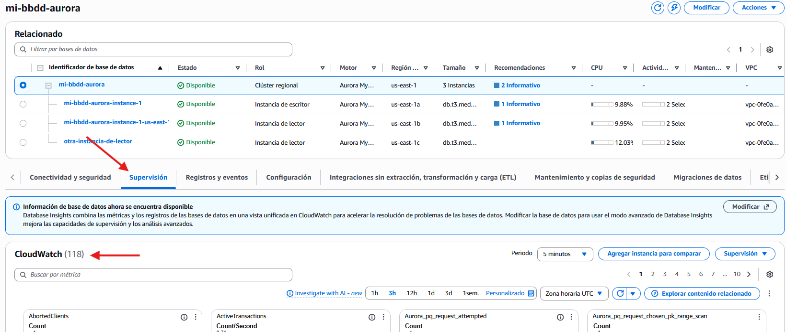{.cien .marco .marginbottom40 .margintop10}
- Pinchamos los **3 puntos verticales** y luego **añadir al panel**.
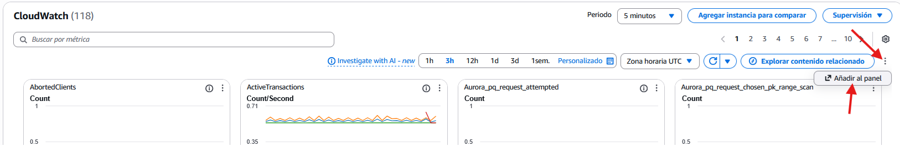{.cien .marco .marginbottom40 .margintop10}
- Como no tenemos ningún panel, creamos uno. 
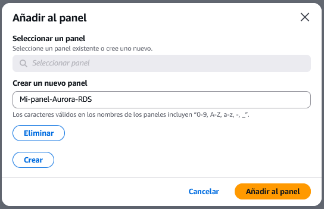{.cincozero .marginbottom40 .margintop10}
- Nos acordaremos de guardarlo una vez configurado. 
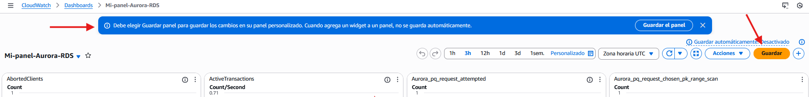{.cien .marginbottom40 .margintop10}
- Pulsamos en `+` y configuramos el widget. 
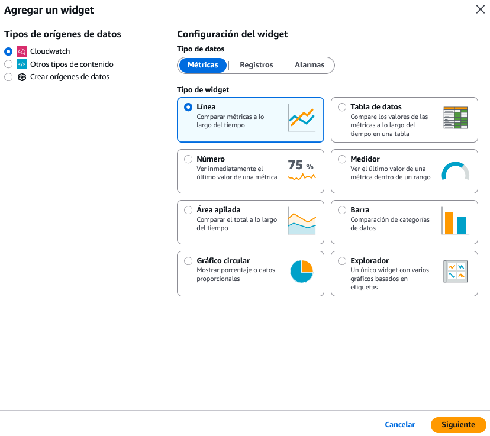{.cincozero .marginbottom40 .margintop10 .marco}
- Buscamos el **DatabaseConnections**.
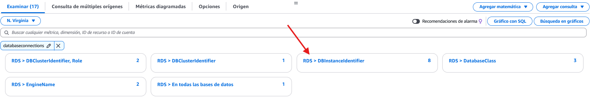{.cien .marginbottom40 .margintop10 .marco}
- Seleccionamos las instancias a supervisar y nos acordaremos de guardar el panel. 
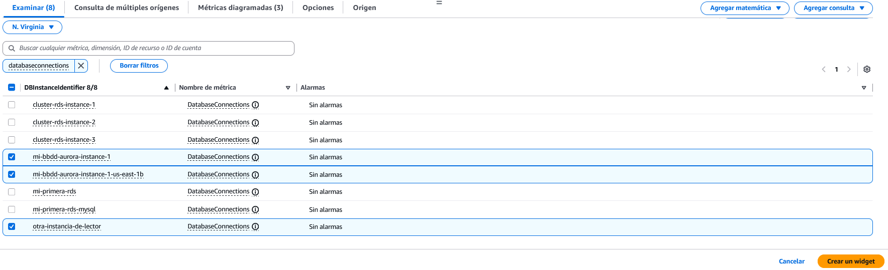{.cien .marginbottom40 .margintop10 .marco}
- Repetimos los pasos anteriores con **Queries**, **CPUUtilization**, **ReadIOPS** y **WriteIOPS**, quedando el panel de la siguiente manera.
<mark>Realizar captura de pantalla</mark>
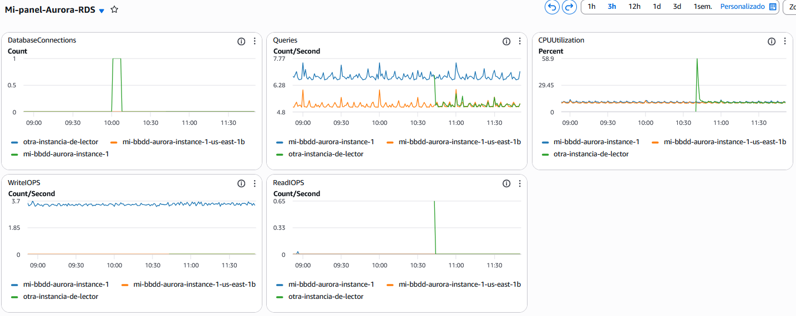{.cien .marginbottom40 .margintop10 .marco}


#### **2.1.4.2 - Estresando la base de datos**
- **mysqlslap**. Es una herramienta incluida en MySQL y es relativamente sencilla de utilizar.
    - :one: Nos conectamos a nuestra instancia y, caso de ubuntu, instalamos el CLI de AWS. 
    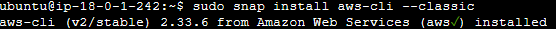{.sietecinco .marginbottom40 .margintop10}
    - :two: Subimos la base de datos [instituto.sql](./ut8/EURORA/instituto.sql) a **un bucket S3**. 
    - :three: Importamos el bucket a nuestra instancia EC2.  
    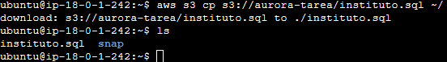{.sietecinco .marginbottom40 .margintop10}
    - :four: Accedemos a la base de datos.   
    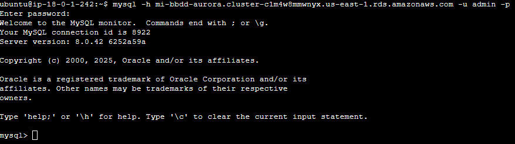{.sietecinco .marginbottom40 .margintop10}
    - :five: Creamos la base de datos mysqlslap.
    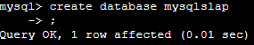{.trescinco .marginbottom40 .margintop10}
    - :six: Creamos la tabla **alumnos**.
    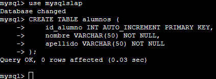{.trescinco .marginbottom40 .margintop10}
    - :seven: Llenamos la tabla **alumnos**.
    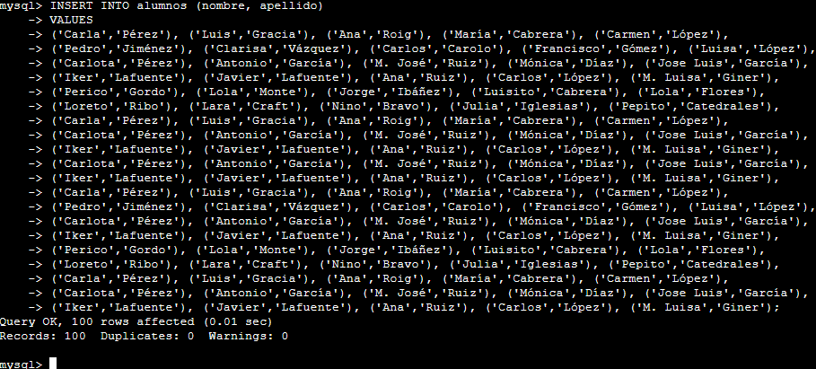{.sietecinco .marginbottom40 .margintop10}
    - :eight: Estresamos la base de datos (1/2).  
    Para ello usaremos el comando:
    ```bash
    mysqlslap -h <endpoint> -u admin -p \
    --concurrency=50 --iterations=200 --number-of-queries=1000 \
    --create-schema=msqlslap --query="SELECT * FROM alumnos;"
    ```
    Ejemplo de resultado.  
    <mark>Realizar captura de pantalla</mark>
    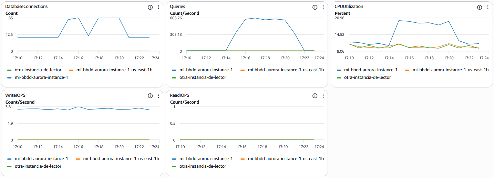{.cien .marginbottom40 .margintop10}
    - :nine: Estresamos la base de datos (2/2).  
    Ejemplo de resultado con:  
    ```bash
    mysqlslap -h <endpoint> -u admin -p \
    --concurrency=50 --iterations=200 --number-of-queries=2000 \ 
    --auto-generate-sql --auto-generate-sql-add-autoincrement \
    --auto-generate-sql-load-type=mixed --engine=innodb
    ```  
    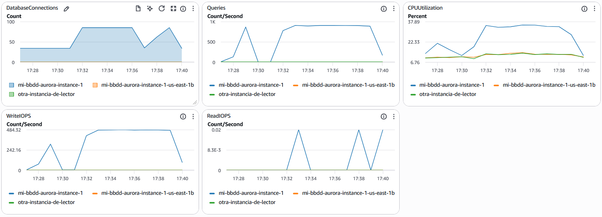{.cien .marginbottom40 .margintop10}
     
 
<!-- 
```sql    
INSERT INTO alumnos (nombre, apellido)
VALUES
('Carla','Pérez'), ('Luis','Gracia'), ('Ana','Roig'), ('María','Cabrera'), ('Carmen','López'),
('Pedro','Jiménez'), ('Clarisa','Vázquez'), ('Carlos','Carolo'), ('Francisco','Gómez'), ('Luisa','López'),
('Carlota','Pérez'), ('Antonio','García'), ('M. José','Ruiz'), ('Mónica','Díaz'), ('Jose Luis','García'),
('Iker','Lafuente'), ('Javier','Lafuente'), ('Ana','Ruiz'), ('Carlos','López'), ('M. Luisa','Giner'),
('Perico','Gordo'), ('Lola','Monte'), ('Jorge','Ibáñez'), ('Luisito','Cabrera'), ('Lola','Flores'),
('Loreto','Ribo'), ('Lara','Craft'), ('Nino','Bravo'), ('Julia','Iglesias'), ('Pepito','Catedrales'),
('Carla','Pérez'), ('Luis','Gracia'), ('Ana','Roig'), ('María','Cabrera'), ('Carmen','López'),
('Carlota','Pérez'), ('Antonio','García'), ('M. José','Ruiz'), ('Mónica','Díaz'), ('Jose Luis','García'),
('Iker','Lafuente'), ('Javier','Lafuente'), ('Ana','Ruiz'), ('Carlos','López'), ('M. Luisa','Giner'),
('Carlota','Pérez'), ('Antonio','García'), ('M. José','Ruiz'), ('Mónica','Díaz'), ('Jose Luis','García'),
('Iker','Lafuente'), ('Javier','Lafuente'), ('Ana','Ruiz'), ('Carlos','López'), ('M. Luisa','Giner'),
('Carla','Pérez'), ('Luis','Gracia'), ('Ana','Roig'), ('María','Cabrera'), ('Carmen','López'),
('Pedro','Jiménez'), ('Clarisa','Vázquez'), ('Carlos','Carolo'), ('Francisco','Gómez'), ('Luisa','López'),
('Carlota','Pérez'), ('Antonio','García'), ('M. José','Ruiz'), ('Mónica','Díaz'), ('Jose Luis','García'),
('Iker','Lafuente'), ('Javier','Lafuente'), ('Ana','Ruiz'), ('Carlos','López'), ('M. Luisa','Giner'),
('Perico','Gordo'), ('Lola','Monte'), ('Jorge','Ibáñez'), ('Luisito','Cabrera'), ('Lola','Flores'),
('Loreto','Ribo'), ('Lara','Craft'), ('Nino','Bravo'), ('Julia','Iglesias'), ('Pepito','Catedrales'),
('Carla','Pérez'), ('Luis','Gracia'), ('Ana','Roig'), ('María','Cabrera'), ('Carmen','López'),
('Carlota','Pérez'), ('Antonio','García'), ('M. José','Ruiz'), ('Mónica','Díaz'), ('Jose Luis','García'),
('Iker','Lafuente'), ('Javier','Lafuente'), ('Ana','Ruiz'), ('Carlos','López'), ('M. Luisa','Giner');
```
 -->

- **Sysbench**. Es una herramienta más completa que mysqlslap que permite también generar carga de lectura y escritura sobre una base de datos.
    - :one: Instalación. En distribuciones como **Ubuntu** ya viene integrada. Nos aseguraremos de ternerla instalada con:
    ```bash
    sysbench --version  
    ```
    Si no está instalada, lo haremos con:
    ```bash
    sudo apt install -y sysbench  
    ```

    - :two: Estresar la base de datos.  
    **Nota**: **Sysbench** no puede sobreescribir datos ya existentes así que, primero, eliminaremos la base de datos con **drop** y luego la crearemos de nuevo con **create**.
    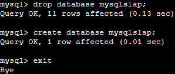{.trescinco .marginbottom40 .margintop10}
    Para las pruebas de estrés usaremos el siguiente script:
    ```bash
    sysbench /usr/share/sysbench/oltp_read_write.lua \
      --mysql-host=<endpoint> \
      --mysql-user=admin \
      --mysql-password=<password> \
      --mysql-db=mysqlslap \
      --tables=100 \
      --table-size=100000 \
      prepare
    ```
     
    <mark>Realizar captura de pantalla</mark>
    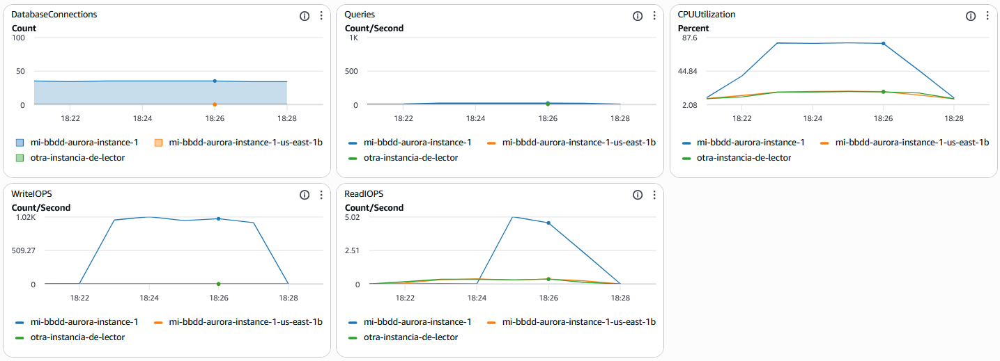{.cien .marginbottom40 .margintop10}

!!! warning "Condiciones de entrega de la tarea RA4-CEb-1"
    1. Realizar capturas de pantalla de los puntos señalados.
    1. Comentar brevemente cada captura para entender a qué corresponde y subir el documento a la tarea correspondiente de AULES.
    1. Después de completar la tarea, **eliminar el cluster o restablecer inmediatamente el laboratorio**, al ser los costes del cluster **muy elevados**. 

### **2.2 - Bases de datos NoSQL: Amazon DynamoDB**

Amazon DynamoDB es una base de datos NoSQL (Not only SQL) totalmente gestionada por AWS, orientada a modelos clave-valor y documental.  
Está diseñada para ofrecer latencias de milisegundos de un solo dígito, independientemente del tamaño de los datos o del volumen de tráfico.

DynamoDB es un **servicio serverless**, por lo que el usuario no gestiona servidores, clústeres ni nodos. La escalabilidad, la replicación y la alta disponibilidad son gestionadas automáticamente por AWS.

Entre sus principales características se encuentran:

- Es una base de datos NoSQL (Not Only SQL) de tipo clave-valor y documentos.
- Ofrece escalabilidad horizontal automática, ajustando la capacidad según la carga de trabajo sin intervención del usuario.
- Proporciona alta disponibilidad y durabilidad, replicando los datos automáticamente en múltiples zonas de disponibilidad (AZ) dentro de una región.
- Tiene un SLA del 99.99% para tablas regionales, que puede alcanzar el 99.999% cuando se utilizan Global Tables.
- Utiliza un modelo de pago por uso, basado principalmente en:
    - Capacidad de lectura y escritura (modo bajo demanda u aprovisionado).
    - Almacenamiento de datos.
    - Transferencia de datos y características adicionales (streams, backups, etc.).

En DynamoDB, los datos se organizan de la siguiente forma:

- Una tabla es una colección de elementos (items).
- Un item es una colección de atributos.
- Un atributo es un par clave-valor.

Cada tabla debe definir una clave primaria, que puede ser:

- Clave simple: formada únicamente por una clave de partición.
- Clave compuesta: formada por una clave de partición y una clave de clasificación (sort key).

DynamoDB permite crear índices secundarios globales (GSI), que habilitan consultas eficientes utilizando atributos distintos de la clave primaria. Estos índices tienen su propia clave de partición y, opcionalmente, clave de clasificación.


---

#### **2.2.1 - Tipos de datos en DynamoDB**
DynamoDB soporta distintos tipos de datos. Todos los atributos deben declararse de forma explícita indicando su tipo.

!!! tip "Tipos escalares"
Representan un único valor y pueden ser de los siguientes tipos:

- **Number (N):** Valores numéricos, enteros o decimales (se almacenan como texto).
```json
"Edad": { "N": "38" }
```
- **String (S):** cadenas de texto Unicode.
```json
"Nombre": { "S": "Carla" }
```
- **Binary (B):** Datos binarios codificados en Base64.
```json   
"Imagen": { "B": "bXkgc3VwZXIgc64jcmV0IHRlehrsh" }
```
- **Boolean (BOOL):** valores booleanos.
```json
"Beca": { "BOOL": false }
```

- **Null (NULL):** Valor nulo.
```json
"Direccion": { "NULL": true }
```

!!! tip "Tipos compuestos"
Representan colecciones de valores y pueden ser de los siguientes tipos:

- **List (L):** Lista ordenada de valores, que pueden ser de distintos tipos.
```json                     
"Prestados": {
  "L": [
    { "S": "Libro" },
    { "N": "23" }
  ]
}
```

- **Map (M):** Conjunto de pares clave-valor que permite estructuras anidadas.
```json
"Hijos": {
  "M": {
    "Marc": {
      "M": {
        "Relacion": { "S": "Hijo" },
        "Edad": { "N": "12" }
      }
    },
    "Ana": {
      "M": {
        "Relacion": { "S": "Hija" },
        "Edad": { "N": "7" },
        "ColorPelo": { "S": "Rubio" }
      }
    }
  }
}

```


!!! tip "Tipos de conjuntos (Sets)"
Representan colecciones no ordenadas de **valores únicos** (no permiten duplicados) del mismo tipo. Pueden ser de los siguientes tipos:

- **String set (SS):** Lista de strings.
```json
"Hijos": { "SS": ["Marc", "Ana"] }
```

- **Number set (NS):** Lista de números.
```json
"Numeros": { "NS": [ "2256", "4545" ] }
```

- **Binary set (BS):** Lista de valores binarios.
```pynamodb
"Imagenes": {
  "BS": [
    "aGVsbG93b3JsZA==",
    "c2VjcmV0cw=="
  ]
}
```

#### **2.2.2 - Tablas en DynamoDB**
DynamoB almacena la información en tablas. Esas tablas están formadas por ítems (filas) y atributos (columnas), pero no tiene un esquema rígido como una base de datos relacional.

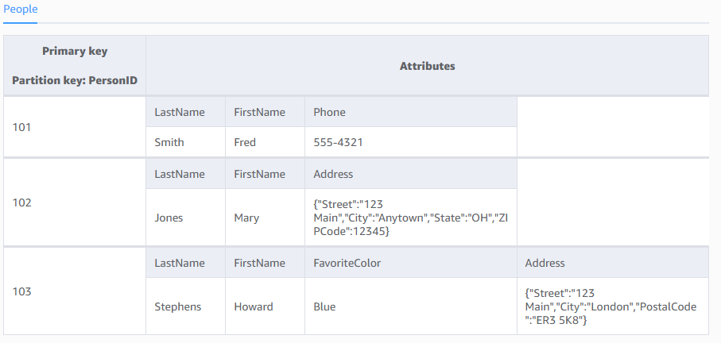{.sietecinco .marginbottom40 .margintop10}

En DynamoDB, una tabla es la unidad principal de almacenamiento de datos, algo parecido a una tabla en una base de datos relacional, pero con diferencias importantes:

- Los ítems tienen sus propios atributos: No es necesario que todos los ítems tengan los mismos atributos.

#### **2.2.3 - Claves principales en DynamoDB**
**DynamoDB soporta 2 tipos de claves principales**: 

- Clave de partición (partition key) de **un único atributo** que determina dónde se almacena el ítem. Todos los datos con la misma clave de partición se almacenan juntos, lo que hace que la recuperación de una sola partición sea extremadamente rápida.
- Clave de partición y de ordenamiento (**partition key + sort key**), también conocida como clave principal compuesta. La clave de ordenación se utiliza para ordenar los datos dentro de la partición. Se puede utilizar para almacenar los datos en el orden en que es probable que se recuperen.
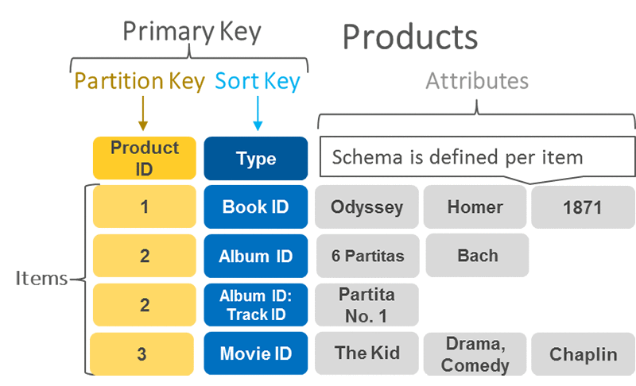{.cincozero .marginbottom40 .margintop10}

#### **2.2.4 - Índices secundarios**
Una tabla de DynamoDB puede contener dos tipos de índices secundarios (GSI y LSI) que permiten hacer consultas alternativas a la clave primaria.  
Cada tabla de DynamoDB admite hasta 20 GSIs y 5 LSIs por defecto.

- **Índice secundario global (GSI)**:  
Un GSI es un índice con una clave de partición y una clave de ordenación que pueden diferir de las claves de la tabla base. Puede crearse durante la creación de la tabla o posteriormente. En modo de capacidad aprovisionada, el GSI tiene su propia capacidad de lectura y escritura, lo que permite aislar costes y patrones de acceso.

- **Índice secundario local (LSI):**  
Un LSI comparte la misma clave de partición que la tabla base, pero define una clave de ordenación diferente. **Debe crearse en el momento de la creación de la tabla** y utiliza la capacidad de la tabla base.

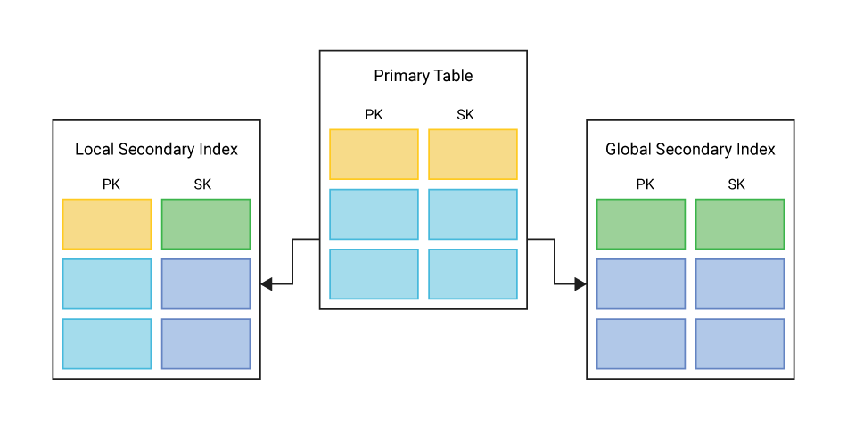{.sietezero .marginbottom40 }

!!! tip "Ejemplo práctico"
Disponemos de una tabla sobre la que vamos a realizar una consulta de todas las puntuaciones para el product:id = 99999
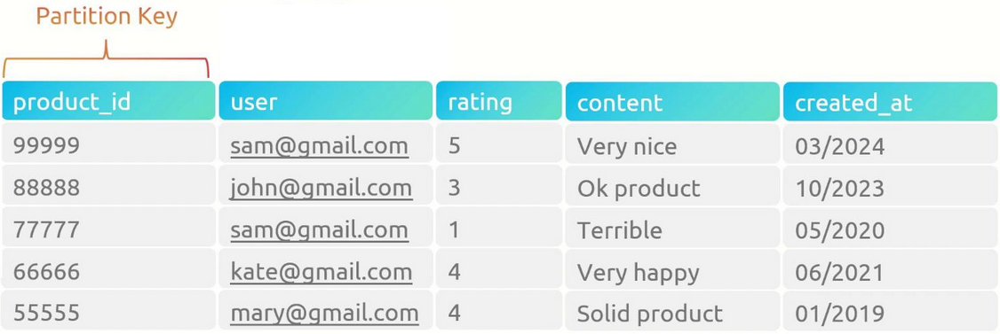{.sietezero .marginbottom40 .margintop10}

Si queremos afinar más la consulta, filtraremos también por la clave de ordenación **user**.
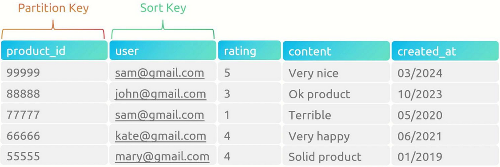{.sietezero .marginbottom40 .margintop10}

Si ahora deseamos recuperar todas las puntuaciones de **un usuario especifico (sam@gmail.com)**, tendremos que **escanear toda la tabla** y **filtrar** por sam@gmail.com, lo que resulta poco eficiente, sobre todo si la tabla tiene un tamaño considerable.  
**Índice secundario local (LSI)**, permite usar otra clave de ordenación, lo que proporciona una manera eficiente de realizar la consulta.
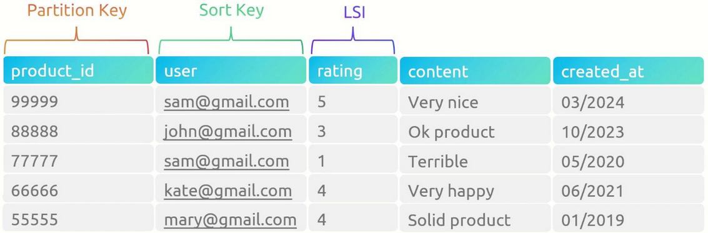{.sietezero .marginbottom40 .margintop10}

Si ahora deseamos realizar una consulta sobre un atributo que no está incluido en la clave primaria utilizaremos un **índice secundario global (GSI)**. El GSI nos permite crear una configuración de clave primaria totalmente nueva y poder realizar las consultas de manera eficiente.   
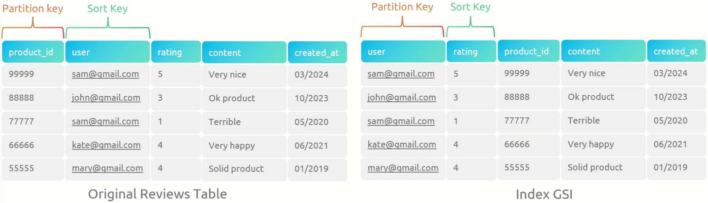{.cien .marginbottom40 .margintop10}

#### **2.2.5 - Operaciones de lectura y escritura en DynamoDB**

!!! tip "Operaciones de lectura"
En DynamoDB disponemos de las siguientes operaciones de lectura:

- **GetItem** → Obtiene un único ítem a partir de su clave primaria (partition key y sort key, si existe).
- **BatchGetItem** → Obtiene varios ítems de una o más tablas en una sola llamada (hasta 100 ítems por lote).
- **Query** → Recupera ítems que comparten el mismo valor de la partition key y permite aplicar condiciones sobre la sort key. Es una operación altamente eficiente y escalable cuando el modelo de datos está correctamente diseñado.
- **Scan** → Recorre toda la tabla o un índice y devuelve todos los ítems. Aunque admite filtros, estos se aplican después de la lectura, por lo que la operación consume capacidad de lectura por todos los ítems leídos, incluso los que no cumplen el filtro. Por este motivo, su uso está desaconsejado en entornos de producción.

!!! tip "Operaciones de escritura"
DynamoDB ofrece las siguientes operaciones de escritura:

- **PutItem** → Inserta un nuevo ítem o reemplaza completamente uno existente con la misma clave primaria.
- **UpdateItem** → Actualiza atributos de un ítem existente sin necesidad de sobrescribirlo por completo (permite incrementar valores, añadir o eliminar atributos).
- **DeleteItem** → Elimina un ítem a partir de su clave primaria.
- **BatchWriteItem** → Inserta o elimina múltiples ítems en una sola llamada (hasta 25 operaciones por lote). Esta operación solo admite PutItem y DeleteItem, no actualizaciones parciales.

#### 2.2.6 - Creación de una tabla DynamoDB en AWS.
- Vamos a la consola de administración de AWS, seleccionamos **DynamoDB** y pinchamos en **Crear tabla**.
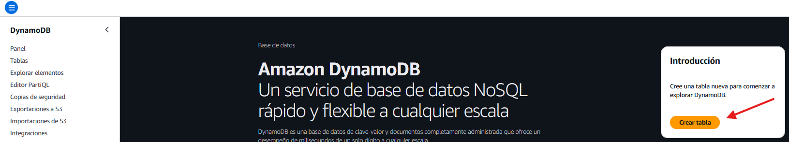{.cien .marginbottom40 .margintop10 .marco}
- Definimos el nombre de la tabla y la clave primaria. En este caso, usaremos una clave compuesta formada por **idAlumno** (partition key) y **asignatura** (sort key).
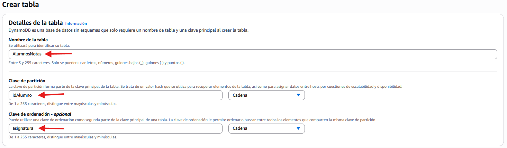{.cien .marginbottom40 .margintop10 .marco}
- Dejamos el resto de opciones con los valores por defecto y creamos la tabla.
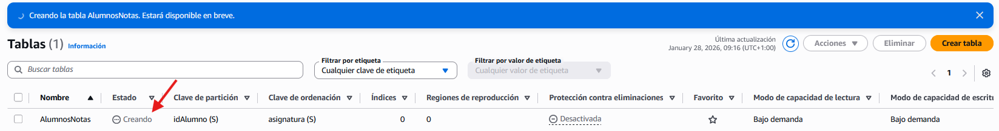{.cien .marginbottom40 .margintop10 .marco}
- Después de unos segundos, la tabla estará creada y lista para usarse.
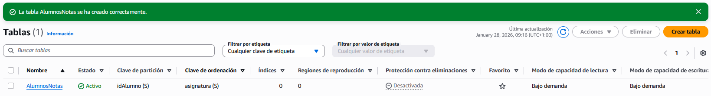{.cien .marginbottom40 .margintop10 .marco}
- Una vez creada la tabla, meteremos algunos datos. Seleccionamos nuestra tabla y pulsamos **Explorar los elementos de la tabla**. 
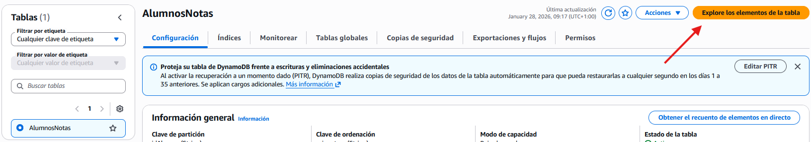{.cien .marginbottom40 .margintop10 .marco}
- Pulsamos en **Crear elemento**.
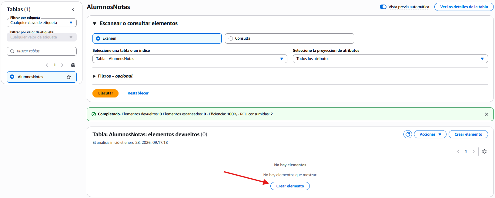{.cien .marginbottom40 .margintop10 .marco}
- En el editor JSON, pegamos los siguientes datos de ejemplo y pulsamos en **Guardar** (**cuidado con el formato de datos**).
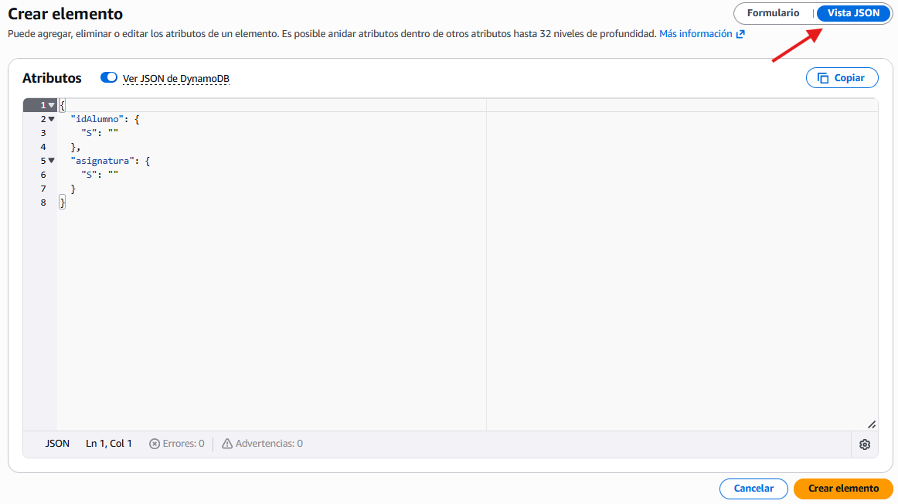{.cien .marginbottom40 .margintop10 .marco}
```json
{"idAlumno": "A001", "asignatura": "Historia", "nota": 9.0, "profesor": "Miguel"}
{"idAlumno": "A001", "asignatura": "Inglés", "nota": 8.5, "profesor": "Ruth"}
{"idAlumno": "A001", "asignatura": "Lengua", "nota": 9.5, "profesor": "Andrés"}
{"idAlumno": "A001", "asignatura": "Matemáticas", "nota": 10, "profesor": "Sara"}
{"idAlumno": "A002", "asignatura": "Historia", "nota": 6.7, "profesor": "Miguel"}
{"idAlumno": "A002", "asignatura": "Lengua", "nota": 6.2, "profesor": "Andrés"}
{"idAlumno": "A002", "asignatura": "Matemáticas", "nota": 7.5, "profesor": "Sara"}
{"idAlumno": "A003", "asignatura": "Historia", "nota": 6.3, "profesor": "Miguel"}
{"idAlumno": "A003", "asignatura": "Inglés", "nota": 8.5, "profesor": "Ruth"}
{"idAlumno": "A003", "asignatura": "Lengua", "nota": 7.5, "profesor": "Carla"}
```
- Una vez insertados los datos, podremos verlos en la tabla.
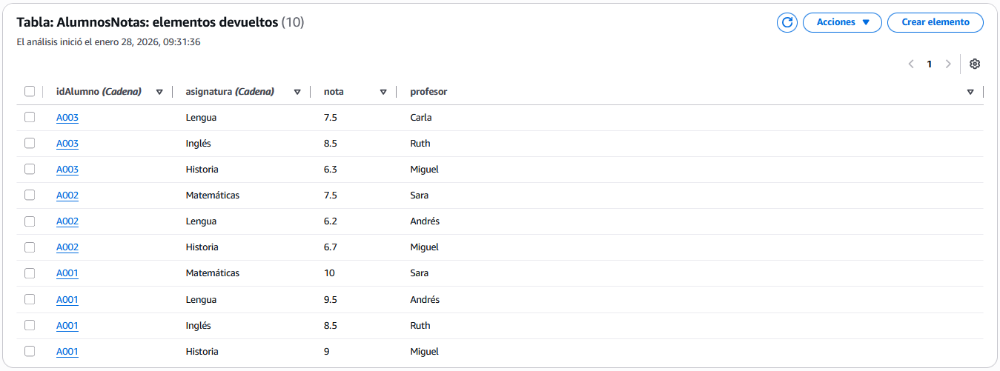{.cien .marginbottom40 .margintop10 .marco}
- Como podemos ver, crear a mano una tabla en DynamoDB solo es factible para tablas pequeñas. Para tablas más grandes, usaremos scripts o aplicaciones que interactúen con la API de DynamoDB.  
Si deseamos importar una tabla podemos usar la opción de **importación desde S3**.
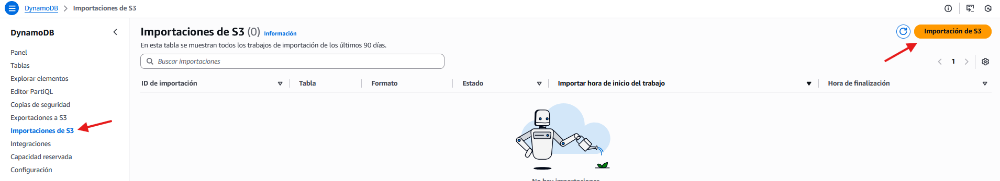{.cien .marginbottom40 .margintop10 .marco}

#### 2.2.7 - Primeras consultas en la base de datos
- Si vamos a **explore los elementos de la tabla** veremos que hay dos operaciones que podemos realizar para consultar **Examen
(Scan)** y **Consulta (Query)**, que son las típicas que se pueden realizar sobre una tabla no relacional.
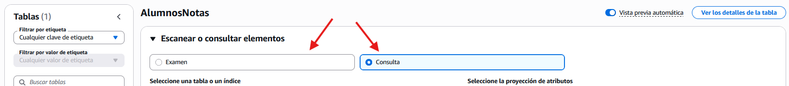{.cien .marginbottom40 .margintop10 .marco}
- Podemos probar las opciones de Examinar (scan), que nos devolverá todos los registros de la tabla y de Consultar (query), que nos permite recuperar algunos registros aplicando ciertas restricciones.  
Recordemos que la operación scan está desaconsejada porque se realiza el envío de los datos de toda la tabla, aunque apliquemos algún filtro.
- Para hacer una consulta (query) podemos aplicar algunas restricciones sobre la clave de partición (si tiene algún valor en concreto) y sobre la clave de ordenación.
- En esta tabla solo hemos creado un índice, la clave primaria, formada por la clave de partición (idAlumno) y la clave de ordenación (asignatura). Podríamos crear un GSI (Global Secondary Index) para poder hacer búsquedas por profesor, o crear un GSI para hacer búsquedas por asignatura, todo depende de los casos de uso que tenga para esta tabla. 
- En la siguiente captura se indican los pasos para crear el **GSI de la asignatura**. En la pestaña **índices** de la tabla, hacemos clic en **crear índice**.  
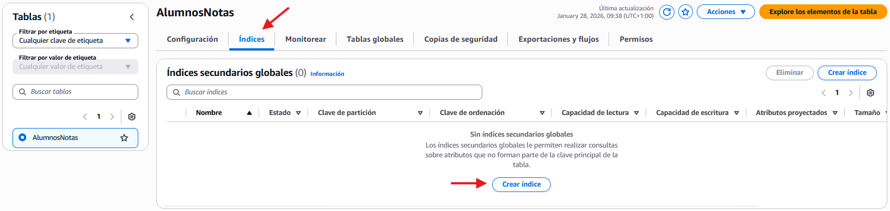{.cien .marginbottom40 .margintop10 .marco}
- Definimos el nombre del índice e introducimos la clave primaria del índice y la clave de ordenación. 
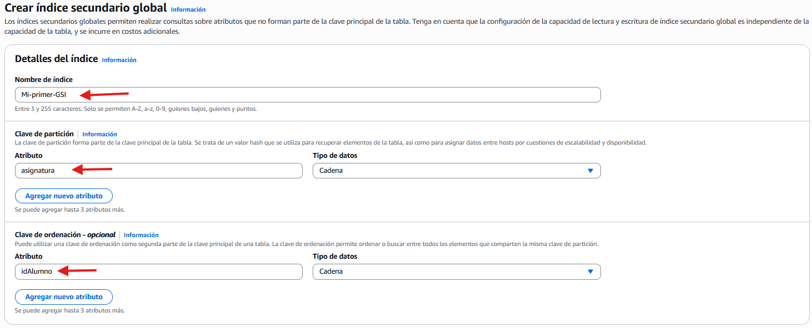{.cien .marginbottom40 .margintop10 .marco}
-  En Proyecciones de atributos elegimos All pero, hay que tener cuidado con esto. **Elegir ALL** en la proyección de atributos de un índice secundario copia todos los atributos de la tabla al índice, lo que puede generar una gran duplicación de datos, aumentar costes de almacenamiento y consumo de capacidad, especialmente en tablas grandes con muchos atributos. Por ello debe usarse con cuidado. 
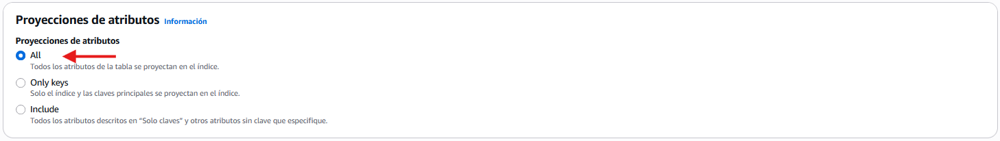{.cien .marginbottom40 .margintop10 .marco}
- Después de unos segundos, el índice estará creado y listo para usarse.
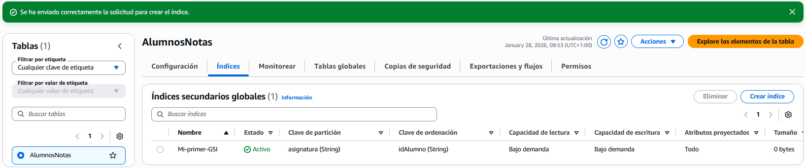{.cien .marginbottom40 .margintop10 .marco}
- Si ahora vamos a **explorar los elementos de la tabla** y creamos una consulta, vemos que la podemos hacerla sobre la tabla original o sobre el GSI que acabamos de crear. Esto nos va a permitir hacer consultas sobre la partición **idAlumno** y **filtros sobre la asignatura** (Clave Primaria) **o sobre la partición asignatura**, aplicando filtros sobre **idAlumno**, gracias al GSI nuevo.
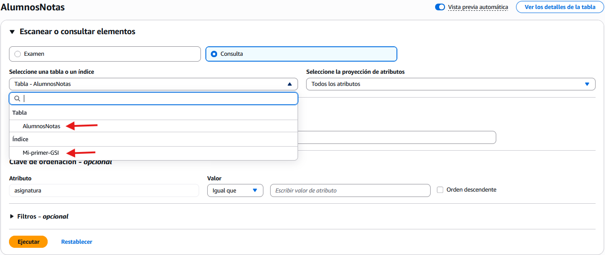{.cien .marginbottom40 .margintop10 .marco}
- Ejecutamos una consulta.  
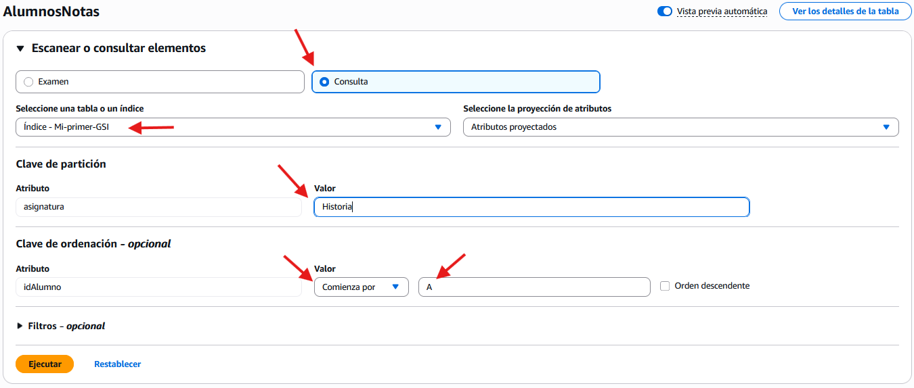{.cien .marginbottom40 .margintop10 .marco}
- Obtendremos el siguiente resultado.  
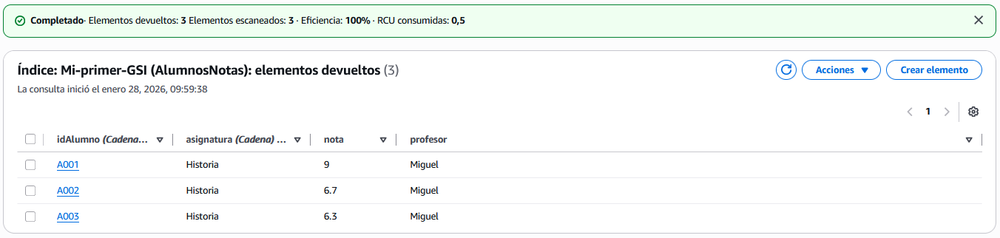{.cien .marginbottom40 .margintop10 .marco}

#### 2.2.8 - NoSQL Worbench
NoSQL Workbench es una aplicación gráfica para diseñar, modelar y consultar bases de datos DynamoDB. Proporciona una interfaz visual para crear tablas, definir esquemas y realizar consultas sin necesidad de escribir código.

- Descargamos la aplicación desde [aquí](https://docs.aws.amazon.com/es_es/amazondynamodb/latest/developerguide/workbench.settingup.html) e instalamos.
- Abrimos la aplicación y creamos una nueva conexión a DynamoDB.
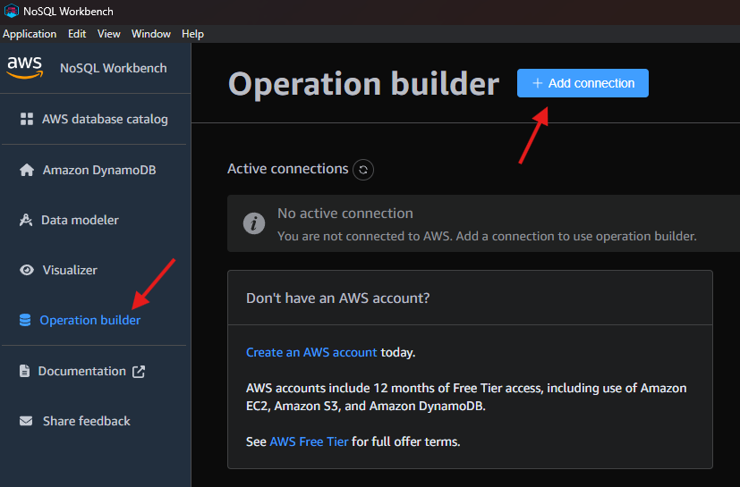{.cincozero .marginbottom40 .margintop10 }
- Introducimos las credenciales de AWS disponibles en el laboratory (no es necesario poner el ROL IAM) y pinchamos en **Connect**
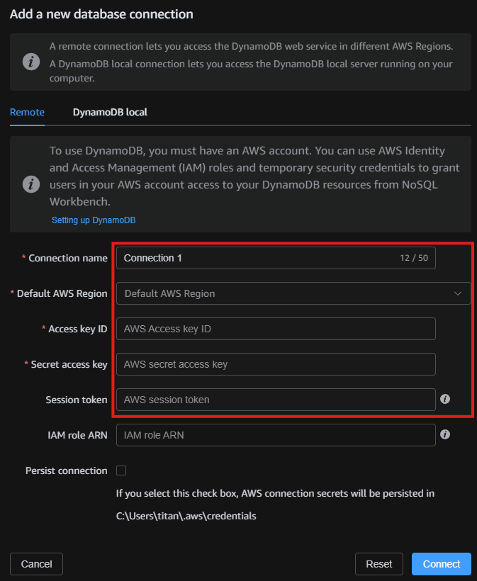{.cincozero .marginbottom40 .margintop10 }
- Si todo ha ido bien, no aparecerá la conexión...
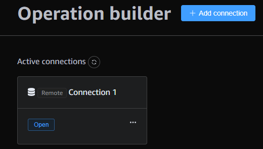{.trescinco .marginbottom40 .margintop10 }
- ... y podremos acceder a la tabla desde la aplicación local, sin necesidad de estar conectados a AWS.
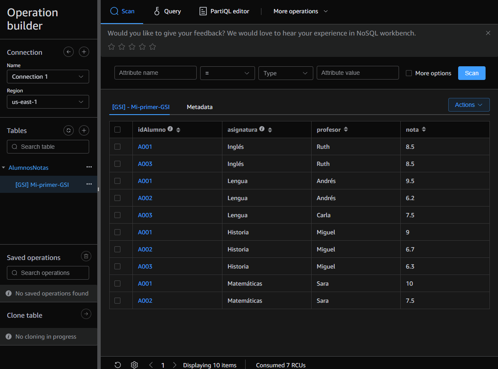{.sietecinco .marginbottom40 .margintop10 }


<!-- {
  "idAlumno": {"S": "A001"},
  "asignatura": {"S": "Historia"},
  "nota": {"N": "9.0"},
  "profesor": {"S": "Miguel"}
},
{
  "idAlumno": {"S": "A001"},
  "asignatura": {"S": "Inglés"},
  "nota": {"N": "8.5"},
  "profesor": {"S": "Ruth"}
},
{
  "idAlumno": {"S": "A001"},
  "asignatura": {"S": "Lengua"},
  "nota": {"N": "9.5"},
  "profesor": {"S": "Andrés"}
},
{
  "idAlumno": {"S": "A001"},
  "asignatura": {"S": "Matemáticas"},
  "nota": {"N": "10"},
  "profesor": {"S": "Sara"}
},
{
  "idAlumno": {"S": "A002"},
  "asignatura": {"S": "Historia"},
  "nota": {"N": "6.7"},
  "profesor": {"S": "Miguel"}
},
{
  "idAlumno": {"S": "A002"},
  "asignatura": {"S": "Lengua"},
  "nota": {"N": "6.2"},
  "profesor": {"S": "Andrés"}
},
{
  "idAlumno": {"S": "A002"},
  "asignatura": {"S": "Matemáticas"},
  "nota": {"N": "7.5"},
  "profesor": {"S": "Sara"}
},
{
  "idAlumno": {"S": "A003"},
  "asignatura": {"S": "Historia"},
  "nota": {"N": "6.3"},
  "profesor": {"S": "Miguel"}
},
{
  "idAlumno": {"S": "A003"},
  "asignatura": {"S": "Inglés"},
  "nota": {"N": "8.5"},
  "profesor": {"S": "Ruth"}
},
{
  "idAlumno": {"S": "A003"},
  "asignatura": {"S": "Lengua"},
  "nota": {"N": "7.5"},
  "profesor": {"S": "Carla"}
} -->

#### 2.2.9 - Tarea RA4-CEc
 
#### 2.2.9.1 - Creación de las tablas
Disponemos de al menos 3 maneras de crear tablas en DynamoDB:  

- Usando la consola de administración de AWS.
- Usando la CLI de AWS.
- Usando SDKs de AWS (por ejemplo, boto3 para Python).

En este caso crearemos un conjunto de tablas consumiendo un programa en Python que usará el SDK boto3 para interactuar con DynamoDB. Para ejecutar el programa usaremos una instancia de Cloud9.

- Creamos el entorno de desarrollo Cloud9.
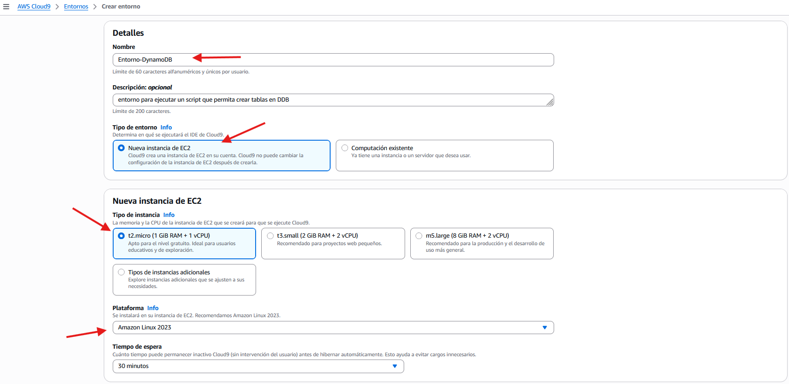{.cien .marginbottom40 .margintop10 .marco }
- Por limitaciones de usuario, elegimos la opción Secure Shell.
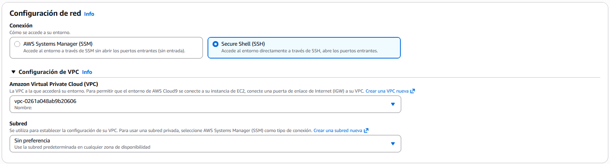{.cien .marginbottom40 .margintop10 .marco }
- Una vez creado el entorno lo abrimos (tarda unos instantes). 
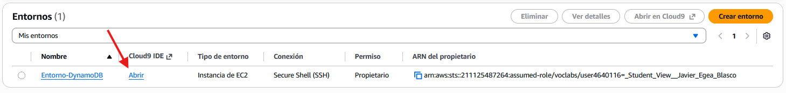{.cien .marginbottom40 .margintop10 .marco}
- Dentro de Cloud9 creamos un **nombre_de_archivo.py** y pegamos el siguiente código.
<br>
```py
import boto3
from datetime import datetime, timedelta

# Configuración inicial del cliente
# Nota: Boto3 usa las credenciales configuradas en ~/.aws/credentials o variables de entorno
dynamodb = boto3.resource('dynamodb', region_name='us-east-1')
client = boto3.client('dynamodb', region_name='us-east-1')

product_catalog_table = "ProductCatalog"
forum_table = "Forum"
thread_table = "Thread"
reply_table = "Reply"

def delete_table(table_name):
    try:
        table = dynamodb.Table(table_name)
        print(f"Eliminando tabla {table_name}...")
        table.delete()
        table.wait_until_not_exists()
        print(f"Tabla {table_name} eliminada.")
    except client.exceptions.ResourceNotFoundException:
        print(f"La tabla {table_name} no existe, saltando eliminación.")
    except Exception as e:
        print(f"Error al eliminar {table_name}: {e}")

def create_table(table_name, read_cap, write_cap, pk_name, pk_type, sk_name=None, sk_type=None):
    print(f"Creando tabla {table_name}...")
    
    attribute_definitions = [{'AttributeName': pk_name, 'AttributeType': pk_type}]
    key_schema = [{'AttributeName': pk_name, 'KeyType': 'HASH'}]
    
    if sk_name:
        attribute_definitions.append({'AttributeName': sk_name, 'AttributeType': sk_type})
        key_schema.append({'AttributeName': sk_name, 'KeyType': 'RANGE'})
    
    # Configuración específica para la tabla Reply (Índice Secundario Local)
    lsi = []
    if table_name == reply_table:
        attribute_definitions.append({'AttributeName': 'PostedBy', 'AttributeType': 'S'})
        lsi.append({
            'IndexName': 'PostedBy-Index',
            'KeySchema': [
                {'AttributeName': pk_name, 'KeyType': 'HASH'},
                {'AttributeName': 'PostedBy', 'KeyType': 'RANGE'}
            ],
            'Projection': {'ProjectionType': 'KEYS_ONLY'}
        })

    params = {
        'TableName': table_name,
        'KeySchema': key_schema,
        'AttributeDefinitions': attribute_definitions,
        'ProvisionedThroughput': {
            'ReadCapacityUnits': read_cap,
            'WriteCapacityUnits': write_cap
        }
    }
    
    if lsi:
        params['LocalSecondaryIndexes'] = lsi

    try:
        table = dynamodb.create_table(**params)
        table.wait_until_exists()
        print(f"Tabla {table_name} creada exitosamente.")
    except Exception as e:
        print(f"Error al crear tabla {table_name}: {e}")

def load_sample_products():
    table = dynamodb.Table(product_catalog_table)
    print(f"Cargando datos en {product_catalog_table}...")
    
    items = [
        {
            'Id': 101, 'Title': 'Book 101 Title', 'ISBN': '111-1111111111',
            'Authors': {'Author1'}, 'Price': 2, 'Dimensions': '8.5 x 11.0 x 0.5',
            'PageCount': 500, 'InPublication': True, 'ProductCategory': 'Book'
        },
        {
            'Id': 102, 'Title': 'Book 102 Title', 'ISBN': '222-2222222222',
            'Authors': {'Author1', 'Author2'}, 'Price': 20, 'Dimensions': '8.5 x 11.0 x 0.8',
            'PageCount': 600, 'InPublication': True, 'ProductCategory': 'Book'
        },
        {
            'Id': 201, 'Title': '18-Bike-201', 'Description': '201 Description',
            'BicycleType': 'Road', 'Brand': 'Mountain A', 'Price': 100,
            'Color': {'Red', 'Black'}, 'ProductCategory': 'Bicycle'
        }
    ]
    for item in items:
        table.put_item(Item=item)

def load_sample_threads():
    table = dynamodb.Table(thread_table)
    print(f"Cargando datos en {thread_table}...")
    
    now = datetime.utcnow()
    date2 = (now - timedelta(days=14)).isoformat()[:-3] + 'Z'
    
    table.put_item(Item={
        'ForumName': 'Amazon DynamoDB',
        'Subject': 'DynamoDB Thread 1',
        'Message': 'DynamoDB thread 1 message',
        'LastPostedBy': 'User A',
        'LastPostedDateTime': date2,
        'Views': 0, 'Replies': 0, 'Answered': 0,
        'Tags': {'index', 'primarykey', 'table'}
    })

def main():
    # 1. Eliminar tablas
    for t in [product_catalog_table, forum_table, thread_table, reply_table]:
        delete_table(t)
    
    # 2. Crear tablas
    create_table(product_catalog_table, 10, 5, "Id", "N")
    create_table(forum_table, 10, 5, "Name", "S")
    create_table(thread_table, 10, 5, "ForumName", "S", "Subject", "S")
    create_table(reply_table, 10, 5, "Id", "S", "ReplyDateTime", "S")
    
    # 3. Cargar datos
    load_sample_products()
    load_sample_threads()
    # (Las demás funciones load_sample siguen el mismo patrón de put_item)
    
    print("Success.")

if __name__ == "__main__":
    main()
```
<br>
- Para poder ejecutar el script, instalaremos boto3 (SDK oficial de Amazon Web Services (AWS) para Python) con:
```bash
pip install boto3
```
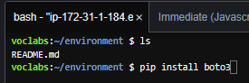{.trescinco .marginbottom40 .margintop10 }

- Ejecutamos el script:
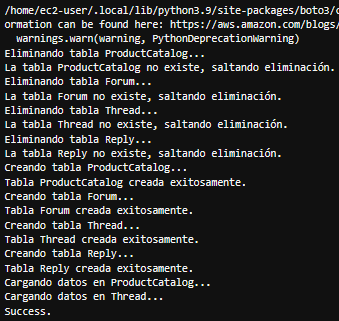{.trescinco .marginbottom40 .margintop10 }

- Si todo ha ido bien, tendremos nuestras tablas creadas y algunos items introducidos.  
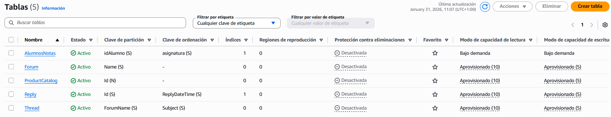{.cien  .margintop10 .marco }
<br>
 

#### 2.2.9.2 - Primeras consultas sobre las tablas
Podemos hacer consultas sobre las tablas usando la consola de administración de AWS o la CLI de AWS. En este caso usaremos la CLI.  
Ya hemos visto en otras unidades que los comandos de la CLI de AWS tienen la siguiente estructura:
```bash
aws <servicio> <operación> [--parámetros] [--opciones]
```
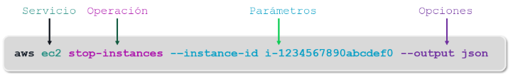{.sietezero .marginbottom40 .margintop10 }

- Listar tablas:
```bash
aws dynamodb list-tables
```
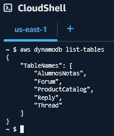{.doszero .marginbottom40 .margintop10 }

- Estructura de la tabla ProductCatalog 
```bash
aws dynamodb describe-table --table-name ProductCatalog
```
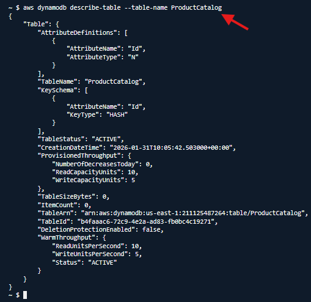{.seiszero .marginbottom40 .margintop10 }

- Recuperar un item de la tabla ProductCatalog por su clave primaria:
```bash 
aws dynamodb get-item --table-name ProductCatalog --key '{"Id": {"N": "101"}}'
```
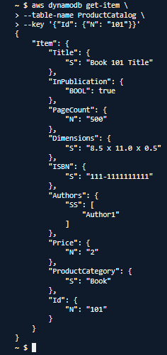{.treszero .marginbottom40 .margintop10 }

- Añadir un item en ProductCatalog:
```bash
aws dynamodb put-item \
  --table-name ProductCatalog \
  --item '{
    "Id": {"N": "301"}, 
    "Title": {"S": "Libro de AWSCLI"}, 
    "Authors": {"SS": ["AdminUser"]}, 
    "Price": {"N": "29.99"}, 
    "ProductCategory": {"S": "Book"}, 
    "InPublication": {"BOOL": true}
  }'
```
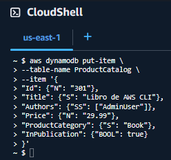{.treszero .marginbottom40 .margintop10 }
En la consola de administración de AWS podemos ver el nuevo item insertado.
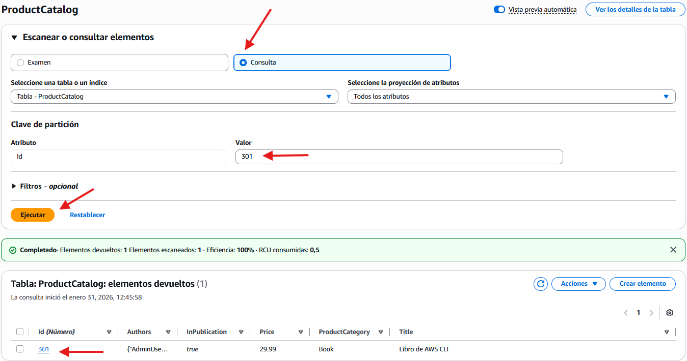{.cien .marginbottom40 .margintop10 }
También podremos hacerlo desde la CLI de AWS.
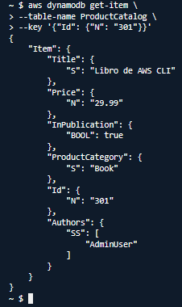{.treszero .marginbottom40 .margintop10 }

- Recuperar todos los hilos de la tabla threads del foro llamado “Amazon DynamoDB”:
```bash
aws dynamodb query \
--table-name Thread \
--key-condition-expression "ForumName = :forum" \
--expression-attribute-values '{":forum":{"S":"Amazon DynamoDB"}}'
```
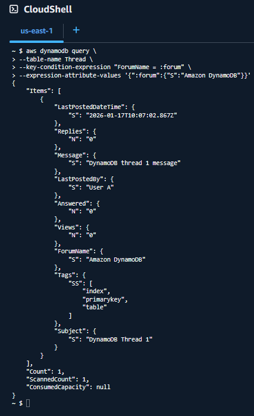{.cincozero .marginbottom40 .margintop10 }

- Buscar todas las respuestas publicadas por **User A** en el hilo “Amazon DynamoDB#DynamoDB Thread 1”, utilizando **el índice secundario**
PostedBy-Index
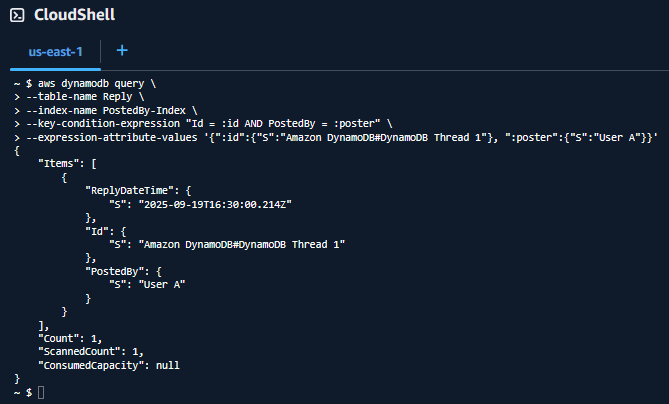{.sietecinco .marginbottom40 .margintop10 }

#### 2.2.9.3 - Consultas a realizar
!!! task "Trabajos a realizar"
    Realizar las operaciones siguiente mediante comandos AWS. 
    **Incluir el comando y una captura donde se vea su ejecución**. 
    Si es un comando cuya comprobación requiere otra acción desde la consola de aws o de otro comando, quedaría bien añadirlo.
    
    1. Insertar tres productos inventándote los datos.
    2. Seleccionar uno de esos productos a través de su CP.
    3. Cambiar uno de los datos de uno de esos productos.
    4. Eliminar uno de los productos.
    5. Realizar una query sobre cualquier tabla. Recuerda que una query siempre ha de filtrar sobre la CP de una tabla o sobre otro índice (LSI o GSI).
    6. Realizar un scan sobre una tabla y aplícarle un filtro. Recordar que este caso es más ineficiente puesto que se recuperan todos los datos de la tabla y luego se aplica el filtro. 

Ejemplos de capturas:

1. Insertar items.
<mark>Ejemplo de captura de pantalla</mark> 
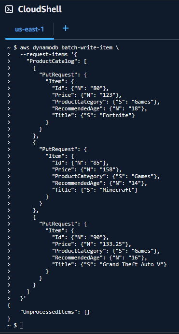{.trescinco .marginbottom40 .margintop10 }
1. Recuperar item por su CP.
<mark>Ejemplo de captura de pantalla</mark> 
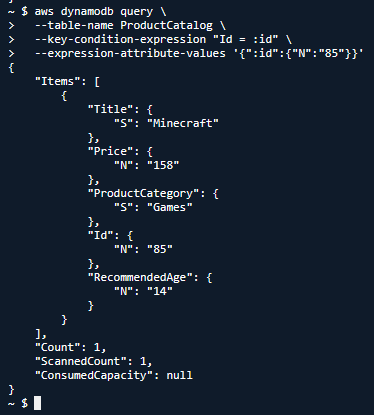{.trescinco .marginbottom40 .margintop10 }
1. Actualizar item.
<mark>Ejemplo de captura de pantalla</mark> 
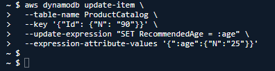{.trescinco .marginbottom40 .margintop10 }
1. Eliminar item.
<mark>Ejemplo de captura de pantalla</mark> 
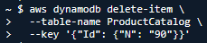{.trescinco .marginbottom40 .margintop10 }
1. Query.
<mark>Ejemplo de captura de pantalla</mark> 
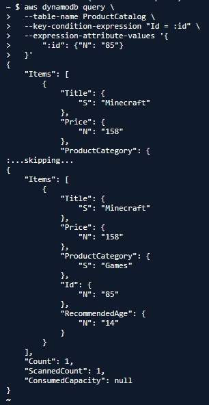{.trescinco .marginbottom40 .margintop10 }
1. Scan.
<mark>Ejemplo de captura de pantalla</mark> 
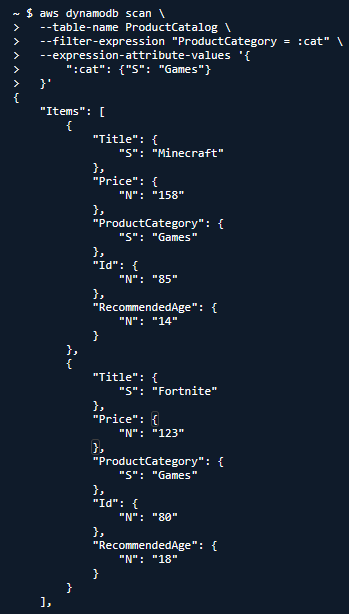{.trescinco .marginbottom40 .margintop10 }


#### 2.2.9.4 - Condiciones de entrega de la tarea RA4-CEc
!!! warning "Condiciones de entrega de la tarea RA4-CEc"
    1. Realizar capturas de pantalla de los puntos señalados.
    1. Comentar brevemente cada captura para entender a qué corresponde y subir el documento a la tarea correspondiente de AULES.

### **2.3 - ElastiCache**
{ .doscinco }<br>
<!-- file:///C:/Users/titan/Documents/Javier128/Eclipse/AWS/Base%20Dades/Tema%204/tema4_ElastiCache.pdf -->
 

   
 

 
## **Enlaces de interés**
Documentación de [AWS](https://docs.aws.amazon.com)   
Sistemas de almacenamiento en [AWS](https://aws.amazon.com/es/products/storage/)  
Sistemas de almacenamiento [EFS](https://aws.amazon.com/es/efs/) en AWS.  
Guía del usuario [EFS](https://docs.aws.amazon.com/es_es/efs/latest/ug/mounting-fs.html).  
Control de acceso a [buckets S3](https://docs.aws.amazon.com/es_es/AmazonS3/latest/userguide/about-object-ownership.html?icmpid=docs_amazons3_console)  
Base de datos relacionales [AWS RDS](https://aws.amazon.com/es/rds/)  
Guía del usuario del [AWS RDS](https://docs.aws.amazon.com/es_es/AmazonRDS/latest/UserGuide/Welcome.html)  
Guía del usuario de [Amazon Aurora](https://docs.aws.amazon.com/es_es/AmazonRDS/latest/AuroraUserGuide/CHAP_AuroraOverview.html)  
Widgets de [Amazon CloudWatch](https://docs.aws.amazon.com/es_es/AmazonCloudWatch/latest/monitoring/create-and-work-with-widgets.html)  
Documentación de Amazon [DynamoDB](https://docs.aws.amazon.com/es_es/dynamodb/)  
GUI de [NoSQL Workbench](https://docs.aws.amazon.com/es_es/amazondynamodb/latest/developerguide/workbench.html)
Enlace de [descarga](https://docs.aws.amazon.com/es_es/amazondynamodb/latest/developerguide/workbench.settingup.html) de NoSQL Workbench