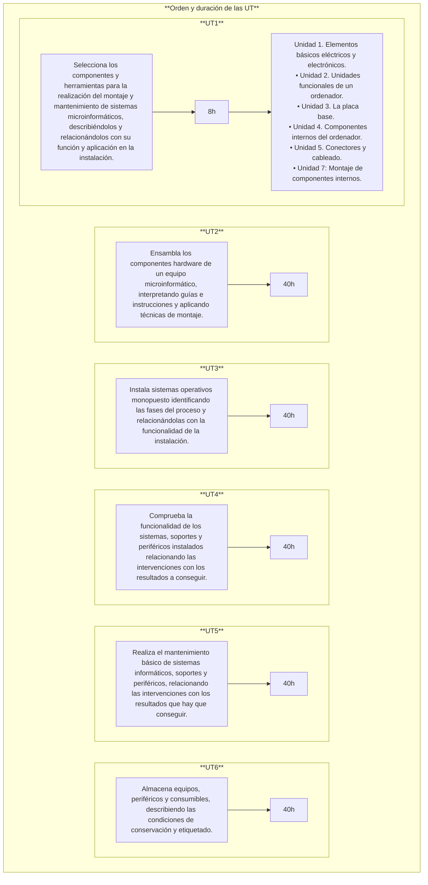

# **Montaje y mantenimiento de sistemas y componentes informáticos**

## **1. - Calendario escolar**

<!-- Aclarar horas de practicas
Aclarar fechas de las practicas -->
<!-- file:///C:/Users/titan/Downloads/1CFGB_MMSCI_2024-2025.pdf
-->
## **2. - Horario de sesiones**

## **3. - Contenidos del módulo**

### **3.1. - Selección de componentes y herramientas:**  
- Conceptos de intensidad, diferencia de potencial (tensión), resistencia; Ley de Ohm; corriente continua y alterna; magnitudes eléctricas; aparatos de medidas de magnitudes eléctricas.
- Elementos básicos: Pilas y baterías, pulsadores, interruptores, fuentes de alimentación, resistencias, condensadores, diodos, transistores, led, entre otros.
- Herramientas utilizadas en los procedimientos de montaje de componentes y periféricos informáticos.
- Unidades funcionales de un sistema informático.
- Componentes de los sistemas microinformáticos: tipos de carcasas, fuentes de alimentación, ventiladores y disipadores de calor.
- La placa base. Microprocesadores, zócalos y tipos. Memorias RAM, características y formatos.
- Buses y conectores de datos.
- Cableado y conectores de potencia.
- Zócalos y bahías de expansión.
- Tipos y elementos de fijación de los componentes a las carcasas.
- Dispositivos de almacenamiento: discos duros, características y tipos; Lectores/grabadores ópticos y magneto-ópticos, características y tipos.
- Puertos: paralelo, serie, USB (Bus de Serie Universal), «Firewire» (IEEE 1394), entre otros.
- Seguridad en el uso de herramientas y componentes eléctricos y electrónicos.
- Seguridad eléctrica: medidas de prevención de riesgos eléctricos; daños producidos por descarga eléctrica.

### **3.2. - Ensamblaje de componentes hardware de un equipo microinformático:**
- Procedimientos de instalación y fijación de componentes microinformático a la carcasa y a la placa base.
- Periféricos básicos: monitor, teclado, ratón e impresoras.
- Otros periféricos: altavoces, micrófono, escáner, dispositivos multimedia, entre otros.
- Técnicas de montaje, sustitución y conexión de componentes y periféricos microinformáticos. Las guías de montaje.
- La Seguridad en las operaciones de montaje, sustitución y conexión de componentes y periféricos microinformáticos.

### **3.3 - Instalación de sistemas operativos:**
- El software básico de un sistema informático.
- Funciones del sistema operativo.
- Utilización del sistema operativo.
- Sistemas operativos actuales.
- Operaciones con el sistema de archivos, directorios y permisos.
- Herramientas de creación e implantación de imágenes y réplicas de sistemas:
orígenes de información; procedimientos de implantación de imágenes y réplicas de sistemas; procedimientos de verificación de imágenes y réplicas de sistemas.

### **3.4 - Funcionalidad de los sistemas:**
- Técnicas de verificación y testeo de sistemas microinformáticos.
- Software de testeo y verificación.
- Herramientas de verificación y diagnóstico de sistemas microinformáticos.
- Procedimientos de POST (Power-On Self Test).
- Conexión de dispositivos periféricos en el sistema microinformático.

### **3.5 - Mantenimiento básico del equipo y periféricos:**
- Técnicas auxiliares de mantenimiento de sistemas microinformáticos: El mantenimiento preventivo y periódico.
- Medidas de conservación y reciclaje de elementos consumibles.
- Procedimientos de sustitución de elementos consumibles.
- Seguridad en la manipulación y sustitución de elementos consumibles.

### **3.6 - Almacenaje de equipos, periféricos y consumibles:**
- Técnicas de etiquetado, embalaje, almacenamiento y traslado de sistemas y componentes informáticos
- Procedimientos y herramientas de etiquetado.
- Embalaje de componentes y periféricos de un sistema microinformático.
- Precauciones a considerar en el traslado de sistemas microinformáticos.
- Normativa de prevención de riesgos laborales en el transporte y almacenaje de productos.
- Tratamiento, reciclaje y eliminación de residuos informáticos.

## **4. - Metodología de aprendizaje**
 
## **5. - Evaluación** 

### **5.1. - Relación entre Criterios de Evaluación y Resultados de Aprendizaje**
**Los criterios de evaluación** asociados a los **resultados de aprendizaje** son los siguientes:

=== "RA 1"
    |Selecciona los componentes y herramientas para la realización del montaje y mantenimiento de sistemas microinformáticos, describiéndolos y relacionándolos con su función y aplicación en la instalación.||
    |-|-|
    |**a)** Se han descrito las características de los elementos eléctricos y electrónicos utilizados en el montaje de sistemas. |15%|
    |**b)** Se han descrito las operaciones y comprobaciones previas a la manipulación segura de componentes eléctricos y/o electrónicos.|15%|
    |**c)** Se han identificado los dispositivos y herramientas necesarios en la manipulación segura de sistemas electrónicos.|15%|
    |**d)** Se han seleccionado las herramientas necesarias para el procedimiento de montaje, sustitución o conexión de componentes hardware de un sistema microinformático.|5%|
    |**e)** Se han identificado funcionalmente los componentes hardware para el ensamblado y/o mantenimiento de un equipo microinformático.|10%|
    |**f)** Se han descrito las características técnicas de cada uno de los componentes hardware (internos y externos) utilizados en el montaje y/o mantenimiento de un equipo microinformático.|15%|
    |**g)** Se han localizado los bloques funcionales en placas bases utilizadas en los sistemas microinformáticos.|15%|
    |**h)** Se han identificado los tipos de puertos, bahías internas y cables de conexión (de datos y eléctricos, entre otros) existentes de un equipo microinformático.|15%|
    |**i)** Se han seguido las instrucciones recibidas.|15%|

=== "RA 2"
    |Ensambla los componentes hardware de un equipo microinformático, interpretando guías e instrucciones y aplicando técnicas de montaje.||
    |-|-|
    |**a)** Se ha comprobado cada componente antes de su utilización, siguiendo las normas de seguridad establecidas.|15%|
    |**b)** Se han interpretado las guías de instrucciones referentes a los procedimientos de integración o ensamblado, sustitución y conexión del componente hardware de un sistema microinformático.|25%|
    |**c)** Se han reconocido en distintas placas base cada uno de los zócalos de conexión de microprocesadores y los disipadores, entre otros.|10%|
    |**d)** Se han ensamblado los componentes hardware internos (memoria, procesador, tarjeta de video, pila, entre otros) en la placa base del sistema microinformático.|15%|
    |**e)** Se ha fijado cada dispositivo o tarjeta en la ranura o bahía correspondiente, según guías detalladas de instalación.|15%|
    |**f)** Se han conectado adecuadamente aquellos componentes hardware internos (disco duro, DVD, CD-ROM, entre otros) que necesiten cables de conexión para su integración en el sistema microinformático.|10%|

=== "RA 3"
    |Instala sistemas operativos monopuesto identificando las fases del proceso y relacionándolas con la funcionalidad de la instalación.||
    |-|-|
    |**a)** Se han descrito los pasos a seguir para la instalación o actualización.|10%|
    |**b)** Se ha verificado la ausencia de errores durante el proceso de carga del sistema operativo.|15%|
    |**c)** Se han utilizado las herramientas de control para la estructura de directorios y la gestión de permisos.|10%|
    |**d)** Se han instalado actualizaciones y parches del sistema operativo según las instrucciones recibidas.|15%|
    |**e)** Se han realizado copias de seguridad de los datos.|10%|
    |**f)** Se han anotado los posibles fallos producidos en la fase de arranque del equipo microinformático.|10%|
    |**g)** Se han descrito las funciones de replicación física («clonación») de discos y particiones en sistemas microinformáticos.|10%|
    |**h)** Se han utilizado herramientas software para la instalación de imágenes de discos o particiones señalando las restricciones de aplicación de las mismas.|10%|
    |**i)** Se ha verificado la funcionalidad de la imagen instalada, teniendo en cuenta el tipo de «clonación» realizada.|10%|

=== "RA 4"
    |Comprueba la funcionalidad de los sistemas, soportes y periféricos instalados relacionando las intervenciones con los resultados a conseguir.||
    |-|-|
    |**a)** Se ha aplicado a cada componente hardware y periférico el procedimiento de testeo adecuado.|10%|
    |**b)** Se ha verificado que el equipo microinformático realiza el procedimiento de encendido y de POST (Power On Self Test), identificando el origen de los problemas, en su caso.|15%|
    |**c)** Se ha comprobado la funcionalidad de los soportes para almacenamiento de información.|10%|
    |**d)** Se ha verificado la funcionalidad en la conexión entre componentes del equipo microinformático y con los periféricos.|15%|
    |**e)** Se han utilizado herramientas de configuración, testeo y comprobación para verificar el funcionamiento del sistema.|15%|
    |**f)** Se han utilizado las herramientas y guías de uso para comprobar el estado de los soportes y de la información contenida en los mismos.|15%|
    |**g)** Se han registrado los resultados y las incidencias producidas en los procesos de comprobación.|15%|

=== "RA 5"
    |Realiza el mantenimiento básico de sistemas informáticos, soportes y periféricos, relacionando las intervenciones con los resultados que hay que conseguir..||
    |-|-|
    |**a)** Se ha comprobado por medio de indicadores luminosos, que los periféricos conectados tienen alimentación eléctrica y las conexiones de datos.|10%|
    |**b)** Se han descrito los elementos consumibles necesarios para ser utilizados en los periféricos de sistemas microinformáticos.|10%|
    |**c)** Se han utilizado las guías técnicas detalladas para sustituir elementos consumibles.|10%|
    |**d)** Se han descrito las características de los componentes, de los soportes y de los periféricos para conocer los aspectos que afecten a su mantenimiento.|10%|
    |**e)** Se han utilizado las guías de los fabricantes para identificar los procedimientos de limpieza de componentes, soportes y periféricos.|10%|
    |**f)** Se ha realizado la limpieza de componentes, soportes y periféricos respetando las disposiciones técnicas establecidas por el fabricante manteniendo su funcionalidad..|10%|
    |**g)** Se han recogido los residuos y elementos desechables de manera adecuada para su eliminación o reciclaje.|10%|

=== "RA 6"
    |Almacena equipos, periféricos y consumibles, describiendo las condiciones de conservación y etiquetado.||
    |-|-|
    |**a)** Se han descrito las condiciones para manipular, transportar y almacenar componentes y periféricos de un sistema microinformático.|10%|        
    |**b)** Se han identificado los tipos de embalaje para el transporte y/o almacenaje de cada dispositivo, periférico y consumible.|10%|        
    |**c)** e han utilizado las herramientas necesarias para realizar las tareas de etiquetado previas al embalaje y/o almacenamiento de sistemas, periféricos y consumibles.|10%|        
    |**d)** Se han utilizado los medios auxiliares adecuados a los elementos a transportar.|10%|        
    |**e)** Se han aplicado las normas de seguridad en la manipulación y el transporte de elementos y equipos.|10%|        
    |**f)** Se ha comprobado que los componentes recepcionados se corresponden con el albarán de entrega y que se encuentran en buen estado. |10%|   
    |**g)** Se han registrado las operaciones realizadas siguiendo los formatos establecidos.|10%|
    |**h)** Se han recogido los elementos desechables para su eliminación o reciclaje.|10%|
    
### **5.2. - Metodología de evaluación**
1. La evaluación será **contínua**.   
2. Se basará en la comprobación de la superación de los **resultados de aprendizaje RA**.
3. La evaluación se hará por **RA's** sobre todos los **CE's** del currículo.

### **5.3. - Instrumentos de evaluación y prueba de trabajo**
**Los instrumentos de evaluación** propuestos en cada unidad de trabajo son los siguientes:
1. Observación directa del alumno/a: motivación, interés, actitudes, comportamiento, asistencia, etc.
1. Realización de actividades individuales y en grupo.
1. Elaboración de ejercicios prácticos.
1. Realización de pruebas y controles periódicos.
1. Prueba escrita al final de la unidad.

**Cada prueba y trabajo** se evaluará con una nota de 0 a 10 puntos. Para superar las pruebas o trabajos prácticos se precisará una nota
superior a 5.
Las pruebas de trabajo podrán ser de tipo:
1. Pruebas escritas.
2. Prácticas: Actividades de taller realizadas de forma individual o en grupo del alumnado. 
3. Observación del trabajo diario del alumno. 
<!-- 4. Valoración de la empresa u organismo equiparado.  -->

### **5.4. - Responsable evaluación de los RA's y/o CE's**

=== "RA 1"
    Tutor prácticas (Empresa). 

=== "RA 2"
    Profesor módulo (Instituto).

=== "RA 3"
    Profesor módulo (Instituto).

=== "RA 4"
    Profesor módulo (Instituto).

## **6. - Criterio de superación del módulo**
### **6.1. - Nota final**
La nota final será la suma ponderada de **los resultados de aprendizaje** obtenidos en cada evaluación.  

La superación del módulo requerirá obtener una media mínima de **5 sobre 10 en cada resultado de aprendizaje**. 

En caso de no superar el módulo, el alumna/o dispondrá de un proceso de recuperación orientado a reforzar específicamente los resultados de aprendizaje no alcanzados.

|Resultado de aprendizaje|Porcentage|
|-|-|
|**RA1.** Selecciona los componentes y herramientas para la realización del montaje y mantenimiento de sistemas microinformáticos, describiéndolos y relacionándolos con su función y aplicación en la instalación.|20%|
|**RA2.** Ensambla los componentes hardware de un equipo microinformático, interpretando guías e instrucciones y aplicando técnicas de montaje.|20%|
|**RA3.** Instala sistemas operativos monopuesto identificando las fases del proceso y relacionándolas con la funcionalidad de la instalación.|20%|
|**RA4.** Comprueba la funcionalidad de los sistemas, soportes y periféricos instalados relacionando las intervenciones con los resultados a conseguir.|20%|
|**RA5.** Realiza el mantenimiento básico de sistemas informáticos, soportes y periféricos, relacionando las intervenciones con los resultados que hay que conseguir.|10%|
|**RA6.** Almacena equipos, periféricos y consumibles, describiendo las condiciones de conservación y etiquetado.|10%|

### **6.2. - Instrumentos de recuperación**

### **6.3. - Calendario de evaluaciones**
 
## **7. - Secuenciación y duración de cada Unidad de Trabajo**
1     11 1
1     11 2
1 2   16 3
1 2   16 4
1 2   16 5
4     11 6
1 2   16 7
2     16 8
4     16 9
3     16 10
3     11 11
5     11 12
5     11 13
6     11 14
5 6   11 15  

   
 

| **Licencia Creative Commons:** | |
| - | - |
|  { .by-nc-nd-eu_ } | **Reconocimiento-NoComercial-CompartirIgual CC BY-NC-SA:**  No se permite un uso comercial de la obra original ni de las posibles obras derivadas, la distribución de la cuales se debe hace con una licencia igual a la que regula la obra original. | 