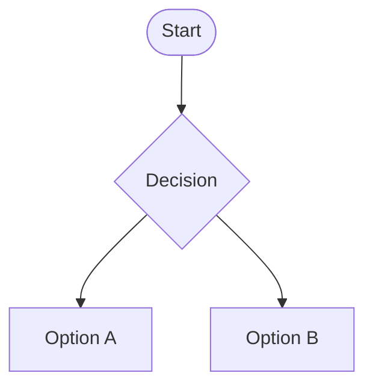

{ .img-center width=75% }

 

# Resultados de aprendizaje y criterios de evaluación del módulo:  
Los resultados de aprendizaje y criterios de evaluación asociados al módulo **Aplicaciones Ofimáticas** constituyen los logros que los alumnos/as tienen que alcanzar para **superar el módulo**.

<table>
  <tr>
    <td style="white-space: nowrap;">RA. 1:</td>
    <td>
      Instala y actualiza aplicaciones ofimáticas, interpretando especificaciones y describiendo los pasos a seguir en el proceso. 
      

        
Ver los criterios de evaluación

        <table>
          <tr>
            <td>a)</td>
            <td>Se han identificado y establecido las fases del proceso de instalación.</td>
          </tr>
          <tr>
            <td>b)</td>
            <td>Se han respetado las especificaciones técnicas del proceso de instalación.</td>
          </tr>
          <tr>
            <td>c)</td>
            <td>Se han configurado las aplicaciones según los criterios establecidos.</td>
          </tr>
          <tr>
            <td>d)</td>
            <td>Se han documentado las incidencias.</td>
          </tr>
          <tr>
            <td>e)</td>
            <td>Se han solucionado problemas en la instalación o integración con el sistema informático.</td>
          </tr>
          <tr>
            <td>f)</td>
            <td>Se han eliminado y/o añadido componentes de la instalación en el equipo.</td>
          </tr>
          <tr>
            <td>g)</td>
            <td>Se han actualizado las aplicaciones.</td>
          </tr>
          <tr>
            <td>h)</td>
            <td>Se han respetado las licencias software.</td>
          </tr>
          <tr>
            <td>i)</td>
            <td>Se han propuesto soluciones software para entornos de aplicación.</td>
          </tr>
        </table>
      

    </td> 
  </tr>  
  <tr>
    <td>RA. 2:</td>
    <td>
      Elabora documentos y plantillas, describiendo y aplicando las opciones avanzadas de procesadores de textos.  
      

        
Ver los criterios de evaluación

        <table>
          <tr>
            <td>a)</td>
            <td>Se ha personalizado las opciones de software y barra de herramientas.</td>
          </tr>
          <tr>
            <td>b)</td>
            <td>Se han diseñado plantillas.</td>
          </tr>
          <tr>
            <td>c)</td>
            <td>Se han utilizado aplicaciones y periféricos para introducir textos e imágenes.</td>
          </tr>
          <tr>
            <td>d)</td>
            <td>Se han importado y exportado documentos creados con otras aplicaciones y en otros formatos.</td>
          </tr>
          <tr>
            <td>e)</td>
            <td>Se han creado y utilizado macros en la realización de documentos.</td>
          </tr>
          <tr>
            <td>f)</td>
            <td>Se han elaborado manuales específicos.</td>
          </tr>
        </table>
      

    </td>
  </tr> 
  <tr> 
    <td>RA. 3:</td>
    <td>
      Elabora documentos y plantillas de cálculo, describiendo y aplicando opciones avanzadas de hojas de  cálculo.
      

        
Ver los criterios de evaluación

        <table>
          <tr>
            <td>a)</td>
            <td>Se ha personalizado las opciones de software y barra de herramientas.</td>
          </tr>
          <tr>
            <td>b)</td>
            <td>Se han utilizado los diversos tipos de datos y referencia para celdas, rangos, hojas y libros.  </td>
          </tr>
          <tr>
            <td>c)</td>
            <td>Se han aplicado fórmulas y funciones.</td>
          </tr>
          <tr>
            <td>d)</td>
            <td>Se han generado y modificado gráficos de diferentes tipos.</td>
          </tr>
          <tr>
            <td>e)</td>
            <td>Se han empleado macros para la realización de documentos y plantillas.</td>
          </tr>
          <tr>
            <td>f)</td>
            <td>Se han importado y exportado hojas de cálculo creadas con otras aplicaciones y en otros  formatos.</td>
          </tr>
          <tr>
            <td>g)</td>
            <td>Se ha utilizado la hoja de cálculo como base de datos: formularios, creación delistas,       filtrado,   protección y ordenación de datos.</td>
          </tr>
          <tr>
            <td>h)</td>
            <td>Se han utilizado aplicaciones y periféricos para introducir textos, números, códigos e  imágenes.</td>
          </tr>
        </table>
      

    </td>
  </tr>
  <tr>  
    <td>RA. 4:</td>
    <td>
      Elabora documentos con bases de datos ofimáticas describiendo y aplicando operaciones de manipulación de datos. 
      

        
Ver los criterios de evaluación

        <table>
          <tr>
            <td>a)</td>
            <td>Se han identificado los elementos de las bases de datos relacionales.</td>
          </tr>
          <tr>
            <td>b)</td>
            <td>Se han creado bases de datos ofimáticas.</td>
          </tr>
          <tr>
            <td>c)</td>
            <td>Se han utilizado las tablas de la base de datos (insertar, modificar y eliminar registros).</td>
          </tr>
          <tr>
            <td>d)</td>
            <td>Se han utilizado asistentes en la creación de consultas.</td>
          </tr>
          <tr>
            <td>e)</td>
            <td>Se han utilizado asistentes en la creación de formularios.</td>
          </tr>
          <tr>
            <td>f)</td>
            <td>Se han utilizado asistentes en la creación de informes.</td>
          </tr>
          <tr>
            <td>g)</td>
            <td>Se ha realizado búsqueda y filtrado sobre la información almacenada.</td>
          </tr>
          <tr>
            <td>h)</td>
            <td>Se han creado y utilizado macros.</td>
          </tr>
        </table>
      

    </td>
  </tr>  
  <tr>
    <td>RA. 5:</td>
    <td>
      Manipula imágenes digitales analizando las posibilidades de distintos programas y aplicando técnicas de captura y edición básicas.
      

        
Ver los criterios de evaluación

        <table>
          <tr>
            <td>a)</td>
            <td>Se han analizado los distintos formatos de imágenes.</td>
          </tr>
          <tr>
            <td>b)</td>
            <td>Se ha realizado la adquisición de imágenes con periféricos.</td>
          </tr>
          <tr>
            <td>c)</td>
            <td>Se ha trabajado con imágenes a diferentes resoluciones, según su finalidad.</td>
          </tr>
          <tr>
            <td>d)</td>
            <td>Se han empleado herramientas para la edición de imagen digital.</td>
          </tr>
          <tr>
            <td>e)</td>
            <td>Se han importado y exportado imágenes en diversos formatos.</td>
          </tr>
        </table>
      

    </td>
  </tr>    
  <tr>
    <td>RA. 6:</td>
    <td>
      Manipula secuencias de vídeo analizando las posibilidades de distintos programas y aplicando técnicas de captura y edición básicas.
      

        
Ver los criterios de evaluación

        <table>
          <tr>
            <td>a)</td>
            <td>Se han reconocido los elementos que componen una secuencia de vídeo.</td>
          </tr>
          <tr>
            <td>b)</td>
            <td>Se han estudiado los tipos de formatos y codecs más empleados.</td>
          </tr>
          <tr>
            <td>c)</td>
            <td>Se han importado y exportado secuencias de vídeo.</td>
          </tr>
          <tr>
            <td>d)</td>
            <td>Se han capturado secuencias de vídeo con recursos adecuados.</td>
          </tr>
          <tr>
            <td>e)</td>
            <td>Se han elaborado vídeo tutoriales.</td>
          </tr>
        </table>
      

    </td>
  </tr>    
  <tr>
    <td>RA. 7:</td>
    <td>
      Elabora presentaciones multimedia describiendo y aplicando normas básicas de composición y diseño.
      

        
Ver los criterios de evaluación

        <table>
          <tr>
            <td>a)</td>
            <td>Se han identificado las opciones básicas de las aplicaciones de presentaciones.</td>
          </tr>
          <tr>
            <td>b)</td>
            <td>Se han reconocido los distintos tipos de vista asociados a una presentación.</td>
          </tr>
          <tr>
            <td>c)</td>
            <td>Se han aplicado y reconocido las distintas tipografías y normas básicas de composición, diseño y       utilización del color.</td>
          </tr>
          <tr>
            <td>d)</td>
            <td>Se han diseñado plantillas de presentaciones.</td>
          </tr>
          <tr>
            <td>e)</td>
            <td>Se han creado presentaciones.</td>
          </tr>
          <tr>
            <td>f)</td>
            <td>Se han utilizado periféricos para ejecutar presentaciones.</td>
          </tr>
        </table>
      

    </td>
  </tr>
  <tr>
    <td>RA. 8:</td>
    <td>
      Realiza operaciones de gestión del correo y la agenda electrónica, relacionando necesidades de uso con su configuración.
      

        
Ver los criterios de evaluación

        <table>
          <tr>
            <td>a)</td>
            <td>Se han descrito los elementos que componen un correo electrónico.</td>
          </tr>
          <tr>
            <td>b)</td>
            <td>Se han analizado las necesidades básicas de gestión de correo y agenda electrónica.</td>
          </tr>
          <tr>
            <td>c)</td>
            <td>Se han configurado distintos tipos de cuentas de correo electrónico.</td>
          </tr>
          <tr>
            <td>d)</td>
            <td>Se han conectado y sincronizado agendas del equipo informático con dispositivos móviles.</td>
          </tr>
          <tr>
            <td>e)</td>
            <td>Se ha operado con la libreta de direcciones.</td>
          </tr>
          <tr>
            <td>f)</td>
            <td>Se ha trabajado con todas las opciones de gestión de correo electrónico (etiquetas, filtros,   carpetas, entre otros).</td>
          </tr>
          <tr>
            <td>g)</td>
            <td>Se han utilizado opciones de agenda electrónica.</td>
          </tr>
        </table>
      

    </td>
  </tr>    
  <tr>
    <td>RA. 9:</td>
    <td>
      Aplica técnicas de soporte en el uso de aplicaciones, identificando y resolviendo incidencias. 
      

        
Ver los criterios de evaluación

        <table>
          <tr>
            <td>a)</td>
            <td>Se han elaborado guías visuales con los conceptos básicos de uso de una aplicación.</td>
          </tr>
          <tr>
            <td>b)</td>
            <td>Se han identificado problemas relacionados con el uso de aplicaciones ofimáticas.</td>
          </tr>
          <tr>
            <td>c)</td>
            <td>Se han utilizado manuales de usuario para instruir en el uso de aplicaciones.</td>
          </tr>
          <tr>
            <td>d)</td>
            <td>Se han aplicado técnicas de asesoramiento en el uso de aplicaciones.</td>
          </tr>
          <tr>
            <td>e)</td>
            <td>Se han realizado informes de incidencias.</td>
          </tr>
          <tr>
            <td>f)</td>
            <td>Se han aplicado los procedimientos necesarios para salvaguardar la información y su recuperación.</td>
          </tr>
          <tr>
            <td>g)</td>
            <td>Se han utilizado los recursos disponibles (documentación técnica, ayudas en línea, soporte     técnico, entre otros) para solventar incidencias.</td>
          </tr>
          <tr>
            <td>h)</td>
            <td>Se han solventando las incidencias en el tiempo adecuado y con el nivel de calidad esperado.</td>
          </tr>
        </table>
      

    </td>
  </tr>    
</table>

 
# Contenidos
A continuación, se presentan los contenidos de este módulo tal y como aparecen en **ORDEN de 29 de julio 2009**, de la Conselleria de Educación, por la que se establece para la Comunitat Valenciana el currículo del ciclo formativo de Grado Medio correspondiente al título de Técnico en Sistemas Microinformáticos y Redes.
  
## Instalación de aplicaciones:
??? info "Contenidos"
    - Tipos de aplicaciones ofimáticas y aplicaciones corporativas.
    - Paquetes ofimáticos.
    - Tipos de licencias software.
    - Necesidades de los entornos de explotación.
    - Procedimientos de instalación y configuración.
    - Diagnóstico y resolución de problemas.

## Elaboración de documentos y plantillas mediante procesadores de texto
??? info "Contenidos"
    – El entorno de trabajo. Personalización.  
    – Formateo de textos. Párrafos. Páginas y Estilos.  
    – Encabezamientos. Pies de Página. Notas a pie.  
    – Esquemas: Viñetas. Listas numeradas.  
    – Gráficos. Imágenes.  
    – Índices y Tablas.  
    – Formularios.  
    – Impresión de documentos.  
    – Combinar documentos.  
    – Creación y uso de plantillas.  
    – Importación y exportación de documentos.  
    – Trabajo en grupo: comparar documentos, versiones de documento, verificar cambios, entre otros.  
    – Diseño y creación de macros.  
    – Utilización de software y hardware para introducir textos e imágenes.  
    – Elaboración de distintos tipos de documentos (manuales, partes de incidencias, entre otros).

## Elaboración de documentos y plantillas mediante hojas de cálculo
??? info "Contenidos"
    – Entorno de trabajo. Personalización.  
    – Conceptos básicos: Libro, hoja, celda, rango, etc…  
    – Formateo de celdas. Estilos.  
    – Manipulación de datos.  
    – Rangos.  
    – Impresión de documentos.  
    – Utilización de fórmulas y funciones.  
    – Creación de tablas y gráficos dinámicos.  
    – Dibujos e imágenes.  
    – Uso de plantillas y asistentes.  
    – Importación y exportación de hojas de cálculo.  
    – Utilización de opciones de trabajo en grupo, control de versiones,verificación de cambios, entre otros.  
    – Elaboración de distintos tipos de documentos (presupuestos, facturas, inventarios, entre otros).  
    – Diseño y creación de macros.  

## Utilización de bases de datos ofimáticas
??? info "Contenidos"
    – Elementos de las bases de datos relacionales.  
    – Organización de bases de datos relacionales.  
    – Creación de bases de datos.  
    – Creación y manejo de tablas.  
    – Manejo de asistentes.  
    – Manipulación de datos: Inserción, modificación y borrado.  
    – Consultas, formularios e informes.  

## Manipulación de imágenes:
??? info "Contenidos"
    – Formatos y resolución de imágenes.  
    – Manipulación de selecciones, máscaras y capas.  
    – Utilización de retoque fotográfico, ajustes de imagen y de color.  
    – Aplicación de filtros y efectos.  
    – Importación y exportación de imágenes.  
    – Utilización de dispositivos para obtener imágenes.  

## Manipulación de vídeos:
??? info "Contenidos"
    – Formatos de vídeo. Codecs.  
    – Manipulación de la línea de tiempo.  
    – Selección de escenas y transiciones.  
    – Introducción de títulos y audio.  
    – Creación y grabación de videos.  
    – Importación y exportación de vídeos.  

## Elaboración de presentaciones:
??? info "Contenidos"
    – El entorno de trabajo. Personalización.  
    – Impresión de presentaciones.  
    – Gráficos, imágenes, dibujos y organigramas.  
    – Diseño y edición de diapositivas.  
    – Manipulación de diapositivas. Modo de visualización.  
    – Formateo de diapositivas, textos y objetos.  
    – Aplicación de efectos de animación y efectos de transición.  
    – Aplicación de sonido y vídeo.  
    – Importación y exportación de presentaciones.  
    – Utilización de plantillas y asistentes. Patrones de diapositivas.  
    – Diseño y creación de macros.  

## Gestión de correo y agenda electrónica:
??? info "Contenidos"
    – Entorno de trabajo: configuración y personalización.  
    – Tipos de cuentas de correo.  
    – Plantillas y firmas corporativas.  
    – Foros de noticias (news). Configuración, uso y sincronización de mensajes.  
    – La libreta de direcciones: importar, exportar, añadir contactos, crear listas de distribución, poner la lista a disposición de otras aplicaciones ofimáticas.  
    – Gestión de correos: enviar, borrar, guardar, copias de seguridad, entre otros.  
    – Gestión de la agenda: citas, calendario, avisos, tareas, entre otros.  
    – Sincronización con dispositivos móviles.  

## Aplicación de técnicas de soporte:
??? info "Contenidos"
    – Elaboración de guías y manuales de uso de aplicaciones.  
    – Formación al usuario.  
    – Resolución de incidencias.  
    – Aplicaciones para la gestión y control de incidencias.  

 

# Metodología de aprendizaje:
- Introducción de los **aspectos teóricos** para que después **sean aplicados mediante práctica y ejercicios**.  
- Prácticas **individuales y colectivas**. 
- **Realización de trabajos obligatorios**. Algunos trabajos podrán ser realizados en grupo. 
- Realización de **actividades voluntarias** de investigación y ampliación para **profundizar en los conocimientos adquiridos**.  
- **PBL (Problem Based Learning)**, aprendizaje basado en problemas. Se plantea un problema real, y los alumnos elaborarán una solución justificada y probada, incluyendo estudio de necesidades y costes. 
- **Proyección de videos**. 

 

# Evaluación 

## Metodología de evaluación
- La evaluación será **contínua y sumativa**.   
- Se adaptará a las diferentes metodologías de aprendizaje. 
- Se basará en la comprobación de la superación de los resultados de aprendizaje en las condiciones de calidad establecidas en el currículo.

## Instrumentos de evaluación
- Exámenes.  
    - Preguntas tipo test.
    - Examen escrito (ejercicios).   
    - Entrega de tareas de clase.   
- Entrega de tareas.  
- Exposiciones orales.  
- Prácticas en empresa.

## Sesiones de evaluación
- Evaluación inicial (primer mes).
- **Una evaluación parcial por cada trimestre**. La última de las cuales se desarrollará durante el mes de *mayo*. Para tener el aprobado será necesario haber alcanzado una puntuación superior (o igual) a 5 en los **Resultados de Aprendizaje RA** completados.
- **Evaluación ordinaria** para recuperar los **RA no superados**.
- **Evaluacion extraordinaria** para los alumnos/as que no hayan superado el módulo en las evaluaciones parciales u ordinaria. Para esta evaluación se realizarán varias pruebas teórico-prácticas que evaluarán la totalidad del módulo. 
- **Recuperaciones** que permitirán recuperar los **criterios de evaluación** no superados.

 
# Criterios de cualificación

## Relación entre nota final y Resultados de aprendizaje
Los criterios de calificación dependerán del peso de cada **Resultado de Aprendizaje** en la nota final del curso. 

|Resultado de aprendizaje|Porcentage|
|-|-|
|**RA1.** Instala y actualiza aplicaciones ofimáticas, interpretando especificaciones y describiendo los pasos a seguir en el proceso.|5%|
|**RA2.** Elabora documentos y plantillas, describiendo y aplicando las opciones avanzadas de procesadores de textos.|19%|
|**RA3.** Elabora documentos y plantillas de cálculo, describiendo y aplicando opciones avanzadas de hojas de cálculo.|18%|
|**RA4.** Elabora documentos con bases de datos ofimáticas describiendo y aplicando operaciones de manipulación de datos.|18%|
|**RA5.**  Manipula imágenes digitales analizando las posibilidades de distintos programas y aplicando técnicas de captura y edición básicas.|10%|
|**RA6.** Manipula secuencias de video analizando las posibilidades de distintos programas y aplicando técnicas de captura y edición básicas.|5%|
|**RA7.** Elabora presentaciones multimedia describiendo y aplicando normas básicas de composición y diseño.|10%|
|**RA8.** Realiza operaciones de gestión del correo y la agenda electrónica, relacionando necesidades de uso con su configuración.|10%|
|**RA9.** Aplica técnicas de soporte en el uso de aplicaciones, identificando y resolviendo incidencias.|5%|

## Relación entre Criterios de Evaluación y Resultados de Aprendizaje
**Los criterios de evaluación** asociados a los **resultados de aprendizaje** son los siguientes

=== "RA 1"
    |RA1. Instala y actualiza aplicaciones ofimáticas, interpretando especificaciones y describiendo los pasos a seguir en el proceso.||
    |-|-|
    |**a)** Se han identificado y establecido las fases del proceso de instalación. |15%|
    |**b)** Se han respetado las especificaciones técnicas del proceso de instalación. |15%|
    |**c)** Se han configurado las aplicaciones según los criterios establecidos. |15%|
    |**d)** Se han documentado las incidencias. |5%|
    |**e)** Se han solucionado problemas en la instalación o integración con el sistema informático. |10%|
    |**f)** Se han eliminado y/o añadido componentes de la instalación en el equipo. |15%|
    |**g)** Se han actualizado las aplicaciones. |10%|
    |**h)** Se han respetado las licencias software. |10%|
    |**i)** Se han propuesto soluciones software para entornos de aplicación |5%|

=== "RA 2"
    |RA2. Elabora documentos y plantillas, describiendo y aplicando las opciones avanzadas de procesadores de textos.||
    |-|-|
    |**a)** Se ha personalizado las opciones de software y barra de herramientas. |15%|
    |**b)** Se han utilizado los elementos básicos en la elaboración de documentos. |25%|
    |**c)** Se han diseñado plantillas. |10%|
    |**d)** Se han utilizado aplicaciones y periféricos para introducir textos e imágenes. |15%|
    |**e)** Se han importado y exportado documentos creados con otras aplicaciones y en otros formatos.|15%|
    |**f)** Se han creado y utilizado macros en la realización de documentos.|10%|
    |**g)** Se han elaborado manuales específicos. |10%|

=== "RA 3"
    |RA3. Elabora documentos y plantillas de cálculo, describiendo y aplicando opciones avanzadas de hojas     de cálculo.||
    |-|-|
    |**a)** Se ha personalizado las opciones de software y barra de herramientas. |10%|
    |**b)** Se han utilizado los elementos básicos en la elaboración de hojas de cálculo. |15%|
    |**c)** Se han utilizado los diversos tipos de datos y referencia para celdas, rangos, hojas y     libros. |    10%|
    |**d)** Se han aplicado fórmulas y funciones. |15%|
    |**e)** Se han generado y modificado gráficos de diferentes tipos. |10%|
    |**f)** Se han empleado macros para la realización de documentos y plantillas.|10%|
    |**g)** Se han importado y exportado hojas de cálculo creadas con otras aplicaciones y en otros         formatos.|10%|
    |**h)** Se ha utilizado la hoja de cálculo como base de datos: formularios, creación de listas,         filtrado, protección y ordenación de datos. |10%|
    |**i)** Se han utilizado aplicaciones y periféricos para introducir textos,números, códigos e     imágenes.|    10%|

=== "RA 4"
    |RA4. Elabora documentos con bases de datos ofimáticas describiendo y aplicando operaciones de    manipulación de datos. ||
    |-|-|
    |**a)** Se han identificado los elementos de las bases de datos relacionales. |10%|
    |**b)** Se han creado bases de datos ofimáticas. |15%|
    |**c)** Se han utilizado las tablas de la base de datos (insertar, modificar y eliminar registros).|10%|
    |**d)** Se han utilizado asistentes en la creación de consultas. |15%|
    |**e)** Se han utilizado asistentes en la creación de formularios. |15%|
    |**f)** Se han utilizado asistentes en la creación de informes. |15%|
    |**g)** Se ha realizado búsqueda y filtrado sobre la información almacenada.|15%|
    |**h)** Se han creado y utilizado macros. |10%|

=== "RA 5"
    |RA5. Manipula imágenes digitales analizando las posibilidades de distintos programas y aplicando     técnicas de captura y edición básicas.||
    |-|-|
    |**a)** Se han analizado los distintos formatos de imágenes. |22,5%|
    |**b)** Se ha realizado la adquisición de imágenes con periféricos. |22,5%|
    |**c)** Se ha trabajado con imágenes a diferentes resoluciones, según su finalidad.|22,5%|
    |**d)** Se han empleado herramientas para la edición de imagen digital. |22,5%|
    |**e)** Se han importado y exportado imágenes en diversos formatos. |10%|

=== "RA 6"
    |RA6. Manipula secuencias de video analizando las posibilidades de distintos programas y aplicando     écnicas de captura y edición básicas. ||
    |-|-|
    |**a)** Se han reconocido los elementos que componen una secuencia de video.|20%|
    |**b)** Se han estudiado los tipos de formatos y códecs más empleados. |20%|
    |**c)** Se han importado y exportado secuencias de video. |20%|
    |**d)** Se han capturado secuencias de video con recursos adecuados. |20%|
    |**e)** Se han elaborado video tutoriales. |20%|

=== "RA 7"
    |RA7. Elabora presentaciones multimedia describiendo y aplicando normas básicas de composición y    diseño.||
    |-|-|
    |**a)** Se han identificado las opciones básicas de las aplicaciones de presentaciones.|15%|
    |**b)** Se han reconocido los distintos tipos de vista asociados a una presentación. |10%|
    |**c)** Se han aplicado y reconocido las distintas tipografías y normas básicas de composición, diseño    y utilización del color. |20%|
    |**d)** Se han diseñado plantillas de presentaciones. |20%|
    |**e)** Se han creado presentaciones. |30%|
    |**f)** Se han utilizado periféricos para ejecutar presentaciones. |5%|

=== "RA 8"
    |RA8. Realiza operaciones de gestión del correo y la agenda electrónica, relacionando necesidades de    uso con su configuración.||
    |-|-|
    |**a)** Se han descrito los elementos que componen un correo electrónico. |5%|
    |**b)** Se han analizado las necesidades básicas de gestión de correo y agenda electrónica.|20%|
    |**c)** Se han configurado distintos tipos de cuentas de correo electrónico. |20%|
    |**d)** Se han conectado y sincronizado agendas del equipo informático con dispositivos móviles. |15%|
    |**e)** Se ha operado con la libreta de direcciones. |5%|
    |**f)** Se ha trabajado con todas las opciones de gestión de correo electrónico (etiquetas, filtros,    carpetas, entre otros).|30%|
    |**g)** Se han utilizado opciones de agenda electrónica. |5%|

=== "RA 9"
    |RA9. Aplica técnicas de soporte en el uso de aplicaciones, identificando y resolviendo incidencias.||
    |-|-|
    |**a)** Se han elaborado guías visuales con los conceptos básicos de uso de una aplicación. |5%|
    |**b)** Se han identificado problemas relacionados con el uso de aplicaciones ofimáticas. |25%|
    |**c)** Se han utilizado manuales de usuario para instruir en el uso de aplicaciones. |5%|
    |**d)** Se han aplicado técnicas de asesoramiento en el uso de aplicaciones.|10%|
    |**e)** Se han realizado informes de incidencias. |5%|
    |**f)** Se han aplicado los procedimientos necesarios para salvaguardar la información y su     recuperación. |20%|
    |**g)** Se han utilizado los recursos disponibles (documentación técnica, ayudas en línea, soporte    técnico, entre otros) para solventar incidencias.|20%|
    |**h)** Se han solventado las incidencias en el tiempo adecuado y con el nivel adecuado.|10%|

# Content tabs.

=== "Tabla 1"
    Este es su contendi

=== "Tabla 2"
    Otra contenido

=== "Tabla 3"
    Contenido final 

# Admonition tabs

!!! note "Title of the callout"
    Aquí va el texto, no se si se puede cambiar el icono

??? info "Title of the content"
    Aquí va el texto, no se si se puede cambiar el icono    

Tipos (iconos disponibles).  
- abstract  
- info  
- tip  
- success  
- octicons  
- question  
- warning  
- failure  
- danger  
- bug  
- example  
- quote     

# Enlace a documentacion sobre mkdocs
<a href=https://squidfunk.github.io/mkdocs-material>Clic aqui</a>

# Diagramas (superfences)

<a href=https://mermaid.js.org>Editor de diagramas</a>

| **Licencia Creative Commons:** | |
| - | - |
|  | **Reconocimiento-NoComercial-CompartirIgual CC BY-NC-SA:**  No se permite un uso comercial de la obra original ni de las posibles obras derivadas, la distribución de la cuales se debe hace con una licencia igual a la que regula la obra original. | 
  
 

