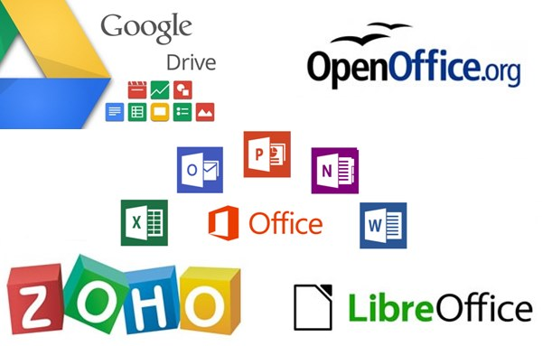
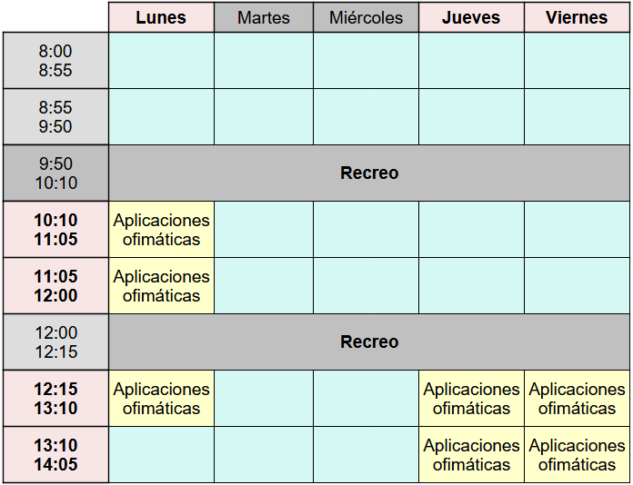
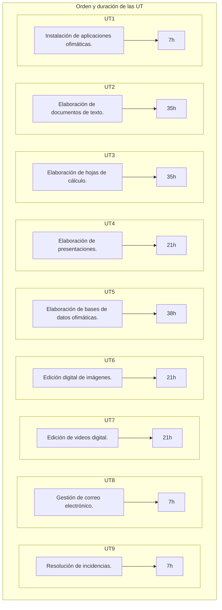

{ .img1 }

## 1 - Calendario escolar

{.sietecinco}

## 2 - Horario de sesiones

{.cincozero}

## 3 - Contenidos

A continuación, se presentan los contenidos de este módulo tal y como aparecen en la [**ORDEN de 29 de julio 2009**](https://dogv.gva.es/datos/2009/09/03/pdf/2009_9808.pdf), de la Conselleria de Educación, por la que se establece para la Comunitat Valenciana el currículo del ciclo formativo de Grado Medio correspondiente al título de **Técnico en Sistemas Microinformáticos y Redes**.
  
!!! info "Instalación de aplicaciones ofimáticas"
    - Tipos de aplicaciones ofimáticas y aplicaciones corporativas.
    - Paquetes ofimáticos.
    - Tipos de licencias software.
    - Necesidades de los entornos de explotación.
    - Procedimientos de instalación y configuración.
    - Diagnóstico y resolución de problemas.

!!! info "Elaboración de documentos y plantillas mediante procesadores de texto"
    – El entorno de trabajo. Personalización.  
    – Formateo de textos. Párrafos. Páginas y Estilos.  
    – Encabezamientos. Pies de Página. Notas a pie.  
    – Esquemas: Viñetas. Listas numeradas.  
    – Gráficos. Imágenes.  
    – Índices y Tablas.  
    – Formularios.  
    – Impresión de documentos.  
    – Combinar documentos.  
    – Creación y uso de plantillas.  
    – Importación y exportación de documentos.  
    – Trabajo en grupo: comparar documentos, versiones de documento, verificar cambios, entre otros.  
    – Diseño y creación de macros.  
    – Utilización de software y hardware para introducir textos e imágenes.  
    – Elaboración de distintos tipos de documentos (manuales, partes de incidencias, entre otros).

!!! info "Elaboración de documentos y plantillas mediante hojas de cálculo"
    – Entorno de trabajo. Personalización.  
    – Conceptos básicos: Libro, hoja, celda, rango, etc…  
    – Formateo de celdas. Estilos.  
    – Manipulación de datos.  
    – Rangos.  
    – Impresión de documentos.  
    – Utilización de fórmulas y funciones.  
    – Creación de tablas y gráficos dinámicos.  
    – Dibujos e imágenes.  
    – Uso de plantillas y asistentes.  
    – Importación y exportación de hojas de cálculo.  
    – Utilización de opciones de trabajo en grupo, control de versiones,verificación de cambios, entre otros.  
    – Elaboración de distintos tipos de documentos (presupuestos, facturas, inventarios, entre otros).  
    – Diseño y creación de macros.  

!!! info "Utilización de bases de datos ofimáticas"
    – Elementos de las bases de datos relacionales.  
    – Organización de bases de datos relacionales.  
    – Creación de bases de datos.  
    – Creación y manejo de tablas.  
    – Manejo de asistentes.  
    – Manipulación de datos: Inserción, modificación y borrado.  
    – Consultas, formularios e informes.  

!!! info "Manipulación de imágenes"
    – Formatos y resolución de imágenes.  
    – Manipulación de selecciones, máscaras y capas.  
    – Utilización de retoque fotográfico, ajustes de imagen y de color.  
    – Aplicación de filtros y efectos.  
    – Importación y exportación de imágenes.  
    – Utilización de dispositivos para obtener imágenes.  

!!! info "Manipulación de vídeos"
    – Formatos de vídeo. Codecs.  
    – Manipulación de la línea de tiempo.  
    – Selección de escenas y transiciones.  
    – Introducción de títulos y audio.  
    – Creación y grabación de videos.  
    – Importación y exportación de vídeos.  

!!! info "Elaboración de presentaciones"
    – El entorno de trabajo. Personalización.  
    – Impresión de presentaciones.  
    – Gráficos, imágenes, dibujos y organigramas.  
    – Diseño y edición de diapositivas.  
    – Manipulación de diapositivas. Modo de visualización.  
    – Formateo de diapositivas, textos y objetos.  
    – Aplicación de efectos de animación y efectos de transición.  
    – Aplicación de sonido y vídeo.  
    – Importación y exportación de presentaciones.  
    – Utilización de plantillas y asistentes. Patrones de diapositivas.  
    – Diseño y creación de macros.  

!!! info "Gestión de correo y agenda electrónica"
    – Entorno de trabajo: configuración y personalización.  
    – Tipos de cuentas de correo.  
    – Plantillas y firmas corporativas.  
    – Foros de noticias (news). Configuración, uso y sincronización de mensajes.  
    – La libreta de direcciones: importar, exportar, añadir contactos, crear listas de distribución, poner la lista a disposición de otras aplicaciones ofimáticas.  
    – Gestión de correos: enviar, borrar, guardar, copias de seguridad, entre otros.  
    – Gestión de la agenda: citas, calendario, avisos, tareas, entre otros.  
    – Sincronización con dispositivos móviles.  

!!! info "Aplicación de técnicas de soporte"
    – Elaboración de guías y manuales de uso de aplicaciones.  
    – Formación al usuario.  
    – Resolución de incidencias.  
    – Aplicaciones para la gestión y control de incidencias.  

## 4 - Metodología de aprendizaje

1. Exposición de los **aspectos teóricos** para que después **sean aplicados mediante prácticas y ejercicios**.  
1. La metodología de trabajo será el **Aprendizaje Basado en Problemas (ABP/PBL)**. Se propondrá un problema real y los alumnos tendrán que buscar una solución, justificándola y comprobando que funciona. Además, si procede, incluirán un pequeño estudio de necesidades y costes para valorar su viabilidad.  
1. Las prácticas podrán ser **individuales o colectivas**.
1. Realización de **actividades voluntarias** de investigación y ampliación para **profundizar en los conocimientos adquiridos**.  
1. **Proyección de vídeos**.

## 5 - Evaluación

1. La evaluación se hará **por resultados de aprendizaje RA** como indica el [**R.D. 659/2023**](https://www.boe.es/boe/dias/2023/07/22/pdfs/BOE-A-2023-16889.pdf)
1. Los resultados de aprendizaje y criterios de evaluación asociados al módulo **Aplicaciones Ofimáticas** constituyen los logros que los alumnos/as tienen que alcanzar para **superar el módulo**.
1. Cada resultado de aprendizaje **RA** se evalúa a través de los criterios de evaluación **CE**. Los **CE** actúan como “desglose” del **RA**, facilitando medir de forma objetiva si el aprendizaje se ha alcanzado.

### 5.1 - Relación entre Criterios de Evaluación y Resultados de Aprendizaje

**Los criterios de evaluación** asociados a los **resultados de aprendizaje** del módulo **Aplicaciones Ofimáticas**, [R.D. 1691/2007](https://www.boe.es/diario_boe/txt.php?id=BOE-A-2008-819), son los siguientes :

=== "RA 1"
    |RA1. Instala y actualiza aplicaciones ofimáticas, interpretando especificaciones y describiendo los pasos a seguir en el proceso.|Peso|
    |-|-|
    |**a)** Se han identificado y establecido las fases del proceso de instalación. |15%|5
    |**b)** Se han respetado las especificaciones técnicas del proceso de instalación. |15%|5
    |**c)** Se han configurado las aplicaciones según los criterios establecidos. |15%|
    |**d)** `Se han documentado las incidencias.` |5%|
    |**e)** Se han solucionado problemas en la instalación o integración con el sistema informático. |10%|
    |**f)** Se han eliminado y/o añadido componentes de la instalación en el equipo. |15%|
    |**g)** Se han actualizado las aplicaciones. |10%|
    |**h)** Se han respetado las licencias software. |10%|
    |**i)** `Se han propuesto soluciones software para entornos de aplicación.` |5%|

=== "RA 2"
    |RA2. Elabora documentos y plantillas, describiendo y aplicando las opciones avanzadas de procesadores de textos.|peso|
    |-|-|
    |**a)** Se ha personalizado las opciones de software y barra de herramientas. |15%|
    |**b)** Se han diseñado plantillas. |10%|
    |**c)** Se han utilizado aplicaciones y periféricos para introducir textos e imágenes. |15%|
    |**d)** Se han importado y exportado documentos creados con otras aplicaciones y en otros formatos.|15%|
    |**e)** Se han creado y utilizado macros en la realización de documentos.|10%|
    |**f)** `Se han elaborado manuales específicos.` |10%|

=== "RA 3"
    |RA3. Elabora documentos y plantillas de cálculo, describiendo y aplicando opciones avanzadas de hojas de cálculo.||
    |-|-|
    |**a)** Se ha personalizado las opciones de software y barra de herramientas. |10%|
    |**b)** Se han utilizado los diversos tipos de datos y referencia para celdas, rangos, hojas y libros. |    10%|
    |**c)** Se han aplicado fórmulas y funciones. |15%|
    |**d)** Se han generado y modificado gráficos de diferentes tipos. |10%|
    |**e)** Se han empleado macros para la realización de documentos y plantillas.|10%|
    |**f)** `Se han importado y exportado hojas de cálculo creadas con otras aplicaciones y en otros formatos.`|10%|
    |**g)** Se ha utilizado la hoja de cálculo como base de datos: formularios, creación de listas, filtrado, protección y ordenación de datos. |10%|
    |**h)** Se han utilizado aplicaciones y periféricos para introducir textos, números, códigos e imágenes.|    10%|

=== "RA 4"
    |RA4. Elabora documentos con bases de datos ofimáticas describiendo y aplicando operaciones de manipulación de datos. ||
    |-|-|
    |**a)** Se han identificado los elementos de las bases de datos relacionales. |10%|
    |**b)** Se han creado bases de datos ofimáticas. |15%|
    |**c)** Se han utilizado las tablas de la base de datos (insertar, modificar y eliminar registros).|10%|
    |**d)** Se han utilizado asistentes en la creación de consultas. |15%|
    |**e)** Se han utilizado asistentes en la creación de formularios. |15%|
    |**f)** Se han utilizado asistentes en la creación de informes. |15%|
    |**g)** Se ha realizado búsqueda y filtrado sobre la información almacenada.|10%|
    |**h)** Se han creado y utilizado macros. |10%|

=== "RA 5"
    |RA5. Manipula imágenes digitales analizando las posibilidades de distintos programas y aplicando técnicas de captura y edición básicas.||
    |-|-|
    |**a)** Se han analizado los distintos formatos de imágenes. |20%|
    |**b)** Se ha realizado la adquisición de imágenes con periféricos. |25%|
    |**c)** Se ha trabajado con imágenes a diferentes resoluciones, según su finalidad.|25%|
    |**d)** Se han empleado herramientas para la edición de imagen digital. |20%|
    |**e)** Se han importado y exportado imágenes en diversos formatos. |10%|

=== "RA 6"
    |RA6. Manipula secuencias de video analizando las posibilidades de distintos programas y aplicando técnicas de captura y edición básicas. ||
    |-|-|
    |**a)** Se han reconocido los elementos que componen una secuencia de video.|20%|
    |**b)** Se han estudiado los tipos de formatos y códecs más empleados. |20%|
    |**c)** Se han importado y exportado secuencias de video. |20%|
    |**d)** Se han capturado secuencias de video con recursos adecuados. |20%|
    |**e)** Se han elaborado video tutoriales. |20%|

=== "RA 7"
    |RA7. Elabora presentaciones multimedia describiendo y aplicando normas básicas de composición y diseño.||
    |-|-|
    |**a)** Se han identificado las opciones básicas de las aplicaciones de presentaciones.|15%|
    |**b)** Se han reconocido los distintos tipos de vista asociados a una presentación. |10%|
    |**c)** Se han aplicado y reconocido las distintas tipografías y normas básicas de composición, diseño y utilización del color. |20%|
    |**d)** Se han diseñado plantillas de presentaciones. |20%|
    |**e)** Se han creado presentaciones. |30%|
    |**f)** Se han utilizado periféricos para ejecutar presentaciones. |5%|

=== "RA 8"
    |RA8. Realiza operaciones de gestión del correo y la agenda electrónica, relacionando necesidades de uso con su configuración.||
    |-|-|
    |**a)** Se han descrito los elementos que componen un correo electrónico. |5%|
    |**b)** Se han analizado las necesidades básicas de gestión de correo y agenda electrónica.|20%|
    |**c)** Se han configurado distintos tipos de cuentas de correo electrónico. |20%|
    |**d)** Se han conectado y sincronizado agendas del equipo informático con dispositivos móviles. |15%|
    |**e)** `Se ha operado con la libreta de direcciones.` |5%|
    |**f)** Se ha trabajado con todas las opciones de gestión de correo electrónico (etiquetas, filtros, carpetas, entre otros).|30%|
    |**g)** `Se han utilizado opciones de agenda electrónica.` |5%|

=== "RA 9"
    |RA9. Aplica técnicas de soporte en el uso de aplicaciones, identificando y resolviendo incidencias.||
    |-|-|
    |**a)** Se han elaborado guías visuales con los conceptos básicos de uso de una aplicación. |5%|
    |**b)** Se han identificado problemas relacionados con el uso de aplicaciones ofimáticas. |25%|
    |**c)** Se han utilizado manuales de usuario para instruir en el uso de aplicaciones. |5%|
    |**d)** Se han aplicado técnicas de asesoramiento en el uso de aplicaciones.|10%|
    |**e)** Se han realizado informes de incidencias. |5%|
    |**f)** Se han aplicado los procedimientos necesarios para salvaguardar la información y su recuperación. |20%|
    |**g)** Se han utilizado los recursos disponibles (documentación técnica, ayudas en línea, soporte técnico, entre otros) para solventar incidencias.|20%|
    |**h)** `Se han solventado las incidencias en el tiempo adecuado y con el nivel adecuado.`|10%|

### 5.2 - Resultados de aprendizaje

En cada unidad de trabajo (UT) se evaluarán los **criterios de evaluación (CE)** correspondientes al **RA**.  
En el caso concreto del módulo **Aplicaciones Ofimáticas**, en cada unidad de trabajo (UT), **se evaluará un RA**.  

!!! info "RA 1 - Instala y actualiza aplicaciones ofimaticas, interpretando especificaciones y describiendo los pasos a seguir en el proceso."
    **UT 1** - Instalación de aplicaciones ofimáticas.

!!! info "RA 2 - Elabora documentos y plantillas, describiendo y aplicando las opciones avanzadas de procesadores de textos."
    **UT 2** - Elaboración de documentos de texto.

!!! info "RA 7 - Elabora presentaciones multimedia describiendo y aplicando normas básicas de composición y diseño."
    **UT 3** - Elaboración de presentaciones.

!!! info "RA 3 - Elabora documentos y plantillas de calculo, describiendo y aplicando opciones avanzadas de hojas de calculo."
    **UT 4** - Elaboración de hojas de cálculo.

!!! info "RA 4 - Elabora documentos con bases de datos ofimaticas describiendo y aplicando operaciones de manipulacion de datos"
    **UT 5** - Elaboración de bases de datos ofimáticas.

!!! info "RA 5 - Manipula imágenes digitales analizando las posibilidades de distintos programas y aplicando técnicas de captura y edición básicas"
    **UT 6** - Edición digital de imágenes.

!!! info "RA 6 - Manipula secuencias de vídeo analizando las posibilidades de distintos programas y aplicando técnicas de captura y edicion basicas"
    **UT 7** - Edición de videos digital.

!!! info "RA 8 - Realiza operaciones de gestión del correo y la agenda electrónica, relacionando necesidades de uso con su configuración."
    **UT 8** - Gestión del correo electrónico.  

!!! info "RA 9 - Aplica técnicas de soporte en el uso de aplicaciones, identificando y resolviendo incidencias."
    **UT 9** - Resolución de incidencias.

### 5.3 - Metodología de evaluación

- La evaluación será **contínua**.
- Se basará en la comprobación de la superación de los **resultados de aprendizaje (RA)**.
- La evaluación se hará sobre **todos los RA y todos los CE** del currículo.

### 5.4 - Instrumentos de evaluación

- Exámenes (preguntas tipo test o ejercicios).
- Entrega de tareas.  
- Exposiciones orales.  
- **Prácticas en empresa**.

### 5.5. - Responsable evaluación de los RA's y/o CE's

1. Evaluación por profesor:  
**Todos lo que no serán evaluados en empresa**.

1. Evaluación por tutor empresa (dualización de los RA y CE):

    === "RA 1"
        **d)** Se han documentado las incidencias.
        **i)** Se han propuesto soluciones software para entornos de aplicación.  

    === "RA 2"
        **g)** Se han elaborado manuales específicos.

    === "RA 3"
        **g)** Se han importado y exportado hojas de cálculo creadas con otras aplicaciones y en otros formatos.

    === "RA 8"
        **e)** Se ha operado con la libreta de direcciones.  
        **g)** Se han utilizado opciones de agenda electrónica.

    === "RA 9"
        **h)** Se han solventado las incidencias en el tiempo adecuado y con el nivel adecuado.

## 6. - Criterios de superación del módulo

### 6.1. - Nota final

La nota final será la suma ponderada de **los resultados de aprendizaje** obtenidos en cada evaluación.  

La superación del módulo requerirá obtener una media mínima de **5 sobre 10 en cada resultado de aprendizaje**.

En caso de no superar el módulo, el alumna/o dispondrá de un proceso de recuperación orientado a reforzar específicamente los resultados de aprendizaje no alcanzados.

|Resultado de aprendizaje|Porcentage|
|-|-|
|**RA 1** - Instala y actualiza aplicaciones ofimaticas, interpretando especificaciones y describiendo los pasos a seguir en el proceso.|5%|
|**RA 2** - Elabora documentos y plantillas, describiendo y aplicando las opciones avanzadas de procesadores de textos.|19%|
|**RA 3** - Elabora documentos y plantillas de calculo, describiendo y aplicando opciones avanzadas de hojas de calculo.|18%|
|**RA 4** - Elabora documentos con bases de datos ofimaticas describiendo y aplicando operaciones de manipulacion de datos.|18%|
|**RA 5** - Manipula imágenes digitales analizando las posibilidades de distintos programas y aplicando técnicas de captura y edicion basicas.|10%|
|**RA 6** - Manipula secuencias de vídeo analizando las posibilidades de distintos programas y aplicando técnicas de captura y edición básicas.|5%|
|**RA 7** - Elabora presentaciones multimedia describiendo y aplicando normas basicas de composicion y diseño.|10%|
|**RA 8** - Realiza operaciones de gestion del correo y la agenda electronica, relacionando necesidades de uso con su configuración.|10%|
|**RA 9** - Aplica técnicas de soporte en el uso de aplicaciones, identificando y resolviendo incidencias.|5%|

### 6.2 - Instrumentos de recuperación

- Se propondrá a los alumnos una serie de **recuperaciones** que le permitirán recuperar los **criterios de evaluación** no superados.
- Si el alumno **no entrega los trabajos obligatorios o presenta tasas de absentismo elevadas**, perderá la evaluación continua y deberá presentarse a la evaluación **ordinaria** y/o **extraordinaria**.

### 6.3 - Calendario de evaluaciones

1. Evaluación inicial (primer mes).
1. **Una evaluación parcial por cada trimestre**.
    - Se daran las notas de los **RA** completados y también la nota **parcial** de los **RA** incompletos.
    - Para tener el aprobado será necesario haber alcanzado una puntuación superior o igual a 5 en los **Resultados de Aprendizaje RA** completados.
1. **Evaluación ordinaria** y **extraordinaria**: Permitirán recuperar los **RA no superados**.

### 6.4 - Condiciones para poder presentarse a las evaluaciones ordinarias y extraordinarias

Para poder presentarse a las convocatorias ordinaria y extraordinaria, el alumnado deberá cumplir con los siguientes requisitos en los RA suspensos:

- Haber presentado **al menos una tarea** por cada criterio de evaluación.
- Haber obtenido **una puntuación mínima de 3/10 en el 60% de las tareas**.

En caso de suspender el módulo en la convocatoria ordinaria, se dispondrá de una convocatoria extraordinaria que consistirá en una prueba sobre los RA no superados.

## 7 - Secuenciación y duración de cada Unidad de Trabajo

```mermaid
flowchart TB
  A["Instalación de aplicaciones ofimáticas."]
  B["Elaboración de documentos de texto."]
  C["Elaboración de hojas de cálculo."]
  D["Elaboración de presentaciones."]
  E["Elaboración de bases de datos ofimáticas."]
  F["Edición digital de imágenes."]
  G["Edición de videos digital."]
  H["Gestión de correo electrónico."]
  I["Resolución de incidencias."]
  AA["7h"]
  BB["35h"]
  CC["35h"]
  DD["21h"]
  EE["38h"]
  FF["21h"]
  GG["21h"]
  HH["7h"]
  II["7h"]

  subgraph Orden y duración de las UT

    subgraph UT9 
      direction LR
      I --> II
    end
    
    subgraph UT8  
      direction LR
      H --> HH
    end
    
    subgraph UT7  
      direction LR
      G --> GG
    end
    
    subgraph UT6  
      direction LR
      F --> FF
    end
    
    subgraph UT5  
      direction LR
      E --> EE
    end
    
    subgraph UT4  
      direction LR
      D --> DD
    end
    
    subgraph UT3  
      direction LR
      C --> CC
    end

    subgraph UT2 
      direction LR
      B --> BB
    end  

    subgraph UT1 
      direction LR
      A --> AA  
    end

  end
```

---

| **Licencia Creative Commons:** | |
| - | - |
|  { .by-nc-nd-eu_ } | **Reconocimiento-NoComercial-CompartirIgual CC BY-NC-SA:**  No se permite un uso comercial de la obra original ni de las posibles obras derivadas, la distribución de la cuales se debe hace con una licencia igual a la que regula la obra original. |
