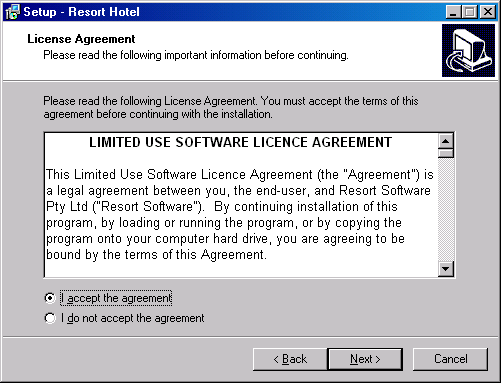
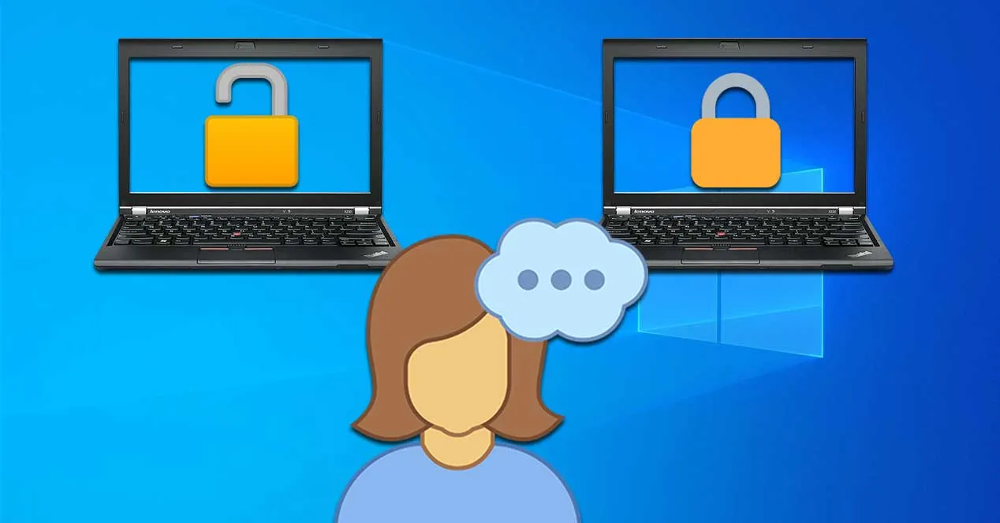
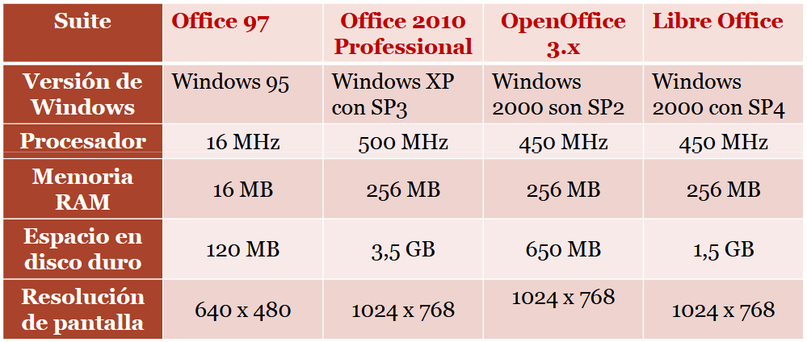

# **Instalación de aplicaciones ofimáticas.**
---

{ .img-center width=75% }

## **Objetivos didácticos**
**¿Qué veremos en esta unidad?**  

- Identificar las distintas fases del proceso de instalación.
- Instalar, configurar, personalizar, actualizar y desinstalar aplicaciones.
- Resolver problemas surgidos durante la instalación.
- Distinguir los distintos tipos de licencias software.
- *Realizar informes de incidencias*.
- *Solucionar problemas utilizando documentación, ayuda y soporte técnico*.

 

**Resultados de aprendizaje y criterios de evaluacion que se evaluarán en esta unidad.**  

| **Resultados de aprendizaje de la unidad didáctica:** |
|-|
| **RA. 1:** Se han identificado y establecido las fases del proceso de instalación.|  

|**Criterios de evaluación de la unidad didáctica:**||
|-|-|
|a) Se han identificado y establecido las fases del proceso de instalación. 	|
|b) Se han respetado las especificaciones técnicas del proceso de instalación. |	
|c) Se han configurado las aplicaciones según los criterios establecidos. 	|
|*d) Se han documentado las incidencias.* 	|Evaluado en empresa|
|e) Se han solucionado problemas en la instalación o integración con el sistema informático.|
|f) Se han eliminado y/o añadido componentes de la instalación en el equipo. 	|
|g) Se han actualizado las aplicaciones. 	|
|h) Se han respetado las licencias software.| 	
|*i) Se han propuesto soluciones software para entornos de aplicación.*|Evaluado en empresa| 

 

## **Indice**
1. Concepto de aplicación ofimática.
1. Tipos de aplicaciones ofimáticas.
1. Gestores de agenda y correo electrónico
1. Suites de aplicaciones ofimáticas.
1. Necesidades de los entornos de aplicación.
1. Procedimientos de instalación.
1. Configuración y actualizaciones.
1. Documentación y soporte técnico.

## **1 - Concepto de aplicación ofimática**
Una **aplicación ofimática** es un tipo de **software** diseñado para realizar tareas comunes en una oficina o entorno laboral. Su propósito es **automatizar, simplificar y mejorar la productividad** en actividades cotidianas.

Originalmente, estas herramientas se centraban en funciones básicas como:

- **Procesadores de texto**: Para crear y editar documentos escritos.
- **Hojas de cálculo**: Para realizar cálculos numéricos y análisis de datos.
- **Programas de presentación**: Para elaborar diapositivas con textos e imágenes para exposiciones.
- **Gestores de bases de datos**: Para organizar y gestionar grandes volúmenes de información.

Con la evolución de la tecnología, las suites ofimáticas se han expandido para incluir una variedad de herramientas, desde **clientes de correo electrónico** y **calendarios** hasta **editores de gráficos** y **software de videoconferencia**. 

 
Actualmente, muchas de estas aplicaciones se ofrecen como servicios en la nube (online), lo que permite a los usuarios acceder a sus documentos y trabajar de forma colaborativa desde cualquier dispositivo con conexión a internet.

!!! question "¿Qué servicio en la nube usamos habitualmente sin darnos cuenta?"

 

|**Resumen:**||
|-|-|  
|**Informática**| Tratamiento automático de la información con ordenadores.|
|**Ofimática**| **Ofi**cina + Infor**mática**, se refiere al uso de la informática para facilitar las tareas habituales que surgen en el hogar y la empresa.|

!!! question "¿Cuáles son las diferencias entre MS Office y LibreOffice?"

## **2 - Tipos de aplicaciones ofimáticas**
Citaremos las más habituales para las personas no expertas.

- **Procesadores de texto**
- **Hojas de cálculo**
- **Gestores de bases de datos**
- **Editores de imagen y vídeo**
- **Programa de presentaciones**
- **Gestores de agenda y correo electrónico**

!!! question "Nombrar desarrolladores de aplicaciones ofimáticas."
!!! question "Dar ejemplos de aplicaciones ofimáticas gratuitas o de pago."
 

### **2.1 - Procesador de texto**
**¿Qué podemos hacer con un procesador de texto?**  

- Formato de caracteres: tamaño, tipo, color, etc.
- Formato de párrafos con sangrías, espacio entre líneas, justificación del texto, etc.
- Formato de página que define márgenes, pie, encabezado y es compatible con etiquetas, cartas, sobres, etc.
- Impresión del trabajo por impresora.
- Incorporación de gráficos, imágenes, tablas, etc.
- Corrección ortográfica y gramatical.
- Inclusión de hipervínculos, índices, etc.
- Dispone de pequeños detalles que permiten una buena presentación de los textos, como la enumeración, la combinación de correspondencia, i plantillas predefinidas.
- Macros

### **2.2 - Hoja de cáculo**
**¿Qué podemos hacer con una hoja de cáculo?**

- Permite el tratamiento de datos en una o diversas hojas.
- Incorpora fórmulas de todo tipo.
- Permite formatear los datos con la misma amplitud que el procesador de textos.
- Permite recorrer las fórmulas, para saber de donde proceden los datos.
- Gráficas.
- Permite copiar fórmulas de manera inteligente.
- Corrección ortográfica, uso de macros, imágenes, vídeo y sonido

### **2.3 - Gestor de base de datos**
**¿Qué podemos hacer con un gestor de base de datos?**

- Creación y mantenimiento de tablas.
- Posibilidad de incluir consultas automatizadas.
- Formularios para la introducción de los datos.
- Informes para la presentación de los datos.
- Asistentes para facilitar el acceso a todas las funciones.

### **2.4 - Editores de imagen y vídeo**
**¿Qué podemos hacer con un editor audiovisual?**

- Realizar el tratamiento de material audiovisual.
- Editar y retocar imágenes digitales (ajuste de color, brillo, contraste, recortes, capas, filtros, etc.).
- Editar vídeos: cortar y unir fragmentos, añadir transiciones, títulos, efectos visuales y de sonido.
- Exportar proyectos en diferentes formatos (imagen, secuencia de vídeo, GIF animado, etc.).

### **2.5 - Programa de presentaciones**
**Permiten, entre otros:**

- Elaborar presentaciones basadas en diapositivas.
- Incluir y editar texto de forma sencilla.
- Insertar imágenes, gráficos, tablas, sonido y vídeo.
- Aplicar efectos y animaciones a los contenidos.
- Configurar transiciones entre diapositivas.
- Facilitar la exposición de ideas de manera visual y estructurada.
- Exportar la presentación en distintos formatos (PDF, vídeo, imágenes, etc.).

### **2.6 - Gestores de agenda y correo electrónico**
**Permiten, entre otros:**

- Las cuentas de correo nos permiten comunicarnos e intercambiar documentación de
forma inmediata.
- La agenda electrónica organiza nuestras tareas, nos avisa de los plazos y programa
reuniones.
- **¡Nos recuerda si tenemos tareas por entregar!**

## **3 - Clasificación del software ofimático**
Las aplicaciones ofimáticas se pueden clasificar según el tipo de software en diferentes categorías, basadas en cómo se distribuyen, cómo se usan y cómo se gestionan. Las más comunes son:

- **Software de escritorio**: Se instalan y ejecutan localmente en el ordenador del usuario.
Ejemplos: Microsoft Office, LibreOffice, Apple iWork.

- **Software en la nube**: Se accede y utiliza directamente desde el navegador web, sin necesidad de instalación local.
Ejemplos: Google Workspace, Microsoft 365 (versión online).

- **Software híbrido**: Combina características de escritorio y de la nube. Se instalan en el dispositivo, pero se integran con servicios online para sincronización y acceso desde cualquier lugar.
Ejemplo: Microsoft 365 (aplicaciones de escritorio integradas con OneDrive).

!!! question "¿Cuales son las ventajas e inconvenientes del software de escritorio?"
!!! question "¿Cuales son las ventajas e inconvenientes del software en la nube?"

## **4 - Licencias de uso del software ofimático**
La **licencia software es el contrato** que suscribe el desarrollador de un programa con el usuario que lo quiere utilizar.

Este contrato regula:  

- Lo que el usuario puede hacer con el programa.
- Lo que el usuario puede exigir al desarrollador.

Son los conocidos **términos y condiciones** para la instalación de software que aparecen cada vez que instalamos software (no solo software ofimático).

{.original}

 

### **4.1 - Tipos de licencias de uso, software propietario y software libre**
{.cincozero}
 

- **Software propietario**  
En el software propietario, privativo o no libre, el desarrollador establece a través de la licencia sus propios términos de uso del programa. Habitualmente se prohíbe la distribución del mismo y el acceso a su código fuente, pero estas licencias pueden impedir además su uso para un determinado fin o incluso limitar el número de veces que el usuario puede instalar el programa.

 

- **Software libre**  
El software libre es aquel que nos garantiza como usuarios la posibilidad de realizar
cuatro acciones sin restricción alguna:  

    1. Utilizar el programa en cualquier contexto.
    1. Compartir copias del programa con otros usuarios.
    1. Acceder al código fuente, y poder mejorarlo o modificarlo para que el programa se comporte de acuerdo con nuestras necesidades.
    1. Compartir ese programa modificado o mejorado con otros usuarios.

!!! question "¿Qué diferencia elemental existe entre el software propietario y el software libre?"

 

### **4.2 - Tipos de licencias de uso, Copyright, dominio público y copyleft**
{.doscinco}

Antes de instalar cualquier programa, es importante conocer quién posee los derechos sobre él. Conceptos como copyright, dominio público y copyleft nos ayudan a entender qué podemos hacer legalmente con ese software.

📌 **Copyright**  

- Es el **derecho de autor** tradicional.
- El creador de una obra (texto, música, software, imagen, etc.) obtiene derechos exclusivos sobre su uso, reproducción y distribución.
- Nadie puede usar la obra sin su permiso, salvo en casos específicos como la *copia privada* o el *uso justo*.

---

📌 **Dominio público**

- Obras que **no tienen restricciones de copyright**.
- Puede ser porque el plazo legal de protección expiró o porque el autor renunció a sus derechos.
- Cualquiera puede usarlas, copiarlas, modificarlas y distribuirlas sin necesidad de pedir permiso.

---

📌 **Copyleft**

- Es un modelo de licencia alternativa dentro del copyright.
- Permite usar, modificar y redistribuir la obra **libremente**, siempre que las versiones derivadas se distribuyan bajo las mismas condiciones.
- Muy común en el software libre (ej.: licencia GPL (**G**eneral **P**ublic **L**icense)).

---

👉 **En resumen**:

- **Copyright** = Todos los derechos reservados.
- **Dominio público** = Ningún derecho exclusivo, uso totalmente libre.
- **Copyleft** = Algunos derechos reservados, pero con obligación de mantener la libertad de derechos en las versiones derivadas.

### **4.3 - Comprobación de conocimientos RA1 CEh**
Ir a Aules, descargar rellenar y volver a subir el documento RA1 CEh.

## **5 - Suites de aplicaciones ofimáticas**
Las **suites de aplicaciones ofimáticas** son conjuntos de programas diseñados para facilitar las tareas habituales en entornos de oficina, estudio o trabajo colaborativo. Estas suites **integran diferentes tipos de aplicaciones** que permiten crear, editar, organizar y compartir documentos de texto, hojas de cálculo, presentaciones, bases de datos, entre otros.

### **5.1 - Características principales**
* **Integración:** Las aplicaciones suelen compartir un entorno común y permiten intercambio de datos entre ellas (p.e., insertar una tabla de una hoja de cálculo en un documento de texto).
* **Colaboración:** las versiones modernas permiten la edición simultánea en línea y la sincronización en la nube.
* **Multiplataforma:** Existen programas de instalación de suites para todos los sistemas operativos del mercado (Windows, macOS, Linux, Android, iOS).

### **5.2 - Componentes habituales**

1. **Procesador de textos:** para redactar y dar formato a documentos (ej. Microsoft Word, Writer en LibreOffice, Google Docs).
1. **Hoja de cálculo:** para gestionar datos numéricos y cálculos (ej. Excel, Calc, Google Sheets).
. **Presentaciones:** para crear diapositivas (ej. PowerPoint, Impress, Google Slides).
1. **Gestor de bases de datos:** para organizar y consultar información (ej. Microsoft Access, Base en LibreOffice).
1. **Clientes de correo y agenda:** (ej. Outlook, Thunderbird).
1. **Otras utilidades:** editores de gráficos, herramientas de dibujo, aplicaciones para tomar notas, etc.

### **5.3 - Tipos de suites**

1. **De escritorio:** Es decir instaladas en el ordenador.
1. **En la nube:** Accesibles desde un navegador (Google Workspace, Microsoft 365 Online...).
1. **Híbridas:** Se instalan localmente por se pueden sincronizar en la nube (Microsoft 365, OnlyOffice).

### **5.4 - Ejemplos de suites**

* **Microsoft Office / Microsoft 365**
* **LibreOffice** alternativa libre y gratuita, basada en el proyecto OpenOffice.
* **OpenOffice**
* **Google Workspace:** Totalmente en la nube, está claramente orientada al trabajo colaborativo.
* **OnlyOffice y WPS Office:** opciones ligeras y compatibles con múltiples formatos.

## **6 - Instalación de suites de aplicaciones ofimáticas**
El proceso de instalación de una suite de aplicaciones ofimáticas suele ser sencillo y guiado, pero es importante conocer las distintas posibilidades: instalación local en el equipo, instalación en red para varios usuarios o incluso el uso de versiones en la nube.  
En nuestro caso nos limitaremos a una instalación local en un solo ordenador por lo que será importante ver si el hardware y software del ordenador es capaz de soportar dicha instalación. 

### **6.1 - Requisitos de las suites ofimáticas más conocidas**
A continuación una tabla con los requisitos minimos de algunas suites.

{.sietecinco}

Como queda evidente, esos requisitos son de hardware y software obsoletos...

!!! task "Tarea RA1-CEb: Se han respetado las especificaciones técnicas del proceso de instalación."
    - Buscar los requisitos de la última versión de OpenOffice.  
    - Comprobar si vuestro equipo cumple con los requisitos mínimos para poder instalarlo.
    - Realizar capturas de pantalla tanto de los requisitos de OpenOffice como de las especificaciones de vuestro equipo.
    - Responder a la siguiente pregunta: ¿Bajo qué versión de licencia se permite el uso de OpenOffice? 
    - Subir el documento a Aules en la tarea **Tarea RA1-CEb**.

### **6.2 - Instalación típica de OpenOffice**
Según el sistema operativo, descargar el paquete de instalación correspondiente y proceder a la instalación. 

!!! task "Tarea RA1-CEa: Se han identificado y establecido las fases del proceso de instalación."
    - Realizar capturas de pantalla de los momentos clave de la instalación.  
    - Comentar brevemente lo que se realiza en cada momento.
    - Subir el documento a Aules en la tarea **Tarea RA1-CEa**.

### **6.3 - Reinstalación de OpenOffice y personalización**
Después de finalizar la instalación y de comprobar que el software instalado funciona correctamente, volver a ejecutar el instalador.  
Al detectarse una instalación anterior el programa propondrá:
    - Modificar la instalación, es decir, añadir o eliminar programas de la suite (p.e., no instalar el módulo `OpenOffice Math`).
    - Reparar la instalación anterior si se han producido errores durante la instalación o si más simplemente el programa ha emprezado a dar errores durante el uso normal del mismo.
    - Desinstalar completamente la suite. 

!!! task "Tarea RA1-CEcf: Se han configurado las aplicaciones según los criterios establecidos / Se han eliminado y/o añadido componentes de la instalación en el equipo"
    - Repetir la instalación de OpenOffice y esta vez **no instalar**:
        1. OpenOffice Impress
        1. OpenOffice Math  
    - Comentar brevemente lo que se realiza en cada momento.
    - Subir el documento a Aules en la tarea **Tarea RA1-CEcf**.

### **6.4 - Actualizaciones de OpenOffice**
Las actualizaciones de cualquier programa forman parte del proceso de mantenimiento normal del software. Su finalidad es garantizar **la seguridad, estabilidad y mejora continua** del software instalado.  
A través de estas actualizaciones se corrigen errores detectados en versiones anteriores, se cierran posibles vulnerabilidades de seguridad y, en ocasiones, se incorporan nuevas funciones.

Es importante entender que actualizar un programa no solo significa “tener la última versión”, sino también asegurar que el software se adapta a los cambios tecnológicos y a las necesidades de los usuarios.  

 
En el caso de OpenOffice, estas actualizaciones pueden realizarse de dos formas principales:

  - Actualización automática: el propio programa puede avisar al usuario cuando existe una nueva versión disponible, simplificando el proceso.

  - Actualización manual: el usuario descarga la última versión desde la página oficial y realiza la instalación de manera directa.

!!! task "Tarea RA1-CEg: Se han actualizado las aplicaciones."
    - Lanzar OpenOffice y familiarizarse con el entorno gráfico.
    - Buscar la opción que permita comprobar si OpenOffice se encuentra totalmente actualizado.   
    - Realizar una captura de pantalla donde se muestra que OpenOffice está actualizado (o no). 
    - Subir el documento a Aules en la tarea **Tarea RA1-CEg**.
    - Responder a la siguiente pregunta: ¿Qué se debería hacer si aparece que OpenOffice no está actualizado? 
    - Responder a la siguiente pregunta: ¿Como se debería actualizar OpenOffice si aparece que está actualizado? 

### **6.5 - Resolución de problemas durante la instalación**
Durante la instalación de un programa pueden surgir distintos problemas que afectarán a su funcionamiento o integración con el sistema informático.  

Estos problemas pueden estar relacionados con la compatibilidad del software, la configuración del sistema operativo, la falta de recursos disponibles o incluso con errores de permisos.

Comprender y resolver estas situaciones es fundamental, ya que garantiza que las aplicaciones ofimáticas funcionen correctamente. 

!!! task "Tarea RA1-CEe: Se han solucionado problemas en la instalación o integración con el sistema informático."
    **Actividad en grupos con exposición oral.**  

    **Formación de grupos:**      
    - Componer grupos de 3-4 personas.
    
    **Escenarios a debatir:**  
    - La instalación se interrumpe por falta de permisos de administrador.  
    - El sistema muestra incompatibilidad con la versión descargada.  
    - Tras la instalación, los archivos .docx o .xlsx no se abren con la suite instalada por defecto.  
    - Conflictos entre versiones previas y la nueva instalación.  
    - Error al actualizar la suite por falta de espacio en disco.  

    **Tarea del grupo:**  
    - Identificar el problema principal del caso.  
    - Proponer posibles soluciones técnicas.  
    - Redactar un breve informe de resolución con pasos claros.  

    **Puesta en común:**  
    - Cada grupo expone sus soluciones, las dificultades detectadas y la solución adoptada.

| **Licencia Creative Commons:** | |
| - | - |
|  | **Reconocimiento-NoComercial-CompartirIgual CC BY-NC-SA:**  No se permite un uso comercial de la obra original ni de las posibles obras derivadas, la distribución de la cuales se debe hace con una licencia igual a la que regula la obra original. | 
  
 

