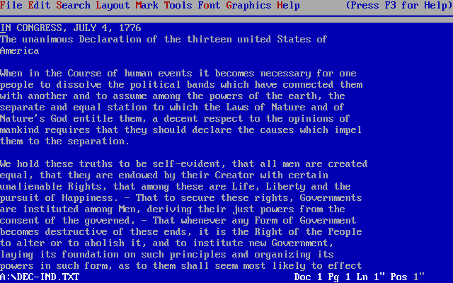

{ .img1 }

## Procesadores de texto.
Un procesador de texto es una herramienta (software o dispositivo físico), diseñada para crear, guardar e imprimir documentos. Con él, se puede redactar y editar texto, ver cómo quedará en pantalla, guardarlo digitalmente o imprimirlo.

El software de procesamiento de texto es una de las herramientas más utilizadas en todo el mundo. Permite a las personas crear una gran variedad de documentos, como currículums, cartas de presentación, correspondencia de trabajo, publicaciones para blogs, novelas y mucho más.

Aunque los procesadores de texto solían ser programas instalables, la aparición de la computación en la nube ha popularizado versiones que funcionan directamente desde un navegador web.  
Si bien estas versiones suelen tener menos funciones avanzadas, ofrecen una mayor flexibilidad y la ventaja de poder colaborar con otras personas en tiempo real en la redacción de un documento.

## Características básicas de los procesadores de texto.

### Manipulación de Texto
La principal función de cualquier procesador de texto es la capacidad de **manipular texto**. Esto incluye operaciones básicas como insertar, cortar, copiar y pegar.  
Las funciones más avanzadas, como el **ajuste de palabras** (o *word wrap*), permiten que el texto salte automáticamente a la siguiente línea cuando la actual está completa.  
Esta facilidad para escribir, editar y mover texto de forma rápida es lo que convierte a los procesadores de texto en una herramienta esencial para cualquier usuario.

### Diseño de Página
Los procesadores de texto te dan control total sobre el **diseño del documento**. Se puede ajustar el tamaño de la página, los márgenes y las sangrías, o incluso añadir columnas.  
Además, es posible incluir elementos como **encabezados, pies de página** e incorporar la numeración automática de las páginas.

### Herramientas de Colaboración
Los **procesadores de texto en la nube** permiten que varias personas colaboren en el mismo documento al mismo tiempo.  
Plataformas como Word en Office.com ofrecen funciones para:  

- **Rastrear cambios** realizados por cada colaborador.  
- **Dejar comentarios** y etiquetar a otros usuarios.  
- **Asignar tareas** a miembros del equipo.  
- **Revisar versiones** anteriores del documento.  

### Especificaciones de Fuentes
Una función básica de cualquier procesador de texto es la capacidad de **modificar las fuentes**.
Se puede cambiar la apariencia del texto de distintas maneras: 

- **Aplicar negrita, cursiva y subrayado.**  
- **Ajustar el tamaño de la fuente.**  
- **Elegir entre diferentes estilos de letra** (tipografías).  

### Gráficos y tablas
Los procesadores de texto permiten **añadir elementos visuales** para enriquecer los documentos, como tablas y listas numeradas.  
Es muy común encontrar en todas las versiones modernas de procesadores de texto la posibilidad de insertar:  

- **Ilustraciones**  
- **Gráficos**  
- **Vídeos**  

### Asistencia para Ortografía y Gramática
Prácticamente todos los procesadores de texto incluyen **correctores de ortografía y gramática** y un **diccionario de sinónimos** para ayudar a encontrar las palabras adecuadas.
Los procesadores de texto no solo corrigen errores, sino que también:  

- **Sugieren mejoras** para que el texto sea más claro.  
- **Buscan similitudes** con fuentes en línea para evitar plagio.  
- **Califican la legibilidad** del documento.  

### Opciones de Guardado y Firma Digital
Los procesadores de texto modernos ofrecen una gran flexibilidad al momento de guardar documentos. Se puede elegir entre una amplia variedad de **formatos de archivo**, como `.docx`, `.pdf` o `.odt`, lo que maximiza la compatibilidad y accesibilidad del documento a cualquier persona.  
Además, es posible proteger la autenticidad e integridad de tu trabajo mediante una **firma digital**. Esta función te permite firmar el documento de manera electrónica, lo que certifica la autoría y asegura que el contenido no ha sido modificado después de la firma. 

## Procesadores de texto más populares.
Aunque existan multitud de opciones la mayoria de usuarios usan Microsoft Office, Google Docs y LibreOffice para la edición de documentos de texto. 
### Procesadores en línea.
1. Editor de documentos de código abierto - ONLYOFFICE
2. Procesador de textos de Google – Google Docs
3. Procesador de textos de Microsoft – Microsoft Word
4. Procesador de textos en línea gratuito – Zoho Writer
5. Solución cifrada – CryptPad
6. Procesador de textos en línea sin inicio de sesión – Aspose Words Editor

### Procesadores para PC's.
1. Procesador de textos multiplataforma – ONLYOFFICE
2. Procesador de textos de Microsoft para Windows – Microsoft Word
3. Procesador de textos para Apple Mac – Pages
4. Procesador de textos de código abierto – LibreOffice Writer

### Procesadores para tabletas y dispositivos móviles.
Existen numerosos procesadores de texto disponibles para dispositivos móviles (tanto iOS como Android), muchos de ellos con funciones muy similares a sus versiones de escritorio. Los más populares y completos son:  

1. ONLYOFFICE Documents para iOS y Android  
2. **Microsoft Word:** La versión móvil de este clásico es una de las opciones más robustas   
3. **Google Docs:** Famoso por su capacidad de colaboración   
4. **Pages (para iOS, iPadOS):**   

## Tipos de procesadores de texto.
La mayoría de los procesadores de texto de la actualidad se basan en el concepto **WYSIWYG** (del inglés What You See Is What You Get, lo que ves es lo que obtienes).  
Eso se traduce en que el aspecto final del documento se aproxima al máximo a lo que el usuario ve en la pantalla.  

Una aproximación diferente a la edición de textos es la que hacen los editores de TeX (y sus derivados como LaTeX), (texto plano) que es procesado para crear archivos de texto con formato en forma de un archivo de impresión, tal como PDF. Entre este tipo de programas se encuentran Kile, Texmaker, TeXstudio, TeXworks, entre otros.

Otro tipo son los procesadores **WYSIWYM** (What You See Is What You Mean, lo que ves es lo que quieres decir).​ Se trabaja con texto sin formato (como en un bloque de notas). A través de ciertas etiquetas **se explica** lo que se quiere conseguir en el documento final (negrita, título, lista…).  
Estos integran las características de los editores de TeX con las características de los procesadores WYSIWYG. Dentro de esta categoría se destaca el programa LyX. 

## Formatos de archivo.
Cada procesador de textos usa su propio formato, aunque el **Rich Text Format** (*.rtf) logró cierta estandarización sin garantizar la misma maquetación en distintos equipos.  
En 1998, KOffice adoptó un formato XML, seguido por OpenOffice.org en 2002 con una versión mejorada, aunque las diferencias de implementación impidieron su adopción generalizada.   Posteriormente, OASIS definió el formato OpenDocument, basado en OpenOffice.org, hoy compatible con LibreOffice, Apache OpenOffice, StarOffice, KOffice, Microsoft Word, AbiWord y TextMaker. Desde 2006 es un estándar abierto y norma ISO.  
El PDF, usado para intercambio sin edición, es cada vez más común como formato adicional o mediante impresoras virtuales, y mantiene la apariencia del documento en cualquier sistema operativo, aunque su complejidad dificulta la edición posterior. También es posible exportar textos a HTML para asegurar su compatibilidad entre plataformas.

| Compañía / Proyecto                 | Formatos principales                | Características destacadas                                                      |
| ----------------------------------- | ----------------------------------- | ------------------------------------------------------------------------------- |
| **Microsoft**                       | DOC, DOCX, RTF, PDF                 | DOC/DOCX son formatos nativos; RTF parcialmente estándar; PDF como exportación. |
| **LibreOffice / Apache OpenOffice** | ODT (OpenDocument), PDF, HTML       | ODT es estándar abierto (OASIS, ISO); exportación a PDF y HTML.                 |
| **KOffice**                         | Formato XML propio, ODT             | XML desde 1998; posteriormente adoptó ODT.                                      |
| **StarOffice**                      | ODT, formatos propietarios antiguos | Migró a ODT tras adopción de OpenDocument.                                      |
| **AbiWord**                         | AW, ODT, RTF, DOC, HTML             | Compatible con múltiples formatos abiertos y propietarios.                      |
| **TextMaker (SoftMaker)**           | TMD, ODT, DOCX, RTF, PDF            | Soporta formatos propios y estándares.                                          |
| **General / Multiplataforma**       | PDF, HTML                           | PDF mantiene la maquetación; HTML asegura compatibilidad web.                   |

| **Licencia Creative Commons:** | |
| - | - |
|  { .by-nc-nd-eu_ } | **Reconocimiento-NoComercial-CompartirIgual CC BY-NC-SA:**  No se permite un uso comercial de la obra original ni de las posibles obras derivadas, la distribución de la cuales se debe hace con una licencia igual a la que regula la obra original. | 
  
 

