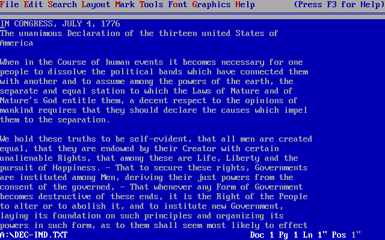

# **UD. 2.1 - Procesadores de texto**

{ .sietecinco }

## **1 - Procesadores de texto**
Un procesador de texto es una herramienta (software o dispositivo físico), diseñada para crear, guardar e imprimir documentos. Con él, se puede redactar y editar texto, ver cómo quedará en pantalla, guardarlo digitalmente o imprimirlo.

El software de procesamiento de texto es una de las herramientas más utilizadas en todo el mundo. Permite a las personas crear una gran variedad de documentos, como currículums, cartas de presentación, correspondencia de trabajo, publicaciones para blogs, novelas y mucho más.

Aunque los procesadores de texto solían ser programas instalables, la aparición de **la computación en la nube** ha popularizado versiones que funcionan directamente desde un navegador web. Estas versiones, suelen tener menos funciones que su equivalente de escritorio pero, ofrecen una mayor flexibilidad al ser accesibles desde cualquier lugar y tienen la ventaja de poder ser colaborativas.

## **2- Características básicas de los procesadores de texto**

### **2.1 - Manipulación de Texto**
La principal función de un procesador de texto es la de **manipular texto**. Esto incluye operaciones básicas como insertar, cortar, copiar y pegar.  
Esta facilidad para escribir, editar y mover texto de forma rápida es lo que convierte a los procesadores de texto en una herramienta esencial para cualquier usuario.

### **2.2 - Diseño de Página**
Se puede, entre otras muchas cosas, ajustar el tamaño de la página, los márgenes y las sangrías, añadir columnas, tablas, imágenes, encabezados, pies de página...

### **2.3 - Herramientas de Colaboración**
Los **procesadores de texto en la nube** permiten que varias personas colaboren en el mismo documento al mismo tiempo.  

!!! exercise "Ejemplo de colaboración"
    1. Crear un documento de texto con **Microsoft 365 Copilot**.
    1. Poneros los 2 a escribir y comprobar el resultado.

### **2.4 - Especificaciones de Fuentes**
Se puede cambiar la apariencia del texto de distintas maneras: 

- **Aplicar negrita, cursiva y subrayado.**  
- **Ajustar el tamaño de la fuente.**  
- **Elegir entre diferentes estilos de letra** (tipografías).  

### **2.5 - Gráficos y tablas**
Los procesadores de texto permiten **añadir elementos visuales** como: 

- **Ilustraciones**  
- **Gráficos**  
- **Vídeos**  

### **2.6 - Asistencia para Ortografía y Gramática**
Todos los procesadores de texto incluyen **correctores de ortografía y gramática** y un **diccionario de sinónimos** para ayudar a encontrar las palabras adecuadas.
Los procesadores de texto no solo corrigen errores, sino que también:  

- **Sugieren mejoras** para que el texto sea más claro.  
- **Buscan similitudes** con fuentes en línea para evitar plagio.  
- **Califican la legibilidad** del documento.  

### **2.7 - Opciones de Guardado y Firma Digital**
Los procesadores de texto ofrecen una gran flexibilidad al momento de guardar documentos. Se puede elegir entre una amplia variedad de **formatos de archivo**, como `.docx`, `.pdf` o `.odt`, lo que maximiza la compatibilidad del documento entre plataformas.  
Además, es posible proteger la autenticidad e integridad de tu trabajo mediante una **firma digital**. Esta función te permite firmar el documento de manera electrónica, lo que certifica la autoría y asegura que el contenido no ha sido modificado después de la firma. 

## **3 - Procesadores de texto más populares**
Aunque existan multitud de opciones la mayoria de usuarios usan **Microsoft Office**, **Google Docs** y **LibreOffice** como herramienta ofimática.

## **4 - Tipos de procesadores de texto**
La mayoría de los procesadores de texto de la actualidad se basan en el concepto **WYSIWYG** (del inglés What You See Is What You Get, lo que ves es lo que obtienes). Eso se traduce en que el aspecto final del documento se aproxima al máximo a lo que el usuario ve en la pantalla.  

Otro tipo son los procesadores **WYSIWYM** (What You See Is What You Mean, lo que ves es lo que quieres decir).​ Se trabaja con texto sin formato (como en un bloque de notas). A través de ciertas etiquetas **se explica** lo que se quiere conseguir en el documento final (negrita, título, lista…).  

**Nota:** El presente documento está escrito con un procesador de textos **WYSIWYM**.

## **5 - Formatos de archivo**
Cada procesador de textos usa su propio formato, aunque el **Rich Text Format** (*.rtf) logró cierta estandarización sin garantizar la misma maquetación en distintos equipos.  
En 1998, KOffice adoptó un formato XML, seguido por OpenOffice.org en 2002 con una versión mejorada, aunque las diferencias de implementación impidieron su adopción generalizada.   Posteriormente, OASIS definió el formato OpenDocument, basado en OpenOffice.org, hoy compatible con LibreOffice, Apache OpenOffice, StarOffice, KOffice, Microsoft Word, AbiWord y TextMaker. Desde 2006 es un estándar abierto y norma ISO.  
El PDF, usado para intercambio sin edición, es cada vez más común como formato adicional o mediante impresoras virtuales, y mantiene la apariencia del documento en cualquier sistema operativo, aunque su complejidad dificulta la edición posterior. También es posible exportar textos a HTML para asegurar su compatibilidad entre plataformas.

| Compañía / Proyecto                 | Formatos principales                | Características destacadas                                                      |
| ----------------------------------- | ----------------------------------- | ------------------------------------------------------------------------------- |
| **Microsoft**                       | DOC, DOCX, RTF, PDF                 | DOC/DOCX son formatos nativos; RTF parcialmente estándar; PDF como exportación. |
| **LibreOffice / Apache OpenOffice** | ODT (OpenDocument), PDF, HTML       | ODT es estándar abierto (OASIS, ISO); exportación a PDF y HTML.                 |
| **KOffice**                         | Formato XML propio, ODT             | XML desde 1998; posteriormente adoptó ODT.                                      |
| **StarOffice**                      | ODT, formatos propietarios antiguos | Migró a ODT tras adopción de OpenDocument.                                      |
| **AbiWord**                         | AW, ODT, RTF, DOC, HTML             | Compatible con múltiples formatos abiertos y propietarios.                      |
| **TextMaker (SoftMaker)**           | TMD, ODT, DOCX, RTF, PDF            | Soporta formatos propios y estándares.                                          |
| **General / Multiplataforma**       | PDF, HTML                           | PDF mantiene la maquetación; HTML asegura compatibilidad web.                   |

| **Licencia Creative Commons:** | |
| - | - |
|  { .by-nc-nd-eu_ } | **Reconocimiento-NoComercial-CompartirIgual CC BY-NC-SA:**  No se permite un uso comercial de la obra original ni de las posibles obras derivadas, la distribución de la cuales se debe hace con una licencia igual a la que regula la obra original. | 
  
 

