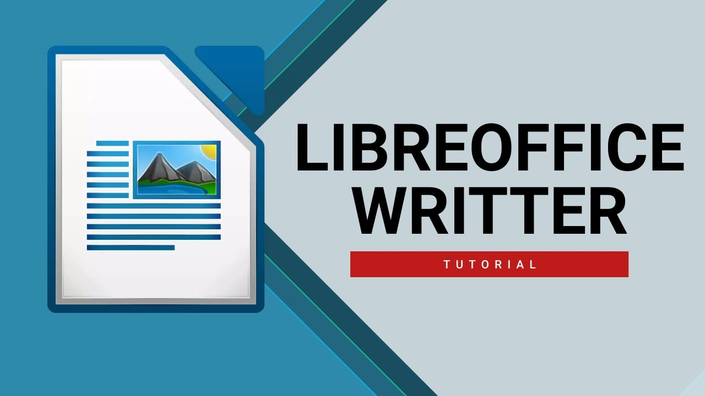{ .img1 }

## **Interfaz de trabajo en Writer**
Después de hacer doble clic sobre el icono de **LibreOffice** seleccionamos **Nuevo &rarr; Documento de texto** y nos encontraremos con la siguiente interfaz.

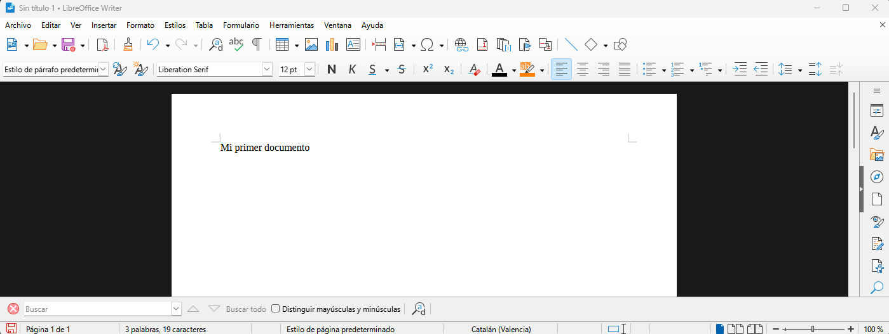

!!! question "Pregunta"
    ¿Qué es lo primero que debemos hacer cuando creamos un nuevo documento?

### **Menú: Archivo**
Permite la creación de un archivo de texto y su posterior guardado, firmado digital o impresión, etc.

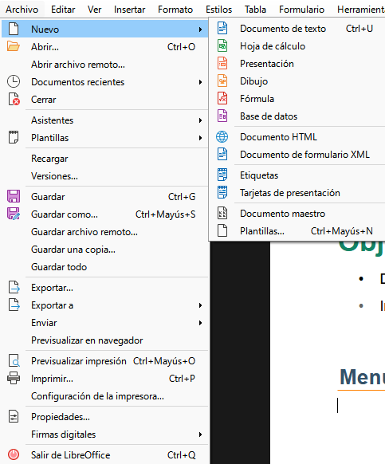{ .m_archivo }
 

### **Menú: Editar**
Aparte del conocido “copiar pegar” también permite buscar, reemplazar palabras... 

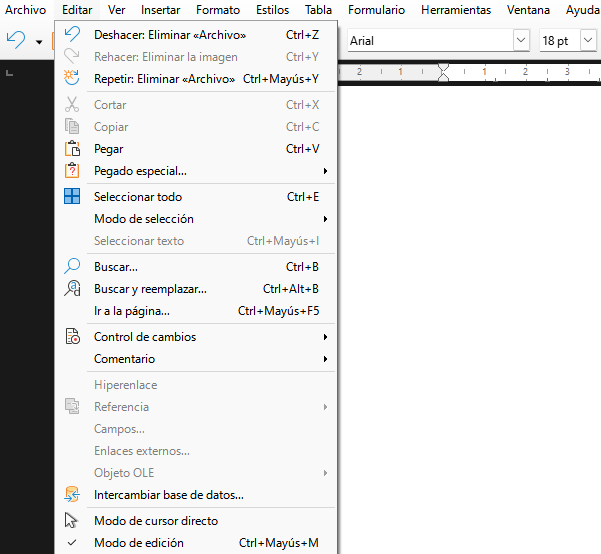{ .m_archivo }
 

### **Menú: Ver**
El menú "Ver" sirve para controlar cómo se muestra el documento en pantalla y qué elementos visuales de la interfaz deseamos ver u ocultar. 
**No modifica el contenido del documento**, solo la forma en que se visualiza mientras trabajamos.

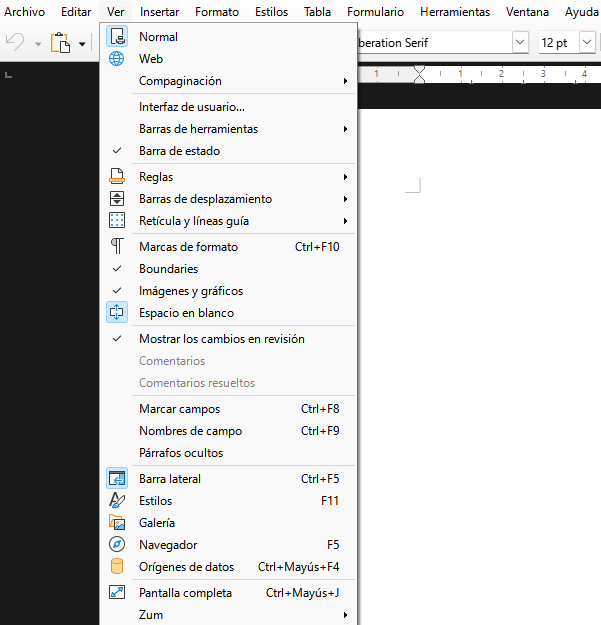{ .m_ver }
 

### **Menú: Insertar**
Ofrece opciones para incluir objetos en nuestro documento: fotografías, dibujos, tablas, ecuaciones matemáticas o incluso otros archivos. También se encuentran aquí algunas opciones de organización del documento, como encabezados y pies de página, numeración, portada o división en secciones. 

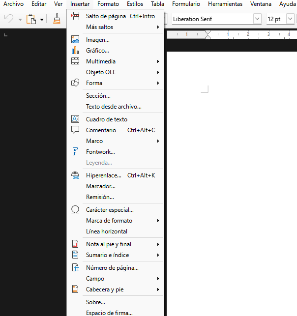{ .m_ver }
 

### **Menú: Formato**
Es, sin duda, la ventana que más se utilizará ya que, permite dar formato y organizar nuestro texto.

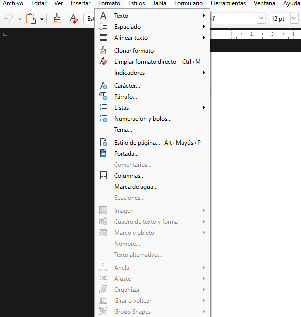{ .m_ver }
 

### **Menú: Estilos**
Casi tan importante como el menú formato, es sin duda el gran olvidado de la mayoría de usuarios.
El dominio de los estilos, **ahorra un tiempo importante** en la elaboración de un documento y **facilita** sus posteriores modificaciones.

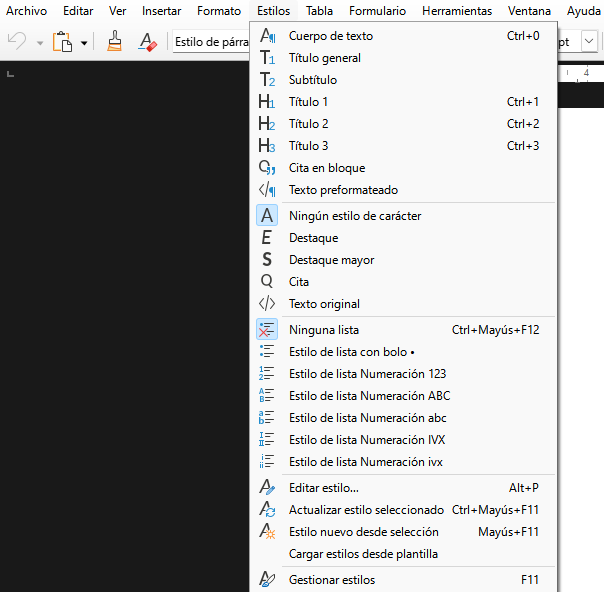{ .m_ver }
 

### **Menú: Tabla**
Las tablas son una forma de estructurar datos en filas y columnas: la información se almacena en los recuadros generados por la intersección de filas y columnas, llamadas celdas.

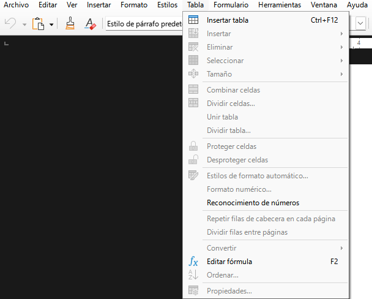{ .m_ver }
 

### **Menú: Formulario**
Sirve para crear, editar y configurar formularios interactivos dentro de un documento de texto, muy útil si se desea hacer plantillas para rellenar, encuestas o documentos que luego se completan digitalmente. 

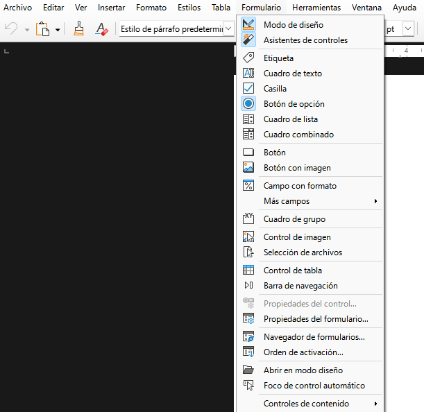{ .m_ver }
 

### **Menú: Herramientas**
Es el menú de la mayoría de herramientas de validación de un documento: En ese menú se encuentran las funciones de ortografía, autocorrección, macros, configuración de idioma, complementos, etc. 

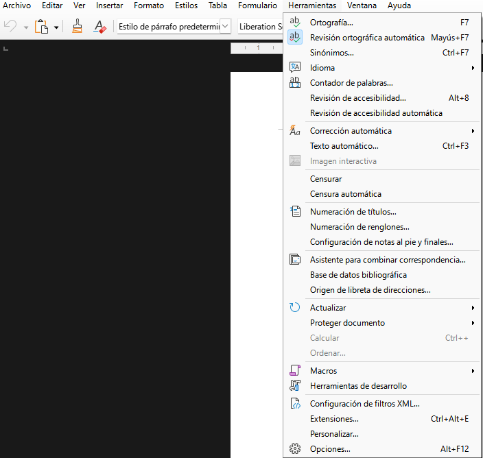{ .m_ver }
 

### **Menú: Ventana**
El menú "Ventana" está pensado para gestionar las distintas ventanas o instancias del programa abiertas en ese momento.
No afecta al contenido del documento, sino a cómo se interactúa con varios documentos o vistas al mismo tiempo.

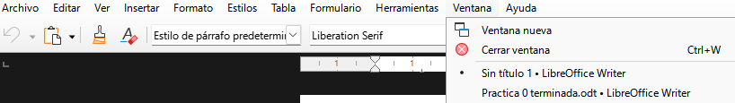{ .m_ver }
 

### **Menú: Ayuda**
Reúne todas las opciones para obtener asistencia, acceder a la documentación oficial y consultar información sobre la instalación de LibreOffice

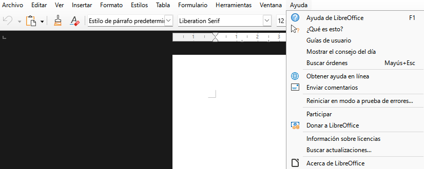{ .m_ver }
 

### **RA2-CE1: Configuración del entorno de trabajo**
#### Personalización del software utilizado.
1. Buscar la opción que permite cambiar el diseño de los iconos.
2. Buscar la opción que permite cambiar el modo (día/noche) de la interfaz de usuario.
3. Dónde se encuentra la opción para cambiar el idioma del documento.
4. ¿Existe la posibilidad de asignar idiomas específicos a cada párrafo?
5. Configurar el procesador de texto para que realice un guardado del documento cada 1 minuto.
6. ¿Qué opción permite al usuario introducir metadatos dentro del archivo creado?
7. ¿Cómo se realiza un zoom? Es decir ¿Qué debo hacer para ver el documento más grande en pantalla?
8. ¿Puedo cambiar la forma en la que me aparece el documento en pantalla? Ed decir ¿Qué debo hacer para poder ver el documento en vista de páginas múltiples o en vista de libro?
9. ¿Qué opción me permite cambiar la forma de seleccionar palabras, letras, imágenes?
10. Cambiar el tipo de letra básico de **Liberation Sans** a **Arial**.
11. Configurar el archivo guardado para que solo se pueda abrir mediante **contraseña**.

#### Personalización de las barras de herramientas.
1. Seleccionar las opciones que permitan mostrar las reglas, tanto superior como vertical.
2. Seleccionar la opción que permite mostrar la barra de estilos.
3. Cambiar la interfaz de usuario para que esta sea similar a la de Microsoft Word.
4. Mostrar, en la interfaz de usuario, varias barras de herramientas (que no aparecen por defecto).
5. Después de mostrar esas barras de herramientas, eliminar varios iconos de esas barras de herramientas de la interfaz de usuario.
6. Cambiar la opción para que, en vez de una coma, sea un punto lo que aparezca en pantalla después de presionar el ‘punto’ del teclado numérico.

#### Condiciones de entrega de la práctica.
Realizar capturas de pantalla de las operaciones realizadas en cada uno de los puntos anteriores y subir el presente documento a la tarea: **RA2-CE1**

#### Enlaces de interés
<a href=https://books.libreoffice.org/es/WG73/WG7320-ConfiguracionDeWriter.html>Configuración writer</a>

### **Familiarización con el uso de Writer**

| **Licencia Creative Commons:** | |
| - | - |
|  { .by-nc-nd-eu_ } | **Reconocimiento-NoComercial-CompartirIgual CC BY-NC-SA:**  No se permite un uso comercial de la obra original ni de las posibles obras derivadas, la distribución de la cuales se debe hace con una licencia igual a la que regula la obra original. | 
  
 

