# **UD. 2.3 - LibreOffice Writer**

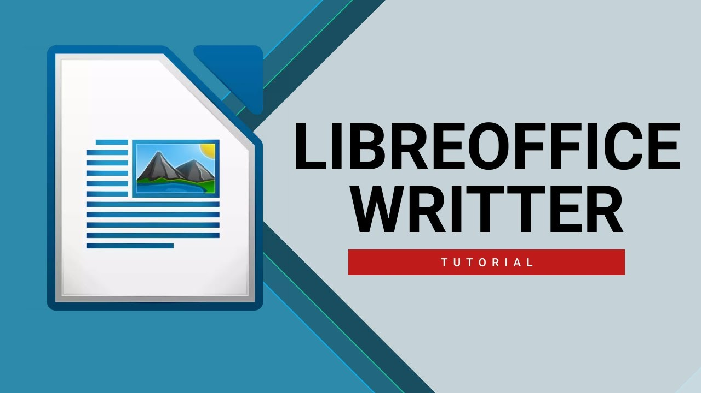{ .sietecinco }
 

**Resultados de aprendizaje y criterios de evaluacion que se evaluarán en esta unidad.**  

| **Resultados de aprendizaje de la unidad didáctica:** |
|-|
| **RA. 2:** Elabora documentos y plantillas, describiendo y aplicando las opciones avanzadas de procesadores de textos.  

|**Criterios de evaluación de la unidad didáctica:**|
    |-|
    |**a)** Se ha personalizado las opciones de software y barra de herramientas. |
    |**b)** Se han utilizado los elementos básicos en la elaboración de documentos. |
    |**c)** Se han diseñado plantillas. |
    |**d)** Se han utilizado aplicaciones y periféricos para introducir textos e imágenes. |
    |**e)** Se han importado y exportado documentos creados con otras aplicaciones y en otros formatos.|
    |**f)** Se han creado y utilizado macros en la realización de documentos.|
    |**g)** Se han elaborado manuales específicos. |

## **1 - Interfaz de trabajo en Writer**
Después de hacer doble clic sobre el icono de **LibreOffice** seleccionamos **Nuevo &rarr; Documento de texto** y nos encontraremos con la siguiente interfaz.

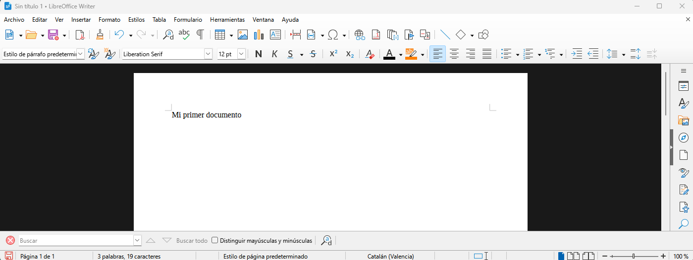

!!! question "Pregunta"
    ¿Qué es lo primero que debemos hacer cuando creamos un nuevo documento?

### **1.1 - Menú: Archivo**
Permite la creación de un archivo de texto y su posterior guardado, firmado digital o impresión, etc.

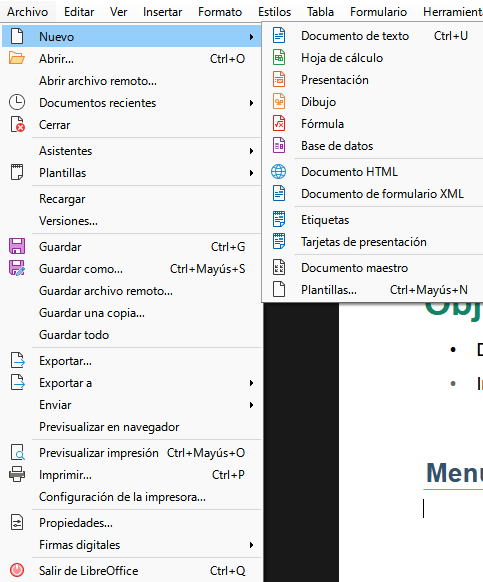{ .m_archivo }
 

### **1.2 - Menú: Editar**
Aparte del conocido “copiar pegar” también permite buscar, reemplazar palabras... 

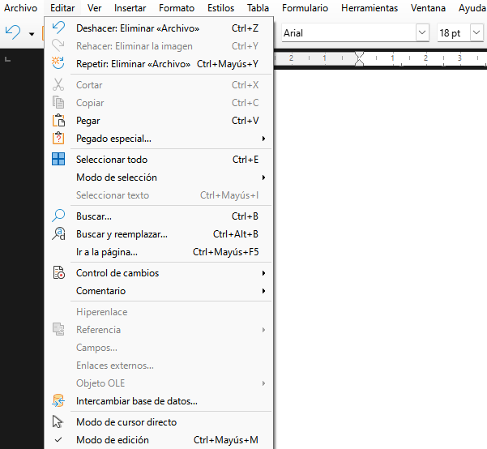{ .m_archivo }
 

### **1.3 - Menú: Ver**
El menú "Ver" sirve para controlar cómo se muestra el documento en pantalla y qué elementos visuales de la interfaz deseamos ver u ocultar. 
**No modifica el contenido del documento**, solo la forma en que se visualiza mientras trabajamos.

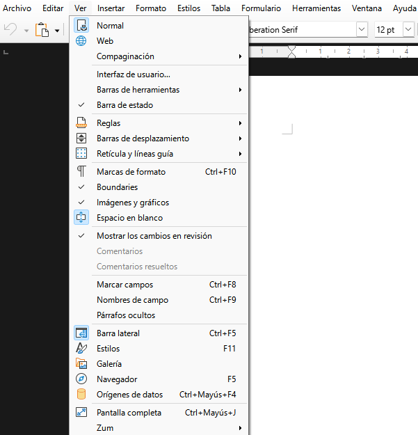{ .m_ver }
 

### **1.4 - Menú: Insertar**
Ofrece opciones para incluir objetos en nuestro documento: fotografías, dibujos, tablas, ecuaciones matemáticas o incluso otros archivos. También se encuentran aquí algunas opciones de organización del documento, como encabezados y pies de página, numeración, portada o división en secciones. 

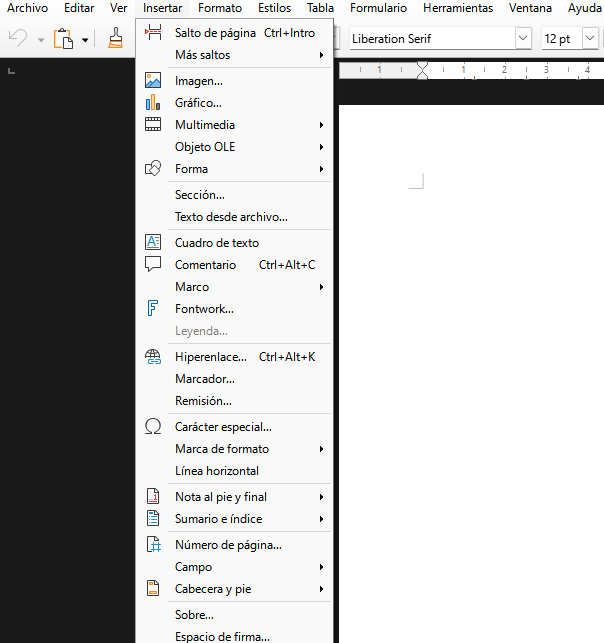{ .m_ver }
 

### **1.5 - Menú: Formato**
Es, sin duda, la ventana que más se utilizará ya que, permite dar formato y organizar nuestro texto.

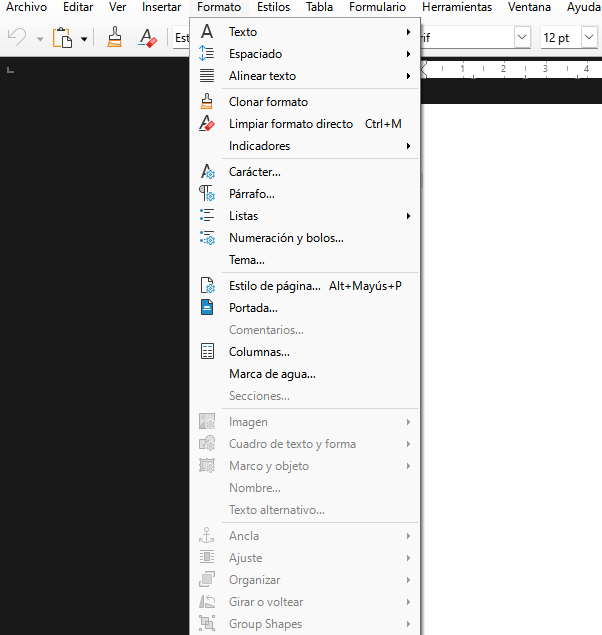{ .m_ver }
 

### **1.6 - Menú: Estilos**
Casi tan importante como el menú formato, es sin duda el gran olvidado de la mayoría de usuarios.
El dominio de los estilos, **ahorra un tiempo importante** en la elaboración de un documento y **facilita** sus posteriores modificaciones.

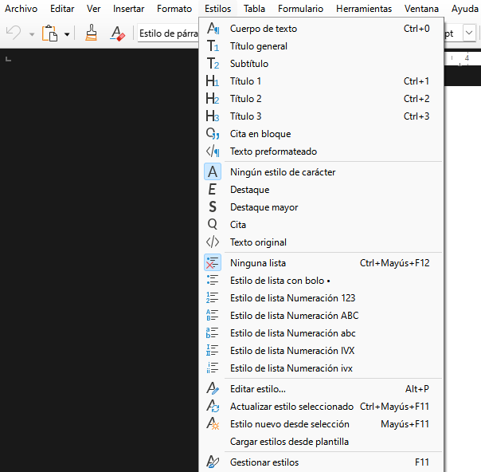{ .m_ver }
 

### **1.7 - Menú: Tabla**
Las tablas son una forma de estructurar datos en filas y columnas: la información se almacena en los recuadros generados por la intersección de filas y columnas, llamadas celdas.

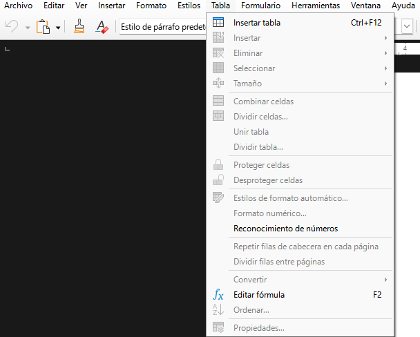{ .m_ver }
 

### **1.8 - Menú: Formulario**
Sirve para crear, editar y configurar formularios interactivos dentro de un documento de texto, muy útil si se desea hacer plantillas para rellenar, encuestas o documentos que luego se completan digitalmente. 

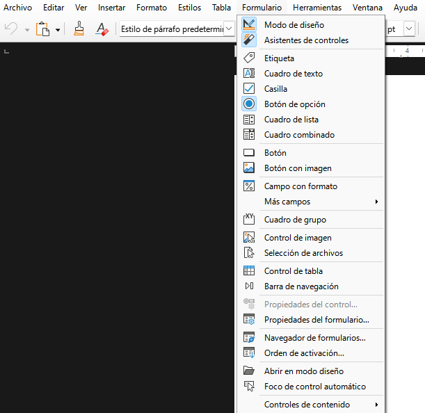{ .m_ver }
 

### **1.9 - Menú: Herramientas**
Es el menú de la mayoría de herramientas de validación de un documento: En ese menú se encuentran las funciones de ortografía, autocorrección, macros, configuración de idioma, complementos, etc. 

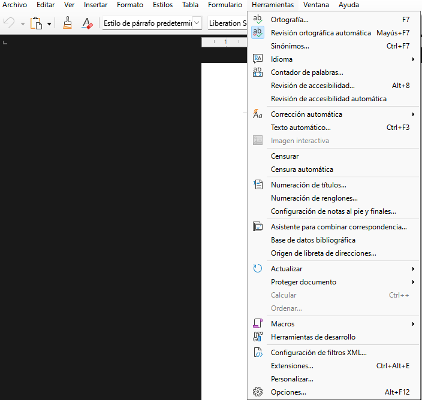{ .m_ver }
 

### **1.10 - Menú: Ventana**
El menú "Ventana" está pensado para gestionar las distintas ventanas o instancias del programa abiertas en ese momento.
No afecta al contenido del documento, sino a cómo se interactúa con varios documentos o vistas al mismo tiempo.

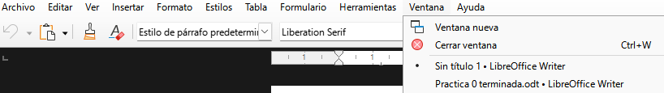{ .m_ver }
 

### **1.11 - Menú: Ayuda**
Reúne todas las opciones para obtener asistencia, acceder a la documentación oficial y consultar información sobre la instalación de LibreOffice

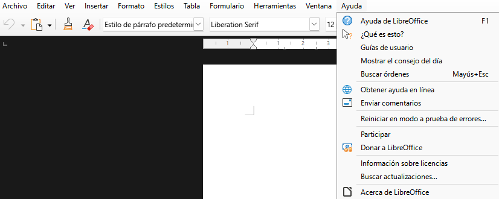{ .m_ver }
 

### **1.12 - Configuración del entorno de trabajo**
#### Tarea RA2-CEa:

!!! task "Tarea - Personalización del software utilizado."
     **Parte hecha en clase:**  

     1. Buscar la opción que permite cambiar el modo (día/noche) de la interfaz de usuario ¿Qué occure cuando escribimos texto?
     1. Buscar la opción que permite cambiar el diseño de los iconos (Opciones LibreOffice Tema).
     1. Buscar la opción que permite cambiar el diseño de la interfaz de usuario.
     1. ¿Dónde se encuentra la opción para cambiar el idioma del documento?
     1. ¿Qué debo hacer para que al crear un documento, este siempre esté en un languaje en concreto?
     1. ¿Existe la posibilidad de asignar idiomas específicos a cada párrafo?
     1. Configurar el procesador de texto para que realice un guardado del documento cada 1 minuto.
     1. ¿Qué opción permite al usuario introducir metadatos dentro del archivo creado?
     1. ¿Cómo se realiza un zoom? Es decir ¿Qué debo hacer para ver el documento más grande en pantalla?
     1. ¿Puedo cambiar la forma en la que me aparece el documento en pantalla? Ed decir ¿Qué debo hacer para poder ver el documento en vista de páginas múltiples o en vista de libro?
     1. ¿Qué opción me permite cambiar la forma de seleccionar palabras, letras, imágenes?
     1. Cambiar el tipo de letra básico de **Liberation Sans** a **Arial**.
     1. Configurar el archivo guardado para que solo se pueda abrir mediante **contraseña**.
    

!!! task "Tarea - Personalización de las barras de herramientas."
     **Parte a entregar**:  

    1. Seleccionar las opciones que permitan mostrar las reglas, tanto superior como vertical (pista: ver).
    1. Seleccionar la opción que permite mostrar la barra de estilos (pista: ver).
    1. Cambiar la interfaz de usuario para que esta sea similar a la de Microsoft Word (pista: ver).
    1. Mostrar, en la interfaz de usuario, varias barras de herramientas que no aparecen por defecto (p.e. Controles de formulario y Tabla).
    1. Después de mostrar esas barras de herramientas, eliminar varios iconos de esas barras de herramientas de la interfaz de usuario (pista: personalizar).
    1. Cambiar la opción para que, en vez de una coma, sea un punto lo que aparezca en pantalla después de presionar el ‘punto’ del teclado numérico (pista: personalizar, configurar idioma, separador decimal).

#### Condiciones de entrega de la práctica.
Realizar una captura de un documento dónde se vean las personalizaciones de las barras de herramientas. Subir la captura a Aules en **Tarea RA2-CEa**.

### **Enlaces de interés**
<a href=https://books.libreoffice.org/es/WG73/WG7320-ConfiguracionDeWriter.html>Configuración writer</a>

## **2 - Familiarización con el uso de Writer**

## **2.1 - Creación y edición básica de un documento de texto**
### Tarea - RA2-CEb-1
!!! task "Tarea a entregar en RA2-CEb-1"
    **1. Abre un nuevo documento y copia el siguiente texto:**  
    Michael Jeffrey Jordan (Brooklyn, Nueva York, 17 de febrero de 1963) es un exjugador de baloncesto estadounidense. Con 1,98 metros de altura, jugaba en la posición de escolta. Es considerado por la mayoría de aficionados y especialistas como el mejor jugador de baloncesto de todos los tiempos.​ Se retiró definitivamente a los cuarenta años en 2003 en los Washington Wizards, tras haberlo hecho en dos ocasiones anteriores, en 1993 y 1998, después de haber jugado 13 temporadas en los Chicago Bulls.

    Ganó 6 anillos con Chicago Bulls, promediando 30,1 puntos por partido en toda su carrera deportiva, el mayor promedio en la historia de la liga. También ganó 10 títulos de máximo anotador, 5 MVP de la temporada, 6 MVP de las Finales; fue nombrado en el mejor quinteto de la NBA en diez ocasiones, en el defensivo nueve veces, líder en robos de balón durante tres años y un premio al mejor defensor de la temporada.

    Desde 1983, ha aparecido en la portada de la prestigiosa revista deportiva Sports Illustrated en 50 ocasiones, todo un récord, además de ser designado deportista del año en 1991 y mejor atleta del siglo XX por ESPN y segundo tras Babe Ruth por Associated Press.​ 

    **2. Seleccionar y mover texto:**  
    Selecciona el segundo párrafo, cortalo y pegalo después del último párrafo.

    **3. Buscar y reemplazar texto:**  
    Con la herramienta de **buscar** y/o **buscar reemplazar** localizar el texto: **10 títulos** y reemplazarlo por **15 MPV**.

    **4. Corrección ortográfica:**  
    &nbsp;&nbsp;&nbsp;&nbsp;a. Pasar el idioma del primer párrafo a idioma inglés. Es decir el Writer deberá revisar el primer párrafo como si estuviera escrito en idioma inglés.  
    &nbsp;&nbsp;&nbsp;&nbsp;b. Pasar el idioma de la palabra **Desde** a catalán.  

    **5. Guardar y guardar como:**  
    &nbsp;&nbsp;&nbsp;&nbsp;a. **Guardar** el documento y darle como nombre: **RA2-CEb-1-Nombre Alumno**.  
    &nbsp;&nbsp;&nbsp;&nbsp;b. **Guardar como** el documento, **protegerlo con la contraseña 1234** y darle como nombre **Copia RA2-CEb-1-Nombre Alumno**.

    **6. Entregar la tarea:**  
    Subir los 2 archivos **RA2-CEb-1-Nombre Alumno** y **Copia RA2-CEb-1-Nombre Alumno** a la **tarea RA2-CEb-1**.  

## **2.2 - Formatos de texto**
### Tarea - RA2-CEb-2
!!! task "Tarea a entregar en RA2-CEb-2"
    **1. Abre un nuevo documento y copia el siguiente texto:**  
    Michael, hijo de James y Deloris Jordan, nació en Brooklyn, Nueva York. Su familia se mudó a Wilmington, Carolina del Norte, cuando él era niño. Estudió en la Ogden Elementary School, y posteriormente asistió a la preparatoria Emsley A. Laney, donde, debido a sus impresionantes condiciones atléticas, jugó al baloncesto, béisbol y fútbol americano. Sin embargo, fue apartado del equipo de baloncesto en su segundo año porque para su altura (1,80 metros) estaba aparentemente subdesarrollado. El verano siguiente, creció 10 centímetros y se entrenó rigurosamente.​ En su último año en Laney High, promedió un triple-doble: 29,2 puntos, 11,6 rebotes y 10,1 asistencias,​ y fue seleccionado en el McDonald's All-American Team.​ 
    
    **Todo el texto deberá estar inicialmente en ARIAL**

    **2. Modificar el texto de la siguiente manera:**  
    &nbsp;&nbsp;&nbsp;&nbsp;a. Poner la primera frase **en negrita**.  
    &nbsp;&nbsp;&nbsp;&nbsp;b. Poner la frase siguiente **en itálica**.  
    &nbsp;&nbsp;&nbsp;&nbsp;c. Poner la frase siguiente **en subrayado**.  
    &nbsp;&nbsp;&nbsp;&nbsp;d. Poner la frase siguiente **tachado**.  
    &nbsp;&nbsp;&nbsp;&nbsp;e. Poner la frase siguiente **subrayado + onda**.  
    &nbsp;&nbsp;&nbsp;&nbsp;f. Poner la frase siguiente **en color de fondo, verde realzado**.  
    &nbsp;&nbsp;&nbsp;&nbsp;g. Poner dentro de la última frase las palabras "McDonald's All-American Team":  
    &nbsp;&nbsp;&nbsp;&nbsp;&nbsp;&nbsp;&nbsp;&nbsp; - Bordes superiores e inferiores, **color green 1**.  
    &nbsp;&nbsp;&nbsp;&nbsp;&nbsp;&nbsp;&nbsp;&nbsp; - Separación superior e inferior, **0.2 y 0.1**.    
    &nbsp;&nbsp;&nbsp;&nbsp;&nbsp;&nbsp;&nbsp;&nbsp; - Estilo de sombra: **inferior izquierda**.    
    &nbsp;&nbsp;&nbsp;&nbsp;&nbsp;&nbsp;&nbsp;&nbsp; - Color de sombra: **Naranja 3**.    
    &nbsp;&nbsp;&nbsp;&nbsp;&nbsp;&nbsp;&nbsp;&nbsp; - Distancia de sombra: **0.1cm**.    

    &nbsp;&nbsp;&nbsp;&nbsp;h. Añadir los números 2 y 10 y ponerles respectivamente el superíndice 125 y subíndice 512.  

    &nbsp;&nbsp;&nbsp;&nbsp;**El texto quedará de la siguiente manera:**

    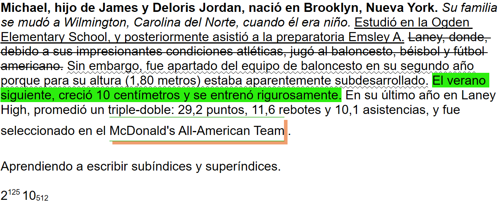{.sietecinco}

     
    **3. Copiar y pegar el texto y limpiar los formatos.**  
    &nbsp;&nbsp;&nbsp;&nbsp;a. Poner la primera frase **color RGB 125 135 247**.  
    &nbsp;&nbsp;&nbsp;&nbsp;b. Poner la frase siguiente **color RGB 125 135 247 y tamaño de fuente 16pt**.  
    &nbsp;&nbsp;&nbsp;&nbsp;c. Poner la frase siguiente **fuente mistral**.  
    &nbsp;&nbsp;&nbsp;&nbsp;d. Poner la frase siguiente **color púrpura y todo en mayúsculas**.  
    &nbsp;&nbsp;&nbsp;&nbsp;e. Poner la frase siguiente **primera letra de cada palabra en mayúsculas**.  
    &nbsp;&nbsp;&nbsp;&nbsp;f. Poner la frase siguiente **fue seleccionada con un hiperenlace https://es.wikipedia.org/wiki/Michael_Jordan**.  

    &nbsp;&nbsp;&nbsp;&nbsp;**El texto quedará de la siguiente manera:**

    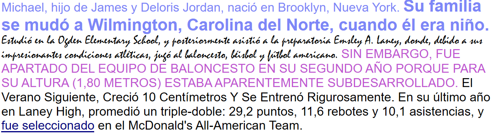{.sietecinco}

     
    **4. Copiar y pegar el texto y limpiar los formatos.**  
    &nbsp;&nbsp;&nbsp;&nbsp;a. Poner **Deloris Jordan** en tamaño de fuente 14, negrita y con un escalado de anchura del 85%.   
    &nbsp;&nbsp;&nbsp;&nbsp;b. Poner **Nueva York** en  negrita, púrpura 2 y **sombra**.  
    &nbsp;&nbsp;&nbsp;&nbsp;c. Poner **Carolina del norte** en  negrita, green 1 y giro de 270 grados.  
    &nbsp;&nbsp;&nbsp;&nbsp;d. Poner **Ogden Elementary School** en azul 2 y un espaciado entre caracteres de 1.0pt.  
    &nbsp;&nbsp;&nbsp;&nbsp;e. Poner **Sin embargo** en naranja 1 y con efecto contorno.  
    &nbsp;&nbsp;&nbsp;&nbsp;f. Poner **centímetros** en naranja 2 y giro de 90 grados.  
    
    &nbsp;&nbsp;&nbsp;&nbsp;**El texto quedará de la siguiente manera:**

    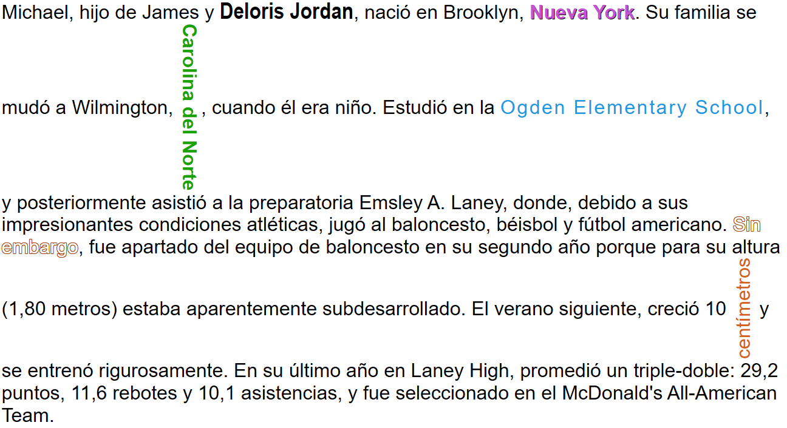{.sietecinco}

    **5. Aprendiendo a insertar caracteres especiales:**  
    Escribar la siguiente frase.  
    Ω es el símbolo de la unidad de medida, <u>el ohmio</u> , que se usa para la resistencia eléctrica. 

    Deberéis insertar el **carácter especial** `omega` del bloque de carácteres `Griego y copto`. Acordaros de subrayar la palabra **ohmio**. 

    **6. Aprendiendo a escribir fórmulas:**  
    Ir a **Insertar &rarr; Objeto OLE &rarr; Objeto de fórmula...** y escribir la siguiente fórmula.
    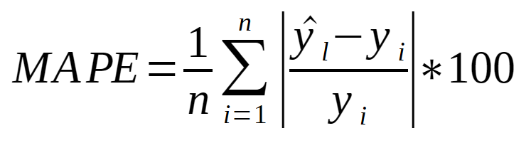{.doscinco}

   
## **2.3 - Formatos de párrafo**
### **Tarea - RA2-CEb-3**
!!! task "Tarea a entregar en RA2-CEb-3"
    **1. Abre un nuevo documento y copia el siguiente texto:**  
    Michael Jordan
    No debe confundirse con Michael B. Jordan.  
    Michael Jeffrey Jordan (Brooklyn, Nueva York, 17 de febrero de 1963) es un exjugador de baloncesto estadounidense. Con 1,98 metros de altura, jugaba en la posición de escolta. Es considerado por la mayoría de aficionados y especialistas como el mejor jugador de baloncesto de todos los tiempos.[2]​[3] ​Se retiró definitivamente a los cuarenta años en 2003 en los Washington Wizards, tras haberlo hecho en dos ocasiones anteriores, en 1993 y 1998, después de haber jugado 13 temporadas en los Chicago Bulls.[4]​  
    Ganó 6 anillos con Chicago Bulls, promediando 30,1 puntos por partido en toda su carrera deportiva, el mayor promedio en la historia de la liga. También ganó 10 títulos de máximo anotador, 5 MVP de la temporada, 6 MVP de las Finales; fue nombrado en el mejor quinteto de la NBA en diez ocasiones, en el defensivo nueve veces, líder en robos de balón durante tres años y un premio al mejor defensor de la temporada.   
    Desde 1983, ha aparecido en la portada de la prestigiosa revista deportiva Sports Illustrated en 50 ocasiones, todo un récord, además de ser designado  deportista del año en 1991 y mejor atleta del siglo XX por ESPN y segundo tras Babe Ruth por Associated Press.[5]​  
    En la actualidad es el propietario del equipo 23XI Racing en la Copa NASCAR,[6]​ y, desde 2010 a 2023, fue propietario de los Charlotte Hornets en la NBA.[7]​[8]​   
    En 2021 se calculaba que su patrimonio neto era de $1600 millones,[9]​[10]​ fortuna que ascendió a los $3000 millones en octubre de 2023, entrando en la lista Forbes 400, siendo la primera vez que un deportista profesional figura entre las personas más ricas de Estados Unidos.[11]

    **2. Modificar los párrafos de la siguiente manera:**  
    &nbsp;&nbsp;&nbsp;&nbsp;a. Primer párrafo: **centrado**.  
    &nbsp;&nbsp;&nbsp;&nbsp;b. Párrafo siguiente: **alinear a la izquierda**.  
    &nbsp;&nbsp;&nbsp;&nbsp;c. Párrafo siguiente: **alinear a la izquierda**.  
    &nbsp;&nbsp;&nbsp;&nbsp;d. Párrafo siguiente: **alinear a la derecha**.  
    &nbsp;&nbsp;&nbsp;&nbsp;e. Párrafo siguiente: **justificado**.  
    &nbsp;&nbsp;&nbsp;&nbsp;f. Párrafo siguiente: **aumentar sangria una vez**.  
    &nbsp;&nbsp;&nbsp;&nbsp;f. Párrafo siguiente: **aumentar sangria 2 veces**.  

    &nbsp;&nbsp;&nbsp;&nbsp;**El texto quedará de la siguiente manera:**

    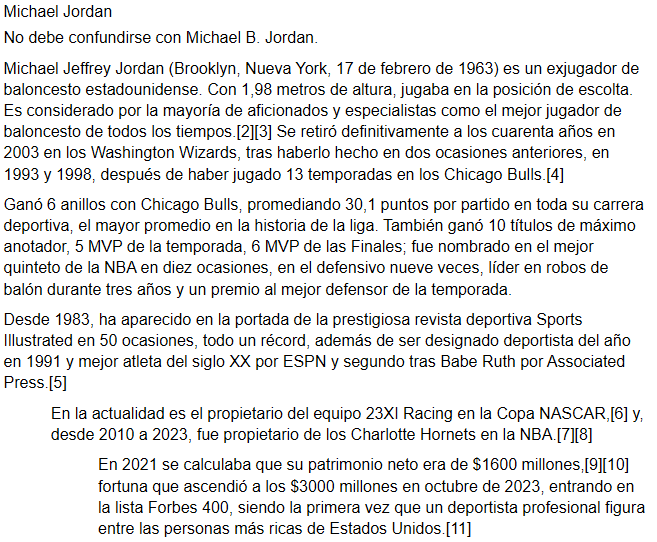{.sietecinco}

     
    **3. Copiar y pegar los párrafos en el mismo documento de la siguiente manera:**  
    &nbsp;&nbsp;&nbsp;&nbsp;a. Copiar el pegar el documento creado anteriormente **insertando un salto de página**.  
    &nbsp;&nbsp;&nbsp;&nbsp;b. Todos los párrafos: **ver imagen**  
    &nbsp;&nbsp;&nbsp;&nbsp;c. Primer párrafo: **Espacio sobre el párrafo 0.5cm, debajo 1.5cm**  
    &nbsp;&nbsp;&nbsp;&nbsp;c. Párrafo siguiente: **Espacio sobre el párrafo 0.0cm, debajo 0.50cm**  
    &nbsp;&nbsp;&nbsp;&nbsp;c. Resto párrafos: **Espacio sobre el párrafo 0.0cm, debajo 0.75cm**
    
    **4. Seguir con el texto anterior y además modificar los estilos de párrafos con:**  
    &nbsp;&nbsp;&nbsp;&nbsp;**a. Párrafo 4:**   
    &nbsp;&nbsp;&nbsp;&nbsp;&nbsp;&nbsp;&nbsp;&nbsp; - Interlineado 1.5 renglones.  
    &nbsp;&nbsp;&nbsp;&nbsp;&nbsp;&nbsp;&nbsp;&nbsp; - Sangría antes de texto: 0.5cm.  
    &nbsp;&nbsp;&nbsp;&nbsp;&nbsp;&nbsp;&nbsp;&nbsp; - Sangría después de texto: 0.3cm.  
    &nbsp;&nbsp;&nbsp;&nbsp;&nbsp;&nbsp;&nbsp;&nbsp; - Primer renglón: 0.5cm  
    &nbsp;&nbsp;&nbsp;&nbsp;**b. Párrafo 5:**     
    &nbsp;&nbsp;&nbsp;&nbsp;&nbsp;&nbsp;&nbsp;&nbsp; - Interlineado 2 renglones.  
    &nbsp;&nbsp;&nbsp;&nbsp;&nbsp;&nbsp;&nbsp;&nbsp; - Sangría antes de texto: 1cm.  
    &nbsp;&nbsp;&nbsp;&nbsp;&nbsp;&nbsp;&nbsp;&nbsp; - Sangría después de texto: 1cm.  
    &nbsp;&nbsp;&nbsp;&nbsp;&nbsp;&nbsp;&nbsp;&nbsp; - Primer renglón: 1cm.  
    &nbsp;&nbsp;&nbsp;&nbsp;**b. Párrafo 6:**     
    &nbsp;&nbsp;&nbsp;&nbsp;&nbsp;&nbsp;&nbsp;&nbsp; - Interlineado 2 renglones.  
    &nbsp;&nbsp;&nbsp;&nbsp;&nbsp;&nbsp;&nbsp;&nbsp; - Sangría antes de texto: 0cm.  
    &nbsp;&nbsp;&nbsp;&nbsp;&nbsp;&nbsp;&nbsp;&nbsp; - Sangría después de texto: 0cm.  
    &nbsp;&nbsp;&nbsp;&nbsp;&nbsp;&nbsp;&nbsp;&nbsp; - Primer renglón: 1cm.  
    &nbsp;&nbsp;&nbsp;&nbsp;**b. Párrafo 7:**     
    &nbsp;&nbsp;&nbsp;&nbsp;&nbsp;&nbsp;&nbsp;&nbsp; - Interlineado 1.5 renglones.  
    &nbsp;&nbsp;&nbsp;&nbsp;&nbsp;&nbsp;&nbsp;&nbsp; - Sangría antes de texto: 0.5cm.  
    &nbsp;&nbsp;&nbsp;&nbsp;&nbsp;&nbsp;&nbsp;&nbsp; - Sangría después de texto: 0.3cm.  
    &nbsp;&nbsp;&nbsp;&nbsp;&nbsp;&nbsp;&nbsp;&nbsp; - Primer renglón: 0.5cm  
    &nbsp;&nbsp;&nbsp;&nbsp;&nbsp;&nbsp;&nbsp;&nbsp; - Letras capitulares: Caracteres=2, Renglones=2.  
 
    &nbsp;&nbsp;&nbsp;&nbsp;**El texto quedará de la siguiente manera:**
    !!!warning "¡Cuidado con los estilos de texto o de párrafo que se han incorporado pero no se han mencionado!"

    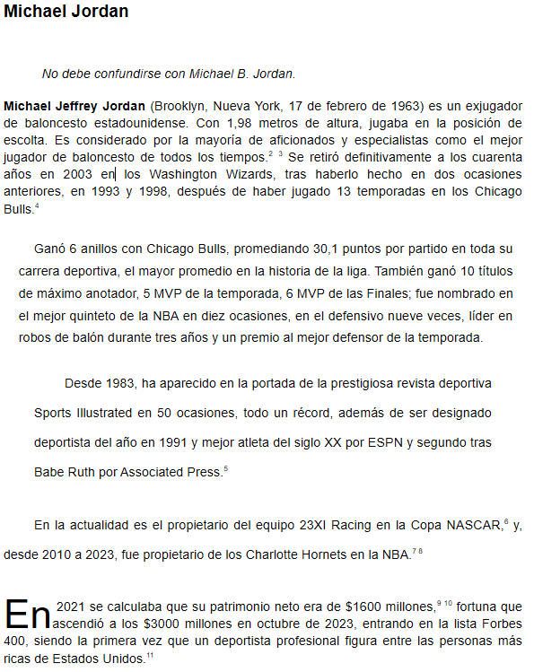{.sietecinco}

     

### **Tarea - RA2-CEb-4**
!!! task "Tarea a entregar en RA2-CEb-4"
    **1. Abre un nuevo documento y copia el texto:**
    Michael Jordan  
	No debe confundirse con Michael B. Jordan.  
	Michael Jeffrey Jordan (Brooklyn, Nueva York, 17 de febrero de 1963) es un exjugador de baloncesto estadounidense. Con 1,98 metros de altura, jugaba en la posición de escolta. Es considerado por la mayoría de aficionados y especialistas como el mejor jugador de baloncesto de todos los tiempos.[2]​[3]​ Se retiró definitivamente a los cuarenta años en 2003 en los Washington Wizards, tras haberlo hecho en dos ocasiones anteriores, en 1993 y 1998, después de haber jugado 13 temporadas en los Chicago Bulls.[4]  
	Ganó 6 anillos con Chicago Bulls, promediando 30,1 puntos por partido en toda su carrera deportiva, el mayor promedio en la historia de la liga. También ganó 10 títulos de máximo anotador, 5 MVP de la temporada, 6 MVP de las Finales; fue nombrado en el mejor quinteto de la NBA en diez ocasiones, en el defensivo nueve veces, líder en robos de balón durante tres años y un premio al mejor defensor de la temporada.   
	
	Desde 1983, ha aparecido en la portada de la prestigiosa revista deportiva Sports Illustrated en 50 ocasiones, todo un récord, además de ser designado deportista del año en 1991 y mejor atleta del siglo XX por ESPN y segundo tras Babe Ruth por Associated Press.[5]​ 
    En la actualidad es el propietario del equipo 23XI Racing en la Copa NASCAR,[6]​ y, desde 2010 a 2023, fue propietario de los Charlotte Hornets en la NBA.[7]​[8]  
    ​ 
	12,366 11251,695 6,22566 1259,26 3,2256  

    **2. Modificar los párrafos de la siguiente manera:**  
    &nbsp;&nbsp;&nbsp;&nbsp;a. Primer párrafo: **no hacer nada**.  
    &nbsp;&nbsp;&nbsp;&nbsp;b. Párrafo siguiente: **añadir un tabulador izquierdo a 0.5cm**.  
    &nbsp;&nbsp;&nbsp;&nbsp;c. Párrafo siguiente: **añadir un tabulador izquierdo a 1.5cm**.  
    &nbsp;&nbsp;&nbsp;&nbsp;d. Párrafo siguiente: **añadir un tabulador izquierdo a 1.5cm**.  
    &nbsp;&nbsp;&nbsp;&nbsp;e. Párrafo siguiente: **añadir un tabulador derecho a 10cm**.  
    &nbsp;&nbsp;&nbsp;&nbsp;f. Párrafo siguiente: **añadir un tabulador centrado a 5cm**.  
    &nbsp;&nbsp;&nbsp;&nbsp;g. Párrafo siguiente: **añadir un tabulador decimal a 12cm**.  
    &nbsp;&nbsp;&nbsp;&nbsp;h. Primer párrafo: **añadir un tabulador para que el texto quede como se ve an la imagen**.  
    
    &nbsp;&nbsp;&nbsp;&nbsp;**El texto quedará de la siguiente manera:**
    
    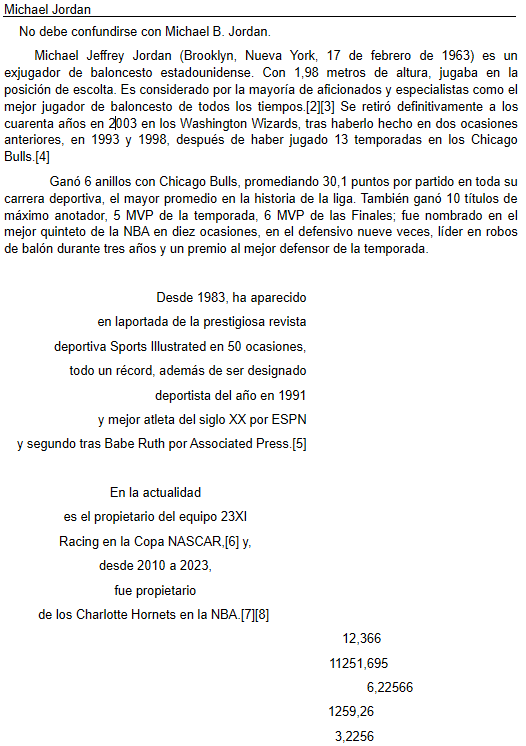{.sietecinco}

     

### **Tarea - RA2-CEb-5**   
!!! task "Tarea a entregar en RA2-CEb-5"
    **1. Abre un nuevo documento y copia el siguiente texto:**  
    El que suscribe, Don **PATRICIO RUIZ MAÑOSA**, de 21 años de edad, hijo de Don Críspulo Ruiz Beltrán y de Doña Leonor Mañosa Abad, natural de Alcaudete (Jaén) y con domicilio en esta ciudad, Avenida de Coria, 17,  
    **EXPONE:** Que siendo una persona con gran interés en la música y la danza, como acredita con los documentos y vídeos que acompaña, se halla incluido en los criterios que las bases del concurso para el Festival de Verano señalan para la participación en el mismo. Acogiéndose a lo dispuesto en ellas, y con el propósito de aportar su talento y contribuir a la alegría del festival,  
    **SOLICITA:** Se sirva ordenar que le sea concedida, si es que lo merece en justicia, una de las plazas para actuar en la gran final.
    En Sevilla, a cuatro de marzo de 2025.  
 
    **2. Modifica los estilos de párrafos para que quede la siguiente manera (sangría francesa):**
    
    **3. Añade después del texto anterior el texto que aparece en la imagen y usa tabuladores para ordenarlo.**

    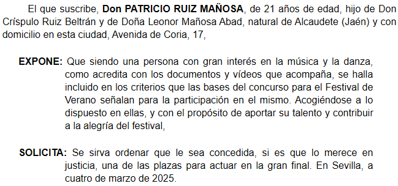{.sietecinco}

     

## **2.5 - Viñetas y numeración de títulos y párrafos**

### **Tarea - RA2-CEb-6**
!!! task "Tarea a entregar en RA2-CEb-6"
    **1. Abre un nuevo documento y copia el siguiente texto:**  
    OPERACIONES BÁSICAS:
    Entrar en el programa.
    Guardar un documento por primera vez.
    Recuperar un archivo.
    Fuentes, tamaños y colores.
    ENTRAR EN EL PROGRAMA:
    Desplegar el menú Inicio.
    Seleccionar el apartado Programas.
    En el segundo menú pinchar sobre la opción correspondiente.
    GUARDAR UN DOCUMENTO POR 1a VEZ:
    Desplegar el menú Archivo.
    Elegir la opción Guardar como.
    Seleccionar la unidad de almacenamiento.
    Escribir el nombre con el que se vaya a guardar el documento.
    Pulsar el botón Guardar.
    RECUPERAR UN ARCHIVO:
    Desplegar el menú Archivo.
    Elegir la opción Abrir.
    Indicar la unidad en la que está almacenado el documento.
    Seleccionar el archivo de la lista.
    Pulsar el botón Abrir.
    FUENTES, TAMAÑOS Y COLORES:
    Desplegar el menú Formato.
    Seleccionar la opción Fuentes.
    Seleccionar una fuente, un tamaño para el texto y un color.

    **2. Incorporar numeraciones y viñetas para que el texto quede de la siguiente manera.**  
    Tener en cuenta los formatos que ya conoceís: Parrafo, texto, etc. Cualquier aportación personal para aportar vistosidad y legibilidad al texto será bienvenida.  
    No hacer **fontaneria**. El espacio entre elementos de texto deberá realizarse eligiendo correctamente los parametros de cada elemento, **no realizando saltos de línea**.  

    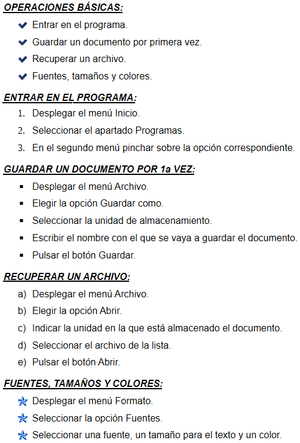{.trescinco}

    **3. Realiza un salto de página en el documento anterior y copia el siguiente texto:**  
    Introducción al programa
    Utilidad del Procesador de Texto.
    Entrar en Procesador de Texto.
    Los elementos de la pantalla.
    Barra de Título.
    Barra de menús.
    Barra de herramientas Estándar.
    Barra de Formato.
    Barra de Regla.
    Barra de Estado.
    Salir del programa.
    Gestión de archivos
    Guardar un documento nuevo.
    Recuperar un archivo.
    Guardar cambios.
    Diferencias entre Guardar y Guardar como. Guardar actualiza un documento existente, sobrescribiendo la versión anterior con los cambios que has hecho. Por otro lado, Guardar como te permite guardar una nueva copia del documento. Puedes elegir una nueva ubicación, un nuevo nombre de archivo o un formato de archivo diferente, dejando el documento original sin modificar. 
    Formato del documento
    Márgenes.
    Interlineado.
    Espacio entre párrafos.
    Sangrías.
    Sangría 1ª línea.
    Sangría izquierda.
    Sangría derecha.

    **4. Incorporar numeraciones y viñetas para que el texto quede de la siguiente manera.**

    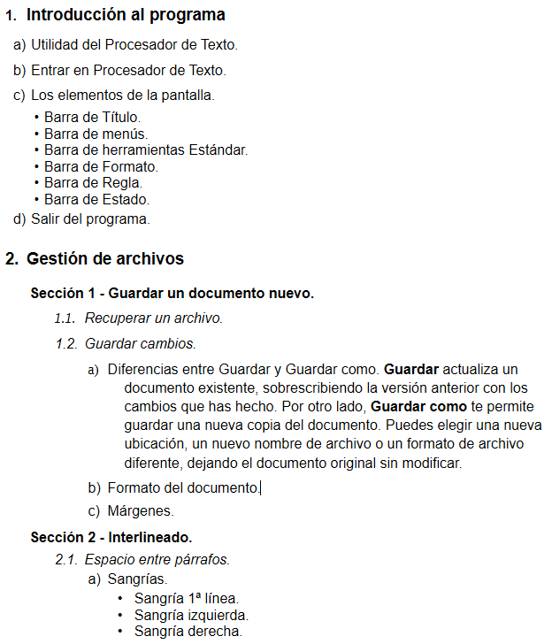{.cincozero}

## **2.6 - Estilos**
En esta apartado aprenderemos a definir estilos para todos los elementos de nuestro documento de texto, lo que permetrá ahorrar un tiempo considerable en la redacción o modificación del mismo.
### **Tarea - RA2-CEb-7**
!!! task "Tarea a entregar en RA2-CEb-7"
    **1. Descargar y abrir el archivo 'RA2- aplicar estilos' pinchando en el enlace siguiente:** [Descargar archivo](./archivos/RA2%20-%20aplicar%20estilos.odt)  
    **2.** Crear un nuevo estilo **MisEstilos**. Dejar la configuración por defecto y solo modificar el tipo de letra a **Arial 12**.  
    **3.** Crear 3 sub estilos **Cabeceras**, **Párrafos** y **Títulos** (realmente no son estilo sino carpetas donde iremos creando los estilos para cada apartado del documento).     
    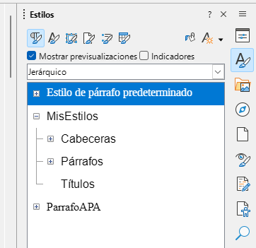{.doscinco}  
    **4.** Dentro de **Cabecera** crear el estilo **Cabecera centrada** con un resultado similar al de la siguiente imagen. (Sois libres de incorporar más características al estilo).  
    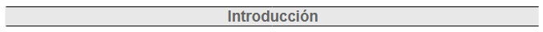{.sietecinco}  
    **5.** Dentro de **Párrafos crear 3 estilos **Párrafo centrado**, Párrafo izquierdo** y **Párrafo normal** con el resultado siguiente:  
          &nbsp;&nbsp;&nbsp;&nbsp;- **Párrafo normal** (cuidado con los márgenes izquierdo y derecho)
              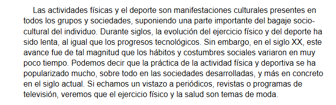{.sietecinco}          
          &nbsp;&nbsp;&nbsp;&nbsp;- **Párrafo centrado**  
              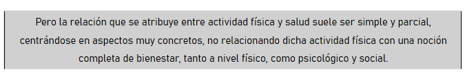{.sietecinco}          
          &nbsp;&nbsp;&nbsp;&nbsp;- **Párrafo izquierdo**  
              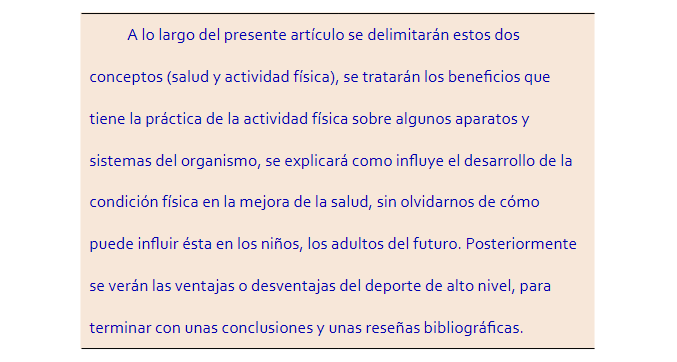{.sietecinco}  
    **6.** Dentro de **Cabeceras** crear el estilo **Cabecera conclusión** con el resultado siguiente: 
    **Nota importante:** Cada vez que se use ese estilo se deberá insertar automáticamente un salto de página. 
              {.sietecinco}  
    **7.** Dentro de **Párrafos** crear el estilo **Viñeta 1** con el resultado siguiente: 
              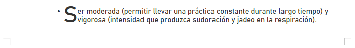{.sietecinco}  
    **8.** Estos son los estilos creados hasta ahora: 
              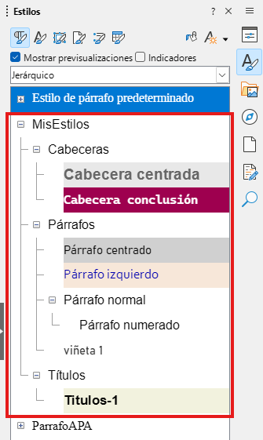{.trescinco}  
    **9.** Dentro de **Párrafos** crear el estilo **Numeración 1** con el resultado siguiente:
    **Nota** Ese estilo es idéntico al estilo **Párrafo normal**. Para evitar de buscar una a una las características del estilo **Párrafo normal** lo que haremos es, al definir **Numeración 1** es **heredar** los estilos de **Párrafo normal**.  
    El estilo **Numeración 1** quedará de la siguiente manera:  
    (Como podeís ver se ha aplicado un estilo de carácter especial al numerador).  
              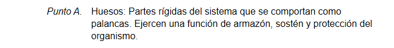{.sietecinco}    
              
    **10.** Podeís descargar el documento con todos los estilos aplicados [aquí](./archivos/RA2%20-%20aplicar%20estilos%20terminado.pdf). 

<!-- 
falta estilos: 3h.
diseño plantillas: 2h.
Importar exportar tablas textos e imagenes: 1h.
importar exportar a otros formatos: salida pdf: 1h.
crear macros: 1h.  -->

## **2.7 - Insertar tablas, texto e imágenes**
### **Tarea - RA2-CEd**
!!! task "Tarea a entregar en RA2-CEd"
## **2.8 - Plantillas y páginación**
### **Tarea - RA2-CEc**
!!! task "Tarea a entregar en RA2-CEc"
## **2.9 - Exportar a otros formatos**
### **Tarea - RA2-CEe**
!!! task "Tarea a entregar en RA2-CEe"
## **2.10 - Macros**
### **Tarea - RA2-CEf**
!!! task "Tarea a entregar en RA2-CEf"

| **Licencia Creative Commons:** | |
| - | - |
|  { .by-nc-nd-eu_ } | **Reconocimiento-NoComercial-CompartirIgual CC BY-NC-SA:**  No se permite un uso comercial de la obra original ni de las posibles obras derivadas, la distribución de la cuales se debe hace con una licencia igual a la que regula la obra original. | 
  
 

