# **UD. 3 - LibreOffice Calc**

{ .sietecinco }
 

**Resultados de aprendizaje y criterios de evaluacion que se evaluarán en esta unidad.**  

| **Resultados de aprendizaje de la unidad didáctica:** |
|-|
| **RA3. Elabora documentos y plantillas de cálculo, describiendo y aplicando opciones avanzadas de hojas de cálculo.**  

|**Criterios de evaluación de la unidad didáctica:**|
    |-|
    |**a)** Se ha personalizado las opciones de software y barra de herramientas. |
    |**b)** Se han utilizado los elementos básicos en la elaboración de hojas de cálculo. |
    |**c)** Se han utilizado los diversos tipos de datos y referencia para celdas, rangos, hojas y libros. |    
    |**d)** Se han aplicado fórmulas y funciones. |
    |**e)** Se han generado y modificado gráficos de diferentes tipos. |
    |**f)** Se han empleado macros para la realización de documentos y plantillas.|
    |**h)** Se ha utilizado la hoja de cálculo como base de datos: formularios, creación de listas, filtrado, protección y ordenación de datos. |
    |**i)** Se han utilizado aplicaciones y periféricos para introducir textos,números, códigos e imágenes.|    

## **1 - Interfaz de trabajo en Calc**
Después de hacer doble clic sobre el icono de **LibreOffice** seleccionamos **Nuevo &rarr; Hoja de cálculo** y nos encontraremos con la siguiente interfaz.

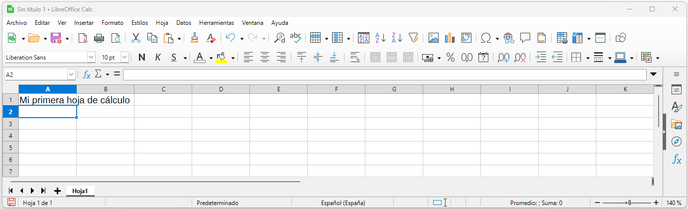

!!! question "Pregunta"
    ¿Qué es lo primero que debemos hacer cuando creamos un nuevo documento?

### **1.1 - Menú: Archivo**
Permite la creación de un archivo de hoja de cálculo y su posterior guardado, firmado digital o impresión, etc.
   
**Idéntico al de LibreOffice writer.**

### **1.2 - Menú: Editar**
Aparte del conocido “copiar pegar” también permite buscar, editar celdas...  
 
**Muy parecido al de LibreOffice writer.**

### **1.3 - Menú: Ver**
El menú "Ver" sirve para controlar cómo se muestra el documento en pantalla y qué elementos visuales de la interfaz deseamos ver u ocultar. 
**No modifica el contenido del documento**, solo la forma en que se visualiza mientras trabajamos.  
 
**Muy parecido al de LibreOffice writer.**

### **1.4 - Menú: Insertar**
Ofrece opciones para incluir objetos en nuestro documento: fotografías, dibujos, tablas, ecuaciones matemáticas o incluso otros archivos.  
 
**Muy parecido al de LibreOffice writer.**

### **1.5 - Menú: Formato**
Es, la ventana que más se utilizará ya que, permite dar formato y propiedades a las celdas de nuestras hojas de cálculo.

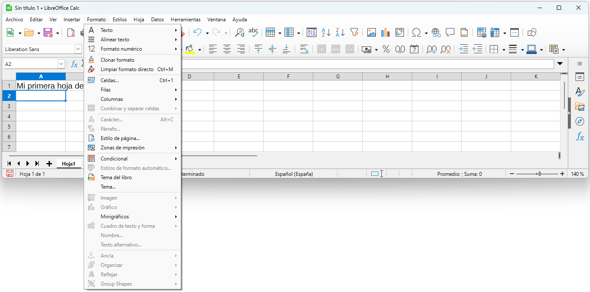{ .m_ver }
 

### **1.6 - Menú: Estilos**
Casi tan importante como el menú formato, es sin duda el gran olvidado de la mayoría de usuarios.

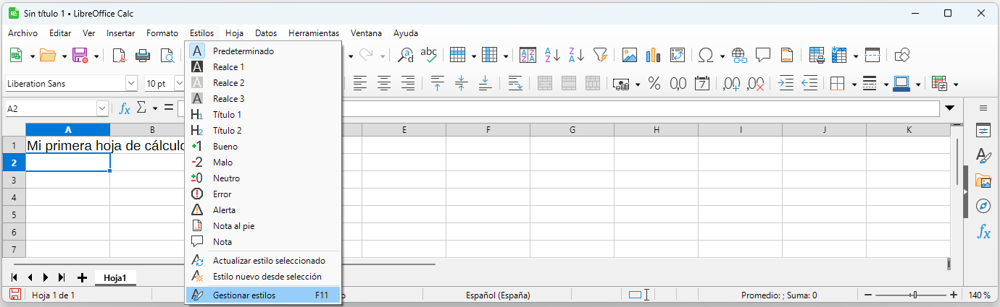{ .m_ver }
 

### **1.7 - Menú: Hoja**
Contiene todo lo relacionado con la gestión de las filas y columnas de las hojas de cálculo así como la gestión de las propias hojas.

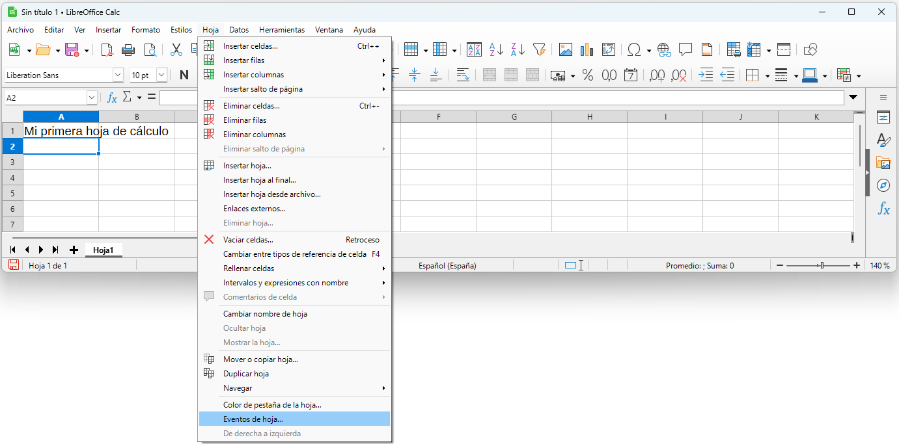{ .m_ver }
 

### **1.8 - Menú: Datos**
Sirve para para gestionar, manipular y analizar la información de las hojas de cálculo.

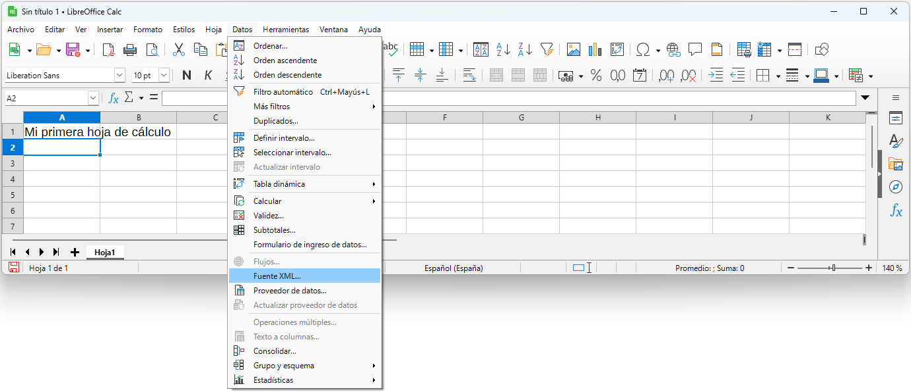{ .m_ver }
 

### **1.9 - Menú: Herramientas**
Es el menú de la mayoría de herramientas de validación de un documento: En ese menú se encuentran las funciones de ortografía, autocorrección, macros, configuración de idioma, complementos, etc. 
 
**Muy parecido al de LibreOffice writer.**

### **1.10 - Menú: Ventana**
El menú "Ventana" está pensado para gestionar las distintas ventanas o instancias del programa abiertas en ese momento.
No afecta al contenido del documento, sino a cómo se interactúa con varios documentos o vistas al mismo tiempo.
 
**Idéntico al de LibreOffice writer.**

### **1.11 - Menú: Ayuda**
Reúne todas las opciones para obtener asistencia, acceder a la documentación oficial y consultar información sobre la instalación de LibreOffice
 
**Idéntico al de LibreOffice writer.**

### **Tarea RA3-CEa - Personalización de la interfaz de usuario**
!!! exercice "Tarea RA3-CEa - Configuración del software utilizado"
    1. Crear un documento y guardarlo con el nombre **Tarea-RA3CEa-NombreApellidosDelAlumno.ods**.
    1. Cambiar el tipo de letra básico de Liberation Sans a **Arial**.
    1. Cambiar el idioma del documento a español
    1. Configurar la hoja de cálculo para que realice una copia de resplado cada 5 minutos.
    1. En Opciones → LibreOffice → Datos de identidad → Introducir vuestros nombres apellidos e iniciales.
    1. Modificar la interfaz de usuario para que, aparte de los menús que salen por defecto, también se vean:
        - Insertar celda.
        - Controles de formulario.
        - Navegación de formulario.
    1. Condiciones de entrega de la práctica: Subir el archivo en **formato ods, nativo de LibreOffice** a la tarea RA3-CEa. No se admitirá ningún otro tipo de formato. 
   
### **Tarea RA3-CEb-1 - Elaboración básica de hojas de cálculo**
!!! exercice "Tarea RA3-CEb-1 - Elaboración de una tabla en un hoja de cálculo"
    **Ejercicio parte 1**
    <u>Creación de estilos</u>  
    Crear los estilos **Valores, Columnas, Indices** según se vea a continuación.  

    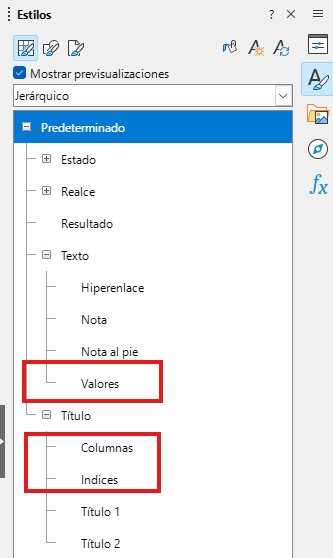{ .leftdoscinco }

    <u>**Configuración de los estilos**</u>  
    **1. Predeterminado:**  
    &emsp;Tipo de letra: Arial 12 normal, alineación izquierda.   
    
    **2. Estilo Valores**  
    &emsp;Tipo de letra: Arial 12 normal Añil oscuro, centrado horizontalmente.  
    &emsp;Bordes: Grosor 0.5pt, Añil oscuro 2.  
    &emsp;Fondo: Gris claro 5.  

    **3. Estilo Columnas**  
    &emsp;Tipo de letra: Arial 12 cursiva verde, centrado horizontalmente.   
    &emsp;Bordes: Grosor 0.05pt, oro.  
    &emsp;Fondo: Oro claro 4.

    **4. Estilo Índices**  
    &emsp;Tipo de letra: Arial 12 cursiva, azul oscuro 1, alineación izquierda.   
    &emsp;Bordes: Grosor 0.5pt, oro claro 1.  
    &emsp;Fondo: Rojo claro 4.  
    
    **3. Estilo Título 1**  
    &emsp;Tipo de letra: Arial 16 negrita blanco, centrado horizontalmente y verticalmente.   
    &emsp;Fondo: Negro.  

    **4. Estilo Título 2**  
    &emsp;Tipo de letra: Arial 12 negrita, rojo, centrado horizontalmente.   
    &emsp;Bordes: Grosor 0.5pt, lima.  
    &emsp;Fondo: Magenta claro 4.  
      
    <u>**Tamaño de celdas**</u>   
    &emsp;Anchura columna 1: 2cm  
    &emsp;Anchura columnas 2, 3, 4 y 5,: 3cm  
    &emsp;Altura fila 1: 1cm  
    &emsp;Altura fila 2: 0.75cm  
    &emsp;Altura fila 3: 0.6cm  
    &emsp;Altura fila 4, 5, 6, 7, y 8: 0.5cm

    <u>**Datos a introducir dentro de las celdas**</u>  
    &emsp;Introducir los datos a mano para que quede de la siguiente manera.

    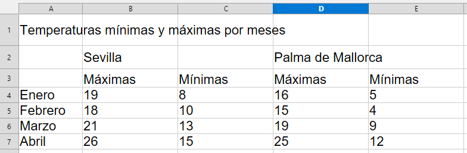{ .leftsietecinco }
    
    <u>**Trabajo adicional**</u>  
    &emsp;Aplicar los estilos de la siguiente manera.
    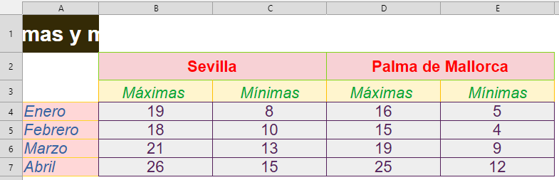{ .leftsietecinco }

    
    <u>**Trabajo adicional**</u>  
    &emsp;Combinar las celdas A1, B1, C1, D1 y E1   
    &emsp;Combinar las celdas B3 con C3 y D3 con E3   
    &emsp;Insertar una fila en la posición 1 y una columna en la posición A.  
    &emsp;Redimensionar la columna A al gusto.       
    &emsp;El resultado final deberá ser similar al de la imagen.       

    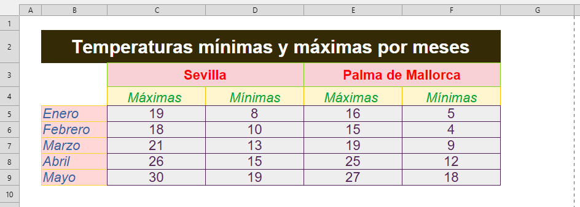{ .leftsietecinco }

    **Ejercicio parte 2**  
    Dentro del mismo documento crear una hoja nueva.  
    Renombrar las hojas a:  
    &emsp;&emsp;Hoja 1 → Ejercicio 1  
    &emsp;&emsp;Hoja 2 → Ejercicio 2  
    En la hoja 2, copiar y pegar todos los datos de la hoja 1.  
    En la hoja 2, ampliar las filas de los meses y modificar los datos hasta completar todos los meses del año.  
    
    <u>**Trabajo adicional**</u>  
    &emsp;Arreglar el ancho de la columna de los meses para que el texto no quede cortado.  
    &emsp;Para evitar que los datos se repitan, poner la formula **=ALEATORIO.ENTRE(-10;35) como valor de las celdas de las temperaturas**.  
    
    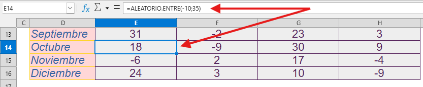{ .leftsietecinco }

    &emsp;Al final la tabla quedará de la siguiente manera.  

    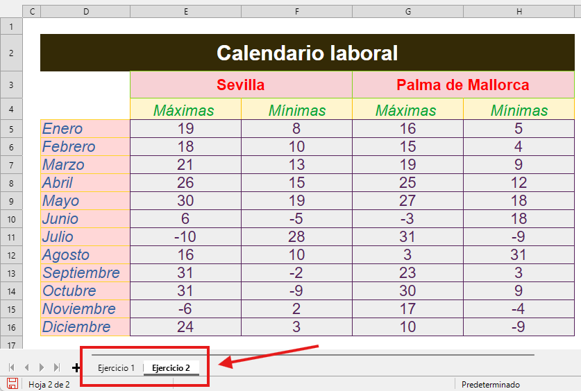{ .leftsietecinco }

    <u>**Condiciones de entrega**</u>  
    &emsp;Guardar el documento con NombreApellidos-Tarea-RA3-CEb-1   
    &emsp;Subir la hoja de cálculo en **formato ods, nativo de LibreOffice** a la tarea RA3-CEb-1  
    &emsp;**No se aceptará ningun formato que no sea ods**.

### **Tarea RA3-CEb-2 - Elaboración básica de hojas de cálculo**
!!! exercice "Tarea RA3-CEb-2 - Trabajando con series"
    **Ejercicio parte 1**  
    Realizar un diseño similar al del ejemplo. 
    Teneis **libertad total** en cuanto a anchos, altos, bordes, colores y ancho del bordes columnas así como tamaño color tipo de letra y fondo de celdas.

    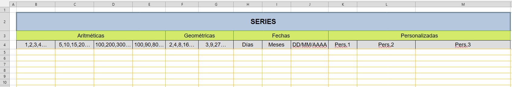{ .original } 
    
    **Ejercicio parte 2**  
    Insertar series para obtener **el mismo resultado** que a continuación.  
    **Se dará la explicación en clase de como hacer series**.    
    
    <u>**Series aritméticas**</u>  

    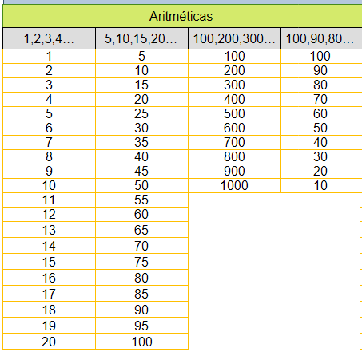{ .lefttrescero } 
    
    <u>**Series geométricas**</u>  

    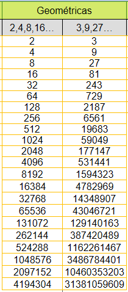{ .leftdoscero }   
    
    <u>**Fechas**</u>  

    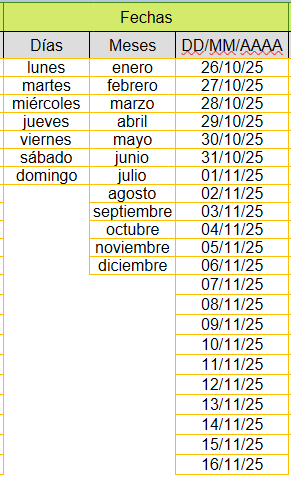{ .leftdoscero }   
    
    <u>**Personalizadas**</u>  

    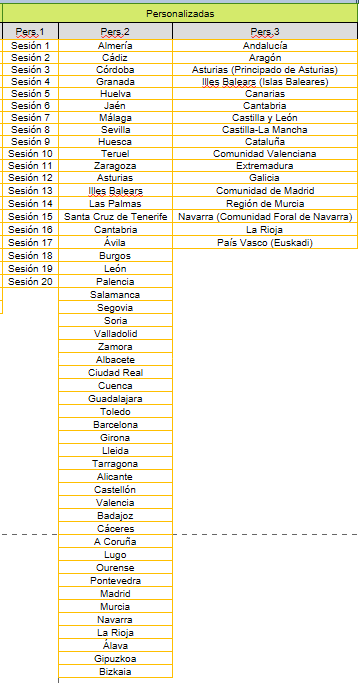{ .leftcuatrocero }   

    <u>**Resultado final**</u>

    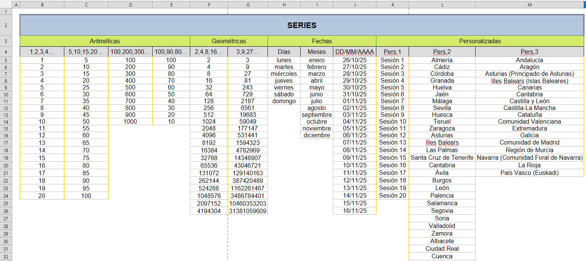{ .leftoriginal }   

    <u>**Trabajo adicional**</u>  
    &emsp;Inmobilizar la **columna adecuada** y actuar sobre la barra de desplazamiento para obtener el siguiente resultado.  
    &emsp;**No debeis copiar / pegar las columnas**.  
 
    &emsp;Resultado esperado.
      
    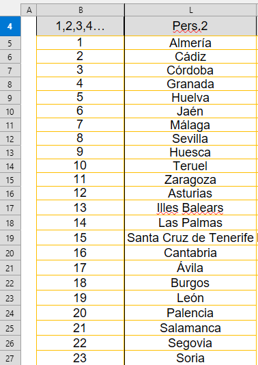{ .lefttrescero }   
    
    <u>**Condiciones de entrega**</u>  
    &emsp;Guardar el documento con NombreApellidos-Tarea-RA3-CEb-2   
    &emsp;Subir la hoja de cálculo en **formato ods, nativo de LibreOffice** a la tarea RA3-CEb-2  
    &emsp;**No se aceptará ningun formato que no sea ods**.  

### **Tarea RA3-CEc-1 - Datos, columnas y referencias de celdas**
!!! exercice "Tarea RA3-CEc-1 - Trabajando con formatos celdas"
    !!! tip "1. Descargar el archivo"
     Descargar y abrir el archivo 'RA3-CEc-1' pinchando en el enlace siguiente:** [Descargar archivo](./03_hojas_de_calculo/tareas/RA3-CEc-1%20alumno.ods)  
    
    !!! tip "2. Realizar un diseño similar al del ejemplo"  
    Teneis **libertad total** en cuanto a anchos, altos, bordes, colores y ancho del bordes columnas así como tamaño color tipo de letra y fondo de celdas.  

    **Nota importante:** Cosas a tener en cuenta para realizar el diseño.  
    &emsp; Fila 1: Datos centrados tanto verticalmente como horizontalmente.  
    &emsp;&emsp;&emsp;&emsp; Bordes personalizados.    
    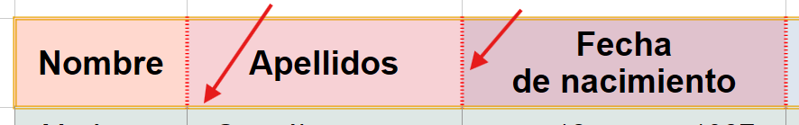{ .leftsietecinco .marginseiszero }    

    &emsp; Filas datos: Sangrías (o márgenes) a la izquierda o a la derecha.
    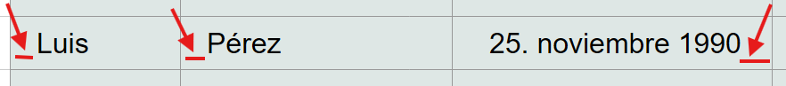{ .leftsietecinco .marginseiszero }    

    &emsp; Formato de datos: Fechas, moneda, hora...
    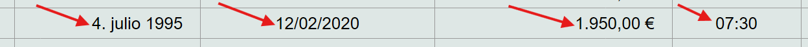{ .leftsietecinco .marginseiszero }    

    &emsp; Resultado final.
    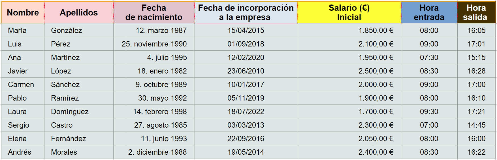{ .leftsietecinco .marginseiszero }    
    !!! tip "3. Insertar una columna de segundo apellido"  
    Insertar una columna de segundo apellido para que quede de la siguiente manera (ojo con la cabecera de la columna).
    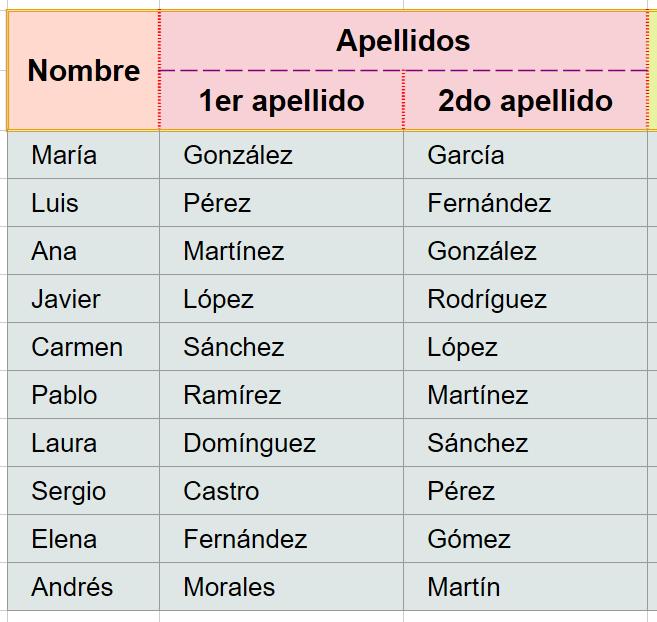{ .leftcuatrocero .marginseiszero }    
    &emsp;&emsp;&emsp;&emsp;Apellidos a añadir:  
    &emsp;&emsp;&emsp;&emsp;&emsp;García  
    &emsp;&emsp;&emsp;&emsp;&emsp;Fernández  
    &emsp;&emsp;&emsp;&emsp;&emsp;González  
    &emsp;&emsp;&emsp;&emsp;&emsp;Rodríguez  
    &emsp;&emsp;&emsp;&emsp;&emsp;López  
    &emsp;&emsp;&emsp;&emsp;&emsp;Martínez  
    &emsp;&emsp;&emsp;&emsp;&emsp;Sánchez  
    &emsp;&emsp;&emsp;&emsp;&emsp;Pérez  
    &emsp;&emsp;&emsp;&emsp;&emsp;Gómez  
    &emsp;&emsp;&emsp;&emsp;&emsp;Martín   
    
    !!! tip "4. Insertar una columna Salario actual"
    Insertar una columna **Salario actual** con los datos que aparecen en la imagen.  
    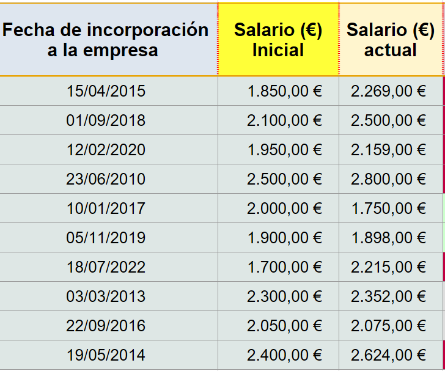{ .leftcuatrocero .marginseiszero }    

    !!! tip "5. Insertar la columna "Diferencia actual-inicial""
    Insertar la columna **Diferencia actual-inicial** que será la diferencia entre las 2 columnas anteriores.   
    Os dejo la fórmula para calcular esa diferencia.
    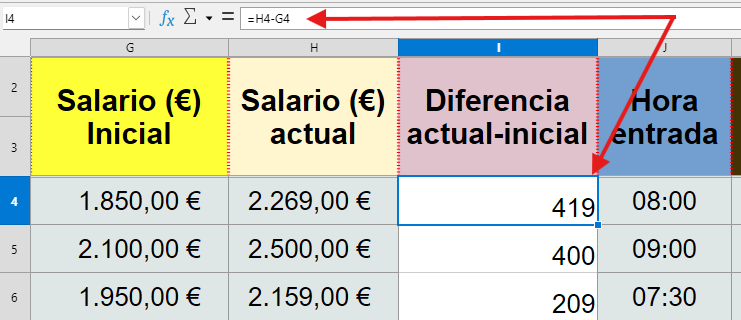{ .leftcuatrocero .marginseiszero }    

    !!! tip "6. Aplicar un formato condicional a la columna "Diferencia actual-inicial""
    Para diferencias superiores a 200 se aplicará el estilo Alerta (o cualquier otro, incluso podreís crear uno).  
    Para diferencias entre 0 y 200 se aplicará el estilo Neutro (...).  
    Para diferencias inferiores a 0 se aplicará el estilo Bueno (...).   
    Resultado final (cuidado con los estilos propios de los datos).  
    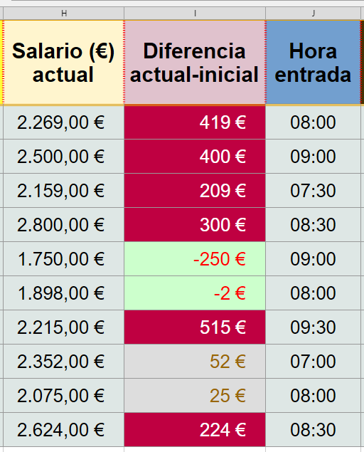{ .lefttrescero .marginseiszero }    

    !!! tip "7. Insertar una columna "Horas trabajadas diarias""
    Insertar una columna **Horas trabajadas diarias** cuyos valores seran la diferencia entre las columnas **Hora salida** y **Hora entrada**.  
    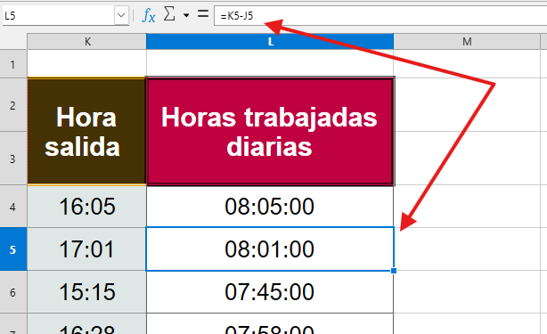{ .leftcuatrocero .marginseiszero }    

    !!! tip "8. Aplicar un formato condicional a la columna "Horas trabajadas diarias""
    Para valores superiores a 8 horas 200 se aplicará el estilo Bueno (o cualquier otro, incluso podreís crear uno).  
    Para valores iguales a 8 horas se aplicará el estilo Neutro (...).  
    Para valores inferiores a 8 horas se aplicará el estilo Alerta (...).    
    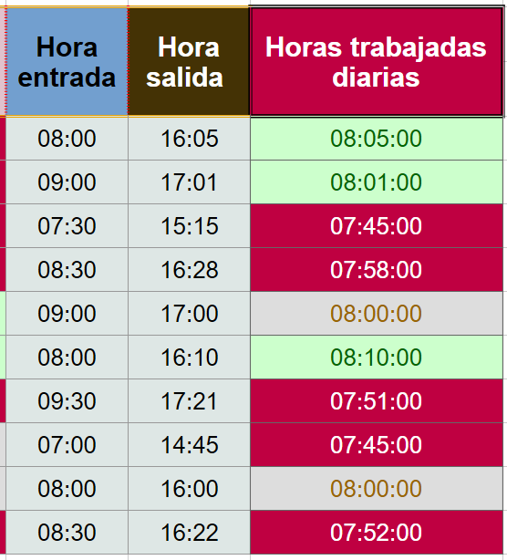{ .lefttrescero .marginseiszero }    

    !!! tip "9. Aspecto final de la práctica""
    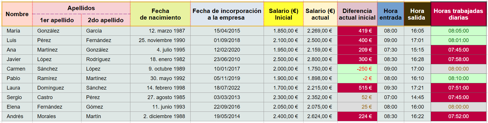{ .leftoriginal }    

### **Tarea RA3-CEc-2 - Referencias de celdas**

<!-- file:///C:/Users/titan/Documents/Javier128/Modulos/SMX/SMX_1/AO/materiales/RA3/M2P11-FormatoCondicional-Voluntaria.pdf 
file:///C:/Users/titan/Documents/Javier128/Modulos/SMX/SMX_1/AO/materiales/RA3/M2P9-CuentaBancaria.pdf

file:///C:/Users/titan/Documents/Javier128/Modulos/SMX/SMX_1/AO/materiales/RA3/M1P8-RefenrenciasCeldas.pdf
file:///C:/Users/titan/Documents/Javier128/Modulos/SMX/SMX_1/AO/materiales/RA3/Actividad_referencias.pdf
<!-- https://www.youtube.com/watch?v=QnIJmDmk0YA -->
<!--
### **Tarea RA3-CEc-2 - **
### **Tarea RA3-CEc-3 - **
### **Tarea RA3-CEd-1 - **
### **Tarea RA3-CEd-2 - **
### **Tarea RA3-CEd-3 - **
### **Tarea RA3-CEe-1 - **
### **Tarea RA3-CEe-2 - **
### **Tarea RA3-CEf - **
### **Tarea RA3-CEh-1 - **
### **Tarea RA3-CEh-2 - **
### **Tarea RA3-CEi - ** -->

<!-- file:///C:/Users/titan/Documents/Javier128/Modulos/SMX/SMX_1/AO/materiales/RA3/Exercici%20Calc%201.pdf -->

<!-- 
     |**c)** Se han utilizado los diversos tipos de datos y referencia para celdas, rangos, hojas y libros. |    10%|
    |**d)** Se han aplicado fórmulas y funciones. |15%|
    |**e)** Se han generado y modificado gráficos de diferentes tipos. |10%|
    |**f)** Se han empleado macros para la realización de documentos y plantillas.|10%|
    |**g)** Se han importado y exportado hojas de cálculo creadas con otras aplicaciones y en otros formatos.|10%|
    |**h)** Se ha utilizado la hoja de cálculo como base de datos: formularios, creación de listas, filtrado, protección y ordenación de datos. |10%|
    |**i)** Se han utilizado aplicaciones y periféricos para introducir textos,números, códigos e imágenes.|    10%|
 -->

<!-- https://help.libreoffice.org/latest/es/text/scalc/04/01020000.html?DbPAR=CALC -->

| **Licencia Creative Commons:** | |
| - | - |
|  | **Reconocimiento-NoComercial-CompartirIgual CC BY-NC-SA:**  No se permite un uso comercial de la obra original ni de las posibles obras derivadas, la distribución de la cuales se debe hace con una licencia igual a la que regula la obra original. | 
  
 

