UD. 3 - LibreOffice Calc

{ .doscinco }

| **Resultados de aprendizaje de la unidad didáctica:**                                                                      |
|----------------------------------------------------------------------------------------------------------------------------|
| **RA. 4:** Elabora documentos con bases de datos ofimáticas describiendo y aplicando operaciones de manipulación de datos. |

| Criterios de evaluación de la unidad didáctica: |
| :--- |
| **a)** Se han identificado los elementos de las bases de datos relacionales. |
| **b)** Se han creado bases de datos ofimáticas. |
| **c)** Se han utilizado las tablas de la base de datos (insertar, modificar y eliminar registros). |
| **d)** Se han utilizado asistentes en la creación de consultas. |
| **e)** Se han utilizado asistentes en la creación de formularios. |
| **f)** Se han utilizado asistentes en la creación de informes. |
| **g)** Se ha realizado búsqueda y filtrado sobre la información almacenada. |
| **h)** Se han creado y utilizado macros. |

!!! warning "Nota:"
    El criterio de evaluación **b) Se han creado bases de datos ofimáticas**, será evaluado durante la FCT.

## **1 - Introducción**

### **1.1 - ¿Qué es una base de datos?**

Una base de datos es un sistema organizado para **almacenar**, **gestionar** y **consultar** información de forma estructurada.

En términos simples, es como un archivo digital inteligente donde los datos (por ejemplo, nombres, productos, precios, usuarios, pedidos, etc.) se guardan de manera ordenada para poder buscar, modificar o eliminar información rápidamente.

Normalmente, **las bases de datos se gestionan mediante un Sistema de Gestión de Bases de Datos (SGBD)** como:

- MySQL
- PostgreSQL
- Oracle Database

### **1.2 - ¿Qué es una base de datos relacional?**

Para poder almacenar de forma ordenada, toda la información generada por, por ejemplo un negocio, es necesario dividir la base de datos en tablas.  
Cada tabla albergará una clase de datos (clientes, pedidos, ventas, stock, ...). Como es fácil de intuir, muchos datos de las diferentes tablas tendrán **relación** los unos con los otros **mediante campos comunes**.  
**En una base de datos relacional**, una relación es la **conexión lógica entre dos tablas** mediante un campo común.

!!! tip "Ejemplo de relación entre tablas"
    Supongamos dos tablas:  

    - Clientes (id_cliente, nombre)
    - Pedidos (id_pedido, fecha, id_cliente)

    El campo **id_cliente en la tabla Pedidos** conecta con el **id_cliente de la tabla Clientes**.  
    → Esa conexión es la relación existente entre las 2 tablas.

### 1.3 - ¿Qué es una tabla de una base de datos relacional?

Una tabla es un conjunto de datos organizados en filas y columnas.  
Cada fila representa un registro (por ejemplo, un cliente, un pedido, un producto, etc.) y cada columna representa un campo o atributo (por ejemplo, nombre, fecha, precio, etc.).
Una tabla de una base de datos relacional se caracteriza por:

- Tener un **nombre** que la identifica.
- Contener **campos** (columnas) que definen los atributos de los datos.
- Contener **registros** (filas) que representan las instancias de los datos.
- Tener una **clave primaria**: Es el campo que identifica de forma única un registro de la tabla (por ejemplo, el id_cliente dentro de la tabla Clientes).
- Tener una **clave foránea**, que es un campo que se utiliza para establecer una relación con otra tabla (por ejemplo, el id_cliente que se repite entre las tablas Clientes y Pedidos). 
- Permitir la **manipulación de datos** mediante operaciones como inserción, actualización, eliminación y consulta.

**Ejemplo de tablas en una base de datos.**  

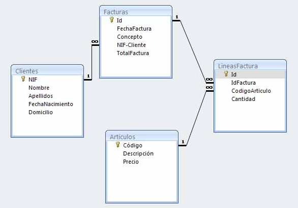{ .cincozero }

### 1.4 - LibreOffice Base

!!! warning "¿Qué es LibreOffice Base?"

LibreOffice Base es una aplicación de gestión de bases de datos con interfaz gráfica que permite crear, administrar y consultar bases de datos.

!!! warning "¿Cómo funciona LibreOffice Base?"
LibreOffice Base puede funcionar de dos maneras:

1. Base de datos embebida utilizando motores internos como **HSQLDB** y **Firebird** y actuando como un **SGBD ligero de escritorio**.

1. Conexión a un servidor externo como MySQL, PostgreSQL, MariaDB y funcionando **únicamente como interfaz gráfica**, mientras que el SGBD es el servidor externo.

## 2 - Tarea RA4-CEa

!!! warning "1 - Creación de una base de datos"
    1. Abrir el asistente de bases de datos de LibreOffice Base y elegir crear una base de datos nueva.
    1. Después de pulsar siguiente, dejar las opciones por defecto (registrar la BBDD la hace disponible para todas las aplicaciones de LibreOffice). 
    1. Para finalizar guardar la BBDD con el siguiente nombre: RA4-CEa-NombreApellidos
    1. Una vez abierta la BBDD, nos encontraremos con la siguiente interfaz.  
    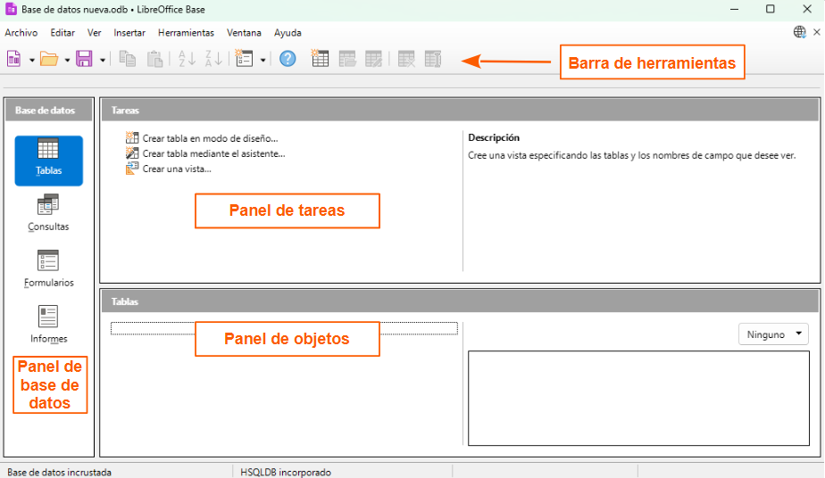{ .ochocinco .marco .margintop10 .marginbottom20 }

    1. **Barra de herramientas**  
    Los botones de la barra de herramientas estándar permite acceder a las funciones más habituales de Base: 
        - **Abrir**, **guardar**, **copiar** y **pegar**, acceder a la ayuda, formularios, botones específicos para tablas, ordenar, etc.  
    1. **Panel de base de datos**    
    El panel de base de datos permite seleccionar el tipo de objeto de la Base de datos con el que se quiere trabajar. 
        - En una base de datos de Base hay cuatro tipos principales de objetos: **tablas**, **consultas**, **formularios** e **informes**.
    1. **Panel de tareas**
    El panel de tareas permite decidir qué hacer con el objeto seleccionado. 
        - Por ejemplo, si se selecciona el tipo de objeto "Tablas", el panel de tareas ofrece la posibilidad de crear una tabla nueva, abrir una tabla existente, etc.
    1. **Panel de objetos**
    En el panel de objetos se muestran los objetos que hay en la base de datos. Esos objetos pueden ser de tipo **tablas**, **consultas**, **formularios** e **informes**. 
        - Al estar la BBDD vacía no mostrará nada. De existir objetos, aparecerán de la siguiente manera.
            - Objetos de tablas:  
            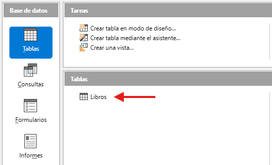{ .leftcincocero .marco .margintop10 .marginbottom20 }
            - Objetos de consultas:
            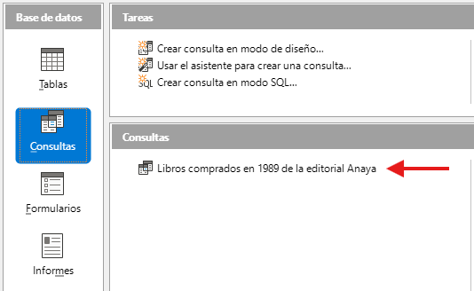{ .leftcincocero .marco .margintop10 .marginbottom20 }
            - Objetos de formularios:
            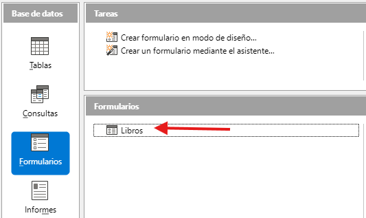{ .leftcincocero .marco .margintop10 .marginbottom20 }
            - Objetos de informes:
            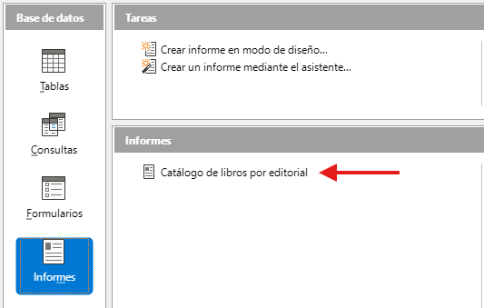{ .leftcincocero .marco .margintop10   }

!!! warning "2 - Creación de las tablas en LibreOffice Base"
    Una tabla de una base de datos es un conjunto de datos organizados en filas y columnas.  
    Cada fila representa un registro (por ejemplo, un cliente, un pedido, un producto, etc.) y cada columna representa un campo o atributo (por ejemplo, nombre, fecha, precio, etc.).  

    !!! tip "Campos de una tabla en LibreOffice Base"  
        Al crear una tabla, es necesario definir los campos que formarán parte de la tabla.  
        El nombre de los campos puede estar formado por un máximo de 64 caracteres alfanuméricos.  
        Aunque hoy en día los SGBD permiten cualquier carácter, **ES MUY ACONSEJABLE** seguir las reglas siguientes:  

        - Por claridad, poner **nombres significativos** (Apellido, Nombre, Telf, etc.).
        - **No incluir espacios en blanco** dentro de los nombres de campo. Poner un guión bajo `_` en su lugar (p.e.: precio_unitario).  
        - **No utilizar caracteres especiales** como acentos, $, &, @, #, %, Ç, etc.
        
        **Ejemplo de campos de una tabla de una base de datos**
        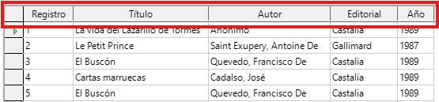{ .leftseiscero .marco .margintop10 .marginbottom20 }

    !!! tip "Tipos de datos en LibreOffice Base"
        En LibreOffice Base, al crear una tabla, es necesario definir el tipo de datos para cada campo. Algunos de los tipos de datos más comunes son:

        - **Texto**: Para almacenar cadenas de caracteres cortas, como nombres o direcciones.
        - **Nota**: Para almacenar textos largos, como descripciones o comentarios.
        - **Númerico**: Para almacenar valores numéricos, como precios o cantidades.
        - **Fecha/hora**: Para almacenar fechas/horas, como fechas de nacimiento o fechas de pedidos o horarios.
        - **Sí/No (Booleano)**: Para almacenar valores de Sí/No, verdadero/falso, como si un cliente está activo o no.
        - **OTHER (Objetos)**: Para almacenar objetos como archivos o documentos.
        - **Imagen**: Para almacenar imágenes, como fotos de productos o clientes.
        - **Clave primaria**: Para identificar de forma única cada registro en la tabla, como un número de identificación o un código de producto.
        
        **Ejemplo de todos los tipos de datos disponibles en LibreOffice Base**
        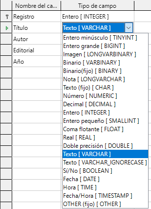{ .lefttrescero .marco .margintop10 .marginbottom20 }
 
    !!! tip "Clave primaria"  
        La clave primaria es un campo **único** es decir, tiene un valor que no se puede repetir y **que identifica de forma única cada registro** de la tabla.  
        Es muy aconsejable que la tabla tenga un campo que sirva como **clave primaria** ya que, entre otros:

        - Garantiza la integridad de entidad.
        - Facilita la creación de claves foráneas en otras tablas.
        - Mejora el rendimiento en búsquedas e indexación.
        - El campo de clave primaria se identifica inmediatamente al tener el símbolo de la clave, como se puede ver a continuación.

        **Campo identificado como clave primaria**
        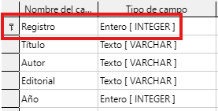{ .lefttrescero .marco .margintop10 .marginbottom20 }
        **Campo con registros que no se repiten**
        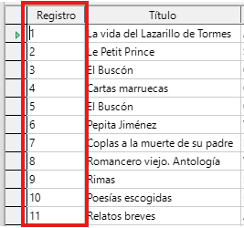{ .lefttrescero .marco .margintop10 .marginbottom20 }

        !!! question "¿Como podemos asegurarnos de que los registros del campo con clave primaria no se puedan repetir?"

    !!! task "Trabajo a realizar"
        - Descargar todos los contenidos necesarios a la tarea desde el siguiente [enlace](./04_bases%20de%20datos/Tareas/RA4-CEa/datosBBDD/gimnasio.ods).
        - Abrir el archivo **gimnasio.ods** y arrastrar las hojas a las tablas de la base de datos que iréis creando. 
        !!! warning "Cuidado a la hora de definir el campo de clave primaria"
        
        **Resultado esperado después de importar las hoja de la hoja de cálculo**
        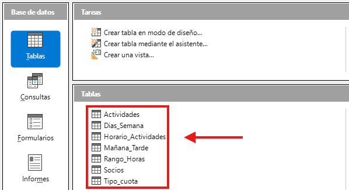{ .leftsietecinco .marco .margintop10 .marginbottom20 }

    !!! warning "3 - Relaciones entre tablas"
        En una base de datos relacional, una relación es la conexión lógica entre dos tablas mediante un campo común.  
        Para establecer una relación entre dos tablas, es necesario que ambas tablas tengan un campo con el mismo tipo de datos y que ese campo se utilice como clave primaria en una tabla y como clave foránea en la otra tabla.  
        La relación entre las tablas permite realizar consultas que combinan datos de ambas tablas, lo que facilita la obtención de información más completa y detallada.
        !!! tip "Tipos de relaciones entre tablas en una base de datos"
            Existen tres tipos básicos de relaciones entre tablas:
            
            - **Uno a muchos (1:N)**. Este tipo se da cuando una fila de la primera tabla puede estar relacionada con muchas filas de la segunda tabla, pero una fila de la segunda solo está relacionada con una de la primera.  
            En el siguiente ejemplo, vemos como un vendedor con Id única (IdVendedor) de la tabla **Vendedores** puede aparecer en múltiples registros de la tabla **Ventas** (al haber realizado múltiples ventas). 
            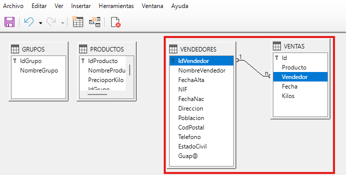{ .leftsietecinco .marco .margintop10 .marginbottom20 }
            
            - **Muchos a muchos (N:N). Esta clase de relación ocurre cuando una fila de la primera tabla puede estar relacionada con muchas filas de la segunda tabla y una fila de la segunda tabla puede estarlo con muchas filas de la primera.  
            Un ejemplo de este tipo lo tenemos en la relación entre la tabla Peliculas y la tabla Interpretes porque dada una película en particular esta puede tener muchos intérpretes y viceversa: dado un intérprete, este puede haber intervenido en muchas películas.
            
            - **Uno a uno (1 a 1)**. Este tipo de relación aparece con menos frecuencia y sucede cuando una fila de la primera tabla solo puede estar relacionada con una fila de la segunda y una fila de la segunda tabla solo puede estar relacionada con una de la primera.  
            Un ejemplo de este tipo de relaciones podría ser entre una tabla con países y otra con jefes de gobierno, dado que, normalmente, un país solo tiene un jefe de gobierno y un jefe de gobierno lo es solo de un país.

            !!! task "Trabajo a realizar"
                Establecer las relaciones entre las tablas de la base de datos:
                |Tabla 1|Tabla 2|
                |-|-|
                |||

        
<!-- https://www.youtube.com/results?search_query=libreoffice+base -->

<!-- https://www.tuinstitutoonline.com/cursos/basebasico_v1506/14gimnasio.php -->

<!-- https://www.iesandresbojollo.es/tiyc/base/2-Interfaz_de_usuario.html -->

Tarea RA4-CEc  
Tarea RA4-CEd  
Tarea RA4-CEe  
Tarea RA4-CEf  
Tarea RA4-CEg  
Tarea RA4-CEh  

<!-- https://oficinalibre.net/mod/scorm/view.php?id=130 -->

<!-- 
4.- Formato, validación y edición de datos.
5.- Ordenación y filtrado de datos.
6.- Clave primaria.
7.- Edición de tablas.
8.- Relaciones entre tablas. Integridad referencial.
9.- Consultas.
10.- Ordenación, selección y operadores en consultas.
11.- Formularios simples. Diseño de formularios.
12.- Diseño de formularios.
13.- Informes. -->

| **Licencia Creative Commons:** | |
| :--- | :--- |
|  | **Reconocimiento-NoComercial-CompartirIgual CC BY-NC-SA:**  No se permite un uso comercial de la obra original ni de las posibles obras derivadas, la distribución de la cuales se debe hace con una licencia igual a la que regula la obra original. |
