 

{ .doscinco .marginbottom40 }

| **Resultados de aprendizaje de la unidad didáctica:**                                                                      |
|----------------------------------------------------------------------------------------------------------------------------|
| **RA. 4:** Elabora documentos con bases de datos ofimáticas describiendo y aplicando operaciones de manipulación de datos. |

| Criterios de evaluación de la unidad didáctica: |
| :--- |
| **a)** Se han identificado los elementos de las bases de datos relacionales. |
| **b)** Se han creado bases de datos ofimáticas. |
| **c)** Se han utilizado las tablas de la base de datos (insertar, modificar y eliminar registros). |
| **d)** Se han utilizado asistentes en la creación de consultas. |
| **e)** Se han utilizado asistentes en la creación de formularios. |
| **f)** Se han utilizado asistentes en la creación de informes. |
| **g)** Se ha realizado búsqueda y filtrado sobre la información almacenada. |
| **h)** Se han creado y utilizado macros. |

!!! warning "Nota:"
    El criterio de evaluación **b) Se han creado bases de datos ofimáticas**, será evaluado durante la FCT.

## **1 - Introducción**

### **1.1 - ¿Qué es una base de datos?**

Una base de datos es un sistema organizado para **almacenar**, **gestionar** y **consultar** información de forma estructurada.

En términos simples, es como un archivo digital inteligente donde los datos (por ejemplo, nombres, productos, precios, usuarios, pedidos, etc.) se guardan de manera ordenada para poder buscar, modificar o eliminar información rápidamente.

Normalmente, **las bases de datos se gestionan mediante un Sistema de Gestión de Bases de Datos (SGBD)** como:

- MySQL
- PostgreSQL
- Oracle Database

### **1.2 - ¿Qué es una base de datos relacional?**

Para poder almacenar de forma ordenada, toda la información generada por, por ejemplo un negocio, es necesario dividir la base de datos en tablas.  
Cada tabla albergará una clase de datos (clientes, pedidos, ventas, stock, ...). Como es fácil de intuir, muchos datos de las diferentes tablas tendrán **relación** los unos con los otros **mediante campos comunes**.  
**En una base de datos relacional**, una relación es la **conexión lógica entre dos tablas** mediante un campo común.

!!! tip "Ejemplo de relación entre tablas"
    Supongamos dos tablas:  

    - Clientes (id_cliente, nombre)
    - Pedidos (id_pedido, fecha, id_cliente)

    El campo **id_cliente en la tabla Pedidos** conecta con el **id_cliente de la tabla Clientes**.  
    → Esa conexión es la relación existente entre las 2 tablas.

### 1.3 - ¿Qué es una tabla de una base de datos relacional?

Una tabla es un conjunto de datos organizados en filas y columnas.  
Cada fila representa un registro (por ejemplo, un cliente, un pedido, un producto, etc.) y cada columna representa un campo o atributo (por ejemplo, nombre, fecha, precio, etc.).
Una tabla de una base de datos relacional se caracteriza por:

- Tener un **nombre** que la identifica.
- Contener **campos** (columnas) que definen los atributos de los datos.
- Contener **registros** (filas) que representan las instancias de los datos.
- Tener una **clave primaria**: Es el campo que identifica de forma única un registro de la tabla (por ejemplo, el id_cliente dentro de la tabla Clientes).
- Tener una **clave foránea**, que es un campo que se utiliza para establecer una relación con otra tabla (por ejemplo, el id_cliente que se repite entre las tablas Clientes y Pedidos).
- Permitir la **manipulación de datos** mediante operaciones como inserción, actualización, eliminación y consulta.

**Ejemplo de tablas en una base de datos.**  

{ .cincozero }

### 1.4 - LibreOffice Base

!!! warning "¿Qué es LibreOffice Base?"

LibreOffice Base es una aplicación de gestión de bases de datos con interfaz gráfica que permite crear, administrar y consultar bases de datos.

!!! warning "¿Cómo funciona LibreOffice Base?"
LibreOffice Base puede funcionar de dos maneras:

1. Base de datos embebida utilizando motores internos como **HSQLDB** y **Firebird** y actuando como un **SGBD ligero de escritorio**.

1. Conexión a un servidor externo como MySQL, PostgreSQL, MariaDB y funcionando **únicamente como interfaz gráfica**, mientras que el SGBD es el servidor externo.

## 2 - Tarea RA4-CEa

### 2.1 - Parte 1

!!! warning "1 - Creación de una base de datos"
    1. Abrir el asistente de bases de datos de LibreOffice Base y elegir crear una base de datos nueva.
    1. Después de pulsar siguiente, dejar las opciones por defecto (registrar la BBDD, la hace disponible para todas las aplicaciones de LibreOffice).
    1. Para finalizar guardar la BBDD con el siguiente nombre: RA4-CEa-NombreApellidos
    1. Una vez abierta la BBDD, nos encontraremos con la siguiente interfaz.  
    { .ochocinco .marco .margintop10 .marginbottom20 }

    1. **Barra de herramientas**  
    Los botones de la barra de herramientas estándar permite acceder a las funciones más habituales de Base: 
        - **Abrir**, **guardar**, **copiar** y **pegar**, acceder a la ayuda, formularios, botones específicos para tablas, ordenar, etc.  
    1. **Panel de base de datos**    
    El panel de base de datos permite seleccionar el tipo de objeto de la Base de datos con el que se quiere trabajar. 
        - En una base de datos de Base hay cuatro tipos principales de objetos: **tablas**, **consultas**, **formularios** e **informes**.
    1. **Panel de tareas**
    El panel de tareas permite decidir qué hacer con el objeto seleccionado. 
        - Por ejemplo, si se selecciona el tipo de objeto "Tablas", el panel de tareas ofrece la posibilidad de crear una tabla nueva, abrir una tabla existente, etc.
    1. **Panel de objetos**
    En el panel de objetos se muestran los objetos que hay en la base de datos. Esos objetos pueden ser de tipo **tablas**, **consultas**, **formularios** e **informes**. 
        - Al estar la BBDD vacía no mostrará nada. De existir objetos, aparecerán de la siguiente manera.
            - Objetos de tablas:  
            { .leftcincocero .marco .margintop10 .marginbottom20 }
            - Objetos de consultas:
            { .leftcincocero .marco .margintop10 .marginbottom20 }
            - Objetos de formularios:
            { .leftcincocero .marco .margintop10 .marginbottom20 }
            - Objetos de informes:
            { .leftcincocero .marco .margintop10   }
    !!! tip "Tablas"
        En las tablas se almacena la información estructurada de la base de datos. Cada tabla está compuesta por campos (columnas) y registros (filas). Una base de datos suele contener varias tablas relacionadas entre sí.
    !!! tip "Formularios"
        Los formularios permiten introducir, modificar y visualizar datos de las tablas de forma más cómoda y controlada. No almacenan información por sí mismos, sino que actúan como interfaz de acceso a las tablas o consultas.
    !!! tip "Consultas"
        Las consultas permiten obtener información específica de una o varias tablas. Se utilizan para filtrar, ordenar o combinar datos mediante criterios determinados.
    !!! tip "Informes"
        Los informes permiten presentar los datos de forma organizada y lista para imprimir o exportar. Se basan en la información de tablas o consultas y muestran los datos con un formato definido. Cada vez que se ejecutan, reflejan el estado actual de la base de datos.

### 2.2 - Parte 2

!!! warning "2 - Creación de las tablas en LibreOffice Base"
    Una tabla de una base de datos es un conjunto de datos organizados en filas y columnas.  
    Cada fila representa un registro (por ejemplo, un cliente, un pedido, un producto, etc.) y cada columna representa un campo o atributo (por ejemplo, nombre, fecha, precio, etc.).  

    !!! tip "Campos de una tabla en LibreOffice Base"  
        Al crear una tabla, es necesario definir los campos que formarán parte de la tabla.  
        El nombre de los campos puede estar formado por un máximo de 64 caracteres alfanuméricos.  
        Aunque hoy en día los SGBD permiten cualquier carácter, **ES MUY ACONSEJABLE** seguir las reglas siguientes:  

        - Por claridad, poner **nombres significativos** (Apellido, Nombre, Telf, etc.).
        - **No incluir espacios en blanco** dentro de los nombres de campo. Poner un guión bajo `_` en su lugar (p.e.: precio_unitario).  
        - **No utilizar caracteres especiales** como acentos, $, &, @, #, %, Ç, etc.
        
        **Ejemplo de campos de una tabla de una base de datos**
        { .leftseiscero .marco .margintop10 .marginbottom20 }

    !!! tip "Tipos de datos en LibreOffice Base"
        En LibreOffice Base, al crear una tabla, es necesario definir el tipo de datos para cada campo. Algunos de los tipos de datos más comunes son:

        - **Texto**: Para almacenar cadenas de caracteres cortas, como nombres o direcciones.
        - **Nota**: Para almacenar textos largos, como descripciones o comentarios.
        - **Númerico**: Para almacenar valores numéricos, como precios o cantidades.
        - **Fecha/hora**: Para almacenar fechas/horas, como fechas de nacimiento o fechas de pedidos o horarios.
        - **Sí/No (Booleano)**: Para almacenar valores de Sí/No, verdadero/falso, como si un cliente está activo o no.
        - **OTHER (Objetos)**: Para almacenar objetos como archivos o documentos.
        - **Imagen**: Para almacenar imágenes, como fotos de productos o clientes.
        - **Clave primaria**: Para identificar de forma única cada registro en la tabla, como un número de identificación o un código de producto.
        
        **Ejemplo de todos los tipos de datos disponibles en LibreOffice Base**
        { .lefttrescero .marco .margintop10 .marginbottom20 }
 
    !!! tip "Clave primaria"  
        La clave primaria es un campo **único** es decir, tiene un valor que no se puede repetir y **que identifica de forma única a cada registro** de la tabla.  
        Es muy aconsejable, por no decir obligatorio, que la tabla tenga un campo que sirva como **clave primaria** ya que, entre otros:

        - Garantiza la integridad de entidad.
        - Facilita la creación de claves foráneas en otras tablas.
        - Mejora el rendimiento en búsquedas e indexación.
        - El campo de clave primaria se identifica inmediatamente al tener el símbolo de la clave, como se puede ver a continuación.

        **Campo identificado como clave primaria**
        { .lefttrescero .marco .margintop10 .marginbottom20 }
        **Campo con registros que no se repiten**
        { .lefttrescero .marco .margintop10 .marginbottom20 }

        !!! question "¿Como podemos asegurarnos de que los registros del campo con clave primaria no se puedan repetir?"

    !!! task "Trabajo a realizar 1/3"
        - Descargar todos los contenidos necesarios a la tarea desde el siguiente [enlace](./04_bases%20de%20datos/Tareas/RA4-CEa/datosBBDD/RA4-CEa.zip).
        - Abrir el archivo **gimnasio.ods** y arrastrar las **7 primeras hojas** de la hoja de cálculo  al campo **Tablas** de la base de datos.
        !!! warning "Cuidado a la hora de definir el campo de clave primaria"
        **Resultado esperado después de importar las diferentes hojas de la hoja de cálculo**
        { .leftseiscero .marco .margintop10 .marginbottom20 }

        - Campos de la tabla **Actividades**
        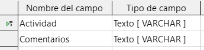{ .lefttrescinco .marco .margintop10 .marginbottom20 }
        - Campos de la tabla **Dias_Semana**
        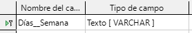{ .lefttrescinco .marco .margintop10 .marginbottom20 }
        - Campos de la tabla **Horario_Actividades**
        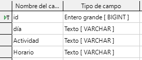{ .lefttrescinco .marco .margintop10 .marginbottom20 }
        - Campos de la tabla **Manaña/Tarde**
        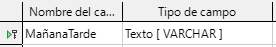{ .lefttrescinco .marco .margintop10 .marginbottom20 }
        - Campos de la tabla **Rango_Horas**  
        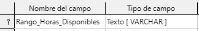{ .leftcuatrocero .marco .margintop10 .marginbottom20 }
        - Campos de la tabla **Socios**
        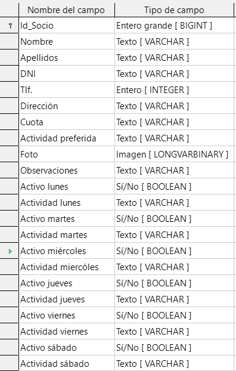{ .lefttrescinco .marco .margintop10 .marginbottom20 }
        - Campos de la tabla **Tipo_Cuota**
        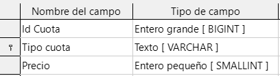{ .lefttrescinco .marco .margintop10  }

### 2.3 - Parte 3

!!! warning "3 - Relaciones entre tablas"
    En una base de datos relacional, una relación es la conexión lógica entre dos tablas mediante un campo común.  
    Para establecer una relación entre dos tablas, es necesario que ambas tablas tengan un campo con el mismo tipo de datos y que campo se utilice como clave primaria en una tabla y como clave foránea en la otra tabla.  
    La relación entre las tablas permite realizar consultas que combinan datos de ambas tablas, lo que facilita la obtención de rmación más completa y detallada.
    !!! tip "Tipos de relaciones entre tablas en una base de datos"
        Existen tres tipos básicos de relaciones entre tablas:

        - **Uno a muchos (1:N)**. Este tipo se da cuando una fila de la primera tabla puede estar relacionada con muchas filas de egunda tabla, pero una fila de la segunda solo está relacionada con una de la primera.  
        En el siguiente ejemplo, vemos como un vendedor con Id única (IdVendedor) de la tabla **Vendedores** puede aparecer en iples registros de la tabla **Ventas** (al haber realizado múltiples ventas). 
        { .leftsietecinco .marco .margintop10 .marginbottom20 }
        
        - **Muchos a muchos (N:N)**. Esta clase de relación ocurre cuando una fila de la primera tabla puede estar relacionada muchas filas de la segunda tabla y una fila de la segunda tabla puede estarlo con muchas filas de la primera.  
        Un ejemplo de este tipo lo tenemos en la relación entre la tabla Peliculas y la tabla Interpretes porque dada una película puede tener muchos intérpretes y viceversa: dado un intérprete, este puede haber intervenido en muchas películas.
        
        - **Uno a uno (1 a 1)**. Este tipo de relación aparece con menos frecuencia y sucede cuando una fila de la primera tabla  puede estar relacionada con una fila de la segunda y una fila de la segunda tabla solo puede estar relacionada con de la primera.  
        Un ejemplo de este tipo de relaciones podría ser entre una tabla con países y otra con jefes de gobierno, dado que, realmente, un país solo tiene un jefe de gobierno y un jefe de gobierno lo es de un solo país.
    !!! task "Trabajo a realizar 2/3"
        Preparar las relaciones entre las tablas de la base de datos para ello, ir a:
        
        - Herramientas → **Relaciones**
        - Dentro de la ventana de relaciones pinchar en el icono **Añadir tablas**.
        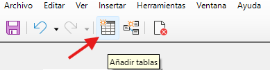{ .leftcuatrocero .marco .margintop10 .marginbottom20 }
        - Añadir todas las tablas disponibles.
        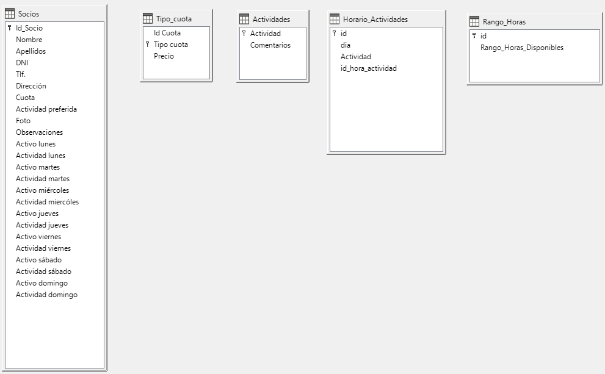{ .leftoriginal .marco .margintop10 .marginbottom20 }
    
    !!! task "Trabajo a realizar 3/3"
        
        - Preparar las relaciones entre las tablas.
        !!! warning "¿Qué relaciones entre tablas tenemos en nuestra base de datos?"
        - Para establecer las relaciones pincheremos en el icono **Relación nueva...**. 
        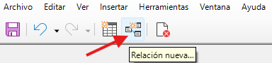{ .leftcuatrocero .marco .margintop10 .marginbottom20 }
        - Rellenaremos los campos para definir la relación entre tablas.
        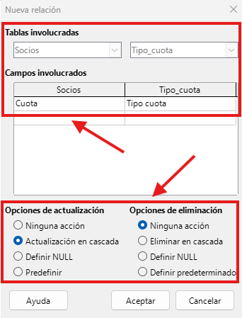{ .leftcuatrocero .marco .margintop10 .marginbottom20 }
        !!! warning "¿A qué corresponden los campos `Opciones de actualización` y `Opciones de eliminación`?"
        - Resultado final después de establecer todas las relaciones entre tablas.
        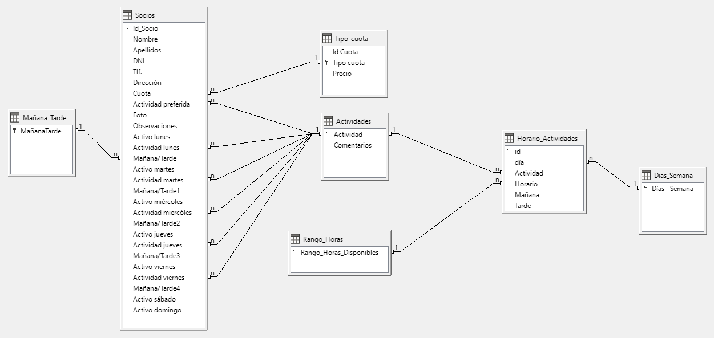{ .leftoriginal .marco .margintop10}
        
### 2.3 - Entrega de la tarea

!!! warning "Condiciones de entrega de la tarea"
    **Condiciones de entrega**

    - Guardar el documento con RA4-CEa-NombreApellidos en formato **NombreArchivo.odb**, **formato nativo** de LibreOffice Base.   
    - **No se aceptará ningun formato que no sea odb**.  
    - Subir la base de datos, a la tarea RA4-CEa de **Aules**.
    - A partir de momento de apertura de la tarea, dispondréis de **14 días** para subir vuestros trabajos. Pasado ese tiempo la tarea se cerrará y ya no será posible subir vuestros ejercicios.    

## 3 - Tarea RA4-CEce

!!! warning "Para esta tarea, deberéis recuperar la base de datos creada en la tarea RA4-CEa"

### 3.1 - Parte 1

!!! warning "1 - Formularios"

    Un formulario es un objeto de base de datos que proporciona una interfaz intuitiva para **introducir**, **modificar** y **visualizar los datos** almacenados en las tablas de nuestra base de datos.  
    Los formularios están diseñados para simplificar las consultas **CRUD** (Create, Read, Update, Delete), permitiendo a los usuarios interactuar con la base de datos sin necesidad de trabajar directamente con tablas o consultas SQL.

    **Ejemplo de interfaz de formulario:**
    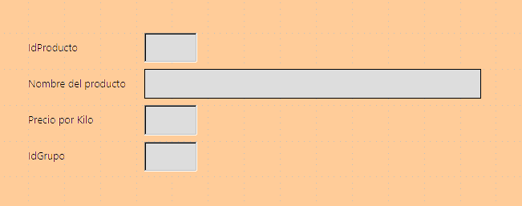{ .leftsietecinco .margintop10 .marginbottom20 }

### 3.2 - Parte 2

!!! warning "2 - Creación de formularios"
    !!! tip "Elementos fundamentales de un formulario"
        Un formulario puede contener diversos elementos que facilitan la interacción con los datos.  
        Algunos de los elementos más comunes son:

        - **Cuadros de texto**: Permiten ingresar o mostrar datos alfanuméricos.
        - **Cuadros combinados**: Ofrecen una lista desplegable de opciones para seleccionar un valor específico.
        - **Botones de opción**: Permiten seleccionar una opción entre varias disponibles.
        - **Casillas de verificación**: Permiten marcar o desmarcar opciones.
        - **Botones de comando**: Permiten ejecutar acciones específicas, como guardar un registro, eliminar un registro o navegar entre registros.
        - ... y muchos más.  

        **Ejemplo de formulario**   
        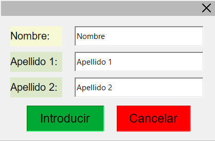{ .leftcincocero .margintop10 .marginbottom20 }

    !!! tip "Elementos gráficos de un formulario"
        Además de los elementos de control, un formulario también puede incluir elementos gráficos para mejorar su apariencia y usabilidad. Algunos ejemplos de elementos gráficos son:
        
        - **Etiquetas**: Se utilizan para identificar los campos del formulario y proporcionar información adicional al usuario.
        - **Imágenes**: Se pueden incluir imágenes para hacer el formulario más atractivo visualmente o para representar información de manera gráfica.
        - **Líneas y formas**: Se pueden utilizar para organizar visualmente el formulario y separar secciones o grupos de campos relacionados.
        - ... y muchos más.  

        **Ejemplo de formulario con elementos gráficos añadidos**   
        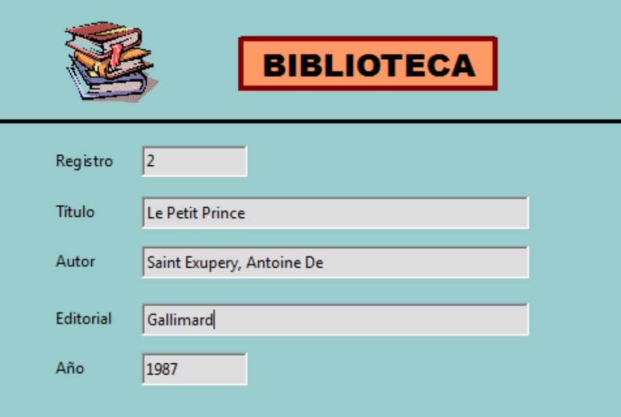{ .leftcincocero .margintop10 .marginbottom20 }

    !!! tip "Creación de formularios con el asistente de LibreOffice Base"
        LibreOffice Base ofrece un asistente para la creación de formularios que guía al usuario a través de los pasos necesarios para diseñar un formulario de manera rápida y sencilla.  
        
        - Vamos a **Formularios → Crear formulario con asistente...**.
        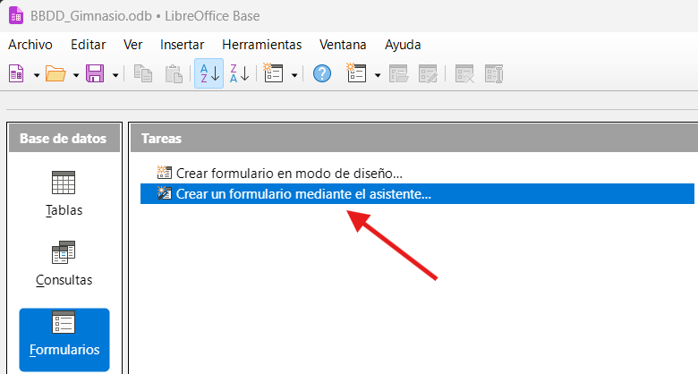{ .leftcincocero .margintop10 .marginbottom20 }
        - Elegimos la tabla de la base de datos que usaremos así como los campos que queremos pintar en el formulario.
        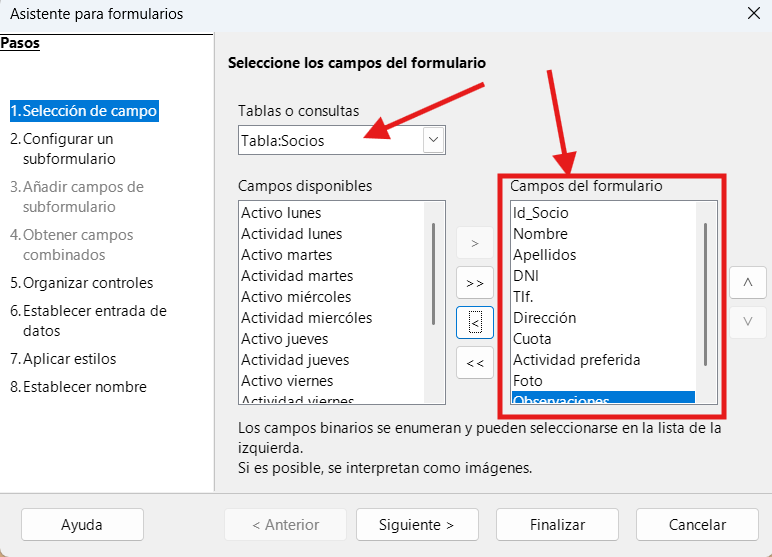{ .leftcincocero .margintop10 .marginbottom20 }
        - En el siguientre paso, dejamos las opciones por defecto. 
        - Organizar controles: Elegimos la disposición de controles dentro de la interfaz que más nos guste.  
        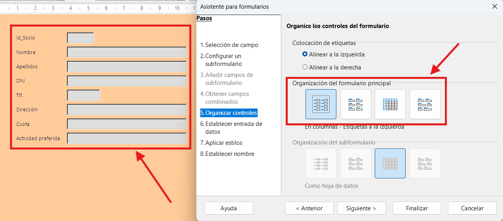{ .leftoriginal .margintop10 .marginbottom20 }
        - En **Establecer entrada de datos** marcaremos si los datos se pueden modificar (insertar, modificar o eliminar).
        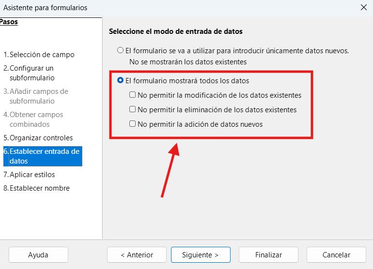{ .leftcincocero .margintop10 .marginbottom20 }
        - En **Aplicar estilos** elegimos el diseño de los campos y el color de fondo.
        - Finalemente, damos un nombre al formulario y nos ponemos a trabajar con él para hacerlo plenamente funcional. 
        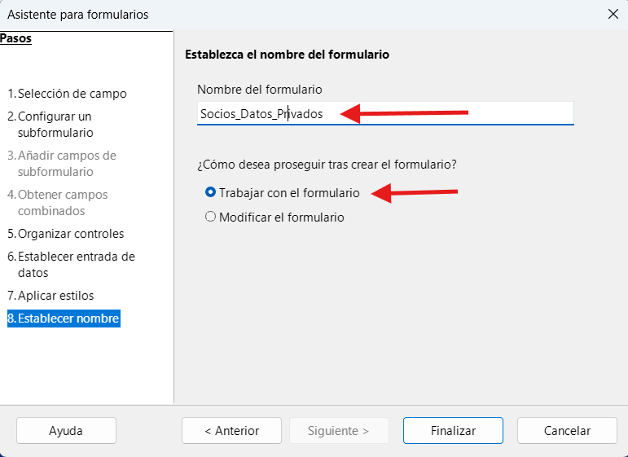{ .leftcincocero .margintop10 .marginbottom20 }

    !!! tip "Modificación del formulario creado con el asistente"
        Como podemos ver, el formulario creado con el asistente no tiene en cuenta que algunos campos están enlazados con otras tablas, por lo que los muestra como cuadros de texto.  
        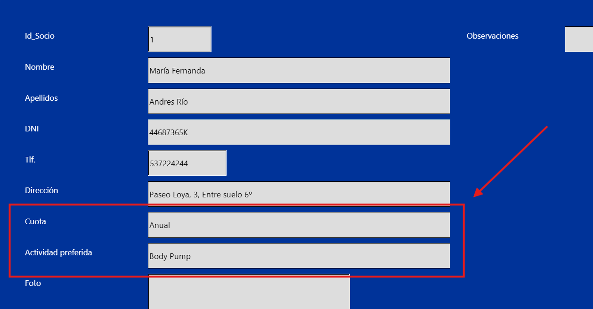{ .leftsietecero .margintop10 .marginbottom20 }
        Para que el formulario sea plenamente funcional, es necesario modificarlo para que los campos relacionados con otras tablas se muestren como cuadros combinados.

        - Selecionamos uno de los campos a modificar, hacemos click derecho, seleccionamos **desagrupar** y eliminamos el campo.
        - En la barra de herramientas de controles, seleccionamos el control **Cuadro combinado** y lo colocamos en el lugar donde estaba el campo eliminado.
        
        !!! warning "Muy importante"
            Cuando seleccionamos el control de cuadro combinado, es necesario que el botón de "**Alternar asistentes de control de formulario**" esté activado. De lo contrario, no aparecerá el asistente para configurar correctamente el cuadro combinado.
            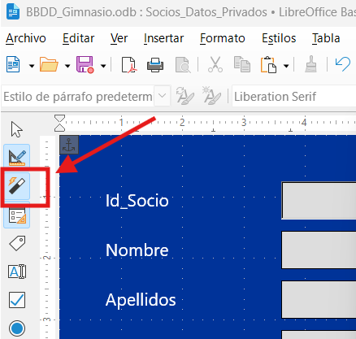{ .leftcuatrocero .margintop10  }
        

        - Una vez abierto el asistente, elegimos la tabla **Socios**.
        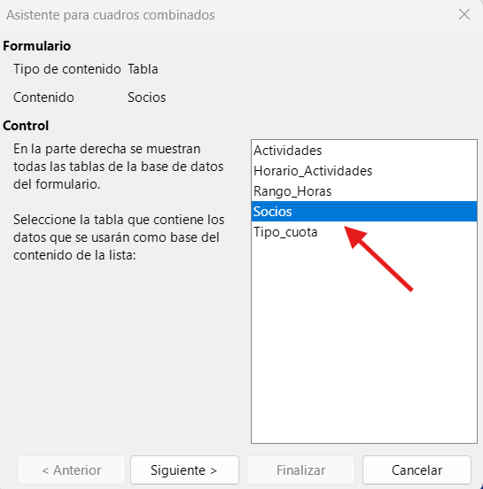{ .leftcuatrocero .margintop10 .marginbottom20 }
        - Luego elegimos el campo que queremos visualizar (Cuota).
        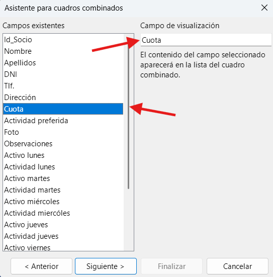{ .leftcuatrocero .margintop10 .marginbottom20 }
        - En **campo de base de datos** elegimos la opción **Sí**, al ser un campo que deseamos poder modificar. 
        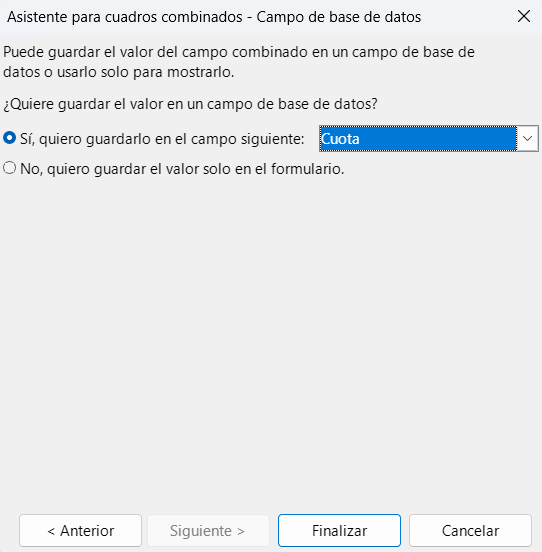{ .leftcuatrocero .margintop10 .marginbottom20 }
        - Si todo ha ido bien, después de finalizar el cuadro combinado debería mostrar los valores de la tabla enlazada (relacionada) **Tipo_cuota** dentro del formulario. Una vez seleccionada una opción, ese valor se escribirá dentro de la tabla **Socios**. 
        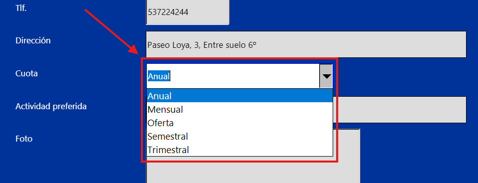{ .leftseiscero .margintop10 .marginbottom20 }

    !!! task "Trabajo a realizar 1/3"
        - Realizar el formulario explicado más arriba. 
        - Modificar el campo **Actividad preferida** para que enlace el valor del campo con los valores de la tabla **Actividades**.  
        
    !!! task "Trabajo a realizar 2/3 (opcional)"
        - Mejorar el aspecto visual del formulario (interfaz).
    !!! task "Trabajo a realizar 3/3"
        El formulario anterior se diseñó para solamente visualizar los datos personales del usuario.

        - Crear un formulario que llamaréis **Socios_Actividades**.
        - Ese formulario sirvirá para que cada socio pueda elegir una actividad por día.
        - **Ejemplo de formulario** (los estilos son opcionales).
        { .leftseiscero .margintop10 .marginbottom20 }
        - Los campos **Actividad lunes, martes..., domingo** deberán reemplazarse por cuadros combinados.
        - El formulario deberá ser plenamente funcional es decir, la tabla **Socios** deberá actualizarse con los nuevos valores elegidos. 

### 3.3 - Entrega de la tarea

!!! warning "Condiciones de entrega de la tarea"
    **Condiciones de entrega**

    - Guardar el documento con RA4-CEce-NombreApellidos en formato **NombreArchivo.odb**, **formato nativo** de LibreOffice Base.   
    - **No se aceptará ningun formato que no sea odb**.  
    - Subir la base de datos, a la tarea RA4-CEce de **Aules**.
    - A partir de momento de apertura de la tarea, dispondréis de **14 días** para subir vuestros trabajos. Pasado ese tiempo la tarea se cerrará y ya no será posible subir vuestros ejercicios.    
        
## 4 - Tarea RA4-CEdg Consultas a la base de datos

!!! warning "Para esta tarea, deberéis recuperar la base de datos creada en la tarea RA4-CEce"

Las consultas sirven para **recuperar**, **manipular** y **analizar** los datos almacenados en las tablas de una base de datos. En otras palabras, las consultas permiten obtener información específica de una o varias tablas mediante criterios determinados.  
Las consultas son una herramienta fundamental para trabajar con bases de datos, ya que permiten:

- **Filtrar la información** para recuperar sólo aquellos datos interesantes para cada caso.
- **Ordenar la información** recuperada utilizando tantos criterios como sean necesarios.
- **Utilizar varias tablas** para obtener datos combinados de ellas.  

En LibreOffice Base, las consultas se pueden realizar de tres maneras distintas: **Modo Diseño**, **con el asistente** o utilizando **SQL**.

### 4.1 - Introducción a las consultas SQL

Las consultas SQL (Structured Query Language) son una herramienta fundamental en la gestión de bases de datos relacionales. Utilizan un lenguaje de programación específico para interactuar con la base de datos y realizar diversas operaciones, como recuperar, insertar, actualizar o eliminar datos.

Para realizar consultas SQL iremos a **Consultas** y pulsaremos el enlace de **Crear consulta en modo SQL...**.
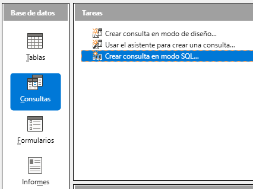{ .leftcuatrocero .margintop10 .marginbottom20 }

!!! tip "Ejemplo de consulta SQL"
    En este ejemplo, recuperaremos todos los socios que praticarán ciclo indor el lunes.

    ```sql
    SELECT * FROM Socios WHERE Actividad_Lunes='Ciclo indoor';  
    ```

    Esta consulta selecciona **todos los campos** de la tabla "Clientes" y devuelve una lista y devuelve los valores que cumplen la condición (filtrado) donde el campo Actividad_Lunes='Ciclo indoor'.
    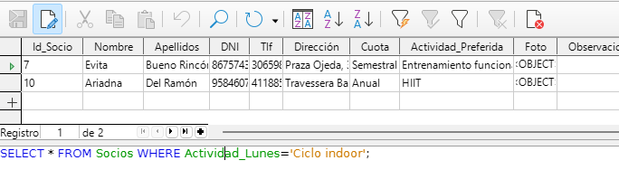{ .leftsietecero .margintop10 .marginbottom20 }

!!! task "Trabajo a realizar"  
    !!! exercise "Ejercicio 1"  
        Modificar la consulta anterior para que devuelva solamente los nombres y apellidos de los socios que harán body pump el martes.

    !!! exercise "Ejercicio 2"  
        Modificar la consulta anterior para que devuelva solamente los nombres y apellidos de los socios que harán body pump el martes y tienen una cuota anual.

    Guardar las consultas y llamarlas, **consulta_2** y **consulta_3** siendo la **consulta_1** la que se ha dado en el ejemplo.     

### 4.2 - Consultas en modo diseño

#### 4.2.1 - Consultas sobre una tabla

Esta vez eligiremos la opción **Crear consulta en modo de diseño...** y seleccionamos la tabla sobre la cual queremos trabajar (tabla **Socios**).

!!! tip "Ejemplo de consulta"
    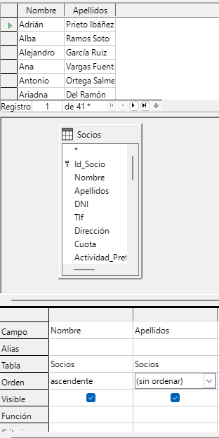{ .lefttrescero .margintop10 .marginbottom20 }
    En esta consulta visualizamos los campos **Nombre** y **Apellidos**. Además, ordenaremos los resultados por orden alfabético sobre la columna **Nombre**.  
    **Guardar la consulta como consulta_4**.

!!! tip "Ejemplo de consulta con un criterio"
    En esta consulta añadimos un criterio a la consulta anterior para que nos devuelva los valores que cumplan la condición Cuota = Anual.
    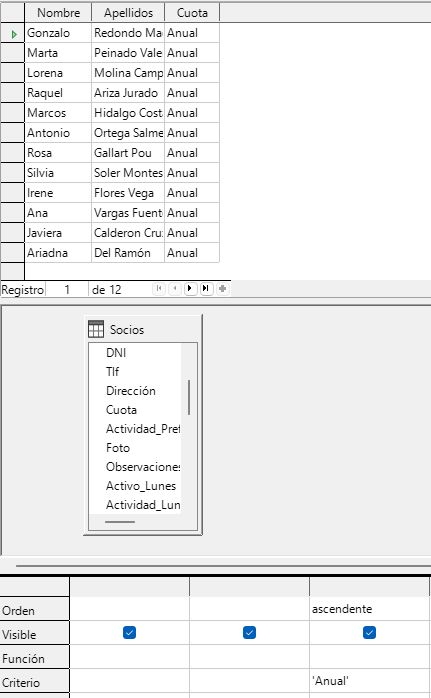{ .leftcuatrocero .margintop10 .marginbottom20 }

!!! task "Trabajo a realizar"  
    !!! exercise "Ejercicio 3"  
        Modificar la consulta anterior para que devuelva los registros que cumplan las condiciones **Cuota = Anual O Cuota = Mensual**.  
        Guardar la consulta como **consulta_5**.
    !!! exercise "Ejercicio 4"  
        Crear una consulta que devuelva la cantidad de registros que cumplan la condición **Cuota = Anual**.  
        Guardar la consulta como **consulta_6**.  
    !!! exercise "Ejercicio 5"  
        Crear una consulta que devuelva la cantidad de registros que cumplan las condiciones **Cuota = Anual O Trimestral O Mensual**.  
        Guardar la consulta como **consulta_7**.
    !!! exercise "Ejercicio 6"  
        Crear una consulta que devuelva todos los registros que cumplan las condiciones **Actividad_Lunes no es nulo**.  
        Guardar la consulta como **consulta_8**.

#### 4.2.2 - Consultas sobre varias tablas

Cuando una sola tabla no es suficiente para la consulta a realizar, usaremos consultas relacionales (o Joins).

!!! task "Trabajo realizar"
    En este ejemplo nos proponemos de recuperar todos los usuarios que harán la actividad **entrenamiento funcional** el **lunes** por la **mañana** y además, saber el **horario** de dicha actividad.
    !!! exercise "Ejercicio 7"  
        Para ir entendiendo progresivamente las ventajas (y los peligros) de las consultas relacionales, realizar primero la consulta:

        - Usuarios: **Nombre** y **Apellidos**
        - Actividad: **entrenamiento funcional**
        - Día: **lunes**
        - Franja horaria: **mañana**

        Guardar la consulta como **consulta_9**.
  
    !!! exercise "Ejercicio 8"
        Revisar las tablas y buscar en qué tabla tenemos la información del horario de las actividades.

        - Crear la consulta para recuperar **Nombre**, **Apellidos** de los socios que harán **entrenamiento funcional** el **lunes** por la **mañana**.  
        **Ejemplo de resultado:**
        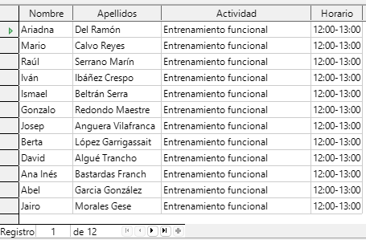{ .leftcuatrocero .margintop10 .marginbottom20 }
        
        Guardar la consulta como **consulta_10**.

### 4.3 - Informes


    En esta consulta queremos recuperar el nombre y apellidos de los socios que harán ciclo indoor el lunes. Para ello, es necesario usar la tabla **Socios** y la tabla **Actividades**.  


<!-- https://www.iesandresbojollo.es/tiyc/base/2-Interfaz_de_usuario.html -->
<!-- https://www.tuinstitutoonline.com/aula/course/view.php?id=10 -->
<!-- https://oficinalibre.net/mod/scorm/player.php -->

### 4.3 - Consultas con el asistente


## 5 - Tarea RA4-CEf

## 6 - Tarea RA4-CEh
<!-- https://www.tuinstitutoonline.com/cursos/bbdd/basebasico1_v19es/08disenyo_formularios.php -->

<!-- https://www.youtube.com/results?search_query=libreoffice+base -->
<!-- https://www.iesandresbojollo.es/tiyc/base/2-Interfaz_de_usuario.html -->

<!-- https://oficinalibre.net/mod/scorm/view.php?id=130 -->

<!-- 
5.- Ordenación y filtrado de datos.
9.- Consultas.
10.- Ordenación, selección y operadores en consultas.
13.- Informes. 
-->

| **Licencia Creative Commons:** | |
| :--- | :--- |
|  | **Reconocimiento-NoComercial-CompartirIgual CC BY-NC-SA:**  No se permite un uso comercial de la obra original ni de las posibles obras derivadas, la distribución de la cuales se debe hace con una licencia igual a la que regula la obra original. |
