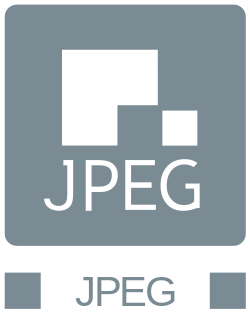
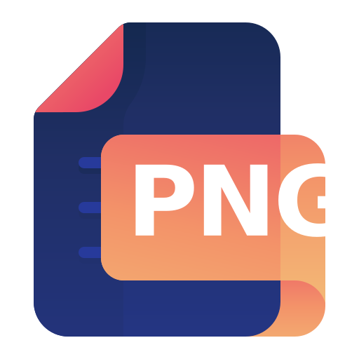
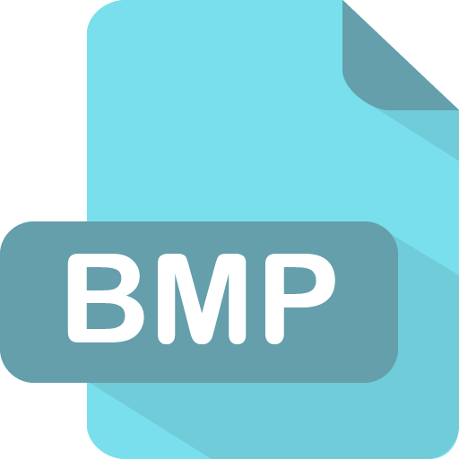
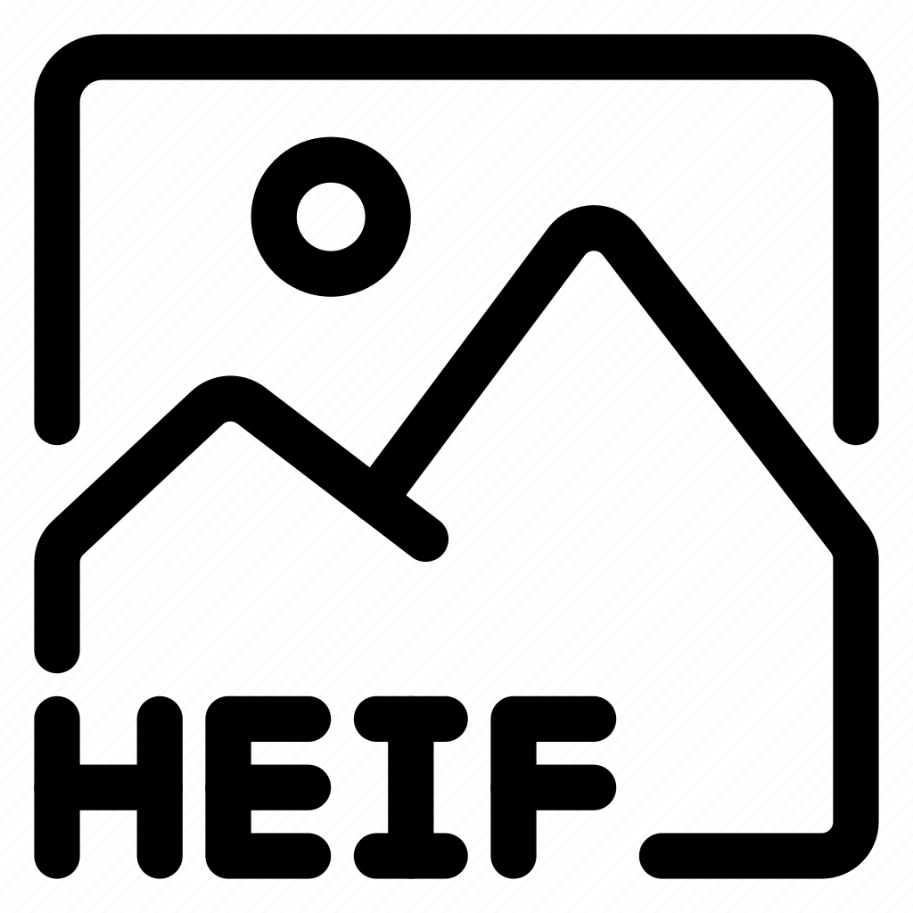
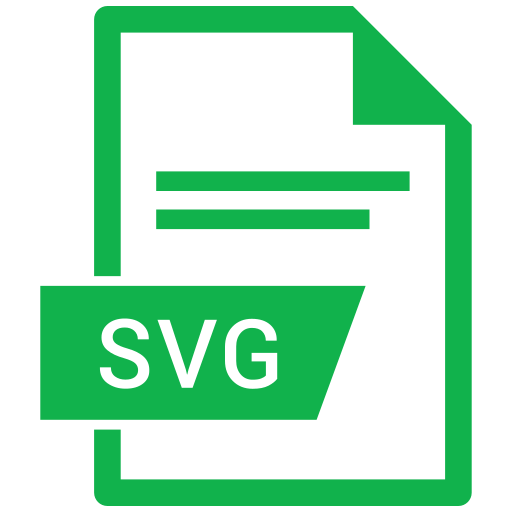
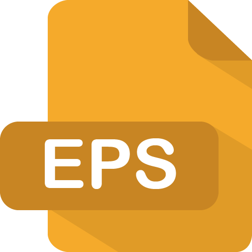
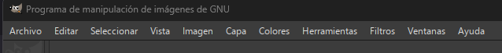
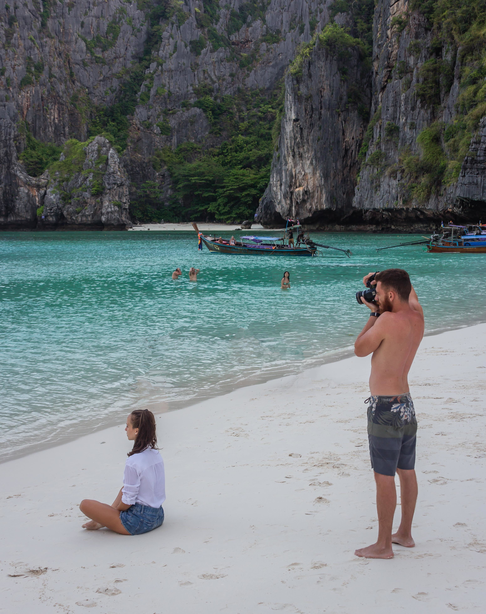

{ .doscinco .marginbottom40 }

|**Resultados de aprendizaje de la unidad didáctica:**|
|:-|
|**RA. 5:** Manipula imágenes digitales analizando las posibilidades de distintos programas y aplicando técnicas de captura y edición básicas.|

|Criterios de evaluación de la unidad didáctica:|
|:-|
|**a)** Se han analizado los distintos formatos de imágenes.|
|**b)** Se ha realizado la adquisición de imágenes con periféricos.|
|**c)** Se ha trabajado con imágenes a diferentes resoluciones, según su finalidad.|
|**d)** Se han empleado herramientas para la edición de imagen digital.|
|**e)** Se han importado y exportado imágenes en diversos formatos.|

## 1 - Introducción

Las imágenes digitales son una parte fundamental de la informática y se utilizan en una amplia variedad de aplicaciones, desde la edición de fotografías hasta el diseño gráfico y la creación de contenido multimedia. En esta unidad didáctica, se explorarán los conceptos básicos relacionados con las imágenes digitales, incluyendo los formatos de archivo, la adquisición de imágenes, la resolución y las herramientas de edición.

## 2 - Tipos de imágenes digitales

- Las imágenes digitales se pueden clasificar en dos categorías principales: imágenes **rasterizadas** y imágenes **vectoriales**.  
- Las imágenes rasterizadas están compuestas por **píxeles**, mientras que las imágenes vectoriales están formadas por objetos geométricos definidos mediante ecuaciones matemáticas (líneas, curvas, polígonos).
- Ambos tipos de imágenes tienen sus propias ventajas y desventajas como se muestra en la siguiente tabla:  

| Tipo de imagen | Ventajas | Desventajas |
| --- | --- | --- |
| Rasterizada | - Ideal para fotografías y gráficos con muchos detalles.   - Es compatible con la mayoría de los programas de edición de imágenes. | - La calidad de la imagen puede degradarse al ampliarla.   - El tamaño del archivo puede ser grande, especialmente para imágenes de alta resolución. |
| Vectorial | - Es ideal para gráficos y logotipos que requieren escalabilidad.   - El tamaño del archivo suele ser más pequeño que el de las imágenes rasterizadas. | - No es adecuada para fotografías o gráficos con muchos detalles.   - Puede no ser compatible con algunos programas de edición de imágenes. |

!!! Exercise "Ejercicio"
    - Descargar las imagenes de los siguientes enlaces:  
    [imagen svg](./img/UT5/imagensvg.svg)  
    [imagen raster](./img/UT5/img-2.png)  
    - Escalar las imágenes en pantalla (ctrl +/-).
    - Evidenciar la perdida de resolución de la imagen rasterizada frente a la vectorial.

## 2 - Formatos de imagen

### 2.1 - Conceptos básicos de imagenes rasterizadas

Las imágenes rasterizadas (también llamadas bitmap) o mapa de puntos estan compuestas por **píxeles** con unos valores de color propios. El conjunto de esos píxeles componen la imagen total.

- **Píxel**:  
**a)** Píxel es la abreviatura de **Picture Element** y es la unidad más pequeña que encontraremos en las imágenes bitmap.  
**b)** Es la unidad mínima en la que se divide una imagen digital y cada uno de ellos tiene un color (diferente).  
**c)** El color se representa normalmente mediante el modelo RGB (rojo, verde y azul). En algunos casos se añade un canal alfa, que representa la transparencia.

- **Tamaño**:  
El tamaño de una imagen bitmap es la cantidad de píxeles que tiene. Viene expresado como producto del número de píxeles que tiene a
lo ancho por la cantidad de píxeles que tiene a lo alto.  
**Ejemplo**: Imagen de 800x600 = 480000 píxeles.

- **Resolución de la imagen**:  
**a)** La resolución de una imagen se refiere a la densidad de píxeles, normalmente medida en píxeles por pulgada (ppi). No debe confundirse con el tamaño de la imagen, que es el número total de píxeles (ancho × alto).  
**b)** La resolución es uno de los parámetros fundamentales para definir la calidad de reproducción de una determinada imagen.

### 2.2 - Formatos de imagenes rasterizadas (raster)

También conocidas como Mapas de Bits (bitmap) están compuestas por una cuadrícula de píxeles individuales. Su principal limitación es que pierden calidad al ampliarse, mostrándose borrosas o "pixeladas".  

Algunos formatos como GIF o TIFF siguen utilizándose en contextos específicos, aunque han surgido alternativas más modernas como WebP.

Los formatos más comunes incluyen JPG/JPEG, PNG, GIF, TIFF, WebP y RAW, cada uno con sus propias características y usos específicos.

#### 2.1.1 - Formato JPG y JPEG

{ .leftunocero .margintop10 .marginbottom20}

El formato JPEG (Joint Photographic Experts Group) es un formato de imagen muy común debido a su eficiencia en la compresión de imágenes fotográficas.  

Utiliza **compresión con pérdida**, al reducir el tamaño del archivo eliminando información de la imagen que el ojo humano no puede percibir fácilmente.

#### 2.1.2 - Formato PNG

{ .leftunodos .margintop10 .marginbottom20}

El formato PNG (Portable Network Graphics) destaca por la posibilidad de **comprimir imágenes sin pérdidas** y de ofrecer una profundidad de color de hasta 24 bits por píxel.  

El formato PNG soporta tanto la transparencia como la semitransparencia (gracias al canal alfa integrado).  
A causa del proceso de compresión sin pérdidas, los archivos son relativamente grandes, hecho que deberemos tener en cuenta a la hora de realizar documentos.

#### 2.1.3 - Formato BMP

{ .leftunodos .margintop10 .marginbottom20}

El formato BMP (Windows bitmap), inicialmente desarrollado para sistemas operativos Microsoft e IBM es un formato de almacenamiento para mapas de bits con una profundidad de color de hasta 24 bits por píxel.

El formato de imagen sin comprimir asigna a cada píxel un valor cromático, por lo que los archivos suelen ser muy grandes, motivo por el que el formato no es adecuado para su uso en aplicaciones ofimáticas.

#### 2.1.4 - Formato GIF

{ .leftunodos .margintop10 .marginbottom20}

El formato GIF (Graphics Interchange Format) es un formato de imagen rasterizada que utiliza compresión sin pérdidas (LZW) y está limitado a 8 bits, es decir, hasta 256 colores.

Aunque esta limitación reduce su capacidad para representar imágenes complejas, puede ayudar a disminuir el tamaño del archivo en algunos casos.

Su principal ventaja es que permite animaciones, lo que lo hace popular para contenido visual dinámico.

#### 2.1.5 - Formato HEIF

{ .leftunodos .margintop10 .marginbottom20}

El formato HEIF (High Efficiency Image Format) no es ampliamente utilizado, aunque tiene potencial debido a su eficiencia en la compresión de imágenes (mayor calidad y menor tamaño que JPEG).

HEIF es más común en dispositivos móviles, especialmente en productos de Apple, donde se usa por defecto para capturar fotos.

#### 2.1.6 - Formato WebP

{ .leftunodos .margintop10 .marginbottom20}

El formato WEBP es una alternativa relativamente nueva y fue desarrollada por Google. Este formato utiliza una combinación de compresión sin pérdida y con pérdida para lograr tamaños de archivo más pequeños que los formatos de imagen anteriores.

El formato WEBP es **compatible con transparencia** y es compatible con imágenes animadas.

#### 2.1.7 - Formato TIFF

{ .leftunodos .margintop10 .marginbottom20}

Archivo de muy alta calidad y sin pérdida, utilizado fundamentalmente en la industria de impresión profesional debido a su gran tamaño. No se recomienda su uso en aplicaciones ofimáticas debido a su gran tamaño, aunque es ideal para la edición de imágenes de alta calidad.

#### 2.1.8 - Formato RAW

{ .leftunodos .margintop10 .marginbottom20}

Contiene los datos "crudos" del sensor de la cámara sin procesar. Ofrece la máxima flexibilidad para la edición profesional, aunque genera archivos muy pesados. No es adecuado para su uso en aplicaciones ofimáticas, aunque es ideal para la edición de imágenes de alta calidad.

### 2.2 - Conceptos básicos de imágenes vectoriales

Las imágenes vectoriales están formadas por objetos geométricos definidos mediante ecuaciones matemáticas (líneas, curvas, polígonos, etc.). Estos objetos, combinados entre sí, componen la imagen total.

- **Objeto vectorial**:  
**a)** Es la unidad básica de una imagen vectorial y está definido mediante expresiones matemáticas.  
**b)** Puede representar elementos como líneas, curvas, formas geométricas o texto.  
**c)** Sus propiedades incluyen atributos como color, grosor de línea, relleno y transparencia.  

- **Tamaño**:
El tamaño de una imagen vectorial no depende de una cantidad fija de píxeles, sino de las dimensiones del área de trabajo donde se representan los objetos.  
Ejemplo: Un mismo gráfico vectorial puede visualizarse correctamente tanto en tamaño pequeño como ampliado sin pérdida de calidad.

- **Resolución de la imagen**:
**a)** Las imágenes vectoriales son independientes de la resolución, ya que se basan en fórmulas matemáticas y no en píxeles.  
**b)** Esto permite escalarlas a cualquier tamaño sin pérdida de calidad, siendo ideales para logotipos, iconos y gráficos técnicos.

### 2.3 - Formatos de imagenes vectoriales

#### 2.3.1 - Formato SVG

{ .leftunodos .margintop10 .marginbottom20}

El formato SVG (Scalable Vector Graphics) es un formato de imagen vectorial **basado en XML** que soporta **transparencia y animaciones**.

Esto permite que las imágenes sean escalables sin perder calidad haciendolas ideales para gráficos e iconos de alta calidad en diferentes tamaños y resoluciones.

#### 2.3.2 - Formato EPS

{ .leftunodos .margintop10 .marginbottom20}

El formato EPS (Encapsulated PostScript) se utiliza para guardar ilustraciones o trabajos de diseño gráfico en programas de ilustración como Adobe Illustrator y CorelDraw.

Utilizado principalmente en gráficos profesionales es útil para crear imágenes de alta calidad.

#### 2.3.3 - Formato PDF

{ .leftunodos .margintop10 .marginbottom20}

El formato PDF (Portable Document Format) es muy familiar como formato de documento, pero también puede utilizarse para guardar imágenes e ilustraciones.

Un archivo PDF se basa en el mismo lenguaje PostScript que el EPS. Es un vector con compresión sin pérdidas, lo que te permite ampliar una imagen PDF tanto como uno desea.

También es posible incluir elementos interactivos en un PDF, por ejemplo, enlaces y botones.

## 3 - Tarea RA5-CEa - Formatos de imágenes

### 3.1 - Preguntas tipo test

!!! warning "Trabajo a realizar"
    - Para esta evaluación, deberéis responder a 20 preguntas tipo test.
    - Podéis descargar el archivo de texto desde el siguiente [enlace](./05_imagenes/tareas/RA5%20CEa.odt)
    - Subrayar la respuesta que consideráis correcta.

### 3.2 - Entrega de la tarea

!!! warning "Condiciones de entrega de la tarea"
    - Guardar el documento con RA5-CEa-NombreApellidos en formato **odt**, **formato nativo** de LibreOffice writer.
    - **No se aceptará ningun formato que no sea odb**.  
    - Subir la base de datos, a la tarea RA5-CEa de **Aules**.
    - A partir de momento de apertura de la tarea, dispondréis de **20 minutos** para subir vuestros trabajos. Pasado ese tiempo la tarea se cerrará y ya no será posible subir vuestras respuestas.

## 4 - Editor de imágenes digitales GIMP

GIMP (GNU Image Manipulation Program) es un programa de edición de imágenes digitales de código abierto y gratuito. Es una alternativa popular a programas comerciales como Adobe Photoshop. GIMP ofrece una amplia gama de herramientas y funciones para la manipulación de imágenes, incluyendo retoque fotográfico, composición de imágenes, creación de gráficos y mucho más.

### 4.1 - Descarga e instalación de GIMP

- Seguir el siguiente enlace para descargar GIMP: [https://www.gimp.org/downloads/](https://www.gimp.org/downloads/)
- Seleccionar la versión adecuada para tu sistema operativo (Windows, macOS o Linux).
- Seguir las instrucciones del asistente de instalación.

### 4.2 - Funciones básicas de GIMP

<!-- https://youtu.be/ZbLyASD_taU?si=9jZQbDDKcVAGhvnN&t=247 -->

#### 4.2.1 - Primer vistazo al programa

- Abrir GIMP y familiarizarse con la interfaz de usuario.
{ .leftoriginal .margintop10 .marginbottom20}

- Pestañas de Gimp:  
    1. **Archivo** → Todo lo relacionado con abrir, guardar, exportar y cerrar archivos.
    1. **Editar** → Todo lo relacionado con las preferencias del programa.
    1. **Seleccionar** → Todo lo relacionado con las herramientas de selección.
    1. **Vista** → Todo lo relacionado con la navegación y el zoom.
    1. **Imagen** → Todo lo relacionado con el tamaño y la resolución de la imagen.
    1. **Capas** → Todo lo relacionado con las capas.
    1. **Colores** → Todo lo relacionado con las herramientas de color.
    1. **Herramientas** → Todo lo relacionado con las herramientas de pintura, selección, transformación, texto, clonado y saneado.
    1. **Filtros** → Todo lo relacionado con los filtros que se pueden aplicar a la imágenes.
    1. **Ventanas** → Todo lo relacionado con la organización de las ventanas del programa.

#### 4.2.2 - Configuración básica para trabajar con Gimp

- Para poder visualizar todas las herraminetas de dibujo, ir a **Ventanas** → **Diálogos acoplables** → **Opción de herramienta**.
- También podéis probar el Modo de ventana única que es el que viene por defecto en la mayoría de los programas de edición de imágenes.
- Aparte de opciones de herramientas, también es interesante tener a mano otras pestañas siempre abiertas, para poder editar imágenes (por ejemplo, colores, tipografías, pinceles...). También puede resultar util saber redistribuir las pestañas para siempre tener visibles las que más utilicemos.  
- En **Editar** → **Preferencias** podremos ajustar el programa a nuestras necesidades, por ejemplo, ajustar el color de la interfaz gráfica (claro / gris / oscuro).

#### 4.2.3 - Abrir y guardar archivos

- Para crear un nuevo archivo, ir a **Archivo** → **Nuevo** y seleccionar las dimensiones y la resolución de la imagen que queremos crear (también podemos usar plantillas de formato).
- Para abrir un archivo, ir a **Archivo** → **Abrir** y seleccionar el archivo que queremos editar. También podemos arrastrar y soltar el archivo directamente en la ventana de GIMP.
- Aparte de **Guardar** y **Guardar como**, también disponemos de la posibilidad de **Guardar una copia** que guarda el archivo con un nuevo nombre pero sin cambiar el archivo original, y **Exportar como** que nos permite guardar el archivo en un formato diferente al nativo de GIMP (XCF).

#### 4.2.4 - Herramientas de Gimp

- Familiarizarse con las herramientas de **dibujo**, **transformación**, **texto**, **clonado** y **saneado**.
- Para cada herramienta, es importante conocer sus opciones y cómo utilizarlas de manera efectiva.
- Familiarizarse con el concepto de **capas**, que permite trabajar con diferentes elementos de la imagen de manera independiente.
- Familiarizarse con las herramientas de **selección** (formas, ruta, selección difusa), que permiten trabajar o mover solo una zona de la imagen.

##### 4.2.4.1 - Herramientas de dibujo

- Pincel: Para dibujar líneas y formas con diferentes tamaños, formas y opacidades.
- Lápiz: Similar al pincel pero con bordes más definidos.
- Aerógrafo: Para crear efectos de spray o difuminado.

##### 4.2.4.2 - Herramientas de transformación

- Para transformar una imagen, seleccionar la herramienta de transformación que se desea utilizar (escalado, rotación, sesgado, perspectiva, etc.) y luego hacer clic y arrastrar en la imagen para aplicar la transformación.
- Para transformar una selección, primero realizar la selección con la herramienta de selección y luego aplicar la transformación a la selección.

##### 4.2.4.3 - Herramientas de texto

- Para agregar texto a una imagen, seleccionar la herramienta de texto y hacer clic en la imagen para crear un cuadro de texto. Luego, escribir el texto deseado y ajustar las opciones de fuente, tamaño, color y alineación según sea necesario.

##### 4.2.4.4 - Herramientas de clonado y saneado

- La herramienta de clonado se utiliza para copiar una parte de la imagen y pegarla en otra área. Para usarla, seleccionar la herramienta de clonado, luego hacer clic en la imagen para seleccionar el área que se desea copiar y arrastrar el cursor a la nueva ubicación donde se desea pegar la copia.
- La herramienta de saneado se utiliza para eliminar imperfecciones o elementos no deseados de

##### 4.2.4.5 - Capas

- Las capas permiten trabajar con diferentes elementos de la imagen de manera independiente. Para crear una nueva capa, ir a **Capa** → **Nueva capa** y seleccionar las opciones deseadas.
- Se pueden insertar imagenes como capas en un proyecto de GIMP. Para ello, ir a **Archivo** → **Abrir como capas** y seleccionar el archivo que se desea insertar.
- Para organizar las capas, se pueden arrastrar y soltar en la ventana de capas, así como cambiar su orden o **visibilidad**.
- Es posible agrupar capas para mantener el proyecto organizado.
- Para editar una capa específica, asegurarse de que esté seleccionada en la ventana de capas antes de aplicar cualquier herramienta o efecto.
- Para recortar una capa al contenido, ir a **Capa** → **Recortar capa al contenido**.
- Para alinear una capa a la capa activa, ir a **Capa** → **Alinear a capa activa**.
- Para poder eliminar el fondo de una imagen, es necesario añadir un canal alfa a la capa. Para ello, ir a **Capa** → **Transparencia** → **Añadir canal alfa**.

## 4.3 - Tarea RA5-CEbc

### 4.3.1 - Escalado de imágenes y operaciones básicas

!!! warning "Trabajo a realizar"
    - Descargar [imagen](./05_imagenes/tareas/RA5-CEbc/imagen_1.jpg) y pasarla a blanco y negro.
    - Escalar imagen a ancho = 2100 píxeles.
    - Definir un lienzo de 1920x1080 píxeles.
    - Centrar la imagen.
    - Aplicar un filtro que más o guste.
    - Guardar la imagen en formato WebP

### 4.3.2 - Entrega de la tarea

!!! warning "Condiciones de entrega de la tarea"
    - Guardar el documento con RA5-CEbc-NombreApellidos en formato **WebP**.
    - **No se aceptará ningun formato**.  
    - Subir el documento a la tarea de **Aules**.
    - A partir de momento de apertura de la tarea, dispondréis de **2 semanas** para subir vuestros trabajos. Pasado ese tiempo la tarea se cerrará y ya no será posible subir vuestras respuestas.

## 4.4 - Tarea RA5-CEde-1

### 4.4.1 - Retoque de imágenes

!!! warning "Trabajo a realizar"
    - Descargar .
    - Con las herramientas clonar y sanear, eliminar la palmera de la imagen.
    - Resultado esperado:
    {.margintop20}

### 4.4.2 - Entrega de la tarea

!!! warning "Condiciones de entrega de la tarea"
    - Guardar el documento con RA5-CEde-1-NombreApellidos en formato **png**.
    - **No se aceptará ningun formato**.  
    - Subir el documento a la tarea de **Aules**.
    - A partir de momento de apertura de la tarea, dispondréis de **2 semanas** para subir vuestros trabajos. Pasado ese tiempo la tarea se cerrará y ya no será posible subir vuestras respuestas.

## 4.5 - Tarea RA5-CEde-2

### 4.5.1 - Retoque de imágenes

!!! warning "Trabajo a realizar"
    - Descargar la siguiente [imagen](./05_imagenes/tareas/RA5-CEde/imagen_2.jpg).
    - Usando los filtros de mezcla (modo) de capas, cambiar e igualar el color de los ojos del gato.
    - Resultado esperado:
    {.margintop20}

### 4.5.2 - Entrega de la tarea

!!! warning "Condiciones de entrega de la tarea"
    - Guardar el documento con RA5-CEde-2-NombreApellidos en formato **jpg**.
    - **No se aceptará ningun formato**.  
    - Subir el documento a la tarea de **Aules**.
    - A partir de momento de apertura de la tarea, dispondréis de **2 semanas** para subir vuestros trabajos. Pasado ese tiempo la tarea se cerrará y ya no será posible subir vuestras respuestas.

## 4.6 - Tarea RA5-CEde-3

### 4.6.1 - Alineación y distribución de capas

!!! warning "Trabajo a realizar"
    - Descargar [archivo](./05_imagenes/tareas/RA5-CEde-3/pokemon.zip) y extraer las imágenes.
    - Usando las herramientos de alineación y distribución realizar un diseño similar a la siguiente imagen.
    {.margintop20}

### 4.6.2 - Entrega de la tarea

!!! warning "Condiciones de entrega de la tarea"
    - Guardar el documento con RA5-CEde-3-NombreApellidos en formato **jpg**.
    - **No se aceptará ningun formato**.  
    - Subir el documento a la tarea de **Aules**.
    - A partir de momento de apertura de la tarea, dispondréis de **2 semanas** para subir vuestros trabajos. Pasado ese tiempo la tarea se cerrará y ya no será posible subir vuestras respuestas.

## 4.7 - Tarea RA5-CEde-4

### 4.7.1 - Filtros avanzados de Gimp

!!! warning "Trabajo a realizar"
    - Ir a [gmic](https://gmic.eu/download.html) y descargar el complemento Gmic (cuidado con la version de Gimp y el sistema operativo).
    - Descargar [imagen](./05_imagenes/tareas/RA5-CEde-4/imagen.jpg).
    - Elegir el filtro adecuado para eliminar personas y dejar la imagen de la siguiente manera:
    {.margintop20}
    - !!! tip "Podéis mejorar el aspecto de la imagen con la herramientas habituales de Gimp"

### 4.7.2 - Entrega de la tarea

!!! warning "Condiciones de entrega de la tarea"
    - Guardar el documento con RA5-CEde-4-NombreApellidos en formato **png**.
    - **No se aceptará ningun formato**.  
    - Subir el documento a la tarea de **Aules**.
    - A partir de momento de apertura de la tarea, dispondréis de **2 semanas** para subir vuestros trabajos. Pasado ese tiempo la tarea se cerrará y ya no será posible subir vuestras respuestas.

<!-- -16i-
quitar fondo con g-mic
punto verde se queda. punto rojo se quita.

https://www.youtube.com/watch?v=FrIY5E-4u6Y -->

| **Licencia Creative Commons:** | |
| - | - |
|  | **Reconocimiento-NoComercial-CompartirIgual CC BY-NC-SA:**  No se permite un uso comercial de la obra original ni de las posibles obras derivadas, la distribución de la cuales se debe hace con una licencia igual a la que regula la obra original. |
