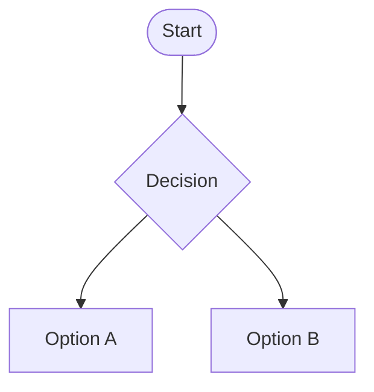

{ .img-center width=75% }

<!-- 

  

   -->

 

**Resultados de aprendizaje y criterios de evaluación del módulo:**  
<table>
  <tr>
    <td style="white-space: nowrap;">RA. 1:</td>
    <td>
      Instala y actualiza aplicaciones ofimáticas, interpretando especificaciones y describiendo los pasos a seguir en el proceso. 
      

        
Ver los criterios de evaluación

        <table>
          <tr>
            <td>a)</td>
            <td>Se han identificado y establecido las fases del proceso de instalación.</td>
          </tr>
          <tr>
            <td>b)</td>
            <td>Se han respetado las especificaciones técnicas del proceso de instalación.</td>
          </tr>
          <tr>
            <td>c)</td>
            <td>Se han configurado las aplicaciones según los criterios establecidos.</td>
          </tr>
          <tr>
            <td>d)</td>
            <td>Se han documentado las incidencias.</td>
          </tr>
          <tr>
            <td>e)</td>
            <td>Se han solucionado problemas en la instalación o integración con el sistema informático.</td>
          </tr>
          <tr>
            <td>f)</td>
            <td>Se han eliminado y/o añadido componentes de la instalación en el equipo.</td>
          </tr>
          <tr>
            <td>g)</td>
            <td>Se han actualizado las aplicaciones.</td>
          </tr>
          <tr>
            <td>h)</td>
            <td>Se han respetado las licencias software.</td>
          </tr>
          <tr>
            <td>i)</td>
            <td>Se han propuesto soluciones software para entornos de aplicación.</td>
          </tr>
        </table>
      

    </td> 
  </tr>  
  <tr>
    <td>RA. 2:</td>
    <td>
      Elabora documentos y plantillas, describiendo y aplicando las opciones avanzadas de procesadores de textos.  
      

        
Ver los criterios de evaluación

        <table>
          <tr>
            <td>a)</td>
            <td>Se ha personalizado las opciones de software y barra de herramientas.</td>
          </tr>
          <tr>
            <td>b)</td>
            <td>Se han diseñado plantillas.</td>
          </tr>
          <tr>
            <td>c)</td>
            <td>Se han utilizado aplicaciones y periféricos para introducir textos e imágenes.</td>
          </tr>
          <tr>
            <td>d)</td>
            <td>Se han importado y exportado documentos creados con otras aplicaciones y en otros formatos.</td>
          </tr>
          <tr>
            <td>e)</td>
            <td>Se han creado y utilizado macros en la realización de documentos.</td>
          </tr>
          <tr>
            <td>f)</td>
            <td>Se han elaborado manuales específicos.</td>
          </tr>
        </table>
      

    </td>
  </tr> 
  <tr> 
    <td>RA. 3:</td>
    <td>
      Elabora documentos y plantillas de cálculo, describiendo y aplicando opciones avanzadas de hojas de  cálculo.
      

        
Ver los criterios de evaluación

        <table>
          <tr>
            <td>a)</td>
            <td>Se ha personalizado las opciones de software y barra de herramientas.</td>
          </tr>
          <tr>
            <td>b)</td>
            <td>Se han utilizado los diversos tipos de datos y referencia para celdas, rangos, hojas y libros.  </td>
          </tr>
          <tr>
            <td>c)</td>
            <td>Se han aplicado fórmulas y funciones.</td>
          </tr>
          <tr>
            <td>d)</td>
            <td>Se han generado y modificado gráficos de diferentes tipos.</td>
          </tr>
          <tr>
            <td>e)</td>
            <td>Se han empleado macros para la realización de documentos y plantillas.</td>
          </tr>
          <tr>
            <td>f)</td>
            <td>Se han importado y exportado hojas de cálculo creadas con otras aplicaciones y en otros  formatos.</td>
          </tr>
          <tr>
            <td>g)</td>
            <td>Se ha utilizado la hoja de cálculo como base de datos: formularios, creación delistas,       filtrado,   protección y ordenación de datos.</td>
          </tr>
          <tr>
            <td>h)</td>
            <td>Se han utilizado aplicaciones y periféricos para introducir textos, números, códigos e  imágenes.</td>
          </tr>
        </table>
      

    </td>
  </tr>
  <tr>  
    <td>RA. 4:</td>
    <td>
      Elabora documentos con bases de datos ofimáticas describiendo y aplicando operaciones de manipulación de datos. 
      

        
Ver los criterios de evaluación

        <table>
          <tr>
            <td>a)</td>
            <td>Se han identificado los elementos de las bases de datos relacionales.</td>
          </tr>
          <tr>
            <td>b)</td>
            <td>Se han creado bases de datos ofimáticas.</td>
          </tr>
          <tr>
            <td>c)</td>
            <td>Se han utilizado las tablas de la base de datos (insertar, modificar y eliminar registros).</td>
          </tr>
          <tr>
            <td>d)</td>
            <td>Se han utilizado asistentes en la creación de consultas.</td>
          </tr>
          <tr>
            <td>e)</td>
            <td>Se han utilizado asistentes en la creación de formularios.</td>
          </tr>
          <tr>
            <td>f)</td>
            <td>Se han utilizado asistentes en la creación de informes.</td>
          </tr>
          <tr>
            <td>g)</td>
            <td>Se ha realizado búsqueda y filtrado sobre la información almacenada.</td>
          </tr>
          <tr>
            <td>h)</td>
            <td>Se han creado y utilizado macros.</td>
          </tr>
        </table>
      

    </td>
  </tr>  
  <tr>
    <td>RA. 5:</td>
    <td>
      Manipula imágenes digitales analizando las posibilidades de distintos programas y aplicando técnicas de captura y edición básicas.
      

        
Ver los criterios de evaluación

        <table>
          <tr>
            <td>a)</td>
            <td>Se han analizado los distintos formatos de imágenes.</td>
          </tr>
          <tr>
            <td>b)</td>
            <td>Se ha realizado la adquisición de imágenes con periféricos.</td>
          </tr>
          <tr>
            <td>c)</td>
            <td>Se ha trabajado con imágenes a diferentes resoluciones, según su finalidad.</td>
          </tr>
          <tr>
            <td>d)</td>
            <td>Se han empleado herramientas para la edición de imagen digital.</td>
          </tr>
          <tr>
            <td>e)</td>
            <td>Se han importado y exportado imágenes en diversos formatos.</td>
          </tr>
        </table>
      

    </td>
  </tr>    
  <tr>
    <td>RA. 6:</td>
    <td>
      Manipula secuencias de vídeo analizando las posibilidades de distintos programas y aplicando técnicas de captura y edición básicas.
      

        
Ver los criterios de evaluación

        <table>
          <tr>
            <td>a)</td>
            <td>Se han reconocido los elementos que componen una secuencia de vídeo.</td>
          </tr>
          <tr>
            <td>b)</td>
            <td>Se han estudiado los tipos de formatos y codecs más empleados.</td>
          </tr>
          <tr>
            <td>c)</td>
            <td>Se han importado y exportado secuencias de vídeo.</td>
          </tr>
          <tr>
            <td>d)</td>
            <td>Se han capturado secuencias de vídeo con recursos adecuados.</td>
          </tr>
          <tr>
            <td>e)</td>
            <td>Se han elaborado vídeo tutoriales.</td>
          </tr>
        </table>
      

    </td>
  </tr>    
  <tr>
    <td>RA. 7:</td>
    <td>
      Elabora presentaciones multimedia describiendo y aplicando normas básicas de composición y diseño.
      

        
Ver los criterios de evaluación

        <table>
          <tr>
            <td>a)</td>
            <td>Se han identificado las opciones básicas de las aplicaciones de presentaciones.</td>
          </tr>
          <tr>
            <td>b)</td>
            <td>Se han reconocido los distintos tipos de vista asociados a una presentación.</td>
          </tr>
          <tr>
            <td>c)</td>
            <td>Se han aplicado y reconocido las distintas tipografías y normas básicas de composición, diseño y       utilización del color.</td>
          </tr>
          <tr>
            <td>d)</td>
            <td>Se han diseñado plantillas de presentaciones.</td>
          </tr>
          <tr>
            <td>e)</td>
            <td>Se han creado presentaciones.</td>
          </tr>
          <tr>
            <td>f)</td>
            <td>Se han utilizado periféricos para ejecutar presentaciones.</td>
          </tr>
        </table>
      

    </td>
  </tr>
  <tr>
    <td>RA. 8:</td>
    <td>
      Realiza operaciones de gestión del correo y la agenda electrónica, relacionando necesidades de uso con su configuración.
      

        
Ver los criterios de evaluación

        <table>
          <tr>
            <td>a)</td>
            <td>Se han descrito los elementos que componen un correo electrónico.</td>
          </tr>
          <tr>
            <td>b)</td>
            <td>Se han analizado las necesidades básicas de gestión de correo y agenda electrónica.</td>
          </tr>
          <tr>
            <td>c)</td>
            <td>Se han configurado distintos tipos de cuentas de correo electrónico.</td>
          </tr>
          <tr>
            <td>d)</td>
            <td>Se han conectado y sincronizado agendas del equipo informático con dispositivos móviles.</td>
          </tr>
          <tr>
            <td>e)</td>
            <td>Se ha operado con la libreta de direcciones.</td>
          </tr>
          <tr>
            <td>f)</td>
            <td>Se ha trabajado con todas las opciones de gestión de correo electrónico (etiquetas, filtros,   carpetas, entre otros).</td>
          </tr>
          <tr>
            <td>g)</td>
            <td>Se han utilizado opciones de agenda electrónica.</td>
          </tr>
        </table>
      

    </td>
  </tr>    
  <tr>
    <td>RA. 9:</td>
    <td>
      Aplica técnicas de soporte en el uso de aplicaciones, identificando y resolviendo incidencias. 
      

        
Ver los criterios de evaluación

        <table>
          <tr>
            <td>a)</td>
            <td>Se han elaborado guías visuales con los conceptos básicos de uso de una aplicación.</td>
          </tr>
          <tr>
            <td>b)</td>
            <td>Se han identificado problemas relacionados con el uso de aplicaciones ofimáticas.</td>
          </tr>
          <tr>
            <td>c)</td>
            <td>Se han utilizado manuales de usuario para instruir en el uso de aplicaciones.</td>
          </tr>
          <tr>
            <td>d)</td>
            <td>Se han aplicado técnicas de asesoramiento en el uso de aplicaciones.</td>
          </tr>
          <tr>
            <td>e)</td>
            <td>Se han realizado informes de incidencias.</td>
          </tr>
          <tr>
            <td>f)</td>
            <td>Se han aplicado los procedimientos necesarios para salvaguardar la información y su recuperación.</td>
          </tr>
          <tr>
            <td>g)</td>
            <td>Se han utilizado los recursos disponibles (documentación técnica, ayudas en línea, soporte     técnico, entre otros) para solventar incidencias.</td>
          </tr>
          <tr>
            <td>h)</td>
            <td>Se han solventando las incidencias en el tiempo adecuado y con el nivel de calidad esperado.</td>
          </tr>
        </table>
      

    </td>
  </tr>    
</table>

# Content tabs.

=== "Tabla 1"
    Este es su contendi

=== "Tabla 2"
    Otra contenido

=== "Tabla 3"
    Contenido final 

# Admonition tabs

!!! note "Title of the callout"
    Aquí va el texto, no se si se puede cambiar el icono

??? info "Title of the content"
    Aquí va el texto, no se si se puede cambiar el icono    

Tipos (iconos disponibles).  
- abstract  
- info  
- tip  
- success  
- octicons  
- question  
- warning  
- failure  
- danger  
- bug  
- example  
- quote     

# Enlace a documentacion sobre mkdocs
<a href=https://squidfunk.github.io/mkdocs-material>Clic aqui</a>

# Diagramas (superfences)

<a href=https://mermaid.js.org>Editor de diagramas</a>

| **Licencia Creative Commons:** | |
| - | - |
|  | **Reconocimiento-NoComercial-CompartirIgual CC BY-NC-SA:**  No se permite un uso comercial de la obra original ni de las posibles obras derivadas, la distribución de la cuales se debe hace con una licencia igual a la que regula la obra original. | 
  
 

