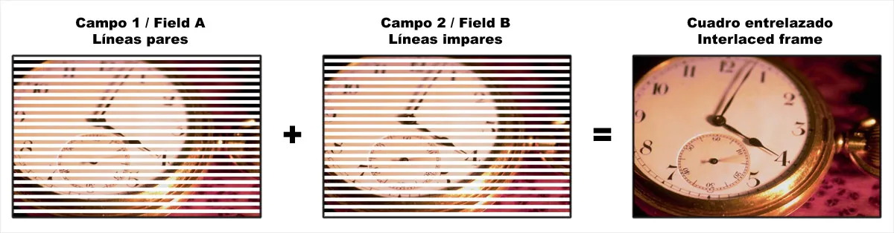
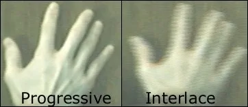
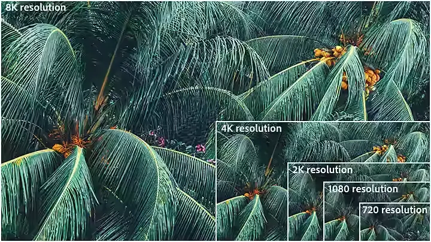
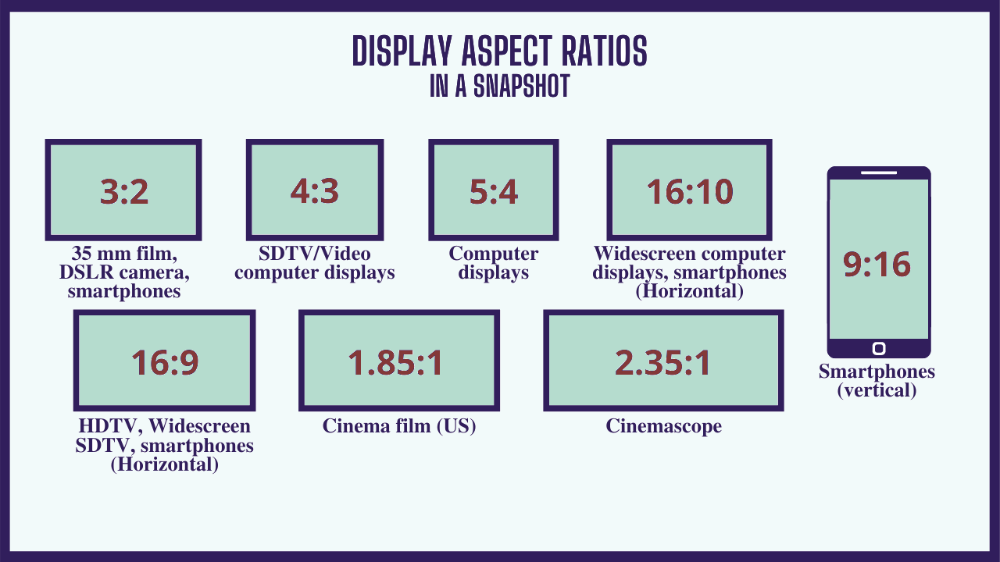
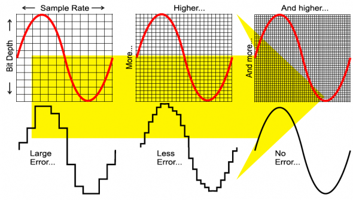
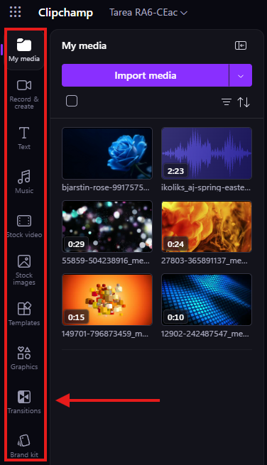
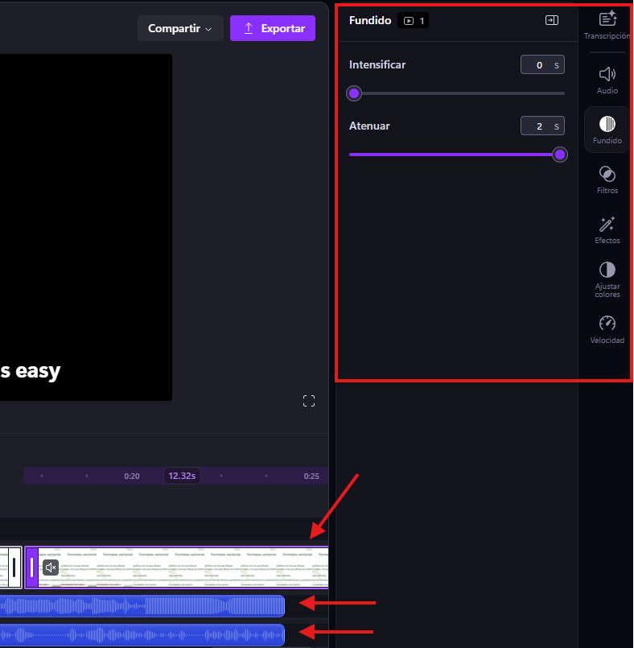

{ .cincocero .marginbottom40 }

|**Resultados de aprendizaje de la unidad didáctica:**|
|:-|
|**RA. 6:** Manipula secuencias de video analizando las posibilidades de distintos programas y aplicando técnicas de captura y edición básicas.|

|Criterios de evaluación de la unidad didáctica:|
|:-|
|**a)** Se han reconocido los elementos que componen una secuencia de video.|
|**b)** Se han estudiado los tipos de formatos y códecs más empleados.|
|**c)** Se han importado y exportado secuencias de video.|
|**d)** Se han capturado secuencias de video con recursos adecuados.|
|**e)** Se han elaborado video tutoriales.|

## 1 - Introducción

El vídeo digital es una parte fundamental de la informática moderna y se utiliza en una amplia variedad de aplicaciones, desde el streaming en plataformas digitales hasta la videoconferencia o la creación de contenido en redes sociales.  
En esta unidad didáctica, se explorarán los conceptos básicos relacionados con el vídeo digital (códecs, framerate, resolución...).

## 2 - Tipos de vídeo digital

- Una de las clasificaciones más importantes del vídeo digital se basa en su método de escaneo: vídeo progresivo y vídeo entrelazado.

- El **vídeo progresivo** muestra todas las líneas de cada fotograma de forma secuencial en un mismo instante, mientras que el **vídeo entrelazado** divide cada fotograma en dos campos (líneas pares e impares) que se muestran en momentos alternos.  
!!! tip "Ejemplo de exploración entrelazada"
    { .margintopbottom10 }
- En la actualidad, el formato predominante es el **progresivo**, ya que se adapta mejor a las pantallas digitales modernas y evita los artefactos visuales propios del entrelazado.  
!!! tip "Ejemplo de diferencias de nitidez entre exploración progresiva y entrelazada (efecto combing)"  
    { .margintopbottom10 }

## 3 - Conceptos básicos de vídeo digital

El formato de vídeo digital define cómo se representa, codifica y almacena un vídeo. Incluye parámetros como resolución, tasa de fotogramas, bitrate, códec y otros aspectos relacionados con la calidad y el tamaño del archivo.

### 3.1 Resolución y relación de aspecto

#### 3.1.1 - Resolución

La resolución indica el número de píxeles que componen cada fotograma (ancho × alto).
{ .margintopbottom10 }

!!!tip "Resolución de 720 (HD)"
Es la resolución más baja considerada HDTV (1280 × 720 píxeles). Se utiliza para contenido ligero o web, aunque hoy en día resulta limitada, ya que la mayoría de pantallas soportan resoluciones superiores.

!!!tip "Resolución de 1080 (Full HD)"
La resolución 1920 × 1080 píxeles, conocida como Full HD, es el estándar más extendido. Ofrece buena calidad de imagen con un tamaño de archivo moderado y es habitual en televisores y dispositivos móviles.

!!!tip "Resolución de 2K o QHD (Quad High Definition)"
Incluye resoluciones como 2048 × 1080 (2K) y 2560 × 1440 (QHD). Proporciona mayor detalle y permite más flexibilidad en edición, reencuadre y uso en pantallas grandes.

!!!tip "Resolución de 4K (Ultra HD)"
La resolución 3840 × 2160 píxeles (UHD) ofrece gran nivel de detalle. Es útil especialmente en edición y postproducción, ya que permite recortar o ajustar la imagen sin pérdida notable de calidad.

!!!tip "Resolución de 8K"
Con 7680 × 4320 píxeles, es una resolución muy alta poco utilizada en consumo. Se emplea principalmente en producción profesional para efectos visuales y reencuadres sin pérdida de calidad.

#### 3.1.2 - Relación de aspecto

La relación de aspecto es la proporción entre el ancho y el alto de una imagen, expresada como dos números (por ejemplo, 16:9 o 4:3).

No indica la calidad, sino la forma del vídeo (horizontal, vertical o cuadrada).
{ .margintopbottom10 }

!!!tip "Relaciones de aspecto habituales"
    !!!info "1:1 (Cuadrado)"
        Formato equilibrado, común en redes sociales.

    !!!info "9:16 (Vertical)"
        Formato móvil por excelencia. Usado en TikTok, Reels, Stories y Shorts.

    !!!info "16:9 (Panorámico)"
        Estándar actual en televisión, YouTube y contenido digital.

    !!!info "16:10"
        Similar a 16:9 pero ligeramente más alto. Común en monitores de ordenador y productividad.

    !!!info "4:3 (Clásico)"
        Formato antiguo de televisión. Hoy en desuso.

    !!!info "5:4"
        Formato cercano al cuadrado, usado en monitores antiguos. Poco habitual actualmente.

    !!!info "1.85:1 (Cinematográfico estándar)"
        Muy utilizado en cine. Similar a 16:9 pero ligeramente más ancho.

    !!!info "2.35:1 (Cinematográfico panorámico)"
        Formato muy ancho típico del cine moderno (CinemaScope). Sensación más épica.

    !!!info "21:9 (Ultrapanorámico)"
        Versión comercial del formato cinematográfico. Usado en monitores y cine.

        Un vídeo es, en esencia, una sucesión de imágenes (fotogramas) que, al reproducirse a gran velocidad, crean la ilusión de movimiento.

### 3.2 - Fotogramas por segundo / Framerate

- Es la unidad mínima de una secuencia de vídeo.

- El framerate (FPS) indica cuántas imágenes se muestran por segundo (ej. 24, 30 o 60 fps).

- A mayor tasa de fotogramas, mayor es la fluidez del movimiento percibido.

### 3.3 - Codificación y descodificación de vídeo digital

Para codificar y decodificar la información de vídeo se utilizan los códecs (codificador/descodificador), que son algoritmos encargados de comprimir y descomprimir los datos audiovisuales.

Su función es reducir el tamaño del archivo sin perder una calidad significativa, lo que resulta esencial para el almacenamiento, la edición y la transmisión en streaming.

#### 3.3.1 - Tipos de compresión en vídeo

La compresión que aplican los códecs modernos se basa principalmente en dos técnicas complementarias:

- **Compresión espacial** (intra-frame):  
Reduce la información dentro de un mismo fotograma eliminando redundancias entre píxeles. Se comprimen zonas con colores o patrones similares.
- **Compresión temporal** (inter-frame):  
Aprovecha la similitud entre fotogramas consecutivos, almacenando solo los cambios entre ellos en lugar de cada imagen completa.

#### 3.3.2 - Codecs de vídeo

Un códec de vídeo (codificador/descodificador) es un algoritmo encargado de comprimir y descomprimir datos de vídeo digital.

Su objetivo principal es reducir el tamaño de los archivos manteniendo la mayor calidad posible, facilitando así su almacenamiento, edición y transmisión.

Los códecs trabajan eliminando información redundante tanto dentro de cada fotograma (compresión espacial) como entre fotogramas consecutivos (compresión temporal). Gracias a esto, permiten manejar vídeos de alta resolución como Full HD, 4K o 8K sin requerir volúmenes de datos excesivos.

!!!tip "Tipos de códecs"
    Los códecs pueden clasificarse en dos grandes grupos:

    !!!info "Códecs con pérdida (lossy)"
        Eliminan información que se considera poco perceptible para el ojo humano con el objetivo de reducir el tamaño del archivo.

        Son los más utilizados en vídeo digital.

    !!!info "Códecs sin pérdida (lossless)"
        Conservan toda la información original del vídeo, sin pérdida de calidad, pero generan archivos mucho más grandes.  
        Se usan principalmente en entornos profesionales de edición.

!!!tip "Códecs más utilizados actualmente"

    - **MPEG-4**  
    Códec de vídeo muy popular que ofrece altas tasas de compresión manteniendo una buena calidad de imagen. Se utiliza en diversas aplicaciones, como el streaming de vídeo, las videoconferencias y la edición.
    - **H.264 (AVC)**  
    Es el códec más extendido. Ofrece buen equilibrio entre calidad y tamaño y es compatible con prácticamente todos los dispositivos y plataformas.
    - **H.265 (HEVC)**  
    Evolución del H.264. Permite una compresión más eficiente (aproximadamente la mitad de tamaño para calidad similar), especialmente útil en 4K y 8K.
    - **AV1**  
    Códec moderno, libre de licencias en muchos casos, muy eficiente en streaming. Está siendo adoptado por plataformas como YouTube o Netflix.
    - **VP8/VP9**  
    Desarrollado por Google como alternativa a H.264/H.265, muy utilizado en YouTube.
    - **Códecs profesionales (ProRes, DNxHD/HR)**  
    Usados en producción y postproducción. Prioriza la calidad frente al tamaño, facilitando la edición.

### 3.4 - Tasa de bits / Bitrate

El bitrate o tasa de bits es la cantidad de datos que se codifican o transmiten por segundo en un video, normalmente medida en Mbps (megabits por segundo). Un bitrate más alto suele implicar mayor calidad de imagen y mejor fidelidad de color, pero también genera archivos más grandes.

Es un factor clave en la calidad del video, aunque su impacto depende también del códec y del tipo de compresión utilizados, por lo que no debe considerarse de forma aislada frente a la resolución u otros parámetros.

### 3.5 - Audio en un vídeo

El audio complementa la información visual y mejora significativamente la experiencia del espectador. Un vídeo sin audio puede resultar incompleto o difícil de interpretar, especialmente cuando depende de diálogos, narración o efectos sonoros.

En un proyecto audiovisual, el audio puede clasificarse en varias categorías:

#### 3.5.1 - Tipos de audio en un vídeo

- **Voz o diálogo:**  
Es el elemento principal cuando hay personas hablando (entrevistas, explicaciones, narraciones).
- **Música:**  
Se utiliza para generar emociones, marcar ritmo o reforzar el mensaje.
- **Efectos de sonido (SFX):**  
Añaden realismo o enfatizan acciones (pasos, puertas, ambiente, etc.).
- **Sonido ambiente:**  
Refleja el entorno donde se desarrolla la escena (ruido de ciudad, naturaleza, interiores, etc.).

#### 3.5.2 - Calidad del audio

Un audio de mala calidad puede arruinar incluso un vídeo visualmente atractivo. Es importante considerar:

- **Claridad:**  
Evitar ruidos, interferencias o distorsión.
- **Volumen adecuado:**  
Ni demasiado bajo ni saturado.
- **Balance:**  
Ajustar correctamente la relación entre voz, música y efectos.
- **Sincronización:**  
El audio debe coincidir perfectamente con la imagen.

#### 3.5.3 - Tratamiento digital del sonido

El sonido se transmite en forma de ondas y los ordenadores trabajan con información digital. Por ese motivo el sonido deberá ser digitalizado antes de poder ser usado en el ordenador.

- **Muestreo (sampling):**  
El proceso de sampling del sonido consiste en tomar muestras de una señal sonora (muestreo) a intervalos constantes de tiempo (frecuencia de muestreo).

!!! tip "Ejemplo"
    Una frecuencia de 44.100 Hz (estándar de CD) significa que el ordenador "escucha" y registra el sonido 44.100 veces por segundo.

- **Digitalización (profundidad de bits):**  
Es la cantidad de bits empleados para guardar el valor de cada punto muestreado: a más bits, mayor calidad.  

!!! tip "Ejemplo"
    - **16 bits**: Ofrecen 65.536 niveles (calidad de CD).
    - **24 bits**: Proporcionan una precisión extrema, usada en estudios de grabación profesionales.

- **Importancia del muestro y la digitalización en la calidad del audio**  
{.marco .ochozero .margintopbottom10 }  
Una mayor frecuencia de muestreo permite capturar frecuencias más altas del sonido, aunque a partir de ciertos valores (como 44.1 kHz) no siempre supone una mejora perceptible para el oído humano.  
La profundidad de bits determina el rango dinámico y la precisión de la señal digital. Un mayor número de bits reduce el ruido de cuantificación y permite una reproducción más fiel y detallada del audio.

#### 3.5.4 - Canales de audio

Los canales de audio representan las distintas pistas independientes por las que se distribuye el sonido. El caso más común es el audio mono (un solo canal) y estéreo (dos canales: izquierdo y derecho), que permite una percepción espacial básica.

En sistemas más avanzados, como el audio multicanal (por ejemplo, 5.1 o 7.1), se añaden más canales para mejorar la inmersión y ubicar sonidos en distintas posiciones alrededor del oyente.

En general, cuantos más canales haya, mayor será la capacidad de recrear un entorno sonoro realista, aunque también aumenta la complejidad del sistema y los requisitos de almacenamiento y procesamiento.

#### 3.5.5 - Formatos de audio

Los formatos más comunes en vídeo digital incluyen:

- AAC (Advanced Audio Codec):  
Muy utilizado por su buena calidad y compresión eficiente.
- MP3 (MPEG Audio Layer III):  
Popular, aunque menos eficiente que AAC.
- WAV:  
Alta calidad sin compresión, pero ocupa más espacio.

**Nota:**  
A la hora de elegir un formato u otro, también se deberá tener en cuenta la compatibilidad de los mismos con el software / hardware de reproducción disponible.  

**Tabla resumen de los formatos de audio**  

|Formato de audio|Frecuencia de muestreo|Profundidad de bits|Calidad de audio|Compatibilidad|
|-|-|-|-|-|
|MP3|32 kHz, 44,1 kHz, 48 kHz|16 bits|Buena|Amplia|
|WAV|44,1 kHz, 48 kHz|16 bits, 24 bits|Excelente|Moderada|
|AAC|8 kHz – 96 kHz|16 bits, 24 bits|Muy buena|Amplia|

#### 3.5.6 - Edición de audio

Durante la postproducción, es habitual trabajar el audio para mejorar el resultado final:

- Eliminación de ruido
- Ajuste de niveles
- Ecualización
- Compresión
- Inserción de música y efectos

Programas como editores de vídeo o software específico de audio permiten realizar estos ajustes de forma precisa.

### 3.6 - Subtitulos de un vídeo

Los subtítulos son textos que se superponen a la imagen de un vídeo para proporcionar información adicional, como diálogos, descripciones o traducciones. Son esenciales para mejorar la accesibilidad y la comprensión del contenido, especialmente para personas con discapacidades auditivas o para audiencias que hablan diferentes idiomas.

#### 3.6.1 - Generar subtítulos

Existen varias formas de generar subtítulos para un vídeo:

- **Manual:**  
Se pueden crear manualmente utilizando software de edición de vídeo o herramientas específicas de subtitulado, lo que permite un control total sobre el contenido y la sincronización, aunque puede ser laborioso.
- **Automático:**  
Algunos programas y plataformas ofrecen generación automática de subtítulos mediante reconocimiento de voz, lo que agiliza el proceso, aunque la precisión puede variar dependiendo de la calidad del audio y el idioma.

#### 3.6.2 - Formatos de archivos de subtítulos

Los formatos de subtítulos más comunes incluyen:

1. **SRT (SubRip Subtitle):**  
El formato SRT (SubRip) es el estándar más popular y utilizado en el mundo del vídeo debido a su extrema sencillez.

    - **Simplicidad técnica:** Se trata de archivos de texto plano que solo contienen la información esencial: el texto del subtítulo y las marcas de tiempo.

    - **Sin diseño:** A diferencia de otros formatos, el SRT no incluye estilos (como colores o fuentes), lo que lo hace ligero y fácil de editar con herramientas básicas como el Bloc de notas.

    - **Compatibilidad universal:** Es aceptado por prácticamente todas las plataformas relevantes, incluyendo redes sociales (Facebook, YouTube, LinkedIn) y servicios de streaming (Netflix, Amazon).

    - **Edición accesible:** Cualquier creador puede modificar un archivo SRT manualmente o mediante editores de terceros sin necesidad de software complejo.

1. **VTT (WebVTT):**  
El formato WebVTT (Web Video Text Track) es el estándar moderno para la web, nacido en 2010 como una evolución directa del popular SRT.

    - **Creado por el grupo WHATWG** (originalmente se llamó WebSRT), comparte gran parte de la estructura básica de su antecesor SRT.

    - **Mejoras sobre SRT:** WebVTT permite incluir metadatos, descripciones y detalles sobre la ubicación de los marcos en pantalla.

    - **Identificadores flexibles:** Los identificadores de pista son opcionales, lo que simplifica su creación en ciertos contextos.

    - **Es el estándar de la web:** Al ser la base del HTML5, es el formato predilecto para reproductores web modernos y plataformas como YouTube, Vimeo y Video.js.

1. **DFXP/XML (Distribution Format Exchange Profile):**  
Formato basado en XML utilizado en entornos profesionales, especialmente para la transmisión y distribución de contenido.

    - **Responde a la necesidad del 54% de los consumidores** que exigen contenidos de video más accesibles y de alta calidad por parte de las marcas.

    - **Compatibilidad Amplia:** Es compatible con grandes plataformas como YouTube, Vimeo y Netflix.

    - **Diferencia con SRT:** El DFXP es mucho más complejo porque incluye instrucciones detalladas sobre el formato y la ubicación exacta de los subtítulos en la pantalla.

    - **Se entrega mediante archivos con extensión .dfxp**, bajo el lenguaje de marcado XML.

1. **SCC (Scenarist Closed Caption):**

    - El formato SCC (Scenarist Closed Caption) es uno de los estándares de subtitulado más antiguos, diseñado originalmente para la televisión analógica y soportes como VHS o DVD.  

    - A pesar de su antigüedad, no ha desaparecido; al contrario, se ha adaptado a la era digital siendo utilizado por plataformas como **iTunes, Amazon y Netflix**, así como en programas de edición de vídeo. Su relevancia actual se debe a su **excelente capacidad para manejar elementos estilísticos** (posicionamiento en pantalla, cursivas y símbolos musicales), lo cual es fundamental para que los creadores cumplan con las normativas legales de accesibilidad (requisitos de la FCC).

1. **iTT (iTunes Timed Text):**  
Apple mantiene estándares muy estrictos y solo admite tres formatos de subtítulos en su plataforma, destacando principalmente el uso de iTT por encima de otros como SCC o DFXP.

    - **Nativo de Apple:** Es el formato estándar y optimizado para la iTunes Store.

    - **Flexibilidad estética:** Permite personalizar colores, ubicación y formatos de texto.

    - **Soporte Unicode:** Su gran ventaja competitiva es la capacidad de manejar caracteres no romanos (como alfabetos asiáticos), algo que muchos otros formatos no pueden procesar correctamente.

1. **ASS (Advanced SubStation Alpha):**
Es el favorito de los fans del anime y editores avanzados. Permite un control total sobre el diseño: fuentes personalizadas, colores, posiciones exactas, bordes e incluso efectos de karaoke.

    - **Uso principal:** Fansubbing, ediciones complejas y videos que requieren que el texto no tape elementos importantes de la imagen.
  
    - **Ventaja:** Extrema flexibilidad visual.

### 4 - Contenedores de vídeo

Los contenedores de vídeo son formatos de archivo que empaquetan y estructuran flujos de datos de vídeo, audio, subtítulos y metadatos en un solo archivo. A diferencia de los códecs, no determinan la compresión, sino cómo se almacena.

Los más comunes incluyen MP4, MOV, MKV, AVI y WebM.

!!! tip "Características de los contenedores de vídeo más utilizados"

    - **MP4 (MPEG-4 Part 14):**  
    El estándar más extendido. Ofrece excelente compatibilidad con la web, dispositivos móviles y   reproductores multimedia.

    - **MOV (QuickTime File Format):**  
    Desarrollado por Apple, utilizado comúnmente en edición de vídeo profesional.

    - **MKV (Matroska):**  
    Contenedor de código abierto muy versátil, capaz de almacenar múltiples pistas de audio, vídeos y   subtítulos en un solo archivo.

    - **AVI (Audio Video Interleave):**  
    Uno de los formatos más antiguos y compatibles, desarrollado por Microsoft.

    - **WebM:**  
    Optimizado para la web y HTML5, ofrece alta calidad con buena compresión.

    - **MXF (Material Exchange Format):**  
    Estándar profesional utilizado en la industria de la televisión y el cine.

Para elegir el mejor, se debe considerar la compatibilidad con el reproductor final y el propósito del vídeo (streaming vs. almacenamiento).

## 5 - Tarea RA6-CEb - Conceptos básicos sobre videos

### 5.1 - Tarea RA6-CEb

!!! warning "Trabajo a realizar"
    - Para esta evaluación, deberéis responder a 20 preguntas tipo test.
    - Podéis descargar el archivo de texto desde el siguiente [enlace](./06-videos/Tarea%20RA6-CEb/RA6%20CEb.odt)
    - Subrayar la respuesta que consideráis correcta.

### 5.2 - Entrega de la tarea

!!! warning "Condiciones de entrega de la tarea"
    - Guardar el documento con RA6-CEb-NombreApellidos en formato **odt**, **formato nativo** de LibreOffice writer.
    - **No se aceptará ningun formato que no sea odb**.  
    - Subir la base de datos, a la tarea RA6-CEb de **Aules**.
    - A partir de momento de apertura de la tarea, dispondréis de **20 minutos** para subir vuestros trabajos. Pasado ese tiempo la tarea se cerrará y ya no será posible subir vuestras respuestas.

## 6 - Clipchamp

Clipchamp es una plataforma de edición de vídeo en línea que ofrece una amplia gama de herramientas para crear, editar y compartir vídeos de manera sencilla y accesible.
Clipchamp es parte del paquete de aplicaciones de Microsoft y se integra con servicios como OneDrive, lo que facilita la gestión de archivos y la colaboración en proyectos de vídeo.

### 6.1 - Requisistos de Clipchamp

Clipchamp es un servicio online que no es compatible con firefox por lo que se deberá usar navegadores como **Microsoft Edge**, **Google Chrome (o Chromium)**.

### 6.2 - Especificaciones técnicas de Clipchamp

Clipchamp ofrece una variedad de funciones para la edición de vídeo, incluyendo:

1. **Edición de Vídeo Básica y Avanzada:** Recortar, dividir, cambiar el tamaño/relación de aspecto, voltear, girar y ajustar la velocidad de los clips en una línea de tiempo intuitiva.

1. **Grabación de Pantalla y Cámara:** Funcionalidad para grabar la pantalla del ordenador, la cámara web, o ambas simultáneamente, **ideal para tutoriales**.

1. **Inteligencia Artificial (IA):** Generación de voz a partir de texto con múltiples idiomas y estilos, y creación automática de vídeos.

1. **Recursos Multimedia y Efectos:** Acceso a una biblioteca con música, vídeos y imágenes de archivo sin derechos de autor, además de filtros, transiciones y efectos visuales.

1. **Personalización de Texto:** Adición de títulos y textos animados con fuentes, colores y estilos personalizables.

1. **Kit de Marca (Premium):** Gestión de logotipos, fuentes y paletas de colores personalizados para mantener la coherencia visual en todos los vídeos.

1. **Exportación y Compartición:** Exportación de vídeos en diversas resoluciones (hasta 4K) y formato directo para plataformas como YouTube, TikTok o LinkedIn.

### 6.3 - Tarea RA6-CEac

#### 6.3.1 - Edición de un video con Clipchamp

!!! warning "Clipchamp guarda automáticamente los proyectos en la nube, pero es importante guardar el proyecto de forma manual para evitar perder los avances realizados."

!!! warning "Trabajo a realizar"
    - En esta tarea crearemos un vídeo para familiarizarnos con Clipchamp.
    - El vídeo deberá incluir al menos:
        - Uno o varios secuencias de vídeos. Los vídeos así como las imágenes y más elementos, se podrán descargar desde el propio Clipchamp o desde portales como [pixabay](https://pixabay.com/), [pexels](https://pexels.com), etc.
        - Música de fondo (puede ser de la biblioteca de Clipchamp).
        - Títulos o textos animados.
        - Al menos una transición entre clips.

#### 6.3.2 - Funcionalidades de Clipchamp

{ .cincocero .marginbottom40 }

Ir familiarizándose con las distintas funcionalidades de Clipchamp, como:

- Carpeta de recursos multimedia (My media).
- Record & create (grabar pantalla, cámara o ambas).
- Text (añadir títulos y textos animados).
- Music (agregar música de fondo).
- Stock video (acceso a vídeos de archivo sin derechos de autor).
- Stock images (acceso a imágenes de archivo sin derechos de autor).
- Templates (plantillas de vídeo predefinidas para diferentes formatos y plataformas).
- Graphics (filtros, transiciones y efectos visuales).
- Transitions (variedad de transiciones para suavizar el cambio entre clips).
- Kit de marca (gestión de logotipos, fuentes y paletas de colores personalizados para mantener la coherencia visual en todos los vídeos).

#### 6.3.3 - Funcionalidades secundarias de los elementos de un proyecto de Clipchamp

Una vez añadidos los elementos al proyecto, se pueden explorar las funcionalidades secundarias de cada uno de ellos, como:

{ .cincocero .marginbottom40 }

- Ajustar la duración de un clip.
- Cambiar la posición de un clip en la línea de tiempo.
- Ajustar el volumen de una pista de audio.
- Aplicar efectos visuales a un clip.
- etc

#### 6.3.3 - Creación de un proyecto multimedia

!!! tip "Parte 1 - Creación de un proyecto multimedia"

1. Crear un proyecto.
1. Darle un nombre y seleccionar la relación de aspecto adecuada para el formato del vídeo que se desea crear.
1. Guardar el proyecto.
1. Importar los recursos multimedia (vídeos, imágenes, música, audio, subtítulos...) que se van a utilizar en el proyecto.
1. Arrastrar un video a la línea de tiempo.
1. Comprobar si el vídeo se reproduce correctamente y si tiene pista de audio. Contemplar la posibilidad de silenciar el audio del vídeo si no es necesario o de exportarlo para usarlo como pista de audio independiente.
1. Comprobar la posibilidad de acelerar o ralentizar el vídeo.
1. Usar la herramienta de tijeras para dividir el clip en dos o más partes para eliminar las partes no deseadas.

!!! tip "Parte 2 - Transiciones y fundidos"

1. Añadir otro vídeo a la misma barra de tiempo que el video anterior.
1. Añadir una transición entre los 2 videos.
1. Añadir otro vídeo a la barra de tiempo, pero esta vez debajo de los otros dos.
1. Ajustar la posición del vídeo para que haya una solapa entre el vídeo de abajo y el de arriba.
1. Aplicar un fundido de entrada al vídeo de abajo para que se vea el vídeo de abajo a medida que el vídeo de arriba se va atenuando.
1. Aplicar un fundido de salida en negro para finalizar el vídeo.

!!! tip "Parte 3 - Añadir una pista de audio"

1. Añadir una pista de audio a la barra de tiempo.
1. Ajustar el volumen del audio teniendo en cuenta si se trata de una música de fondo o de contenido necesario para la comprensión del vídeo.
1. Comprobar la posibilidad de acelerar o ralentizar el audio.
1. Establecer fundidos al inicio y al final del audio para que no se corten de forma abrupta al finalizarse el vídeo.

!!! tip "Parte 4 - Subtítulos"

1. Descargar un audio de voz. Por ejemplo desde [aquí](https://www.bbc.co.uk/programmes/p02pc9tn/episodes/downloads).
1. Agregarla al proyecto.
1. Ajustar el volúmen de las pistas para que el audio de sonido ambiental no dificulte la compresión de la pista de voz.
1. Comprobar sí la generación de subtítulos automáticos se realiza correctamente.
1. Comprobar la posibilidad de ocultar los subtítulos.
1. Comprobar la posibilidad de modificar el contenido de los subtítulos.  

!!! tip "Parte 5 - Textos"

1. Añadir texto al proyecto.
1. Situarlo antes de las pistas de vídeo (o solaparlo ligeramente).
1. Personalizar el texto (fuente, tamaño, color, animación...).
1. Comprobar la posibilidad de establecer una duración para el texto.
1. Repartir la misma operación pero esta vez al final del vídeo para añadir un texto de despedida con vuestro nombre.

!!! tip "Parte 6 - Pantalla verde (Chroma Key)"

1. Añadir un vídeo con fondo verde a la línea de tiempo.
1. Añadir otro vídeo debajo del vídeo con fondo verde.
1. Aplicar el efecto "Clave de croma" para eliminar el fondo verde y mostrar el vídeo de abajo.
1. Ajustar el efecto para eliminar cualquier resto de verde que pueda quedar.
1. Comprobar la posibilidad de usar un fondo difuminado para evitar que el vídeo de abajo se vea demasiado nítido en comparación con el vídeo de arriba.

!!! tip "Parte 7 - Exportar el proyecto y entrega de la tarea"

1. Exportar el proyecto en formato MP4 con resolución 720p.
1. Guardar el proyecto como RA6-CEac-NombreApellidos.
1. Subir el proyecto a la tarea de **Aules**.
1. A partir de la apertura de la tarea, dispondréis de **2 semanas** para subir vuestros trabajos. Pasado ese tiempo la tarea se cerrará y ya no será posible subir vuestras respuestas.

### 6.4 - Tarea RA6-CEde

#### 6.4.1 - Realización de un vídeo tutorial

!!! warning "Trabajo a realizar"
    - Para esta tarea se deberá realizar un vídeo tutorial sobre el uso de una aplicación ofimática.
    - El vídeo deberá incluir al menos:
        - Una introducción al tema que se va a tratar.
        - Una explicación paso a paso de cómo realizar una tarea concreta con la aplicación ofimática elegida.
        - Un resumen final con las conclusiones más importantes.

Posibles temas para el vídeo tutorial:

- Cómo crear un documento con LibreOffice Writer.
- Cómo crear una hoja de cálculo con LibreOffice Calc.
- Cómo crear una base de datos en LibreOffice Base.
- Cómo crear una presentación en LibreOffice Impress.
- Cómo crear una imagen con GIMP.
- Cómo crear un vídeo con Clipchamp.
- Cómo cambiar el tamaño y la fuente de un texto en LibreOffice Writer.
- Cómo insertar una tabla en LibreOffice Writer.
- Cómo crear una fórmula en LibreOffice Calc.
- Cómo crear un gráfico en LibreOffice Calc.
- Cómo crear una consulta en LibreOffice Base.
- etc.

!!! tip "Pasos para crear un vídeo tutorial"
    - **¿Qué es un video tutorial?**  
    Un vídeo tutorial es un recurso audiovisual diseñado para enseñar cómo realizar una tarea específica o comprender un concepto determinado.
    - **Cómo hacer un video tutorial paso a paso.**  
    Paso 1. Análizar el aprendizaje a realizar en el vídeo tutorial  
    Paso 2. Crear un esquema del contenido del vídeo tutorial (guión)  
    Paso 3. Grabar las diferentes partes del vídeo tutorial  
    Paso 4. Editar el video tutorial (recortar, añadir transiciones, efectos, música de fondo, textos, créditos de introducción y final, etc.)  

!!! tip "Ejemplos de video tutoriales"
    - [Ejemplo 1: LibreOffice Writer](https://www.youtube.com/watch?v=9FvDdXNe2fI&list=PLLLaU95AMQPqAgeXCjQgXawAPABR19U2k&index=15)
    - [Ejemplo 2: LibreOffice Calc](https://www.youtube.com/watch?v=8MI61KWEYH4&list=PLLLaU95AMQPrMifyMRgiwhqKA64g7Kiea&index=17)
    - [Ejemplo 3: Gimp](https://www.youtube.com/watch?v=ryW0pROGXQY&list=PLG1qdjD__qH64tCQ756M--FVvhHyCLUA9&index=18)

#### 6.4.2 - Entrega de la tarea

!!! warning "Condiciones de entrega de la tarea"
    1. Exportar el proyecto en formato MP4 con resolución 1080p.
    1. Guardar el proyecto como RA6-CEde-NombreApellidos.
    1. Subir el proyecto a la tarea de **Aules**.
    1. A partir de la apertura de la tarea, dispondréis de **2 semanas** para subir vuestros trabajos. Pasado ese tiempo la tarea se cerrará y ya no será posible subir vuestras respuestas.
    
<!-- https://victorialloret.com/hacer-video-tutorial-grabando-pantalla/ -->

| **Licencia Creative Commons:** | |
| - | - |
|  | **Reconocimiento-NoComercial-CompartirIgual CC BY-NC-SA:**  No se permite un uso comercial de la obra original ni de las posibles obras derivadas, la distribución de la cuales se debe hace con una licencia igual a la que regula la obra original. |
