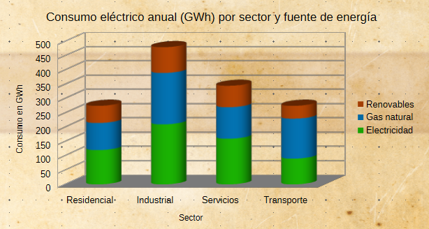
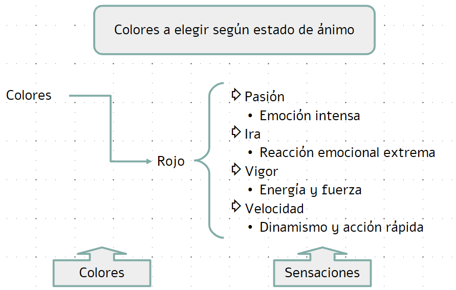
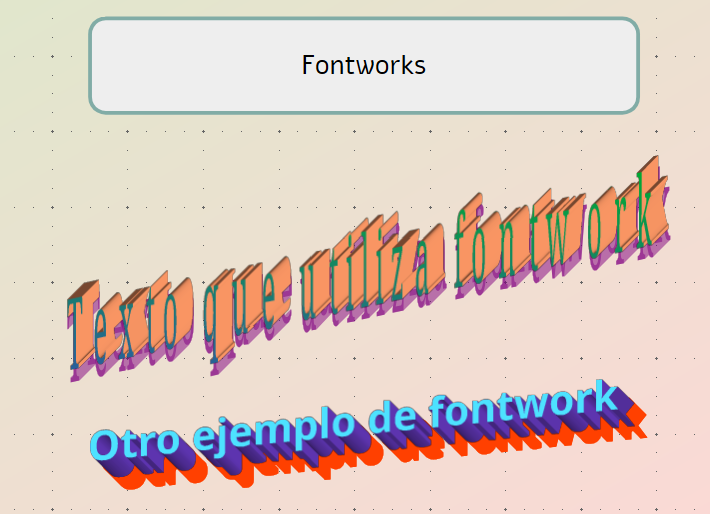
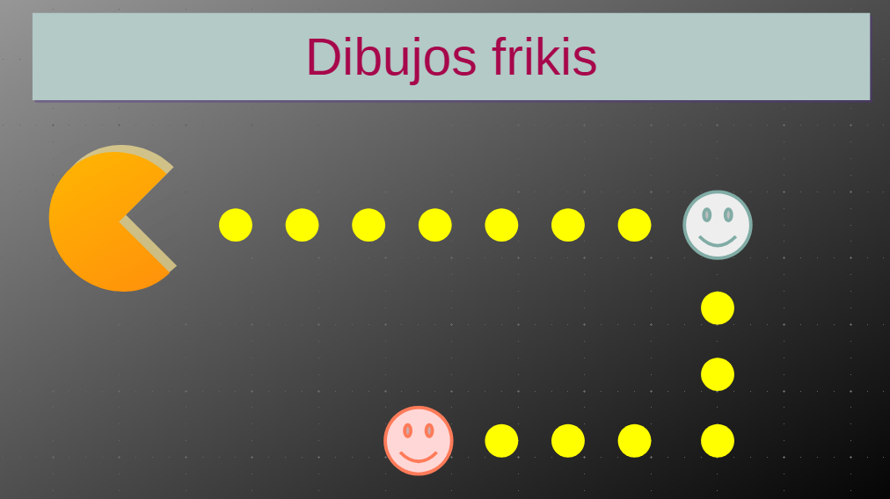
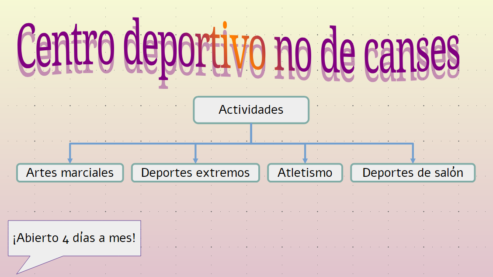
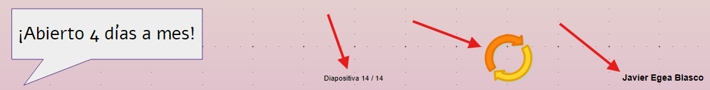
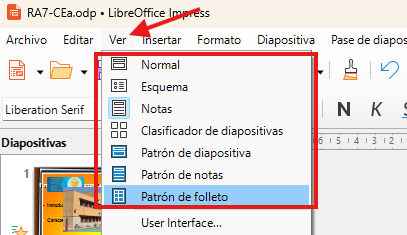
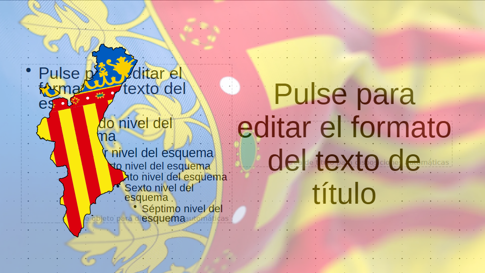
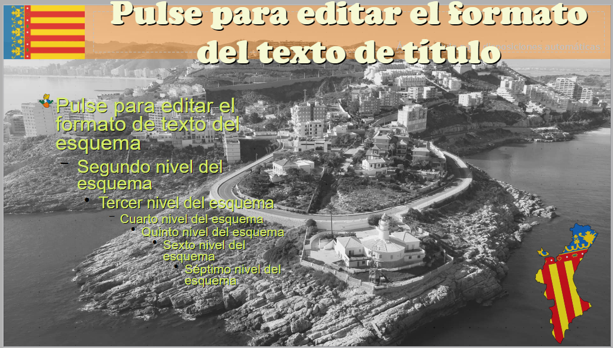

# **UD. 4 - Presentaciones con LibreOffice Impress**

{ .doscinco }
 

**Resultados de aprendizaje y criterios de evaluacion que se evaluarán en esta unidad.**  

| **Resultados de aprendizaje de la unidad didáctica:** |
|-|
| **RA7. Elabora presentaciones multimedia describiendo y aplicando normas básicas de composición y diseño.**|

|**Criterios de evaluación de la unidad didáctica:**||
    |-|-|
    |**a)** Se han identificado las opciones básicas de las aplicaciones de presentaciones.|20%|
    |**b)** Se han reconocido los distintos tipos de vista asociados a una presentación. |5%|
    |**c)** Se han aplicado y reconocido las distintas tipografías y normas básicas de composición, diseño y utilización del color. |20%|
    |**d)** Se han diseñado plantillas de presentaciones. |20%|
    |**e)** Se han creado presentaciones. |30%|
    |**f)** Se han utilizado periféricos para ejecutar presentaciones. |5%|

!!! warning "Nota:" 
    El criterio de evaluación **f) Se han utilizado periféricos para ejecutar presentaciones** será evaluado durante la FCT.

## **Presentación**
LibreOffice Impress es el componente del paquete ofimático LibreOffice que sirve para crear **presentaciones multimedia**.

Su función principal es ofrecer una herramienta completa para diseñar y organizar información visualmente atractiva, ideal para comunicarla a una audiencia.

**Usos típicos de LibreOffice Impress**  

| Función | Descripción |
| :--- | :--- |
| **Creación de Diapositivas** | Permite diseñar páginas individuales (diapositivas) utilizando plantillas, diseños predefinidos o desde cero. |
| **Integración Multimedia** | Permite insertar y manipular diversos tipos de contenido: **texto**, **imágenes**, **gráficos**, **audio**, **vídeo** y **objetos OLE** (como hojas de cálculo o gráficos de otras aplicaciones). |
| **Efectos Visuales** | Ofrece herramientas para aplicar **transiciones** entre diapositivas y **animaciones** a objetos individuales (cómo aparece un texto o una imagen dentro de una diapositiva). |
| **Estructuración del Contenido** | Herramientas de vista (Clasificador de Diapositivas, Esquema) que facilitan organizar y ordenar el flujo de la información. |
| **Presentación en Vivo** | Permite proyectar la presentación en pantalla completa pero también con una **Vista del Presentador** que muestra las notas privadas y el tiempo transcurrido en un monitor separado. |
| **Exportación a multiples formatos** | Puede guardar presentaciones en formato nativo (**.odp**), en el formato de Microsoft PowerPoint (`.pptx` o `.ppt`), y también exportar a formatos como **PDF** y **HTML** o **vídeo**. |

## **1 - Interfaz de trabajo en impress**
Después de hacer doble clic sobre el icono de **LibreOffice** seleccionamos **Nuevo &rarr; presentación** y nos encontraremos con la siguiente interfaz.

{ .m_ver }

### **1.1 - Menú: Archivo**
Permite la creación de archivos de presentaciones y su posterior guardado, firmado digital o impresión, etc.

### **1.2 - Menú: Editar**
Aparte del conocido “copiar pegar” también permite buscar, editar dispositivas...  

### **1.3 - Menú: Ver**
El menú "Ver" sirve para controlar cómo se muestra el documento en pantalla y qué elementos visuales de la interfaz deseamos ver u ocultar. 

### **1.4 - Menú: Insertar**
Ofrece opciones para incluir objetos en nuestro documento: fotografías, dibujos, tablas, ecuaciones matemáticas o incluso otros archivos.  

### **1.5 - Menú: Formato**
Es, una de las ventanas que más se utilizará ya que, permite dar formato a los elementos que incorporaremos a las diapositivas.

### **1.6 - Menú: Diapositiva**
Se puede considerar como el centro de control para administrar y estructurar una presentación, enfocándose en la creación, orden y propiedades de las diapositivas individuales.

### **1.7 - Menú: Pase de diapositivas**
Probablemente el menú más importante de LibreOffice Impress, sirve para ejecutar y configurar la presentación. Su objetivo principal es controlar cómo se ve y se comporta la presentación durante la exposición.

### **1.8 - Menú: Herramientas**
Es el menú `Herramientas` se encuentran las funciones de utilidad, la configuración avanzada, las opciones de corrección de texto y las herramientas de automatización.  

### **1.9 - Menú: Ventana**
El menú "Ventana" está pensado para gestionar las distintas ventanas o instancias del programa abiertas en ese momento.
No afecta al contenido del documento, sino a cómo se interactúa con varios documentos o vistas al mismo tiempo.

### **1.10 - Menú: Ayuda**
Reúne todas las opciones para obtener asistencia, acceder a la documentación oficial y consultar información sobre la instalación de LibreOffice.

### **Tarea RA7-CEa - Manejo básico de Impress**

!!! exercise "Tarea RA3-CEa"
    !!! Exercise "PARTE 1 - Creación de diapositivas"
        1. A través de una presentación con diapositivas se desea exponer las principales características de Impress.
        1. Abrir una nueva presentación en blanco, y desde la **barra lateral**, elegir un patrón para elaborar las siguientes diapositivas.  
        1. También podeís hacer uso de la función **disposición de diapositiva** para que el asistente proponga varias disposiciones posibles.

        !!! tip "Contenidos diapositiva 1"
        1 - Presentaciones en LibreOffice Impress  

        - Introducción  
        - Características generales de la aplicación.
        !!! tip "Contenidos diapositiva 2"
        2 - Instalación de la Aplicación  

        - Requerimientos
        - Componentes

        !!! tip "Contenidos diapositiva 3"
        3 - Diseño de Presentaciones Electrónicas

        - Diapositivas animadas.
        - Presentaciones interactivas.
        - Intervalos y transiciones.

        !!! tip "Contenidos diapositiva 4"
        4 - Ejecución de una presentación electrónica

        - Formas de ejecutar una presentación con diapositivas.  
        - Realizada por un orador (pantalla completa).
        - Examinada de forma individual (ventana).
        - Examinada en exposición (pantalla completa).

        !!! tip "Contenidos diapositiva 5"
        5 - Presentaciones automáticas

        - Intervalos automáticos o manuales.
        - Hipervínculos.

    !!! Exercise "PARTE 2 - Fondos y fuentes"
        1. Consejo → Mostrar reglas.
        1. Consejo → Mostrar retículas.
        1. Consejo → Propiedades → Formato diapositiva.
        1. Consejo → Propiedades → Disposiciones.
        1. **Tarea** → Patrones de diapositivas → **Elegir un patrón para diapositivas 1, 2 y 3**.
        1. **Tarea** → Patrones de diapositivas → **Elegir un fondo (color, degradado...) para diapositiva 4**.
        1. **Tarea** → Patrones de diapositivas → **Elegir una imagen (www.pixabay.com , ...) para el fondo de la diapositiva 5**.
        1. **Tarea** → **Ajustar posición, tamaños, colores de fuentes para cada diapositiva**.
          
    !!! Exercise "PARTE 3 - Insertar y retocar imágenes"
        1. Descargar la siguiente imagen: [Descargar archivo](./07_Presentaciones/img/imatges/ErasmusPlus.png)  
        1. Descargar la siguiente imagen: [Descargar archivo](./07_Presentaciones/img/imatges/LogoInstitut.png)  
        1. **Tarea** → **Insertar imagenes en todas las diapositivas**. Ajustar tamaño, rotación, modo de color, brillo, contraste y transparencia al gusto.
        1. **Tarea** → **Insertar imagenes en todas las diapositivas**. Ubicarlas de tal manera que no haya sensación de movimiento al pasar las diapositivas.
        1. Descargar la siguiente imagen: [Descargar archivo](./07_Presentaciones/img/imatges/institut.jpg)  
        1. **Tarea** → **Duplicar la diapositiva 2 y dejarla en la posición 3**. Insertar la imagen descargada, **aplicarle un borde y recortarla al gusto**.

    !!! Exercise "PARTE 4 - Insertar tabla"
        1. **Tarea** → **Añadir una diapositiva a la presentación**. Poner un fondo, título con los datos que se dan a continuación.  
        1. **Tarea** → **Insertar una tabla con los siguientes datos:**

            Consumo eléctrico anual (GWh) por sector y fuente de energía.  

            |   | Electricidad | Gas natural | Renovables |
            | ------------- | ------------ | ----------- | ---------- |
            | Residencial   | 120          | 95          | 60         |
            | Industrial    | 210          | 180         | 90         |
            | Servicios     | 160          | 110         | 75         |
            | Transporte    | 90           | 140         | 45         |  

    !!! Exercise "PARTE 5 - Insertar gráfico"
        1. **Tarea** → **Añadir una diapositiva a la presentación**. Poner un fondo, título con los datos que se dan a continuación.  
        1. **Tarea** → Insertar un gráfico → Columna en pilas, 3D, realista, forma: cilindro.
        1. **Tarea** → **Modificar la gráfica utilizando los datos de la tabla anterior**.  
        1. **Ejemplo de resultado:**  

        {.original}

    !!! Exercise "PARTE 6 - Insertar formas"
        1. **Tarea** → **Añadir una diapositiva a la presentación**. Poner un fondo y un título.  
        1. **Tarea** → **Insertar formas para obtener un resultado similar al de la imagen**.  

        {.sietecinco}

    !!! Exercise "PARTE 7 - Fontwork"
        1. **Tarea** → **Añadir una diapositiva a la presentación**. Poner un fondo y un título.  
        1. **Tarea** → **Insertar texto usando fontwork**. 
        1. **Ejemplo de resultado:** 

        {.sietecinco}

    !!! Exercise "PARTE 8 - Alinear objetos"
        1. **Tarea** → **Añadir una diapositiva a la presentación**. Poner un fondo y un título.  
        1. **Replicar la imagen de aquí abajo**. No se trata de calcar el ejemplo sino de prestar atención a **la alineación y la separación entre objetos**.  

        {.sietecinco}
    
    !!! Exercise "PARTE 9 - Transiciones entre diapositivas"
        1. Las transiciones son los efectos visuales que se aplican al pasar de una diapositiva a otra durante una presentación. Sirven para hacer que el cambio sea más atractivo y dinámico.
        1. **Tarea:** Ir a **Diapositiva** → **Transición entre diapositivas** y aplicar un efecto durante la transición a **todas las diapositivas del documento** (observar como también se pueden personalizar esos efectos). 

    !!! Exercise "PARTE 10 - Animaciones"
        Los efectos de animación pueden clasificarse en 4 categorias:

        - **Entrada:** cuando el elemento aparece por pantalla. Agrega un efecto que introduce el texto o el objeto en la presentación con diapositivas.
        - **Salida:** cuando el elemento desaparece de la pantalla. Agrega un efecto que saca el texto o el objeto de la diapositiva en algún momento.
        - **Énfasis:** cambio de un elemento para resaltarlo. Agrega un efecto al texto o al objeto para lograr que resalte mucho más.
        - **Rutas de movimiento:** cambio de posición de un elemento para resaltarlo. Agregar un efecto que mueve un objeto en la trama especificada.
        !!! task "Tarea"
        1. **Añadir una diapositiva a la presentación**.   
        1. Realizar un diseño **similar** al de la imagen.   
        {.sietecinco}   
        
        1. **Animar los elementos** de la diapositiva para obtener un resultado similar al siguiente ejemplo.   
        [Visualizar ejemplo.](./07_Presentaciones/img/RA7-CEa-5.mp4)  
        <!-- <video class="sietecinco" controls>
            <source src="./07_Presentaciones/img/RA7-CEa-5.mp4" type="video/mp4">
            Tu navegador no soporta la reproducción de vídeo.
        </video> -->
       
    !!! Exercise "PARTE 11 - Navegación, enlaces, cabeceras y pie de página"
        1. Añadir en todas las hojas 2 campos donde aparecerá vuestro nombre, la diapositiva actual y el recuento de diapositivas.  
        1. Añadir un botón que permitirá volver al inicio de la presentación.

        {.sietecinco}   

    !!! warning "Entrega de la tarea"
        Subir la tarea a AULES en el apartado correspondiente.  
        El archivo a subir deberá ser de tipo **.odp** (formato predeterminado de LibreOffice Impress).  
        **No se aceptará ningún otro formato de archivo**.

## **2 - Vistas de una presentación**
Saber manejar los distintos tipos de vista de una presentación es importante, ya que permiten obtener tanto una visión detallada de una diapositiva como una visión global del conjunto.
LibreOffice impress ofrece 7 tipos de vistas diferentes:

- **Vista normal**
- **Vista esquema**
- **Vista notas**
- **Vista clasificador de diapositivas**
- **Vista patrón de diapositivas** 
- **Vista patrón de notas**
- **Vista patrón de folleto**

Se puede acceder a esas vistas desde el menú **ver**.

{.cuatrocinco}   

### **2.1 - Vista normal**
La **vista normal** es la que se utiliza habitualmente. En ella se diseña y modifica la diapositiva sobre la que se está trabajando. 

---

### **2.2 - Vista esquema**
La **vista esquema** se centra en los contenidos de la diapositiva, sin tener en cuenta los aspectos visuales. Muestra un listado de las diapositivas con el esquema de sus textos.
Desde esta vista se obtiene una visión rápida de los contenidos de toda la presentación, lo que permite revisarlos y actualizarlos si resulta necesario.

---

### **2.3 - Vista notas**
En la **vista notas**, la pantalla se divide en dos partes: la parte superior, donde se visualiza la diapositiva, y la parte inferior, que contiene un cuadro de texto para añadir notas y comentarios asociados a dicha diapositiva.

---

### **2.4 - Vista clasificador de diapositivas**
La vista **clasificador de diapositivas** permite visualizar rápidamente el conjunto de todas las diapositivas y comprobar la coherencia entre ellas. Además, permite cambiar el orden de la presentación arrastrando las diapositivas con el ratón.

---

### **2.5 - Vista patrón de diapositivas**
La vista **patrón de diapositivas** permite definir el diseño general que se aplicará a todas las diapositivas de la presentación. Desde esta vista se pueden modificar elementos comunes como el fondo, las fuentes, los colores, los logotipos o la posición de los distintos objetos, asegurando así una apariencia uniforme en toda la presentación.

### **2.6 - Vista patrón de notas**
La vista **patrón de notas** permite personalizar el formato de las páginas de notas que acompañan a las diapositivas. En esta vista se pueden ajustar elementos como encabezados, pies de página, fuentes y disposición de los contenidos, de forma que las notas impresas o visualizadas mantengan un diseño coherente.

### **2.7 - Vista patrón de diapositivas**
La vista **patrón de folleto** se utiliza para configurar el diseño de los folletos que se generan al imprimir la presentación. Desde esta vista se puede establecer la distribución de las diapositivas en cada página, así como definir elementos comunes como encabezados, pies de página, numeración o textos adicionales, facilitando la creación de material impreso para los asistentes.

### **2.8 - Tarea RA7-CEb**
Creación de patrones de diapositivas.
!!! exercise "Parte 1"
    Crear una presentación en blanco y guardarla con el formato: tarea RA7-CEb nombre apellidos. 
    Descargar el archivo de imágenes pinchando en este [enlace](./07_Presentaciones/img/RA7-CEb/RA7-CEb.rar) 

!!! exercise "Parte 2"
    Ir a → **patrón de dispositivas** y crear 4 patrones de diapositivas.  
    Cambiar el nombre de los patrones a **Portada, Castellón, Valencia y Alicante**.

!!! exercise "Parte 3 - Patrón Portada"
    Editar el patrón para dejarlo como en la siguiente imagen.  
    **Trabajos a realizar:**  

    1. Insertar imagen de fondo, poner a escala de la diapositiva, pasar a escala de grises, aplicar una transparencia (para no afectar a la legibilidad del texto) y enviar al fondo.
    1. Redistribuir los esquemas de texto (no se pueden suprimir).  

    {.cuatrocinco}   

!!! exercise "Parte 4 - Patrón Valencia"
    Editar el patrón para dejarlo como en la siguiente imagen.
    **Trabajos a realizar:**

    1. Poner un rectángulo en la parte superior con el color típico de la provincia.
    1. Editar el esquema de numeración para sustituir el simbolo del bolo por la bandera de la provincia.  

    {.cuatrocinco}   
     
!!! exercise "Parte 5 - Patrón Castellón"
    Repetir los pasos de la parte 4 cambiando la imagen de fondo, la bandera de la provincia etc.

!!! exercise "Parte 6 - Patrón Alicante"
    Repetir los pasos de la parte 4 cambiando la imagen de fondo, la bandera de la provincia etc.

!!! warning "Entrega de la tarea"
    Subir la tarea a AULES en el apartado correspondiente.  
    El archivo a subir deberá ser de tipo **.odp** (formato predeterminado de LibreOffice Impress).  
    **No se aceptará ningún otro formato de archivo**.

<!-- https://iesandresbojollo.es/tiyc/impress/10-Impress_Transiciones_y_Animaciones.html
https://iesandresbojollo.es/tiyc/impress/11-Impress-Gimnasio.html
https://iesandresbojollo.es/tiyc/impress/12-Impress-Insercion_de_objetos_multimedia.html
https://iesandresbojollo.es/tiyc/impress/13-Impress-Interactividad.html
https://iesandresbojollo.es/tiyc/impress/14-Impress-Presentacion-Concesionario.html
https://iesandresbojollo.es/tiyc/impress/15-Impress-Musica_de_fondo.html
https://www.picuino.com/es/informatica-tutoimpress.html?highlight=impress -->

### **Tarea RA7-CEb -**
<!-- https://iesandresbojollo.es/tiyc/impress/9-Impress-Vistas_y_Presentacion.html -->
### **Tarea RA7-CEc -**
<!-- file:///C:/Users/titan/Documents/Javier128/Modulos/SMX/SMX_1/AO/materiales/RA7/PresentacionesAtractivas.pdf -->
### **Tarea RA7-CEd-1 -**
<!-- https://iesandresbojollo.es/tiyc/impress/14-Impress-Presentacion-Concesionario.html -->
### **Tarea RA7-CEe-1 -**
### **Tarea RA7-CEe-2 -**

<!-- https://www.youtube.com/@ricardolozano/search?query=impress -->
<!-- https://www.formadoresit.online/cursos/ofimatica/libre-office/curso-libreoffice-impress-online/#toggle-id-11-closed -->
<!-- https://www.youtube.com/watch?v=vZTPOsVzGWs -->
<!-- https://espaciotecnologico.co/plantillas-de-diapositivas-para-libreoffice-impress/ -->
<!-- https://www.youtube.com/watch?v=mHMaYtxmKaA -->
<!-- https://superalumnos.net/files/ejercicios_powerpoint.pdf -->
<!-- https://www.picuino.com/es/informatica-tutoimpress.html?highlight=impress -->
<!-- https://iesandresbojollo.es/tiyc/impress/index.html -->

    
    
<!-- 
Vista de Presentación 
UD3
    Tipos de Archivos
    Compatibilidad con otras aplicaciones
    Crear una nueva presentación
    Copias de seguridad
    Recuperación de documentos
    Establecer contraseña de protección
    Trabajar con varias presentaciones
    Ejercicios
UD4
    Insertar textos
    Símbolos y caracteres especiales
    Formato del texto
    Listas numeradas y con viñetas
    Trabajar con imágenes
    Color, contraste y brillo
    Color transparente
    La Barra de Herramientas Zoom
UD5
    Insertar una hoja de cálculo en una diapositiva
    Edición del contenido de la hoja de cálculo
    Formato de Celdas de la hoja de cálculo
    La Hoja de Cálculo como Objeto en la Diapositiva
    Insertar Tablas en Impress
    Trabajar con gráficos en una diapositiva
    Aplicación de los diferentes tipos de gráficos en LibreOffice Impress
    Tipos de objetos de dibujo (autoformas)
    Herramienta Fontwork
    Configuración de efectos 3D
    Ordenación y agrupación de objetos
    Ejercicios
UD6
    Insertar nueva diapositiva
    La Vista Clasificador de Diapositivas
    Aplicar estilos y formatos a las diapositivas
    Administrador de Extensiones de LibreOffice
    Sección Páginas Maestras
    Patrones de diapositivas
    Diseño de fondo
UD7
    Opciones de impresión de presentaciones
    Modificar y añadir textos
    Dividir el texto de una diapositiva en dos
    Añadir anotaciones a una diapositiva
    Configurar una diapositiva
    Imprimir documentos en Impress
UD8
    Visualizar una presentación
    Uso del puntero durante la presentación
    Realizar marcas sobre la diapositiva
    Configuración de transición entre diapositivas
    Insertar sonidos
    Establecer efectos de animación para los objetos
    Presentaciones interactivas
    Exportar una presentación en formato pdf
    Crear un vídeo a partir de una presentación de LibreOffice Impress -->

| **Licencia Creative Commons:** | |
| - | - |
|  | **Reconocimiento-NoComercial-CompartirIgual CC BY-NC-SA:**  No se permite un uso comercial de la obra original ni de las posibles obras derivadas, la distribución de la cuales se debe hace con una licencia igual a la que regula la obra original. | 