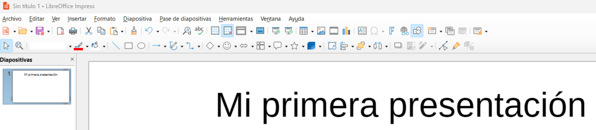

# **UD. 4 - Presentaciones con LibreOffice Impress**

{ .doscinco }
 

**Resultados de aprendizaje y criterios de evaluacion que se evaluarán en esta unidad.**  

| **Resultados de aprendizaje de la unidad didáctica:** |
|-|
| **RA7. Elabora presentaciones multimedia describiendo y aplicando normas básicas de composición y diseño.**|

|**Criterios de evaluación de la unidad didáctica:**||
    |-|-|
    |**a)** Se han identificado las opciones básicas de las aplicaciones de presentaciones.|15%|
    |**b)** Se han reconocido los distintos tipos de vista asociados a una presentación. |10%|
    |**c)** Se han aplicado y reconocido las distintas tipografías y normas básicas de composición, diseño y utilización del color. |20%|
    |**d)** Se han diseñado plantillas de presentaciones. |20%|
    |**e)** Se han creado presentaciones. |30%|
    |**f)** Se han utilizado periféricos para ejecutar presentaciones. |5%|

!!! warning "Nota:" 
    El criterio de evaluación **f) Se han utilizado periféricos para ejecutar presentaciones** será evaluado durante la FCT.

## **Presentación**
LibreOffice Impress es el componente del paquete ofimático LibreOffice que sirve para crear **presentaciones multimedia**.

Su función principal es ofrecer una herramienta completa para diseñar y organizar información visualmente atractiva, ideal para comunicarla a una audiencia.

**Usos típicos de LibreOffice Impress**  

| Función | Descripción |
| :--- | :--- |
| **Creación de Diapositivas** | Permite diseñar páginas individuales (diapositivas) utilizando plantillas, diseños predefinidos o desde cero. |
| **Integración Multimedia** | Permite insertar y manipular diversos tipos de contenido: **texto**, **imágenes**, **gráficos**, **audio**, **vídeo** y **objetos OLE** (como hojas de cálculo o gráficos de otras aplicaciones). |
| **Efectos Visuales** | Ofrece herramientas para aplicar **transiciones** entre diapositivas y **animaciones** a objetos individuales (cómo aparece un texto o una imagen dentro de una diapositiva). |
| **Estructuración del Contenido** | Herramientas de vista (Clasificador de Diapositivas, Esquema) que facilitan organizar y ordenar el flujo de la información. |
| **Presentación en Vivo** | Permite proyectar la presentación en pantalla completa pero también con una **Vista del Presentador** que muestra las notas privadas y el tiempo transcurrido en un monitor separado. |
| **Exportación a multiples formatos** | Puede guardar presentaciones en formato nativo (**.odp**), en el formato de Microsoft PowerPoint (`.pptx` o `.ppt`), y también exportar a formatos como **PDF** y **HTML** o **vídeo**. |

## **1 - Interfaz de trabajo en impress**
Después de hacer doble clic sobre el icono de **LibreOffice** seleccionamos **Nuevo &rarr; presentación** y nos encontraremos con la siguiente interfaz.

{ .m_ver }

### **1.1 - Menú: Archivo**
Permite la creación de archivos de presentaciones y su posterior guardado, firmado digital o impresión, etc.

### **1.2 - Menú: Editar**
Aparte del conocido “copiar pegar” también permite buscar, editar dispositivas...  

### **1.3 - Menú: Ver**
El menú "Ver" sirve para controlar cómo se muestra el documento en pantalla y qué elementos visuales de la interfaz deseamos ver u ocultar. 

### **1.4 - Menú: Insertar**
Ofrece opciones para incluir objetos en nuestro documento: fotografías, dibujos, tablas, ecuaciones matemáticas o incluso otros archivos.  

### **1.5 - Menú: Formato**
Es, una de las ventanas que más se utilizará ya que, permite dar formato a los elementos que incorporaremos a las diapositivas.

### **1.6 - Menú: Diapositiva**
Se puede considerar como el centro de control para administrar y estructurar una presentación, enfocándose en la creación, orden y propiedades de las diapositivas individuales.

### **1.7 - Menú: Pase de diapositivas**
Probablemente el menú más importante de LibreOffice Impress, sirve para ejecutar y configurar la presentación. Su objetivo principal es controlar cómo se ve y se comporta la presentación durante la exposición.

### **1.8 - Menú: Herramientas**
Es el menú `Herramientas` se encuentran las funciones de utilidad, la configuración avanzada, las opciones de corrección de texto y las herramientas de automatización.  

### **1.9 - Menú: Ventana**
El menú "Ventana" está pensado para gestionar las distintas ventanas o instancias del programa abiertas en ese momento.
No afecta al contenido del documento, sino a cómo se interactúa con varios documentos o vistas al mismo tiempo.

### **1.10 - Menú: Ayuda**
Reúne todas las opciones para obtener asistencia, acceder a la documentación oficial y consultar información sobre la instalación de LibreOffice.

### **Tarea RA7-CEa - Manejo básico de Impress**

!!! exercise "Tarea RA3-CEa"
    !!! Exercise "PARTE 1"
        1. A través de una presentación con diapositivas se desea exponer las principales características de Impress.
        1. Abrir una nueva presentación en blanco, y desde la **barra lateral**, elegir un patrón para elaborar las siguientes diapositivas.  
        1. También podeís hacer uso de la función **disposición de diapositiva** para que el asistente proponga varias disposiciones posibles.

        !!! tip "Contenidos diapositiva 1"
        1 - Presentaciones en LibreOffice Impress  

        - Introducción  
        - Características generales de la aplicación.
        !!! tip "Contenidos diapositiva 2"
        2 - Instalación de la Aplicación  

        - Requerimientos
        - Componentes

        !!! tip "Contenidos diapositiva 3"
        3 - Diseño de Presentaciones Electrónicas

        - Diapositivas animadas.
        - Presentaciones interactivas.
        - Intervalos y transiciones.

        !!! tip "Contenidos diapositiva 4"
        4 - Ejecución de una presentación electrónica

        - Formas de ejecutar una presentación con diapositivas.  
        - Realizada por un orador (pantalla completa).
        - Examinada de forma individual (ventana).
        - Examinada en exposición (pantalla completa).

        !!! tip "Contenidos diapositiva 5"
        5 - Presentaciones automáticas

        - Intervalos automáticos o manuales.
        - Hipervínculos.

   

    

### **Tarea RA7-CEb -**
### **Tarea RA7-CEc -**
### **Tarea RA7-CEd-1 -**
### **Tarea RA7-CEe-1 -**
### **Tarea RA7-CEe-2 -**

<!-- https://www.youtube.com/@ricardolozano/search?query=impress -->
<!-- https://www.formadoresit.online/cursos/ofimatica/libre-office/curso-libreoffice-impress-online/#toggle-id-11-closed -->
<!-- https://www.youtube.com/watch?v=vZTPOsVzGWs -->
<!-- https://espaciotecnologico.co/plantillas-de-diapositivas-para-libreoffice-impress/ -->
<!-- https://www.youtube.com/watch?v=mHMaYtxmKaA -->
<!-- https://superalumnos.net/files/ejercicios_powerpoint.pdf -->

    
    
<!-- 
Vista de Presentación 
UD3
    Tipos de Archivos
    Compatibilidad con otras aplicaciones
    Crear una nueva presentación
    Copias de seguridad
    Recuperación de documentos
    Establecer contraseña de protección
    Trabajar con varias presentaciones
    Ejercicios
UD4
    Insertar textos
    Símbolos y caracteres especiales
    Formato del texto
    Listas numeradas y con viñetas
    Trabajar con imágenes
    Color, contraste y brillo
    Color transparente
    La Barra de Herramientas Zoom
UD5
    Insertar una hoja de cálculo en una diapositiva
    Edición del contenido de la hoja de cálculo
    Formato de Celdas de la hoja de cálculo
    La Hoja de Cálculo como Objeto en la Diapositiva
    Insertar Tablas en Impress
    Trabajar con gráficos en una diapositiva
    Aplicación de los diferentes tipos de gráficos en LibreOffice Impress
    Tipos de objetos de dibujo (autoformas)
    Herramienta Fontwork
    Configuración de efectos 3D
    Ordenación y agrupación de objetos
    Ejercicios
UD6
    Insertar nueva diapositiva
    La Vista Clasificador de Diapositivas
    Aplicar estilos y formatos a las diapositivas
    Administrador de Extensiones de LibreOffice
    Sección Páginas Maestras
    Patrones de diapositivas
    Diseño de fondo
UD7
    Opciones de impresión de presentaciones
    Modificar y añadir textos
    Dividir el texto de una diapositiva en dos
    Añadir anotaciones a una diapositiva
    Configurar una diapositiva
    Imprimir documentos en Impress
UD8
    Visualizar una presentación
    Uso del puntero durante la presentación
    Realizar marcas sobre la diapositiva
    Configuración de transición entre diapositivas
    Insertar sonidos
    Establecer efectos de animación para los objetos
    Presentaciones interactivas
    Exportar una presentación en formato pdf
    Crear un vídeo a partir de una presentación de LibreOffice Impress -->

| **Licencia Creative Commons:** | |
| - | - |
|  | **Reconocimiento-NoComercial-CompartirIgual CC BY-NC-SA:**  No se permite un uso comercial de la obra original ni de las posibles obras derivadas, la distribución de la cuales se debe hace con una licencia igual a la que regula la obra original. | 