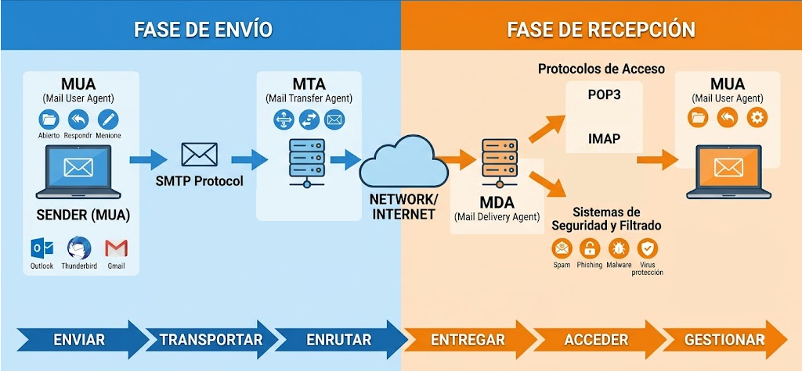
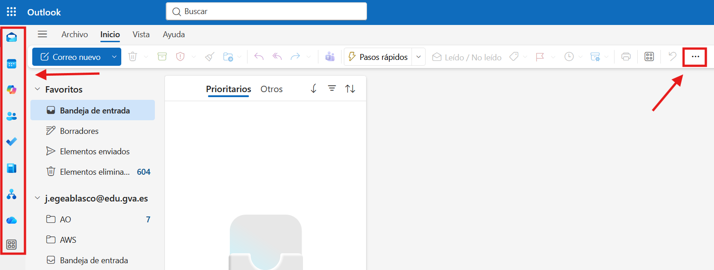

{ .sietecinco .marginbottom40 }

**Resultados de aprendizaje y criterios de evaluacion que se evaluarán en esta unidad.**  

| **Resultados de aprendizaje de la unidad didáctica:** |
| :--- |
| **RA8. Realiza operaciones de gestión del correo y la agenda electrónica, relacionando necesidades de uso con su configuración.** |

|**Criterios de evaluación de la unidad didáctica:**||
|-|-|
|**a)** Se han descrito los elementos que componen un correo electrónico.|5%|
|**b)** Se han analizado las necesidades básicas de gestión de correo y agenda electrónica.|20%|
|**c)** Se han configurado distintos tipos de cuentas de correo electrónico.|20%|
|**d)** Se han conectado y sincronizado agendas del equipo informático con dispositivos móviles.|15%|
|**e)** `Se ha operado con la libreta de direcciones.`|5%|
|**f)** Se ha trabajado con todas las opciones de gestión de correo electrónico (etiquetas, filtros, carpetas, entre otros).|30%|
|**g)** `Se han utilizado opciones de agenda electrónica.`|5%|

!!! warning "Nota:"
    El criterio de evaluación **e)** `Se ha operado con la libreta de direcciones.` y **g)** `Se han utilizado opciones de agenda electrónica.` serán evaluados durante la FCT.

## 1 - Introducción

En esta unidad didáctica se van a tratar los aspectos relacionados con la gestión del correo electrónico y la agenda electrónica. Se analizarán las necesidades básicas de gestión de correo y agenda electrónica, se configurarán distintos tipos de cuentas de correo electrónico, se conectarán y sincronizarán agendas del equipo informático con dispositivos móviles, se operará con la libreta de direcciones, se trabajará con todas las opciones de gestión de correo electrónico (etiquetas, filtros, carpetas, entre otros) y se utilizarán opciones de agenda electrónica.

## 2 - El correo electrónico

El correo electrónico es uno de los sistemas de comunicación más utilizado en el ámbito profesional y personal. Permite enviar y recibir mensajes de texto, archivos adjuntos, imágenes, entre otros. Para utilizar el correo electrónico es necesario configurar una cuenta de correo electrónico en un cliente de correo electrónico o en un servicio de correo electrónico en línea.

Existen otros sistemas de comunicación instantánea como el chat, las videollamadas, entre otros, pero el correo electrónico sigue siendo una herramienta fundamental para la comunicación en el ámbito profesional y personal.

### 2.1 - Funcionamiento del correo electrónico

El correo electrónico funciona a través de un sistema de servidores de correo electrónico que se encargan de enviar y recibir los mensajes de correo electrónico. Cuando un usuario envía un mensaje de correo electrónico, el mensaje se envía al servidor de correo electrónico del remitente, que luego lo envía al servidor de correo electrónico del destinatario. El servidor de correo electrónico del destinatario recibe el mensaje y lo almacena en la bandeja de entrada del destinatario, donde el destinatario puede acceder a él.

## 2.2 - Sistemas involucrados en el correo electrónico

El funcionamiento del correo electrónico involucra varios sistemas y protocolos que intervienen en las fases de envío y recepción de mensajes.

{ .marginbottom40 }
**Fase de envío:**  

- **Mail User Agent (MUA):**  
Es la aplicación utilizada por el usuario para redactar, enviar y recibir correos electrónicos. Ejemplos de MUA son Microsoft Outlook, Mozilla Thunderbird o Gmail.
- **SMTP (Simple Mail Transfer Protocol):**  
Es el protocolo utilizado para enviar mensajes de correo electrónico desde el cliente de correo al servidor de correo y entre servidores de correo.
- **Mail Transfer Agent (MTA):**
Es el sistema encargado de transferir los correos electrónicos entre servidores hasta llegar al servidor del destinatario. Se ocupa del enrutamiento y retransmisión del mensaje.

**Fase de recepción:**

- **Mail Delivery Agent (MDA):**
Es el sistema encargado de depositar el mensaje recibido en el buzón o bandeja de entrada del destinatario.
- **POP3 (Post Office Protocol v3) e IMAP (Internet Message Access Protocol):**  
Son protocolos utilizados por los clientes de correo para acceder a los mensajes almacenados en el servidor.
    - **POP3** descarga normalmente los mensajes al dispositivo del usuario.
    - **IMAP** permite gestionar los mensajes directamente en el servidor, manteniendo la sincronización entre dispositivos.
- **Sistemas de seguridad y filtrado:**
Son mecanismos encargados de proteger el correo electrónico frente a amenazas como spam, phishing, malware o virus.
- **Mail User Agent (MUA):**  
Una vez recibido, el receptor podrá abrir, responder y gestionar ese correo electrónico.

## 3 - Microsoft Outlook

Microsoft Outlook es un cliente de correo electrónico desarrollado por Microsoft que forma parte del paquete de aplicaciones de Microsoft Office.
Permite gestionar el correo electrónico, la agenda, los contactos y las tareas de manera eficiente.

### 3.1 - Configuración de una cuenta de correo electrónico en Microsoft Outlook

Para configurar una cuenta de correo electrónico en Microsoft Outlook, se deben seguir los siguientes pasos:

1. Abrir Microsoft Outlook.
2. Hacer clic en "Archivo" y luego en "Agregar cuenta".
3. Ingresar la dirección de correo electrónico y hacer clic en "Conectar".
4. Ingresar la contraseña de la cuenta de correo electrónico y hacer clic en "Conectar".
5. Microsoft Outlook intentará configurar automáticamente la cuenta de correo electrónico. Si no lo logra, se pueden ingresar manualmente los parámetros del servidor de correo electrónico (SMTP, IMAP o POP3) proporcionados por el proveedor de correo electrónico.

### 3.2 - Primer contacto con Microsoft Outlook

{ .marginbottom40 }

En la parte de la izquierda se encuentra el panel de navegación, donde se pueden acceder a las diferentes secciones de Microsoft Outlook, como el correo electrónico, la agenda, los contactos y las tareas. En la parte central se encuentra la bandeja de entrada, donde se muestran los correos electrónicos recibidos. En la parte derecha se encuentra el panel de lectura, donde se puede leer el contenido del correo electrónico seleccionado.

Como la mayoría de aplicaciones, Outlook también se puede personalizar para adaptarse a las necesidades del usuario, como cambiar el diseño, configurar notificaciones, entre otros.
El menú de personalización se encuentra clicando en los 3 puntos y buscando la opción personalizar, donde se pueden configurar diferentes aspectos de la aplicación.

### 3.3 - Tarea - RA8-CEac - Gestión del correo electrónico

!!! task "Configurar una firma profesional"
    - Configurar una firma profesional que se añadirá automáticamente a cualquier correo que redactéis.
    !!! tip "Ejemplo de autofirma"

        Avís Legal / Aviso Legal:  

        Aquesta comunicació i el seu contingut, incloses les dades personals, són confidencials, i per a ús exclusiu del/s destinatari/s al/s que es dirigeix. Si el receptor no és el destinatari legítim, l’informem que està totalment prohibida per llei, qualsevol utilització, divulgació, distribució i/o reproducció d’aquesta comunicació sense autorització expressa de l’emissor, qualsevol que fora la seua finalitat. Si ha rebut aquest missatge per error, li preguem que ens ho notifique immediatament per aquesta mateixa via i procedisca a la seua eliminació.  

        En interés del compliment del Reglament (UE) 2016/679 del Parlament Europeu i del Consell, de 27 d’abril de 2016 relatiu a la protecció de les persones físiques pel que fa al tractament de dades personals i a la lliure circulació d’aquestes dades i de la Llei orgànica 3/2018, de 5 de desembre, de Protecció de Dades Personals i garantia dels drets digitals (LOPD-GDD), pot exercir els drets d’accés, rectificació, cancel·lació, limitació, oposició i portabilitat mitjançant correu electrònic dirigit a: correu@edu.gva.es.  

        Esta comunicación y su contenido, incluidos los datos personales, son confidenciales, y para uso exclusivo del/de los destinatario/s al/a los que se dirige. Si el receptor no es el destinatario legítimo, le informamos que está totalmente prohibida por ley, cualquier utilización, divulgación, distribución y/o reproducción de esta comunicación sin autorización expresa del emisor, cualquiera que fuera su finalidad. Si ha recibido este mensaje por error, le rogamos que nos lo notifique inmediatamente por esta misma vía y proceda a su eliminación.  
        
        En interés del cumplimiento del Reglamento (UE) 2016/679 del Parlamento Europeo y del Consejo, de 27 de abril de 2016 relativo a la protección de las personas físicas en cuanto al tratamiento de datos personales y a la libre circulación de estos datos y de la Ley Orgánica 3/2018, de 5 de diciembre, de Protección de Datos Personales y garantía de los derechos digitales (LOPD-GDD), puede ejercer los derechos de acceso, rectificación, cancelación, limitación, oposición y portabilidad mediante correo electrónico dirigido a: correu@edu.gva.es.

!!! task "Creación de grupos de distribución"
    - Crear un grupo con el resto de alumnos de la clase **INCLUYENDO** el professor.

!!! task "Creación de grupos (lista de contactos)"
    - Activar el reenvío automático de correo a otra dirección.
    - Activar respuestas automáticas.
    - Enviar el correo a j.egeablasco@edu.gva.es

!!! task "Enviar un correo al grupo"
    - El correo deberá llevar la etiqueta de importante.
    - El correo deberá enviarse a una hora fija.
    - El correo deberá incorporar la confirmación de lectura.

### 3.4 - Tarea - RA8-CEbf - Gestión de correos y agenda electrónica

!!! task "Crear carpetas"
    - Crear al menos 3 carpetas para organizar los mensajes (por ejemplo, equipo 1, 2 y 3).
    - Crear y aplica filtros o reglas de entrada para que los correos se clasifiquen automáticamente.
    - Crear un evento en la agenda de outlook. Invitar a ese evento el resto de alumnos. El evento será una reunión de Teams.
    - Crear un recordatorio en outlook.

### 3.5 - Tarea - RA8-CEd - Sincronización de la agenda con dispositivos móviles

!!! task "Sincronizar agenda"
    - Buscar información sobre como sincronizar la agenda de Outlook con la agenda de vuestro dispositivo móvil.
    - Una vez hecha la sincronización, mostrar el resultado al profesor.

| **Licencia Creative Commons:** | |
| - | - |
|  | **Reconocimiento-NoComercial-CompartirIgual CC BY-NC-SA:**  No se permite un uso comercial de la obra original ni de las posibles obras derivadas, la distribución de la cuales se debe hace con una licencia igual a la que regula la obra original. |
