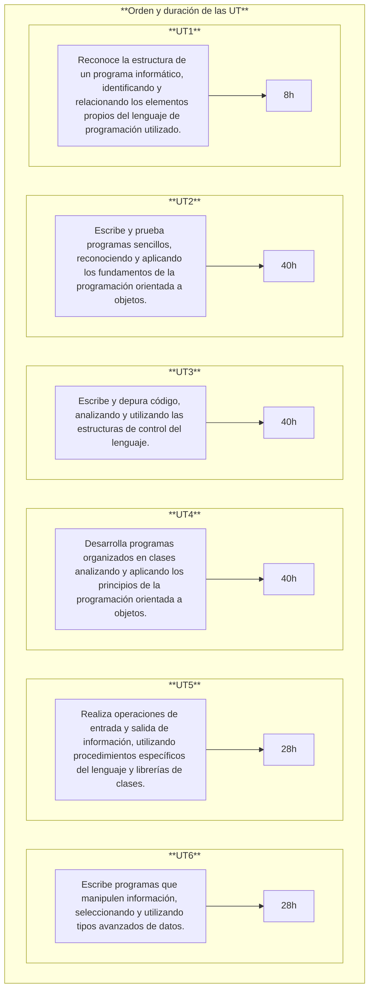

# **INTRODUCCIÓN A LA PROGRAMACIÓN**
{ .img1 }
 

## **1. - Calendario escolar**

<!-- Aclarar horas de practicas
Aclarar fechas de las practicas -->

## **2. - Horario de sesiones**

## **3. - Contenidos del módulo**
A continuación, se presentan los contenidos de este módulo tal y como aparecen en el <a href=https://ceice.gva.es/documents/388109149/391641510/ANEXOS_Optativas_Propuesta_Decreto_Curris_LFP_GMGS.pdf>**Anexo X: Módulos optativos**</a>, seguiendo las <a href=https://ceice.gva.es/documents/388109149/392955746/Instrucciones_optativas_FP_definitivas_firmado_.pdf>**Instrucciones de la dirección de formación profesional**</a> sobre la oferta de módulos optativos para el curso 2025-2026.

### **3.1. - Identificación de los elementos de un programa informático:**  
- Estructura y bloques fundamentales.  
- Variables.  
- Tipos de datos. 
- Literales. 
- Constantes. 
- Operadores y expresiones. 
- Conversiones de tipo. 
- Comentarios.

### **3.2. - Utilización de objetos:**
- Características de los objetos. 
- Instanciación de objetos. 
- Utilización de métodos. 
- Parámetros.
- Utilización de propiedades. 
- Utilización de métodos estáticos. 
- Constructores. 
- Destrucción de objetos y liberación de memoria.

### **3.3 - Uso de estructuras de control:**
- Estructuras de selección. 
- Estructuras de repetición. 
- Estructuras de salto. 
- Control de excepciones. 
- Aserciones. 
- Prueba, depuración y documentación de la aplicación.

### **3.4 - Desarrollo de clases:**
- Concepto de clase. 
- Estructura y miembros de una clase. 
- Visibilidad. 
- Creación de propiedades. 
- Creación de métodos. 
- Creación de constructores. 
- Utilización de clases y objetos. 
- Utilización de clases heredadas.

### **3.5 - Lectura y escritura de información:**
- Flujos. 
- Tipos: bytes y caracteres. 
- Clases relacionadas. 
- Ficheros de datos. 
- Registros.
- Apertura y cierre de ficheros. 
- Modos de acceso. 
- Escritura y lectura de información en ficheros. 
- Utilización de los sistemas de ficheros. 
- Creación y eliminación de ficheros y directorios. 
- Entrada desde teclado. 
- Salida a pantalla. 
- Formatos de visualización. 
- Interfaces gráficas. 
- Concepto de evento. 
- Creación de controladores de eventos.

### **3.6 - Aplicación de las estructuras de almacenamiento:**
- Estructuras estáticas y dinámicas. 
- Creación de matrices (arrays). 
- Matrices (arrays) multidimensionales. 
- Genericidad. Cadenas de caracteres. 
- Expresiones regulares.
- Colecciones: Listas, Conjuntos y Diccionarios. 
- Operaciones agregadas: filtrado, reducción y recolección.

## **4. - Metodología de aprendizaje**
1. Introducción de los **aspectos teóricos** para que después **sean aplicados mediante prácticas y ejercicios**.  

1. Prácticas **individuales y/o colectivas**. 

1. **Realización de trabajos obligatorios**. Algunos trabajos podrán ser realizados en grupo. 

1. Realización de **actividades voluntarias** de investigación y ampliación para **profundizar en los conocimientos adquiridos**.  

1. Método de aprendizaje **PBL (Problem Based Learning)**, aprendizaje basado en problemas. Se plantea un problema real, y los alumnos elaborarán una solución. 

1. Proyección de vídeos. 

## **5. - Evaluación** 
### **5.1. - Tipos de evaluación**
1. Las evaluaciones serán **por resultados de aprendizaje RA y criterios de evaluación CE**. <a href=https://www.boe.es/boe/dias/2023/07/22/pdfs/BOE-A-2023-16889.pdf>R.D. 659/2023</a>. 

1. En cada unidad de trabajo **UT** se evaluarán los **CE** correspondientes al **RA**.

### **5.2. - Metodología de evaluación**
1. La evaluación será **contínua**.   
2. Se basará en la comprobación de la superación de los **resultados de aprendizaje RA**.
3. La evaluación se hará sobre **todos los RA y todos los CE** del currículo.

### **5.3. - Instrumentos de evaluación**
1. Exámenes.  
    - Preguntas tipo test.
    - Examen escrito (ejercicios).          
2. Entrega de tareas.  
3. Exposiciones orales.  
4. Prácticas en empresa.

### **5.4. - Evaluación por resultados de aprendizaje**
Cada resultado de aprendizaje **RA** se evalúa a través de varios criterios de evaluación **CE**.

Los **CE** actúan como “desglose” del **RA**, facilitando medir de forma objetiva si el aprendizaje se ha alcanzado.

La calificación del módulo se obtiene valorando la evidencia del logro de los RA según estos CE.

## **6. - Criterio de superación del módulo**
### **6.1. - Nota final**
La nota final será la suma ponderada de **los resultados de aprendizaje** obtenidos en cada evaluación.  

La superación del módulo requerirá obtener una media mínima de **5 sobre 10 en cada resultado de aprendizaje**. 

En caso de no superar el módulo, el alumna/o dispondrá de un proceso de recuperación orientado a reforzar específicamente los resultados de aprendizaje no alcanzados.

|Resultado de aprendizaje|Porcentage|
|-|-|
|**RA1.** Reconoce la estructura de un programa informático, identificando y relacionando los elementos propios del lenguaje de programación utilizado.|5%|
|**RA2.** Escribe y prueba programas sencillos, reconociendo y aplicando los fundamentos de la programación orientada a objetos.|19%|
|**RA3.** Escribe y depura código, analizando y utilizando las estructuras de control del lenguaje.|18%|
|**RA4.** Desarrolla programas organizados en clases analizando y aplicando los principios de la programación orientada a objetos.|18%|
|**RA5.** Realiza operaciones de entrada y salida de información, utilizando procedimientos específicos del lenguaje y librerías de clases.|10%|
|**RA6.** Escribe programas que manipulen información, seleccionando y utilizando tipos avanzados de datos.|5%|

### **6.2. - Instrumentos de recuperación**
- **Recuperaciones** que permitirán recuperar los **criterios de evaluación** no superados.
- Si el alumno **no entrega los trabajos obligatorios o presenta tasas de absentismo elevadas**, perderá la evaluación continua y deberá presentarse a la evaluación ordinaria y/o extraordinaria.  

### **6.3. - Calendario de evaluaciones**
- Evaluación inicial (primer mes).
- **Una evaluación parcial por cada trimestre**. Para tener el aprobado será necesario haber alcanzado una puntuación superior o igual a 5 en los **Resultados de Aprendizaje RA** completados.
- **Evaluación ordinaria** permitirá recuperar los **RA no superados**.
- **Evaluacion extraordinaria** solo para los alumnos/as que no hayan superado el módulo en las evaluaciones parciales u ordinaria. Para esta evaluación se realizarán varias pruebas teórico-prácticas que evaluarán la totalidad del módulo. 

## **7. - Resultados de aprendizaje y criterios de evaluación del módulo**  
Los resultados de aprendizaje y criterios de evaluación asociados al módulo **Introducción a la programación** constituyen los logros que los alumnos/as tienen que alcanzar para **superar el módulo**.

### **7.1. - Relación entre Criterios de Evaluación y Resultados de Aprendizaje**
**Los criterios de evaluación** asociados a los **resultados de aprendizaje** son los siguientes

=== "RA 1"
    |RA1. Reconoce la estructura de un programa informático, identificando y relacionando los elementos propios del lenguaje de programación utilizado.||
    |-|-|
    |**a)** Se han identificado los bloques que componen la estructura de un programa informático. |15%|
    |**b)** Se han respetado las especificaciones técnicas del proceso de instalación. |15%|
    |**c)** Se han utilizado entornos integrados de desarrollo. |15%|
    |**d)** Se han identificado los distintos tipos de variables y la utilidad específica de cada uno. |5%|
    |**e)** Se ha modificado el código de un programa para crear y utilizar variables. |10%|
    |**f)** Se han creado y utilizado constantes y literales. |15%|
    |**g)** Se han clasificado, reconocido y utilizado en expresiones los operadores del lenguaje. |10%|
    |**h)** Se ha comprobado el funcionamiento de las conversiones de tipo explícitas e implícitas. |10%|
    |**i)** Se han introducido comentarios en el código. |5%|

=== "RA 2"
    |RA2. Escribe y prueba programas sencillos, reconociendo y aplicando los fundamentos de la programación orientada a objetos.||
    |-|-|
    |**a)** Se han identificado los fundamentos de la programación orientada a objetos. |15%|
    |**b)** Se han escrito programas simples.|25%|
    |**c)** Se han instanciado objetos a partir de clases predefinidas.|10%|
    |**d)** Se han utilizado métodos y propiedades de los objetos.|15%|
    |**e)** Se han escrito llamadas a métodos estáticos.|15%|
    |**f)** Se han utilizado parámetros en la llamada a métodos.|10%|
    |**g)** Se han incorporado y utilizado librerías de objetos.|10%|
    |**h)** Se han utilizado constructores.|10%|
    |**i)** Se ha utilizado el entorno integrado de desarrollo en la creación y compilación de programas simples.|10%|

=== "RA 3"
    |RA3. Escribe y depura código, analizando y utilizando las estructuras de control del lenguaje.||
    |-|-|
    |**a)** Se ha escrito y probado código que haga uso de estructuras de selección.|10%|
    |**b)** Se han utilizado estructuras de repetición.|15%|
    |**c)** Se han reconocido las posibilidades de las sentencias de salto.|10%|
    |**d)** Se ha escrito código utilizando control de excepciones.|15%|
    |**e)** Se han creado programas ejecutables utilizando diferentes estructuras de control.|10%|
    |**f)** Se han probado y depurado los programas.|10%|
    |**g)** Se ha comentado y documentado el código.|10%|
    |**h)** Se han creado excepciones.|10%|
    |**i)** Se han utilizado aserciones para la detección y corrección de errores durante la fase de desarrollo.|10%|

=== "RA 4"
    |RA4. Desarrolla programas organizados en clases analizando y aplicando los principios de la programación orientada a objetos.||
    |-|-|
    |**a)** Se ha reconocido la sintaxis, estructura y componentes típicos de una clase.|10%|
    |**b)** Se han definido clases.|15%|
    |**c)** Se han definido propiedades y métodos.|10%|
    |**d)** Se han creado constructores.|15%|
    |**e)** Se han desarrollado programas que instancien y utilicen objetos de las clases creadas anteriormente.|15%|
    |**f)** Se han utilizado mecanismos para controlar la visibilidad de las clases y de sus miembros.|15%|
    |**g)** Se han definido y utilizado clases heredadas.|15%|
    |**h)** Se han creado y utilizado métodos estáticos.|10%|
    |**i)** Se han creado y utilizado conjuntos y librerías de clases.|10%|

=== "RA 5"
    |RA5. Realiza operaciones de entrada y salida de información, utilizando procedimientos específicos del lenguaje y librerías de clases.||
    |-|-|
    |**a)** Se ha utilizado la consola para realizar operaciones de entrada y salida de información.|22,5%|
    |**b)** Se han aplicado formatos en la visualización de la información.|22,5%|
    |**c)** Se han reconocido las posibilidades de entrada / salida del lenguaje y las librerías asociadas.|22,5%|
    |**d)** Se han utilizado ficheros para almacenar y recuperar información.|22,5%|
    |**e)** Se han creado programas que utilicen diversos métodos de acceso al contenido de los ficheros.|10%|
    |**f)** Se han utilizado las herramientas del entorno de desarrollo para crear interfaces gráficos de usuario simples.|10%|
    |**g)** Se han programado controladores de eventos.|10%|
    |**h)** Se han escrito programas que utilicen interfaces gráficos para la entrada y salida de información.|10%|

=== "RA 6"
    |RA6. Escribe programas que manipulen información, seleccionando y utilizando tipos avanzados de datos.||
    |-|-|
    |**a)** Se han escrito programas que utilicen matrices (arrays).|20%|
    |**b)** Se han reconocido las librerías de clases relacionadas con tipos de datos avanzados.|20%|
    |**c)** Se han utilizado listas para almacenar y procesar información.|20%|
    |**d)** Se han utilizado iteradores para recorrer los elementos de las listas.|20%|
    |**e)** Se han reconocido las características y ventajas de cada una de las colecciones de datos disponibles.|20%|
    |**f)** Se han creado clases y métodos genéricos.|20%|
    |**g)** Se han utilizado expresiones regulares en la búsqueda de patrones en cadenas de texto.|20%|
    |**h)** Se han identificado las clases relacionadas con el tratamiento de documentos escritos en diferentes lenguajes de intercambio de datos.|20%|
    |**i)** Se han realizado programas que realicen manipulaciones sobre documentos escritos en diferentes lenguajes de intercambio de datos.|20%|
    |**j)** Se han utilizado operaciones agregadas para el manejo de información almacenada en colecciones.|20%|

### **7.2. - Responsable evaluación de los resultados de aprendizaje y/o resultados de aprendizaje**

=== "RA 1"
    Tutor prácticas (Empresa). 

=== "RA 2"
    Profesor módulo (Instituto).

=== "RA 3"
    Profesor módulo (Instituto).

=== "RA 4"
    Profesor módulo (Instituto).
    
=== "RA 5"
    Profesor módulo (Instituto).

=== "RA 6"
    Profesor módulo (Instituto).

## **8. - Secuenciación y duración de cada Unidad de Trabajo**
Por motivos de simplicidad **se asocia un RA a cada Unidad de Trabajo (UT)**.  

   
 

| **Licencia Creative Commons:** | |
| - | - |
|  { .by-nc-nd-eu_ } | **Reconocimiento-NoComercial-CompartirIgual CC BY-NC-SA:**  No se permite un uso comercial de la obra original ni de las posibles obras derivadas, la distribución de la cuales se debe hace con una licencia igual a la que regula la obra original. | 