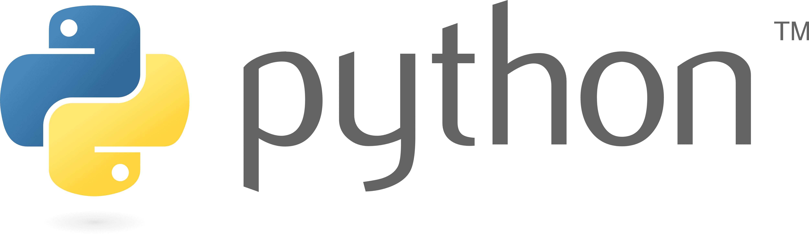
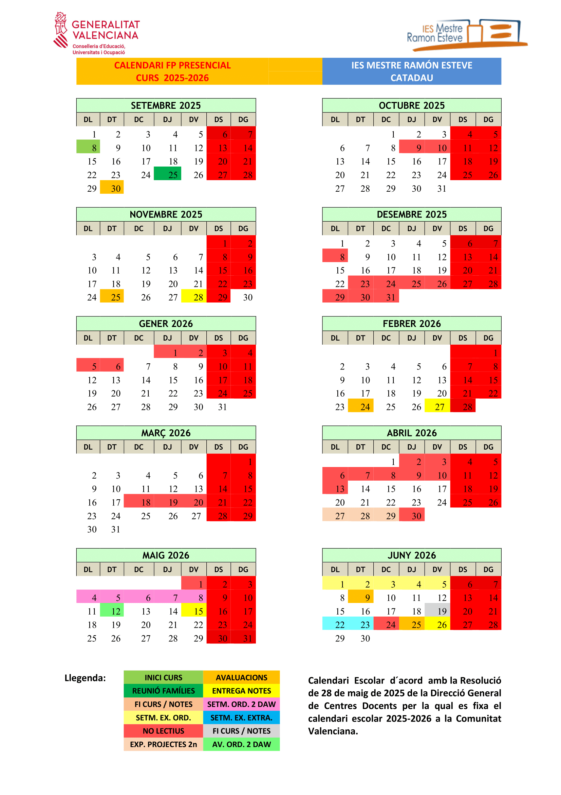
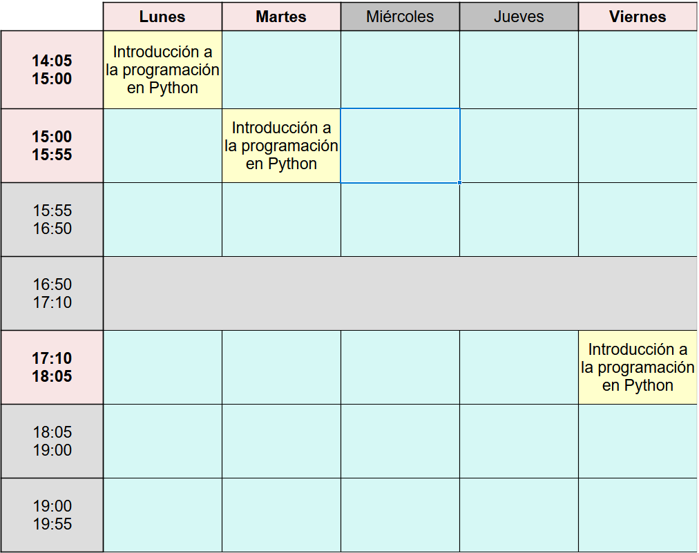
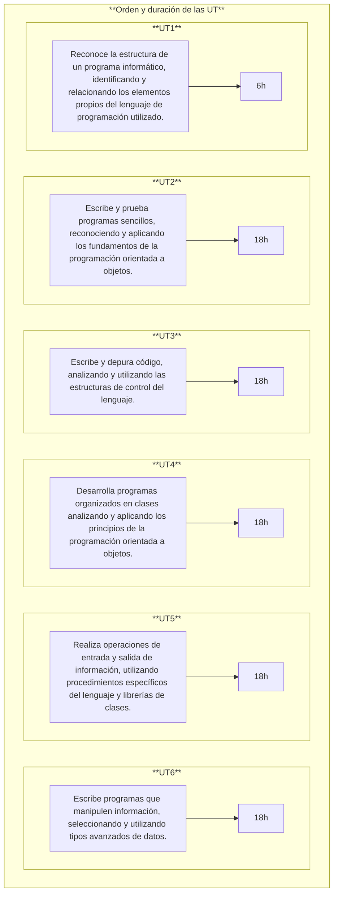

# **INTRODUCCIÓN A LA PROGRAMACIÓN**
{ .img1 }
 

## **1 - Calendario escolar**
{.sietecinco}

## **2 - Horario de sesiones**
{.cincozero}

## **3 - Contenidos del módulo**
A continuación, se presentan los contenidos de este módulo tal y como aparecen en el <a href=https://ceice.gva.es/documents/388109149/391641510/ANEXOS_Optativas_Propuesta_Decreto_Curris_LFP_GMGS.pdf>**Anexo X: Módulos optativos**</a>, seguiendo las <a href=https://ceice.gva.es/documents/388109149/392955746/Instrucciones_optativas_FP_definitivas_firmado_.pdf>**Instrucciones de la dirección de formación profesional**</a> sobre la oferta de módulos optativos para el curso 2025-2026.

!!! info "Identificación de los elementos de un programa informático:"  
    - Estructura y bloques fundamentales.  
    - Variables.  
    - Tipos de datos. 
    - Literales. 
    - Constantes. 
    - Operadores y expresiones. 
    - Conversiones de tipo. 
    - Comentarios.

<!-- ## **3.2. - Utilización de objetos:** -->
!!! info "Utilización de objetos:" 
    - Características de los objetos. 
    - Instanciación de objetos. 
    - Utilización de métodos. 
    - Parámetros.
    - Utilización de propiedades. 
    - Utilización de métodos estáticos. 
    - Constructores. 
    - Destrucción de objetos y liberación de memoria.

<!-- ### **3.3 - Uso de estructuras de control:** -->
!!! info "Uso de estructuras de control:"
    - Estructuras de selección. 
    - Estructuras de repetición. 
    - Estructuras de salto. 
    - Control de excepciones. 
    - Aserciones. 
    - Prueba, depuración y documentación de la aplicación.

<!-- ### **3.4 - Desarrollo de clases:** -->
!!! info "Desarrollo de clases:"
    - Concepto de clase. 
    - Estructura y miembros de una clase. 
    - Visibilidad. 
    - Creación de propiedades. 
    - Creación de métodos. 
    - Creación de constructores. 
    - Utilización de clases y objetos. 
    - Utilización de clases heredadas.

<!-- ### **3.5 - Lectura y escritura de información:** -->
!!! info "Lectura y escritura de información:"
    - Flujos. 
    - Tipos: bytes y caracteres. 
    - Clases relacionadas. 
    - Ficheros de datos. 
    - Registros.
    - Apertura y cierre de ficheros. 
    - Modos de acceso. 
    - Escritura y lectura de información en ficheros. 
    - Utilización de los sistemas de ficheros. 
    - Creación y eliminación de ficheros y directorios. 
    - Entrada desde teclado. 
    - Salida a pantalla. 
    - Formatos de visualización. 
    - Interfaces gráficas. 
    - Concepto de evento. 
    - Creación de controladores de eventos.

<!-- ### **3.6 - Aplicación de las estructuras de almacenamiento:** -->
!!! info "Aplicación de las estructuras de almacenamiento:"
    - Estructuras estáticas y dinámicas. 
    - Creación de matrices (arrays). 
    - Matrices (arrays) multidimensionales. 
    - Genericidad. Cadenas de caracteres. 
    - Expresiones regulares.
    - Colecciones: Listas, Conjuntos y Diccionarios. 
    - Operaciones agregadas: filtrado, reducción y recolección.

## **4 - Metodología de aprendizaje**
1. Exposición de los **aspectos teóricos** para que después **sean aplicados mediante prácticas y ejercicios**.  
1. La metodología de trabajo será el **Aprendizaje Basado en Problemas (ABP/PBL)**. Se propondrá un problema real y los alumnos tendrán que buscar una solución, justificándola y comprobando que funciona. Además, si procede, incluirán un pequeño estudio de necesidades y costes para valorar su viabilidad.  
1. Las prácticas podrán ser **individuales o colectivas**. 
1. Realización de **actividades voluntarias** de investigación y ampliación para **profundizar en los conocimientos adquiridos**.  
1. **Proyección de vídeos**. 
 

## **5 - Evaluación** 
1. La evaluación se hará **por resultados de aprendizaje RA**. <a href=https://www.boe.es/boe/dias/2023/07/22/pdfs/BOE-A-2023-16889.pdf>R.D. 659/2023</a>. 
1. Los resultados de aprendizaje y criterios de evaluación asociados al módulo **Introducción a la programación en python** constituyen los logros que los alumnos/as tienen que alcanzar para **superar el módulo**.
1. Cada resultado de aprendizaje **RA** se evalúa a través de los criterios de evaluación **CE**. Los **CE** actúan como “desglose” del **RA**, facilitando medir de forma objetiva si el aprendizaje se ha alcanzado.

### **5.1 - Relación entre Criterios de Evaluación y Resultados de Aprendizaje** 
**Los criterios de evaluación** asociados a los **resultados de aprendizaje** del módulo **Introducción a la programación en python**, <a href=https://ceice.gva.es/documents/388109149/391641510/ANEXOS_Optativas_Propuesta_Decreto_Curris_LFP_GMGS.pdf>ANEXO X: Módulos optativos</a>, son los siguientes :

=== "RA 1"
    |RA1. Reconoce la estructura de un programa informático, identificando y relacionando los elementos propios del lenguaje de programación utilizado.|Peso|
    |-|-|
    |**a)** Se han identificado los bloques que componen la estructura de un programa informático. |12%|
    |**b)** Se han respetado las especificaciones técnicas del proceso de instalación. |11%|
    |**c)** Se han utilizado entornos integrados de desarrollo. |11%|
    |**d)** Se han identificado los distintos tipos de variables y la utilidad específica de cada uno. |11%|
    |**e)** Se ha modificado el código de un programa para crear y utilizar variables. |11%|
    |**f)** Se han creado y utilizado constantes y literales. |11%|
    |**g)** Se han clasificado, reconocido y utilizado en expresiones los operadores del lenguaje. |11%|
    |**h)** Se ha comprobado el funcionamiento de las conversiones de tipo explícitas e implícitas. |11%|
    |**i)** Se han introducido comentarios en el código. |11%|

=== "RA 2"
    |RA2. Escribe y prueba programas sencillos, reconociendo y aplicando los fundamentos de la programación orientada a objetos.|Peso|
    |-|-|
    |**a)** Se han identificado los fundamentos de la programación orientada a objetos. |12%|
    |**b)** Se han escrito programas simples.|11%|
    |**c)** Se han instanciado objetos a partir de clases predefinidas.|11%|
    |**d)** Se han utilizado métodos y propiedades de los objetos.|11%|
    |**e)** Se han escrito llamadas a métodos estáticos.|11%|
    |**f)** Se han utilizado parámetros en la llamada a métodos.|11%|
    |**g)** Se han incorporado y utilizado librerías de objetos.|11%|
    |**h)** Se han utilizado constructores.|11%|
    |**i)** Se ha utilizado el entorno integrado de desarrollo en la creación y compilación de programas simples.|11%|

=== "RA 3"
    |RA3. Escribe y depura código, analizando y utilizando las estructuras de control del lenguaje.|Peso|
    |-|-|
    |**a)** Se ha escrito y probado código que haga uso de estructuras de selección.|12%|
    |**b)** Se han utilizado estructuras de repetición.|11%|
    |**c)** Se han reconocido las posibilidades de las sentencias de salto.|11%|
    |**d)** Se ha escrito código utilizando control de excepciones.|11%|
    |**e)** Se han creado programas ejecutables utilizando diferentes estructuras de control.|11%|
    |**f)** Se han probado y depurado los programas.|11%|
    |**g)** Se ha comentado y documentado el código.|11%|
    |**h)** Se han creado excepciones.|11%|
    |**i)** Se han utilizado aserciones para la detección y corrección de errores durante la fase de desarrollo.|11%|

=== "RA 4"
    |RA4. Desarrolla programas organizados en clases analizando y aplicando los principios de la programación orientada a objetos.|Peso|
    |-|-|
    |**a)** Se ha reconocido la sintaxis, estructura y componentes típicos de una clase.|12%|
    |**b)** Se han definido clases.|11%|
    |**c)** Se han definido propiedades y métodos.|11%|
    |**d)** Se han creado constructores.|11%|
    |**e)** Se han desarrollado programas que instancien y utilicen objetos de las clases creadas anteriormente.|11%|
    |**f)** Se han utilizado mecanismos para controlar la visibilidad de las clases y de sus miembros.|11%|
    |**g)** Se han definido y utilizado clases heredadas.|11%|
    |**h)** Se han creado y utilizado métodos estáticos.|11%|
    |**i)** Se han creado y utilizado conjuntos y librerías de clases.|11%|

=== "RA 5"
    |RA5. Realiza operaciones de entrada y salida de información, utilizando procedimientos específicos del lenguaje y librerías de clases.|Peso|
    |-|-|
    |**a)** Se ha utilizado la consola para realizar operaciones de entrada y salida de información.|16%|
    |**b)** Se han aplicado formatos en la visualización de la información.|12%|
    |**c)** Se han reconocido las posibilidades de entrada / salida del lenguaje y las librerías asociadas.|12%|
    |**d)** Se han utilizado ficheros para almacenar y recuperar información.|12%|
    |**e)** Se han creado programas que utilicen diversos métodos de acceso al contenido de los ficheros.|12%|
    |**f)** Se han utilizado las herramientas del entorno de desarrollo para crear interfaces gráficos de usuario simples.|12%|
    |**g)** Se han programado controladores de eventos.|12%|
    |**h)** Se han escrito programas que utilicen interfaces gráficos para la entrada y salida de información.|12%|

=== "RA 6"
    |RA6. Escribe programas que manipulen información, seleccionando y utilizando tipos avanzados de datos.|Peso|
    |-|-|
    |**a)** Se han escrito programas que utilicen matrices (arrays).|10%|
    |**b)** Se han reconocido las librerías de clases relacionadas con tipos de datos avanzados.|10%|
    |**c)** Se han utilizado listas para almacenar y procesar información.|10%|
    |**d)** Se han utilizado iteradores para recorrer los elementos de las listas.|10%|
    |**e)** Se han reconocido las características y ventajas de cada una de las colecciones de datos disponibles.|10%|
    |**f)** Se han creado clases y métodos genéricos.|10%|
    |**g)** Se han utilizado expresiones regulares en la búsqueda de patrones en cadenas de texto.|10%|
    |**h)** Se han identificado las clases relacionadas con el tratamiento de documentos escritos en diferentes lenguajes de intercambio de datos.|10%|
    |**i)** Se han realizado programas que realicen manipulaciones sobre documentos escritos en diferentes lenguajes de intercambio de datos.|10%|
    |**j)** Se han utilizado operaciones agregadas para el manejo de información almacenada en colecciones.|10%|

### **5.2 - Metodología de evaluación**
- La evaluación será **contínua**.   
- Se basará en la comprobación de la superación de los **resultados de aprendizaje (RA)**.
- La evaluación se hará sobre **todos los RA y todos los CE** del currículo.

### **5.3 - Instrumentos de evaluación**
- Exámenes.    
    - Preguntas tipo test.
    - Examen escrito (ejercicios).          
- Entrega de tareas.  
- Exposiciones orales.  
- **Prácticas en empresa**.

### **5.4 - Responsable evaluación de los RA's y/o CE's**
1. Evaluación por profesor:  
**Todos lo que no serán evaluados en empresa**.
  

1. Evaluación por tutor empresa (dualización de los RA y CE):  

    === "RA 2"
        **b)** Se han escrito programas simples.  
        **i)** Se ha utilizado el entorno integrado de desarrollo en la creación y compilación de programas simples.

    === "RA 3"
        **f)** Se han probado y depurado los programas.   
        **g)** Se ha comentado y documentado el código.

    === "RA 4"
        **f)** Se han utilizado mecanismos para controlar la visibilidad de las clases y de sus miembros.

    === "RA 6"
        **e)** Se han reconocido las características y ventajas de cada una de las colecciones de datos disponibles.
    

## **6 - Criterio de superación del módulo**
### **6.1 - Nota final**
La nota final será la suma ponderada de **los resultados de aprendizaje** obtenidos en cada evaluación.  

La superación del módulo requerirá obtener una media mínima de **5 sobre 10 en cada resultado de aprendizaje**. 

En caso de no superar el módulo, el alumna/o dispondrá de un proceso de recuperación orientado a reforzar específicamente los resultados de aprendizaje no alcanzados.

|Resultado de aprendizaje|Porcentage|
|-|-|
|**RA1.** Reconoce la estructura de un programa informático, identificando y relacionando los elementos propios del lenguaje de programación utilizado.|5%|
|**RA2.** Escribe y prueba programas sencillos, reconociendo y aplicando los fundamentos de la programación orientada a objetos.|15%|
|**RA3.** Escribe y depura código, analizando y utilizando las estructuras de control del lenguaje.|20%|
|**RA4.** Desarrolla programas organizados en clases analizando y aplicando los principios de la programación orientada a objetos.|15%|
|**RA5.** Realiza operaciones de entrada y salida de información, utilizando procedimientos específicos del lenguaje y librerías de clases.|25%|
|**RA6.** Escribe programas que manipulen información, seleccionando y utilizando tipos avanzados de datos.|20%|

### **6.2 - Instrumentos de recuperación**
- Se propondrá a los alumnos una serie de **recuperaciones** que le permitirán recuperar los **criterios de evaluación** no superados. Esas recuperaciones podrán ser ejercicios o exámenes a lo largo del curso, o en su defecto presentarse a la evaluación **ordinaria** y/o **extraordinaria**
- Si el alumno **no entrega los trabajos obligatorios o presenta tasas de absentismo elevadas**, perderá **la evaluación contínua** y para aprobar el módulo, deberá presentarse a la evaluación **ordinaria** y/o **extraordinaria**.

### **6.3 - Calendario de evaluaciones**
- Evaluación inicial (primer mes).
- **Una evaluación parcial por cada trimestre**. 
    - Se daran las notas de los **RA** completados y también la nota **parcial** de los **RA** incompletos.
    - Para tener el aprobado será necesario haber alcanzado una puntuación superior o igual a 5 en los **Resultados de Aprendizaje RA** completados.
- **Evaluación ordinaria** y **extraordinaria**: Permitirán recuperar los **RA no superados**.

## **7 - Secuenciación y duración de cada Unidad de Trabajo**

```mermaid
flowchart TB 
  A["Reconoce la estructura de un programa informático, identificando y relacionando los elementos propios del lenguaje de programación utilizado."]
  B["Escribe y prueba programas sencillos, reconociendo y aplicando los fundamentos de la programación orientada a objetos."]
  C["Escribe y depura código, analizando y utilizando las estructuras de control del lenguaje."]
  D["Desarrolla programas organizados en clases analizando y aplicando los principios de la programación orientada a objetos."]
  E["Realiza operaciones de entrada y salida de información, utilizando procedimientos específicos del lenguaje y librerías de clases."]
  F["Escribe programas que manipulen información, seleccionando y utilizando tipos avanzados de datos."]
  AA["6h"]
  BB["18h"]
  CC["18h"]
  DD["18h"]
  EE["18h"]
  FF["18h"]
  
  subgraph **Orden y duración de las UT**

    subgraph **UT6**  
      direction LR
      F --> FF
    end
    
    subgraph **UT5**  
      direction LR
      E --> EE
    end
    
    subgraph **UT4**  
      direction LR
      D --> DD
    end
    
    subgraph **UT3**  
      direction LR
      C --> CC
    end

    subgraph **UT2** 
      direction LR
      B --> BB
    end  

    subgraph **UT1** 
      direction LR
      A --> AA
    end

  end
```

   
--- 

| **Licencia Creative Commons:** | |
| - | - |
|  { .by-nc-nd-eu_ } | **Reconocimiento-NoComercial-CompartirIgual CC BY-NC-SA:**  No se permite un uso comercial de la obra original ni de las posibles obras derivadas, la distribución de la cuales se debe hace con una licencia igual a la que regula la obra original. | 

