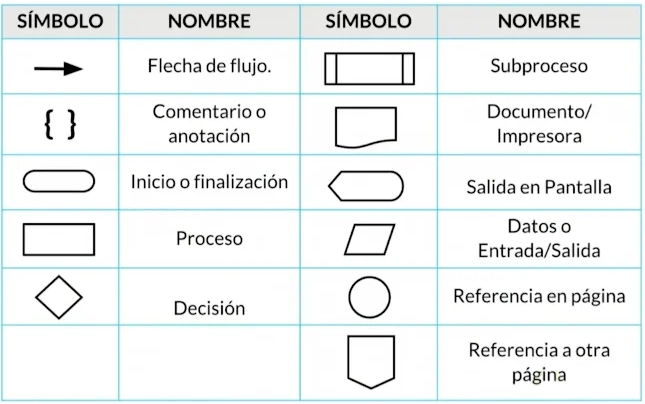

{ .img1 }

<br>

## ¿Qué es un programa?
Un **programa informático** es un conjunto de instrucciones escritas en un lenguaje de programación que permiten a **un ordenador** realizar una tarea. Dichas instrucciones, conocidas como **código**, son **interpretadas o compiladas** para que el sistema pueda ejecutarlas. 

En esencia, un programa es el nexo entre el usuario y la máquina, ya que traduce acontecimientos en operaciones secuenciales (una tras otra) ejecutadas en el tiempo. 

???+ example "Ejemplo visual de un programa informático"
    ```mermaid
       flowchart TD
       B{"¿a&gt;b?"} -- Sí --> C["Mostrar en pantalla: a"]
       B -- No --> D["Mostrar en pantalla: b"]
       A(["Inicio programa"]) --> n1["Introducir valores a y b"]
       n1 --> B
       C --> n3["Fin programa"]
       D --> n3
       n1@{ shape: rect}
       n3@{ shape: rounded}
    ```
<br>
Otro uso de los programas, vinculado al contexto de las máquinas y los autómatas, podría referirse al programa de una lavadora o de un robot de cocina. En este caso, no se suceden acontecimientos, sino órdenes que el electrodoméstico sigue ordenadamente. 

???+ example "El programa de un robot de cocina podría ser:"
    Espera a que introduzcáis maíz y mantequilla.  
    Gira durante un minuto, avanzando progresivamente de la velocidad 1 a la 5.  
    Espera a que introduzcáis leche y sal.  
    Gira durante 30 segundos a velocidad 7.  
    Gira durante 10 minutos a velocidad 3 mientras cuece a una temperatura de 90 grados.  
    Se para.   
    La crema está lista!  

<br>

## ¿Qué datos procesa un programa informático?
El tipo de datos que procesa un programa depende de su finalidad:

- Un editor de texto procesa principalmente caracteres, palabras y formatos de documentos escritos.
- Una hoja de cálculo procesa datos numéricos, pero también fórmulas, gráficos y texto.
- Un videojuego procesa datos relacionados con la posición de personajes y objetos, las reglas del juego, las entradas del usuario, así como gráficos y sonidos.
- Un navegador web procesa tanto las acciones del usuario (clics, escritura en la barra de direcciones, formularios) como la información recibida desde Internet (páginas web, imágenes, estilos y scripts).

En definitiva, cada programa informático está diseñado para manejar **un conjunto específico de datos**, transformarlos y presentar un resultado útil al usuario.

## Tarea del programador 
La tarea de un programador informático es escoger qué órdenes constituirán un programa de ordenador, en qué orden se tienen que llevar a cabo y sobre qué datos hay que aplicarlas.  
La dificultad de todo será más grande o más pequeña dependiendo de la complejidad del **algoritmo** a desarrollar. 

## Algoritmos
Un algoritmo es un conjunto de reglas o pasos que indican cómo resolver un determinado problema en un tiempo finito.

Secuencias de reglas básicas que utilizamos para realizar operaciones aritméticas: sumas, restas, productos y divisiones.

???+ example "Ejemplo del algoritmo"
    ```basic linenums="1"
    Inicio
      Sentarse
      Servirse café con leche
      Servirse azucar
      Si tengo tiempo
          Mientras tenga apetito
              Untar mantequilla en una tostada
              Añadir mermelada
              Comer la tostada
          Fin Mientras
      Fin Si
      Beberse el café con leche
      Levantarse
    Fin
    ```
    
Como acabamos de ver, un algoritmo no es más que la secuencia de pasos que se deben seguir para solucionar un problema específico. La descripción o nivel de detalle de la solución de un problema en términos algorítmicos depende de qué o quién debe entenderlo, interpretarlo y resolverlo.

**Los algoritmos son independientes de los lenguajes de programación y de las computadoras donde se ejecutan**. Un mismo algoritmo puede ser expresado en diferentes lenguajes de programación y podría ser ejecutado en diferentes dispositivos. Piensa en una receta de cocina, ésta puede ser expresada en castellano, inglés o francés, podría ser cocinada en fogón o vitrocerámica, por un cocinero o más, etc. Pero independientemente de todas estas circunstancias, el plato se preparará siguiendo los mismos pasos.

### Características de los algoritmos
Un algoritmo, para que sea válido, tiene que tener ciertas características fundamentales:

- Generalidad: han de definirse de forma general, utilizando identificadores o parámetros. Un algoritmo debe resolver toda una clase de problemas y no un problema aislado particular.
- Finitud: han de llevarse a cabo en un tiempo finito, es decir, el algoritmo ha de acabar necesariamente tras un número finito de pasos.
- Definibilidad: han de estar definidos de forma exacta y precisa, sin ambigüedades.
- Eficiencia: han de resolver el problema de forma rápida y eficiente.

### Representación de algoritmos
Los métodos más usuales para representar algoritmos son los **diagramas de flujo y el pseudocódigo**.  
El diseño de un algoritmo constituye **el paso previo a la codificación de un programa** en un lenguaje de programación determinado. 

#### Diagrama de flujo (Flowchart)
Es una de las técnicas de representación de algoritmos más antiguas y más utilizadas, aunque su empleo disminuyó considerablemente con los lenguajes de programación estructurados. Un diagrama de flujo utiliza símbolos estándar que contienen los pasos del algoritmo escritos en esos símbolos, unidos por flechas denominadas líneas de flujo que indican la secuencia en que deben ejecutarse.

- Algunos de los símbolos más usuales son:
???+ example "Símbolos de representación de un algoritmo"
    { .symbols }

<br>

hasta aqui https://creately.com/diagram/example/6gBk8ZtT4zi/diagrama-de-flujo-de-registro-de-usuarios
https://arturoblasco.github.io/prg/ut01/ut0102/#representacion-de-algoritmos
file:///C:/Users/titan/Downloads/UD1_Fundamentos_Programaci%C3%B3n.pdf


- Ejemplo de diagrama de flujo:
???+ example "Algoritmo de autenticación"
    ```mermaid
      flowchart TD
        Inicio(["Inicio"])
        Formulario["Rellenar el formulario de inscripción"]
        QuiereInscribirse{"¿Quiere inscribirse?"}
        YaMiembro{"¿Ya es miembro?"}
        Credenciales{"¿Credenciales de usuario válidas?"}
        Error["Error de inicio de sesión"]
        Olvido{"¿Ha olvidado su contraseña?"}
        Restablecer["Restablecer contraseña"]
        EmailPass["Introducir correo electrónico y contraseña"]
        Facebook{"¿Iniciar sesión a través de Facebook?"}
        AutFacebook["Autenticación de Facebook"]
        Google{"¿Iniciar sesión a través de Google?"}
        AutGoogle["Autenticación de Google"]
        UsuarioConectado["Usuario conectado correctamente"]
        Salida(["Salida"])

        Inicio --> YaMiembro
        YaMiembro -- No --> QuiereInscribirse
        YaMiembro -- Sí --> EmailPass
        QuiereInscribirse -- Sí --> Formulario
        QuiereInscribirse -- No --> Facebook
        Facebook -- Sí --> AutFacebook
        Facebook -- No --> Google
        Google -- Sí --> AutGoogle
        Google -- No --> Salida
        EmailPass -- Sí --> UsuarioConectado
        EmailPass -- No --> Error
        Error -- No --> EmailPass
        Error -- Sí --> Olvido
        Olvido -- Sí --> Restablecer
        Olvido -- No --> EmailPass
        Formulario --> UsuarioConectado
        AutFacebook --> UsuarioConectado
        AutGoogle --> UsuarioConectado

    ```


Tipo de órdenes que acepta un ordenador

Para llevar a cabo la tarea encomendada, un ordenador puede aceptar diferentes tipos de órdenes. Estas se encuentran limitadas a las capacidades de los componentes que lo conforman, del mismo modo que el programa de una lavadora no puede incluir la orden de gratinar, puesto que no tiene gratinador. Por lo tanto, es importante tener presente este hecho para saber qué se puede pedir al ordenador cuando creáis un programa.

La estructura interna del ordenador se divide en una serie de componentes, todos comunicados entre si, tal como muestra la figura.1 de manera muy simplista, pero suficiente para empezar. Cada orden de un programa está vinculada de una manera u otra a alguno de estos componentes.

Figura1 .1 Componentes básicos de un ordenador

    Procesador

    El procesador también es conocido popularmente por sus siglas en inglés: CPU (Central Processing Unit, unidad central de procesamiento).

El procesador es el centro neurálgico del ordenador y el elemento que es capaz de llevar a cabo las órdenes de manipulación y transformación de los datos. Un conjunto de datos se puede transformar de muchas maneras, según las capacidades que ofrezca cada procesador. Aún así, hay muchas transformaciones que todos pueden hacer. Un ejemplo es la realización de operaciones aritméticas (suma, resto, multiplicación, división), tal como hacen las calculadoras.

La memoria permite almacenar datos mientras estas no están siendo directamente manipuladas por el procesador. Cualquier dato que tiene que ser tratado por un programa estará en la memoria. Mediante el programa se puede ordenar al procesador que guarde ciertos datos o que los recupere en cualquier momento. Normalmente, cuando se habla de memoria a este nivel nos referimos a memoria dinámica o RAM (Random Access Memory, memoria de acceso aleatorio). Esta memoria no es persistente y una vez acaba la ejecución del programa todos los datos con las cuales trataba se desvanecen. Por lo tanto, la información no se guardará entre sucesivas ejecuciones diferentes de un mismo programa.

En ciertos contextos es posible que nos encontramos también con memoria ROM (Read-Only memory, memoria sólo de lectura). En esta, los datos están predefinidos de fábrica y no se puede almacenar nada, sólo podemos leer el que contiene. Hay que decir que no es el caso más habitual.

El sistema de entrada/salida (abreviado como E/S) permite el intercambio de datos con el exterior del ordenador, más allá del procesador y la memoria. Esto permite traducir la información procesada en acciones de control sobre cualquier periférico conectado al ordenador. Un ejemplo típico es establecer una vía de diálogo con el usuario, ya sea por medio del teclado o del ratón para pedirle información, como por la pantalla, para mostrar los resultados del programa. Este sistema es clave para convertir un ordenador en una herramienta de propósito general, puesto que lo capacita para controlar todo tipo de aparatos diseñados para conectarse.

Otra posibilidad importante del ordenador, atendidas las limitaciones del sistema de memoria, es poder interactuar con el hardware de almacenamiento persistente de datos, como un disco duro.

    Un ordenador es como una pizzería

    Si se quiere hacer un símil con nuestro mundo de cada día, un ordenador es como la cocina de una pizzería que acepta pedidos telefónicos. Hacer un pedido equivale a pedir el inicio de la ejecución de un programa. Para llevar a cabo este pedido, habrá que manipular una serie de ingredientes, que representarían los datos. El cocinero con sus enseres (horno, pastador, etc.) serían el procesador, puesto que manipulan y transforman los ingredientes. La nevera, los armarios o los contenedores, de donde el cocinero puede sacar ingredientes o donde los puede dejar mientras no los está manipulando, representarían la memoria. El sistema de entrada/salida serían los elementos de comunicación con el exterior de la pizzería, como el motorista que trae la pizza o el teléfono que el cocinero puede utilizar para pedir que le traigan nuevos ingredientes cuando se le acaban, pedir información adicional al usuario (“Se ha acabado el pimiento, va bien si ponemos cebolla?”), o avisarlo de algún acontecimiento (“Me sabe mal, tardará algo más del previsto”). De hecho, continuando con el símil, el cocinero prepara una pizza siguiendo un conjunto de pasos. En este caso la receta son las órdenes que tiene que seguir el programa. Y si el cocinero no tiene la receta no puede llevar a cabo el pedido.

    Lenguaje natural

    El lenguaje natural es aquel que empleamos los humanos para comunicarnos habitualmente.

Partiendo de esta descripción de las tareas que puede llevar a cabo un ordenador según los elementos que lo componen, un ejemplo de programa para multiplicar dos números es el mostrado a la Tabla 1. Lo tenéis expresado en lenguaje natural. Notad como los datos tienen que estar siempre almacenadas a la memoria para poder operar.

Tabla 1 Un programa que multiplica dos números usando lenguaje natural
Orden para dar 	Elemento que lo efectúa
1. Lee un número del teclado 	E/S (teclado)
2. Guarda del número en memoria 	Memoria
3. Lee otro número del teclado 	E/S (teclado)
4. Guarda del número en memoria 	Memoria
5. Recupera los números de la memoria y hace la multiplicación 	Procesador
6. Guarda el resultado en memoria 	Memoria
7. Muestra el resultado a la pantalla 	E/S (pantalla)
Crear un programa ejecutable…

Para crear un programa hay que establecer qué órdenes se tienen que dar al ordenador y en qué secuencia. Ahora bien, hoy en día los ordenadores todavía no entienden el lenguaje natural (cómo se utiliza a la tabla.1), puesto que está lleno de ambigüedades y aspectos semánticos que pueden depender del contexto.

    Artificial Por artificial entendemos aquello que no ha evolucionado a partir del uso entre humanos, sino que ha sido creado expresamente, en este caso para ser usado con los ordenadores.

    Lenguaje de programación Para especificar las órdenes que tiene que seguir un ordenador el que se usa es un lenguaje de programación. Se trata de un lenguaje artificial diseñado expresamente para crear algoritmos que puedan ser llevados a cabo por el ordenador.

Igual como hay muchas lenguas diferentes, también hay muchos lenguajes de programación, cada uno con sus características propias, que los hacen más o menos indicados para resolver unos tipos de tareas u otras. Todos, pero, tienen una sintaxis muy definida, que hay que seguir para que el ordenador interprete correctamente cada orden que se le da. Es exactamente lo mismo que pasa con las lenguas del mundo: para expresar los mismos conceptos, el castellano y el japonés usan palabras y normas de construcción gramatical totalmente diferentes entre sí.

    En un lenguaje de programación determinado, la agrupación de órdenes concretas que se pide al ordenador que haga se denomina conjunto de instrucciones.

Normalmente, el conjunto de instrucciones de un programa se almacena dentro de un conjunto de ficheros. Estos archivos los edita el programador (vosotros) para crear o modificar el programa. Para los programas más sencillos basta con un único fichero, pero para los más complejos pueden hacer falta más de uno.

Los lenguajes de programación se pueden clasificar en diferentes categorías según sus características. De hecho, algunas de las propiedades del lenguaje de programación tienen consecuencias importantes sobre el proceso que hay que seguir para poder crear un programa y para ejecutarlo. Hay dos maneras de clasificar los lenguajes de programación (estas dos categorías no son mutuamente excluyentes):

    Según si se trata de un lenguaje compilado o interpretado. Esta propiedad afecta los pasos que hay que seguir para llegar a obtener un fichero ejecutable. O sea, un fichero con el mismo formato que el de las aplicaciones que podéis tener instaladas a vuestro ordenador.
    Según si se trata de un lenguaje de nivel alto o bajo. Esta propiedad indica el grado de abstracción del programa y si sus instrucciones están más o menos estrechamente vinculadas al funcionamiento del hardware de un ordenador.

…en lenguaje máquina

El lenguaje máquina o código máquina es el lenguaje que elegiríamos si quisiéramos hacer un programa que trabajara directamente sobre el procesador. Es interesante de conocer porque ayuda a entender el proceso de generación de un programa.

En este lenguaje, cada una de las instrucciones se representa con una secuencia binaria, en ceros (0) y unos (1), y todo el conjunto de instrucciones del programa queda almacenado de manera consecutiva dentro de un fichero de datos en binario. Si lo intentáis abrir con un editor de texto, lo que veréis en pantalla son símbolos totalmente incomprensibles.

    Transistor

    El transistor es el componente básico de un sistema digital. Se puede considerar como un interruptor, en qué 1 indica que pasa corriendo y 0 que no pasa.

Cuando se pide la ejecución de un programa en lenguaje máquina, este se carga a la memoria del ordenador. A continuación, el procesador va leyendo una por una cada una de las instrucciones, las descodifica y las convierte en señales eléctricas de control sobre los elementos del ordenador para que hagan la tarea pedida. A muy bajo nivel, casi se puede llegar a establecer una correspondencia entre los 0 y 1 de cada instrucción y el estado resultante de los transistores dentro de los chips internos del procesador.

El conjunto de instrucciones que es capaz de descodificar correctamente un procesador y convertir en señales de control es específico para cada modelo y está definido por su fabricante. El diseñador de cada procesador se inventó la sintaxis y las instrucciones del código máquina de acuerdo con sus necesidades cuando diseñó el hardware. Por lo tanto, las instrucciones en formato binario que puede descodificar un tipo de procesador pueden ser totalmente incompatibles con las que puede descodificar otro. Esto es lógico, puesto que sus circuitos son diferentes y, por lo tanto, las señales eléctricas de control que tiene que generar son diferentes para cada caso. Dos secuencias de 0 y 1 iguales pueden tener efectos totalmente diferentes en dos procesadores de modelos diferentes, o resultar incomprensibles para alguno.

    Un programa escrito en lenguaje de máquina es específico para un tipo de procesador concreto. No se puede ejecutar sobre ninguno otro procesador, salvo que sean compatibles. Un procesador concreto sólo entiende directamente el lenguaje de máquina especificado por su fabricante.

A pesar de que, como se puede ver, en realidad hay muchos lenguajes máquina diferentes, se usa esta terminología para englobarlos a todos. Si se quiere concretar más se puede decir “lenguaje máquina del procesador X”.

Ahora bien, estrictamente hablando, si optarais para hacer un programa en lenguaje de máquina, nunca lo haríais generando directamente ficheros con todo secuencias binarias. Sólo os tenéis que imaginar el aspecto de un programa de este tipo en formato imprimido, consistente en una enorme retahíla de 0 y 1. Sería totalmente incomprensible y prácticamente imposible de analizar. En realidad el que se usa es un sistema auxiliar de mnemotécnicos en el cual se asigna a cada instrucción en binario un identificador en formato de texto legible, más fácilmente comprensible para los humanos. De este modo, es posible generar un programa a partir de ficheros en formado texto.

    Esta compilación de mnemotécnicos es el que se conoce como el lenguaje ensamblador.

A título ilustrativo, la tabla 2 muestra las diferencias de aspecto entre un lenguaje máquina y ensamblador equivalentes para un procesador de modelo 6502. Sin entrar en más detalles, es importante mencionar que tanto en lenguaje máquina como en ensamblador cada una de las instrucciones se corresponde a una tarea muy simple sobre uno de sus componentes. Hacer que el ordenador haga tareas complejas implica tener que generar muchas instrucciones en estos lenguajes.

Tabla 2. Tabla de equivalencia entre lenguaje ensamblador y lenguaje máquina.
Instrucción ensamblador 	Lenguaje máquina
LDA #6 	1010100100000110
CMP &3500 	110011010000000000110101
LDA &70 	1010010101110000
INX 	11101111
  	 
…mediante un lenguaje compilado

    Editores de texto simples

    Un editor de texto simple es aquel que permite escribir sólo texto sin formato. Son ejemplos el Bloc de Notas (Windows), Gedit o Emacs (Unix).

Para crear un programa lo que haremos es crear un archivo y escribir el conjunto de instrucciones que queremos que el ordenador ejecute. Para empezar será suficiente con un editor de texto simple.

    Una vez se ha acabado de escribir el programa, el conjunto de ficheros de texto resultante donde se encuentran las instrucciones que contiene se llama el código fuente.

Este sistema de programar más cómodo para los humanos hace surgir un problema, y es que los ficheros de código fuente no contienen lenguaje máquina y, por lo tanto, resultan incomprensibles para el procesador. No se le puede pedir que lo ejecute directamente; esto sólo es posible usando lenguaje máquina. Para poder generar código máquina hay que hacer un proceso de traducción desde los mnemotécnicos que contiene cada fichero a las secuencias binarias que entiende el procesador.

    El proceso denominado compilación es la traducción del código fuente de los ficheros del programa en ficheros en formato binario que contienen las instrucciones en un formato que el procesador puede entender. El contenido de estos ficheros se denomina código objeto. El programa que hace este proceso se denomina compilador.

Para el caso del ensamblador el proceso de compilación es muy sencillo, puesto que es una mera traducción inmediata de cada mnemotécnico a la secuencia binaria que le corresponde. En principio, con esto ya habría bastante para poder hacer cualquier programa, pero ceñirse sólo al uso de lenguaje ensamblador comporta ciertas ventajas e inconvenientes que hacen que en realidad no sea usado normalmente, sólo en casos muy concretos.

Por el lado positivo, con ensamblador el programador tiene control absoluto del hardware del ordenador a nivel muy bajo. Prácticamente se puede decir que controla cada señal eléctrica y los valores de los transistores dentro de los chips. Esto permite llegar a hacer programas muy eficientes en que el ordenador hace exactamente aquello que le decís sin ningún tipo de ambigüedad. En contraposición, los programas en ensamblador sólo funcionan para un tipo de procesador concreto, no son portables. Si se tienen que hacer para otra arquitectura, normalmente hay que empezar de cero. Además —y es el motivo de más peso para pensárselo dos veces si se quiere usar este lenguaje— crear un programa complejo requiere un grado enorme de experiencia sobre cómo funciona el hardware del procesador, y el trabajo sería considerable. Esto hace que sean programas complicados de entender y que haya que dedicar mucho tiempo a hacerlos.
Lenguajes compilados de alto nivel

    Programas de bajo nivel

    Se considera que el código máquina y el ensamblador son los lenguajes de nivel más bajo existentes, puesto que sus instrucciones dependen directamente del tipo de procesador.

Actualmente, para generar la inmensa mayoría de programas se utilizan los llamados lenguajes de alto nivel. Estos ofrecen un conjunto de instrucciones que son fáciles de entender para el ser humano y, por lo tanto, poseen un grado de abstracción más alto que el lenguaje ensamblador (puesto que no están vinculados a un modelo de procesador concreto). Cada una de las instrucciones se corresponde a una orden genérica en qué lo más importante es su aspecto funcional (qué se quiere hacer), sin que importe como se materializa esto en el hardware del ordenador ni mucho menos en señales eléctricas. En cualquier caso, hay que advertir que esta clasificación no siempre es absoluta. Se puede decir que un lenguaje es de “nivel más alto o bajo que otro”, según el grado relativo de abstracción de sus instrucciones y su proximidad al funcionamiento interno del hardware de un ordenador.

El proceso para generar un programa a partir de un lenguaje de nivel alto es muy parecido al que hay que seguir para hacerlo usando el lenguaje ensamblador, puesto que las instrucciones también se escriben en formado texto dentro de ficheros de código fuente. La ventaja adicional es que el formato y la sintaxis ya no están ligados al procesador, y por lo tanto, pueden tener el formato que quiera el inventor del lenguaje sin que tenga que tener en cuenta el hardware de los ordenadores donde se ejecutará. Normalmente, las instrucciones y la sintaxis han sido elegidas para facilitar la tarea de creación y comprensión del código fuente del programa.

De hecho, en los lenguajes de nivel alto más frecuentes, entre los cuales está el que aprenderéis a usar en este módulo, las instrucciones dentro de un programa se escriben como una secuencia de sentencias.

    Una sentencia es el elemento mínimo de un lenguaje de programación, a menudo identificado por una cadena de texto especial, que sirve para describir exactamente una acción que el programa tiene que hacer.

Por lo tanto, a partir de ahora se usará el término sentencia en lugar de instrucción cuando el texto se refiera a un lenguaje de este tipo.

Una vez se han acabado de generar los ficheros con su código fuente, estos también se tienen que compilar para traducirlos a código objeto. Ahora bien, en este caso, el proceso de traducción a código objeto será bastante más complicado que desde ensamblador. El compilador de un lenguaje de nivel alto es un programa mucho más complejo. En cuanto al proceso de compilación, una consecuencia adicional del hecho de que el lenguaje no dependa directamente del tipo de procesador es que desde un mismo código fuente se puede generar código objeto para diferentes procesadores. Sólo hay que disponer de un compilador diferente para cada tipo de procesador que se quiera soportar. Por lo tanto, un mismo código fuente original puede servir para generar programas que funcionen con diferentes tipos de procesador sin tenerlo que modificar cada vez.

Puesto que para cada fichero de código fuente se genera un fichero de código objeto, después del proceso de compilación hay un paso adicional llamado enlazamiento (link), en el cual estos dos códigos se combinan para generar un único fichero ejecutable. Coloquialmente, cuando os pedimos que compiláis un programa ya se suele dar por hecho que también se enlazará, si se tercia. Aún así, formalmente se consideran dos pasos diferenciados.

La figura 2 muestra un esquema que sirve de resumen del proceso de generación del fichero ejecutable usando un lenguaje compilado.

Figura 2. Proceso de compilación (y enlazamiento) del código fuente

Algunos ejemplos de lenguajes de nivel alto compilados muy populares son C o Pascal. Cómo se ha visto, el ensamblador también es un lenguaje compilado, pero de nivel bajo.
Errores de compilación

El compilador es fundamental para generar un programa en un lenguaje compilado, ya sea de nivel alto o bajo. Para poder hacer su trabajo de manera satisfactoria y generar código objeto a partir del código fuente hace falta que las instrucciones sigan perfectamente la sintaxis del lenguaje elegido. Por ejemplo, hay que usar sólo las instrucciones especificadas en el lenguaje y hacerlo en el formato adecuado. Si no es así, el compilador es incapaz de entender la orden que se quiere dar al ordenador y no sabe como traducirla a lenguaje máquina.

    Cuando el compilador detecta que una parte del código fuente no sigue las normas del lenguaje, el proceso de compilación se interrumpe y anuncia que hay un error de compilación

Cuando pasa esto, habrá que repasar el código fuente e intentar averiguar donde está el error. Normalmente, el compilador da algún mensaje sobre lo que considera que está mal.

Hay que ser conscientes que un programador puede llegar a dedicar una buena parte del tiempo de la generación del programa a la resolución de errores de compilación. Ahora bien, que un programa compile correctamente sólo quiere decir que se ha escrito de acuerdo con las normas del lenguaje de programación, pero no aporta ninguna garantía que sea correcto, es decir, que haga correctamente la tarea para la cual se ha ideado.

    Los lenguajes de programación y el lenguaje natural

    Intentando hacer un símil entre un lenguaje de programación y el lenguaje natural, si una persona que habla castellano es como un compilador, que es capaz de entender o traducir una frase siempre que se sigan las normas de esta lengua, sin un poco de imaginación se le puede hacer difícil entender la frase: ”helado kérem un comra”. Hay palabras en un orden extraño, y además hay otras que no pertenecen al castellano o que no simplemente no existen…

    Por otro lado, la frase “El helado conduce una hoja de papel” puede ser gramaticalmente correcta y no tener ningún error de sintaxis. Alguien que hable castellano la puede entender. Ahora bien, está claro que algo no encaja. En la comprensión del significado de un lenguaje hay aspectos que van más allá de la sintaxis, y los lenguajes de programación no son excepción.

… mediante un lenguaje interpretado

En contraposición de los lenguajes compilados, tenemos los lenguajes interpretados. En este caso, no se hace una distinción interna entre nivel alto y bajo, puesto que la inmensa mayoría de lenguajes interpretados son de nivel alto. Lo que interesa es entender la idea general del funcionamiento y las diferencias con los compilados. Como en el caso de los lenguajes compilados, los programas también se escriben en ficheros de texto que contienen código fuente. La divergencia surge inmediatamente después de acabar de escribirlos, en la manera como se genera un fichero ejecutable. El quid de la cuestión es que, precisamente, ni se genera ningún código objeto ni ningún fichero ejecutable. Se trabaja directamente con el fichero de código fuente. Una vez este está escrito, el proceso de creación del programa ejecutable ha finalizado.

    Intérprete

    Un intérprete no traduce el código fuente del programa a código objeto y entonces lo ejecuta. Lo que hace es ejecutar diferentes instrucciones de su propio código según cada instrucción leída del código fuente.

Imagináis un programa que acepta una serie de datos que codifican unas instrucciones, las va leyendo una por una y las va procesando de forma que actúa de una forma o de otra, es decir, ejecuta una parte u otra de su propio código objeto según el tipo de instrucción leída. A fin de cuentas, sería un programa que imita el comportamiento de un procesador, pero a escala de software. Pues esto es exactamente un intérprete.

    Un lenguaje interpretado se ejecuta indirectamente, mediante la ayuda de un programa auxiliar llamado intérprete, que procesa el código fuente y gestiona la ejecución.

Igual que en los lenguajes compilados, puede suceder que el programador haya incluido sin darse cuenta algún error de sintaxis en las instrucciones. En este caso, será el intérprete quién mostrará el error y se negará a ejecutar el programa hasta que haya sido solucionado.

    Coloquialmente, la generación de bytecode a partir del código fuente se denomina igualmente compilar.

Algunos lenguajes interpretados usan una aproximación híbrida. El código fuente se compila y como resultado se genera un fichero de datos binarios llamados bytecode. Este bytecode, no obstante, no es formalmente código objeto, puesto que no es capaz de entenderlo el hardware de ningún procesador. Sólo un intérprete lo puede procesar y ejecutar. Simplemente es una manera de almacenar más eficiente y en menos espacio, en formato binario y no en texto, las instrucciones incluidas en el código fuente. Este es el motivo por el cual, a pesar de necesitar un proceso de compilación, estos lenguajes no se consideran realmente compilados y se continúan clasificando como interpretados.

Por sus características, los lenguajes interpretados no requieren un proceso posterior de enlazamiento.

La figura 3 muestra un esquema del proceso de ejecución de un programa en lenguaje interpretado. Notad que en el caso de un lenguaje con bytecode, lo que se proporciona al intérprete son ficheros con la versión del código fuente previamente compilado en bytecode, y no el código fuente directamente.

Figura 3 Proceso de interpretación del código fuente

Entre los lenguajes interpretados más conocidos encontramos Javascript, PHP o Perl. Muchos son lenguajes de script, que permiten el control de aplicaciones dentro de un sistema operativo, llevar a cabo procesos por lotes (batch) o generar dinámicamente contenido web. Entre los lenguajes interpretados basados en bytecode, Java es uno de los más populares.
Entornos integrados de desarrollo

    Un IDE (Integrated Development Environment o Entorno Integrado de Desarrollo) es una herramienta que integra todo lo que hace falta para generar programas de ordenador, de forma que el trabajo sea mucho más cómodo.

Una vez se ha descrito el proceso general para desarrollar y llegar a ejecutar un programa, se hace evidente que hay que tener instalados y correctamente configurados dos programas completamente diferentes e independientes en vuestro ordenador para desarrollarlos: editor, por un lado, y compilador (incluyendo el enlazador) o intérprete por la otra, según el tipo de lenguaje. Cada vez que queráis modificar y probar vuestro programa tendréis que ir alternando ejecuciones entre los dos. Realmente, sería mucho más cómodo si todo ello se pudiera hacer desde un único programa, que integrara los tres. Un editor avanzado desde el cual se pueda compilar, enlazar si se tercia, e iniciar la ejecución de código fuente para comprobar si funciona.

    Ejemplos de IDE

    Algunos ejemplos de IDE son Visual Studio, para los lenguajes C#, C++ y Visual Basic; IntelliJ IDEA , Netbeans y Eclipse, para los lenguajes Java y Ruby; Dev-Pascal, para el lenguaje Pascal, o el Dev-C, para el lenguaje C.

La utilización de estas herramientas agiliza increíblemente el trabajo del programador. Además, los IDE más modernos van más allá de integrar editor, compilador y enlazador o intérprete, y aportan otras características que hacen todavía más eficiente la tarea de programar. Por ejemplo:

    Posibilidad de hacer resaltar con códigos de colores los diferentes tipos de instrucciones o aspectos relevantes de la sintaxis del lenguaje soportado, para facilitar la comprensión del código fuente.
    Acceso a documentación y ayuda contextual sobre las instrucciones y sintaxis de los lenguajes soportados.
    Detección, y en algunos casos incluso corrección, automática de errores de sintaxis en el código, de manera similar a un procesador de texto. Así, no hay que compilar para saber que el programa está mal.
    Apoyo simultáneo del desarrollo de lenguajes de programación diferentes.
    Un depurador, una herramienta muy útil que permite pausar la ejecución del programa en cualquier momento o hacerla instrucción por instrucción, de forma que permite analizar como funciona el programa y detectar errores.
    En los más avanzados, sistemas de ayuda para la creación de interfaces gráficas.

En definitiva, usar un IDE para desarrollar programas es una opción muy recomendable. Aún así, hay que tener presente que son programas más complejos que un simple editor de texto y, como pasaría con cualquiera otro programa, hay que dedicar un cierto tiempo a familiarizarse con estos y con las opciones de que disponen.


https://nachoiborraies.github.io/python/01.html
https://victorponz.github.io/programacion-java/introduccion-a-la-programacion
