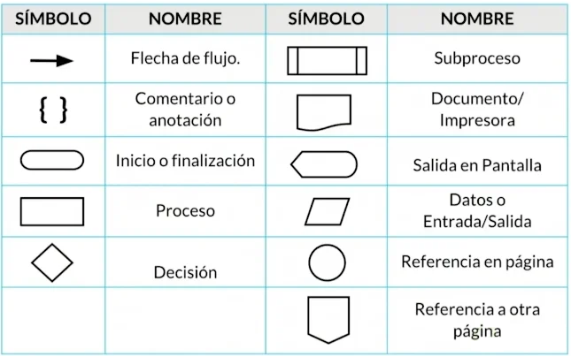
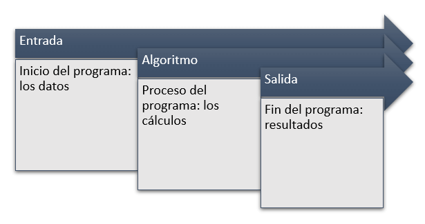
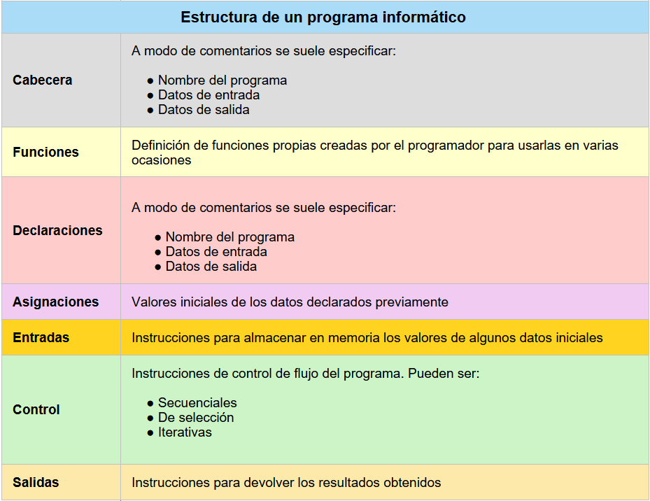

# **UT 1 - Programas informáticos y algoritmos**

{ .img1 }

<br>

**Resultados de aprendizaje y criterios de evaluacion que se evaluarán en esta unidad.**  

| **Resultados de aprendizaje de la unidad didáctica:** |
|-|
| **RA. 1:** Reconoce la estructura de un programa informático, identificando y relacionando los elementos propios del lenguaje de programación utilizado.|  


|**Criterios de evaluación de la unidad didáctica:**|
||
|**a)** Se han identificado los bloques que componen la estructura de un programa informático.|  

<br>


## **1 - ¿Qué es un programa?**
Un **programa informático** es un conjunto de instrucciones escritas en un lenguaje de programación que indican al ordenador cómo realizar una tarea. Estas instrucciones, llamadas código, deben ser traducidas mediante un compilador o un intérprete para que la máquina pueda ejecutarlas.

En términos sencillos, un programa permite que una computadora lleve a cabo acciones específicas: desde responder a las órdenes de un usuario hasta ejecutar procesos de manera automática. Dichas acciones pueden realizarse de forma secuencial (una tras otra) o paralela (varias al mismo tiempo).

???+ example "Ejemplo de un programa informático con interacción humana"
    ```mermaid
       flowchart TD
       B{"¿a&gt;b?"} -- Sí --> C["Mostrar en pantalla: a"]
       B -- No --> D["Mostrar en pantalla: b"]
       A(["Inicio programa"]) --> n1["Introducir valores a y b"]
       n1 --> B
       C --> n3["Fin programa"]
       D --> n3
       n1@{ shape: rect}
       n3@{ shape: rounded}
    ```
<br>
No todos los programas requieren de una interacción humana. Dentro del contexto de las máquinas y los autómatas, un programa podría referirse al de un electrodoméstico. En este caso, no se suceden eventos, sino órdenes que el electrodoméstico sigue ordenadamente. 

???+ example "El programa de un robot de cocina podría ser:"
    ```basic linenums="1"
    Esperar a que se introduzca el maíz y la mantequilla.  
    Remover durante un minuto, avanzando progresivamente de la velocidad 1 a la 5.  
    Esperar a que se introduzca la leche y la sal.  
    Girar durante 30 segundos a velocidad 7.  
    Girar durante 10 minutos a velocidad 3 mientras cuece a una temperatura de 90 grados.  
    Fin de operaciones, la crema está lista.  
    ```

<br>

## **2 - ¿Qué datos procesa un programa informático?**
El tipo de datos que procesa un programa depende de su finalidad:

- Un editor de texto procesa principalmente caracteres, palabras y formatos de documentos escritos.
- Una hoja de cálculo procesa datos numéricos, pero también fórmulas, gráficos y texto.
- Un videojuego procesa datos relacionados con la posición de personajes y objetos, las reglas del juego, las entradas del usuario, así como gráficos y sonidos.
- Un navegador web procesa tanto las acciones del usuario (clics, escritura en la barra de direcciones, formularios) como la información recibida desde Internet (páginas web, imágenes, estilos y scripts).

En definitiva, cada programa informático está diseñado para manejar **un conjunto específico de datos**, transformarlos y presentar un resultado útil al usuario.

## **3 - Tarea del programador** 
La tarea de un programador informático consiste en diseñar y escribir instrucciones que conforman un programa, determinando qué operaciones se deben realizar, en qué orden y sobre qué datos deben aplicarse.

La dificultad de esta labor depende, en gran medida, de la complejidad del **algoritmo que se quiera implementar**, así como de otros factores como la claridad del problema, el lenguaje utilizado y la calidad del diseño previo.


## **4 - Algoritmos**
Un algoritmo es un conjunto de reglas o pasos que indican cómo resolver un determinado problema.

???+ example "Ejemplo del algoritmo"
    ```basic linenums="1"
    Inicio
      Sentarse
      Servirse café con leche
      Servirse azucar
      Si tengo tiempo
          Mientras tenga apetito
              Untar mantequilla en una tostada
              Añadir mermelada
              Comer la tostada
          Fin Mientras
      Fin Si
      Beberse el café con leche
      Levantarse
    Fin
    ```
    
Como acabamos de ver, un algoritmo no es más que la secuencia de pasos que se deben seguir para solucionar un problema específico. La descripción o nivel de detalle de la solución de un problema en términos algorítmicos depende de qué o quién debe entenderlo, interpretarlo y resolverlo.

**Los algoritmos son independientes de los lenguajes de programación y de las computadoras donde se ejecutan**. Un mismo algoritmo puede ser expresado en diferentes lenguajes de programación y podría ser ejecutado en diferentes dispositivos. 

???+ info 
    Piensa en una receta de cocina, ésta puede ser expresada en castellano, inglés o francés, podría ser cocinada en fogón o vitrocerámica, por un cocinero o más, etc. Pero independientemente de todas estas circunstancias, el plato se preparará siguiendo los mismos pasos.

### **4.1 - Características de los algoritmos**
Para que sea válido, un algoritmo tiene que tener ciertas características fundamentales:

1. Generalidad: han de definirse de forma general, utilizando identificadores o parámetros. Un algoritmo debe resolver toda una clase de problemas y no un problema aislado particular.
1. Finitud: han de llevarse a cabo en un tiempo finito, es decir, el algoritmo ha de acabar necesariamente tras un número finito de pasos.
1. Definibilidad: han de estar definidos de forma exacta y precisa, sin ambigüedades.
1. Eficiencia: han de resolver el problema de forma rápida y eficiente.

### **4.2 - Representación de los algoritmos**
Los métodos más usuales para representar algoritmos son los **diagramas de flujo y el pseudocódigo**.  
El diseño de un algoritmo constituye **el paso previo a la codificación de un programa** en un lenguaje de programación determinado. 

#### **4.2.1 - Diagrama de flujo (Flowchart)**
Es una de las técnicas de representación de algoritmos más antiguas y más utilizadas, aunque su empleo disminuyó considerablemente con los lenguajes de programación estructurados. Un diagrama de flujo utiliza símbolos estándar que contienen los pasos del algoritmo escritos en esos símbolos, unidos por flechas denominadas líneas de flujo que indican la secuencia en que deben ejecutarse.

- Algunos de los símbolos más usuales son:
???+ example "Símbolos de representación de un algoritmo"
    { .symbols }

<br>

- Ejemplo de diagrama de flujo:
???+ example "Algoritmo de autenticación"
    ```mermaid
      flowchart TD
        Inicio(["Inicio"])
        YaMiembro{"¿Ya es miembro?"}
        QuiereInscribirse{"¿Quiere inscribirse?"}
        EmailPass["Introducir correo electrónico y contraseña"]
        Formulario["Rellenar el formulario de inscripción"]
        Facebook{"¿Iniciar sesión a través de Facebook?"}        
        Credenciales{"¿Credenciales de usuario válidas?"}        
        Error["Error de inicio de sesión"]
        AutFacebook["Autenticación de Facebook"]
        Google{"¿Iniciar sesión a través de Google?"}
        Salida(["Salida"])
        Olvido{"¿Ha olvidado su contraseña?"}
        AutGoogle["Autenticación de Google"]
        Restablecer["Restablecer contraseña"]
        UsuarioConectado["Usuario conectado correctamente"]
                
        Inicio --> YaMiembro
        YaMiembro -- No --> QuiereInscribirse
        YaMiembro -- Sí --> EmailPass
        QuiereInscribirse -- No --> Facebook
        QuiereInscribirse -- Sí --> Formulario
        Facebook -- Sí --> AutFacebook
        Facebook -- No --> Google
        Google -- Sí --> AutGoogle
        Google -- No --> Salida
        AutFacebook --> UsuarioConectado
        AutGoogle --> UsuarioConectado

        EmailPass --> Credenciales
        Credenciales -- Sí --> UsuarioConectado
        Credenciales -- No --> Error
        Error --> Olvido
        Olvido -- Sí --> Restablecer
        Olvido -- No --> EmailPass
        
    ```

!!! question "Pregunta"
    ¿Qué hace este algoritmo?

#### **4.2.2 - Pseudocódigo**
El pseudocódigo es un lenguaje de descripción de algoritmos muy próximo a la sintaxis de los lenguajes de programación. Nace como medio para representar las estructuras de control de **programación estructurada**.

El pseudocódigo no se puede ejecutar nunca en el ordenador, sino que tiene que traducirse a un lenguaje de programación (codificación). La ventaja del pseudocódigo, frente a los diagramas de flujo, es que se puede modificar más fácilmente si detecta un error en la lógica del algoritmo, y puede ser traducido fácilmente a los lenguajes de programación estructurados.

El Pseudocódigo utiliza palabras reservadas (en sus orígenes se escribían en inglés) para representar las sucesivas acciones. Para mayor legibilidad utiliza la identación `sangría en el margen izquierdo` de sus líneas.
        
???+ example "Mostrar dos números ordenados de menor a mayor"
    ```basic linenums="1"
    Inicio
      Leer (A, B)
      Si (A>B) Entonces
        Escribir (B, A)
      Si (B>A)
        Escribir (A, B)
      FinSi
    Fin
    ```


## **5 - Estructura de un programa informático**
### **5.1 - Contenidos esenciales de un programa informático**
Como hemos visto, un programa informático es una secuencia de acciones (instrucciones o comandos) que manipulan un conjunto de **objetos** (datos e información).  
Cada lenguaje de programación tiene sus especificaciones a la hora de estructurar el código pero, básicamente contendrá bloques de declaraciones y bloques de instrucciones. 

   1. **Bloque de declaraciones**: En él, se **declaran** detallan todos los objetos que utiliza el programa (constantes, variables, archivos, etc).
   1. **Bloque de instrucciones**: Aquí se definen el conjunto de acciones u operaciones que se han de llevar a cabo para conseguir los resultados esperados. Dicho en otras palabras, se define **el algoritmo** del programa.

<br>

**El bloque de instrucciones** de un programa puede dividirse conceptualmente en tres partes: **entrada de datos, procesamiento y salida de resultados**. Aunque no siempre aparezcan claramente separadas en el código, esta estructura ayuda a entender y diseñar los programas.

{.cincozero}

1. **Entrada de datos**  
Es la parte del programa encargada de recibir la información necesaria para su ejecución. Puede provenir de archivos, bases de datos, dispositivos de entrada o del propio usuario.

1. **Procesamiento**  
Aquí se realizan las operaciones, cálculos o transformaciones sobre los datos recibidos. Es el “núcleo” lógico del programa, donde se aplican **los algoritmos**.

1. **Salida de resultados**  
Corresponde a la presentación o almacenamiento del resultado final del procesamiento. Puede ser en pantalla, en un archivo, en una base de datos, etc.

### **5.2 - Estructura típica de un programa informático**
Al diseñar y desarrollar un programa informático es fundamental comprender su estructura interna, ya que esta organización facilita la lectura, el mantenimiento y **la reutilización del código**.  

1. **La cabecera** suele incluir **comentarios** con información descriptiva del programa, como su nombre, los datos de entrada que requiere y los datos de salida que genera. Esta documentación inicial ayuda tanto al propio programador como a otros desarrolladores a entender rápidamente el propósito del código.

1. **Sección de declaraciones** donde se especificarán las definiciones y tipos de datos que se utilizarán, incluyendo variables, constantes, etc.

1. **Las asignaciones** se encargan de establecer los valores iniciales de los datos declarados previamente. 

1. **Las entradas** permiten almacenar en memoria los valores de algunos datos iniciales que pueden provenir del usuario u otras fuentes externas.

1. **Las algoritmos** creados para ser (re)utilizadas en distintas partes del programa, favoreciendo así **la modularidad** y evitando duplicar instrucciones.

1. **El control del flujo** del programa se gestiona mediante instrucciones secuenciales, que marcan **el orden en que se ejecutan las distintas operaciones**.

1. **Las salidas** contienen las instrucciones necesarias para devolver o mostrar los resultados obtenidos tras la ejecución del programa.

**Tabla resumen**

{.sietecinco}


## **6 - Ejercicios RA1-CEa**
### **6.1 - Calcular promedio (ejemplo)**
Desarrollar la estructura del programa del siguiente enunciado. 

Se necesita obtener la nota media de un estudiante a partir de sus tres notas parciales.
??? example "Solución"
      1. **Cabecera**  
      Programa escrito por el alumno xxx...   
      
      1. **Declaraciones**  
      Nota1  
      Nota2  
      Nota3  
      Media  
        
      1. **Asignaciones**   
      Nota1 = 0  
      Nota2 = 0  
      Nota3 = 0  
      Media = 0  
      
      1. **Entradas**
      Preguntar valor Nota1   
      Preguntar valor Nota2   
      Preguntar valor Nota3   
      
      1. **Algoritmo(s)**   
      Calcular_media = (Nota1 + Nota2 + Nota3) / 3  
        
      1. **Control del flujo**  
        - Inicio programa  
            1. Leer Nota1  
            1. Leer Nota2  
            1. Leer Nota3
            1. Media = Calcular_media(Nota1, Nota2, Nota3)   
            1. Mostrar Media
        - Fin programa  
        
      1. **Salidas**  
      Mostrar en pantalla el valor Media  

### **6.2 - Calculador de notas de exámenes tipo test**
Desarrollar la estructura del programa del siguiente enunciado. 

Elaborar un programa que solicite, el número de respuestas correctas, incorrectas y en blanco y finalmente muestre la nota final al usuario.  
La nota final se calculará de la siguiente manera: Cada respuesta correcta tendrá 2 puntos, cada respuesta incorrecta tendrá -1 punto y las respuestas en blanco tendrán 0.

### **6.3 - Calculador de puntos de equipo de fútbol**
Desarrollar la estructura del programa del siguiente enunciado.

Elaborar un programa que pida el número de partidos ganados, perdidos y empatados de un equipo de fútbol y que devuelva los puntos totales.  
El cálculo de los puntos se hará de la siguiente manera: En cada partido ganado se obtendrán 3 puntos, empatado 1 punto y perdido 0 puntos.

### **6.4 - Calculador de la nómina de un empleado**
Desarrollar la estructura del programa del siguiente enunciado.

Elaborar un programa que calcule la nónima de un empleado. Para ello se dispone de sus horas trabajadas en el mes, así como de la tarifa por hora.

### **6.5 - Calculador de edad para derecho de entrada**
Desarrollar la estructura del programa del siguiente enunciado.

Elaborar un programa que determine el derecho de entrada de una persona a una discoteca. El algoritmo calculará la edad de la persona al pedir la fecha de nacimiento. Si la persona es mayor de edad, podrá pasar. Si no lo es, le dirá que no puede pasar.  

**Nota:** Usar el ejemplo del apartado **4.2.2** para elaborar el algoritmo.


### **6.6 - Calculador de quién es el mayor de 2 hermanos y si además alguno es mayor de edad**
Desarrollar la estructura del programa del siguiente enunciado.

Elaborar un programa que solicite la fecha de nacimiento de 2 hermanos (año, mes y día). Un algoritmo determinará el mayor de los 2 hermanos. El otro algoritmo determinará si además, alguno (o los 2 hermanos) son mayores de edad. 


## **7 - Conclusión**
Los lenguajes de programación son herramientas para expresar algoritmos. Diseñar un algoritmo requiere creatividad y conocimientos, y **distintos programadores pueden llegar a soluciones diferentes pero igualmente válidas**.

Cuando un problema es complejo, conviene dividirlo en partes más simples. A esta estrategia se le llama diseño descendente o modular, porque consiste en resolver pequeños subproblemas y luego unir sus soluciones para obtener la solución completa.
