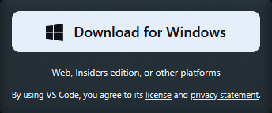
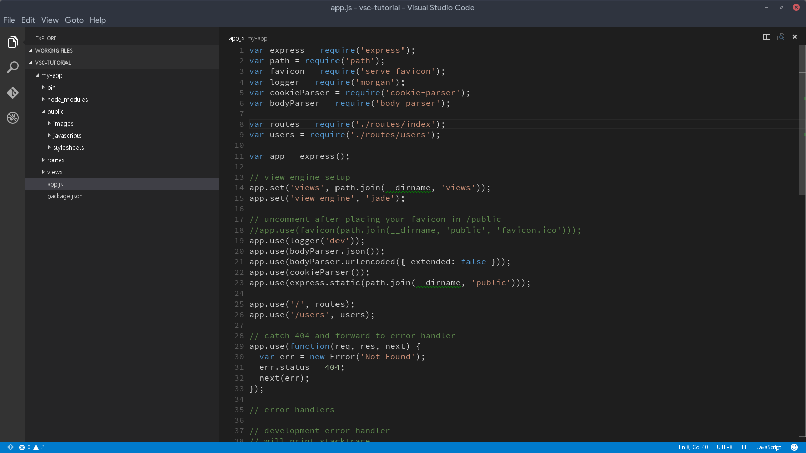
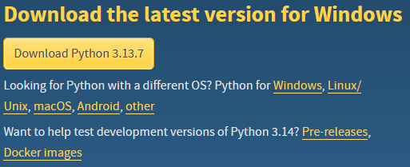
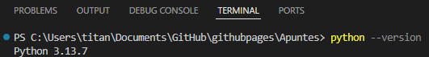
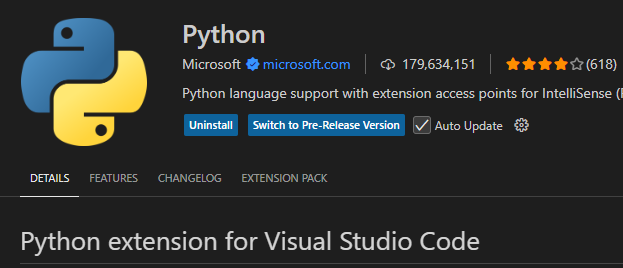
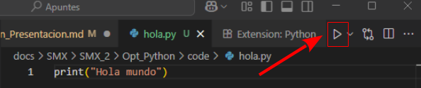
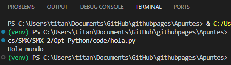

{ .img1 }

<br>


## **Python**
- <a href=https://www.python.org>Python</a> es un lenguaje de programación interpretado cuya filosofía hace hincapié en una sintaxis muy limpia y un código facilmente legible.
- Ideado por <a href="https://es.wikipedia.org/wiki/Guido_van_Rossum">Guido van Rossum</a>, empezó su desarrollo en 1989.
- Es un lenguaje de <a href=https://es.wikipedia.org/wiki/Lenguaje_de_alto_nivel>alto nivel</a> con una gramática sencilla, clara y muy legible.
- Es dinámicamente tipado: Es decir, el tipo de las variables se decide en tiempo de ejecución.
- Es fuertemente tipado: No se puede usar una variable en un contexto fuera de su tipo. Si se quisiera, habría que hacer una conversión de tipos.
- Es un <a href=https://es.wikipedia.org/wiki/Python#Caracter%C3%ADsticas_y_paradigmas>lenguaje multiparadigma</a>: soporta la orientación a objetos, <a href=https://es.wikipedia.org/wiki/Programaci%C3%B3n_estructurada>la programación estructurada</a> y <a href=https://es.wikipedia.org/wiki/Programaci%C3%B3n_funcional>la programación funcional</a>.
- Open Source, de código abierto y gratuito.
- Relativamente fácil de aprender.
- Presenta numerosas <a href=https://docs.python.org/3.13/library/index.html>librerías</a> que lo convierten en un firme candidato para la programación de IA, ciencia de datos, desarrollo web y mucho más.
- <a href=https://lenguajesdeprogramacion.net/diccionario/que-es-un-lenguaje-interpretado>Interpretado</a>, aunque el código fuente se <a href=https://es.wikipedia.org/wiki/Lenguaje_compilado>compila</a> primero a bytecode que ejecuta la máquina virtual de Python.
- Lenguaje “todo terreno”: sirve tanto para aplicaciones de escritorio, programación en entorno servidor, desarrollo web, automatización, etc.
- Multiplataforma: se pueden desarrollar programas en Mac, Windows, Linux y otros sistemas operativos.


## **Python y otros lenguajes de programación, índice TIOBE**
- El índice de programación TIOBE es un indicador de la popularidad de las lenguas de programación.  
- El índice se actualiza una vez al mes. Las calificaciones se basan en el número de ingenieros cualificados en todo el mundo, cursos y proveedores de terceros. Los sitios web populares Google, Amazon, Wikipedia, Bing y más de otros 20 se utilizan para calcular las calificaciones.  
- El índice TIOBE no trata **de decidir del mejor lenguaje de programación** o del lenguaje en el que se han escrito la mayoría de las líneas de código, sino de su popularidad en un momento dado.  
- El índice se puede (debe) utilizar para comprobar si nuestras habilidades de programación están actualizadas o para tomar una decisión estratégica sobre qué lenguaje de programación debe ser adoptado cuando se comience a construir un nuevo sistema de software.  

La definición del índice TIOBE se puede encontrar <a href=https://www.tiobe.com/tiobe-index>aquí</a>.

### **Popularidad de Python según TIOBE**
En el periodo 08/24-08/25, podemos ver el incremento significativo de la popularidad del lenguaje de programación Python.


### **Índice TIOBE**
Con la figura de aquí abajo podemos ver las popularidades sobre un periodo de tiempo más extenso.


## **Entorno de Desarrollo Integrado**
Un **IDE** (**Integrated Development Environment o Entorno de Desarrollo Integrado**) es un **programa que reúne en una sola aplicación todas las herramientas necesarias para desarrollar software**.

📌 Sus componentes principales suelen ser:

- **Editor de código**: para escribir el programa con resaltado de sintaxis y ayudas.
- **Compilador o intérprete**: para traducir el código fuente a un lenguaje que el ordenador pueda ejecutar.
- **Depurador (debugger)**: para detectar y corregir errores durante la ejecución.
- **Gestión de proyectos**: organiza archivos, dependencias y librerías.
- **Autocompletado y sugerencias**: acelera la escritura de código.

### **IDE en línea**
Un IDE en línea (Entorno de Desarrollo Integrado en la nube) es una plataforma accesible desde un navegador web que permite a los programadores escribir, ejecutar, depurar y colaborar en proyectos de software sin necesidad de instalar herramientas pesadas en el ordenador local.

🔧 Ejemplos de IDE en línea:

- Replit → Muy usado en educación y proyectos colaborativos, soporta muchos lenguajes, permite ejecución inmediata y tiene integración con bases de datos.
- GitHub Codespaces → Entorno de desarrollo basado en Visual Studio Code pero en la nube, directamente desde los repositorios de GitHub.
- Codeanywhere → Ofrece entornos Docker personalizables y colaboración en tiempo real.
- AWS Cloud9 → IDE en línea de Amazon, con integración nativa con todos los servicios de AWS.
- Glitch → Enfocado en aplicaciones web, con despliegue automático al guardar cambios.

### **Jupyter Notebook y Google Colab**
#### **Jupyter Notebook / JupyterLab**
Es un entorno interactivo basado en celdas que permite escribir código, texto en Markdown, gráficos, fórmulas matemáticas (LaTeX) y ejecutar el código paso a paso.  
Aunque nació como una herramienta de investigación y enseñanza en ciencia de datos, se ha convertido en un estándar de facto en el mundo de Python.
Se puede usar localmente (instalando Jupyter en tu PC) o en la nube (ej. Binder, JupyterHub).

#### **Google Colab**
Es básicamente un Jupyter Notebook en la nube, mantenido por Google.  
Permite ejecutar código Python directamente en servidores remotos de Google (gratis o bajo suscripción).
Se usa mucho en machine learning, análisis de datos y enseñanza de programación en Python.

### **IDE locales**
A diferencia de los IDE en la nube, estos utilizan los recursos de la máquina local (CPU, RAM, disco duro, tarjeta gráfica, etc.) para ejecutar, compilar, depurar y probar los programas.

🔧 Ejemplos de IDE muy usados:

- **Visual Studio Code** (será el que usaremos).  
- **Eclipse** (muy usado en Java).  
- **IntelliJ IDEA**.  
- **PyCharm** (para Python).  
- **NetBeans**.  

### **Visual Studio Code (VSC) como herramienta principal en el curso.**  
Durante el curso utilizaremos **Visual Studio Code**, que no es un IDE en el sentido más “pesado” como Eclipse o IntelliJ, sino un editor de código avanzado que, mediante extensiones, se convierte en un IDE completo.

🎯 **¿Por qué VSC?**  

- Multiplataforma → Funciona en Windows, Linux y macOS.
- Es **gratuito** y de código abierto.
- Es fácil de instalar y configurar.
- Se adapta tanto a estudiantes como a programadores avanzados.
- Permite trabajar en múltiples lenguajes.
- Dispone de una comunidad muy importante lo que permite disponer de infinidad de extensiones (jupyter).

## **Instalación de VSC**
1. Seguir el <a href=https://code.visualstudio.com>siguiente enlace</a> y descargar el instalador.  

1. Hacer doble clic sobre el archivo, no cambiar nada de todas las opciones seleccionadas y seguir las instrucciones.
1. Lanzar VSC. Si la instalación se ha hecho correctamente, debería aparecer una interfaz similar a la de la siguiente imagen.



## **Instalación de Python**
1. Seguir el <a href=https://www.python.org/downloads>siguiente enlace</a> y descargar el instalador.  


1. Hacer doble clic sobre el instalador archivo, **ticar** la opción **Add python.exe to PATH** y pulsar **Install Now**.


1. Dejar que la instalación se complete.  


1. Por último seleccionar la opción **Disable path Lenght limit**.   


1. Para comprobar que la instalación se ha realizado correctamente, abrir una terminal de VSC y escribir el siguiente comando:
```shell linenums="1"
python --version
```
   Este comando pide al sistema que le devuelva la versión de python instalada.  
   De haberse instalado correctamente el resultado será similar al de la siguiente imagen.  
   

## **Primer programa en Python**
Vamos a escribir nuestro primer programa Python que muestre un saludo por pantalla. Para ello creamos un archivo fuente Python llamado, HolaMundo.py en la carpeta donde queramos trabajar, y lo guardamos con este contenido:
```python linenums="1"
print("Hola mundo")
```

**Nota:** Es probable que al crear el archivo VSC detecte la necesidad de instalar alguna extensión para Python:


Para ejecutar el programa, simplemente pulsaremos el boton de **play**. 


El resultado de la  ejecución tendrá el siguiente resultado.  


Ya estamos listos para aprender el lenguaje de programación Python.


 