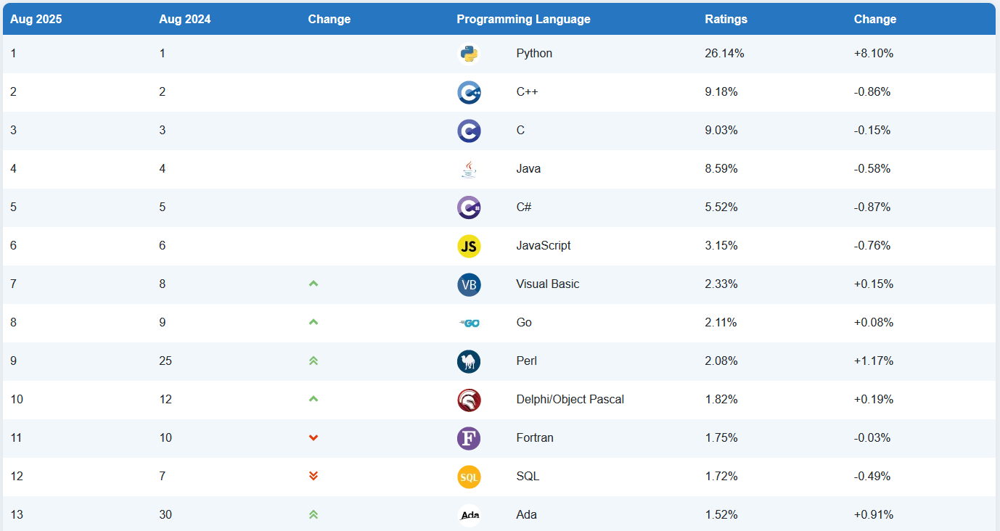
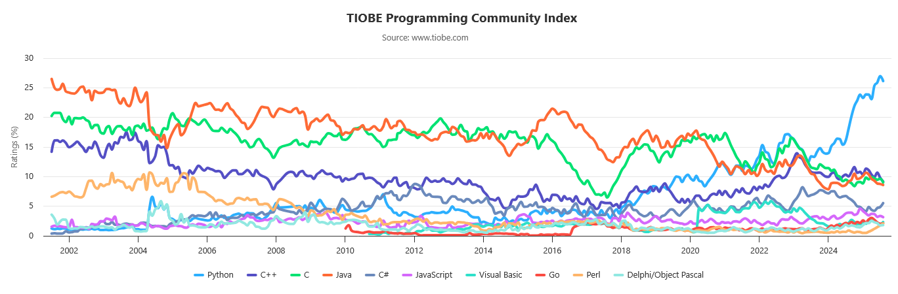

{ .img1 }

 

## Python y otros lenguajes de programación, índice TIOBE
- El índice de programación TIOBE es un indicador de la popularidad de las lenguas de programación.  
- El índice se actualiza una vez al mes. Las calificaciones se basan en el número de ingenieros cualificados en todo el mundo, cursos y proveedores de terceros. Los sitios web populares Google, Amazon, Wikipedia, Bing y más de otros 20 se utilizan para calcular las calificaciones.  
- El índice TIOBE no trata **de decidir del mejor lenguaje de programación** o del lenguaje en el que se han escrito la mayoría de las líneas de código, sino de su popularidad en un momento dado.  
- El índice se puede (debe) utilizar para comprobar si nuestras habilidades de programación están actualizadas o para tomar una decisión estratégica sobre qué lenguaje de programación debe ser adoptado cuando se comience a construir un nuevo sistema de software.  

La definición del índice TIOBE se puede encontrar <a href=https://www.tiobe.com/tiobe-index>aquí</a>.

### Popularidad de Python según TIOBE
En el periodo 08/24-08/25, podemos ver el incremento significativo de la popularidad del lenguaje de programación Python.

### Índice TIOBE
Con la figura de aquí abajo podemos ver las popularidades sobre un periodo de tiempo más extenso.

## IDE (Integrated Development Environment)
Un **IDE** (**Integrated Development Environment o Entorno de Desarrollo Integrado**) es un **programa que reúne en una sola aplicación todas las herramientas necesarias para desarrollar software**.

📌 Sus componentes principales suelen ser:

* **Editor de código**: para escribir el programa con resaltado de sintaxis y ayudas.
* **Compilador o intérprete**: para traducir el código fuente a un lenguaje que el ordenador pueda ejecutar.
* **Depurador (debugger)**: para detectar y corregir errores durante la ejecución.
* **Gestión de proyectos**: organiza archivos, dependencias y librerías.
* **Autocompletado y sugerencias**: acelera la escritura de código.

🔧 Ejemplos de IDE muy usados:

* **Visual Studio Code** (aunque es más un editor avanzado con extensiones que un IDE completo).
* **Eclipse** (muy usado en Java).
* **IntelliJ IDEA**.
* **PyCharm** (para Python).
* **NetBeans**.

### IDE en línea

hasta aqui https://creately.com/diagram/example/6gBk8ZtT4zi/diagrama-de-flujo-de-registro-de-usuarios
https://arturoblasco.github.io/prg/ut01/ut0102/#representacion-de-algoritmos

file:///C:/Users/titan/Downloads/UD1_Fundamentos_Programaci%C3%B3n.pdf

https://victorponz.github.io/programacion-java/introduccion-a-la-programacion

https://nachoiborraies.github.io/python/01.html
https://victorponz.github.io/programacion-java/introduccion-a-la-programacion

https://nachoiborraies.github.io/python/01.html
https://victorponz.github.io/programacion-java/introduccion-a-la-programacion
