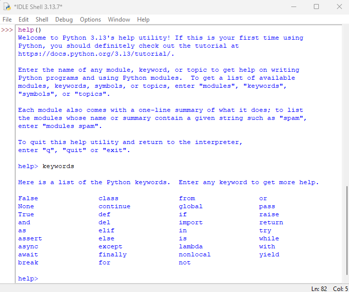
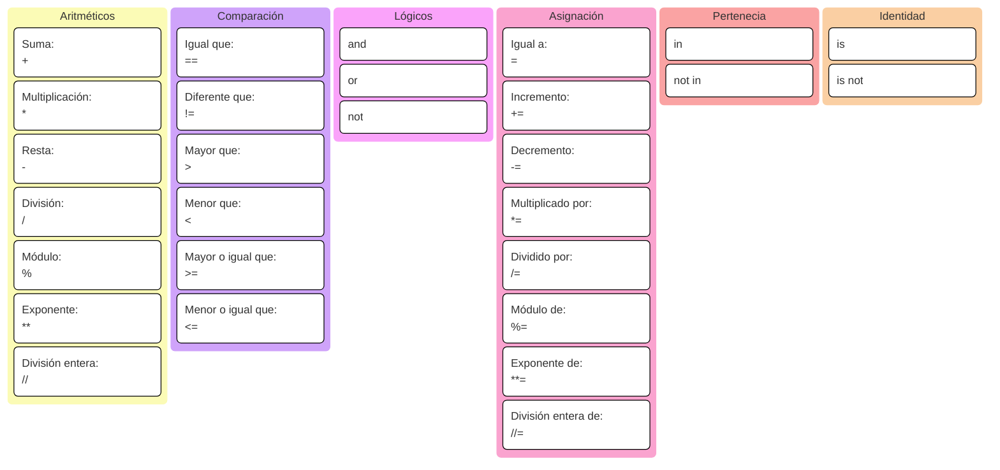
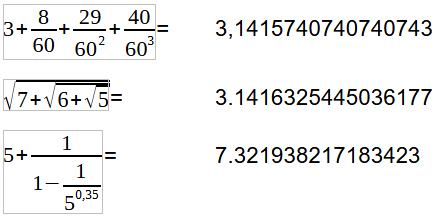
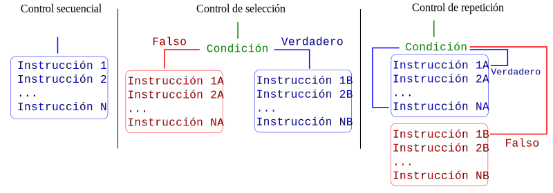
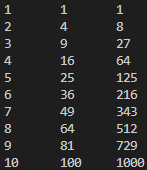

{ .img1 }

<br>


## **Sintáxis básica**
La sintaxis es a la programación lo que la gramática es a los idiomas. De la misma forma que la frase “Yo estamos aquí” no es correcta ...tampoco lo es un programa con errores de sintaxis, ya que el ordenador no podrá interpretarlo ni ejecutarlo de la manera esperada.

Ejemplo de sintaxis correcta de un programa hecho en Python.  

```py
# Definimos una variable x con una cadena
x = "El valor de (a+b)*c es"

# Podemos realizar múltiples asignaciones
a, b, c = 4, 3, 2

# Realizamos unas operaciones con a,b,c
d = (a + b) ** c

# Definimos una variable booleana
imprimir = True

# Si imprimir, print()
if imprimir:
    print(x, d)

# Salida: El valor de (a+b)*c es ??
```

!!! Pregunta 
    ¿Qué realiza el programa anterior?

### Elementos de un programa de Python
Un programa de Python es un fichero de texto (codificado en formato UTF-8) que contiene expresiones y sentencias que se consiguen combinando los elementos básicos del lenguaje.  

El lenguaje Python está formado por elementos (tokens) de diferentes tipos:

  - Lineas y espacios.
  - Palabras reservadas (keywords)
  - Variables, operadores y expresiones
  - Funciones integradas (built-in functions).
  - Delimitadores
  - Identificadores

!!! Pregunta 
    Del ejemplo de código anterior, identificar los diferentes elementos constituyentes del programa.

En la documentación de Python se puede consultar una descripción mucho más detallada y completa de <a href=https://docs.python.org/3/reference/lexical_analysis.html>los elementos constitutivos</a> del lenguaje Python.

Para que un programa se pueda ejecutar, el programa debe ser sintácticamente correcto, es decir, utilizar los elementos del lenguaje Python respetando su reglas de "ensamblaje". 

### Líneas y espacios
Básicamente, un programa de Python está formado por líneas de texto.
```python
radio = 5
area = 3.1415 * radio ** 2
print("La superificie es:", area)
```
<br>
Se recomienda que cada línea contenga una única instrucción, aunque puede haber varias instrucciones en una línea, separadas por un punto y coma (;).
```python
radio = 5; area = 3.1415 * radio ** 2
print("La superificie es:", area)
```
<br>
Los elementos del lenguaje se separan por espacios en blanco (normalmente, uno), aunque en algunos casos no se escriben espacios:

- Entre los nombres de las funciones y el paréntesis
- Antes de una coma (,)
- Entre los delimitadores y su contenido (paréntesis, llaves, corchetes o comillas)
```py
def suma(a,b):
  resultado = a + b
  return resultado

print(suma(2,3))
```

### Delimitadores
Los delimitadores son los caracteres que permiten delimitar, separar o representar expresiones. 

🔹 1. Paréntesis, corchetes y llaves  

- ( ) → agrupar expresiones, llamadas a funciones, tuplas  
- [ ] → listas, indexación, slicing  
- { } → diccionarios, conjuntos, bloques en f-strings  

<br>
🔹 2. Separadores de código

- coma ( , ) → separa elementos en listas, tuplas, parámetros de funciones
- 2 puntos ( : ) → define bloques (if, for, def, class, etc.) o pares clave:valor en diccionarios
- punto ( . ) → acceso a atributos y métodos (obj.attr)
- punto y coma ( ; ) → separa varias instrucciones en una misma línea

<br>
🔹 3. Delimitadores de cadenas

- Comillas simples: 'texto'
- Comillas dobles: "texto"
- Comillas triples: '''texto''' o """texto""" (también para docstrings y cadenas multilínea)

<br>
🔹 4. Delimitadores especiales

- Igual ( = ) → asignación
- Flecha ( -> ) → anotaciones de tipo en funciones (def f(x) -> int:)
- 3 puntos ( ... ) (ellipsis) → marcador especial usado en slicing o como placeholder

```py
( )   [ ]   { }
,     :     .     ;
@     =     ->    ...
' '   " "   ''' '''   """ """
```

<br>
**Nota**:  
Los delimitadores no se pueden usar para otra cosa que no sea su uso como delimitador. Cualquier uso indebido generará un error en tiempo de ejecución.

!!! Ejercicio
    Escribir un programa que pretenda asignar el valor 64 a una variable de nombre vari@bl&.
    Comprobar lo que ocurre entonces. 

<br>
**Nota**:  
Los delimitadores # y “”” “”” permiten insertar comentarios dentro de un programa.
```py
# Esta linea está comentada. El interprete no la ejecutará
# 
a = True and False
print("El valor de 'a' es:", a, "y es de tipo: ", type(a))
#
"""
Nada de lo contenido entre las comillas dobles será ejecutado
b = True and True
print("El valor de 'b' es:", b, "y es de tipo: ", type(a))
"""
```

!!! Ejercicio 
    En el código del ejemplo anterior encontrar la línea dónde se hace uso a la ver de comillas simples y comillas dobles.  
    ¿Por qué se usa esa sintaxis?

<br>
**Nota**:  
El delimitador contrabarra ( \ ) permite truncar una linea muy larga en varias líneas.
Por motivos de legibilidad, se recomienda que las líneas no superen los 79 caracteres. Si una instrucción supera esa longitud, se puede dividir en varias líneas usando la contrabarra ( \ ):

```py
radio = 5
area = 3.14159265358979323846 \
       * radio **2
print(area) 

texto = "Perdóname, amigo, de la ocasión que te he dado de parecer\
         loco como yo, haciéndote caer en el error en que yo he caído\
         de que hubo y hay caballeros andantes en el mundo."
print(texto)
```

!!! Ejercicio
    Escribir el programa anterior y comprobar el resultado.  
    Intentar arreglarlo de forma intuitiva. 

### **Palabras reservadas**
Las palabras reservadas de Python son las que forman **el núcleo del lenguaje** Python y **no se pueden usar para nombrar otros elementos** (variables, funciones, …).  
Se puede acceder al listado de las palabras reservadas desde la ayuda de IDLE (Python 3.11, 64bits).

{ .img1 }

!!! Ejercicio 1
    Lanzar el interpretador **idle** (se instala a la vez que python).  
    Escribir en la terminal **help** y luego **keywords**.  

!!! Ejercicio 2
    ¿Podéis intuir el significado de alguna palabra reservada?

## **Variables**
De forma general, una variable es **un espacio de memoria** con un nombre asociado que se utiliza para **almacenar y manipular datos** que pueden **cambiar durante la ejecución** del programa.

### Declaración de variables
Python es un lenguaje de tipado dinámico por lo que no hace falta declarar **el tipo de dato** que se asignará a una variable. De igual manera una variable puede cambiar de tipo conforme la ejecución del programa (lo que no se considera una buena práctica de programación), por ello, se debe tener cuidado con la sintaxis para definir cada tipo de dato.
```py
a = 5
b = 6
c = '¡Hola mundo!'

print(c, a+b)
``` 
!!! Ejercicio
    Ampliar el programa anterior dónde se le asignará un nuevo valor a la variable 'b' y se le asignará un valor númerico a 'c'.  
    Escribir en pantalla (print()) el resultado de la suma de b+c. 
    
### Variables de tipo entero (int)
Los enteros son un tipo de dato básico en cualquier lenguaje de programación.  
```py
a = 5
print(a, type(a))
``` 
<br>
Si se usan enteros de 32 bits el rango a representar es de -2^31 a 2^31–1.  
Con 64 bits, el rango es de  -2^63 a 2^63–1.  
**No tenemos que preocuparnos** de la codificación de los enteros, ya que Python se encarga de asignar más o menos memoria al número en función de su valor. 
```py
a = 5
b = 16
c = a ** b
print(c)
``` 
!!! Ejercicio
    Ampliar el programa anterior para evidenciar la asingación dinámica del tipo de variable en python. 

### Variables de tipo coma flotante (float)
Las variables de tipo coma flotante (o float) son aquellas que almacenan números reales (es decir, con parte decimal).
```py
x = 3.14   # float
y = -2.5   # float
z = 0.0    # float
```
<br>

Los float se pueden escribir de dos formas:

1. Decimal normal:
```py
pi = 3.14159
```
<br>

1. Notación científica (usando e o E para potencias de 10):
```py
avogadro = 6.022e23   # 6.022 × 10^23
electron = 1.6e-19    # 1.6 × 10^-19
```

1. Precisión de las variables de tipo flotante.
    - Los float en Python son de doble precisión (64 bits, estándar IEEE 754) lo que da ~15–17 cifras decimales de precisión.
    ```py
    a = 7.0
    b = 5.0
    print(a, b, a+b, type(a+b))
    ```
    - No son exactos en muchos casos por cómo se representan en binario.
    ```py
    # Demostración del problema de precisión con float en Python
    print("¿La suma de 0.1 y 0.2 es igual a 0.3?", 0.1 + 0.2 == 0.3) 
    print("Valor real de 0.1 + 0.2:", 0.1 + 0.2)   

    # Solución con librería Decimal para cálculo exacto
    from decimal import Decimal
    a = Decimal("0.1")
    b = Decimal("0.2")
    c = Decimal("0.3")
    print("Con Decimal:", a + b == c)
    ```

### Variables de tipo booleano (bool)
Las variables booleanas sólo pueden adoptar dos valores: **verdadero (True)** o **falso (False)**.
```py
a = True
b = False
print(type(a), type(b))
```


!!! Ejercicio
    Ampliar el programa anterior para que compara el tipo resultante de la suma lógica de a y b, y también compare a con la negación de b. 

### Variables de tipo número complejo
En Python, los números complejos se representan literalmente con el tipo complex.  
En python, uUn número complejo tiene la forma: a + bj donde j es la unidad unidad imaginaria (en matemáticas se usa i).
```py
# Forma literal de escribir números complejos
a = 5 + 7j
b = 3 - 4j
c = a + b
print(c)
# Uso de complex para definir números complejos
d = complex(2, 3)   # (2+3j)
e = complex(-1, -5) # (-1-5j)
f = d * e
print(d)
```

!!! Ejercicio
    Calcular con papel y boli el resultado de la variable 'f'.

### Variables de tipo cadena de caracteres (string) 
Es un tipo de dato que contiene símbolos (alfanuméricos). Los strings se definen utilizando **comillas dobles o simples**.
```py
a = "hello"
b = " "
c = "world"
d = a + b + c
print(a,b,c)
print(d)
```

!!! Ejercicio
    Rehacer el programa anterior para que esta vez, las variables de tipo string contengan valores númericos.

## **Operadores**
Los operadores son símbolos que indican al programa que realice una operación específica, como aritmética, comparación, lógica, etc.

<div class="operadores">

</div>

### **Operadores aritméticos**
Los operadores aritméticos permiten realizar operaciones aritméticas básicas con las variables de tipo numérico. 

|Operador |	Descripción |	Ejemplo|
|:-:|-|-|
|+| 	Realiza Adición entre los operandos |	12 + 3 = 15|
|-| 	Realiza Substracción entre los operandos |	12 - 3 = 9|
|*| 	Realiza Multiplicación entre los operandos |	12 * 3 = 36|
|/ |	Realiza División entre los operandos |	12 / 3 = 4|
|% 	|Realiza un módulo entre los operandos |	16 % 3 = 1|
|** |	Realiza la potencia de los operandos |	12 ** 3 = 1728|
|// |	Realiza la división con resultado de número entero |	18 // 5 = 3|


!!! Ejercicio  
    Escribir la expresión que permita calcular los siguientes valores: 

    { .potencias }

**Nota:**  
Aunque no lo hayamos visto aun, existe una manera más simple de escribir las expresiones. Si usamos la biblioteca math accedemos a todos sus operadores matemáticos (métodos) lo que da más claridad al código.

```py 
import math

# Calcular la raíz cuadrada de un valor
a = 4
b = math.sqrt(a)
print(b)

# Calcular el coseno de 60º
c = math.cos(60)
print(c)
```

!!! Ejercicio  
    Copiar el código anterior y comprobar los resultados obtenidos.  
    ¿Son los esperados?  
    ¿Qué se debería hacer para que sean correctos?


### **Operadores de comparación**
Permiten efectuar comparaciones entre objetos de Python.  
El resultado de una comparación es un valor booleano (True o False).  

|Operador|	Descripción |	Ejemplo|
|-|-|-|
|> |	Devuelve True si el operador de la izquierda es mayor que el operador de la derecha |	12 > 3 devuelve True|
|< 	|Devuelve True si el operador de la derecha es mayor que el operador de la izquierda |	12 < 3 devuelve False|
|== |	Devuelve True si ambos operandos son iguales |	12 == 3 devuelve False|
|>= |	Devuelve True si el operador de la izquierda es mayor o igual que el operador de la derecha |	12 >= 3 devuelve True|
|<= |	Devuelve True si el operador de la derecha es mayor o igual que el operador de la izquierda |	12 <= 3 devuelve False|
|!= |	Devuelve True si ambos operandos no son iguales |	12 != 3 devuelve True|

**Nota:** 
Los operadores relacionales solo se pueden ejecutar para comparar valores del mismo tipo.

- "a" > 10 devolverá un error.
- [0,4] < (1,2) devolverá un error al no poder comparar una lista con una tupla.
- También se pueden concatenar: 3 == 3 >= 2 (true)
      
!!! Ejercicio  
    Transcribir a python las expresiones que acabamos de ver.      

### **Operadores lógicos**
Sirven para realizar operaciones de lógica booleana entre valores de tipo bool. Los operadores lógicos son (las palabras reservadas) **and, or y not**.  

|Operador|	Descripción |	Ejemplo|
|-|-|-|
|and|Verdadero si ambas condiciones son True|True and False → False|
|or|Verdadero si al menos una condición es True|True or False → True|
|not|Invierte el valor de la condición|not True → False|

**Nota:**  
Cuidado con la sintaxis. Si usamos los símbolos de la lógica combinatoria (+, *, ...) los resultados pueden no ser los esperados.

### **Operadores de asignación**
Un operador de asignación sirve para **asignar un valor** a una variable. Generalmente se combina con otros operadores (aritmética, bit a bit, ...) donde la operación se realiza en los operandos y el resultado se asigna **al operando izquierdo**.

|Operador|	Descripción |	
|-|-|
|= |	a = 5. El valor 5 es asignado a la variable a|
|+= |	a += 5 es equivalente a a = a + 5|
|-= |	a -= 5 es equivalente a a = a - 5|
|*= |	a *= 3 es equivalente a a = a * 3|
|/= |	a /= 3 es equivalente a a = a / 3|
|%= |	a %= 3 es equivalente a a = a % 3|
|**= |	a **= 3 es equivalente a a = a ** 3|
|//= |	a //= 3 es equivalente a a = a // 3|

### **Operadores de pertenencia**
Un operador de pertenencia se emplea para identificar pertenencia en alguna secuencia (listas, strings, tuplas).  

- **in** y **not in** son operadores de pertenencia.
- **in** → devuelve True si el valor especificado se encuentra en la secuencia. En caso contrario devuelve False.
- **not in** → devuelve True si el valor especificado no se encuentra en la secuencia. En caso contrario devuelve False.

Ejemplos de expresiones que usan operadores de pertenencia.
```py
a = [1,2,3,4,5]
  
# ¿Está 3 en la lista a?
print(3 in a) # Muestra True 
  
# ¿No está 12 en la lista a?
print(12 not in a) # Muestra True
  
str = "Hello World"
  
# ¿Contiene World el string str?
print("World" in str) # Muestra True
  
# ¿Contiene world el string str? (nota: distingue mayúsculas y minúsculas)
print("world" in str) # Muestra False  

print("code" not in str) # Muestra True
```

### **Operadores de identidad**
Un operador de identidad se emplea para comprobar si dos variables emplean la misma ubicación en memoria.

- **is** → comprueba si dos variables hacen referencia al mismo objeto en memoria.
- **is not** → lo contrario, comprueba si no son el mismo objeto.

```py
a = [1, 2, 3]
b = a
c = [1, 2, 3]

print(a is b)      # True, porque b apunta al mismo objeto que a
print(a is c)      # False, aunque tengan el mismo contenido, son objetos distintos
print(a == c)      # True, porque los valores dentro de la lista son iguales
print(a is not c)  # True, porque no son el mismo objeto (las listas son objetos mutables) 
```

🔎 Importante:  

- **is** no se debe usar para **comparar valores**, solo para identidad de objetos.
- Para comparar valores, siempre se usará ==.

### **Ejercicios con operadores**
FALTA

## **Estructuras de control**
Un código es una secuencia de instrucciones, que por norma general son ejecutadas una tras otra.   
Sin embargo, en muchas ocasiones no basta con ejecutar las instrucciones una tras otra desde el principio hasta llegar al final. Puede ser que ciertas instrucciones se tengan que ejecutar si y sólo si se cumple una determinada condición.

{ .img1 }

En un lenguaje de programación, las estructuras de control permiten modificar el flujo de ejecución de un conjunto de instrucciones. Los tipos más comunes son:

|Elemento|Tipo|
|-|-|
|**if, elif, else**|Estructura condicionales|
|**for**|Bucle (o iteración)|
|**while**|Bucle (o iteración)|
|**try-except**|Manejo de excepciones(errores)|  

### **Bucle condicional if-elif-else**
- La estructura de control **if** permite que un programa ejecute unas instrucciones cuando se cumpla una condición.
```py
if cond1:
    # hacer algo 
    pass
```

!!! Ejercicio  
    Realizar un programa con un bucle **condicional if** que haga lo siguiente:  
    1. El programa evaluará la nota de un alumno  
    2. Si la nota es superior o igual a 5, se mostrará por terminal el texto: "Enhorabuena, has aprobado el examen".  
    3. ¿De qué manera podriamos sacar por terminal un mensaje de "Lamentablemente, no has aprobado el examen" si el alumno saca una nota inferior a 5?  
    4. ¿Cuál es la función del placeholder **pass**?  

- La estructura de control **if else** permite que un programa ejecute unas instrucciones **cuando se cumple** una condición y otras instrucciones **cuando no se cumple** esa condición.
```py
if cond1:
    # hacer una cosa
    pass 
else:
    # hacer otra cosa
    pass 
```

!!! Ejercicio  
    Realizar un programa con un bucle **condicional if else** que haga lo siguiente:  
    1. El programa evaluará la nota de un alumno.  
    2. Si la nota es superior o igual a 5, se mostrará por terminal el texto: "Enhorabuena, has aprobado el examen".  
    3. Si la mota es inferior a 5, se mostrará por terminal el texto: "Lamentablemente, no has aprobado el examen".  

- La estructura de control **if elif else** permite encadenar varias condiciones (elif es una contracción de else if).  
```py
if cond1:
    # hacer una cosa 1 
elif cond2:
    # hacer otra cosa 2
elif cond3: 
    # hacer otra cosa 3
...
elif cond(n):
    # hacer otra cosa (n)
else:
    # hacer un cosa por defecto
```

!!! Ejercicio 1  
    Realizar un programa con un bucle **condicional if elif else** que haga lo siguiente:  
    1. El programa evaluará la nota de un alumno.  
    2. Si la nota es superior o igual a 5 e inferior a 7, se mostrará por terminal el texto: "Has aprobado el examen".  
    3. Si la nota es superior o igual a 7, se mostrará por terminal el texto: "Excelente examen"
    4. Si la mota es inferior a 5, se mostrará por terminal el texto: "Lamentablemente, no has aprobado el examen".

!!! Ejercicio 2  
    Realizar un programa con un bucle **condicional if elif else** que haga lo siguiente:  
    1. El programa evaluará la nota de un alumno. Esa nota deberá estar comprendida entre 0 y 100. Si la nota está fuera de rango se mostrará en la terminal "La calificación debe estar en la escala de 0 a 100"   
    2. Si la nota es superior o igual a 70 e inferior o igual a 74, se mostrará por terminal el texto: "Regular".  
    3. Si la nota es superior o igual a 75 e inferior o igual a 84, se mostrará por terminal el texto: "Bien".  
    4. Si la nota es superior o igual a 85 e inferior o igual a 94, se mostrará por terminal el texto: "Muy bien".  
    5. Si la nota es superior o igual a 95 e inferior o igual a 100, se mostrará por terminal el texto: "Excelente".
    6. Si no se cumple ninguna de esas condiciones, mostraremos en la terminal: "Insuficiente".  
 
!!! Ejercicio 3  
    1. Supongamos que tenemos una lista de nota: lista = [1,2,4,7,9].  
    2. Supongamos que tenemos la nota = 8 y queremos saber si algun alumno ha sacado esa nota.  
    3. Realizar un programa con un bucle **condicional if else** que permita saber si el valor de **nota** está incluido dentro de lista. 


### **Bucle de repetición for**
El **bucle for** es una estructura de control de repetición, en la cual se conocen (a priori) el número de iteraciones a realizar. El **bucle for** usa **un iterable** que define las veces que se ejecutará el código. 
```py
for valores in iterador:
    # Hacer alguna cosa
    pass
```

#### **Iterador range()**
**range()** es una función que devuelve un iterador de números enteros en un rango definido.  
```py
range(inicio, fin, paso)
```
**Dónde:**  

- inicio → número desde el que empieza (por defecto 0).
- fin → número donde se detiene (⚠️ no se incluye).
- paso → incremento entre números (por defecto 1).

**Ejemplos**  

1. Recorrer un rango simple (0 a 4):
```py
for i in range(5):
    print(i)
``` 
1. Rango con inicio y fin:
```py
for i in range(2, 6):
    print(i)
```
1. Rango con paso:
```py
for i in range(3, 10, 2):
    print(i)
```
1. Contar hacia atrás (paso negativo):
```py
for i in range(10, 0, -2):
    print(i)
```

!!! Ejercicio 1  
    Ejecutar los bucles **for** y comprobar los resultados obtenidos.    

!!! Ejercicio 2 
    Realizar un programa que determine:
    1. Cuantos números entre 1 y 500 son, a la vez, **múltiplos de 7 y 8**.
    2. Muestre los números encontrados.    

#### **Objetos iteradores**
En Python se puede iterar prácticamente sobre cualquier objeto iterable, como por ejemplo un string, una lista, una tupla o un diccionario... A continuación varios ejemplos de objetos iterables.

- Bucle **for** sobre variable numérica. 
```py
interación = 5

for i in "interación":
  print("Iteración: ", i)
```

- Bucle **for** sobre lista de valores. Para realizar la iteración se toma la cantidad de valores de la lista. 
```py
lista= ["Este", "es", "un", "gran", "día"]

for i in lista:
  print("Iteración: ", i)
```
- Otra forma de iterar sobre una lista. 
```py
lista = ["Este", "es", "un", "gran", "día"]

for i in range(len(lista)):
    print("Iteración:", i, "Elemento:", lista[i])
```
- Otra forma de iterar sobre las propiedades de una lista. 
```py
lista = ["Este", "es", "un", "gran", "día"]

for indice,valor in enumerate(lista):
    print("Iteración:", indice, "Elemento:", lista[indice])
```
- También se puede iterar sobre varios iterables a la vez usando la función zip()
```py
nombres = ["Ana", "Luis", "Marta"]
edades = [25, 30, 22]

for nombre, edad in zip(nombres, edades):
    print(nombre, "tiene", edad, "años")
```
**zip()**, como su nombre lo deja entrever **une** los elementos de las listas, posición a posición.  
Si una lista es más larga que la otra, zip se detiene en la más corta.

#### Bucle de repetición while
El bucle while ejecuta un bloque de instrucciones mientras se cumpla una condición. A diferencia del bucle **for**, en el **while** normalmente no sabemos de entrada cuántas veces se va a repetir."
```py
while condicion:
    # hacer alguna cosa 
``` 

En el siguiente ejemplo, vemos cómo el bucle se repite hasta que la **variable auto-incrementable k** alcanza la longitud de la cadena (string) nombre.
```py
nombre = "Pablo"
k = 0
while k < len(nombre):
    print(nombre[k])
    k += 1
```

### **Sentencias de control de flujo: break y continue**
#### **Sentencia break**
La sentencia **break** permite alterar el comportamiento de los bucles **while** y **for**. Concretamente, permite **terminar de manera anticipada** con la ejecución del bucle.

- Break en un bucle **for**:
```py
palabra = "Python"
letra_a_encontrar = "o"

for letra in palabra:
  if letra == letra_a_encontrar:
    print(f"Hemos encontrado la letra {letra_a_encontrar}")
    # print("hemos encontrado la letra ", letra_a_encontrar)
    break
  print(f"Vamos por la letra: {letra}")
  #print("Vamos por la letra:", letra)
```

- Break en un bucle **while**:
```py
from random import randint

print("¡Bienvenido al juego: 'Adivina el número'")
numero = randint(1,10) # genera un entero entre 1 y 10
intentos = 1 # inicializamos la variable incrementable

while True: #definimos un bucle while infinito
  valor = int(input("Introducir un número entero entre 1 y 10: "))
  if valor == numero:
    print(f"Has adivinado el número correcto {numero} después de {intentos} intentos")
    break
  else:
    print(f"{valor} no es el numero correcto, intentalo nuevamente\n")
  intentos += 1 
```  

#### **Sentencia continue**
Al igual que break, la sentencia continue permite modificar el comportamiento de los bucles while y for.  
En el caso de continue, **se salta todo el código restante en la iteración actual** y vuelve al principio en el caso de que aún queden iteraciones por completar.  
La diferencia entre break y continue es que continue no rompe el bucle, sino que pasa a la siguiente iteración saltando el código pendiente.

En este ejemplo podemos ver que cuando el programa encuentra la letra **a**, no se imprime por consola. No obstante el bucle no se interrumpe y continua hasta completar todas las letras.
```py
cadena = "Python es mi lenguaje de programacion favorito"
letra_a_eliminar = "a"

for letra in cadena:
  if letra == letra_a_eliminar:
    continue
  print(letra, end="") #end="" evita el salto de línea
```

### **Sentencia de control try-except**
Las sentencias de control **try** y **except** se usan para manejar errores (más comúnmente llamados excepciones) y evitar que nuestro programa se detenga inesperadamente.
🔹 Concepto básico.
- El bloque try contiene el código que podría generar un error.
- El bloque except contiene el código que se ejecuta si ocurre un error dentro del try.
Esto permite “atrapar” errores y manejarlos de forma controlada.
🔹 Ejemplo sin especificar la excepción. 
```py
while True:
    entrada = input("Introduce un número (o 'salir' para terminar): ")
    
    if entrada.lower() == "salir":  # comprueba si el usuario quiere salir
        print("Programa terminado.")
        break
    
    try:
        numero = int(entrada)
        resultado = 10 / numero
        print("El resultado es:", resultado)
    except ValueError: # detecta si se no ha introducido un valor numerico
        print("¡Eso no es un valor numérico!")
    except ZeroDivisionError: # detecta si se intenta dividir por '0'
        print("Estás intentando dividir por cero.")

```

### Bucle anidados.
Ya hemos visto algún que otro bucle anidado sin decirlo. Un **bucle anidado** es un bucle que se **encuentra incluido** en el **bloque de sentencias** de otro bloque.  
Los bucles pueden tener muchos niveles de anidamiento, lo que suele disparar resultados inesperados en tiempos de ejecución. De igual manera se deberá prestar una especial atención a la ubicación de las sentencias **break** y **continue**.
```py
print("Tabla de multiplicación hasta 10")
input("Pulsar enter para continuar")

for i in range(1, 11):  # bucle externo
    print("Tabla del: ", i)
    for j in range(1, 11):  # bucle interno
        print(i, "x", "j", "=", i*j)
```       

!!! Exercice "Ejercicio 1"  
    Modificar el programa anterior para que, al alcanzar **el bucle interno** el valor **7**, este omita ese valor y continue el bucle sobre los valores restantes. 

!!! Exercice "Ejercicio 2" 
    Modificar el programa anterior para que, al alcanzar **el bucle externo** el valor **5** y **el bucle interno** el valor **7**, se salga de la ejecución del programa con un mensaje de despedida.  
    ¿Por qué incluir un mensaje de despedida?

## Funciones de entrada y salida.
Hasta ahora hemos usado la función print() principalmente para mostrar mensajes en pantalla, sin detenernos demasiado en todas las cosas que podemos hacer con ella. Pero, a medida que aprendemos más de Python, necesitamos crear programas más completos que puedan interactuar con el usuario. Para lograrlo, conoceremos también la función input(), que nos servirá para pedir datos por teclado y guardarlos en variables que después usaremos en nuestros programas. 

### La función print()
La función **print()** es una función incorporada (builtin) de Python que escribe texto en un flujo (por defecto, la consola) y no **devuelve nada**. 

**Sintaxis de print()**
```py
print(*objects, sep=' ', end='\n', file=sys.stdout, flush=False)
```
**Dónde:**

- ***objects**: cualquier número de valores a imprimir. Cada uno se convierte con str().  
- **sep**: separador entre objetos (por defecto un espacio).  
- **end**: lo que se añade al final (por defecto salto de línea).  
- **file**: flujo destino; por defecto sys.stdout (puedes usar sys.stderr o un archivo abierto).  
- **flush**: si True, vacia el buffer inmediatamente.  

!!! Warning "Atención"  
    Las funciones se diferencian en lo que hacen después de ejecutarse.  

    - Funciones que devuelven algo: realizan una tarea y entregan un resultado usando **la palabra clave return**. Ese valor puede guardarse en una variable o usarse en otros cálculos.  
    - Funciones que no devuelven nada: realizan una acción (por ejemplo, mostrar un mensaje en pantalla), pero no entregan ningún valor; su resultado no puede almacenarse ni usarse más adelante.

#### **Argumentos de print()**  

- **Separadores**
En python se puede configurar como aparecerán los datos en la terminal.
```py
print("A", "B", "C")                     
print("A", "B", "C", sep="") # sin separacion entre los datos                     
print("A", "B", "C", sep=" ") # sep=" " es el valor por defecto                
print("A", "B", "C", sep=",")            
print("A", "B", "C", sep=" >>> ")            
print("A", "B", "C", sep=" \U0001F600 ") # sep admite símbolos soportados por python
```
<br>
- **Fin de línea \n**
En Python, el valor predeterminado de end es **\n** (salto de línea).  
Si el valor no es nulo, entonces se imprimirá al final de la línea el contenido de end **y no se saltará a la linea siguiente si no añadimos \n**.
```py
print("No saltamos de linea.", end="")             
print(" Este contenido sigue en la primera linea.")             
print("\nSaltamos una linea ANTES Y DESPUES de pintar el texto.\n")             
print("Ponemos un final de linea personalizado y no saltamos de linea.", end="...")
print(" Este texto sigue en la linea anterior")             
print("Final de linea personalizado CON salto de linea", end="... \n") 
print("Final de linea con caracteres especiales", end=" ✅\n") 
```
<br>
- **Tabulación \t**  
El simbolo **\t debe incorporarse al texto** que queremos tabular.
```py
print("Menu del dia")
print("\tPrimer plato.")
print("\tSegundo plato.")
print("\t Postre.")
print("-------------------------")
print("---\tPrecio\tFinal.")
```
<br>
- **Retroceso \r**  
A la inversa de **tabulación** el símbolo **\r** permite realizar retrocesos a **inicio de línea**.
```py
print("Menu del dia")
print("\tPrimer plato.")
print("\tplato \rSegundo")
```

    !!! Warning "Peligro"  
        El retroceso **\r** sobreescribe los datos. 
```py
print("Menu del dia")
print("Primer plato.")
print("Segundo plato.", end="")
print("\r-sobreescribo-")
```
<br>

- **Escribir variables, texto y ejecutar código**  
Como ya hemos visto, la función print() permite combinar texto (**siempre entre comillas)**, mostrar valores de variables y ejecutar código.
```py
valor = 12
texto = "El precio del articulo es de"
print(texto, valor,"euros")
```
<br>
Ejecución de funciones básicas de python.
```py
valor1 = 12
valor2 = 5
print("El resultado de 12 x 5 son:",valor1*valor2,"exactos")
```
<br>
Ejecución de código
```py
aprobado = 7.2
print("Aprobado" if aprobado >= 5 else "Suspenso")
```

#### Ejercicios con print()
!!! Exercice "Ejercicio 1"  
    Escribir un código cuya salida en terminal sea la siguiente.   
    


#### **Formato de cadenas de caracteres para su uso con (o sin) print()**
- **Cadenas f**  
Muchas veces puede resultar tiedoso ir intercalando texto y valores de variables. A partir de python 3.6, la nueva notación **cadena f{}** soluciona es problema.  
Una cadena f contiene **variables y expresiones** entre llaves "{}" que se sustituyen directamente por su valor. 
```py
valor1 = 5
valor2 = 7
valor3 = 35
texto = "euros"
texto1 = "Pablo"

# sin cadenas f
print("El resultado de la mutiplicacion de",valor1,"por",valor2,"es",valor3,texto)
# con cadenas f
print(f"El resultado de la mutiplicacion de {valor1} por {valor2} es {valor3} {texto}")
# Tambien se ejecutan funciones dentro de f
print(f"El resultado de la mutiplicacion de {valor1} por {valor2} es {valor1*valor2} {texto}")
# Tambien se ejecuta código dentro de f
print(f"El resultado del examen de {texto1} cuya nota el {valor2} es {"Aprobado" if valor2 >= 5 else "Suspenso"}")
```

- **format()**
Otra manera de dar formato a cadenas de carácteres puede hacerse usando el método format() 
```py
print("El resultado del examen de {} cuya nota el {} es {}".format(texto1,valor2,"Aprobado" if valor2 >= 5 else "Suspenso"))
```

#### **Formato de valores para su uso con (o sin) print()**
También podemos dar formato a los valores. Esta posibilidad resulta particularme útil cuando la usamos con print() ya que podemos controlar cómo se ven los números, cadenas o fechas (decimales, ancho, alineación, relleno, etc.).

- Decimales y números:
```py
# con cadenas f
hexa = 255
print(f"Representacion en hexadecimal de 255: {hexa :X}")

# con format
print("Representacion en hexadecimal de 255: {:X}".format(255)) 
```
<br>
- Mostrar con ceros a la izquierda:
```py
print("Número: {:05d}".format(42))  # 00042
```
<br>
- Separador de miles:
```py
print("Precio: {:,}".format(12000000))  # 12,000,000
```
<br>
- Hexadecimal, binario, porcentaje:
```py
print("Representacion en hexadecimal de 255: {:X}".format(255)) 
print("Representacion en binario de 8: {:b}".format(8))      
print("Equivalente en porcentaje de 0.85: {:.1%}".format(0.85))  
```
<br>

#### **Ejercicios**
!!! Exercice "Ejercicio 1"  
    De los ejemplos anteriores, escribir el código para que, en vez de format, se usen cadenas f.

!!! Exercice "Ejercicio 2"  
    Adaptar el siguiente código para que la salida por terminal solo muestre 2 decimales.
    ```py
    valor1 = 5.2536524
    valor2 = 7.3915896
    print(f"El resultado de la mutiplicacion de {valor1 :.2f} por {valor2} es {valor1*valor2}")
    ```

### La función input()
La entrada de datos en Python se realiza con la función **input()** pero hay una consideración a tener en cuenta al momento de usar input(): **La función input solo devuelve cadenas de caracteres**.
```py
# definimos una variable de tipo lista
datos = []
# Usamos un iterador para llenar la lista
for i in range(5):
  dato = input("Introducir cualquier cosa: ")
  datos.append(dato)
# Usamos otro iterador para leer la lista y sacamos el tipo de variable que contiene
for i in range(5):
 # print(f"Posición {i}, valor {datos[i]}, tipo {type(datos[i])}") 
  print(f"Posición {i}, valor {datos[i]}, tipo: {'string' if isinstance(datos[i],str) else ''}")
```
<br>
Si decidimos sumar los valores almacenados dentro de un varaible inicializadas con input(), obtendremos lo siguiente:
```py
dato1 = input("Introducor un valor: ")
dato2 = input("Introducor un valor: ")
dato3 = input("Introducor un valor: ")
print(f"La suma de {dato1} + {dato2} + {dato3} es: {dato1+dato2+dato3}")
```
<br>

Si queremos introducir  un valor de tipo numérico y realizar operaciones con él, entonces, deberemos **convertir el string a un tipo numérico de manera explícita**, de lo contrario el programa podría lanzar un error, o en el mejor de los casos, funcionar de manera incorrecta.  
El proceso de convertir el tipo de una variable a otro se llama **casting de variables**.

Se puede hacer casting de variables **solamente entre tipos compatibles**. 

- Convertir string a entero
```py
cadena1 = "10"
cadena2 = "20"
valor1 = int(cadena1)
valor2 = int(cadena2) 
print("sin casting", cadena1+cadena2)
print("con casting", valor1+valor2)
```

- Convertir string a flotante


---
HASTA AQUI  
https://jorgedelossantos.github.io/apuntes-python/Cadenas%20de%20caracteres.html
 
https://www.learnpython.org/  
https://docs.python.org/es/3/tutorial/  
https://arturoblasco.github.io/prg/ut01/actividades/ut01ac1f/  
https://ellibrodepython.com/  
IA BD PIA UT 2. ... pagina 25.  

---


Progreso / sobrescribir línea

Con \r vuelves al inicio de la línea:
for i in range(1, 6):
    print(f"\rPaso {i}/5", end="", flush=True)
print("\nHecho")


Mini-recetas útiles
1) Tabla rápida con separador
print("id", "nombre", "nota", sep="\t")
print(1, "Ana", 9.1, sep="\t")

2) Formato con f-strings
user, score = "ana", 9.1
print(f"Usuario {user!r} → nota: {score:.2f}")

4) Impresión condicional compacta
aprobado = 7.2
print("Aprobado" if aprobado >= 5 else "Suspenso")

5) Desempeño al imprimir listas grandes
nums = list(range(10_000))
print(*nums, sep="\n")  # una llamada en vez de 10k prints


