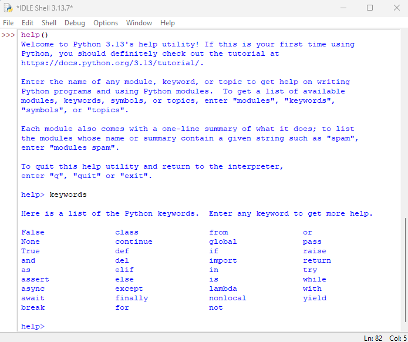
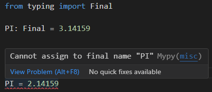
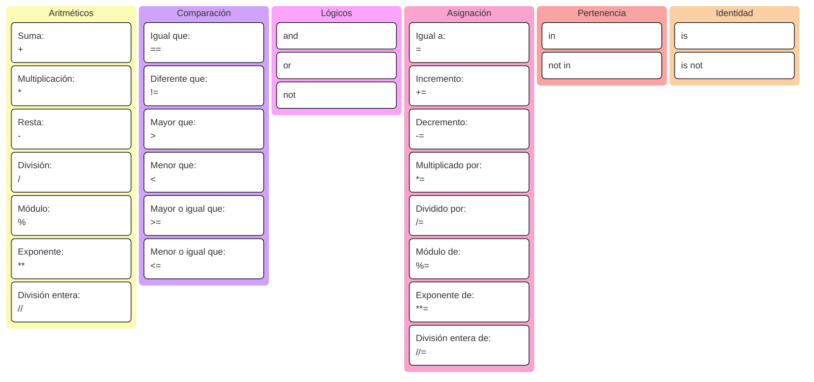
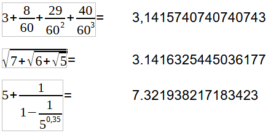
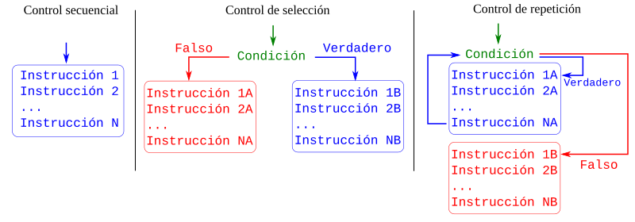
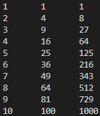

# **UT 3 - Conceptos básicos de Python**

{ .img1 }

<br>

**Resultados de aprendizaje y criterios de evaluacion que se evaluarán en esta unidad.**  


| **RA. 1:** Reconoce la estructura de un programa informático, identificando y relacionando los elementos propios del lenguaje de programación utilizado.|  
|-|
|**d)** Se han identificado los distintos tipos de variables y la utilidad específica de cada uno. |
|**e)** Se ha modificado el código de un programa para crear y utilizar variables. |
|**f)** Se han creado y utilizado constantes y literales. |
|**g)** Se han clasificado, reconocido y utilizado en expresiones los operadores del lenguaje. |
|**h)** Se ha comprobado el funcionamiento de las conversiones de tipo explícitas e implícitas. |
|**i)** Se han introducido comentarios en el código. |


| **RA. 3:** Escribe y depura código, analizando y utilizando las estructuras de control del lenguaje.| 
|-|
|**a)** Se ha escrito y probado código que haga uso de estructuras de selección.|
|**b)** Se han utilizado estructuras de repetición. |
|**c)** Se han reconocido las posibilidades de las sentencias de salto. |
|**d)** Se ha escrito código utilizando control de excepciones. 	|
|**e)** Se han creado programas ejecutables utilizando diferentes estructuras de control. 	|
|**h)** Se han creado excepciones.|
|**i)** Se han utilizado aserciones para la detección y corrección de errores durante la fase de desarrollo.|


| **RA. 5:** Realiza operaciones de entrada y salida de información, utilizando procedimientos específicos del lenguaje y librerías de clases.| 
|-|
|**a)** Se ha utilizado la consola para realizar operaciones de entrada y salida de información. |
|**b)** Se han aplicado formatos en la visualización de la información.|


<br>


## **1 - Sintáxis básica**
La sintaxis es a la programación lo que la gramática es a los idiomas. De la misma forma que la frase “Yo estamos aquí” no es correcta ...tampoco lo es un programa con errores de sintaxis, ya que el ordenador no podrá interpretarlo ni ejecutarlo de la manera esperada.

Ejemplo de sintaxis correcta de un programa hecho en Python.  

```py
# Definimos una variable x con una cadena
x = "El valor de (a+b)*c es"

# Podemos realizar múltiples asignaciones
a, b, c = 4, 3, 2

# Realizamos unas operaciones con a,b,c
d = (a + b) ** c

# Definimos una variable booleana
imprimir = True

# Si imprimir, print()
if imprimir:
    print(x, d)

# Salida: El valor de (a+b)*c es ??
```

!!! Pregunta 
    ¿Qué realiza el programa anterior?

### **1.1 - Elementos de un programa de Python**
Un programa de Python es un fichero de texto (codificado en formato UTF-8) que contiene expresiones y sentencias que se consiguen combinando los elementos básicos del lenguaje.  

El lenguaje Python está formado por elementos (tokens) de diferentes tipos:

  - Lineas y espacios.
  - Palabras reservadas (keywords)
  - Variables, operadores y expresiones
  - Funciones integradas (built-in functions).
  - Delimitadores
  - Identificadores

!!! Pregunta 
    Del ejemplo de código anterior, identificar los diferentes elementos constituyentes del programa.

En la documentación de Python se puede consultar una descripción mucho más detallada y completa de <a href=https://docs.python.org/3/reference/lexical_analysis.html>los elementos constitutivos</a> del lenguaje Python.

Para que un programa se pueda ejecutar, el programa debe ser sintácticamente correcto, es decir, utilizar los elementos del lenguaje Python respetando su reglas de "ensamblaje". 

### **1.2 - Líneas y espacios**
Básicamente, un programa de Python está formado por líneas de texto.
```python
radio = 5
area = 3.1415 * radio ** 2
print("La superificie es:", area)
```
<br>
Se recomienda que cada línea contenga una única instrucción, aunque puede haber varias instrucciones en una línea, separadas por un punto y coma (;).
```python
radio = 5; area = 3.1415 * radio ** 2
print("La superificie es:", area)
```
<br>
Los elementos del lenguaje se separan por espacios en blanco (normalmente, uno), aunque en algunos casos no se escriben espacios:

- Entre los nombres de las funciones y el paréntesis
- Antes de una coma (,)
- Entre los delimitadores y su contenido (paréntesis, llaves, corchetes o comillas)
```py
def suma(a,b):
  resultado = a + b
  return resultado

print(suma(2,3))
```

### **1.3 - Delimitadores**
Los delimitadores son los caracteres que permiten delimitar, separar o representar expresiones. 

🔹 **1. Paréntesis, corchetes y llaves**  

- ( ) → agrupar expresiones, llamadas a funciones, tuplas  
- [ ] → listas, indexación, slicing  
- { } → diccionarios, conjuntos, bloques en f-strings  

<br>

🔹 **2. Separadores de código**

- coma ( , ) → separa elementos en listas, tuplas, parámetros de funciones
- 2 puntos ( : ) → define bloques (if, for, def, class, etc.) o pares clave:valor en diccionarios
- punto ( . ) → acceso a atributos y métodos (obj.attr)
- punto y coma ( ; ) → separa varias instrucciones en una misma línea

<br>

🔹 **3. Delimitadores de cadenas**

- Comillas simples: 'texto'
- Comillas dobles: "texto"
- Comillas triples: '''texto''' o """texto""" (también para docstrings y cadenas multilínea)

<br>

🔹 **4. Delimitadores especiales**

- Igual ( = ) → asignación
- Flecha ( -> ) → anotaciones de tipo en funciones (def f(x) -> int:)
- 3 puntos ( ... ) (ellipsis) → marcador especial usado en slicing o como placeholder

```py
( )   [ ]   { }
,     :     .     ;
@     =     ->    ...
' '   " "   ''' '''   """ """
```

<br>
**Nota**:  
Los delimitadores no se pueden usar para otra cosa que no sea su uso como delimitador. Cualquier uso indebido generará un error en tiempo de ejecución.

!!! Ejercicio
    Escribir un programa que pretenda asignar el valor 64 a una variable de nombre vari@bl&.  
    Comprobar lo que ocurre entonces. 

<br>


### **1.4 - Comentarios**
Los comentarios sirven para explicar el código y hacerlo más comprensible. El intérprete de Python ignora por completo.

¿Por qué es importante poner comentarios?

-   Claridad: Hacen que un código complejo sea más fácil de entender.

-   Mantenimiento: Facilitan la depuración y modificación del código. 

-   Colaboración: Permiten a los equipos de desarrollo trabajar juntos de forma más eficiente, ya que todos pueden entender rápidamente el propósito de cada línea de código.  


Los **delimitadores** `#` y `“”” “””` permiten insertar comentarios dentro de un programa.
```py
# Esta linea está comentada. El interprete no la ejecutará
# 
a = True and False
print("El valor de 'a' es:", a, "y es de tipo: ", type(a))
#
"""
Nada de lo contenido entre las comillas dobles será ejecutado
b = True and True
print("El valor de 'b' es:", b, "y es de tipo: ", type(a))
"""
```

!!! Ejercicio 
    En el código del ejemplo anterior encontrar la línea dónde se hace uso a la vez de comillas simples y comillas dobles.  
    ¿Por qué se usa esa sintaxis?

<br>

### **1.5 - Tarea RA1-CEi** 
Analizar el programa y deducir dónde hay que poner los comentarios que se dan más abajo.

```py
import math 
radio = 5 
area = math.pi * (radio ** 2)
print(f"El radio del círculo es: {radio}")
print(f"El área del círculo es: {area}")
```
<br>
Listado de comentarios.
```py
# El área se calcula con la fórmula: pi * radio^2.
# Este programa calcula el área de un círculo dado su radio.
# Fin del programa.
# Importamos el módulo 'math' para usar la constante pi.
# Definimos una variable para el radio.
# Imprimimos el resultado de forma clara.
```

<br>

Crear un archivo `*.py` y subirlo a AULES en la **tarea RA1-CEi**.

### **1.6 - Delimitador contrabarra**
El delimitador contrabarra ( \ ) permite truncar una linea muy larga en varias líneas.
Por motivos de legibilidad, se recomienda que las líneas no superen los 79 caracteres. Si una instrucción supera esa longitud, se puede dividir en varias líneas usando la contrabarra ( \ ):

```py
radio = 5
area = 3.14159265358979323846 \
       * radio **2
print(area) 

texto = "Perdóname, amigo, de la ocasión que te he dado de parecer\
         loco como yo, haciéndote caer en el error en que yo he caído\
         de que hubo y hay caballeros andantes en el mundo."
print(texto)
```

!!! Ejercicio
    Escribir el programa anterior y comprobar el resultado.  
    Intentar arreglarlo de forma intuitiva. 

### **1.7 - Palabras reservadas**
Las palabras reservadas de Python son las que forman **el núcleo del lenguaje** Python y **no se pueden usar para nombrar otros elementos** (variables, funciones, …).  
Se puede acceder al listado de las palabras reservadas desde la **ayuda de IDLE** ( > Python 3.11, 64bits).

{ .img1 }

!!! Ejercicio 1
    Lanzar el interpretador **idle** (se instala a la vez que python).  
    Escribir en la terminal **help** y luego **keywords**.  

!!! Ejercicio 2
    ¿Podéis intuir el significado de alguna palabra reservada?

## **2 - Variables**
De forma general, una variable es **un espacio de memoria** con un nombre asociado que se utiliza para **almacenar y manipular datos** que pueden **cambiar durante la ejecución** del programa.

### **2.1 - Convenciones de nomenclatura**
Una forma de aplicar buenas prácticas de programación es seguir una convención para nombrar identificadores (variables, funciones, etc.) de manera que el código sea más limpio, legible y fácil de entender. 

Dentro de las más conocidas tenemos: **Camel, Pascal, Kebab y Snake case**.

1. **Camel case**
En Camel case se empezar a nombrar los identificadores con la primera letra minúscula y la primera letra de cada nueva palabra subsecuente en mayúscula:
```py
cosasParaHacer
edadDelAmigo
valorFinal
```

1. **Pascal case**
También conocido como "upper camel case" o "capital case", Pascal case combina palabras poniéndolas todas con la primera letra en mayúscula:
```py
CosasParaHacer
EdadDelAmigo
ValorFinal
```

1. **Snake case**
En Snake case, se utiliza guión bajo (underscore) para separar las palabras. Cuando snake case está en mayúsculas, se le conoce como "screaming snake case":
```py
cosas_para_hacer
edad_del_amigo
valor_final
PRIMER_NOMBRE
LISTA_INICIAL
```

1. **Kebab case**
En Kebab case se utiliza el guión para combinar las palabras. Cuando el Kebab case está en mayúsculas, se llama "screaming kebab case":
```py
cosas-para-hacer
edad-del-amigo
valor-final
PRIMER-NOMBRE
LISTA-INICIAL
```

### **2.2 - Convenciones Python**
El [PEP8](https://peps.python.org/pep-0008/) es la guía de estilo para la programación en Python. Es así decirlo, el código de buenas prácticas del lenguaje.

Se recomienda usar:

1. snake_case para variables, funciones y métodos;
1. PascalCase para clases;
1. SCREAMING_SNAKE_CASE para constantes.
1. **Nunca** empezar el nombre de una variable con un dígito.

**Ejemplo de código**
```py
class Persona:
    def __init__(self, nombre: str, documento_identidad: str) -> None:
        self.nombre: str = nombre
        self.documento_identidad: str = documento_identidad

    def exibir_primer_nombre(self) -> None:
        print(self.nombre)


persona_uno: Persona = Persona('Alice', '123456789')
persona_uno.exibir_primer_nombre()
```

**El código dado a continuación** es más habitual e igual de válido. Como se puede ver, contiene menos información que puede dificultar entender su finalidad o más simplemente, entender el tipo de los datos que maneja el programa. Es tambien bastnate más rápido de escribir. 

```py
class Persona:
    def __init__(self, nombre, documento_identidad):
        self.nombre = nombre
        self.documento_identidad = documento_identidad
    
    def exibir_primer_nombre(self):
        print(self.nombre)

persona_uno = Persona('Alice', '123456789')
print(persona_uno.exibir_primer_nombre())
```

### **2.3 - Declaración de variables**
Python es un lenguaje de tipado dinámico por lo que no hace falta declarar **el tipo de dato** que se asignará a una variable. De igual manera una variable puede cambiar de tipo mientras se ejecuta el programa (lo que no se considera una buena práctica de programación), por ello, se debe tener cuidado con la sintaxis para definir cada tipo de dato.

```py
a = 5
b = 6
c = '¡Hola mundo!'

print(c, a+b)
``` 
!!! Ejercicio
    Ampliar el programa anterior dónde se le asignará un nuevo valor a la variable 'b' y se le asignará un valor númerico a 'c'.  
    Escribir en pantalla (print()) el resultado de la suma de b+c. 
    
### **2.4 - Variables de tipo entero (int)**
Los enteros son un tipo de dato básico en cualquier lenguaje de programación.  
```py
a = 5
print(a, type(a))
``` 
<br>
Si se usan enteros de 32 bits el rango a representar es de -2^31 a 2^31–1.  
Con 64 bits, el rango es de  -2^63 a 2^63–1.  
**No tenemos que preocuparnos** de la codificación de los enteros, ya que Python se encarga de asignar más o menos memoria al número en función de su valor. 
```py
a = 5
b = 16
c = a ** b
print(c)
``` 
!!! Ejercicio
    Ampliar el programa anterior para evidenciar la asingación dinámica del tipo de variable en python. 

### **2.5 - Variables de tipo coma flotante (float)**
Las variables de tipo coma flotante (o float) son aquellas que almacenan números reales (es decir, con parte decimal).
```py
x = 3.14   # float
y = -2.5   # float
z = 0.0    # float
```
<br>

Los float se pueden escribir de dos formas:

1. Decimal normal:
```py
pi = 3.14159
```
<br>

1. Notación científica (usando e o E para potencias de 10):
```py
avogadro = 6.022e23   # 6.022 × 10^23
electron = 1.6e-19    # 1.6 × 10^-19
```

<br>

!!! warning "Precisión de las variables de tipo flotante."


- Los float en Python son de doble precisión (64 bits, estándar IEEE 754) lo que da ~15–17 cifras decimales de precisión.
    ```py
    a = 7.0
    b = 5.0
    print(a, b, a+b, type(a+b))
    ```
- No son exactos en muchos casos por cómo se representan en binario.
    ```py
    # Demostración del problema de precisión con float en Python
    print("¿La suma de 0.1 y 0.2 es igual a 0.3?", 0.1 + 0.2 == 0.3) 
    print("Valor real de 0.1 + 0.2:", 0.1 + 0.2)   

    # Solución con librería Decimal para cálculo exacto
    from decimal import Decimal
    a = Decimal("0.1")
    b = Decimal("0.2")
    c = Decimal("0.3")
    print("Con Decimal:", a + b == c)
    ```

### **2.6 - Variables de tipo booleano (bool)**
Las variables booleanas sólo pueden adoptar dos valores: **verdadero (True)** o **falso (False)**.
```py
a = True
b = False
print(type(a), type(b))
```


!!! Ejercicio
    Ampliar el programa anterior para que devuelva el tipo resultante de la suma lógica de a y b, y también a con la negación de b. 

### **2.7 - Variables de tipo número complejo**
En python, un número complejo tiene la forma: **a + bj** donde j es la unidad unidad imaginaria (en matemáticas se usa i).
```py
# Forma literal de escribir números complejos
a = 5 + 7j
b = 3 - 4j
c = a + b
print(c)
# Uso de complex para definir números complejos
d = complex(2, 3)   # (2+3j)
e = complex(-1, -5) # (-1-5j)
f = d * e
print(d)
```

!!! Ejercicio
    Calcular con papel y bolígrafo el resultado de la variable 'f'.

### **2.8 - Variables de tipo cadena de caracteres (string)** 
Los strings se definen utilizando **comillas dobles o simples**.
```py
a = "hello"
b = " "
c = "world"
d = a + b + c
print(a,b,c)
print(d)
```

!!! Ejercicio
    Rehacer el programa anterior para que esta vez, las variables de tipo string contengan únicamente valores númericos.

### **2.9 - Variables de tipo lista**
Las listas se definen utilizando **corchetes []** y pueden contener elementos de distintos tipos.
```py
# Lista
mi_lista = [1, 2, 3, "cuatro", True]
print(mi_lista)
print(mi_lista[0])      # Primer elemento
print(mi_lista[-1])     # Último elemento
```

!!! Ejercicio
    Crear una matriz de 3x3 utilizando listas.


### **2.10 - Variables de tipo tupla**
Las tuplas se definen utilizando **paréntesis ()**. Son similares a las listas pero **inmutables** (no se pueden modificar).

```py
mi_tupla = (1, 2, 3, "cuatro", True)
print(mi_tupla)
print(mi_tupla[0])     
print(mi_tupla[-1])     
```
!!! Ejercicio
    Ampliar el programa para que esta vez la tupla contenga los valores **1,3,3, "cuatro", True,[1,2,3,"verde"]**.
    ¿Qué ocure entonces?
     
### **2.11 - Diccionarios**     
Los diccionarios se definen utilizando **llaves {}** y almacenan pares **clave:valor**.

```py
# Diccionario
mi_diccionario = {
    "nombre": "Ana",
    "edad": 25,
    "ciudad": "Madrid"
}
print(mi_diccionario)
print(mi_diccionario["nombre"])  # Acceder al valor de una clave
print(mi_diccionario.get("edad")) # Otra manera de extraer valores del diccionario
``` 

### **2.12 - Tarea RA1-CEde**
Realizar los siguientes programas, declarando las variables necesarias y usando buenas prácticas de programación en Python.

1. **Ejercicio:**
Escriba un programa que defina dos números enteros y que calcule y muestre en consola su media aritmética. El programa también deberá mostrar el tipo de la variable resultante del cálculo de la media.  

1. **Ejercicio:**
Escribe un programa que defina el radio de un círculo y calcule su área.

1. **Ejercicio:**
Escribe un programa que convierta el valor de la temperatura de una variable de grados Celsius a grados Fahrenheit.

1. **Ejercicio:**
Escribe un programa que defina 2 variables de texto y luego muestre ambas variables concatenadas en una sola línea.

1. **Ejercicio:**
Pegar el siguiente código y rellenar los datos faltantes (podéis inventaros los datos).  
```py
# Actividad: Tipos de variables en Python

# 1. Crea una variable entera con tu edad
edad = ___

# 2. Crea una variable decimal con tu altura en metros
altura = ___

# 3. Crea una variable de texto con tu nombre
nombre = ___

# 4. Crea una variable booleana que indique si te gusta la programación (True o False)
gusta_programar = ___

# 5. Crea una lista con tres de tus colores favoritos
colores_favoritos = [___, ___, ___]

# Muestra por pantalla el contenido de cada variable y su tipo:
print("Edad:", edad, "Tipo:", type(edad))
print("Altura:", altura, "Tipo:", type(altura))
print("Nombre:", nombre, "Tipo:", type(nombre))
print("¿Te gusta programar?:", gusta_programar, "Tipo:", type(gusta_programar))
print("Colores favoritos:", colores_favoritos, "Tipo:", type(colores_favoritos))
```

## **3 - Constantes y literales**
### **3.1 - Constantes**
Una constante es un nombre simbólico que permite referenciar un objeto cuyo **valor no cambia** durante la ejecución del programa. 

#### **3.1.1 - Convención de nombres**
En Python, salvo el uso de snake_case + mayúsculas, no existe una sintaxis específica para las constantes (como en otros lenguajes de programación). Por esta razón, en Python, las constantes son realmente variables a las que, por convención no se les podrá asignar varios valores en tiempo de ejecución. 

**Ejemplo de declaraciones de constantes**
```py
PI = 3.1416
EULER_NUMBER = 2.718281828459045
LIGHT_SPEED = 299792458
GRAVEDAD = 9.8
BASE_PATH = "/proyectos"
```

!!! question "¿Existe otra manera para recuperar el valor de PI?"

#### **3.1.2 - Uso de módulos para blindar las constantes**
Un buena práctica para guardar las constantes es declararlas en un módulo aparte (p.e. contantes.py)

**Módulo donde se almacenan las constantes**
```py 
# constantes.py
CONSTANTE_1 = 23.6
CONSTANTE_2 = 59.6
CONSTANTE_3 = 123.856
```

**Programa donde se utilizan las contantes**
```py
# uso_constantes.py
import constantes as cst

valor_1 = cst.CONSTANTE_1
valor_2 = cst.CONSTANTE_2
valor_3 = cst.CONSTANTE_3

print("El valor de la suma de 'valor_1'+'valor_2'+'valor_3' es:",\
       valor_1+valor_2+valor_3)
```
!!! question "¿Cuál es el resultado de la operación?"

#### **3.1.3 - Constantes con clases y decorador @property**
El decorador @property permite establecer y asociar **métodos getters y setters** a un atributo.

A @property se le puede indicar cuáles serán los métodos encargados de gestionar el atributo en cuestión. 
La protección del valor consiste en no definir ningún atributo ni **método set** que permita alterar el valor. Solo se crea un **método get** para accceder al valor. 

```py
class Constantes:
    def __init__(self): # aquí definimos la constante
        self._PI = 3.141592

    @property
    def PI(self):  
        return self._PI


constantes = Constantes()  # creamos el objeto Constantes

print("Valor de PI =", constantes.PI)  # accedemos a la consstante PI

constantes.PI = 10  # intentar alterar la constante
```
!!! question "Ejecutar el programa y ver el resultado"

#### **3.1.4 - Constantes con Final**
El módulo typing introduce **Final** para indicar a herramientas de análisis estático que una variable **no debe reasignarse**:
```py
from typing import Final

PI: Final = 3.14159

PI = 2.14159
```

Como podemos ver el código se ejecuta correctamente a pesar de utilizar la propiedad Final, no obstante, si instalamos la extensión `Mypy Type Checker` saldrá una advertencia.

{.cincozero}

!!! question "¿Qué objeto que hemos visto anteriormente no permite modificar directamente su contenido?"


### **3.2 - Literales**
En programación, **un literal** es un valor escrito directamente en el código fuente que representa un dato fijo.  
No es una variable ni una constante con nombre: es **literalmente el dato tal cual**.

**Literales numéricos**
```py
entero = 42
flotante = 3.14
complejo = 2 + 3j
```

**Literales de texto**
```py
cadena_comilla_simple = 'Hola, mundo!'
cadena_comilla_doble = "Python es 'fácil' de aprender"
```

**Literales de lista y tupla**
```py
lista = [1, 2, 3]
tupla = (4, 5, 6)
```

**Literales de diccionario**
```py
diccionario = {'clave_1': 'valor', 
               'clave_2': 42,
               'clave_3': [1,2,3.3],
               'clave_4': ("Bienvenido",[25,36,42],("Hola","mundo",4+9j))}
```
 
### **3.3 - Tarea RA1-CEf**
Completar y comentar las líneas de código de los siguientes ejercicios para poner en evidencia el dominio de lo que son contantes, literales, etc.  

- **Ejercicio 1** 
```py
PI = _______   
radio = _____  
area = PI * radio ** 2
print("Área:", area)
```
<br>
- **Ejercicio 2**
```py
MAX_ALUMNOS = ______
clases = ______      # poner una lista de valores
for num in clases:
    if num > MAX_ALUMNOS:
        print("Clase sobrepasada")
    else:
        print("Clase OK")
```
<br>
- **Ejercicio 3**
```py
DESCUENTO = ______  

precio = 100  
precio_final = precio * (1 - DESCUENTO)
print("Precio final:", precio_final)

DESCUENTO = 0.50  
precio_final2 = precio * (1 - DESCUENTO)
print("Precio con descuento alterado:", precio_final2)
```

## **4 - Operadores**
Los operadores son símbolos que indican al programa que realice una operación específica, como aritmética, comparación, lógica, etc.

<div class="operadores">

```mermaid
---
config:
  kanban:
    ticketBaseUrl: 'https://org.atlassian.net/browse/#TICKET#'
  theme: neo  
---
kanban
  [Aritméticos]
    [Suma: <br> +]
    [Multiplicación: <br> *]
    [Resta: <br> -]
    [División: <br> /]
    [Módulo: <br> %]
    [Exponente: <br> **]
    [División entera: <br> //]
    
  [Comparación]
    [Igual que:  <br> ==]
    [Diferente que: <br> !=]
    [Mayor que: <br> >]
    [Menor que: <br> <]
    [Mayor o igual que: <br> >=]
    [Menor o igual que: <br> <=]

  [Lógicos]
    [and]
    [or]
    [not]

  [Asignación]
    [Igual a: <br> =]
    [Incremento: <br> +=]
    [Decremento: <br> -=]
    [Multiplicado por: <br> *=]
    [Dividido por: <br> /=]
    [Módulo de: <br> %=]
    [Exponente de: <br> **=]
    [División entera de: <br> //=]

  [Pertenencia]
    [in]
    [not in]
  
  [Identidad]
    [is]
    [is not]
``` 
</div>

### **4.1 - Operadores aritméticos**
Los operadores aritméticos permiten realizar operaciones aritméticas básicas con las variables de tipo numérico. 

|Operador |	Descripción |	Ejemplo|
|:-:|-|-|
|+| 	Realiza Adición entre los operandos |	12 + 3 = 15|
|-| 	Realiza Substracción entre los operandos |	12 - 3 = 9|
|*| 	Realiza Multiplicación entre los operandos |	12 * 3 = 36|
|/ |	Realiza División entre los operandos |	12 / 3 = 4|
|% 	|Realiza un módulo entre los operandos |	16 % 3 = 1|
|** |	Realiza la potencia de los operandos |	12 ** 3 = 1728|
|// |	Realiza la división con resultado de número entero |	18 // 5 = 3|


!!! Ejercicio  
    Escribir la expresión que permita calcular los siguientes valores: 

    { .potencias }

**Nota:**  
Aunque no lo hayamos visto aun, existe una manera más simple de escribir las expresiones. Si usamos la biblioteca math accedemos a todos sus operadores matemáticos (métodos) lo que da más claridad al código.

```py 
import math

# Calcular la raíz cuadrada de un valor
a = 4
b = math.sqrt(a)
print(b)

# Calcular el coseno de 60º
c = math.cos(60)
print(c)
```

!!! Ejercicio  
    Copiar el código anterior y comprobar los resultados obtenidos.  
    ¿Son los esperados?  
    ¿Qué se debería hacer para que sean correctos?


### **4.2 - Operadores de comparación**
Permiten efectuar comparaciones entre objetos de Python.  
El resultado de una comparación es un valor booleano (True o False).  

|Operador|	Descripción |	Ejemplo|
|-|-|-|
|> |	Devuelve True si el operador de la izquierda es mayor que el operador de la derecha |	12 > 3 devuelve True|
|< 	|Devuelve True si el operador de la derecha es mayor que el operador de la izquierda |	12 < 3 devuelve False|
|== |	Devuelve True si ambos operandos son iguales |	12 == 3 devuelve False|
|>= |	Devuelve True si el operador de la izquierda es mayor o igual que el operador de la derecha |	12 >= 3 devuelve True|
|<= |	Devuelve True si el operador de la derecha es mayor o igual que el operador de la izquierda |	12 <= 3 devuelve False|
|!= |	Devuelve True si ambos operandos no son iguales |	12 != 3 devuelve True|

**Nota:** 
Los operadores relacionales solo se pueden ejecutar para comparar valores del mismo tipo.

- "a" > 10 devolverá un error.
- [0,4] < (1,2) devolverá un error al no poder comparar una lista con una tupla.
- También se pueden concatenar: 3 == 3 >= 2 (true)
      
!!! Ejercicio  
    Transcribir a python las expresiones que acabamos de ver.      

### **4.3 - Operadores lógicos**
Sirven para realizar operaciones de lógica booleana entre valores de tipo bool. Los operadores lógicos son (las palabras reservadas) **and, or y not**.  

|Operador|	Descripción |	Ejemplo|
|-|-|-|
|and|Verdadero si ambas condiciones son True|True and False → False|
|or|Verdadero si al menos una condición es True|True or False → True|
|not|Invierte el valor de la condición|not True → False|

**Nota:**  
Cuidado con la sintaxis. Si usamos los símbolos de la lógica combinatoria (+, *, ...) los resultados pueden no ser los esperados.

### **4.4 - Operadores de asignación**
Un operador de asignación sirve para **asignar un valor** a una variable. Generalmente se combina con otros operadores (aritmética, bit a bit, ...) donde la operación se realiza en los operandos y el resultado se asigna **al operando izquierdo**.

|Operador|	Descripción |	
|-|-|
|= |	a = 5. El valor 5 es asignado a la variable a|
|+= |	a += 5 es equivalente a a = a + 5|
|-= |	a -= 5 es equivalente a a = a - 5|
|*= |	a *= 3 es equivalente a a = a * 3|
|/= |	a /= 3 es equivalente a a = a / 3|
|%= |	a %= 3 es equivalente a a = a % 3|
|**= |	a **= 3 es equivalente a a = a ** 3|
|//= |	a //= 3 es equivalente a a = a // 3|

### **4.5 - Operadores de pertenencia**
Un operador de pertenencia se emplea para identificar pertenencia en alguna secuencia (listas, strings, tuplas).  

- **in** y **not in** son operadores de pertenencia.
- **in** → devuelve True si el valor especificado se encuentra en la secuencia. En caso contrario devuelve False.
- **not in** → devuelve True si el valor especificado no se encuentra en la secuencia. En caso contrario devuelve False.

Ejemplos de expresiones que usan operadores de pertenencia.
```py
a = [1,2,3,4,5]
  
# ¿Está 3 en la lista a?
print(3 in a) # Muestra True 
  
# ¿No está 12 en la lista a?
print(12 not in a) # Muestra True
  
str = "Hello World"
  
# ¿Contiene World el string str?
print("World" in str) # Muestra True
  
# ¿Contiene world el string str? (nota: distingue mayúsculas y minúsculas)
print("world" in str) # Muestra False  

print("code" not in str) # Muestra True
```

### **4.6 - Operadores de identidad**
Un operador de identidad se emplea para comprobar si dos variables emplean la misma ubicación en memoria.

- **is** → comprueba si dos variables hacen referencia al mismo objeto en memoria.
- **is not** → lo contrario, comprueba si no son el mismo objeto.

```py
a = [1, 2, 3]
b = a
c = [1, 2, 3]

print(a is b)      # True, porque b apunta al mismo objeto que a
print(a is c)      # False, aunque tengan el mismo contenido, son objetos distintos
print(a == c)      # True, porque los valores dentro de la lista son iguales
print(a is not c)  # True, porque no son el mismo objeto (las listas son objetos mutables) 
```

🔎 Importante:  

- **is** no se debe usar para **comparar valores**, solo para identidad de objetos.
- Para comparar valores, siempre se usará ==.

### **4.7 - Ejercicios con operadores**
#### Tarea RA1-CEg
Completar el código de los siguiente ejercicios.

!!! question "Ejercicio 1"
    Realiza un programa que determine los siguientes aspectos (es suficiente con mostrar True o False):

    - Si los dos números son iguales
    - Si los dos números son diferentes
    - Si el primero es mayor que el segundo
    - Si el segundo es mayor o igual que el primero
    
    ```py
    # Ejercicio 1
    
    # Leer dos números por teclado
    num1 = float(input("Introduce el primer número: "))
    num2 = float(input("Introduce el segundo número: "))
    
    # Código a aportar por el alumno
    ...
    ...
    ...
    ...
    ```
    <br>

!!! question "Ejercicio 2"
    Utilizando operadores lógicos, determina si una cadena de texto introducida por el usuario tiene una longitud mayor o igual que 3 y a su vez es menor que 10.  
    **Nota:** Para determinar el largo de una cadena usar **la función len()**.  
    Ejemplo:
    ```py
    texto = "Esta es una frase"
    print(len(texto))
    ```

    Fragmento de código a completar.
    ```py
    # Leer una cadena de texto por teclado
    texto = input("Introduce una cadena de texto: ")

    # Comprobar si su longitud es mayor o igual que 3 y menor que 10
    ...

    # Mostrar True o False
    ... 
    ```


!!! question "Ejercicio 3"
    Realiza un programa que cumpla el siguiente algoritmo utilizando siempre que sea posible operadores en asignación:

    - Guarda en una variable numero_magico el valor 12345679 (sin el 8)
    - Lee por pantalla otro numero_usuario, especifica que sea entre 1 y 9
    - Multiplica el numero_usuario por 9 en sí mismo
    - Multiplica el numero_magico por el numero_usuario en sí mismo
    - Finalmente muestra el valor final del numero_magico por pantalla

    ```py
    # Ejercicio 3

    # 1. Guardar en una variable numero_magico el valor 12345679
    ...

    # 2. Leer por pantalla otro numero_usuario entre 1 y 9
    numero_usuario = int(input("Introduce un número entre 1 y 9: "))

    # 3. Multiplicar numero_usuario por 9 en sí mismo
    ...

    # 4. Multiplicar numero_magico por numero_usuario en sí mismo
    ...

    # 5. Mostrar el valor final de número_magico
    print("El número mágico es:", numero_magico)
    ```

## **5 - Estructuras de control**
Un código es una secuencia de instrucciones, que por norma general son ejecutadas una tras otra.   
Sin embargo, en muchas ocasiones no basta con ejecutar las instrucciones una tras otra desde el principio hasta llegar al final.  
Puede ser que ciertas instrucciones se tengan que ejecutar **si y sólo si** se cumple una determinada condición.

{ .img1 .marco }

En un lenguaje de programación, las estructuras de control permiten modificar el flujo de ejecución de un conjunto de instrucciones. Los tipos más comunes son:

|Elemento|Tipo|
|-|-|
|**if, elif, else**|Estructura condicionales|
|**for**|Bucle (o iteración)|
|**while**|Bucle (o iteración)|
|**match**|Bucle de selección|
|**try-except**|Manejo de excepciones (errores)|  

### **5.1 - Bucle condicional if-elif-else**
- La estructura de control **if** permite que un programa ejecute unas instrucciones cuando se cumpla una condición.
```py
if cond1:
    # hacer algo 
    pass
```

**Nota:** `pass` es una declaración que se usa como un marcador de posición (placeholder). Es **una operación nula** que no hace nada. Se utiliza cuando **la sintaxis del lenguaje** requiere un bloque de código, pero este aun no se ha desarrollado.

!!! Ejercicio  
    Realizar un programa con un bucle **condicional if** que haga lo siguiente:  
    1. El programa evaluará la nota de un alumno  
    2. Si la nota es superior o igual a 5, se mostrará por terminal el texto: "Enhorabuena, has aprobado el examen".  
    3. Si la nota es inferior a 5, se mostrará por terminal el texto: "Lamentablemente, no has aprobado el examen".        


- La estructura de control **if else** permite que un programa ejecute unas instrucciones **cuando se cumple** una condición y otras instrucciones **cuando no se cumple** esa condición.
```py
if cond1:
    # hacer una cosa
    pass 
else:
    # hacer otra cosa
    pass 
```

!!! Ejercicio  
    Realizar un programa con un bucle **condicional if else** que haga lo siguiente:  
    1. El programa evaluará la nota de un alumno.  
    2. Si la nota es superior o igual a 5, se mostrará por terminal el texto: "Enhorabuena, has aprobado el examen".  
    3. Si la mota es inferior a 5, se mostrará por terminal el texto: "Lamentablemente, no has aprobado el examen".  

- La estructura de control **if elif else** permite encadenar varias condiciones (elif es una contracción de else if).  
```py
if cond1:
    # hacer una cosa 1 
elif cond2:
    # hacer otra cosa 2
elif cond3: 
    # hacer otra cosa 3
...
elif cond(n):
    # hacer otra cosa (n)
else:
    # hacer un cosa por defecto
```

!!! Ejercicio  
    Realizar un programa con un bucle **condicional if elif else** que haga lo siguiente:  
    1. El programa evaluará la nota de un alumno.  
    2. Si la nota es superior o igual a 5 e inferior a 7, se mostrará por terminal el texto: "Has aprobado el examen".  
    3. Si la nota es superior o igual a 7, se mostrará por terminal el texto: "Excelente examen"  
    4. Si la mota es inferior a 5, se mostrará por terminal el texto: "Lamentablemente, no has aprobado el examen".

!!! Ejercicio 
    Realizar un programa con un bucle **condicional if elif else** que haga lo siguiente:  
    1. El programa evaluará la nota de un alumno. Esa nota deberá estar comprendida entre 0 y 100. Si la nota está fuera de rango se mostrará en la terminal "La calificación debe estar en la escala de 0 a 100"   
    2. Si la nota es superior o igual a 70 e inferior o igual a 74, se mostrará por terminal el texto: "Regular".  
    3. Si la nota es superior o igual a 75 e inferior o igual a 84, se mostrará por terminal el texto: "Bien".  
    4. Si la nota es superior o igual a 85 e inferior o igual a 94, se mostrará por terminal el texto: "Muy bien".  
    5. Si la nota es superior o igual a 95 e inferior o igual a 100, se mostrará por terminal el texto: "Excelente".  
    6. Si no se cumple ninguna de esas condiciones, mostraremos en la terminal: "Insuficiente".  
 
!!! Ejercicio  
    1. Supongamos que tenemos una lista de nota: lista = [1,2,4,7,9].  
    2. Supongamos que tenemos la nota = 8 y queremos saber si algun alumno ha sacado esa nota.  
    3. Realizar un programa con un bucle **condicional if else** que permita saber si el valor de **nota** está incluido dentro de lista. 


### **5.2 - Bucle de repetición for**
El **bucle for** es una estructura de control de repetición, en la cual se conocen (a priori) el número de iteraciones a realizar. El **bucle for** usa **un iterable** que define las veces que se ejecutará el código. 
```py
for valores in iterador:
    # Hacer alguna cosa
    pass
```

#### **5.2.1 - Iterador range()**
**range()** es una función que devuelve un iterador de números enteros en un rango definido.  
```py
range(inicio, fin, paso)
```
**Dónde:**  

- inicio → número desde el que empieza (por defecto 0).
- fin → número donde se detiene (⚠️ no se incluye).
- paso → incremento entre números (por defecto 1).

**Ejemplos**  

1. Recorrer un rango simple (0 a 4):
```py
for i in range(5):
    print(i)
``` 
1. Rango con inicio y fin:
```py
for i in range(2, 6):
    print(i)
```
1. Rango con paso:
```py
for i in range(3, 10, 2):
    print(i)
```
1. Contar hacia atrás (paso negativo):
```py
for i in range(10, 0, -2):
    print(i)
```

!!! Ejercicio   
    Ejecutar los bucles **for** y comprobar los resultados obtenidos.    

!!! Ejercicio  
    Realizar un programa que determine:  
    1. Cuantos números entre 1 y 500 son, **a la vez**, **múltiplos de 7 y 8**.  
    2. Muestre los números encontrados.    

#### **5.2.2 - Objetos iterables**
En Python se puede iterar sobre cualquier objeto iterable, como por ejemplo un string, una lista, una tupla o un diccionario...  
A continuación varios ejemplos de objetos iterables.

- Bucle **for** sobre un string. 
```py
for i in "iteración":
  print("Iteración: ", i)
```

- Bucle **for** sobre lista de valores. Para realizar la iteración se toma la cantidad de valores de la lista. 
```py
lista= ["Este", "es", "un", "gran", "día"]

for i in lista:
  print("Iteración: ", i)
```
- Otra forma de iterar sobre las propiedades de una lista. 
```py
lista = ["Este", "es", "un", "gran", "día"]

for i in range(len(lista)):
    print("Iteración:", i, "Elemento:", lista[i])
```
- Otra forma de iterar sobre las propiedades de una lista. 
```py
lista = ["Este", "es", "un", "gran", "día"]

for (indice,valor) in enumerate(lista):
    print("Iteración:", indice, "Elemento:", valor)
```
- También se puede iterar sobre varios iterables a la vez usando **la función zip()**.
```py
nombres = ["Ana", "Luis", "Marta"]
edades = [25, 30, 22]

for nombre, edad in zip(nombres, edades):
    print(nombre, "tiene", edad, "años")
```
**zip()**, como su nombre lo deja entrever **une** los elementos de las listas, posición a posición.  
Si una lista es más larga que la otra, zip se detiene en la más corta.

#### **5.2.3 - Ejercicios con bucles e iteradores**
!!! Ejercicio "Ejercicio 1"  
    **Contar números pares:**  
    - Mostrar los números pares del 1 al 20 usando un bucle for. 

!!! Ejercicio "Ejercicio 2"  
    **Tabla de multiplicar:**  
    - El programa pedirá al usuario un número con el código:
    ```py
    numero = int(input("Introducir un número: "))
    ```
    - Completar el programa para que devuelva la tabla de multiplicar del número introducido desde el 1 hasta en 10. 

!!! Ejercicio "Ejercicio 3"  
    **Recorrer una lista:**  
    - Crear una lista con 5 frutas (manzana, pera, naranja, plátano, kiwi).  
    - Crear una lista con 7 colores (rojo, verde, naranja, amarillo, verde, morado, azul).  
    - El programa deberá imprimir el contenido de las 2 listas usando **zip**.  

### **5.3 - Bucle de repetición while**
El bucle while ejecuta un bloque de instrucciones mientras se cumpla una condición. A diferencia del bucle **for**, en el **while** normalmente no sabemos de entrada cuántas veces se va a repetir."
```py
while condicion:
    # hacer alguna cosa 
``` 

En el siguiente ejemplo, vemos cómo el bucle se repite hasta que la **variable auto-incrementable k** alcanza la longitud de la cadena (string) nombre.
```py
nombre = "Pablo"
k = 0
while k < len(nombre):
    print(nombre[k])
    k += 1
```

#### **5.3.1 - Ejercicios con bucles while**
!!! Ejercicio "Ejercicio 1. Crear un programa con un bucle while con las siguientes condiciones."  
    - Cada vez que se realice un bucle se incrementará **+1** el valor de una variable.
    - Cada vez que se realice un bucle se imprimirá el valor de esa variable.
    - El programa finalizará cuando se hayan realizado 10 bucles.  

!!! Ejercicio "Ejercicio 2. Crear un programa con un bucle while con las siguientes condiciones."  
    - El programa preguntará al usuario que introduzca un número entre 1 y 10.
    - Mientras el número introducido no esté dentro de ese rango, el programa volverá a pedir que se introduzca un número. 
    - Para introducir un valor por teclado usar:
    ```py
    numero = int(input("Introducir un número entre 1 y 10"))    
    ```

!!! Ejercicio "Ejercicio 3. Crear un programa con un bucle while con las siguientes condiciones."  
    - El programa pedirá al usuario que introduzca un número.
    - Si el valor introducido es positivo, entonces se calculará la raíz cuadrada de ese número y se mostrará por pantalla.
    - Si el valor introducido es negativo, se mostrará un mensaje de error y se volverá a pedir introducir un valor.
    - El usuario solo tendrá derecho a 5 intentos, superados los cuales el programa finalizará.

### **5.4 - Sentencias de control de flujo: break y continue**
#### **5.4.1 - Sentencia break**
La sentencia **break** permite alterar el comportamiento de los bucles **while** y **for**. Concretamente, permite **terminar de manera anticipada** con la ejecución del bucle.

!!! example "Break en un bucle for:"
```py
palabra = "Python"
letra_a_encontrar = "o"

for letra in palabra:
  if letra == letra_a_encontrar:
    print(f"Hemos encontrado la letra {letra_a_encontrar}")
    # print("hemos encontrado la letra ", letra_a_encontrar)
    break
  else: print(f"Vamos por la letra: {letra}")
  #print("Vamos por la letra:", letra)
```

!!! example "Break en un bucle while:"
```py
from random import randint

print("¡Bienvenido al juego: 'Adivina el número'")
numero = randint(1,10) # genera un entero entre 1 y 10
intentos = 1 # inicializamos la variable incrementable

while True: #definimos un bucle while infinito
  valor = int(input("Introducir un número entero entre 1 y 10: "))
  if valor == numero:
    print(f"Has adivinado el número correcto {numero} después de {intentos} intentos")
    break
  else:
    print(f"{valor} no es el numero correcto, intentalo nuevamente\n")
  intentos += 1 

print("Programa terminado")  
```  

#### **5.4.2 - Sentencia continue**
Al igual que break, la sentencia continue permite modificar el comportamiento de los bucles while y for.  
En el caso de continue, **se salta todo el código restante en la iteración actual** y vuelve al principio en el caso de que aún queden iteraciones por completar.  
La diferencia entre break y continue es que continue no rompe el bucle, sino que pasa a la siguiente iteración saltando el código pendiente.

En este ejemplo podemos ver que cuando el programa encuentra la letra **a**, no se imprime por consola. No obstante el bucle no se interrumpe y continua hasta completar todas las letras.
```py
cadena = "Python es mi lenguaje de programacion favorito"
letra_a_eliminar = "a"

for letra in cadena:
  if letra == letra_a_eliminar:
    continue
  print(letra, end="") #end="" evita el salto de línea
```

#### **5.4.3 - Ejercicios con break y continue**
!!! Ejercicio "Ejercicio 1. Crear un programa con un bucle while y la sentencia break con las siguientes condiciones."  
    - El programa pedirá al usuario que introduzca un número.
    - Si el valor introducido es positivo, entonces se calculará la raíz cuadrada de ese número y se mostrará por pantalla.
    - Si el valor introducido es negativo, se mostrará un mensaje de error y se volverá a pedir introducir un valor.
    - El usuario solo tendrá derecho a 5 intentos, superados los cuales el programa finalizará.

!!! Ejercicio "Ejercicio 2. Crear un programa que use la sentencia continue y realice lo siguiente."  
    - El programa pedirá al usuario que introduzca un número (el valor introducido será un entero positivo).
    - El programa realizará un bucle desde 0 hasta el valor introducido dentro del cual solo mostrará en pantalla los valores pares.    

### **5.5 - Control de excepciones** 
Una excepción es **un evento** que ocurre durante la ejecución de un programa y que **interrumpe el flujo normal de las instrucciones** cuando sucede un error o una situación inesperada.

#### **5.5.1 - Sentencias try-except**
Las sentencias de control **try** y **except** se usan para manejar errores y evitar que nuestro programa se detenga inesperadamente.  

!!! tip "Estructura básica."  
- El bloque try contiene el código que podría generar un error.  
- El bloque except contiene el código que se ejecuta si ocurre un error dentro del try. Esto permite “atrapar” errores y manejarlos de forma controlada.  
```PY
try:
    # Bloque de código que puede generar un error
except:
    # Bloque de código que se ejecuta si ocurre un ValueError    
```

!!! tip "Ejemplo básico."  
```py
try:
    # Bloque de código que puede generar un error
    numero = int(input("Introduce un número: "))
    print("El número es:", numero)
except:
    # Bloque de código que se ejecuta si ocurre un ValueError
    print("¡Error! Debes introducir un número válido.")
```    

!!! tip "Ejemplo encadenando excepciones y especificando el tipo de excepción."
Existen muchos tipos de excepciones en Python, cada una asociada a un error específico. Las más comunes son: **TypeError** (operaciones con tipos inapropiados), **ZeroDivisionError** (división por cero), **IndexError** (índice fuera de rango en una secuencia) y KeyError (clave inexistente en un diccionario). Otros tipos habituales incluyen **FileNotFoundError, ImportError, ValueError y AttributeError**.

En Python se puede **y se recomienda** especificar el tipo de error cuando se define el bloque except. Por ese motivo, es habitual encontrar múltiples bloques except en un mismo try. **Si no se especifica el tipo de error, la excepción se capturará igualmente**, pero no se dispondrá de información precisa sobre el origen del fallo.


```py
while True:
    entrada = input("Introduce un número (o 'salir' para terminar): ")
    
    if entrada.lower() == "salir":  # comprueba si el usuario quiere salir
        print("Programa terminado.")
        break
    
    try:
        numero = int(entrada)
        resultado = 10 / numero
        print("El resultado es:", resultado)
    except ValueError: # detecta si no ha introducido un valor numerico
        print("¡Eso no es un valor numérico!")
    except ZeroDivisionError: # detecta si se intenta dividir por '0'
        print("Estás intentando dividir por cero.")

```
#### **5.5.2 - Sentencias try, except, else y finally**
En Python también podemos usar los bloques **else y finally** junto con **try y except** para tener un control más fino sobre el flujo del programa cuando ocurren excepciones.

- **try:** Contiene el código que podría provocar un error.

- **except:** Contiene el código que se ejecuta si ocurre un error en el bloque try.

- **else:** Contiene el código que se ejecuta solo si NO se produjo ninguna excepción en el bloque try.

- **finally:** Contiene el código que se ejecuta siempre, ocurra o no una excepción (cerrar archivos, conexiones, liberar recursos, etc.).

!!! tip "Estructura básica"
```py
try:
    # Código que puede provocar error
except TipoDeError:
    # Se ejecuta si ocurre ese tipo de error
else:
    # Se ejecuta solo si no hubo error
finally:
    # Se ejecuta siempre, ocurra o no error
```

!!! tip "Ejemplo práctico"
```py
import os

try:
    ruta_archivo = os.path.join(os.path.dirname(__file__), "datos.txt")
    with open(ruta_archivo, "r") as archivo:
        contenido = archivo.read()
        numero = int(contenido)  # puede lanzar ValueError si el contenido no es número
except FileNotFoundError:
    print("El archivo no existe.")
except ValueError:
    print("El contenido del archivo no es un número.")
else:
    print("El número leído es:", numero)
finally:
    print("operación de lectura finalizada") 
```


#### **5.5.3 - Control de excepciones con assert**
La instrucción **assert** permite **depurar el código** y verificar condiciones que deben cumplirse mientras el programa se ejecuta.
Si la condición evaluada por assert es **False**, Python lanzará un error (AssertionError) y opcionalmente, mostrará un mensaje de ayuda.  
<br>
!!! tip "Estructura básica."  
```py
assert condicion, mensaje_opcional
```
condicion → Es una expresión que debe evaluarse como True.  
mensaje_opcional → (opcional) Texto que se mostrará si la aserción falla.  
<br>

!!! tip "Ejemplo básico."
```py
x = int(input("Introducir un valor entero positivo"))
y = 20
assert x > 0, "condicion: x debe ser mayor que cero"
print("Condicion assert superada, el usuario ha introducido un valor >0")
```
Si el assert() devuelve `False` en la terminal saldrá un aviso del tipo:  
```bash
AssertionError: x debe ser mayor que cero
```
<br>
!!! warning "Limitaciones de assert"  
En entornos de producción, **todas las aserciones pueden desactivarse** (por ejemplo, al ejecutar Python con la opción -O), y por lo tanto no se ejecutan. Por este motivo, **assert debe usarse únicamente durante el desarrollo y la validación del código**, y nunca en producción. (La instrucción assert está pensada exclusivamente para tareas de prueba y depuración).  
<br>

#### **5.5.4 - Control de excepciones con raise()**
La instrucción raise se usa para lanzar (o generar) **una excepción de forma manual**.  
Cuando se ejecuta un raise, el interprete de Python interrumpe la ejecución normal del programa y busca un bloque **try...except** que pueda manejar la excepción. Si no lo encuentra, el programa termina con un error.

!!! tip "Estructura básica." 
```py
raise [Excepcion] [from otra_excepcion]
```
Excepcion → Puede ser una instancia o clase de una excepción (por ejemplo, ValueError, TypeError, etc.).  
from otra_excepcion → (opcional) se usa para encadenar excepciones.  
<br>

!!! tip "Ejemplo básico"
```py
x = -5

try:
    if x < 0:
        raise ValueError("x no puede ser negativo")
    print("El valor de x es válido:", x)

except ValueError as error:
    print("Se ha producido un error:", error)

print("El programa continúa su ejecución normalmente.")
```

### **5.6 - Bucles anidados**
Ya hemos visto algún que otro bucle anidado sin decirlo.  
Un **bucle anidado** es un bucle que se **encuentra incluido** en el **bloque de sentencias** de otro bloque.  
Los bucles pueden tener muchos niveles de anidamiento, lo que suele disparar resultados inesperados en tiempos de ejecución. De igual manera se deberá prestar una especial atención a la ubicación de las sentencias **break** y **continue**.
```py
print("Tabla de multiplicación hasta 10")
input("Pulsar enter para continuar")

for i in range(1, 11):  # bucle externo
    print("Tabla del: ", i)
    for j in range(1, 11):  # bucle interno
        print(i, "x", "j", "=", i*j)
```       

!!! Exercice "Ejercicio 1"  
    Modificar el programa anterior para que, al alcanzar **el bucle interno** el valor **7**, este omita ese valor y continue el bucle sobre los valores restantes. 

!!! Exercice "Ejercicio 2" 
    Modificar el programa anterior para que, al alcanzar **el bucle externo** el valor **5** y **el bucle interno** el valor **7**, se salga de la ejecución del programa con un mensaje de despedida.  
    ¿Por qué incluir un mensaje de despedida?

### **5.7 - Sentencia de selección match**
**A partir de Python 3.10**, se introdujo la **sentencia match**, que funciona como una estructura de selección múltiple (parecida a switch en otros lenguajes como java).
Permite comparar un valor contra varios patrones y ejecutar código según el que coincida.
Es mucho más potente que un simple **if/elif/else** porque admite patrones estructurados, desempaquetado y condiciones adicionales (guards).

!!! tip "Sintaxis básica"

```py
match expresión:
    case patrón1:
        # código si expresión coincide con patrón1
    case patrón2:
        # código si expresión coincide con patrón2
    case _:
        # código por defecto (como "else")
```

!!! tip "Ejemplo"
```py
opcion = input("Elige una opción (1, 2 o 3): ")

match opcion:
    case "1":
        print("Has elegido la opción 1.")
    case "2":
        print("Has elegido la opción 2.")
    case "3":
        print("Has elegido la opción 3.")
    case _:
        print("Opción no válida.")
```

!!! question "Modificar el programa anterior para que:"
    1. Hacer que el programa se repita siempre.
    1. Añadir un bucle condicional donde se pedirá al usuario si desea continuar.
    1. El usuario deberá elegir entre pulsar intro o introducir la palabra 'no'.
    1. Si el usuario elige 'no' la repetición finalizará y se saldrá del programa. 
 
### **5.8 - Tarea RA3-CEa** 

!!! task "Ejercicio 1 - Naturaleza de las raíces de una ecuación cuadrática"
    1. Una **ecuación cuadrática** tiene la forma:  
    **a x<sup>2</sup> + b x + c = 0**
    1. El tipo de raíces (reales o complejas) depende del **discriminante**, que se calcula con la fórmula:  
    **Δ = b<sup>2</sup> - 4ac**  
    1. Escribe un programa que:  
    Pida los valores de `a`, `b` y `c`.  
    Determine la **naturaleza de las raíces** de la ecuación:  
        - Si `Δ > 0`: Retornará por terminal "Las raíces son **reales y diferentes**".  
        - Si `Δ = 0`: Retornará por terminal "Las raíces son **reales e iguales**".  
        - Si `Δ < 0`: Retornará por terminal "Las raíces son **complejas**".

!!! task "Ejercicio 2 - Determinar el mayor de 3 números"
    Escribe un programa que pida tres números reales diferentes y determine cuál de ellos es el mayor.  

!!! task "Ejercicio 3 - Calcular una función"
    1. Escribe un programa que pida un número real.
    1. En función del número introducido el programa hará lo siguiente:
        - Si valor < −1, el programa retornará por terminal el valor de **e<sup>-valor</sup>**. 
        - Si  -1 &le; valor &le; −1, el programa retornará por terminal el valor de **e**. 
        - Si  valor > 1, el programa retornará por terminal el valor de **e<sup>valor</sup>**.  

    **Nota:** Para poder usar la funcion exponencial **e** importar la función exp() del módulo math.
    ```py
    from math import exp
    print(exp(1),exp(-1),exp(0))
    ```     

### **5.9 - Tarea RA3-CEb** 

!!! task "Ejercicio - Comprobar si un año es bisiesto"
    1. Escribe un programa que pida un valor
    1. El programa estimará qué años son bisiestos desde 0 hasta el valor introducido.
    1. Un año es bisiesto si cumple las siguientes condiciones:
        - Es **divisible** por 4. 
        - **Pero no** es divisible por 100.
        - **Excepto** si también es divisible por 400.

    📘 **Ejemplos:**  

    - El año 1988 fue bisiesto.  
    - El año 2000 también fue bisiesto.  
    - El año 1800 **no fue** bisiesto.  

### **5.10 - Tarea RA3-CEc** 

!!! task "Ejercicio - Sumar fracciones"
    1. El programa debe pedir al usuario que introduzca un valor entero positivo.
    1. A partir de ese valor, el programa sumará una serie de fracciones correspondientes a todos los números enteros comprendidos entre -valor y +valor (ambos incluidos), siguiendo las siguientes condiciones:
        - Si el iterador es negativo, se sumará 2 / iterador a una variable acumuladora.
        - Si el iterador es cero, no se sumará ningún valor.
        - Si el iterador es positivo, se sumará 1 / iterador a la variable acumuladora.

!!! task "Ejercicio - Sumar hasta superar el límite"
    1. El programa debe pedir al usuario que introduzca un valor entero positivo.
    1. A partir de ese valor, el programa irá sumando los números consecutivos 1 + 2 + 3 + ... + valor.
    1. Si durante el proceso la suma alcanza o supera 100, el programa se detendrá y mostrará un mensaje indicando el valor en el que la suma se ha detenido.
    1. Si la suma no alcanza 100, el programa finalizará mostrando un mensaje que indique que no se ha alcanzado el límite de 100.

### **5.11 - Tarea RA3-CEdh** 
!!! task "Ejercicio - Calculadora básica"
    1. El programa debe pedir al usuario que introduzca dos valores enteros.
    1. A continuación, el programa debe solicitar al usuario que indique la operación que desea realizar: sumar, restar, multiplicar o dividir.
    1. En el caso de la división, el programa debe incluir un control de excepciones para evitar errores cuando el segundo valor sea nulo (cero).
    1. En todos los casos, el programa debe mostrar el resultado de la operación o una advertencia si no se puede realizar.
    1. El programa debe repetirse indefinidamente hasta que el usuario introduzca la palabra salir en lugar de un operador.

### **5.12 - Tarea RA3-CEi** 
!!! task "Ejercicio - Calculadora básica con assert"
    1. El programa debe pedir al usuario que introduzca dos valores enteros.
    1. A continuación, el programa debe solicitar al usuario que indique la operación que desea realizar: sumar, restar, multiplicar o dividir.
    1. En el caso de la división, el programa debe incluir un control de excepciones **con assert** para evitar errores cuando el segundo valor sea nulo (cero).
    1. En todos los casos, el programa debe mostrar el resultado de la operación o una advertencia si no se puede realizar.
    1. El programa debe repetirse indefinidamente hasta que el usuario introduzca la palabra salir en lugar de un operador.

### **5.13 - Tarea RA3-CEe** 
!!! task "Ejercicio - Dibujar la letra “o”"
    1. El programa debe pedir al usuario que introduzca un valor entero positivo `n`.
    1. A continuación, el programa mostrará por pantalla una figura que represente la letra “o” formada por el carácter 'o', siguiendo estas condiciones:
        - La primera línea contendrá 'n' veces la letra 'o'.
        - Las líneas intermedias (en total n - 2) comenzarán y terminarán con una 'o', y tendrán espacios en blanco entre ambas.
        - La última línea contendrá nuevamente 'n' veces la letra 'o'.
    1. Si el valor introducido es menor que 2, el programa mostrará un mensaje de advertencia indicando que el valor no es válido.  

    1. **Ejemplos de código y ejecución:**   
       Imprimir varias veces un mismo carácter:
       ```py
       print("o"*6)
       ```
       ```
       oooooo
       ```
       Ejemplo de ejecución con el valor 6:
       ```
       oooooo
       o    o
       o    o
       o    o
       o    o
       oooooo
       ```

## **6 - Funciones en python**
### **6.1 - Funciones predefinidas print & input**
Hasta ahora hemos usado la función print() principalmente para mostrar mensajes en pantalla, sin detenernos demasiado en todas las cosas que podemos hacer con ella. Pero, a medida que aprendemos más de Python, necesitamos crear programas más completos que puedan interactuar con el usuario. Para lograrlo, conoceremos también la función input(), que nos servirá para pedir datos por teclado y guardarlos en variables que después usaremos en nuestros programas.  
<br>  
#### **6.1.1 - La función print()**
La función **print()** es una función incorporada (builtin) de Python que escribe **texto** en un flujo (por defecto, la consola) y no **devuelve nada**. 

!!! info "Sintaxis de print()"
    ```py
    print(*objects, sep=' ', end='\n', file=sys.stdout, flush=False)
    ```
    **Dónde:**
    
    - ***objects**: cualquier número de valores a imprimir. Cada uno se convierte con str().  
    - **sep**: separador entre objetos (por defecto un espacio).  
    - **end**: lo que se añade al final (por defecto salto de línea).  
    - **file**: flujo destino; por defecto sys.stdout (puedes usar sys.stderr o un archivo abierto).  
    - **flush**: si True, vacia el buffer inmediatamente.  
<br>

#### **6.1.2 - Argumentos de print()**  

- **Separadores**  
En python se puede configurar como aparecerán los datos en la terminal.
```py
print("A", "B", "C")                     
print("A", "B", "C", sep="") # sin separacion entre los datos                     
print("A", "B", "C", sep=" ") # sep=" " es el valor por defecto                
print("A", "B", "C", sep=",")            
print("A", "B", "C", sep=" >>> ")            
print("A", "B", "C", sep=" \U0001F600 ") # sep admite símbolos soportados por python
```
<br>

- **Secuencia de escape fin de línea \n**  
En Python, el valor predeterminado de end es **\n** (salto de línea).  
Si el valor no es nulo, entonces se imprimirá al final de la línea el contenido de end **y no se saltará a la linea siguiente** si no añadimos **\n**.
```py
print("No saltamos de linea.", end="")             
print(" Este contenido sigue en la primera linea.")             
print("\nSaltamos una linea ANTES Y DESPUES de pintar el texto.\n")             
print("Ponemos un final de linea personalizado y no saltamos de linea.", end="...")
print(" Este texto sigue en la linea anterior")             
print("Final de linea personalizado CON salto de linea", end="... \n") 
print("Final de linea con caracteres especiales", end=" ✅\n") 
```
<br>

- **Secuencia de escape tabulación \t**  
El simbolo **\t debe incorporarse al texto** que queremos tabular.
```py
print("Menu del dia")
print("\tPrimer plato.")
print("\tSegundo plato.")
print("\t Postre.")
print("-------------------------")
print("---\tPrecio\tFinal.")
```
<br>

- **Secuencia de escape retroceso \r**  
A la inversa de **tabulación** el símbolo **\r** permite realizar retrocesos a **inicio de línea**.
```py
print("Menu del dia")
print("\tPrimer plato.")
print("\tplato \rSegundo")
```

    !!! Warning "Peligro"  
        El retroceso **\r** sobreescribe los datos. 
```py
print("Menu del dia")
print("Primer plato.")
print("Segundo plato.", end="")
print("\r-sobreescribo-")
```
<br>

- **Más secuencias de escape**

    | Secuencia de escape | Descripción                         | Ejemplo |
    |----------------------|--------------------------------------|----------|
    | `\\` | Muestra una barra invertida (`\`) | `print('Mírala volar\\como oscila el péndulo')` |
    | `\'` | Muestra una comilla simple | `print('No importa cuán duro lo intentes')` |
    | `\"` | Muestra una comilla doble | `print('Es tan \"irreal\"')` |
    | `\a` | Emite un sonido (campanilla) | `print('\a')` |


- **Escribir variables, texto y ejecutar código**  
Como ya hemos visto, la función print() permite combinar texto (**siempre entre comillas y separando los argumentos con comas)**, mostrar valores de variables y ejecutar código.
```py
valor = 12
texto = "El precio del articulo es de"
print(texto, valor,"euros")
```
<br>
Ejecución de funciones básicas de python.
```py
valor1 = 12
valor2 = 5
print("El resultado de 12 x 5 son:",valor1*valor2,"exactos")
```
<br>
Ejecución de código
```py
aprobado = 7.2
print("Aprobado" if aprobado >= 5 else "Suspenso")
```

#### **6.1.3 - Tarea RA5-CEa, ejercicios con print()**
!!! Exercice "Ejercicio 1"  
    Escribir un código cuya salida en terminal sea la siguiente.   
    ```
    1    1     1
    2    4     8
    3    9     27
    4    16    64
    5    25    125
    6    36    216
    7    49    343
    8    64    512
    9    81    729
    10   100   1000
    ```
    <!--  -->

!!! Exercice "Ejercicio 2"
    1. Disponemos de estas 2 listas.  
    lista_1 = [1,2,3,4,5,6,7,8,9]  
    lista_2 = ["azul","verde","amarillo","naranja","cian","magenta","ambar","negro","blanco"]  
    2. Realizar un programa, **que solo utilice un print()** y que devuelva por terminal, el siguiente resultado:
    ```bash
    Indice   y      color: 
    >>>1>>>         >>>azul>>> 
    Indice   y      color: 
    >>>2>>>         >>>verde>>> 
    Indice   y      color: 
    >>>3>>>         >>>amarillo>>> 
    Indice   y      color: 
    >>>4>>>         >>>naranja>>> 
    Indice   y      color: 
    >>>5>>>         >>>cian>>> 
    Indice   y      color: 
    >>>6>>>         >>>magenta>>> 
    Indice   y      color: 
    >>>7>>>         >>>ambar>>> 
    Indice   y      color: 
    >>>8>>>         >>>negro>>> 
    Indice   y      color: 
    >>>9>>>         >>>blanco>>> 
    ```

#### **6.1.4 - Formato de cadenas y variables para su uso con (o sin) print()**
- **Cadenas f (f strings)**  
Muchas veces puede resultar tiedoso ir intercalando texto y valores de variables. A partir de python 3.6, la nueva notación **cadena f{}** soluciona ese problema.  
Una cadena f contiene **variables y expresiones** entre llaves "{}" que se sustituyen directamente por su valor. 
```py
valor1 = 5
valor2 = 7
valor3 = 35
texto = "euros"
texto1 = "Pablo"

f_string = f"El resultado de la mutiplicacion de {valor1} por {valor2} es {valor3} {texto}"

# sin cadenas f
print("El resultado de la mutiplicacion de",valor1,"por",valor2,"es",valor3,texto)

# con cadenas f
#print(f_string)
print(f"El resultado de la mutiplicacion de {valor1} por {valor2} es {valor3} {texto}")

# Tambien se ejecutan funciones dentro de f
print(f"El resultado de la mutiplicacion de {valor1} por {valor2} es {valor1*valor2} {texto}")

# Tambien se ejecuta código dentro de f
print(f"El resultado del examen de {texto1} cuya nota el {valor2} es {"Aprobado" if valor2 >= 5 else "Suspenso"}")
```

<br>

- **format()**  
Otra manera de dar formato a cadenas puede hacerse usando el **método format()** 
```py
# Especificando el orden de los argumentos:
nombre = "Carlos"
edad = 30
frase1 = "Tengo {1} años y me llamo {0}.".format(nombre, edad)
print(frase1)

# Utilizando el nombre de variables:
nombre = "Carlos"
edad = 30
frase2 = "Hola, mi nombre es {nombre} y tengo {edad} años.".format(nombre, edad)

# Sintaxis más corta a la anterior, definiendo las variables directamente en format():
frase3 = "Hola, mi nombre es {nombre} y tengo {edad} años.".format(nombre="Carlos", edad=30)
print(frase3)

# Orden de argumentos implicito (string, valores, funciones): 
texto1 = "Juan"
valor2 = 6
print("El resultado del examen de {} cuya nota el {} es {}".format(texto1,valor2,"Aprobado" if valor2 >= 5 else "Suspenso"))
```

#### **6.1.5 - Formateo de cadenas y valores**  
También podemos dar formato a los valores (números, cadenas o fechas) que pasamos a la función print(). Esto resulta particularmente útil, ya que nos permite controlar cómo se mostrarán los valores, ajustando aspectos como el número de decimales, el ancho, la alineación o el carácter de relleno.

- **Formateo de cadenas de texto**
Las f-strings, no solo aportan claridad al código, sino que también permiten formatear el texto de los valores que se insertan dentro de las llaves {}.
Gracias a esta sintaxis, es posible controlar cómo se mostrará la información: la alineación, el ancho del campo o el carácter de relleno, entre otros aspectos.

    Por ejemplo:
    ```py
    nombre = 'Pedro'
    print(f'{nombre:>20}')    # Justificado a la derecha
    print(f'{nombre:<20}')    # Justificado a la izquierda
    print(f'{nombre:^20}')    # Centrado
    print(f'{nombre:_^20}')   # Centrado con relleno '_'
    ```

    Dónde:
    :> → alinea el texto a la derecha dentro de un ancho de 20 caracteres.  
    :< → alinea el texto a la izquierda dentro de un ancho de 20 caracteres.  
    :^ → centra el texto dentro de un ancho de 20 caracteres.  
    :_^ → centra el texto, rellenando los espacios sobrantes con el carácter _.  


- **Formateo de valores con especificadores de tipos**
    1. Decimales y números:
    ```py
    # con cadenas f
    hexa = 255
    print(f"Representacion en hexadecimal de 255: {hexa :X}")

    # con format
    print("Representacion en hexadecimal de 255: {:X}".format(255)) 
    ```
    <br>
    - Mostrar con ceros a la izquierda:
    ```py
    # con cadenas f
    print(f"Número: {42:05d}")  # 00042
    
    # con format
    print("Número: {:05d}".format(42))  # 00042
    ```
    <br>

    - Separador de miles:
    ```py
    # con cadenas f
    print(f"Precio: {12000000:,}")  # 12,000,000

    # con format
    print("Precio: {:,}".format(12000000))  # 12,000,000
    ```
    <br>

    - Hexadecimal, binario, porcentaje:
    ```py
    # con cadenas f
    print(f"Representacion en hexadecimal de 255: {255:X}") 
    print(f"Representacion en binario de 8: {8:b}")      
    print(f"Equivalente en porcentaje de 0.85: {0.85:.1%}")  
    
    # con format
    print("Representacion en hexadecimal de 255: {:X}".format(255)) 
    print("Representacion en binario de 8: {:b}".format(8))      
    print("Equivalente en porcentaje de 0.85: {:.1%}".format(0.85))  
    ```
    <br>

    - Tabla resumen de los formatos más habituales  
    De una manera general, para dar un formato de salida especifico a un valor, deberemos usar la sintaxis siguiente:
    ```bash
    # Cadenas f
    f"{variable:formato}"

    # Format
    "{:formato}".format(variable)
    ``` 
    
    
        | Especificador | Tipo de valor | Descripción | Ejemplo | Salida |
        |----------------|----------------|--------------|----------|---------|
        | `d` | Enteros | Muestra un número entero en base 10 | `f"{42:d}"` | `42` |
        | `b` | Enteros | Muestra el número en binario | `f"{42:b}"` | `101010` |
        | `o` | Enteros | Muestra el número en octal | `f"{42:o}"` | `52` |
        | `x` | Enteros | Muestra el número en hexadecimal (minúsculas) | `f"{42:x}"` | `2a` |
        | `X` | Enteros | Muestra el número en hexadecimal (mayúsculas) | `f"{42:X}"` | `2A` |
        | `f` | Números reales | Formatea un número de punto flotante con 6 decimales por defecto | `f"{3.14159:f}"` | `3.141590` |
        | `.nf` | Números reales | Limita el número de decimales a *n* | `f"{3.14159:.2f}"` | `3.14` |
        | `e` | Números reales | Notación científica (minúsculas) | `f"{3141.59:e}"` | `3.141590e+03` |
        | `E` | Números reales | Notación científica (mayúsculas) | `f"{3141.59:E}"` | `3.141590E+03` |
        | `%` | Números reales | Muestra el valor multiplicado por 100 con un símbolo `%` | `f"{0.85:%}"` | `85.000000%` |
        | `c` | Enteros o caracteres | Muestra el carácter correspondiente al código Unicode del número | `f"{65:c}"` | `A` |
        | `g` | Números reales | Usa formato fijo o científico (según el tamaño del número) | `f"{123456789:g}"` | `1.23457e+08` |
        | `G` | Números reales | Igual que `g`, pero con `E` en notación científica | `f"{0.0001234:G}"` | `1.234E-04` |


- **Combinacíón de especificadores de tipos con secuencias de escape**  
Es posible combinar los especificadores con las secuencias de escape.  
  ```py
  pi = 3.14159265359
  print(f"{pi:>10.3f}") # Alinea a la derecha, ancho de 10 caracteres, flotante de 3 decimales
  print(f"{255:0>6x}") # Hexadecimal, centrado derecha con relleno de ceros y anche de 6 caracteres
  print(f'{pi:010.5f}') # Cinco decimales ancho de 10 caracteres y relleno de ceros
  print(f'{pi:.0f}')  # Cero decimales ancho de 10 caracteres
  print(f'{pi:10.4e}')  # Notación científica, ancho 10 caracteres
  ```


#### **Tarea RA5-CEb, ejercicios con formatos**
!!! Exercice "Ejercicio"  
    Escribir un programa cuya salida por terminal sea la siguiente:
    ```bash
    ---------------------------------
    |   d   |   b   |   o   |   x   |
    ---------------------------------
    |   0   |     0 |     0 | 0     |
    |   1   |     1 |     1 | 1     |
    |   2   |    10 |     2 | 2     |
    |   3   |    11 |     3 | 3     |
    |   4   |   100 |     4 | 4     |
    |   5   |   101 |     5 | 5     |
    |   6   |   110 |     6 | 6     |
    |   7   |   111 |     7 | 7     |
    |   8   |  1000 |    10 | 8     |
    |   9   |  1001 |    11 | 9     |
    |  10   |  1010 |    12 | a     |
    |  11   |  1011 |    13 | b     |
    |  12   |  1100 |    14 | c     |
    |  13   |  1101 |    15 | d     |
    |  14   |  1110 |    16 | e     |
    |  15   |  1111 |    17 | f     |
    |  16   | 10000 |    20 | 10    |
    |  17   | 10001 |    21 | 11    |
    |  18   | 10010 |    22 | 12    |
    |  19   | 10011 |    23 | 13    |
    |  20   | 10100 |    24 | 14    |
    |  21   | 10101 |    25 | 15    |
    |  22   | 10110 |    26 | 16    |
    |  23   | 10111 |    27 | 17    |
    |  24   | 11000 |    30 | 18    |
    ---------------------------------
    ```
<br>
#### **6.1.2 - La función input()**
La entrada de datos en Python se realiza con la función **input()** 
```py
valor = input(texto)
```
Donde **texto** es el mensaje que se muestra al usuario en la terminal y **valor** es la variable en la cual se almacena lo que el usuario ha escrito después de pulsar la tecla **Enter**.

**Ejemplo:**  
```py
nombre = input("Introducir nombre: ")
print(f"Hola {nombre}, buenos días") # con cadenas f
print("Hola {}, buenos dias".format(nombre)) # con format
```
<br>
Hay una consideración a tener en cuenta al momento de usar input(): **La función input solo devuelve cadenas de caracteres**.  
En el siguiente programa vemos que, independientemente de los valores introducidos, el tipo de las variables siempre es de **tipo string**.

**Ejemplo:**
```py
while(True):
  valor = input("Introducir un valor entero: ")
  if valor=="salir":break 
  print(f"Hola, el valor introducido es: {valor}")
  print("El tipo de valor es: ", type(valor))
print("Programa finalizado.")
```

Si queremos introducir  un valor de tipo numérico y realizar operaciones con él, entonces, deberemos **convertir el string a un tipo numérico de manera explícita**, de lo contrario el programa podría lanzar un error, o en el mejor de los casos, funcionar de manera incorrecta.  
El proceso de convertir el tipo de una variable a otro se llama **casting de variables** y lo veremos en el párrafo siguiente.  
<br>

#### **6.1.3 - Refundición (casting) de variables** 
Hacer un cast o casting significa convertir un tipo de dato a otro. En python, distinguiremos entre conversiones implícitas y explícitas.   

- Conversión implícita: Es realizada automáticamente por Python. Sucede cuando realizamos operaciones con tipos distintos.

- Conversión explícita: Es realizada expresamente por el programa.

**Ejemplo:**  
```py
# Ejemplo de casting implícito
num_entero = 5       # tipo int
num_decimal = 2.5    # tipo float

resultado = num_entero + num_decimal  # Python convierte automáticamente num_entero a float

print(resultado)      # 7.5
print(type(resultado))  # <class 'float'>

# Ejemplo de casting implícito
num_entero = 5       # tipo int
num_decimal = 2.5    # tipo float

resultado = num_entero + float(num_decimal)  # el programa convierte num_entero a float para igualar los tipos.
print(resultado)      # 7.5
print(type(resultado))  # <class 'float'>
```

<br>
Para hacer un **casting explicito**, simplemente envolveremos la variable con el tipo de dato al que deseamos convertirla.

!!! warning "¡Solo se puede hacer casting entre tipos compatibles!"

- Convertir string a int  
```py
# Sintaxis de string a decimal
a = "1234"
b = int(a)
print(b, type(b))
```

- Convertir list a set  
```py
list = ["la", "lista",  "de", "la", "compra", "la", "hare", "manyana"]
print(set(list))
```

#### **6.1.4 - Tabla resumen de refundiciones**
| Tipo de destino | Ejemplo de conversión     | Resultado       | Notas                                                                                          |
| --------------- | ------------------------- | --------------- | ---------------------------------------------------------------------------------------------- |
| **int**         | `int("10")`               | `10`            | Convierte strings numéricos o floats (trunca decimales). No funciona con strings no numéricos. |
| **float**       | `float("10.5")`           | `10.5`          | Convierte strings numéricos y enteros.                                                         |
| **str**         | `str(100)`                | `"100"`         | Convierte cualquier tipo a string.                                                             |
| **bool**        | `bool(0)`                 | `False`         | `0`, `0.0`, `""`, `[]`, `{}` → False; resto → True                                             |
| **list**        | `list((1,2,3))`           | `[1,2,3]`       | Convierte tuplas, sets o strings en listas de elementos.                                       |
| **tuple**       | `tuple([1,2,3])`          | `(1,2,3)`       | Convierte listas, sets o strings en tuplas.                                                    |
| **set**         | `set([1,2,2,3])`          | `{1,2,3}`       | Convierte listas, tuplas o strings en conjuntos eliminando duplicados.                         |
| **dict**        | `dict([("a",1),("b",2)])` | `{"a":1,"b":2}` | Convierte listas o tuplas de pares clave-valor en diccionarios.                                |

#### **Tarea RA1CEa-h**
!!! task "Detección del tipo de dato introducido"  
    1. Crea un programa en Python que pida al usuario introducir cualquier valor por teclado.  
    2. El programa intentará convertir ese valor a número entero (int) o a número decimal (float).  
    3. Si la conversión es posible, mostrará un mensaje indicando el tipo de dato detectado.  
    4. Si no se puede convertir, el programa asumirá que el valor introducido es una cadena de texto (str).
    5. El programa se ejecutará continuamente hasta que el usuario introduzca la palabra clave **salir**.  

        **Ejemplo**

        ```bash
        Introduce cualquier cosa: 23
        → El valor introducido es de tipo int.

        Introduce cualquier cosa: 4.7
        → El valor introducido es de tipo float.

        Introduce cualquier cosa: hola
        → El valor introducido es de tipo string.

        Introduce cualquier cosa: salir
        → Programa finalizado
        ```

### **6.2 - Funciones** 
Por el momento, solo se ha escrito código sin ningún tipo de estructura, lo que implica que todas las líneas del programa se ejecuten de forma lineal. Además, si debemos realizar en varias partes del programa la misma operación, deberemos volver a escribir exactamente el mismo código.

Estos dos inconvenientes contradicen dos principios de buenas prácticas de programación:

- El principio **DRY (Don't Repeat Yourself)**, que aboga por la reusabilidad: Si un fragmento se usa en muchos sitios, la mejor solución será encapsularlo.

- El principio de Modularidad defiende que en vez de escribir largos bloques de código, es mejor crear funciones o módulos pequeños y autocontenidos que agrupen ciertas tareas. Esto hace que el código sea más fácil de leer, mantener y probar.

Para resolver esos inconvenientes, se hace uso de funciones.

#### **6.2.1 - Funciones built-in**
Python dispone de una serie de funciones nativas que se cargan cuando se inicia el intérprete.  
Más información [aquí](https://docs.python.org/es/3.13/library/functions.html).

<table class="table-funciones">
  <thead>
    <tr><th colspan="7">Funciones built-in</th></tr>
  </thead>
  <tbody>
    <tr>
      <td><b>A</b><br>abs()<br>aiter()<br>all()<br>anext()<br>any()<br>ascii()</td>
      <td><b>B</b><br>bin()<br>bool()<br>breakpoint()<br>bytearray()<br>bytes()</td>
      <td><b>C</b><br>callable()<br>chr()<br>classmethod()<br>compile()<br>complex()</td>
      <td><b>D</b><br>delattr()<br>dict()<br>dir()<br>divmod()</td>
      <td><b>E</b><br>enumerate()<br>eval()<br>exec()</td>
      <td><b>F</b><br>filter()<br>float()<br>format()<br>frozenset()</td>
      <td><b>G</b><br>getattr()<br>globals()</td>
    </tr>
    <tr>
      <td><b>H</b><br>hasattr()<br>hash()<br>help()<br>hex()</td>
      <td><b>I</b><br>id()<br>input()<br>int()<br>isinstance()<br>issubclass()<br>iter()</td>
      <td><b>L</b><br>len()<br>list()<br>locals()</td>
      <td><b>M</b><br>map()<br>max()<br>memoryview()<br>min()</td>
      <td><b>N</b><br>next()</td>
      <td><b>O</b><br>object()<br>oct()<br>open()<br>ord()</td>
      <td><b>P</b><br>pow()<br>print()<br>property()</td>
    </tr>
    <tr>
      <td><b>R</b><br>range()<br>repr()<br>reversed()<br>round()</td>
      <td><b>S</b><br>set()<br>setattr()<br>slice()<br>sorted()<br>staticmethod()<br>str()<br>sum()<br>super()</td>
      <td><b>T</b><br>tuple()<br>type()</td>
      <td><b>V</b><br>vars()</td>
      <td><b>Z</b><br>zip()</td>
      <td><b>_</b><br>__import__()</td>
      <td></td>
    </tr>
  </tbody>
</table>

**Ejemplos de uso de funciones built-in.**
```py
print(max([10,35,5,110,48,30,112,98,87]))
print(bin(10))
round(3.141592653589793, 6)
print("Hola", 90, 80, sep=" \u21e8 ")
```
<br>

#### **6.2.2 - Funciones definidas por el usuario**
Por supuesto, es posible definir funciones propias usando la palabra **def**.

**Sintaxis básica:**
```py
def nombre_fun(arg1, arg2, ..., argN):
    # código que se ejecuta dentro de la función
    # ...
    # ...
    # ...
    return val1, val2, ..., valN #opcional
```

!!! Warning "Atención"  
    Las funciones se diferencian en lo que hacen después de ejecutarse.  

    - Funciones que devuelven algo: Realizan una tarea y entregan un resultado usando **la palabra clave return**. Ese valor puede guardarse en una variable o usarse en otros cálculos.  
    - Funciones que no devuelven nada: Realizan una acción (por ejemplo, mostrar un mensaje en pantalla), pero no entregan ningún valor; su resultado no puede almacenarse ni usarse más adelante.


#### **6.2.3 - Paso de argumentos a la función**
Cuando se realiza una llamda a una función, los argumentos (o parámetros) son los valores que se pasan a la función para que pueda ejercutarse correctamente. Es la forma en que el código fuera de la función se comunica con el código dentro de ella.

!!! tip "Funciones sin argumentos"
Es la función más elemental de todas. No se le pasa ningún argumento y generalmente, tampoco devuelve nada. 
```py 
hola()

def hola():
    print("Hola")
```
!!! question "¿Este código está bien escrito?" 

!!! tip "Funciones con argumentos"
Las funciones pueden recibir distintos tipos de argumentos que determinan cómo se pasan los valores a los parámetros de la función.  

- **Argumentos por posición**  
Son los más comunes. Los valores se asignan a los parámetros según el orden en el que se pasan.
```py
def sumar(a, b):
    return a + b

resultado = sumar(3, 5)  
```
<br>

- **Argumentos por nombre**  
Permite especificar el parámetro al que se asigna cada valor, sin importar el orden.
```py
def saludar(nombre, mensaje):
    print(f"{mensaje}, {nombre}")

saludar(mensaje="Buenos días", nombre="Ana")
```
<br>

- **Argumentos por defecto**  
Si no se pasan todos los valores, se utiliza los valores por defecto.
```py
def potencia(base, exponente=2):
    return base ** exponente

print(potencia(4))      
print(potencia(4, 3))   
```
<br>

- **Argumentos de longitud variable**  
Permiten pasar **un número indeterminado** de argumentos.  
&emsp;&emsp; `*args` recibe una **tupla** de argumentos posicionales.  
&emsp;&emsp; `**kwargs` recibe un **diccionario** de argumentos con nombre.
```py
def sumar_todo(*args):
    print("Tipo de variable arg: ", type(args))
    return sum(args)

print(sumar_todo(1, 2, 3, 4))  

def mostrar_info(**kwargs):
    print("Tipo de variable kwargs: ", type(kwargs))
    for clave, valor in kwargs.items():
        print(f"{clave}: {valor}")

mostrar_info(nombre="Luis", edad=25, ciudad="Valencia")
```

#### **6.2.4 - Sentencia return**
La sentencia return permite realizar dos cosas:

- **Salir** de la función y seguir con la ejecución del programa **desde donde** se realizó la llamada.
- **Devolver** uno o varios parámetros, resultado de la ejecución de la función.

```py
def funcion():
    print("Ejecución de la funcion")
    return
    print("No llega") # esta línea no se ejecutará

funcion()
```
<br>

**Nota 1:**  
Podemos recuperar los valores de vuelta de manera selectiva usando su indice dentro de la sentencia return.
```py
def funcion(a,b,c):
    return a*10, b-5, c-32
    
funcion(10,20,40)

print("Solo recuperamos el primer valor:",funcion(10,20,40)[0])
print("Solo recuperamos el segundo valor:",funcion(10,20,40)[1])
print("Solo recuperamos el tercer valor:",funcion(10,20,40)[2])
```
<br>

**Nota 2:**  
Cuando una función devuelve varios valores (separados por comas), en realidad está devolviendo una tupla.
Por eso se pueden recuperar los valores de manera selectiva usando su índice, o también **desempaquetar** (desconstruir en otros lenguajes):
```py
x, y, z = funcion(10, 20, 40)
print(x, y, z) 
```
<br>

#### **6.2.5 - Anotaciones en funciones**
Las anotaciones (function annotations) sirven para documentar **el tipo de los parámetros y/o el valor de retorno** de una función.  
No modifican el comportamiento de la función, solo aportan información que pueden usar herramientas externas (como mypy o pylint).
```py
def sumar(a: int, b: int) -> int:
    return a + b

print(sumar(3, 4))
```
<br>

#### **6.2.6 - Tarea RA5-CEc**

!!! exercice "Ejercicio 1"
    **Función Factorial**  
    Escribir una función que pida un número y devuelva el factorial de ese número.  
    Cálculo de un factorial: n! = `n*(n-1)*(n-2)*(n-3)*...*1` 

!!! exercice "Ejercicio 2"
    **Función Intercambiar**  
    Escribir una función que pida dos números y devuelva los números ordenados de mayor a menor.  
     
!!! exercice "Ejercicio 3"
    **Función EsMultiplo**  
    Escribir un programa que pida 2 números e indique si el primero el múltiplo del segundo.   
    
!!! exercice "Ejercicio 4"
    **Conversor a segundos o a horas, minutos y segundos (HMS).**  
    Escribir un programa que estará dentro de un bucle infinito y que pedirá al usuario elegir entre 3 opciones.  
    - Opción 1: Convertir a segundos. El programa pedirá entonces introducir las horas, minutos y segundos y devolverá la conversión a segundos.   
    - Opción 2: Convertir a HMS. El programa pedirá introducir los segundos y devolverá las horas, minutos y segundos.  
    - Opción 3: Salir. Si el usuario elige este opción, el programa finalizará.  
    - Contemplar la posibilidad de que el usuario introduza un dato incorrecto.  
    
#### **6.2.6 - Decoradores de funciones**
Un decorador, es **una función que agrega funcionalidades a otra función**.
Se usa con el prefijo @ y puede **alterar o extender** el comportamiento de la función decorada.

!!! tip "Estructura de un decorador"
    La estructura de un decorador se compone de 3 funciones (A, B y C).  
    El decorador A recibe como parámetro la función B y luego devuelve la función C.  
    Un decorador devuelve una función que le da más funcionalidades a la función a decorar.  

!!! tip "Sntaxis de un decorador"    
    ```py
    def decorador(funcion): # funcion_A(funcion_B) 
        def funcion_interna(): # funcion_C
        #codigo de la funcion interna
    return funcion_interna # funcion_ C
    ```

**Ejemplo con decorador @**
```py
def mayusculas(saludar):
    def funcion_interna():
        texto = saludar()
        return texto.upper()
    return funcion_interna

@mayusculas
def saludar():
    return "hola mundo"

print(saludar())  # "HOLA MUNDO"
```

**Mismo ejemplo pero sin decorador:**
```py
def mayusculas(saludar):
    def funcion_interna():
        texto = saludar()
        return texto.upper()
    return funcion_interna

def saludar():
    return "hola mundo"

# Aplicamos manualmente el decorador
saludar = mayusculas(saludar)

print(saludar())  # "HOLA MUNDO"
```
<br>

#### **6.2.7 - Decoradores con parámetros**
- `*args`: Argumentos de tipo tupla.
```py
def decorador(funcion):
  def funcion_interna(*args):         # ← paso de argumentos
    print("Inicio funcion decoradora")
    print(f"Valores recibidos: a={args[0]}, b={args[1]}")
    print(funcion(*args))             # ← paso de argumentos
    print("Fin funcion decoradora")
  return funcion_interna

@decorador
def sumar(a,b):
  return a+b 

def restar(a,b):
  return a-b 

def multiplicar(a,b):
  return a*b 

def dividir(a,b):
  return a/b 

sumar(3,5)
```
<br>

- `**kwargs`: Argumentos de tipo clave valor.
```py   
def decorador(funcion):
  def funcion_interna(**kwargs):         # ← paso de argumentos
    print("Inicio funcion decoradora")
    print(f"Valores recibidos: a={kwargs['a']}, b={kwargs['b']}")
    print(funcion(**kwargs))             # ← paso de argumentos
    print("Fin funcion decoradora")
  return funcion_interna

@decorador
def sumar(a,b):
  return a+b 

def restar(a,b):
  return a-b 

def multiplicar(a,b):
  return a*b 

def dividir(a,b):
  return a/b 

sumar(a=3,b=5)
```

!!! exercice "Modificar el programa anterior para que la función decoradora pueda recibir tanto tuplas con diccionarios"

#### **6.2.7 - Paso por valor y paso por referencia a una función.**
En muchos lenguajes de programación existen los conceptos de paso por valor y paso por referencia, que definen cómo trata una función los parámetros que se le pasan.

- **Paso por valor:** se pasa una **copia del valor** → los cambios dentro de la función **no afectan al valor original**.  
- **Paso por referencia:** se pasa una **referencia al objeto original** → los cambios dentro de la función **sí pueden afectar al original**.

> En **Python**, los argumentos se pasan **por referencia de objeto** (o **por asignación de objeto**).  
> Es decir, la función recibe una **referencia al objeto**, pero el comportamiento dependerá de si este es **mutable** o **inmutable**.

#### **6.2.7.1 - Tipos mutables e inmutables**

| Tipo de dato | ¿Es mutable? | Ejemplos |
|---------------|--------------|-----------|
| 🔒 Inmutable   | ❌ No        | `int`, `float`, `str`, `tuple`, `bool` |
| 🔓 Mutable     | ✅ Sí        | `list`, `dict`, `set`, objetos definidos por el usuario |

---

#### **6.2.7.2 - Ejemplo con tipo inmutable**
```python
def incrementar(x):
    x = x + 1
    print("Dentro de la función:", x)

a = 10
incrementar(a)
print("Fuera de la función:", a)

# Salida
# Dentro de la función: 11
# Fuera de la función: 10
```

**Explicación:**  
- `a` es un número entero de tipo inmutable.  
- Dentro de la función, `x` crea un nuevo objeto con el valor 11.  
- La variable `a` fuera de la función no se modifica.  

#### 6.2.7.4 - Ejemplo con tipo mutable
```py
def agregar_elemento(lista):
    lista.append(4)
    print("Dentro de la función:", lista)

numeros = [1, 2, 3]
agregar_elemento(numeros)
print("Fuera de la función:", numeros)

# Salida
# Dentro de la función: [1, 2, 3, 4]
# Fuera de la función: [1, 2, 3, 4]
```

**Explicación:**
- La lista numeros es mutable, por lo que la función recibe una referencia al mismo objeto.  
- El método append() modifica el contenido original, afectando también a la lista fuera de la función.

#### 6.2.7.5 - Evitar compartamientos inesperados
Si no se desea modificar el objeto original, se puede pasar una copia del mismo:

```py
def agregar_elemento(lista):
    lista.append(4)
    print("Dentro de la función:", lista)

numeros = [1, 2, 3]
agregar_elemento(numeros[:])   # Se pasa una copia de la lista
print("Fuera de la función:", numeros)

# Salida
# Dentro de la función: [1, 2, 3, 4]
# Fuera de la función: [1, 2, 3]
```

#### 6.2.7.6 - Ver el paso por valor o por referencia: funcion id()
Una forma de observar cómo actúa el intérprete de Python es usando la función id(), que devuelve un identificador único de cada objeto en memoria.
Si dos variables tienen el mismo id, apuntan al mismo objeto (paso por referencia).
Si tienen id distintos, se ha creado una nueva copia (paso por valor o por asignación a un nuevo objeto).

**Paso por referencia objeto inmutable**
```py
def modificar(x):
    print("ID dentro de la función (antes):", id(x)) # 140715771130920
    x += 1
    print("ID dentro de la función (después):", id(x)) # 140715771130952
    return x

a = 5
print("ID fuera de la función:", id(a)) # 140715771130920
x = modificar(a)
print("ID fuera de la función (final):", id(a)) # 140715771130920
print("ID devuelto por la función (final):", id(x)) # 140715771130952
print("Valor final de a:", a) # 5
```

**Paso por referencia objeto mutable**
```py
def modificar_lista(lst):
    print("ID dentro de la función (antes):", id(lst)) # 1971487072512
    lst.append(4)
    print("ID dentro de la función (después):", id(lst)) # 1971487072512
    return lst

numeros = [1, 2, 3]
print("ID fuera de la función (antes):", id(numeros)) # 1971487072512

resultado = modificar_lista(numeros)

print("ID fuera de la función (final):", id(numeros)) # 1971487072512
print("ID devuelto por la función (final):", id(resultado)) # 1971487072512
print("Contenido final de la lista:", numeros)  # [1, 2, 3, 4]
```

<br>
#### **6.2.8 - Funciones Lambda**
Las funciones lambda (también conocidas como arrow functions) son una sintaxis para declarar funciones anónimas de forma concisa y expresiva, típicamente se definen en una línea y el código a ejecutar suele ser pequeño. 

!!! tip "Definición de una función Lambda:"
```py
# Sintaxis de una funcion lambda
lambda argumentos: código
```
<br>
!!! tip "Ejemplo básico de función lambda:"
```py
sumar = lambda x, y: x+y

print(sumar(2,3))
```
<br>
!!! tip "Función lambda pasada como argumento a una función:"
```py
def mi_funcion(lambda_func):
    return lambda_func(2,4)

mi_funcion(lambda a, b: a + b)
```
<br>
!!! tip "Función encapsulada dentro de una función lambda:"
```py
def mi_otra_funcion(a, b):
    return a + b

(lambda a, b: mi_otra_funcion(a, b))(2, 4)
```
<br>
!!! tip "Función lambda y valores por defecto:"
```py
(lambda a, b, c=3: print(a + b + c))(1, 2)
```
<br>
!!! tip "*args y **kwargs en funciones lambda:"
```py
(lambda *args: print(sum(args)))(1, 2, 3) 
(lambda **kwargs: print(sum(kwargs.values())))(a=1, b=2, c=3) 
```

#### **6.2.9 - Otras funciones**
En Python existen algunas técnicas de programación que permiten escribir funciones más potentes y eficientes. Entre ellas destacan las funciones recursivas, los generadores y el caching de funciones. 

**Funciones recursivas:**  

- Son funciones que se llaman a sí mismas dentro de su propio código. Se utilizan cuando un problema puede dividirse en versiones más pequeñas de sí mismo.
- Por ejemplo, calcular el factorial de un número o recorrer carpetas dentro de carpetas.
Aunque son muy útiles, hay que tener cuidado con los casos base para evitar bucles infinitos.

**Generadores:**

- Son un tipo especial de función que no devuelve todos los valores de golpe, sino que los produce uno a uno cada vez que se solicitan.
- Se definen con la palabra clave yield y son muy útiles para procesar listas grandes o flujos de datos sin ocupar mucha memoria.
- Por ejemplo, se pueden usar para leer archivos grandes línea a línea.

**Caching de funciones:**

- El “caching” o almacenamiento en caché consiste en guardar el resultado de una función para no volver a calcularlo si se vuelve a necesitar con los mismos datos.
- En Python se puede hacer fácilmente con el decorador @lru_cache del módulo functools.
- Esto permite que los programas sean más rápidos, especialmente si las funciones realizan operaciones costosas o repetitivas.

<!-- 


https://jorgedelossantos.github.io/apuntes-python/Funciones.html
https://ellibrodepython.com/funciones-python
https://docs.python.org/es/3.13/library/functions.html


```py
# definimos una variable de tipo lista
datos = []
# Usamos un iterador para llenar la lista
for i in range(5):
  dato = input("Introducir cualquier cosa: ")
  datos.append(dato)
# Usamos otro iterador para leer la lista y sacamos el tipo de variable que contiene
for i in range(5):
 # print(f"Posición {i}, valor {datos[i]}, tipo {type(datos[i])}") 
  print(f"Posición {i}, valor {datos[i]}, tipo: {'string' if isinstance(datos[i],str) else ''}")
```
  
https://jorgedelossantos.github.io/apuntes-python/Funciones.html
 

https://arturoblasco.github.io/prg/ut01/actividades/ut01ac1f/  
  
<!-- http://anyp.fcaglp.unlp.edu.ar/Practicas-2025/ANyP-01b.pdf -->

<!-- destructuracion?? -->

<!--
5) Desempeño al imprimir listas grandes
nums = list(range(10_000))
print(*nums, sep="\n")  # una llamada en vez de 10k prints
 -->


 <!-- === "RA 1"
    |RA1. Reconoce la estructura de un programa informático, identificando y relacionando los elementos propios del lenguaje de programación utilizado.|Peso|
    |-|-|
    *|**a)** Se han identificado los bloques que componen la estructura de un programa informático. |12%|
    *|**b)** Se han respetado las especificaciones técnicas del proceso de instalación. |11%|
    *|**c)** Se han utilizado entornos integrados de desarrollo. |11%|
    *|**d)** Se han identificado los distintos tipos de variables y la utilidad específica de cada uno. |11%|
    *|**e)** Se ha modificado el código de un programa para crear y utilizar variables. |11%|
    *|**f)** Se han creado y utilizado constantes y literales. |11%|
    *|**g)** Se han clasificado, reconocido y utilizado en expresiones los operadores del lenguaje. |11%|
    *|**h)** Se ha comprobado el funcionamiento de las conversiones de tipo explícitas e implícitas. |11%|
    *|**i)** Se han introducido comentarios en el código. |11%|


=== "RA 2"
    |RA2. Escribe y prueba programas sencillos, reconociendo y aplicando los fundamentos de la programación orientada a objetos.|Peso|
    |-|-|
    |**a)** Se han identificado los fundamentos de la programación orientada a objetos. |12%|    
    |**c)** Se han instanciado objetos a partir de clases predefinidas.|11%|
    |**d)** Se han utilizado métodos y propiedades de los objetos.|11%|
    |**e)** Se han escrito llamadas a métodos estáticos.|11%|
    |**f)** Se han utilizado parámetros en la llamada a métodos.|11%|

=== "RA 3"
    |RA3. Escribe y depura código, analizando y utilizando las estructuras de control del lenguaje.|Peso|
    |-|-|
    *|**a)** Se ha escrito y probado código que haga uso de estructuras de selección.|12%|
    *|**b)** Se han utilizado estructuras de repetición.|11%|
    *|**c)** Se han reconocido las posibilidades de las sentencias de salto.|11%|
    *|**d)** Se ha escrito código utilizando control de excepciones.|11%|
    *|**e)** Se han creado programas ejecutables utilizando diferentes estructuras de control.|11%|
    *|**h)** Se han creado excepciones.|11%|
    *|**i)** Se han utilizado aserciones para la detección y corrección de errores durante la fase de desarrollo.|11%|

=== "RA 4"
    |RA4. Desarrolla programas organizados en clases analizando y aplicando los principios de la programación orientada a objetos.|Peso|
    |-|-|
    |**a)** Se ha reconocido la sintaxis, estructura y componentes típicos de una clase.|12%|
    |**b)** Se han definido clases.|11%|
    |**c)** Se han definido propiedades y métodos.|11%|
    |**d)** Se han creado constructores.|11%|
    |**e)** Se han desarrollado programas que instancien y utilicen objetos de las clases creadas anteriormente.|11%|
    
=== "RA 5"
    |RA5. Realiza operaciones de entrada y salida de información, utilizando procedimientos específicos del lenguaje y librerías de clases.|Peso|
    |-|-|
    *|**a)** Se ha utilizado la consola para realizar operaciones de entrada y salida de información.|16%|
    *|**b)** Se han aplicado formatos en la visualización de la información.|12%|
    *|**c)** Se han reconocido las posibilidades de entrada / salida del lenguaje y las librerías asociadas.|12%|
    |**d)** Se han utilizado ficheros para almacenar y recuperar información.|12%|
    |**e)** Se han creado programas que utilicen diversos métodos de acceso al contenido de los ficheros.|12%|
    |**f)** Se han utilizado las herramientas del entorno de desarrollo para crear interfaces gráficos de usuario simples.|12%|
    |**g)** Se han programado controladores de eventos.|12%|
    |**h)** Se han escrito programas que utilicen interfaces gráficos para la entrada y salida de información.|12%|

=== "RA 6"
    |RA6. Escribe programas que manipulen información, seleccionando y utilizando tipos avanzados de datos.|Peso|
    |-|-|
    |**c)** Se han utilizado listas para almacenar y procesar información.|10%|
    |**e)** Se han reconocido las características y ventajas de cada una de las colecciones de datos disponibles.|10%|
    |**f)** Se han creado clases y métodos genéricos.|10%|
    |**g)** Se han utilizado expresiones regulares en la búsqueda de patrones en cadenas de texto.|10%|
    |**i)** Se han realizado programas que realicen manipulaciones sobre documentos escritos en diferentes lenguajes de intercambio de datos.|10%|
    |**j)** Se han utilizado operaciones agregadas para el manejo de información almacenada en colecciones.|10%| -->