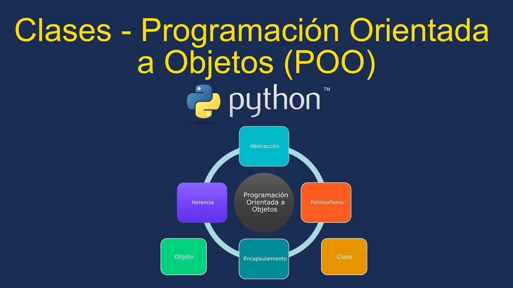

# **UT 4 - Programación orientada a objetos**

{ .img1 }

<br>

**Resultados de aprendizaje y criterios de evaluacion que se evaluarán en esta unidad.**  

|RA2. Escribe y prueba programas sencillos, reconociendo y aplicando los fundamentos de la programación orientada a objetos.|
|-|
|**a)** Se han identificado los fundamentos de la programación orientada a objetos. |
|**c)** Se han instanciado objetos a partir de clases predefinidas.|
|**d)** Se han utilizado métodos y propiedades de los objetos.|
|**e)** Se han escrito llamadas a métodos estáticos.|
|**f)** Se han utilizado parámetros en la llamada a métodos.|

|RA4. Desarrolla programas organizados en clases analizando y aplicando los principios de la programación orientada a objetos.|
|-|
|**a)** Se ha reconocido la sintaxis, estructura y componentes típicos de una clase.|
|**b)** Se han definido clases.|
|**c)** Se han definido propiedades y métodos.|
|**d)** Se han creado constructores.|
|**e)** Se han desarrollado programas que instancien y utilicen objetos de las clases creadas anteriormente.|
 
<br>

## **1 - Introducción a la programación orientada a objetos** 
La Programación Orientada a Objetos (POO) (Object-Oriented Programming (OOP) en inglés) es un paradigma de programación que surgió en los años 1970.

Este enfoque permite organizar el código en **clases y objetos**, de forma que el diseño del software se asemeje al modo en que representamos los elementos del mundo real.

Cada clase define las características (atributos) y los comportamientos (métodos) de un tipo de objeto.  
De esta forma, la POO permite modelar entidades y sus relaciones de forma modular, reutilizable y mantenible.

!!! abstract "Ejemplo: Objeto “Coche”"
    !!! info "Atributos:"  
        - color  
        - ruedas  
        - peso  
        - tamaño  

    !!! info "Métodos:"  
        - arrancar()  
        - frenar()  
        - acelerar()  
        - girar()  


## **2 - Principios básicos de la POO** 
La programación orientada a objetos está basada en 6 principios o pilares básicos:

- Abstracción
- Encapsulamiento
- Herencia
- Polimorfismo
- Cohesión
- Acoplamiento

### **2.1 - Abstracción**
La abstracción consiste en representar los aspectos esenciales de un objeto, ocultando los detalles innecesarios.
En otras palabras, se centra en qué hace un objeto y no cómo lo hace.

**Ejemplo:**  
Al conducir un coche, no se necesita saber cómo funciona el motor, solo se usan los pedales y el volante.
En código, se define una clase con métodos como arrancar() o frenar() sin necesidad de mostrar su implementación interna.

### **2.2 - Encapsulamiento**
El encapsulamiento consiste en proteger los datos de un objeto para evitar que se acceda o modifique su estado directamente desde fuera de la clase.
Los atributos suelen declararse como privados o protegidos, y se accede a ellos mediante métodos públicos llamados getters y setters.

**Ejemplo:**  
```PY
class Coche:
    def __init__(self):
        self.__velocidad = 0  # atributo privado

    def acelerar(self):
        self.__velocidad += 10

    def obtener_velocidad(self):
        return self.__velocidad
```

### **2.3 - Herencia**
La herencia permite que una clase **herede atributos y métodos de otra clase**. Esto facilita la **reutilización** del código y la creación de jerarquías de clases.

**Ejemplo:**    
En este ejemplo vemos como la clase `Coche` hereda el atributo `color` de `Vehiculo`.
```py
class Vehiculo:
    def __init__(self, color):
        self.color = color

class Coche(Vehiculo):
    def __init__(self, color, modelo):
        super().__init__(color)
        self.modelo = modelo
```

### **2.4 - Polimorfismo**
El polimorfismo permite que un **mismo método tenga distintos comportamientos** según el objeto que lo invoque.
En Python, esto se logra mediante la sobrescritura de métodos o el uso de métodos con el mismo nombre en diferentes clases.

**Ejemplo:**  
En este ejemplo vemos como las clases Perro y Gato heredan de animal 
```py
class Coches:
    def acelerar(self):
        pass

class Coupe(Coches):
    def acelerar(self):
        return "¡Acelerando a tope!"

class Sedan(Coches):
    def acelerar(self):
        return "Acelerando con calma"

for coche in [Coupe(), Sedan()]:
    print(coche.acelerar())
```

### **2.5 - Cohesión**
La cohesión mide cuán relacionadas están las responsabilidades dentro de una clase.
Una clase altamente cohesionada tiene una única responsabilidad bien definida, lo que facilita su mantenimiento, reutilización y comprensión.

**Ejemplo:**  
Una clase GestorCoches debería encargarse únicamente de gestionar las **características de los coches**, no de manejar información de **camiones o motocicletas**.

La alta cohesión mejora la **legibilidad del código** y reduce errores, siguiendo el principio de **una clase, una responsabilidad**.

### **2.6 - Acoplamiento**
El acoplamiento mide el grado de dependencia entre las clases o módulos.
En la POO se busca un bajo acoplamiento, es decir, que las clases dependan lo menos posible unas de otras.

**Ejemplo:**    
Cuando una clase Concesionario necesita obtener información de un Coche, no debe acceder directamente a sus atributos internos, sino hacerlo mediante un método (público) que proporcione esos datos.

```py
class Coche:
    def obtener_modelo(self):
        return "Toyota Corolla"

class Concesionario:
    def __init__(self, coche):
        self.coche = coche

    def mostrar_coche(self):
        print(self.coche.obtener_modelo())

# Ejemplo de uso
mi_coche = Coche()
concesionario = Concesionario(mi_coche)
concesionario.mostrar_coche()
```

## **3 - Creación y uso de un objeto**
En la Programación Orientada a Objetos (POO), una **clase** representa la **abstracción**: el modelo o plantilla que describe cómo serán los objetos.  
Cuando creamos un **objeto** a partir de una clase, estamos generando una **instancia concreta** de esa abstracción.

### **3.1 - Crear una clase**
Una clase es como un molde o plantilla que define cómo serán los objetos que creemos a partir de ella.
Dentro de una clase se especifican sus atributos (las características) y sus métodos (las acciones que puede realizar).

**Ejemplo:**
```py
class Coche:
    # Atributos de la clase
    def __init__(self, marca, modelo, color):
        self.marca = marca
        self.modelo = modelo
        self.color = color
        self.ruedas = 4
        self.abs_serie = True    

    # Metodos de la clase
    def arrancar(self):
        print("El coche está arrancando.")
    
    def acelerar(self):
        print("El coche está acelerando.")
    
    def frenar(self):
        print("El coche está frenando.")
    
    def girar(self):
        print("El coche está girando.")
```

- **Método constructor __init__()**  
El método **__init__()**, es el constructor de la clase (Coche).  
Se ejecuta automáticamente cada vez que se crea una nueva instancia (crea un nuevo objeto) de la clase (Coche).  
Su función es inicializar los atributos del objeto con los valores que se le pasan al crear la instancia.  

- **Parámetro self**  
El parámetro self es el primer parámetro obligatorio de todos los métodos de instancia dentro de una clase (en Python).  
Representa al objeto actual (la instancia) que está utilizando el método.

Gracias a self, la clase puede acceder y modificar sus propios atributos.
Por convención se llama self, aunque podría llarmarse de cualquier otra forma, pero se recomienda mantener esta convención.

### **3.2 - Instanciar una clase y usar métodos**
Una vez definida la clase, podemos crear objetos (también llamados instancias) a partir de ella.
Cada objeto es independiente, aunque comparta la misma estructura y métodos definidos en la clase.

**Ejemplo**
```py
# Crear (instanciar) un objeto de la clase Coche
mi_coche = Coche("Toyota", "Corolla", "Rojo")

# Usar los métodos del objeto
mi_coche.arrancar()
mi_coche.acelerar()
mi_coche.frenar()
mi_coche.girar()
```

Podemos crear tantos objetos como necesitamos.  
Cada objeto mantiene sus propios valores de atributos y no afecta a los demás.
```py
coche1 = Coche("Ford", "Focus", "Blanco")
coche2 = Coche("Honda", "Civic", "Gris")
coche2 = Coche("Toyota", "Corolla", "Verde")

print(coche1.marca, coche1.color)
print(coche2.marca, coche2.color)
print(coche3.marca, coche3.color)

```

### **3.3 - Acceder a los atributos del objeto**
Los atributos definidos dentro del método __init__() pueden consultarse o modificarse directamente a través del nombre del objeto seguido de un punto (.):
```py
print(mi_coche.marca)     # Muestra la marca del coche
print(mi_coche.color)     # Muestra el color del coche
print(mi_coche.ruedas)    # Muestra el número de ruedas
```

!!! danger "¡Si no tomamos las  medidas oportunas, podremos modificarlos los atributos del objeto desde fuera de la clase!"
    ```py
    print("Color coche original", mi_coche.color)
    mi_coche.color = "Azul"
    print("Color coche repintado", mi_coche.color)
    ```

### **3.4 - Tarea RA4-CEac**
!!! exercise "Ejercicio 1"  
    Realizar un programa que conste de lo siguiente:  

    1. Una clase llamada **Estudiante**, que tenga como atributos el nombre y la nota del alumno.    
    1. La clase tendrá los métodos para inicializar sus atributos, imprimirlos por terminal y mostrar un mensaje con el resultado de la nota y si ha aprobado o no.  
    1. Contruir 2 objetos (utilizar los inputs necesarios) e instanciar sus clases.   

!!! exercise "Ejercicio 2"
    Realizar un programa que conste de lo siguiente:

    1. Una clase llamada calculadora. que tendrá, entre otros los métodos sumar, restar, multiplicar y dividir.  
    1. El código necesario para que el usuario pueda introducir 2 valores **enteros**.  
    1. El código necesario para imprimir la suma, resta, multiplicación y división de los 2 valores.
    1. Si el usuario ha introducido un valor nulo y no se puede realizar la división, el programa imprimirá por pantalla **No se puede realizar la operación solicitada**.

<br>
### **3.5 - Métodos de instancia, de clase y estáticos**
Como hemos visto, los métodos son funciones incluidas dentro de la definición de una clase.  
Existen tres tipos de métodos, que se diferencian en cómo se definen y a qué tienen acceso: 

- **Método de instancia**: se utiliza cuando el método necesita acceder o modificar los datos específicos de un objeto (una instancia concreta de la clase).
- **Método de clase**: se utiliza cuando el método trabaja con datos que pertenecen a la clase en general, no a una instancia concreta (por ejemplo, atributos de clase compartidos).
- **Método estático**: se utiliza cuando el método no depende ni de los datos de instancia ni de los datos de clase. Realiza una operación independiente del estado del objeto o de la clase.

!!! tip "Métodos de instancia"
Los métodos de instancia son métodos que actúan sobre las instancias de una clase. Tienen acceso a los atributos de esas instancias a través del parámetro **self**.

Son los métodos más comunes en Python y se definen dentro de una clase utilizando def.

**Ejemplo**
```py
class Persona:
    def __init__(self, nombre, edad):
        self.nombre = nombre
        self.edad = edad

    def saludar(self):
        return f"Hola, soy {self.nombre} y tengo {self.edad} años."

# Creación de instancia de persona
persona1 = Persona("Luis", 30)

# Llamada al método de instancia
print(persona1.saludar())  # Salida: Hola, soy Luis y tengo 30 años.
```
→ saludar() es un método de instancia.  
→ Utiliza self para acceder a los atributos nombre y edad de la instancia persona1.

<br>
!!! tip "Métodos de clase"
Los métodos de clase son aquellos que actúan sobre **la clase en sí**, en lugar de hacerlo **sobre las instancias individuales**.   
Se definen utilizando el decorador **@classmethod** y reciben como primer parámetro cls, que representa la propia clase y permite acceder o modificar sus atributos y métodos de clase.
```py
class Coche:
    # Atributo de clase (compartido por todas las instancias)
    ruedas = 4  

    # Constructor
    def __init__(self, marca, modelo, color):
        self.marca = marca
        self.modelo = modelo
        self.color = color
        self.abs_serie = True    

    # Métodos de instancia
    def arrancar(self):
        print("El coche está arrancando.")
    
    def acelerar(self):
        print("El coche está acelerando.")
    
    def frenar(self):
        print("El coche está frenando.")
    
    def girar(self):
        print("El coche está girando.")

    # Método de clase
    @classmethod
    def cambiar_ruedas(cls, nuevas_ruedas):
        cls.ruedas = nuevas_ruedas
        print(f"Ahora todos los coches tienen {cls.ruedas} ruedas.")

# Intanciar el metodo de clase no el objeto
Coche.cambiar_ruedas(6)

# Crear nuevo objeto
mi_nuevo_coche = Coche
print("Ahora todos los coches de esa clase tendran", mi_nuevo_coche.ruedas,"ruedas")
```

<br>
!!! tip "Métodos estáticos"
Los métodos estáticos son métodos que están relacionados con la clase, pero no necesitan acceder ni a los atributos de instancia ni a los atributos de clase.
Se definen utilizando el decorador @staticmethod y no reciben los parámetros self ni cls, ya que no dependen del estado del objeto ni de la clase.

```py
class Coche:
    def __init__(self, marca, modelo, color, kilometros):
        self.marca = marca
        self.modelo = modelo
        self.color = color
        self.kilometros = kilometros
        self.ruedas = 4
        self.abs_serie = True    

    def arrancar(self):
        print("El coche está arrancando.")
    
    def acelerar(self):
        print("El coche está acelerando.")
    
    def frenar(self):
        print("El coche está frenando.")
    
    def girar(self):
        print("El coche está girando.")

    @staticmethod
    def es_nuevo(kilometros):
        if kilometros >= 10000: 
            return "de segunda mano"
        elif kilometros > 500 and kilometros <10000: 
            return "semi nuevo"
        else: 
            return "nuevo"

coche1 = Coche("Toyota", "Corolla", "gris", 0)
coche2 = Coche("Ford", "Focus", "rojo", 3000)
coche3 = Coche("Seat", "Ibiza", "azul", 15000)           
```
<br>
**Ejemplo con los 3 métodos**
```py
class Coche:
    # Atributo de clase (compartido por todas las instancias)
    ruedas = 4
    
    def __init__(self, marca, modelo, color, kilometros = 0):
        self.marca = marca
        self.modelo = modelo
        self.color = color
        self.kilometros = kilometros
        self.abs_serie = True    

    # Métodos de instancia
    def arrancar(self):
        print("El coche está arrancando.")
    
    def acelerar(self):
        print("El coche está acelerando.")
    
    def frenar(self):
        print("El coche está frenando.")
    
    def girar(self):
        print("El coche está girando.")

    def mostrar_marca(self):
        return f"Este coche es un {self.marca}"

    # Método estático
    @staticmethod
    def es_nuevo(kilometros):
        """Devuelve el estado del coche según los kilómetros."""
        if kilometros >= 10000: 
            return "de segunda mano"
        elif 500 < kilometros < 10000: 
            return "semi nuevo"
        else: 
            return "nuevo"

    # Métodos de clase
    @classmethod
    def cambiar_ruedas(cls, nuevas_ruedas):
        cls.ruedas = nuevas_ruedas
        print(f"Ahora todos los coches tienen {cls.ruedas} ruedas.")     

    @classmethod
    def crear_coche_predeterminado(cls):
        """Crea un coche con valores estándar."""
        return cls("Toyota", "Corolla", "gris", 0)       


# Ejemplo de uso
coche_1 = Coche("Toyota", "Corolla", "gris")
coche_2 = Coche("Ford", "Focus", "rojo", 8000)

# Método de instancia → depende del objeto
print(coche_1.mostrar_marca())  # "Este coche es un Toyota"

# Método de clase → afecta a la clase entera
Coche.cambiar_ruedas(6)  
print(f"El coche coche_2 tiene {coche_2.ruedas} ruedas")  # 6 (se actualizó para todas las instancias)

# Método estático → independiente de la clase o instancia
print("El coche 1 es", Coche.es_nuevo(coche_1.kilometros))  # nuevo
print("El coche 2 es",Coche.es_nuevo(coche_2.kilometros))  # semi nuevo

# Método de clase que crea un coche predefinido
coche_3 = Coche.crear_coche_predeterminado()
print(f"Coche 3 (predeterminado): {coche_3.marca}, {coche_3.modelo}, {coche_3.color}, {coche_3.kilometros} km")
```

### **3.6 - Tarea RA4-CEd**
!!! exercise "Conversor que permita convertir valores de tiempo"
    Crea una clase llamada Conversor que permita convertir valores de tiempo entre:
    
    - Segundos → Horas, minutos y segundos (HH:MM:SS)
    - Horas, minutos y segundos (HH:MM:SS) → Segundos
    - El programa debe solicitar al usuario el tipo de conversión que desea realizar y los datos necesarios, mostrando el resultado por pantalla.

    **Guía para la creación del programa**

    1. Clase principal: Conversor
    1. La clase debe incluir al menos tres métodos:  
    &emsp;&emsp;- Un método estático segundos_a_hms(segundos) que:  
    &emsp;&emsp;&emsp;&emsp;Reciba un número entero de segundos.  
    &emsp;&emsp;&emsp;&emsp;Devuelva una cadena en formato "HH:MM:SS".  
    &emsp;&emsp;- Un método de clase desde_hms(cls, horas, minutos, segundos) que:      
    &emsp;&emsp;&emsp;&emsp;Reciba tres enteros (horas, minutos, segundos).  
    &emsp;&emsp;&emsp;&emsp;Devuelva el total en segundos.  
    &emsp;&emsp;- Un método de instancia ejecutar_conversion() que:  
    &emsp;&emsp;&emsp;Muestre un pequeño menú.  
    &emsp;&emsp;&emsp;Use la estructura match para decidir qué tipo de conversión hacer.  
    &emsp;&emsp;&emsp;Solicite al usuario los datos y muestre el resultado.  
    1. El programa debe realizar una sola conversión y terminar su ejecución.  
    1. Se deben manejar errores de entrada con try y except para evitar que el programa se detenga ante datos incorrectos.  

    **Ayuda para la introducción de datos**  
    Para la introducción de los datos HMS se puede usar la función integrada map():  
    Ejemplo:
    ```py
    h, m, s = map(int, input("Introduce la hora en formato HH MM SS (separados por espacios): ").split())
    ```


## **4 - Encapsulamiento en la POO y Python**
Como podemos ver en el ejemplo siguiente, resulta muy fácil en python, **modificar los atributos y acceder a los métodos de una clase** desde el exterior. 
```py
# Definición de la clase
class Coche:
    def __init__(self, marca, modelo, color):
        # Atributos de instancia
        self.marca = marca
        self.modelo = modelo
        self.color = color
        self.velocidad = 0  # valor inicial

    # Método para acelerar
    def acelerar(self, cantidad):
        self.velocidad += cantidad
        print(f"El coche ha acelerado. Velocidad actual: {self.velocidad} km/h")

    # Método para frenar
    def frenar(self, cantidad):
        self.velocidad = max(0, self.velocidad - cantidad)
        print(f"El coche ha frenado. Velocidad actual: {self.velocidad} km/h")

    # Método para mostrar información
    def mostrar_info(self):
        print(f"{self.marca} {self.modelo} ({self.color}) - {self.velocidad} km/h")

# Intancia y manipulación de atributos

# Crear un objeto (instancia de la clase)
mi_coche = Coche("Toyota", "Corolla", "Rojo")

# Acceder a los atributos
print(mi_coche.marca)     # Toyota
print(mi_coche.color)     # Rojo

# Modificar un atributo directamente
mi_coche.color = "Azul"
print(mi_coche.color)     # Azul

# Usar métodos
mi_coche.mostrar_info()   # Toyota Corolla (Azul) - 0 km/h
mi_coche.acelerar(50)     # Acelera a 50 km/h
mi_coche.frenar(20)       # Baja a 30 km/h

# Comprobar valores modificados
mi_coche.mostrar_info()   # Toyota Corolla (Azul) - 30 km/h
```

El encapsulamiento consiste en hacer que **los atributos y/o métodos internos a una clase no se puedan acceder ni modificar desde fuera**. Sera solamente el propio objeto el que pueda acceder a ellos.

### **4.1 - Atributos y métodos privados**
Los atributos y métodos que comienzan por un doble guión bajo '__' se consideran privados. Intentar modificarlos o instanciarlos lanzará un error.
```py
class Coche:
    def __init__(self, marca, modelo, color):
        # Atributos de instancia
        self.marca = marca
        self.modelo = modelo
        self.color = color
        self.velocidad = 0  # valor inicial
        self.__ruedas = 4

    # Método para acelerar
    def acelerar(self, cantidad):
        self.velocidad += cantidad
        print(f"El coche ha acelerado. Velocidad actual: {self.velocidad} km/h")

    # Método para frenar
    def frenar(self, cantidad):
        self.velocidad = max(0, self.velocidad - cantidad)
        print(f"El coche ha frenado. Velocidad actual: {self.velocidad} km/h")

    # Método para mostrar información
    def __mostrar_info(self):
        print(f"{self.marca} {self.modelo} ({self.color}) - {self.velocidad} km/h")

# Intancia y manipulación de atributos

# Crear un objeto (instancia de la clase)
mi_coche = Coche("Toyota", "Corolla", "Rojo")

# Acceder a los atributos
print(mi_coche.marca)     # Toyota
print(mi_coche.color)     # Rojo

# Modificar un atributo directamente
mi_coche.color = "Azul"
print(mi_coche.color)     # Azul

# Usar métodos
mi_coche.mostrar_info()   # Toyota Corolla (Azul) - 0 km/h
mi_coche.acelerar(50)     # Acelera a 50 km/h
mi_coche.frenar(20)       # Baja a 30 km/h

# Comprobar valores modificados
mi_coche.mostrar_info()   # Toyota Corolla (Azul) - 30 km/h

# Acceder a un atributo o un método de instancia encapsulado
mi_coche.__mostrar_info() # Esta linea producirá un error
print(mi_coche.__ruedas)  # Esta linea producirá un error
```

### **4.2 - Modificadores de atributos privados con métodos getters y setters**
Muy habituales en otros lenguajes de programación (Java, C#) los métodos getters y setters no se recomiendan en python.

```py
class Persona:
    def __init__(self, nombre, edad):
        self.__nombre = nombre   
        self.__edad = edad

    # Setter para nombre
    def set_nombre(self, nuevo_Nombre):
        self.__nombre = nuevo_Nombre

    # Getter para nombre
    def get_nombre(self):
        return self.__nombre


# --- Uso del objeto ---
persona = Persona("Ana", 25)

# Acceso mediante metodos
#print("Edad de la persona", persona.__edad)      # Producira un error
#print("Nombre de la persona", persona.__nombre)  # Producira un error

# Modificar mediante getters 
persona.set_nombre("Arturo")       

# Acceder mediante setters 
print("Nuevo nombre de la persona:", persona.get_nombre())   
```

En Python no se recomienda usar getters y setters tradicionales (como get_Nombre() o set_Nombre()) porque van en contra de la filosofía del lenguaje que apuesta por la simplicidad y la legibilidad.

**Python confía en el programador** y no impone un control estricto sobre los atributos.

Si se necesita validar o controlar el acceso, puede hacerse usando los decoradores @property y @<atributo>.setter, manteniendo la misma sintaxis y evitando romper el código existente.

### **4.3 - Decoradores @propiedad y @<atributo>.setter para atributos y métodos privados**
En Python, los decoradores @property y @<atributo>.setter permiten controlar el acceso a los atributos de un objeto. 

1. **@property**  
Convierte un método en un “getter”, de manera que se pueda acceder a él como si fuera un atributo.

1. **@<atributo>.setter**  
Se utiliza junto a @property para definir un “setter”, es decir, cómo se modifica un atributo.

#### **4.3.1 - Atributos**
**Ejemplo anterior modificado**
```py
class Persona:
    def __init__(self, nombre, edad):
        self.__nombre = nombre
        self.__edad = edad

    # Getter para nombre
    @property
    def nombre(self):
        return self.__nombre

    # Setter para nombre
    @nombre.setter
    def nombre(self, nuevo_nombre):
        self.__nombre = nuevo_nombre


# --- Uso del objeto ---
persona = Persona("Ana", 25)

# Modificar usando el setter
persona.nombre = "Arturo"

# Acceder usando el getter
print("Nuevo nombre de la persona:", persona.nombre)  
```

#### **4.3.2 - Métodos privados**
```py 
class Cuenta:
    def __init__(self, saldo):
        self.__saldo = saldo  # atributo privado

    # Método privado que devuelve el saldo
    def __obtener_saldo(self):
        return self.__saldo
    
    # Método privado que fija el saldo
    def __fijar_saldo_inicial(self, nuevo_saldo):
        self.__saldo = nuevo_saldo

    # Getter de la propiedad
    @property
    def visualizar_saldo(self):
        return self.__obtener_saldo()
    
    # Setter de la propiedad
    @visualizar_saldo.setter
    def visualizar_saldo(self, nuevo_saldo):
        self.__fijar_saldo_inicial(nuevo_saldo)


# --- Uso del objeto ---
cuenta = Cuenta(100)
print("Saldo inicial:", cuenta.visualizar_saldo)  # 100

cuenta.visualizar_saldo = 80  # usar el setter
print("Saldo actualizado:", cuenta.visualizar_saldo)  # 80
```

### **4.4 - Tarea RA2-CEe**
Teneís el siguiente programa:
```py
class Limon:
    def __init__(self, peso=200):
        self.__peso = peso
        
    @property
    def peso(self):
        return print("El valor de __peso es =:",self.__peso)

    @peso.setter
    def peso(self, nuevo_peso):
        self.__peso = nuevo_peso        
```

Ampliar el programa para que la ejecución devuelva en la terminal el siguiente log:  
```bash
Empezamos el programa
---------------------
Pulsar intro para continuar...
Voy a instanciar la clase Limon con limon = Limon(peso)
Tambien puede hacerlo con limon = Limon(), entonces me asignara por defecto peso=200
Antes de todo pediré por consola el peso del limón
---------------------
Pulsar intro para instanciar la clase limón
---------------------
Introducir el peso del limon: 212
Estoy en el método construtor __init__ y me han pasado el valor peso = 212
Pulsar intro para seguir
---------------------
El atributo estático __peso ya tiene el valor de peso = 212
Pulsar intro para seguir
---------------------
Con isinstance(objeto, clase), podemos verificar que el objeto creado pertenece a la clase correcta
Pulsar intro para continuar...
---------------------
¿Pertenece limon a la clase Limon? → True
Pulsar intro para continuar...
---------------------
Tenemos a nuestra disposicion el objeto 'limon'
Pulsar intro para continuar...
---------------------
Vamos a obtener el valor de __peso
Pulsar intro para continuar...
---------------------
Con el método peso con decorador @property obtendremos el valor de __peso
Pulsar intro para continuar...
---------------------
Pulsar intro para instanciar limon.peso
Estoy dentro de property (getter) pero aún no he hecho nada
Pulsar intro para seguir...
El valor de __peso dentro de @property es: 212
Pulsar intro para seguir...
Voy a devolver el valor de __peso
El valor de __peso fuera de la clase es: 212
Pulsar intro para continuar...
---------------------
Con el método peso con decorador @peso.setter modificaremos el valor de __peso
Pulsar intro para continuar...
Introducir el nuevo peso del limon: 258
Estoy dentro de @peso.setter pero aun no he hecho nada
Pulsar intro para continuar...
El valor de __peso dentro de @peso.setter antes de hacer anda es: 212
Pulsar intro para continuar...
---------------------
Acabo de modificar el valor de __peso a:  258
---------------------
Fin del programa
```

## **5 - Herencia en python**

<!-- https://ellibrodepython.com/herencia-en-python -->
<!-- https://www.luisllamas.es/herencia-en-python/ -->
<!-- https://python.sdv.u-paris.fr/24_avoir_plus_la_classe_avec_les_objets/#243-heritage -->


<!-- para ejercicios
https://pythones.net/variables-de-clases-estaticas-instancia-python-oop/ 
https://www.ionos.es/digitalguide/paginas-web/desarrollo-web/python-static-method/-->


<!-- Cómo usar los objetos
 https://www.luisllamas.es/que-es-un-objeto-en-programacion/ -->
<!-- https://gitlab.com/josedom24/curso_programacion_python3/-/tree/master/curso/u39?ref_type=heads -->
<!-- https://ellibrodepython.com/programacion-orientada-a-objetos-python -->

<!-- 

```py
# definimos una variable de tipo lista
datos = []
# Usamos un iterador para llenar la lista
for i in range(5):
  dato = input("Introducir cualquier cosa: ")
  datos.append(dato)
# Usamos otro iterador para leer la lista y sacamos el tipo de variable que contiene
for i in range(5):
 # print(f"Posición {i}, valor {datos[i]}, tipo {type(datos[i])}") 
  print(f"Posición {i}, valor {datos[i]}, tipo: {'string' if isinstance(datos[i],str) else ''}")
```
  
<!-- https://jsp.shiksha/index.php/portfolio/bacse101-problem-solving-using-python/introduction-python -->
 
<!-- https://www.luisllamas.es/que-es-un-objeto-en-programacion/ -->
<!-- https://gitlab.com/josedom24/curso_programacion_python3/-/tree/master/curso/u39?ref_type=heads -->


 <!-- === "RA 1"
    |RA1. Reconoce la estructura de un programa informático, identificando y relacionando los elementos propios del lenguaje de programación utilizado.|Peso|
    |-|-|
    *|**a)** Se han identificado los bloques que componen la estructura de un programa informático. |12%|
    *|**b)** Se han respetado las especificaciones técnicas del proceso de instalación. |11%|
    *|**c)** Se han utilizado entornos integrados de desarrollo. |11%|
    *|**d)** Se han identificado los distintos tipos de variables y la utilidad específica de cada uno. |11%|
    *|**e)** Se ha modificado el código de un programa para crear y utilizar variables. |11%|
    *|**f)** Se han creado y utilizado constantes y literales. |11%|
    *|**g)** Se han clasificado, reconocido y utilizado en expresiones los operadores del lenguaje. |11%|
    *|**h)** Se ha comprobado el funcionamiento de las conversiones de tipo explícitas e implícitas. |11%|
    *|**i)** Se han introducido comentarios en el código. |11%|


=== "RA 2"
    |RA2. Escribe y prueba programas sencillos, reconociendo y aplicando los fundamentos de la programación orientada a objetos.|Peso|
    |-|-|
    *|**a)** Se han identificado los fundamentos de la programación orientada a objetos. |12%|    
    *|**c)** Se han instanciado objetos a partir de clases predefinidas.|11%|
    *|**d)** Se han utilizado métodos y propiedades de los objetos.|11%|
    *|**e)** Se han escrito llamadas a métodos estáticos.|11%|
    |**f)** Se han utilizado parámetros en la llamada a métodos.|11%|

=== "RA 3"
    |RA3. Escribe y depura código, analizando y utilizando las estructuras de control del lenguaje.|Peso|
    |-|-|
    *|**a)** Se ha escrito y probado código que haga uso de estructuras de selección.|12%|
    *|**b)** Se han utilizado estructuras de repetición.|11%|
    *|**c)** Se han reconocido las posibilidades de las sentencias de salto.|11%|
    *|**d)** Se ha escrito código utilizando control de excepciones.|11%|
    *|**e)** Se han creado programas ejecutables utilizando diferentes estructuras de control.|11%|
    *|**h)** Se han creado excepciones.|11%|
    *|**i)** Se han utilizado aserciones para la detección y corrección de errores durante la fase de desarrollo.|11%|

=== "RA 4"
    |RA4. Desarrolla programas organizados en clases analizando y aplicando los principios de la programación orientada a objetos.|Peso|
    |-|-|
    |**a)** Se ha reconocido la sintaxis, estructura y componentes típicos de una clase.|12%|
    |**b)** Se han definido clases.|11%|
    |**c)** Se han definido propiedades y métodos.|11%|
    |**d)** Se han creado constructores.|11%|
    |**e)** Se han desarrollado programas que instancien y utilicen objetos de las clases creadas anteriormente.|11%|
    
=== "RA 5"
    |RA5. Realiza operaciones de entrada y salida de información, utilizando procedimientos específicos del lenguaje y librerías de clases.|Peso|
    |-|-|
    *|**a)** Se ha utilizado la consola para realizar operaciones de entrada y salida de información.|16%|
    *|**b)** Se han aplicado formatos en la visualización de la información.|12%|
    *|**c)** Se han reconocido las posibilidades de entrada / salida del lenguaje y las librerías asociadas.|12%|
    |**d)** Se han utilizado ficheros para almacenar y recuperar información.|12%|
    |**e)** Se han creado programas que utilicen diversos métodos de acceso al contenido de los ficheros.|12%|
    |**f)** Se han utilizado las herramientas del entorno de desarrollo para crear interfaces gráficos de usuario simples.|12%|
    |**g)** Se han programado controladores de eventos.|12%|
    |**h)** Se han escrito programas que utilicen interfaces gráficos para la entrada y salida de información.|12%|

=== "RA 6"
    |RA6. Escribe programas que manipulen información, seleccionando y utilizando tipos avanzados de datos.|Peso|
    |-|-|
    |**c)** Se han utilizado listas para almacenar y procesar información.|10%|
    |**e)** Se han reconocido las características y ventajas de cada una de las colecciones de datos disponibles.|10%|
    |**f)** Se han creado clases y métodos genéricos.|10%|
    |**g)** Se han utilizado expresiones regulares en la búsqueda de patrones en cadenas de texto.|10%|
    |**i)** Se han realizado programas que realicen manipulaciones sobre documentos escritos en diferentes lenguajes de intercambio de datos.|10%|
    |**j)** Se han utilizado operaciones agregadas para el manejo de información almacenada en colecciones.|10%| -->