# **UT 6 - Interfaces gráficas**

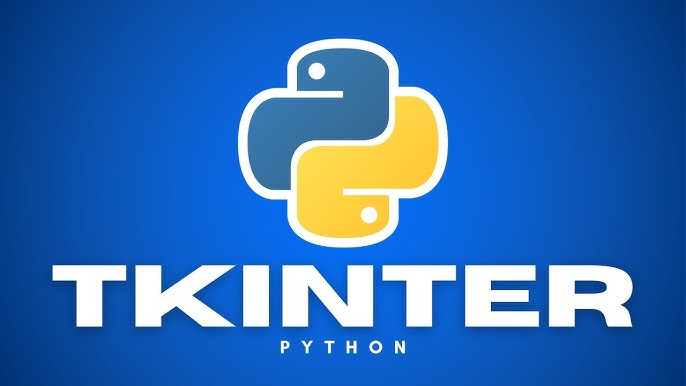{ .cincozero }

<br>

**Resultados de aprendizaje y criterios de evaluacion que se evaluarán en esta unidad.**  

|RA4. Desarrolla programas organizados en clases analizando y aplicando los principios de la programación orientada a objetos.|
|-|
|**b)** Se han definido clases.|
|**c)** Se han definido propiedades y métodos.|
|**d)** Se han creado constructores.|

|RA5. Realiza operaciones de entrada y salida de información, utilizando procedimientos específicos del lenguaje y librerías de clases.|
|-|
|**f)** Se han utilizado las herramientas del entorno de desarrollo para crear interfaces gráficos de usuario simples.|
|**g)** Se han programado controladores de eventos.|
|**h)** Se han escrito programas que utilicen interfaces gráficos para la entrada y salida de información.|

|RA6. Escribe programas que manipulen información, seleccionando y utilizando tipos avanzados de datos.|
|-|
|**g)** Se han utilizado expresiones regulares en la búsqueda de patrones en cadenas de texto.|

<br>

## **1 - Módulos en Python**
Un módulo es un archivo que contiene código (funciones, clases, variables e incluso programas completos) y que puede ser **importado** desde otros archivos.

**Ejemplo**  
Podemos definir un módulo **calculadora.py** con cuatros funciones de cálculo básicas.

```py 
# calculadora.py
def suma(a, b):
    return a + b

def resta(a, b):
    return a - b

def multiplica(a, b):
    return a * b

def divide(a, b):
    try:
        return a / b
    except ZeroDivisionError:
        return "No se puede dividir por 0"
```

!!! tip "¿Para qué sirven los módulos?"
    ✔ Evitar escribir el mismo código varias veces  
    ✔ Organizar programas grandes en archivos más pequeños  
    ✔ Compartir y reutilizar código entre distintos proyectos  
    ✔ Facilitar la lectura y el mantenimiento del software  

### **1.1 - Importar todo o parte del módulo**
Una vez definido el módulo, podemos **importarlo total o parcialmente** en otro archivo **.py** usando la sentencia **import**.

**Importación total**  
En este caso importaremos la totalidad del contenido del módulo.

```py
import calculadora

print(calculadora.suma(4, 3))   
print(calculadora.resta(10, 9)) 
```

**Importación parcial**  
En este caso solo importaremos las funciones que necesitaremos dentro de nuestro programa.

```py
from calculadora import suma, resta

print(suma(4, 3))   
print(resta(10, 9)) 
```

### **1.2 - Uso de * y de un alias para el uso de módulos**
También podemos importar el contenido del módulo con `*`. Esto nos permitirá usar los elementos de calculadora.py sin necesidad de escribir el nombre del módulo (calculadora) delante. 

```py
from calculadora import *

print(divide(4, 3))   
print(multiplica(10, 9)) 
```

Sin embargo, si importamos varios módulos, puede resultar peligroso utilizar `*`, ya que pueden existir elementos con **el mismo nombre** en módulos diferentes. Para evitar conflictos, es mejor usar un alias para el módulo.

```py
import calculadora as calc

print(calc.divide(4, 3))   
print(calc.multiplica(10, 9)) 
```

También se puede crear un alias solo para un elemento concreto dentro del módulo.

```py
from calculadora import divide as div 

print(div(10, 9))
``` 

### **1.3 - Tipos de módulos**
Python tiene 3 grandes tipos de módulos:

| Tipo de módulo          | Descripción                  | Ejemplo                              |
| ----------------------- | ---------------------------- | ------------------------------------ |
| **Módulos estándar**    | Vienen instalados con Python | `math`, `random`, `os`, `datetime`, `tkinter`   |
| **Módulos de terceros** | Se instalan con `pip`        | `numpy`, `pandas`, `flask`, `pygame` |
| **Módulos propios**     | Los crea el programador      | Archivo `.py` en el proyecto      |

### **1.4 - Ubicación de los módulos**

Cuando importamos un módulo con **import**, Python busca módulos en este orden:

1. El directorio desde el cual se ejecuta el programa
1. Las rutas dentro de la variable de entorno PYTHONPATH (si existe)
1. Rutas estándar de la instalación de Python (incluye la librería estándar)
1. Rutas de site-packages (donde pip instala los módulos)  


>**Caso de importacion desde una carpeta del directorio del programa principal**
  ```bash
  # Proyecto

  ├── programa.py
  ├── modulos
  │   ├── __init__.py # Para compatibilidad con versiones antiguas de Python
  │   ├── calculadora.py
  │   └── interfaces.py

  ```  
  ```py 
  # Programa.py
  from modulos.calculadora import divide as div
  ...
  ```


- Para el resto de casos, es necesario configurar las variables de entorno del sistema operativo (cosa que hicimos al instalar python), o usar sys.path en el programa.  
  ```py
  import sys
  sys.path.append('ruta/del/modulo')
  from modulo import elemento
  ...
  ```
  <br>

- **Nota:**  
A fin de depurar problemas con la importación de módulos, se recomienda añadir las rutas a los módulos propios al principio del programa, antes de cualquier importación.
```py
import sys
sys.path.insert(0, 'ruta/del/modulo')
from modulo import elemento
...
``` 
<br>

- Para saber las rutas donde Python busca los módulos, podemos usar el módulo sys y su variable path:
```py
import sys
print(sys.path)
```

### **1.5 - Listar los nombres de nuestro entorno (namespace)**
**La función dir()** permite ver los nombres (variables, funciones, clases, etc) existentes en nuestro namespace.  
Si, por ejemplo, probamos en un módulo vacío, veremos como tenemos varios nombres rodeados de __. **Se trata de nombres que Python crea por debajo** es decir, atributos y variables especiales que Python genera automáticamente.

Si ejecutamos dir() dentro de un módulo vacío :

```py
print(dir())
``` 

Veremos el siguiente resultado:

```bash
['__annotations__', '__builtins__', '__cached__', '__doc__', '__file__', '__loader__', '__name__', '__package__', '__spec__']
```

Si importamos nuestro módulo calculadora y volvemos a ejecutar dir(), veremos que ahora tenemos también el módulo que acabamos de importar.

```py
import calculadora
print(dir())
``` 
Resultado:

```bash
['__annotations__', '__builtins__', '__cached__', '__doc__', '__file__', '__loader__', '__name__', '__package__', '__spec__', 'calculadora']
```

Si queremos ver los nombres definidos dentro del módulo calculadora, podemos pasarlo a dir().

```py 
import calculadora
print(dir(calculadora))
``` 

Resultado:

```bash
['__builtins__', '__cached__', '__doc__', '__file__', '__loader__', '__name__', '__package__', '__spec__', 'divide', 'multiplica', 'resta', 'suma']
``` 

O más simplemente recuperar las rutas y el nombre del archivo en el que estamos trabajando con `__name__`.

```py
print(__name__)
```

Resultado:

```
C:/Users/titan/Documents/GitHub/githubpages/Apuntes/venv/Scripts/python.exe c:/Users/titan/Documents/GitHub/githubpages/Apuntes/docs/SMX/SMX_2/Opt_Python/code/UT6/programa.py
__main__
```
<br>

### **1.6 - Módulos y función main**
Cuando ejecutamos un módulo directamente, Python asigna el valor `"__main__"` a la variable especial `__name__`.  
Si el módulo es importado desde otro módulo, `__name__` toma el valor del nombre del módulo.
Esto nos permite saber si un módulo está siendo ejecutado directamente o importado desde otro módulo.

Por ese motivo, es muy común ver en los módulos la siguiente estructura:

```py
def funcion_principal():
    # Código principal del módulo
    pass
if __name__ == "__main__":
    funcion_principal() 
``` 
De esta forma, si el módulo es ejecutado directamente, se llamará a la función `funcion_principal()`.  
Si el módulo es importado desde otro módulo, no se ejecutará nada automáticamente.

### **1.7 - Recargado de módulos**
Es importante notar que los módulos solamente son cargados una vez. Si dentro de un módulo tenemos código directamente ejecutable (por ejemplo, un print), al volver a importar el módulo no se reflejarán los cambios.  

```
# calculadora.py
print("Módulo calculadora cargado.")
...
```

```py
import calculadora  # Muestra: Módulo calculadora cargado.
import calculadora  # No muestra nada
```

Para forzar la recarga del módulo, podemos usar la función `reload()` del módulo `importlib`.

```py 
import importlib
import calculadora

... # Código
importlib.reload(calculadora) # Forzar recarga del módulo (práctica poco recomendable)
```

---
## **2 - Interfaces gráficas en Python**
Existen varios módulos para crear interfaces gráficas en Python (Tkinter, WxPython, PyQT, PyGTK). El más utilizado y que viene incluido en la librería estándar es **tkinter**.  
**Tkinter** no es un **motor gráfico**: actúa como capa de enlace (wrapper) y permite a los programas en Python utilizar **la biblioteca gráfica Tcl/Tk**.  

<u>Toda la información sobre Tkinter está disponible en la documentación oficial:</u>  

- Documentación oficial de [**Tkinter**](https://docs.python.org/es/3.14/library/tkinter.html#module-tkinter)  
- Documentación obsoleta de [**Tkinter**](https://docs.python.org/es/3.6/library/tk.html)  
- Github de [**Tedboy**](https://tedboy.github.io/python_stdlib/generated/generated/Tkinter.Wm.html)  
- Guía de referencia de [**shipman**](https://tkdocs.com/shipman/)  

### **2.1 - Estructura de ventana con Tkinter**
La estructura de una interfaz en Tkinter parte de la ventana raíz (Root), que actúa como contenedor principal. Dentro de ella pueden añadirse marcos (Frames) para organizar la distribución visual y, sobre ellos, se colocan los widgets que proporcionan la interactividad con el usuario.

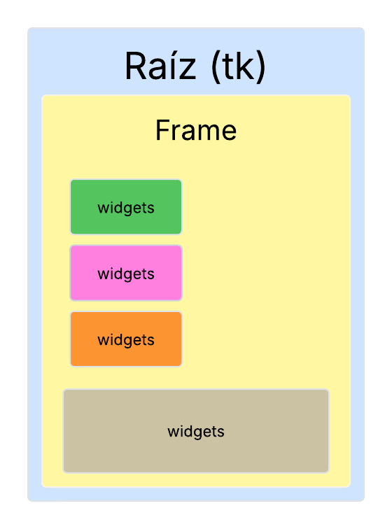{.trescinco}

Para crear una ventana básica con Tkinter, deberemos seguir los siguientes pasos:

1. Importar el módulo tkinter
1. Crear la ventana principal (root).
1. Dentro de la ventana crearemos marcos (frames) para organizar los elementos.
1. Dentro de esos marcos iremos añadiendo los widgets (botones, etiquetas, cuadros de texto, etc).
1. Iniciar el bucle principal de eventos.

!!! tip "Qué es la ventana raíz?"
    La ventana raíz (o ventana principal) es la ventana principal de la aplicación gráfica.  
    Es el contenedor principal donde se alojan todos los demás elementos de la interfaz gráfica, como botones, etiquetas
    cuadros de texto, menús, etc.

!!! tip "Qué es un frame?"
    Un frame es un contenedor (también llamado widget frame) que nos permite agrupar y organizar otros widgets dentro de la ventana principal.  
    Podemos pensar en un frame como una "sub-ventana" dentro de la ventana principal, que puede tener su propio tamaño, color de fondo y otros atributos.

!!! tip "¿Qué es un widget?"
    Un widget es un elemento de la interfaz gráfica con el que el usuario puede interactuar.  
    Algunos ejemplos comunes de widgets son: botones, etiquetas, cuadros de texto, menús desplegables, casillas de verificación, etc.

!!! tip "¿Qué es un evento?"
    Un evento es una acción o suceso que ocurre en la interfaz gráfica y que puede ser detectado y manejado por el programa.  
    Algunos ejemplos de eventos son: hacer clic en un botón, mover el ratón, escribir en un cuadro de texto, cerrar la ventana, etc.         

<br>
#### **2.1.1 - Ventana raíz**
La ventana root es la ventana principal de la aplicación gráfica. Es el primer elemento que se crea al iniciar una interfaz y actúa como contenedor base para todos los demás componentes (widgets) de la interfaz. Solo debe existir **una única ventana root por aplicación**, y permanece activa hasta que el usuario la cierre o se finalice la ejecución del programa.

**Ejemplo de ventana básica con un frame:**

```py
import tkinter as tk
from tkinter import Tk

# Crear la ventana principal
ventana = Tk()
ventana.title("Ejemplo de Frame")

# Crear un frame dentro de la ventana principal
frame = tk.Frame(ventana, width=300, height=200, bg="lightblue")
frame.pack()

# Iniciar el bucle principal de Tkinter
ventana.mainloop()
```

!!! tip "Comentarios del programa"
    1. ventana = Tk() crea una instancia de la ventana raíz (o principal) de la aplicación.
    1. ventana.title("Ejemplo de Frame") asigna un título visible en la barra superior de la ventana.
    1. tk.Frame(...) crea un frame (contenedor) **dentro de la ventana principal** con un tamaño y color de fondo especificados.
    1. frame.pack() coloca el frame dentro de la ventana principal y lo hace visible.
    1. ventana.mainloop() inicia el bucle de eventos de la aplicación, permitiendo que la ventana permanezca abierta y responda a las interacciones del usuario.


**Ejemplo de configuración de la ventana principal:**
```py
import tkinter as tk
from tkinter import Tk
# Crear la ventana principal
ventana = Tk() 
ventana.title("Mi primera ventana")
ventana.geometry("400x300+100+100") # tamaño ventana y posición
ventana.resizable(True, False)
ventana.configure(bg="red")
ventana.iconbitmap("icono.ico")
# Iniciar el bucle principal de Tkinter
ventana.mainloop()
```       
<br> 

#### **2.1.2 - Frames en Tkinter**
Un frame es un contenedor que nos permite agrupar y organizar otros widgets (un framwe también en un widget) dentro de la ventana principal.  

**Ejemplo de creación de un frame:**

```py
import tkinter as tk
from tkinter import Tk
# Crear la ventana principal
ventana = Tk()
ventana.title("Ejemplo de Frame")
# Crear un frame dentro de la ventana principal
frame = tk.Frame(ventana, width=300, height=200, bg="lightblue")
frame.pack() # integrar el frame en la ventana
# Iniciar el bucle principal de Tkinter
ventana.mainloop()
```

!!! tip "Comentarios del programa"
    1. tk.Frame(...) crea un frame (contenedor) dentro de la ventana principal con un tamaño y color de fondo especificados.
    1. frame.pack() coloca el frame dentro de la ventana principal y lo hace visible.

<br>

#### **2.1.3 - Widgets comunes en Tkinter**
Algunos de los widgets más comunes que podemos utilizar en Tkinter son:

| Widget        | Descripción                                      | Ejemplo                          |
|-|-|-|
| Button        | Crea un botón interactivo                        | tk.Button(frame, text="Clic aquí") |
| Label         | Muestra texto o imágenes                         | tk.Label(frame, text="Hola Mundo") |
| Entry         | Permite la entrada de texto                      | tk.Entry(frame)                  |
| Text          | Permite la entrada de texto multilínea          | tk.Text(frame)                   |
| Checkbutton   | Crea una casilla de verificación                 | tk.Checkbutton(frame, text="Opción") |
| Radiobutton   | Crea un botón de opción                          | tk.Radiobutton(frame, text="Opción 1") |
| Listbox       | Muestra una lista de opciones                    | tk.Listbox(frame)                |
| Frame         | Crea un contenedor para otros widgets            | tk.Frame(ventana)                |
| Canvas        | Permite dibujar gráficos y formas                | tk.Canvas(frame, width=200, height=100) |

<br>

#### **2.1.4 - Gestión de eventos en Tkinter**
En Tkinter, los eventos son acciones que ocurren en la interfaz gráfica y que pueden ser
detectados y manejados por el programa. Algunos ejemplos de eventos son: hacer clic en un botón, mover el ratón, escribir en un cuadro de texto, cerrar la ventana, etc.
Para manejar eventos en Tkinter, se utilizan **controladores de eventos** (event handlers), que son funciones que se ejecutan cuando ocurre un evento específico.  

**Ejemplo de manejo de eventos con un botón:**

```py
import tkinter as tk

# Función que se ejecuta al hacer clic en el botón
def boton_clic():
    print("¡Botón clickeado!")

# Crear la ventana principal
ventana = tk.Tk()
ventana.title("Manejo de Eventos")
ventana.geometry("300x200+500+500")
ventana.configure(bg="blue")
ventana.resizable(True, True)

# Crear un frame dentro de la ventana principal
frame = tk.Frame(ventana, width=200, height=150, bg="lightblue")
frame.pack()
frame.pack_propagate(False)

# Crear un botón y asignar el controlador de eventos
boton = tk.Button(frame, text="Clic aquí", command=boton_clic)
boton.pack(expand=True)

# Iniciar el bucle principal de Tkinter
ventana.mainloop()
```

!!! tip "Comentarios del programa"
    1. La función `boton_clic()` es el controlador de eventos que se ejecuta cuando se hace clic en el botón.
    1. El botón se crea con `tk.Button(...)`, y el parámetro `command=boton_clic` asigna la función `boton_clic` como el controlador de eventos para el evento de clic.
    1. Cuando el usuario hace clic en el botón, se imprime el mensaje "¡Botón clickeado!" en la consola.    

<br>

### **2.2 - Métodos y atributos de la ventana principal**
La ventana principal creada mediante Tk() actúa como el contenedor raíz de toda la aplicación.  
A través de sus métodos y atributos es posible controlar su apariencia, su comportamiento y la interacción con el usuario. Estos permiten configurar aspectos como el tamaño inicial de la ventana, su título, su icono, su posición en pantalla o si puede ser redimensionada, entre otros parámetros habituales en las interfaces gráficas.

| Método / Propiedad                        | Función principal                                | Ejemplo de uso                             |
| ----------------------------------------- | ------------------------------------------------ | ------------------------------------------ |
| `ventana.title("texto")`                     | Establece el título de la ventana                | `ventana.title("Mi aplicación")`              |
| `ventana.geometry("800x600")`                | Define tamaño inicial de la ventana              | `ventana.geometry("800x600")`                 |
| `ventana.geometry("800x600+200+100")`        | Define tamaño y posición en pantalla             | `ventana.geometry("800x600+200+100")`         |
| `ventana.minsize(ancho, alto)`               | Fija tamaño mínimo permitido                     | `ventana.minsize(400, 300)`                   |
| `ventana.maxsize(ancho, alto)`               | Fija tamaño máximo permitido                     | `ventana.maxsize(1024, 768)`                  |
| `ventana.resizable(ancho_bool, alto_bool)`   | Permite o no redimensionar en cada eje           | `ventana.resizable(False, True)`              |
| `ventana.iconbitmap("archivo.ico")`          | Cambia el icono de la ventana                    | `ventana.iconbitmap("logo.ico")`              |
| `ventana.configure(bg="color")`              | Cambia el color de fondo                         | `ventana.configure(bg="#e0e0e0")`             |
| `ventana.attributes("-topmost", True)`       | Mantiene la ventana siempre encima               | `ventana.attributes("-topmost", True)`        |
| `ventana.attributes("-alpha", valor)`        | Ajusta la transparencia (0.0–1.0)                | `ventana.attributes("-alpha", 0.8)`           |
| `ventana.state("zoomed")`                    | Abre la ventana maximizada                       | `ventana.state("zoomed")`                     |
| `ventana.overrideredirect(True)`             | Elimina barra de título y bordes del sistema     | `ventana.overrideredirect(True)`              |
| `ventana.withdraw()`                         | Oculta la ventana temporalmente                  | `ventana.withdraw()`                          |
| `ventana.deiconify()`                        | Muestra la ventana oculta con `withdraw()`       | `ventana.deiconify()`                         |
| `ventana.protocol("WM_DELETE_WINDOW", func)` | Controla la acción al intentar cerrar la ventana | `ventana.protocol("WM_DELETE_WINDOW", salir)` |

<br>

#### **2.2.1 - Método atributes()**
El método ventana.attributes() permite consultar y modificar ciertos atributos especiales de la ventana principal relacionados con su apariencia y su comportamiento.
Si hacemos un print(ventana.attributes()) veremos algo similar a lo siguiente:
```py
print(ventana.attributes())
# ('-alpha', 1.0, '-transparentcolor', '', '-disabled', 0, '-fullscreen', 0, '-toolwindow', 0, '-topmost', 0)
```

Cada par de valores representa un atributo junto con su estado actual.  

**Atributos**

| Atributo            | Función                                                                      |
| ------------------- | ---------------------------------------------------------------------------- |
| `-alpha`            | Nivel de opacidad de la ventana (1.0 = opaca, 0.0 = totalmente transparente) |
| `-transparentcolor` | Color que se vuelve transparente en la ventana                               |
| `-disabled`         | Desactiva la interacción del usuario con la ventana                          |
| `-fullscreen`       | Habilita o deshabilita el modo de pantalla completa                          |
| `-toolwindow`       | Muestra la ventana como una ventana de herramienta (solo en Windows)         |
| `-topmost`          | Mantiene la ventana siempre por encima del resto                             |

Para modificar esos atributos deberemos seguir la siguiente sintaxis:
```py
ventana.attributes(opción, valor)
```

**Ejemplos**
```py
ventana.attributes("-alpha", 0.8)         # Ventana semitransparente
ventana.attributes("-fullscreen", True)   # Modo pantalla completa
ventana.attributes("-transparentcolor", "blue")   # Si el bg de la venta es azul, pasará a transparente
```
<br>

#### **2.2.2 - Método config()**
El método ventana.config() (ventana.configure()) permite modificar los parámetros generales de la ventana principal, principalmente los relacionados con su apariencia visual y su comportamiento básico. Este método se utiliza para ajustar propiedades como el color de fondo, tamaño de fuente por defecto, bordes y otros atributos habituales de los widgets en tkinter.

La sintaxis general es:
```py
ventana.config(opción = valor)
# ventana.configure(opción = valor)
```

De manera similar a `attributes()` si no pasamos ningún atributo `config()`, nos devolverá un diccionario con los valores actuales. 

**Atributos más habituales**

| Parámetro común      | Función                                                       |
| -------------------- | ------------------------------------------------------------- |
| `bg` o `background`  | Establece el color de fondo de la ventana                     |
| `cursor`             | Cambia el tipo de cursor cuando pasa sobre la ventana         |
| `relief`             | Tipo de borde decorativo (flat, sunken, raised, ridge, solid) |
| `bd` o `borderwidth` | Grosor del borde en píxeles                                   |
| `highlightcolor`     | Color del borde de resaltado                                  |
| `highlightthickness` | Grosor del marco de resaltado alrededor de la ventana         |
| `takefocus`          | Indica si la ventana puede recibir el foco inicial            |

**Ejemplo**
```py
ventana.config(bg="lightgray")        # Cambia el color de fondo de la ventana
ventana.config(cursor="hand2")        # Cambia el cursor al estilo de "mano"
ventana.configure(relief="ridge", bd=5)  # Aplica un borde en relieve
```

<br>

#### **2.2.3 - Ejercicios**
!!! exercise "Ejercicio 1 - Ajustes de ventana"
    Crear una ventana con los siguientes requisitos:

    | Propiedad        | Valor                               |
    | ---------------- | ----------------------------------- |
    | Título           | `"Mi primera ventana"`              |
    | Tamaño           | `800x500` píxeles                   |
    | Posición inicial | `x = 200`, `y = 100`                |
    | Color de fondo   | Azul                                |
    | Cursor           | `heart`                             |
    | Redimensionable  | Solo en horizontal |

!!! exercise "Ejercicio 2 - Atributos especiales"
    Crear una ventana con los siguientes requisitos:

    | Propiedad                                     | Valor                                               |
    | --------------------------------------------- | --------------------------------------------------- |
    | Opacidad (`-alpha`)                           | 0.85                                                |
    | Ventana siempre encima (`-topmost`)           | Activado                                            |
    | Transparencia por color (`-transparentcolor`) | Amarillo                                            |
    | Icono                                         | Uno personalizado (archivo `.ico`)                  |
    | Tamaño                                        | `600x400` (posicionada en el centro de la pantalla) |

    **Pista:** Para recuperar el ancho y alto de la pantalla usar: **pantalla_ancho = ventana.winfo_screenwidth()**...


!!! exercise "Ejercicio 3"
    Crear una ventana con los siguientes requisitos:

    | Propiedad                             | Valor                                       |
    | ------------------------------------- | ------------------------------------------- |
    | Título                                | `"Modo presentación"`                       |
    | Modo de ventana                       | Pantalla completa (`-fullscreen = True`)    |
    | Fondo                                 | Negro                                       |
    | Cursor                                | `pirate`                                    |
    | Redimensionable                       | No se debe poder redimensionar              |
    | Interacción del usuario (`-disabled`) | Activada (no permite clics ni manipulación) |


### **2.3 - Métodos y atributos de Frame**

- Los Frame son widgets contenedores usados para organizar y agrupar otros widgets dentro de una ventana o de otro frame.  
- Se crean mediante el constructor: Frame(master, **options).  
- Las optiones permiten definir configuraciones como color, tamaño, bordes, etc.  
- La colocación del Frame dentro del elemento contenedor se realiza usando uno de los gestores de geometría de Tkinter: pack(), grid() o place(), que determinan su posición y su tamaño dentro del widget padre (por ejemplo, la ventana raíz).  

**Ejemplo básico**  
```py
from tkinter import *

# Crear la ventana principal
ventana = Tk()
ventana.title("Ejemplo de Frame")

# Crear un frame dentro de la ventana principal
frame = Frame(ventana)
frame.config(width=480, height=320, bg="lightblue")
frame.pack()

# Iniciar el bucle principal de Tkinter
ventana.mainloop()
```
<br>

#### **2.3.1 - Atributos de Frame**
Los Frame comparten con root (Tk) el método .config(), que permite definir los atributos del widget, como el color, tamaño, borde y otras opciones visuales.

**Nota:**  
La posición del frame dentro del widget contenedor no se establece con .config(), sino mediante un gestor de geometría (pack(), grid() o place()).  

**Atributos más habituales**

| Atributo              | Descripción                                   | Tipo / Valores / Ejemplo                                        |
| --------------------- | --------------------------------------------- | ------------------------------------------------------ |
| `master`              | El widget padre donde se colocará el frame.          | frame = tk.Frame(ventana). Puede ser la ventana principal (`ventana`) o incluso otro `Frame`. |
| `bg` / `background`   | Establece el color de fondo del frame.        | Nombre de color o código hexadecimal (`lightblue` / `#1E90FF`)   |
| `bd` / `borderwidth`  | Ancho del borde del frame                     | Entero (px), por defecto es 0 (no tiene borde).        |
| `relief`              | Estilo del borde                              | `flat` (predeterminado), `raised`, `sunken`, `groove`, `ridge`, `solid` |
| `width`               | Anchura del frame                             | Entero (px)                                            |
| `height`              | Altura del frame                              | Entero (px)                                            |
| `cursor`              | Tipo de cursor cuando pasa el ratón           | `"arrow"`, `"hand2"`, `"cross"`, `"pirate"`, `"no"`, etc.     |
| `highlightbackground` | Color del borde cuando no tiene foco          | Color                                                  |
| `highlightcolor`      | Color del borde cuando tiene foco             | Color                                                  |
| `highlightthickness`  | Grosor del borde de foco                      | Entero (px)                                            |
| `padx`                | Relleno extra horizontal dentro del frame     | Entero (px)                                            |
| `pady`                | Relleno extra vertical dentro del frame       | Entero (px)                                            |
| `takefocus`           | Permite recibir foco con Tab                  | `True`, `False`                                        |
| `class_`              | Nombre de clase de ventana para temas/estilos | Cadena                                                 |
| `colormap`            | Mapa de color para manejo de paleta           | `None` (normalmente no se usa)                         |


**Ejemplo básico**
```py
from tkinter import *
# Crear la ventana principal
ventana = Tk()
ventana.title("Ejemplo de Frame")

# Configurar la ventana principal
ventana.geometry("400x300+500+500")
ventana.config(bg="blue")          # color de fondo, background
ventana.config(cursor="pirate")    # tipo de cursor (arrow defecto)
ventana.config(relief="sunken")    # relieve del root 
ventana.config(bd=25)              # tamaño del borde en píxeles

# Crear un frame dentro de la ventana principal
frame = Frame(ventana)

# Configurar el frame
frame.config(width=400, height=300)
frame.config(cursor="")         # Tipo de cursor
frame.config(relief="sunken")   # relieve del frame hundido
frame.config(bd=25)             # tamaño del borde en píxeles

# Empaquetar el frame dentro de ventana
frame.pack()

# Iniciar el bucle principal de Tkinter
ventana.mainloop()
```
<br>

#### **2.3.2 – Métodos de gestión geométrica de los Frame**
Los Frame, al igual que cualquier widget, no se posicionan por sí mismos, sino que deben colocarse dentro de su contenedor mediante un gestor de geometría.
Tkinter dispone de tres gestores de geometría: **pack()**, **grid()** y **place()**. Solo se debe utilizarse uno de ellos por cada contenedor (no se pueden combinar).

| Gestor    | Características                                                                           | Cuándo usarlo                                           |
| --------- | ----------------------------------------------------------------------------------------- | ------------------------------------------------------- |
| `pack()`  | Coloca los widgets en bloques, uno después del otro (arriba, abajo, izquierda o derecha). | Interfaces sencillas y disposición vertical/horizontal. |
| `grid()`  | Organiza los widgets en una tabla de filas y columnas.                                    | Formularios o interfaces alineadas.                     |
| `place()` | Coloca los widgets en una posición exacta mediante coordenadas x/y.                       | Interfaces con diseño absoluto (menos habitual).        |

<br>

##### **2.3.2.1 – Método pack**
El gestor de geometría `pack()` organiza los marcos (y los widgets) de una manera simple y rápida.

| Atributo | Función | Valores permitidos |
| --------- | --------| ------------------ |
| `side`    | Indica en qué lado del contenedor se colocará el widget | `"top"` (por defecto), `"bottom"`, `"left"`, `"right"` |
| `fill`    | Indica si el widget debe expandirse para ocupar más espacio     | `"none"` (por defecto), `"x"`, `"y"`, `"both"` |
| `expand`  | Permite que el widget ocupe espacio adicional dentro del contenedor cuando este se expande | `True` / `False`    |
| `anchor`  | Alinea el widget dentro del espacio asignado   | `"n"`, `"s"`, `"e"`, `"w"`, `"ne"`, `"nw"`, `"se"`, `"sw"`, `"center"` |
| `padx`    | Relleno (margen) horizontal externo alrededor del widget       | Entero o tupla `(izq, der)`   |
| `pady`    | Relleno (margen) vertical externo alrededor del widget         | Entero o tupla `(arriba, abajo)`  |
| `ipadx`   | Relleno interno horizontal (espacio dentro del widget)      | Entero    |
| `ipady`   | Relleno interno vertical (espacio dentro del widget)        | Entero   |
| `before`  | Coloca el widget antes de otro widget ya empaquetado     | Referencia a otro widget       |
| `after`   | Coloca el widget después de otro widget ya empaquetado      | Referencia a otro          |
| `in_`     | Indica un contenedor alternativo donde empacar el widget    | Referencia a otro contenedor (por ejemplo `frame2`)   |

<br>

##### **2.3.2.2 – Ejemplos**

**Ejemplo 1:**  
El programa crea 2 marcos. El marco_1 utilizará todo el espacio disponible en x mientras que el marco_2 lo hará en el sentido vertical. 
```py 
from tkinter import *

root = Tk()
root.title("Ejemplo 1")
root.geometry("300x200+500+400")

marco_1 = Frame(root, bg="blue", width=300, height=100)
marco_1.pack(fill="x")

marco_2 = Frame(root, bg="gray", height=100, width=100)
marco_2.pack(expand=True, fill="y", anchor=CENTER)

root.mainloop()
```

**Ejemplo 2:**  
El programa crea 3 marcos de 130x200 píxeles, colocados pegados a la izquierda. Con `expand=True` y `fill="both"` ocuparán todo el espacio disponible del contenedor, ajustándose al redimensionar la ventana.   
```py
from tkinter import *

root = Tk()
root.title("Ejemplo 2")

marco1 = Frame(root, bg="red", width=130, height=200)
marco1.pack(side="left", expand=True, fill="both", padx=5, pady=5)
marco2 = Frame(root, bg="green", width=130, height=200)
marco2.pack(side="left", expand=True, fill="both", padx=5, pady=5)
marco3 = Frame(root, bg="blue", width=130, height=200)
marco3.pack(side="left", expand=True, fill="both", padx=5, pady=5)

root.mainloop()
```

**Ejemplo 3:**  
El programa crea 4 marcos. Cada marco seguirá una orientación una orientación diferente dentro de su espacio disponible.   

```py
from tkinter import *
root = Tk()
root.title("Ejemplo 3")
root.geometry("400x400+500+200")

# Frame NW 
marco_4 = Frame(root, bg="yellow", width=400, height=100)
marco_4.pack(anchor=NW)

# Frame SE
marco_1 = Frame(root, bg="red", width=400, height=100)
marco_1.pack(anchor=SE, expand=True)

# Frame SW
marco_2 = Frame(root, bg="blue", width=400, height=100)
marco_2.pack(anchor=SW, expand=True)

# Frame SE
marco_3 = Frame(root, bg="green", width=400, height=100)
marco_3.pack(anchor=SE, expand=True)

root.mainloop()
```
<br>

##### **2.3.2.3 – Ejercicios**

!!! exercise "Ejercicio 1"
    Crear una ventana y 3 frames con los siguientes requisitos:

    | Propiedad                             | Valor                                       |
    | ------------------------------------- | ------------------------------------------- |
    | Título                                | `Ejercicio 1`                       |
    | Frame 1                       | bg= rojo    |
    | Frame 2                       | bg= verde    |
    | Frame 3                       | bg= azul    |
    | Colocación de los frames                                 | Uno encima del otro                  |
    | Medidas ventana y frames                      | Libre elección                            |
   
!!! exercise "Ejercicio 2"
    Crear una ventana y 3 frames con los siguientes requisitos:

     | Propiedad                             | Valor                                       |
    | ------------------------------------- | ------------------------------------------- |
    | Título                                | `Ejercicio 2`                       |
    | Frame 1                       | bg= amarillo    |
    | Frame 2                       | bg= naranja    |
    | Frame 3                       | bg= violeta    |
    | Colocación de los frames                                 | Uno al lado del otro  |
    | Medidas ventana y frames                      | Libre elección                            |


!!! exercise "Ejercicio 3"
    Crear una ventana y 3 frames con los siguientes requisitos:

     | Propiedad                             | Valor                                       |
    | ------------------------------------- | ------------------------------------------- |
    | Título                                | `Ejercicio 3`                       |
    | 1 frame superior y otro inferior      | bg= amarillo / naranja               |
    | Dentro del frame inferior posicionar 2 frames, uno al lado del otro    | bg= verde / rojo         |
    | Añadir márgenes a los frames interiores. |         |

<br>

##### **2.3.2.4 – Método grid**
Mientras que **pack()** organiza los widgets en bloques (arriba, abajo, izquierda o derecha), lo que puede dificultar la previsión de su posición exacta, **el gestor de geometría grid()** permite ubicarlos en filas y columnas, lo que resulta mucho más intuitivo para diseñar la interfaz gráfica.

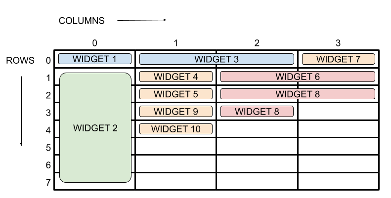{ .cincozero }

| Atributo        | Función                               |
| ---------------- | ------------------------------------- |
| `row`, `column`   | Fila y columna donde se ubica el widget  |
| `columnspan`, `rowspan` | Especifica cuantas columnas y varias filas ocupa el widget |
| `padx`, `pady`   | Espacio (en píxeles) exterior (margin / margen)             |
| `ipadx`, `ipady` | Espacio (en píxeles) interior (padding / relleno del widget) |
| `sticky`         | Alineación dentro de la celda (`S`, `N`, `E`, `W`, `NW`, `NE`, `SW` y `SE`) |

**Nota:**  

- Si no se define `sticky`, el comportamiento por defecto del widget será centrarse dentro de la celda. 
- Si pasamos `NSEW` a `sticky`, el widget ocupará toda la celda. 

**Ejemplo:**
```py
from tkinter import *
root = Tk()
root.title("Ejemplo de grid")
root.geometry("600x400+500+200")

ventana1 = Frame(root, bg="yellow", height=200, width=300)
ventana1.grid(row=0, column=0, columnspan=3, sticky=NSEW)

ventana2 = Frame(root, bg="red", height=200, width=200)
ventana2.grid(row=0, column=3, columnspan=2, sticky=NSEW)

ventana3 = Frame(root, bg="blue", height=200, width=600)
ventana3.grid(row=1, column=0, columnspan=6, sticky=NSEW)

root.mainloop()
```

<br>

##### **2.3.2.5 - Métodos grid_columnconfigure() y grid_rowconfigure()**

!!! tip "grid_columnconfigure()"

El método **grid_columnconfigure()** permite ajustar el comportamiento de las columnas en un widget que utiliza **el gestor de geometría grid()**. Este método define como una columna debe expandirse, contraerse y alinearse **dentro del widget**.

**Sintaxis:**
```py
widget.grid_columnconfigure(index, weight=1, minsize=None, pad=None)
```

**Donde**

- **index:** El índice (número) de la columna a configurar (empieza en 0).
- **weight:** Representa cómo la columna debe distribuir el espacio sobrante. Cuanto mayor sea el weight, más espacio recibirá esa columna cuando se redimensione el widget. El valor predeterminado es 0, lo que significa que la columna no cambiará de tamaño.
- **minsize:** Establece el tamaño mínimo de la columna en píxeles.
- **pad:** Añade un relleno adicional a la columna (en píxeles).  
<br>

!!! tip "grid_rowconfigure()"
El método **grid_rowconfigure()** es similar a grid_columnconfigure(), pero permite configurar el comportamiento de las filas en lugar de las columnas.

**Sintaxis:**
```py 
widget.grid_rowconfigure(index, weight=1, minsize=None, pad=None)
```

**Ejemplo:** 
```py
# Definir ventana root que usa grid() para distribuir sus widgets
...

# Configurar las filas y columnas para que crezcan proporcionalmente 
# columnas
ventana.grid_columnconfigure(0, weight=1) 
ventana.grid_columnconfigure(1, weight=1)

# filas
ventana.grid_rowconfigure(0, weight=1) 
ventana.grid_rowconfigure(1, weight=1)
```
<br>

##### **2.3.2.6 – Ejercicios**

!!! exercise "Ejercicio 1"
    Crear una ventana y colocar frames usando el método grid().

    | Propiedad                             | Valor                                       |
    | ------------------------------------- | ------------------------------------------- |
    | Título                                | `Ejercicio 1`                       |
    | Frame 1                       | bg= rojo    |
    | Frame 2                       | bg= verde    |
    | Frame 3                       | bg= azul    |
    | Colocación de los frames                                 | frame1 en col 0, frame2 en col 1 y frame3 en col2            |
    | Medidas ventana y frames                      | Libre elección                            |

!!! exercise "Ejercicio 2"
    Crear una ventana y colocar frames usando el método grid().

    | Propiedad                             | Valor                                       |
    | ------------------------------------- | ------------------------------------------- |
    | Título                                | `Ejercicio 2`                       |
    | Frame 1                       | bg= rojo    |
    | Frame 2                       | bg= verde    |
    | Frame 3                       | bg= azul    |
    | Frame 4                       | bg= violeta    |  
    | Colocación de los frames                                 | frame1: Row0Col0, frame2: Row0Col1, frame3: Row1Col0, frame4: Row1Col1   |
    | Medidas ventana y frames                      | Libre elección                            |

!!! exercise "Ejercicio 3"
    Ampliar el ejercico 2 para que el frame 3 sea mas grande 4.  
    Usar sticky en el frame 4 y visualizar los resultados.

!!! exercise "Ejercicio 4"
    Crea una interfaz con la siguiente estructura:  
    Pista: Usar colspan.
    ```bash
    +---------------------------+
    |       HEADER (frame1)     |
    +-------------+-------------+
    | SIDEBAR     |   CONTENT   |
    | (frame2)    |   (frame3)  |
    +-------------+-------------+
    ```

!!! exercise "Ejercicio 5"
    Ampliar el ejercicio 4 para que los frames se adapten a las dimensiones de la ventana al redimensionarla.

##### **2.3.2.7 – Método place**

- El gestor de geometría **place()** permite tener un control absoluto sobre la disposición de los widgets. Con place(), se puede especificar el tamaño del widget, así como las coordenadas (x, y) para organizarlo dentro de la ventana principal.  
- **place()** es particularmente útil para organizar botones u otros widgets en una ventana de diálogo sencilla.

| Atributo     | Tipo            | Función / Descripción                                                                                | Ejemplo                                                                              |
| ------------ | --------------- | ---------------------------------------------------------------------------------------------------- | ------------------------------------------------------------------------------------ |
| `x`          | int             | Posición horizontal en píxeles desde la esquina izquierda del contenedor                             | `place(x=50)`                                                                        |
| `y`          | int             | Posición vertical en píxeles desde la esquina superior del contenedor                                | `place(y=100)`                                                                       |
| `width`      | int             | Ancho fijo del widget en píxeles                                                                     | `place(width=200)`                                                                   |
| `height`     | int             | Alto fijo del widget en píxeles                                                                      | `place(height=150)`                                                                  |
| `relx`       | float (0.0-1.0) | Posición horizontal relativa al ancho del contenedor                                                 | `place(relx=0.5)` → 50% desde la izquierda                                           |
| `rely`       | float (0.0-1.0) | Posición vertical relativa al alto del contenedor                                                    | `place(rely=0.25)` → 25% desde arriba                                                |
| `relwidth`   | float (0.0-1.0) | Ancho relativo al ancho del contenedor                                                               | `place(relwidth=0.5)` → 50% del ancho                                                |
| `relheight`  | float (0.0-1.0) | Alto relativo al alto del contenedor                                                                 | `place(relheight=0.3)` → 30% del alto                                                |
| `anchor`     | str             | Punto de referencia del widget para ubicarlo (`n`, `s`, `e`, `w`, `center`, combinaciones como `ne`) | `place(relx=0.5, rely=0.5, anchor="center")` coloca el centro del widget en el medio |
| `bordermode` | str             | Define si `x`/`y` se calculan desde el borde interno (`INSIDE`) o externo (`OUTSIDE`) del contenedor | `place(bordermode=OUTSIDE)`                                                          |

**Ejemplo**

```py
from tkinter import *
root = Tk()
root.title("Ejemplo con place")
root.geometry("600x400+500+200")

ventana1 = Frame(root, bg="yellow")
ventana1.place(relx=0, rely=0, relwidth=0.5, relheight=0.5)

ventana2 = Frame(root, bg="red")
ventana2.place(relx=0.5, rely=0, relwidth=0.5, relheight=0.5)

ventana3 = Frame(root, bg="blue")
ventana3.place(relx=0, rely=0.5, relwidth=1, relheight=0.5)

root.mainloop()
```

<br>

##### **2.3.2.8 – Ejercicios**
!!! exercise "Ejercicio 1"
    Crear una ventana root de 400x300.  
    Dentro de esa ventana posicionar un frame de 50x50 a X= 140 ,Y=20    

!!! exercise "Ejercicio 2"
    Crear una ventana root de 400x300  
    Dentro de esa ventana posicionar 7 widgets de tipo Frame.  
    Los seis primeros frames deben disponerse en 2 filas y 2 columnas.  
    El séptimo frame debe situarse centrado horizontalmente en la fila 3 y ocupar todo el espacio.      

### **2.4 - Widgets y variables de control**

!!! tip "widgets"
Un widget es un elemento de interfaz gráfica que el usuario puede **ver**, **manipular** o **utilizar** dentro de una ventana.  
Son los componentes visuales que permiten **construir una GUI**: botones, cuadros de texto, menús, etiquetas, etc.

**Widgets clásicos de tkinter:**
Los widgets tradicionales, directamente accesibles después de importar tkinter son:

- Label: Etiqueta de texto (o imagen).
- Entry: Campo de texto de una sola línea.
- Text: Área de texto multilínea.
- Button: Botón estándar.
- Checkbutton: Casilla de verificación.
- LabelFrame: Marco con título (contenedor).
- Listbox: Lista de elementos seleccionables.
- Menu: Menú genérico.
- Menubutton: Botón que despliega un menú.
- Message: Texto multilínea autoajustable.
- Radiobutton: Botón de opción.
- Scale: Selector deslizante numérico.  
- Scrollbar: Barra de desplazamiento.
- Spinbox: Control numérico con flechas.
- Toplevel: Ventana secundaria.
- Frame: Contenedor básico para agrupar y organizar otros widgets.
- OptionMenu: Menú desplegable simplificado asociado a una variable de control.
- PanedWindow: Contenedor dividido en paneles ajustables mediante una barra separadora.
- Canvas: Área para gráficos, líneas, figuras, imágenes.

!!! tip "variables de control"
Las variables de control son objetos especiales que **se asocian a los widgets** para **almacenar sus valores** y facilitar **su disponibilidad en otras partes del programa**. Pueden ser de tipo numérico, de cadena y booleano. 

Son esenciales cuando se necesita **leer o actualizar el contenido de un widget** sin manipular directamente su texto o estado.

---

#### **2.4.1 - Label (etiqueta)**
Label es utilizado para mostrar texto.

**Ejemplo básico**
```py
from tkinter import *
root = Tk()
 
label = Label(root,text="¡Hola Mundo!")
label.pack()

root.mainloop() 
```

**Propiedades de Label()**

| Propiedad  | Descripción                                                | Ejemplo                      |
| ---------- | ---------------------------------------------------------- | ---------------------------- |
| `text`     | Texto estático.                                            | `text="Hola"`                |
| `textvariable`     | Vincula Label a una variable de control.    | Ver 2.4.8 - Variables de control                |
| `font`     | Tipo de letra, tamaño y estilo.                            | `font=("Arial", 16, "bold")` |
| `fg`       | Color del texto.                                           | `fg="red"`                   |
| `bg`       | Color de fondo.                                            | `bg="yellow"`                |
| `width`    | Anchura del widget (en caracteres).                        | `width=20`                   |
| `height`   | Altura del widget (en líneas).                             | `height=2`                   |
| `padx`     | Espacio horizontal interno.                                | `padx=10`                    |
| `pady`     | Espacio vertical interno.                                  | `pady=10`                    |
| `bd`       | Grosor del borde.                                          | `bd=3`                       |
| `relief`   | Estilo del borde (flat, raised, sunken, groove, ridge).    | `relief="sunken"`            |
| `anchor`   | Posición del texto dentro del Label.                       | `anchor="w"`                 |
| `justify`  | Justificación del texto (multilínea).                      | `justify="center"`           |
| `image`    | Imagen a mostrar en lugar de texto.                        | `image=photo`                |
| `bitmap`   | Imagen en blanco y negro.                                  | `bitmap="warning"`           |
| `compound` | Combina texto e imagen (left, right, top, bottom, center). | `compound="left"`            |
| `cursor`   | Cursor del ratón cuando pasa por encima.                   | `cursor="hand2"`             |
| `state`    | Estado del widget (normal o disabled).                     | `state="disabled"`           |

**Ejemplo con varias propiedades**
```py
import tkinter as tk

root = tk.Tk()

label = tk.Label(
    root,
    text="Texto de ejemplo",
    font=("Helvetica", 24, "bold italic"),
    fg="white",
    bg="#333333",
    padx=20,
    pady=10
)

label.pack()

root.mainloop()
```

**Ejemplo con image.**
```py
...
imagen = PhotoImage(file="imagen.gif")
Label(root, image=imagen, bd=0).pack()
```

**Notas importantes**  

- Casi todas las propiedades pueden modificarse tras la creación del objeto Label usando .config():
```py
label.config(fg="blue")
```
- El tamaño del Label se ajusta automáticamente al contenedor salvo que se definan el width y el height.

---

#### **2.4.2 - Entry(texto corto)**
Entry es un widget de tipo campo de texto que permite al usuario introducir o editar una cadena de caracteres.

**Ejemplo básico**  
```py
from tkinter import *
root = Tk()

entry = Entry(root, width=30, show="*", justify="center")
entry.pack()

root.mainloop()
```  
<br>
**Propiedades de entry()**  

| Parámetro      | Descripción                                                           |
| -------------- | --------------------------------------------------------------------- |
| `width`        | Ancho del campo en caracteres.                                        |
| `font`         | Fuente y tamaño del texto.                                            |
| `show`         | Sustituye los caracteres por otro (por ejemplo `*` para contraseñas). |
| `textvariable` | Variable asociada (`StringVar`) para gestionar datos dinámicamente.   |
| `justify`      | Alineación del texto (`left`, `center`, `right`).                     |
| `state`        | Estado: `normal`, `disabled`, `readonly`.                             |
| `bg` / `fg`    | Colores de fondo y texto.                                             |

---

#### **2.4.3 - Text(texto largo)**
**Text** permite mostrar, introducir y editar texto de **varias líneas**. A diferencia de Entry, que se limita a una línea, Text ofrece herramientas avanzadas para trabajar con párrafos, aplicar formatos, gestionar posiciones mediante índices y manipular contenido con mayor flexibilidad.

**Ejemplo básico:**
```py
from tkinter import *

root = Tk()

text = Text(root, width=40, height=10, font=("Arial", 12))
text.pack()

text.insert("1.0", "Escribe aquí tu texto...")

root.mainloop()
```

**Principales características del widget Text:**

**El widget Text permite:**

- Gestionar texto multilínea con saltos automáticos o manuales.
- Insertar y eliminar contenido usando índices del estilo "fila.columna".
- Aplicar etiquetas (tags) para formatear partes concretas del texto.
- Asociar scrollbars para manejar contenido largo.
- Controlar el estado del widget (editable o de solo lectura).
- Insertar otros widgets como imágenes o botones embebidos.

---

#### **2.4.4 - Button (botón)**
**Button** es probablemente el widget más utilizado en el diseño de interfaces gráficas.  
A diferencia de los widgets vistos hasta ahora, se caracteriza por desencadenar la función asociada al argumento `command` al ser pulsado. 

**Ejemplo básico**
```py
def saludar():
    print("Hola desde el botón")

boton = tk.Button(root, text="Aceptar", bg="lightblue", fg="black", font=("Arial", 12), command=saludar)
```

**Propiedades de button()**

| Parámetro         | Descripción                                                               |
| ----------------- | ------------------------------------------------------------------------- |
| `text`            | Texto mostrado en el botón.                                               |
| `command`         | Función llamada al pulsar el botón.                                       |
| `image`           | Imagen mostrada en vez del texto (o junto a él).                          |
| `compound`        | Cómo combinar texto e imagen: `left`, `right`, `top`, `bottom`.           |
| `state`           | Estado: `normal`, `disabled`, `active`.                                   |
| `width`, `height` | Tamaño del botón.                                                         |
| `bg`, `fg`        | Colores de fondo y texto.                                                 |
| `font`            | Fuente del texto.                                                         |
| `padx`, `pady`    | Relleno interno.                                                          |
| `relief`          | Estilo del borde: `raised`, `sunken`, `flat`, `ridge`, `solid`, `groove`. |
| `cursor`          | Cursor al pasar por encima.                                               |

!!! warning "Parametro command"
    No se debe poner paréntesis a la función, si no se le pasa ningún argumento.  
    **Correcto:** command= saludar  
    **incorrecto** command= saludar()  

    Si la función necesita argumentos, se debe utilizar **una función lambda**. 
    ```py 
    boton = tk.Button(root, text="Enviar", command=lambda: enviar("Hola"))
    ``` 

---

#### **2.4.5 - Radiobutton (botón de opción)**
**Radiobutton** permite al usuario seleccionar una única opción dentro de un conjunto de alternativas **mutuamente excluyentes**.
A diferencia de otros widgets de selección, los radiobuttons trabajan siempre asociados a **una variable de control compartida**, lo que garantiza que solo una opción pueda estar activa al mismo tiempo.

**Ejemplo básico**
```py
from tkinter import *

def mostrar_opcion():
    print("Opción seleccionada:", opcion.get())


root = Tk()
root.config(bg="black")
root.config(width=400, height=100)
root.geometry("400x100+400+400")

opcion = StringVar(value="1")

rb1 = Radiobutton(root, text="Opción 1", variable=opcion, value="1", command=mostrar_opcion)
rb2 = Radiobutton(root, text="Opción 2", variable=opcion, value="2", command=mostrar_opcion)

rb1.pack(side="top")
rb2.pack(side="top")

root.mainloop()
```

**Propiedades de Radiobutton()**

| Parámetro         | Descripción                                                           |
| ----------------- | --------------------------------------------------------------------- |
| `text`            | Texto mostrado junto al botón de opción.                              |
| `variable`        | Variable de control compartida (`StringVar`, `IntVar`, etc.).         |
| `value`           | Valor asignado a la variable cuando el radiobutton está seleccionado. |
| `command`         | Función llamada al cambiar la selección.                              |
| `state`           | Estado: `normal`, `disabled`, `active`.                               |
| `width`, `height` | Tamaño del widget.                                                    |
| `bg`, `fg`        | Colores de fondo y texto.                                             |
| `font`            | Fuente del texto.                                                     |
| `padx`, `pady`    | Relleno interno.                                                      |
| `relief`          | Estilo del borde del contenedor.                                      |
| `cursor`          | Cursor al pasar por encima.                                           |
| `indicatoron`     | Muestra u oculta el indicador circular (`True` / `False`).            |

!!! warning "Uso de la variable de control"
Todos los radiobuttons de un mismo grupo deben compartir la misma variable y tener valores distintos.
La función asociada a `command` **no debe llevar paréntesis** si no recibe argumentos. Si es necesario pasar argumentos, se debe usar **una función lambda**.

---

#### **2.4.6 - Checkbutton (casillas de verificacion)**
**Checkbutton** permite al usuario activar o desactivar una opción. A diferencia de Radiobutton, los checkbuttons no son excluyentes entre sí, lo que permite seleccionar múltiples opciones simultáneamente.

**Ejemplo básico**
```py
from tkinter import *

def mostrar_estado():
    print("Estado del checkbutton:", activar.get())

root = Tk()
root.config(bg="black")
root.config(width=400, height=100)
root.geometry("400x100+400+400")

activar = BooleanVar(value=False)

chk = Checkbutton(root, text="Activar opción",
                     variable=activar,
                     command=mostrar_estado)

chk.pack(side="top", pady=20)

root.mainloop()
```

**Propiedades de Checkbutton()**

| Parámetro         | Descripción                                                     |
| ----------------- | --------------------------------------------------------------- |
| `text`            | Texto mostrado junto a la casilla.                              |
| `variable`        | Variable de control asociada (`BooleanVar`, `IntVar`, etc.).    |
| `onvalue`         | Valor asignado a la variable cuando está activado.              |
| `offvalue`        | Valor asignado a la variable cuando está desactivado.           |
| `command`         | Función llamada al cambiar el estado.                           |
| `state`           | Estado: `normal`, `disabled`, `active`.                         |
| `width`, `height` | Tamaño del widget.                                              |
| `bg`, `fg`        | Colores de fondo y texto.                                       |
| `font`            | Fuente del texto.                                               |
| `padx`, `pady`    | Relleno interno.                                                |
| `relief`          | Estilo del borde del contenedor.                                |
| `cursor`          | Cursor al pasar por encima.                                     |
| `indicatoron`     | Muestra u oculta el indicador de la casilla (`True` / `False`). |

#### **2.4.7 - Ejercicios**
!!! exercise "Ejercicio 1"
    Realizar un programa que devuelva el siguiente resultado:  

    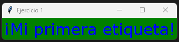

!!! exercise "Ejercicio 2"
    Ampliar el programa anterior para obtener el siguiente resultado: 

    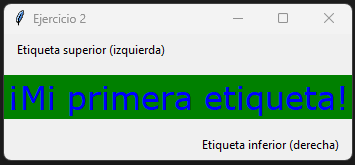

!!! exercise "Ejercicio 3"
    Realizar un programa que devuelva el siguiente resultado:  

    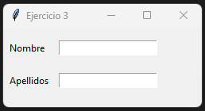

#### **2.4.8 - Variables de control**
**Las variables de control** son objetos especiales que se asocian a los widgets para almacenar sus valores y utilizarlos en otras partes del programa.   

Pueden ser de tipo **numérico**, de **cadena de caracteres** o **booleano**.

- StringVar: Para texto (cadenas de caracteres).
- IntVar: Para números enteros.
- DoubleVar: Para números decimales (flotantes).
- BooleanVar: Para valores booleanos (True/False)

!!! tip "Como funcionan"  

- **Creación:** Se instancian **fuera del widget** (mi_texto = StringVar()).
- **Asociación:** Se vinculan al widget usando opciones como textvariable (para Label, Entry) o variable (para Radiobutton, Checkbutton).
- **Intercambio de datos:**
    - variable.set(valor): Asigna un valor a la variable (y actualiza el widget).
    - variable.get(): Recupera el valor actual de la variable (y del widget).
- **Actualización automática:** Al cambiar el valor en el widget, la variable se actualiza; al cambiar la variable con set(), el widget se actualiza. 

!!! tip "Declarar variables de control"
Las variables de control se declaran de forma diferente en función al tipo de dato que almacenan: 
```py
entero = IntVar()  # Declara variable de tipo entera
flotante = DoubleVar()  # Declara variable de tipo flotante
cadena = StringVar(value="apellido 1")  # Declara variable de tipo cadena y se le asigna un valor inicial
booleano = BooleanVar()  # Declara variable de tipo booleana 
```

!!! tip "Método set()"
**El método set()** asigna un valor a **una variable de control**. Se utiliza para modificar el valor o estado de un widget, modificando el valor del atributo `textvariable`. 

```py
from tkinter import *

ventana = Tk()
ventana.title("Ejemplo de variables")
ventana.geometry("300x150+250+300")

nombre = StringVar(ventana)
mostrar = IntVar(ventana)

nombre.set("Mi primera variable")
mostrar.set(1234)

introducir_texto = Entry(ventana, textvariable=nombre, width=25)
etiqueta = Label(ventana, textvariable=mostrar)

introducir_texto.pack(padx=20, pady=20)
etiqueta.pack(padx=10, pady=5)

ventana.mainloop()
```

!!! tip "Método get()"
**El método get()** obtiene el valor de **una variable de control**.

```py
from tkinter import *

ventana = Tk()
ventana.title("get y set")
ventana.geometry("300x150+250+300")

nombre = StringVar(ventana)
mostrar = StringVar(ventana)

def escribir():
  mostrar.set(nombre.get())
  
introducir_texto = Entry(ventana, textvariable=nombre, width=25)
etiqueta = Label(ventana, textvariable=mostrar)
boton = Button(ventana, text="Aceptar", command=escribir)

introducir_texto.pack(pady=20)
etiqueta.pack(pady=5)
boton.pack(pady=10)

ventana.mainloop()
```

!!! tip "Método trace()"
**El método get()** se emplea para detectar cuando una variable es leída, cambia de valor o es borrada: 

**Sintaxis**
```py
widget.trace(tipo, función)
```

- El primer argumento establece **el tipo de suceso a comprobar**: `r` lectura de variable, `w` escritura de variable y `u` borrado de variable.  
- El segundo argumento indica la función que será llamada cuando se produzca el suceso.

**Ejemplo**
```py
from tkinter import *

ventana = Tk()
ventana.title("Método trace")
ventana.geometry("300x100+400+300")

texto = StringVar()
mostrar = StringVar()

def cambio(*args):
    mostrar.set(texto.get())

texto.trace("w", cambio)

entrada = Entry(ventana, textvariable=texto)
etiqueta = Label(ventana, textvariable=mostrar)

entrada.pack(pady=20)
etiqueta.pack(pady=10)

ventana.mainloop()
```
---

#### **2.4.9 - Ejercicios**
!!! task "Ejercicio 1"

- Crea cuatro Radiobutton con el texto que quieras en cada uno de ellos.  
- Colócalos en grid() de 2x2.
- Crea la lógica que imprima en la terminal la opción seleccionada.
<br>  
**Posible solución**  
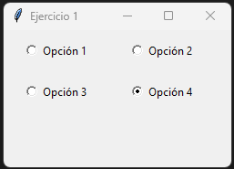

!!! task "Ejercicio 2"
- Amplia el programa anterior para que la ventana muestre la opción seleccionada.
<br>  
**Posible solución**  
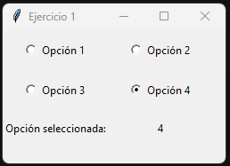


??? tip "Posible solución"

    ```py
    from tkinter import * 

    # Función evento de radiobutton
    def mostrar_seleccion():
        opcion = seleccion.get()
        print(f"Opción seleccionada: {opcion}")
    
    # Función recuperar valor de radiobutton
    # y escribir valor en variable de control `mostrar``
    def cambio(*args):
        mostrar.set(seleccion.get())

    # Ventana root
    root = Tk()
    root.title("Ejercicio 1")
    root.geometry("250x150+300+200")
 
    # Variables de control
    seleccion = IntVar(root)
    mostrar = StringVar(root)
 
    # Radiobuttons
    rb_1 = Radiobutton(root, text="Opción 1", variable=seleccion, value=1, command=mostrar_seleccion)
    rb_2 = Radiobutton(root, text="Opción 2", variable=seleccion, value=2, command=mostrar_seleccion)
    rb_3 = Radiobutton(root, text="Opción 3", variable=seleccion, value=3, command=mostrar_seleccion)
    rb_4 = Radiobutton(root, text="Opción 4", variable=seleccion, value=4, command=mostrar_seleccion)

    # Etiqueta que pinta el valor de radiobutton seleccionado
    texto = Label(root, text="Opción seleccionada:",justify="right")
    etiqueta = Label(root,textvariable=mostrar)

    # Llamar a funcion `cambio` cada vez que se detecta un cambio 
    # en variable de control `seleccion`
    seleccion.trace("w",cambio)

    # Grid de 2x2 para radiobutton
    rb_1.grid(row=0, column=0, padx=20, pady=10)
    rb_2.grid(row=0, column=1, padx=20, pady=10)
    rb_3.grid(row=1, column=0, padx=20, pady=10)
    rb_4.grid(row=1, column=1, padx=20, pady=10)

    # Pintar labels debajo de radiobuttons
    etiqueta.grid(row=3, column=1)
    texto.grid(row=3, column=0, pady=10)

    root.mainloop()     
    ```

---

#### **2.4.10 - Menu**
**El widget Menu** permite crear barras de menú y menús desplegables:

- Menú principal (barra)
- Submenús (Archivo, Editar, Ayuda, etc.)
- Opciones con comandos, separadores, checks y radios

!!! tip "Código mínimo para mostrar una barra de menú"
```py
from tkinter import *

ventana = Tk()

# Crear barra de menus
barra_menu = Menu(ventana)

# Mostrar barra de menus
ventana.config(menu=barra_menu)

ventana.mainloop()
```

!!! tip "Añadir un menú desplegable (add_cascade)"
```py
# Crear el menú desplegable que colgará de la barra principal (barra_menu).
# tearoff=0 evita que el menú se pueda desprender en una ventana flotante (comportamiento antiguo).
menu_archivo = Menu(barra_menu, tearoff=0)

# add_cascade crea el botón de texto en la barra superior.
# 'label' es lo que el usuario ve y 'menu' indica qué desplegable se abre al hacer clic.
barra_menu.add_cascade(label="Archivo", menu=menu_archivo)
```

- `label`: texto visible
- `menu`: menú asociado
- `tearoff=0`: sirve para evitar de despegar el menú en una ventana flotante.  

!!! tip "Añadir opciones al menú desplegable (add_command)"
```py
def salir():
    ventana.destroy()

# Agregar opciones (comandos) al menú (desplegable).
menu_archivo.add_command(label="Salir", command=salir)
```

!!! tip "Ejemplo completo"
```py
from tkinter import *

ventana = Tk()
ventana.title("Barra de menús")
ventana.geometry("300x100+300+400")

def salir():
    ventana.destroy()

barra_menu = Menu(ventana)
ventana.config(menu=barra_menu)

menu_archivo = Menu(barra_menu)
barra_menu.add_cascade(label="Archivo", menu=menu_archivo)

menu_archivo.add_command(label="Salir", command=salir)

ventana.mainloop()
```

!!! tip "Opciones de menú"
    !!! tip "add_separator"
        ```PY
        menu.add_separator()
        ```
    !!! tip "add_checkbutton"
        ```py
        ver_barra = BooleanVar()

        menu.add_checkbutton(
            label="Mostrar barra",
            variable=ver_barra
        )
        ```
    !!! tip "add_radiobutton"
        ```py
        tema = StringVar(value="claro")

        menu.add_radiobutton(label="Claro", variable=tema, value="claro")
        menu.add_radiobutton(label="Oscuro", variable=tema, value="oscuro")
        ```

    !!! tip "Submenús"
        ```py
        menu_exportar = Menu(menu_archivo, tearoff=0)

        menu_exportar.add_command(label="PDF")
        menu_exportar.add_command(label="HTML")

        menu_archivo.add_cascade(label="Exportar", menu=menu_exportar)
        ```
??? tip "Ejemplo"
    ```python   
    from tkinter import *

    def nuevo():
      print("Nuevo archivo")

    def abrir():
      print("Abrir archivo")

    def salir():
      ventana.destroy()

    def copiar():
      print("Copiar")

    def pegar():
      print("Pegar")

    def mayusculas():
      print("Mayúsculas")

    def minusculas():
      print("Minúsculas")

    ventana = Tk() 
    ventana.title("Ejemplo de barra de menús")
    ventana.geometry("400x200")

    # Barra de menú principal
    barra_menu = Menu(ventana)
    ventana.config(menu=barra_menu)

    # ===== MENÚ ARCHIVO =====
    menu_archivo = Menu(barra_menu, tearoff=0)
    barra_menu.add_cascade(label="Archivo", menu=menu_archivo)

    menu_archivo.add_command(label="Nuevo", command=nuevo)
    menu_archivo.add_command(label="Abrir", command=abrir)
    menu_archivo.add_separator()
    menu_archivo.add_command(label="Salir", command=salir)

    # ===== MENÚ EDITAR =====
    menu_editar = Menu(barra_menu, tearoff=0)  
    barra_menu.add_cascade(label="Editar", menu=menu_editar)

    # Submenú Portapapeles dentro de Editar
    menu_portapapeles = Menu(menu_editar, tearoff=0)
    menu_editar.add_cascade(label="Portapapeles", menu=menu_portapapeles) 

    menu_portapapeles.add_command(label="Copiar", command=copiar)
    menu_portapapeles.add_command(label="Pegar", command=pegar)

    # Submenú Formato dentro de Editar
    menu_formato = Menu(menu_editar, tearoff=0)
    menu_editar.add_cascade(label="Formato", menu=menu_formato)

    menu_formato.add_command(label="Mayúsculas", command=mayusculas)
    menu_formato.add_command(label="Minúsculas", command=minusculas) 

    ventana.mainloop() # 
    ```

---

### **2.5 - Cuadros  de diálogo (ventanas emergentes)**
Los cuadros de diálogo, también llamados ventanas emergentes o pop-ups, se utilizan para mostrar información puntual o solicitar una respuesta rápida al usuario. Reciben este nombre porque no forman parte de la ventana principal de la aplicación, sino que aparecen superpuestas a ella.

Tkinter proporciona **el módulo messagebox**, que incluye cuadros de diálogo estándar ya implementados.  
Para poder utilizarlo, deberemos **importarlo explícitamente**:  
```py
from tkinter import messagebox as MessageBox
```

---

#### **2.5.1 - showinfo**

**showinfo()** se utiliza para mostrar información general al usuario.

**Ejemplo básico:**
```py
from tkinter import messagebox as MessageBox

mensage = MessageBox.showinfo(title="Show info", message="Mi primera ventana de información", icon="info")
```

**Parámetros de showinfo:**  

| Parámetro | Tipo     | Obligatorio | Descripción                                                                                          |
| --------- | -------- | ----------- | ---------------------------------------------------------------------------------------------------- |
| `title`   | `str`    | Sí          | Título que se muestra en la barra superior de la ventana de diálogo.                                 |
| `message` | `str`    | Sí          | Texto informativo que se muestra en el cuerpo del cuadro de diálogo.                                 |
| `parent`  | `Widget` | No          | Ventana padre sobre la que se muestra el diálogo. Si no se indica, se asocia a la ventana principal. |
| `icon`    | `str`    | No          | Icono a mostrar. En `showinfo()` siempre es informativo, por lo que normalmente no se especifica.    |
| `type`    | `str`    | No          | Tipo de botones. En `showinfo()` es fijo (Aceptar), por lo que no suele utilizarse.                  |

---

#### **2.5.2 - showwarning**

**showwarning()** muestra un mensaje de alerta al usuario.

**Ejemplo básico:**
```py
from tkinter import messagebox as MessageBox

alerta = MessageBox.showwarning(title="Alerta", message="Operación no autorizada")
```

---

#### **2.5.3 - showerror**

**showwerror()** muestra un mensaje de error al usuario.

**Ejemplo básico:**
```py
from tkinter import messagebox as MessageBox

error = MessageBox.showerror(title="Alerta", message="Ha ocurrido un error")
```

---

#### **2.5.4 - askquestion**

**askquestion()** muestra una pregunta de tipo Sí/No. En este caso, deberemos tratar la respuesta del usuario. 

**Ejemplo básico:**
```py
from tkinter import *
from tkinter import messagebox as MessageBox

ventana =Tk()
ventana.title("AskQuestion")
ventana.geometry("200x150+400+300")

def cerrar():
    resultado = MessageBox.askquestion("Salir", 
    "¿Está seguro que desea salir sin guardar?")
    
    if resultado == "yes":
      ventana.destroy()  

boton = Button(ventana, text="Salir", command=cerrar)   
boton.pack(anchor="center",pady=60) 

ventana.mainloop()
```

---

#### **2.5.5 - askyesno**

**askyesno()** muestra una pregunta de tipo Sí/No. En este caso, deberemos tratar la respuesta del usuario.  
A diferencia de **askquestion()** el tipo devuelto por la ventana es de tipo **booleano** por lo que se recomienda su usa sobre askquestion. 

**Ejemplo básico:**
```py
from tkinter import *
from tkinter import messagebox as MessageBox

ventana =Tk()
ventana.title("AskYesNo")
ventana.geometry("300x150+400+300")

def cerrar():
    resultado = MessageBox.askyesno("Salir", 
    "¿Está seguro que desea salir sin guardar?")
    
    if resultado == True:
      ventana.destroy()  

boton = Button(ventana, text="Salir", command=cerrar)   
boton.pack(anchor="center",pady=60) 

ventana.mainloop()
```

---

#### **2.5.6 - askokcancel**

**askokcancel()** muestra un mensaje de tipo Ok/Cancelar al usuario.

**Ejemplo básico:**
```py
...
resultado = MessageBox.askokcancel("Pregunta", 
    "¿Sobreescribir fichero actual?")

if resultado == True:
    # Hacer algo
    pass
...
```

---

#### **2.5.7 - askyesnocancel**

**askyesnocancel()** muestra un mensaje de tipo Sí/No/Cancelar al usuario.

Los valores devueltos por la ventana son **True**, **False** y **None**. 

**Ejemplo básico:**
```py
resultado = MessageBox.askyesnocancel("Pregunta", 
    "¿Sobreescribir fichero actual?")
```

---

#### **2.5.8 - askretrycancel**

**askretrycancel()** muestra un mensaje de tipo Reintenar/Cancelar al usuario.

Los valores devueltos por la ventana son **True** o **False**. 

**Ejemplo básico:**
```py
resultado = MessageBox.askretrycancel("Ha ocurrido un error", 
    "¿Reintentar?")
```

---

#### **2.5.9 - askcolor**

**askcolor()** permite al usuario seleccionar un color.

**Ejemplo:**
```py
from tkinter import *
from tkinter import colorchooser as ColorChooser

def seleccionar():
    color = ColorChooser.askcolor(title="Elige un color")
    print("El color seleccionado es:", color) 
    if color is not None:
      marco.config(bg=color[1])

ventana = Tk()
ventana.title("Color chooser")
ventana.geometry("300x200+400+300")

color_inicial = "#3498DB"

marco = Frame(ventana, bg=color_inicial, width=150, height=150)
marco.pack(pady=20)
marco.pack_propagate(False)  # Evita que el frame cambie de tamaño

boton = Button(marco, text="Elegir color", command=seleccionar)
boton.pack(expand=True) # Centrar el boton

ventana.mainloop()
```

---

#### **2.5.10 - askopenfilename**
     
**askopenfilename()** pregunta seleccionar el fichero a abrir y devuelve el nombre y la ruta de un fichero.

**Ejemplo:**     
```py
from tkinter import filedialog as FileDialog

fichero = FileDialog.askopenfilename(title="Abrir fichero")
print("La ruta del fichero es:", fichero)    
```

---

#### **2.5.11 - asksaveasfile**
**asksaveasname()** pregunta donde guardar un fichero y devuelve el nombre y la ruta de un fichero.

**Ejemplo:**     
```py
from tkinter import filedialog as FileDialog

ruta = FileDialog.asksaveasfile(title="Guardar fichero")
print("La ruta del fichero es:", fichero)
```

---

### **2.6 - Práctica - RA4-CE(b,c,d) - RA5-CE(f,g,h)**
En esta práctica se desarrollará una calculadora gráfica con las funciones básicas.  
La práctica se hará por fases y cada fase será evaluada de acuerdo con los criterios de evaluación indicados.

---

#### **2.6.1 – Fase 1 – Creación de la ventana de la calculadora y encapsulación en una clase**

!!! warning "RA4-CEb"
    **Etapa 1:**
    
    - Escribir un programa que genere una ventana gráfica básica.  

    <br>
    **Etapa 2:**  

    - Con el objetivo de reutilizar y organizar el código, crear la clase **Calculadora**, que será la encargada de definir y encapsular todos los atributos de la interfaz gráfica de la calculadora.  

!!! warning "RA4-CEd"
    **Etapa 3:**  

    - Un vez definido el método constructor, dar un nombre a la ventana principal (p.e. Calculadora).  
    **Resultado final:**
    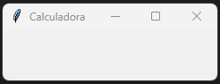{.treszero}
---

#### **2.6.2 – Fase 2 – Creación de la interfaz gráfica de la calculadora**

!!! warning "RA5-CEf"
    En esta fase elaboraremos la interfaz gráfica de la calculadora que tendrá un aspecto similar al de la imagen.

    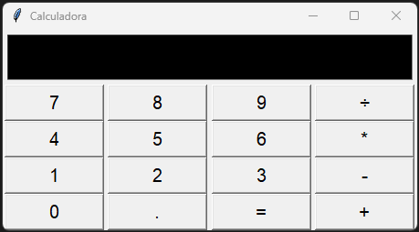{ .cuatrozero }

    **Etapa 4: Creación del campo númerico**   

    - **Dentro del método constructor**, **declarar** el widget **pantalla** que mostrará los valores introducidos así como el resultado de la operación.  
    - Posicionar el widget ventana dentro de un grid de 4x5 (ocupará toda la primera fila).     
    - **Nota:** Para el ejemplo, se ha usado el parametro **text** para ver como queda visualmente el **widget pantalla**. Para el uso normal de este widget, deberemos usar **textvariable**. 

    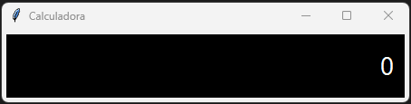{ .cuatrozero }

    
!!! warning "RA4-CEc"
    **Etapa 5: Creación del método de clase crear_boton()**  

    - Crear el método de clase **crear_boton()**.  
    - **crear_button()** se encargará de **devolver** el widget Button()  
    - Ese método de clase recibirá (aparte de self) el símbolo del botón (valor) y lo asignará al parámetro **text**.   
    <br>

    **Etapa 6: Creación de los botones**  

    - **Dentro del método constructor**, **declarar** los widgets **1,2,3,4,5,6,7,8,9,/,*,-,+,=**. Dar como nombre a los widgets, boton1, boton2, ..., boton15, boton16  
    <!-- - **Nota 1:** Para el simbolo **igual** no podemos usar **=** directamente. Deberemos utilizar el símbolo unicode **\u002A**.   -->
    
    <!-- - **Nota 2:** Para el simbolo **dividir** no podemos usar **/** directamente. Deberemos utilizar el símbolo unicode **\u00F7**. -->
    
    <br>
    **Etapa 7: Posicionamiento de la pantalla**   
    
    - Hecho en atapa 4. 
    
    <br>
    **Etapa 8: Posicionamiento de los botones**   

    - Posicionar los widgets boton1, boton2, ..., boton15, boton16 dentro de un grid de 4x5 (ocupará todo el grid empezando por la segunda fila).     
    - **Nota 1:** Para evitar de reescribir 16 veces el mismo código pensar en realizar un(os) bucle(s).  
    - **Nota 2:** Si decidís, crear un(os) bucle(s), primero crear **una variable de tipo lista** que contendrá los widgets. Por ejemplo: lista = [boton1, boton2, ..., boton15, boton16].   
    
#### **2.6.2 – Fase 3 – Creación de los eventos**
!!! warning "RA5-CEg"
    En esta fase elaboraremos los eventos desencadenados después de pulsar los botones. Dicho de otra manera, daremos la funcionalidad a la calculadora.   

    **Etapa 9: Introducir número y mostralo por pantalla**
    En esta etapa nos limitaremos a:

    - Al hacer click, **recuperamos** el valor que tenemos en ese momento en pantalla.
    - A ese valor, el añadimos (concatenamos) el valor del botón que hemos pulsado.  
    Para ello crearemos el método de clase **escribir** que recibirá por parámetro el **valor del botón pulsado**.

    **Etapa 10: Distinguir qué tecla se ha pulsado**

    - En esta etapa, mejoraremos las líneas de código de la etapa 9 para que, además del valor del botón que hemos pulsado, sepamos si el botón es de tipo númerico (0,1,2, ...,9) o de operando (+,-,/,*,=). 

     
#### **2.6.3 – Fase 4 – Programa completo**
!!! warning "RA5-CEh"
    **Etapa 11: Realizar las operaciones**

    - Crear la lógica que permita devolver el resultado de la operación. 
    - Tener en cuenta el diseño conceptual de esta práctica:
        1. Introducimos un valor.
        1. Introducimos un operando (+,-,/,*), guardamos el valor introducido y <strong>borramos pantalla</strong>.
        1. Introducimos el operando **=**, recuperamos el valor introducido y el operando introducido anteriormente, realizamos la operación y mostramos el resultado por pantalla. 

#### **2.6.4 – Entrega del programa completo**

!!! warning "Entrega de la tarea"
    Subir la tarea a AULES en **tarea RA5-CEh**.  
    

    


<!-- === "RA 1"
   
=== "RA 4"
    |RA4. Desarrolla programas organizados en clases analizando y aplicando los principios de la programación orientada a objetos.|Peso|
    |-|-|
    *|**a)** Se ha reconocido la sintaxis, estructura y componentes típicos de una clase.|12%|
    *|**b)** Se han definido clases.|11%|
    |**c)** Se han definido propiedades y métodos.|11%|
    *|**d)** Se han creado constructores.|11%|
    *|**e)** Se han desarrollado programas que instancien y utilicen objetos de las clases creadas anteriormente.|11%|
    
=== "RA 5"
    |RA5. Realiza operaciones de entrada y salida de información, utilizando procedimientos específicos del lenguaje y librerías de clases.|Peso|
    |-|-|
    *|**a)** Se ha utilizado la consola para realizar operaciones de entrada y salida de información.|16%|
    *|**b)** Se han aplicado formatos en la visualización de la información.|12%|
    *|**c)** Se han reconocido las posibilidades de entrada / salida del lenguaje y las librerías asociadas.|12%|
    *|**d)** Se han utilizado ficheros para almacenar y recuperar información.|12%|
    *|**e)** Se han creado programas que utilicen diversos métodos de acceso al contenido de los ficheros.|12%|
    *|**f)** Se han utilizado las herramientas del entorno de desarrollo para crear interfaces gráficos de usuario simples.|12%|
    *|**g)** Se han programado controladores de eventos.|12%|
    |**h)** Se han escrito programas que utilicen interfaces gráficos para la entrada y salida de información.|12%|

=== "RA 6"
    |RA6. Escribe programas que manipulen información, seleccionando y utilizando tipos avanzados de datos.|Peso|
    |-|-|
    |**c)** Se han utilizado listas para almacenar y procesar información.|10%|
    |**e)** Se han reconocido las características y ventajas de cada una de las colecciones de datos disponibles.|10%|
    |**f)** Se han creado clases y métodos genéricos.|10%|
    |**g)** Se han utilizado expresiones regulares en la búsqueda de patrones en cadenas de texto.|10%|
    |**i)** Se han realizado programas que realicen manipulaciones sobre documentos escritos en diferentes lenguajes de intercambio de datos.|10%|
    |**j)** Se han utilizado operaciones agregadas para el manejo de información almacenada en colecciones.|10%| -->