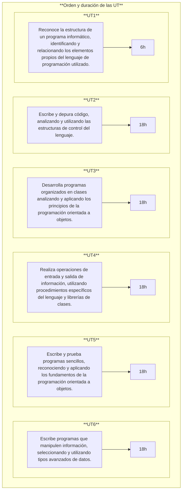

# **UT 6 - Interfaces gráficas**

{ .cincozero }

<br>

**Resultados de aprendizaje y criterios de evaluacion que se evaluarán en esta unidad.**  

|RA5. Realiza operaciones de entrada y salida de información, utilizando procedimientos específicos del lenguaje y librerías de clases.|
|-|
|**f)** Se han utilizado las herramientas del entorno de desarrollo para crear interfaces gráficos de usuario simples.|
|**g)** Se han programado controladores de eventos.|
|**h)** Se han escrito programas que utilicen interfaces gráficos para la entrada y salida de información.|

<br>

## **1 - Módulos en Python**
Un módulo es un archivo que contiene código (funciones, clases, variables e incluso programas completos) y que puede ser **importado** desde otros archivos.

**Ejemplo**
Podemos definir un módulo **calculadora.py** con cuatros funciones de cálculo básicas.

```py 
# calculadora.py
def suma(a, b):
    return a + b

def resta(a, b):
    return a - b

def multiplica(a, b):
    return a * b

def divide(a, b):
    try:
        return a / b
    except ZeroDivisionError:
        return "No se puede dividir por 0"
```

!!! tip "¿Para qué sirven los módulos?"
    ✔ Evitar escribir el mismo código varias veces  
    ✔ Organizar programas grandes en archivos más pequeños  
    ✔ Compartir y reutilizar código entre distintos proyectos  
    ✔ Facilitar la lectura y el mantenimiento del software  

### **1.1 - Importar todo o parte del módulo**
Una vez definido el módulo, podemos **importarlo total o parcialmente** en otro archivo **.py** usando la sentencia **import**.

**Importación total**  
En este caso importaremos la totalidad del contenido del módulo.

```py
import calculadora

print(calculadora.suma(4, 3))   
print(calculadora.resta(10, 9)) 
```

**Importación parcial**
En este caso solo importaremos las funciones que necesitaremos dentro de nuestro programa.

```py
from calculadora import suma, resta

print(suma(4, 3))   
print(resta(10, 9)) 
```

### **1.2 - Uso de * e alias para el uso de módulos**
También podemos importar el contenido del módulo con `*`. Esto nos permitirá usar los elementos de calculadora.py sin necesidad de escribir el nombre del módulo (calculadora)delante. 

```py
from calculadora import *

print(divide(4, 3))   
print(multiplica(10, 9)) 
```

Sin embargo, si importamos varios módulos, puede resultar peligroso utilizar *, ya que pueden existir elementos con **el mismo nombre** en módulos diferentes. Para evitar conflictos, es mejor usar alias para el módulo.

```py
import calculadora as calc

print(calc.divide(4, 3))   
print(calc.multiplica(10, 9)) 
```

También se puede crear un alias solo para un elemento concreto dentro del módulo.

```py
from calculadora import divide as div 

print(div(10, 9))
``` 

### **1.3 - Tipos de módulos**
Python tiene 3 grandes tipos de módulos:

| Tipo de módulo          | Descripción                  | Ejemplo                              |
| ----------------------- | ---------------------------- | ------------------------------------ |
| **Módulos estándar**    | Vienen instalados con Python | `math`, `random`, `os`, `datetime`, `tkinter`   |
| **Módulos de terceros** | Se instalan con `pip`        | `numpy`, `pandas`, `flask`, `pygame` |
| **Módulos propios**     | Los crea el programador      | Archivo `.py` en el proyecto      |

### **1.4 - Ubicación de los módulos**
Cuando importamos un módulo con **import**, Python busca módulos en este orden:
1. El directorio desde el cual se ejecuta el programa
1. Las rutas dentro de la variable de entorno PYTHONPATH (si existe)
1. Rutas estándar de la instalación de Python (incluye la librería estándar)
1. Rutas de site-packages (donde pip instala los módulos)


- Caso de importacion desde una carpeta del directorio del programa principal**
  ```bash
  # Proyecto

  ├── programa.py
  ├── modulos
  │   ├── __init__.py # Para compatibilidad con versiones antiguas de Python
  │   ├── calculadora.py
  │   └── interfaces.py

  ```

    ```py 
    # Programa.py
    from modulos.calculadora import divide as div
    ...
    ```
<br>

- Para el resto de casos, es necesario configurar las variables de entorno del sistema operativo (cosa que hicimos al instalar python), o usar sys.path en el programa.  
  ```py
  import sys
  sys.path.append('ruta/del/modulo')
  from modulo import elemento
  ...
  ```
  <br>

- **Nota:**
A fin de depurar problemas con la importación de módulos, se recomienda añadir las rutas a los módulos propios al principio del programa, antes de cualquier importación.
```py
import sys
sys.path.insert(0, 'ruta/del/modulo')
from modulo import elemento
...
``` 
<br>

- Para saber las rutas donde Python busca los módulos, podemos usar el módulo sys y su variable path:
```py
import sys
print(sys.path)
```

### **1.5 - Listar los nombres de nuestro entorno (namespace)**
**La función dir()** permite ver los nombres (variables, funciones, clases, etc) existentes en nuestro namespace.  
Si, por ejemplo, probamos en un módulo vacío, veremos como tenemos varios nombres rodeados de __. **Se trata de nombres que Python crea por debajo** es decir, atributos y variables especiales que Python genera automáticamente.

Si ejecutamos dir() dentro de un módulo vacío :

```py
print(dir())
``` 

Veremos el siguiente resultado:

```bash
['__annotations__', '__builtins__', '__cached__', '__doc__', '__file__', '__loader__', '__name__', '__package__', '__spec__']
```

Si importamos nuestro módulo calculadora y volvemos a ejecutar dir(), veremos que ahora tenemos también el módulo que acabamos de importar.

```py
import calculadora
print(dir())
``` 
Resultado:

```bash
['__annotations__', '__builtins__', '__cached__', '__doc__', '__file__', '__loader__', '__name__', '__package__', '__spec__', 'calculadora']
```

Si queremos ver los nombres definidos dentro del módulo calculadora, podemos pasarlo a dir().

```py 
import calculadora
print(dir(calculadora))
``` 

Resultado:

```bash
['__builtins__', '__cached__', '__doc__', '__file__', '__loader__', '__name__', '__package__', '__spec__', 'divide', 'multiplica', 'resta', 'suma']
``` 

O más simplemente recuperar las rutas y el nombre del archivo en el que estamos trabajando con `__name__`.

```py
print(__name__)
```

Resultado:

```
C:/Users/titan/Documents/GitHub/githubpages/Apuntes/venv/Scripts/python.exe c:/Users/titan/Documents/GitHub/githubpages/Apuntes/docs/SMX/SMX_2/Opt_Python/code/UT6/programa.py
__main__
```
<br>

### **1.6 - Módulos y función main**
Cuando ejecutamos un módulo directamente, Python asigna el valor `"__main__"` a la variable especial `__name__`.  
Si el módulo es importado desde otro módulo, `__name__` toma el valor del nombre del módulo.
Esto nos permite saber si un módulo está siendo ejecutado directamente o importado desde otro módulo.

Por ese motivo es muy común ver en los módulos la siguiente estructura:

```py
def funcion_principal():
    # Código principal del módulo
    pass
if __name__ == "__main__":
    funcion_principal() 
``` 
De esta forma, si el módulo es ejecutado directamente, se llamará a la función `funcion_principal()`.  
Si el módulo es importado desde otro módulo, no se ejecutará nada automáticamente.

### **1.7 - Recargado de módulos**
Es importante notar que los módulos solamente son cargados una vez. Si dentro de un módulo tenemos código directamente ejecutable (por ejemplo, un print), al volver a importar el módulo no se reflejarán los cambios.  

```
# calculadora.py
print("Módulo calculadora cargado.")
...
```

```py
import calculadora  # Muestra: Módulo calculadora cargado.
import calculadora  # No muestra nada
```

Para forzar la recarga del módulo, podemos usar la función `reload()` del módulo `importlib`.

```py 
import importlib
import calculadora

... # Código
importlib.reload(calculadora) # Forzar recarga del módulo (práctica poco recomendable)
```
<br>

## **2 - Interfaces gráficas en Python**
Existen varios módulos para crear interfaces gráficas en Python (Tkinter, WxPython, PyQT, PyGTK). El más utilizado y que viene incluido en la librería estándar es **tkinter**.

### **2.1 - Estructura de ventana con Tkinter**
Para crear una ventana básica con Tkinter, debemos seguir los siguientes pasos:
1. Importar el módulo tkinter
1. Crear la ventana principal
1. Añadir widgets (botones, etiquetas, cuadros de texto, etc)
1. Iniciar el bucle principal de eventos





<!-- https://www.youtube.com/watch?v=hTUJC8HsC2I&list=PLU8oAlHdN5BlvPxziopYZRd55pdqFwkeS&index=46 -->
<!-- https://www.youtube.com/watch?v=t93x-vnFvP4&list=PLU8oAlHdN5BlvPxziopYZRd55pdqFwkeS&index=37 -->
<!-- https://www.youtube.com/watch?v=nRieWujis4s&list=PLU8oAlHdN5BlvPxziopYZRd55pdqFwkeS&index=38 -->


 <!-- === "RA 1"
    |RA1. Reconoce la estructura de un programa informático, identificando y relacionando los elementos propios del lenguaje de programación utilizado.|Peso|
    |-|-|
    *|**a)** Se han identificado los bloques que componen la estructura de un programa informático. |12%|
    *|**b)** Se han respetado las especificaciones técnicas del proceso de instalación. |11%|
    *|**c)** Se han utilizado entornos integrados de desarrollo. |11%|
    *|**d)** Se han identificado los distintos tipos de variables y la utilidad específica de cada uno. |11%|
    *|**e)** Se ha modificado el código de un programa para crear y utilizar variables. |11%|
    *|**f)** Se han creado y utilizado constantes y literales. |11%|
    *|**g)** Se han clasificado, reconocido y utilizado en expresiones los operadores del lenguaje. |11%|
    *|**h)** Se ha comprobado el funcionamiento de las conversiones de tipo explícitas e implícitas. |11%|
    *|**i)** Se han introducido comentarios en el código. |11%|


=== "RA 2"
    |RA2. Escribe y prueba programas sencillos, reconociendo y aplicando los fundamentos de la programación orientada a objetos.|Peso|
    |-|-|
    *|**a)** Se han identificado los fundamentos de la programación orientada a objetos. |12%|    
    *|**c)** Se han instanciado objetos a partir de clases predefinidas.|11%|
    *|**d)** Se han utilizado métodos y propiedades de los objetos.|11%|
    *|**e)** Se han escrito llamadas a métodos estáticos.|11%|
    *|**f)** Se han utilizado parámetros en la llamada a métodos.|11%|

=== "RA 3"
    |RA3. Escribe y depura código, analizando y utilizando las estructuras de control del lenguaje.|Peso|
    |-|-|
    *|**a)** Se ha escrito y probado código que haga uso de estructuras de selección.|12%|
    *|**b)** Se han utilizado estructuras de repetición.|11%|
    *|**c)** Se han reconocido las posibilidades de las sentencias de salto.|11%|
    *|**d)** Se ha escrito código utilizando control de excepciones.|11%|
    *|**e)** Se han creado programas ejecutables utilizando diferentes estructuras de control.|11%|
    *|**h)** Se han creado excepciones.|11%|
    *|**i)** Se han utilizado aserciones para la detección y corrección de errores durante la fase de desarrollo.|11%|

=== "RA 4"
    |RA4. Desarrolla programas organizados en clases analizando y aplicando los principios de la programación orientada a objetos.|Peso|
    |-|-|
    *|**a)** Se ha reconocido la sintaxis, estructura y componentes típicos de una clase.|12%|
    |**b)** Se han definido clases.|11%|
    |**c)** Se han definido propiedades y métodos.|11%|
    |**d)** Se han creado constructores.|11%|
    |**e)** Se han desarrollado programas que instancien y utilicen objetos de las clases creadas anteriormente.|11%|
    
=== "RA 5"
    |RA5. Realiza operaciones de entrada y salida de información, utilizando procedimientos específicos del lenguaje y librerías de clases.|Peso|
    |-|-|
    *|**a)** Se ha utilizado la consola para realizar operaciones de entrada y salida de información.|16%|
    *|**b)** Se han aplicado formatos en la visualización de la información.|12%|
    *|**c)** Se han reconocido las posibilidades de entrada / salida del lenguaje y las librerías asociadas.|12%|
    *|**d)** Se han utilizado ficheros para almacenar y recuperar información.|12%|
    *|**e)** Se han creado programas que utilicen diversos métodos de acceso al contenido de los ficheros.|12%|
    |**f)** Se han utilizado las herramientas del entorno de desarrollo para crear interfaces gráficos de usuario simples.|12%|
    |**g)** Se han programado controladores de eventos.|12%|
    |**h)** Se han escrito programas que utilicen interfaces gráficos para la entrada y salida de información.|12%|

=== "RA 6"
    |RA6. Escribe programas que manipulen información, seleccionando y utilizando tipos avanzados de datos.|Peso|
    |-|-|
    |**c)** Se han utilizado listas para almacenar y procesar información.|10%|
    |**e)** Se han reconocido las características y ventajas de cada una de las colecciones de datos disponibles.|10%|
    |**f)** Se han creado clases y métodos genéricos.|10%|
    |**g)** Se han utilizado expresiones regulares en la búsqueda de patrones en cadenas de texto.|10%|
    |**i)** Se han realizado programas que realicen manipulaciones sobre documentos escritos en diferentes lenguajes de intercambio de datos.|10%|
    |**j)** Se han utilizado operaciones agregadas para el manejo de información almacenada en colecciones.|10%| -->