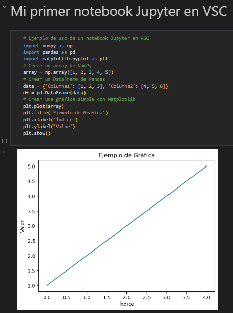
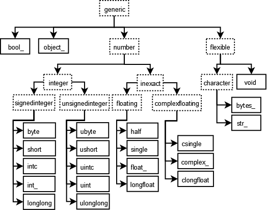
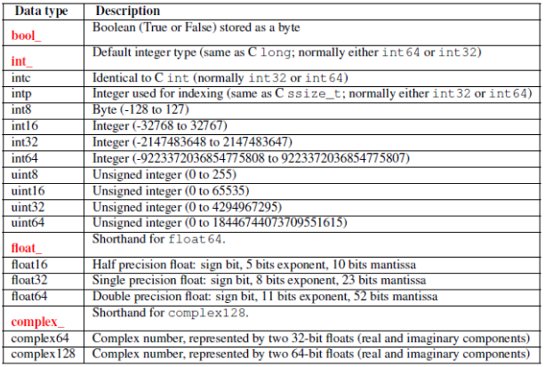
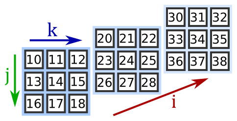
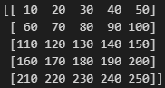

# UT 7 - Manipulación y validación de datos

{ .sietecinco}

<br>

**Resultados de aprendizaje y criterios de evaluacion que se evaluarán en esta unidad.**  

|RA6. Escribe programas que manipulen información, seleccionando y utilizando tipos avanzados de datos.|
|-|
|**c)** Se han utilizado listas para almacenar y procesar información.|
|**e)** Se han reconocido las características y ventajas de cada una de las colecciones de datos disponibles.|
|**f)** Se han creado clases y métodos genéricos.|
|**g)** Se han utilizado expresiones regulares en la búsqueda de patrones en cadenas de texto.|
|**i)** Se han realizado programas que realicen manipulaciones sobre documentos escritos en diferentes lenguajes de intercambio de datos.|
|**j)** Se han utilizado operaciones agregadas para el manejo de información almacenada en colecciones.|

<br>

## 1 - Estructuras de datos en Python

### 1.1 - Tipos de colecciones de datos
En unidades anteriores hemos ido utilizando estructuras de datos (listas, diccionarios, tuplas, etc.) para almacenar y manipular datos en nuestros programas. En esta sección repasaremos las diferentes estructuras de datos (también llamadas colecciones) disponibles en Python y veremos cómo utilizarlas de manera efectiva.

- **Listas**: Son colecciones ordenadas y mutables que pueden contener elementos de diferentes tipos. Se definen utilizando corchetes `[]`. Las listas permiten agregar, eliminar y modificar elementos fácilmente.
```py
# Ejemplo de lista
mi_lista = [1, 2, 3, "cuatro", 5.0]
```  

- **Tuplas**: Son colecciones ordenadas e inmutables que también pueden contener elementos de diferentes tipos. Se definen utilizando paréntesis `()`. Una vez creada una tupla, no se pueden modificar sus elementos.
```py
# Ejemplo de tupla
mi_tupla = (1, 3, 2, "cuatro", 5.0)
```
- **Conjuntos**: Son colecciones no ordenadas y mutables que **no permiten elementos duplicados**. Se definen utilizando llaves `{}` o la función `set()`.
```py
# Ejemplo de conjunto
conjunto_1 = {1, 2, 3, 4, 5}
conjunto_2 = set([4, 5, 6, 7, 8])
```
- **Diccionarios**: Son colecciones mutables que almacenan pares clave-valor. Desde Python 3.7 mantienen el orden de inserción. Se definen utilizando llaves `{}` con pares separados por dos puntos `:`.
```py
# Ejemplo de diccionario
mi_diccionario = {"nombre": "Juan", "edad": 30, "ciudad": "Catadau"}
```

Cada una de estas estructuras de datos tiene sus propias características y ventajas, y la elección de cuál utilizar depende del tipo de datos que se estén manejando y de las operaciones que se necesiten realizar sobre ellos.

### **1.2 - Métodos asociados a las listas**
#### 1.2.1 - Método .append()
El método `append()` se utiliza para agregar un elemento **al final de una lista**.

```py
# Ejemplo de uso de append()
mi_lista = [1, 2, 3]
mi_lista.append(4)
print(mi_lista)  # Salida: [1, 2, 3, 4]
```


También se puede añadir elementos a una lista utilizando el operador `+=` pero, no se considera una buena práctica para añadir un solo elemento, ya que `+=` está pensado para concatenar listas completas.
```py
# Ejemplo de uso de +=
mi_lista = [1, 2, 3]
mi_lista += [4] 
```     

#### **1.2.2 - Método .insert()**
El método `insert()` permite insertar un elemento en una posición específica de la lista.

```py
# Ejemplo de uso de insert()
# Insertar el número 10 en la posición 1
mi_lista = [1, 2, 3]
mi_lista.insert(1, 10)
print(mi_lista)  # Salida: [1, 10, 2, 3]
```

#### **1.2.3 - Método .del()**
El método `del` permite eliminar un elemento de una lista en una posición específica.

```py    
# Ejemplo de uso de del
mi_lista = [1, 2, 3, 4]
del mi_lista[2]  # Elimina el elemento en la posición 2
print(mi_lista)  # Salida: [1, 2, 4]
```

#### **1.2.4 - Método .remove()**
Realiza la misma funcion que el métod `del()` pero, esta vez, en vez de eliminar un elemento en base a su índice, lo hace por su valor.

```py
# Ejemplo de uso de remove()
mi_lista = [1, 2, 3, 4]
mi_lista.remove(3)  # Elimina el primer elemento con valor 3
print(mi_lista)  # Salida: [1, 2, 4]
```

**Nota:** Si el valor aparece varias veces en la lista, solo se eliminará la primera aparición.

```py
mi_lista = [1, 2, 3, 4, 8, 9, 3, 4, 5]
mi_lista.remove(3)  # Elimina el primer elemento con valor 3
print(mi_lista)  # Salida: [1, 2, 4, 8, 9, 3, 4, 5]
```

#### **1.2.5 - Método .clear()**
El método `clear()` elimina todos los elementos de una lista, dejándola vacía.

```py
# Ejemplo de uso de clear()
mi_lista = [1, 2, 3, 4]
mi_lista.clear()  # Elimina todos los elementos de la lista
print(mi_lista)  # Salida: []
```

#### **1.2.6 - Método .pop()**
El método `pop()` elimina y devuelve un elemento de la lista en una posición específica. Si no se especifica una posición, elimina y devuelve el último elemento de la lista. 

```py
# Ejemplo de uso de pop()
mi_lista = [1, 2, 3, 4]
elemento_eliminado = mi_lista.pop(1)  # Elimina y devuelve el elemento en la posición 1
print(elemento_eliminado)  # Salida: 2
```
```py
mi_lista = [1, 2, 3, 4]
elemento_eliminado = mi_lista.pop()  # Elimina y devuelve el último elemento
print(elemento_eliminado)  # Salida: 4
```

#### **1.2.7 - Método .sort()**
El método `sort()` ordena los elementos de una lista **modificando la lista original**. Por defecto, ordena los elementos en orden ascendente.

```py
# Ejemplo de uso de sort()
mi_lista = [4, 2, 1, 3] 
mi_lista.sort()  # Ordena la lista en orden ascendente
print(mi_lista)  # Salida: [1, 2, 3, 4]
```

**Nota 1:** También se puede ordenar en orden descendente utilizando el argumento `reverse=True` o usando el método **.reverse()**. 

```py
mi_lista = [1, 2, 3, 4] 
mi_lista.sort(reverse=True)  # Ordena la lista en orden descendente
print(mi_lista)  # Salida: [4, 3, 2, 1]

mi_lista = [4, 2, 1, 3]
milista.reverse()  # Invierte el orden de los elementos de la lista
print(mi_lista)  # Salida: [3, 1, 2, 4]
```

**Nota 2:** Si no se desea modificar la lista original, se puede utilizar la función `sorted()`, que devuelve una nueva lista ordenada.

```py
mi_lista = [4, 2, 1, 3]
lista_ordenada = sorted(mi_lista)  # Devuelve una nueva lista ordenada
print(lista_ordenada)  # Salida: [1, 2, 3, 4]
print(mi_lista)  # Salida: [4, 2, 1, 3] (la lista original no se modifica)
```   

### **1.3 - Métodos asociados a los diccionarios**
#### **1.3.1 - Método .keys()**
El método `keys()` devuelve una vista de las claves del diccionario.

```py
# Ejemplo de uso de keys()
mi_diccionario = {"nombre": "Juan", "edad": 30, "ciudad": "Catadau"}
claves = mi_diccionario.keys()
print(claves)  # Salida: dict_keys(['nombre', 'edad', 'ciudad'])
```
#### **1.3.2 - Método .values()**
El método `values()` devuelve una vista de los valores del diccionario.

```py
# Ejemplo de uso de values()
mi_diccionario = {"nombre": "Juan", "edad": 30, "ciudad": "Catadau"}
valores = mi_diccionario.values()
print(valores)  # Salida: dict_values(['Juan', 30, 'Catadau'])
```

#### **1.3.3 - Método .items()**
El método `items()` devuelve una vista de los pares clave-valor del diccionario.

```py   
# Ejemplo de uso de items()
mi_diccionario = {"nombre": "Juan", "edad": 30, "ciudad": "Catadau"}
pares = mi_diccionario.items()  
print(pares)  # Salida: dict_items([('nombre', 'Juan'), ('edad', 30), ('ciudad', 'Catadau')])
```

#### **1.3.4 - Método .get()**
El método `get()` se utiliza para obtener el valor asociado a una clave específica en el diccionario. Si la clave no existe, devuelve `None` o un valor predeterminado especificado.

```py
# Ejemplo de uso de get()
mi_diccionario = {"nombre": "Juan", "edad": 30, "ciudad": "Catadau"}
valor = mi_diccionario.get("edad")  # Obtiene el valor asociado a la clave "edad"
print(valor)  # Salida: 30
valor_no_existente = mi_diccionario.get("pais", "No encontrado")  # Devuelve un valor predeterminado si la clave no existe
print(valor_no_existente)  # Salida: No encontrado
```

#### **1.3.5 - Añadir, modificar elementos**
Para añadir un nuevo par clave-valor o modificar el valor asociado a una clave existente, se puede utilizar la sintaxis de asignación.

```py
# Ejemplo de añadir o modificar elementos
mi_diccionario = {"nombre": "Juan", "edad": 30}
mi_diccionario["ciudad"] = "Catadau"  # Añadir un nuevo par clave-valor
mi_diccionario["edad"] = 31  # Modificar el valor asociado a la clave "edad"
print(mi_diccionario)  # Salida: {'nombre': 'Juan', 'edad': 31, 'ciudad': 'Catadau'}
```

También se puede utilizar el método `update()` para añadir o modificar múltiples pares clave-valor a la vez.

```py
# Ejemplo de uso de update()
mi_diccionario = {"nombre": "Juan", "edad": 30} 
mi_diccionario.update({"ciudad": "Catadau", "edad": 31})  # Añadir/modificar múltiples pares clave-valor
print(mi_diccionario)  # Salida: {'nombre': 'Juan', 'edad': 31, 'ciudad': 'Catadau'}
```

!!! tip "No se puede cambiar una clave existente, pero se puede eliminar el par clave-valor y añadir uno nuevo con la clave deseada. El método `pop()` resulta particularmente útil para este propósito" 
```py
# Ejemplo de cambio de clave en diccionarios
mi_diccionario = {"nombre": "Juan", "edad": 30, "ciudad": "Catadau"}
valor_edad = mi_diccionario.pop("edad")  # Elimina el par clave-valor con clave "edad"
mi_diccionario["años"] = valor_edad  # Añade un nuevo par clave-valor con la nueva clave "años"
print(mi_diccionario)  # Salida: {'nombre': 'Juan', 'ciudad': 'Catadau', 'años': 30}
```
### **1.4 - Métodos asociados a las tuplas**
Las tuplas son inmutables, por lo que no tienen métodos para modificar su contenido. Sin embargo, tienen algunos métodos útiles:
#### **1.4.1 - Método .count()**
El método `count()` devuelve el número de veces que un elemento aparece en la tupla.
```py
# Ejemplo de uso de count() 
mi_tupla = (1, 2, 3, 2, 4, 2)
veces = mi_tupla.count(2)  # Cuenta cuántas veces aparece el número 2
print(veces)  # Salida: 3
```

!!! question "¿Disponen las listas del método count()?"  

#### **1.4.2 - Método .index()**
El método `index()` devuelve el índice de la primera aparición de un elemento en la tupla.
```py   
# Ejemplo de uso de index()
mi_tupla = (1, 2, 3, 4)
indice = mi_tupla.index(3)  # Obtiene el índice del número
print(indice)  # Salida: 2
``` 

### **1.5 - Métodos asociados a los conjuntos**
#### **1.5.1 - Método .add()**
El método `add()` se utiliza para agregar un elemento a un conjunto.

```py   
# Ejemplo de uso de add()
mi_conjunto = {1, 2, 3}
mi_conjunto.add(4)  # Agrega el elemento 4 al conjunto  
print(mi_conjunto)  # Salida: {1, 2, 3, 4}
```

!!! question "¿Qué ocurrirá si hago un .add(3) sobre el ejemplo anterior?"  

#### **1.5.2 - Método .remove()**
El método `remove()` se utiliza para eliminar un elemento específico de un conjunto. Si el elemento no existe, se genera un error.
```py
# Ejemplo de uso de remove()
mi_conjunto = {1, 2, 3, 4}
mi_conjunto.remove(3)  # Elimina el elemento 3 del conjunto
print(mi_conjunto)  # Salida: {1, 2, 4}
```

#### **1.5.3 - Método .discard()**
El método `discard()` también se utiliza para eliminar un elemento específico de un conjunto, pero a diferencia de `remove()`, no genera un error si el elemento no existe.
```py
# Ejemplo de uso de discard()
mi_conjunto = {1, 2, 3, 4}
mi_conjunto.discard(5)  # Intenta eliminar el elemento 5 (no existe, pero no genera error)
print(mi_conjunto)  # Salida: {1, 2, 3, 4}
```

#### **1.5.4 - Método .pop()**
El método `pop()` elimina y devuelve un elemento arbitrario del conjunto. Si el conjunto está vacío, genera un error.
```py
# Ejemplo de uso de pop()
mi_conjunto = {1, 2, 3, 4}
elemento_eliminado = mi_conjunto.pop()  # Elimina y devuelve un elemento arbitrario
print(elemento_eliminado)  # Salida: (puede ser cualquier elemento del conjunto)
print(mi_conjunto)  # Salida: (el conjunto sin el elemento eliminado)
```

#### **1.5.5 - Método .clear()**
El método `clear()` elimina todos los elementos de un conjunto, dejándolo vacío.
```py
# Ejemplo de uso de clear()
mi_conjunto = {1, 2, 3, 4}  
mi_conjunto.clear()  # Elimina todos los elementos del conjunto
print(mi_conjunto)  # Salida: set()
```

### **1.6 - Accesso a elementos de las colecciones**
#### **1.6.1 - Acceso a elementos en listas y tuplas**
Se puede acceder a los elementos de una lista o tupla utilizando índices. Los índices comienzan en 0 para el primer elemento, 1 para el segundo, y así sucesivamente. También se pueden utilizar índices negativos para acceder a los elementos desde el final de la colección.

```py
# Ejemplo de acceso a elementos en listas y tuplas
mi_lista = [10, 20, 30, 40, 50]
primer_elemento = mi_lista[0]  # Accede al primer elemento (10)
ultimo_elemento = mi_lista[-1]  # Accede al último elemento (50)
print(primer_elemento)  # Salida: 10
print(ultimo_elemento)  # Salida: 50
```

!!! tip "Al igual que podemos acceder a los elementos individuales de una lista o tupla utilizando índices, también podemos modificar los elementos de una lista utilizando índices (no es posible hacerlo con las tuplas al ser inmutables)."
```py
# Ejemplo de modificación de elementos en listas
mi_lista = [10, 20, 30, 40, 50]
mi_lista[2] = 35  # Modifica el tercer elemento (índice 2) a 35
print(mi_lista)  # Salida: [10, 20, 35, 40, 50]
```

#### **1.6.2 - Acceso a elementos en diccionarios**
Se puede acceder a los valores de un diccionario utilizando sus claves.

```py
# Ejemplo de acceso a elementos en diccionarios
mi_diccionario = {"nombre": "Juan", "edad": 30, "ciudad": "Catadau"}
nombre = mi_diccionario["nombre"]  # Accede al valor asociado a la clave "nombre"
print(nombre)  # Salida: Juan
```

#### **1.6.3 - Acceso a elementos en conjuntos**
Los conjuntos no permiten acceso a elementos individuales mediante índices, ya que son colecciones no ordenadas. Sin embargo, se puede verificar la existencia de un elemento en un conjunto utilizando el operador `in`.

```py   
# Ejemplo de acceso a elementos en conjuntos
mi_conjunto = {1, 2, 3, 4}
existe = 3 in mi_conjunto  # Verifica si el elemento 3 está en el conjunto
print(existe)  # Salida: True
```

#### **1.6.4 - Slicing**
El slicing permite obtener una sublista o subtupla de una lista o tupla original, especificando un rango de índices.

```py
# Ejemplo de slicing
mi_lista = [10, 20, 30, 40, 50]
sublista = mi_lista[1:4]  # Obtiene los elementos desde el índice 1 hasta el 3 (4 no incluido)
print(sublista)  # Salida: [20, 30, 40]
```

!!! question "¿Qué ocurrirá si hago un slicing de tipo mi_lista[2:] o mi_lista[:3]?"  


#### **1.6.5 - Iteración sobre colecciones**
Se puede iterar sobre los elementos de cualquier colección utilizando un bucle `for`.

```py
# Ejemplo de iteración sobre una lista
mi_lista = [10, 20, 30, 40, 50]
for elemento in mi_lista:
    print(elemento)
```

#### **1.6.6 - Comprensión de listas**
La comprensión de listas (list comprehensions) es una forma concisa de crear listas utilizando una sintaxis especial.

```py
# Ejemplo de comprensión de listas
mi_lista = [1, 2, 3, 4, 5]  
cuadrados = [x**2 for x in mi_lista]  # Crea una nueva lista con los cuadrados de los elementos
print(cuadrados)  # Salida: [1, 4, 9, 16, 25]
```

#### **1.6.7 - Funciones agregadas para colecciones**
Python proporciona varias funciones integradas que permiten realizar operaciones agregadas sobre colecciones, como `len()`, `sum()`, `min()`, `max()`, entre otras.

```py
# Ejemplo de funciones agregadas
mi_lista = [10, 20, 30, 40, 50]
longitud = len(mi_lista)  # Obtiene la longitud de la lista
suma = sum(mi_lista)  # Calcula la suma de los elementos de la lista
minimo = min(mi_lista)  # Obtiene el valor mínimo de la lista
maximo = max(mi_lista)  # Obtiene el valor máximo de la lista
print(longitud)  # Salida: 5
print(suma)      # Salida: 150
print(minimo)    # Salida: 10
print(maximo)    # Salida: 50
```

### **1.7 - Tarea RA6-CEce**
!!! exercise "Ejercicio 1"
    La secuencia de Fibonacci está definida por:  
    x<sub>0</sub> = 0, x<sub>1</sub> = 1, x<sub>n+1</sub> = x<sub>n</sub> + x<sub>n-1</sub>

    Escribir un programa que haga lo siguiente:  

    1. Llenar una lista con 16 elementos.
    1. Devolver la suma de los 16 elementos. 

    Ejemplo de secuencia de Fibonacci: [0,1,1,2,3,5,...]

!!! exercise "Ejercicio 2"
    Realizar un programa que inicialice una lista con 10 valores aleatorios (del 1 al 10) y posteriormente haga lo siguiente:
    
    1. Mostrar en pantalla cada elemento de la lista junto con su cuadrado y su cubo.
    1. Mostrar en pantalla el valor máximo de la lista.
    1. Mostrar en pantalla el valor mínimo de la lista.
    1. Mostrar en pantalla el valor medio de los valores con índice 3 a 7 de la lista.

    **Nota:** Para generar los números aleatorios utilizar **el módulo Random**.  

!!! exercise "Ejercicio 3"
    Realizar un programa que haga lo siguiente:

    1. Crear una tabla (lista con dos dimensiones) de 5x5 enteros aleatorios comprendidos entre 0 y 9.
    1. Suma todos los elementos de cada fila y todos los elementos de cada columna visualizando los resultados en pantalla.
    
### **1.8 - Colecciones genéricas**
Python permite crear clases y métodos genéricos utilizando el módulo `typing`, que proporciona herramientas para definir tipos genéricos.

```py
from typing import TypeVar, Generic, List
T = TypeVar('T')
class Caja(Generic[T]):
    def __init__(self):
        self.elementos: List[T] = []

    def agregar(self, elemento: T) -> None:
        self.elementos.append(elemento)

    def obtener_elementos(self) -> List[T]:
        return self.elementos
# Ejemplo de uso de la clase genérica Caja
caja_de_enteros = Caja[int]()
caja_de_enteros.agregar(1)
caja_de_enteros.agregar(2)
print(caja_de_enteros.obtener_elementos())  # Salida: [1, 2]
caja_de_cadenas = Caja[str]()
caja_de_cadenas.agregar("Hola")
caja_de_cadenas.agregar("Mundo")
print(caja_de_cadenas.obtener_elementos())  # Salida: ['Hola', 'Mundo']
```

### **1.9 - Generadores**

- Los generadores son una forma especial de iteradores que extraen los valores de **uno en uno** en lugar de almacenar todos los valores en memoria.  
- Hasta que no se solicite otro valor, el generador se mantiene pausado. Esta característica se conoce como **suspensión de estado**. 
- El generador se define utilizando la palabra clave `yield` en lugar de `return` dentro de una función. Cada vez que se llama al generador, este produce el siguiente valor en la secuencia y mantiene su estado para la próxima llamada.
- Para realizar la iteración sobre un generador, se puede utilizar un bucle `for` o la función `next()`.

```py
# Declarar el generador
def generador_numeros_pares(num):
    for i in range(num):
        yield i*2

# Instanciar el generador
numeros_pares = generador_numeros_pares(5)

...
## Llamada 1 al generador
print(f"Llamada 1 al generador que extrae el valor: {next(numeros_pares)}")
...
## Llamada 2 al generador
print(f"Llamada 2 al generador que extrae el valor: {next(numeros_pares)}")
...
## Llamada 3 al generador
print(f"Llamada 3 al generador que extrae el valor: {next(numeros_pares)}")
...
```

!!! tip "yield from"
También se puede utilizar `yield from` para delegar parte de la generación a otro generador o iterable. Este es particularmente útil para combinar múltiples generadores. 

```py
def generador_numeros_pares(num):
    for i in range(num):
        yield i*2

def generador_letras():
    yield "a"
    yield "b"
    yield "c"
    yield "d"

def generador_principal():
    yield from generador_numeros_pares(5)
    yield from generador_letras()

# Usar el generador principal
generador = generador_principal()
for valor in generador:
    print(valor)
```

Tendremos que tener en cuenta que `yield from` se comporta como un bucle `for` que itera sobre el iterable proporcionado, **extrayendo cada valor** y cediéndolo al llamador del generador principal.
```py
# código sin yield from
def devuelve_ciudades(*ciudades):
  for ciudad in ciudades:
    for letras in ciudad:
      yield letras

ciudades_generadas = devuelve_ciudades("Llombay", "Catadau", "Alfarp")
for letras in range(20):
  print(next(ciudades_generadas), end="_")

#########################################

# código CON yield from
def devuelve_ciudades(*ciudades):
  for ciudad in ciudades:
    yield from ciudad

ciudades_generadas = devuelve_ciudades("Llombay", "Catadau", "Alfarp")
for letras in range(20):
  print(next(ciudades_generadas), end="_")
```

### **1.10 - Funciones avanzadas para el tratamiento de datos**
#### **1.10.1 - Función map()**
La función `map()` aplica una función específica a cada elemento de un iterable (como una lista o una tupla) y devuelve un iterador con los resultados.

```py
# Ejemplo de uso de map()
def cuadrado(x):
    return x ** 2

numeros = [1, 2, 3, 4, 5]

resultados = map(cuadrado, numeros)  # Aplica la función cuadrado a cada elemento de la lista numeros

print(list(resultados))  # Salida: [1, 4, 9, 16, 25]
```
#### **1.10.2 - Función filter()**
La función `filter()` filtra los elementos de un iterable basándose en una función que devuelve un valor booleano (True o False). Devuelve un iterador con los elementos que cumplen la condición.

```py
# Ejemplo de uso de filter()
def es_par(x):
    return x % 2 == 0

numeros = [1, 2, 3, 4, 5, 6]

resultados = filter(es_par, numeros)  # Filtra los números pares de la lista

print(list(resultados))  # Salida: [2, 4, 6]
```

#### **1.10.3 - Función list()**
La funcion `list()` convierte cualquier objeto iterable en **una lista**. Es útil para convertir los resultados de funciones como `map()` y `filter()` en listas.

```py
# list sobre un tupla
numeros = (1, 2, 3, 4, 5)  # Tupla

lista_numeros = list(numeros)  # Convierte la tupla en una lista

print(lista_numeros)  # Salida: [1, 2, 3, 4, 5]

# list sobre un string
list("hola")
# ['h', 'o', 'l', 'a']

# list sobre un rango
list(range(5))
# [0, 1, 2, 3, 4]
```

#### **1.10.4 - Tarea RA6-CEj**
!!! exercise "Ejercicio 1"
    Realizar un programa que haga lo siguiente:

    1. Crear una lista con los números del 1 al 20.
    1. Utilizando la función `map()`, crear una nueva lista con los cuadrados de los números de la lista original.
    1. Utilizando la función `filter()`, crear una nueva lista que contenga solo los números pares de la lista original.
    1. Mostrar en pantalla las tres listas generadas.  

!!! exercise "Ejercicio 2"
    Realizar un programa que haga lo siguiente:

    1. Crea un conjunto llamado usuarios con los usuarios Marta, David, Elvira, Juan y Marcos
    1. Crea un conjunto llamado administradores con los administradores Juan y Marta.
    1. Borra al administrador Juan del conjunto de administradores.
    1. Añade a Marcos como un nuevo administrador, pero no lo borres del conjunto de usuarios.
    1. Muestra todos los usuarios por pantalla de forma dinámica, además debes indicar si cada usuario es administrador o no.
     
!!! exercise "Ejercicio 3"
    Realizar un programa que haga lo siguiente:
    
    1. Crea una lista contenga 5 números aleatorios (de cualquier tipo).
    1. Define una función generadora que reciba la lista anterior como parámetro.
    1. La función generadora devolverá, uno a uno, el cuadrado de cada número de la lista utilizando la instrucción yield.
    1. Crear una variable que almacene el generador devuelto por la función.
    1. Recorrer el generador utilizando un bucle for y muestre por pantalla el cuadrado de cada número.


#### **1.10.5 - Expresiones regulares**
Las expresiones regulares (regular expressions / regex / parsing) permiten buscar o manipular cadenas de texto basándose en **patrones específicos**.  
En Python, el módulo `re` proporciona funciones para trabajar con expresiones regulares. Resulta muy útil para validar formatos de datos, como correos electrónicos, números de teléfono, códigos postales, etc.

**Ejemplo:**  
```py
import re
# Ejemplo de uso de expresiones regulares
patron = r'\b\d{3}-\d{2}-\d{4}\b'  # Patrón para un número de seguro social (SSN)
texto = "Mi número de seguro social es 123-45-6789."
coincidencias = re.findall(patron, texto)  # Busca todas las coincidencias del patrón en el texto
print(coincidencias)  # Salida: ['123-45-6789']
```

!!! tip "Sintaxis básica de expresiones regulares"
Una expresión regular es una secuencia de caracteres diseñada para describir un fragmento de texto. Esta secuencia de caracteres también se denomina **patrón** y consta de dos tipos de caracteres:

- **Caracteres normales:** Son aquellos que se representan a sí mismos en el patrón. Por ejemplo, la letra "a" en una expresión regular coincide con la letra "a" en el texto.
- **Metacaracteres:** Son caracteres especiales que tienen un significado particular en las expresiones regulares. Por ejemplo, el carácter `^` indica el comienzo de una nueva línea o de una cadena de caracteres.

!!! tip "Tabla de metacaracteres y significado"

| Símbolo | Nombre / Uso principal              | Significado |
|--------|-------------------------------------|-------------|
| `^`    | Ancla de inicio                     | Indica el **inicio de la cadena** |
| `$`    | Ancla de fin                        | Indica el **final de la cadena** |
| `.`    | Punto                               | Coincide con **cualquier carácter**, excepto salto de línea (`\n`) |
| `[]`   | Clase de caracteres                 | Coincide con **uno de los caracteres** definidos dentro del [&nbsp;&nbsp;] |
| `\`    | Escape                              | Escapa un metacarácter o introduce una **secuencia especial** |
| `*`    | Cero o más                          | Coincide con **cero o más repeticiones** del elemento anterior o expresión entre paréntesis |
| `+`    | Uno o más                           | Coincide con **una o más repeticiones** del elemento anterior o expresión entre paréntesis |
| `?`    | Opcional / cuantificador no codicioso | Coincide con **cero o una repetición** del elemento anterior o expresión entre paréntesis |
| `{}`   | Cuantificador explícito             | Define un **número exacto o rango** de repeticiones (`{n}`, `{n,m}`) del elemento anterior o expresión entre paréntesis |
| `()`   | Grupo                               | **Agrupa expresiones** y permite capturas |
| `|`    | Alternancia                         | Actúa como un **OR lógico** |


!!! tip "Secuencias especiales"

El módulo `re` de Python también proporciona **secuencias especiales** que facilitan la coincidencia de **ciertos tipos de caracteres**:

| Secuencia | Significado                          | Equivalente al metacarácter | 
|-|-|-|
| `\b`      | Coincide con un límite de palabra (inicio o fin de una palabra) | N/A |
| `\B`      | Coincide con una posición que no es un límite de palabra | N/A | 
| `\d`      | Coincide con cualquier dígito (0-9) | `\[0-9]` |
| `\D`      | Coincide con cualquier carácter que no sea un dígito | `\[^0-9]` |
| `\w`      | Coincide con cualquier carácter alfanumérico (letras, dígitos y guion bajo) | `[a-zA-Z0-9_]` |
| `\W`      | Coincide con cualquier carácter que no sea alfanumérico | `[^a-zA-Z0-9_]` |
| `\s`      | Coincide con cualquier carácter de espacio en blanco **excepto un espacio en blanco '_'** (tabulador, salto de línea, retorno de carro, salto de página y tabulador vertical) |   `[\t\n\r\f\v]` |
| `\S`      | Coincide con cualquier carácter que no sea un espacio en blanco | `[^\t\n\r\f\v]` |

!!! example "Metacarácter `^`" 
- La *regex* **^ATG** se encuentra en la cadena `ATGCGT` pero no en `CCATGTT`.

!!! example "Metacarácter `$`" 
- La *regex* **$ATG** se encuentra en la cadena `TGCATG` pero no en `CCATGTT`.

!!! example "Metacarácter `.`" 
- La *regex* **$A.G** se encuentra en la cadena `ATG` y también en `AtG`, `AtG`, `A5G`, `A*G`, `A&G` y `A G`.

!!! example "Metacarácter `[]`" 
- La *regex* **T[ABC]G** se encuentra en la cadena `TAG`, `TBG` o `TCG` pero no en `TG`, `TaG`, `T5G`, ...  
**Otros ejemplos:** 
- *regex* **T[A-Z]G**: cualquier letra en mayúsculas, se encuentra en la cadena `TAG`, `TBG` o `TZG` pero no en `TaG`, `T4G`, `TzG`, ...  
- *regex* **[a-z]**: cualquier letra en minúsculas.  
- *regex* **[0-9]**: cualquier número del 0 al 9.   
- *regex* **[A-Za-z0-9]**: cualquier carácter alfanumérico.  
- *regex* **^[AC]**: cualquier expresión o cadena cuyo primer carácter empiece con A o C.  

!!! example "Metacarácter `\`" 
El metacarácter de escape `\` se utiliza para indicar que el siguiente carácter debe interpretarse literalmente o para introducir secuencias especiales.

- La *regex* **\d{3}** se encuentra en `123`, `456`, `789` pero no en `12A`, `AB3`, ...
- La *regex* **\+** designa el carácter `+` (o cualquier otro carácter especial). Se encuentra en `A+B`, `C+D` pero no en `AB`, `A4B`, ...
- La  *regex* `A\.G` se encuentra en `A.G` pero no en `AG`, `A4G`, `ABG`, ...

!!! example "Metacarácter `*`" 
- La *regex* `A(CG)*T` se encuentra en `AT`, `ACGT`, `ACGCGT`, ...

!!! example "Metacarácter `+`" 
- La *regex* `A(CG)+T` se encuentra en `ACGT`, `ACGCGT`, ... pero no en `AT`. 

!!! example "Metacarácter `?`" 
- La *regex* `A(CG)?T` se encuentra en `AT`, `ACGT`, pero no en `ACGCGT`. 

!!! example "Metacarácter `{}`" 
- La *regex* `A(CG){2}T` se encuentra en `ACGCGT`, pero no en `ACGT`, `ACGCGCGT` o `ACGCG`.
Otros ejemplos:
- La *regex* `A(CG){2,4}T` (rango) se encuentra en `ACGCGT`, `ACGCGCGT`, `ACGCGCGCGT` pero no en `ACGT`, `ACGCGCGCGCGT` o `ACGCG`.
- La *regex* `A(CG){2,}T` (al menos) se encuentra en `ACGCGT`, `ACGCGCGT`, `ACGCGCGCGT`, ... pero no en `ACGT`, o `ACGCG`.
- La *regex* `A(CG){,2}T` (como mucho) se encuentra en `AT`, `ACGT`, `ACGCGT`, ... pero no en `ACGCGCGT`, o `ACG`.
- La *regex* `A(CG|TT)C` (O lógico) se encuentra en `ACGC`, `ATTC` pero no en `ACGTTC`.

#### 1.10.6 - Ejercicios de regex
!!! exercise "Ejercicio 1"
    ¿A qué corresponde el regex?
    ```py
    r'\b[A-Z]+\b'
    ```
    ¿Coincide con "HELLO", "Hello", "WORLD", "HELLOWORD" o "helloWORD" ? 

!!! exercise "Ejercicio 2"
    ¿A qué corresponde el regex?
    ```py
    r'[+-]?\d+(\.\d+)?'
    ```
    ¿Coincide con "3.14", "-100", "+0.5", "abc" o "12."? 

!!! exercise "Ejercicio 3"
    ¿A qué corresponde el regex?
    ```py
    r'(0[1-9]|[12][0-9]|3[01])[-\/](0[1-9]|1[0-2])[-\/](\d{4})'
    ```
    
!!! exercise "Ejercicio 4"
    ¿A qué corresponde el regex?  
    ```py
    r'https?://(www\.)?[a-zA-Z0-9.-]+\.[a-z]{2,3}(/[a-zA-Z0-9._%+-?]*)*'
    ```

!!! exercise "Ejercicio 5"
    ¿A qué corresponde el regex?
    ```py
    r'[a-zA-Z0-9._%+-]+@[a-zA-Z0-9.-]+\.[a-zA-Z]{2,}'
    ```
    
    
#### 1.10.7 - Módulo re
El módulo `re` proporciona varias funciones para trabajar con expresiones regulares, como `match()`, `search()`, `findall()`, `sub()`, entre otras.


##### 1.10.7.1 - Función search()
La función `search()` busca una coincidencia del patrón en cualquier parte de la cadena.

```py
import re
# Ejemplo de uso de search()
patron = r'[0-9]{3}-[0-9]{2}-[0-9]{4}'  # Patrón
# patron = r'\d{3}-\d{2}-\d{4}'  # Mismo patrón con secuencias especiales

texto = "Mi número de seguro social es 123-45-6789."

coincidencia = re.search(patron, texto)  # Busca la primera coincidencia

if coincidencia:
    print("Coincidencia encontrada:", coincidencia.group())  # group() recupera el texto que ha coincidido
else:
    print("No se encontró ninguna coincidencia.")
```

##### **1.10.7.2 - Funciones match() y fullmatch()**
La función `match()` busca una coincidencia del patrón al **comienzo** de la cadena, mientras que `fullmatch()` busca una coincidencia **total** que abarque **toda** la cadena.

```py
import re
# Ejemplo de uso de match() y fullmatch()
patron = r'\d{3}-\d{2}-\d{4}'  # Patrón

texto1 = "123-45-6789 es mi número de seguro social."
texto2 = "Mi número de seguro social es 123-45-6789."

coincidencia_match = re.match(patron, texto1)  # Busca coincidencia al comienzo
coincidencia_fullmatch = re.fullmatch(patron, texto2)  # Busca coincidencia en toda la cadena

if coincidencia_match:
    print("Coincidencia match encontrada:", coincidencia_match.group())
else:
    print("No se encontró ninguna coincidencia con match.")
if coincidencia_fullmatch:
    print("Coincidencia fullmatch encontrada:", coincidencia_fullmatch.group())
else:
    print("No se encontró ninguna coincidencia con fullmatch.")  
```

##### **1.10.7.3 - Funciones findall() y finditer()**
La función `findall()` devuelve una lista de todas las coincidencias del patrón en la cadena, mientras que `finditer()` devuelve un iterador que produce objetos de coincidencia para cada coincidencia encontrada.

```py
import re
# Ejemplo de uso de findall() y finditer()
patron = r'\d{3}-\d{2}-\d{4}'  # Patrón

texto = "Mis números de seguro social son 123-45-6789 y 987-65-4321."

coincidencias_findall = re.findall(patron, texto)  # Devuelve una lista de todas las coincidencias
coincidencias_finditer = re.finditer(patron, texto)  # Devuelve un iterador de objetos de coincidencia

print("Coincidencias con findall:", coincidencias_findall)
print(coincidencias_finditer)

iteraciones =["Primera iteración: ","Segunda iteración: "]
iterador=0

for coincidencia in coincidencias_finditer:
    print(iteraciones[iterador], coincidencia.group())
    iterador += 1
```

##### **1.10.7.4 - Función compile()**
La función `compile()` compila un patrón de expresión regular en un objeto de expresión regular, que se puede reutilizar para realizar múltiples búsquedas.

```py
import re
# Ejemplo de uso de compile()
patron = r'\d{3}-\d{2}-\d{4}'  # Patrón

regex = re.compile(patron)  # Compila el patrón en un objeto regex 

texto = "Mis números de seguro social son 123-45-6789 y 987-65-4321."

coincidencias = regex.findall(texto)  # Usa el objeto regex para buscar coincidencias
print("Coincidencias encontradas:", coincidencias)  # Salida: ['123-45-6789', '987-65-4321']
```

##### **1.10.7.5 - Función group()**
La función `group()` se utiliza para recuperar el texto que ha coincidido con el patrón en una búsqueda.

```py
import re
# Ejemplo de uso de group()
patron = r'(\d{3})-(\d{2})-(\d{4})'  # Patrón con grupos
texto = "Mi número de seguro social es 123-45-6789."
coincidencia = re.search(patron, texto)  # Busca la primera coincidencia

print(f"cantidad de coincidencias encontradas: {coincidencia.re.groups}")

if coincidencia:
    print("Número completo:", coincidencia.group(0))  # Grupo 0 es el texto completo que coincide
    # print("Número completo:", coincidencia.group())  # 0 es el valor por defecto de group()
    print("Coincidencia 1 (111):", coincidencia.group(1))    # Primer grupo
    print("Coincidencia 2 (11):", coincidencia.group(2))     # Segundo grupo
    print("Coincidencia 2 (1111):", coincidencia.group(3))   # Tercer grupo
else:
    print("No se encontró ninguna coincidencia.")
```     

##### **1.10.7.6 - Función sub()**
La función `sub()` se utiliza para reemplazar las coincidencias del patrón en una cadena con un texto especificado.

```py
import re
# Ejemplo de uso de sub()
patron = r'\d{3}-\d{2}-\d{4}'  # Patrón
texto = "Mi número de seguro social es 123-45-6789."
texto_modificado = re.sub(patron, "ABC-DE-FGHI", texto)  # Reemplaza las coincidencias con "ABC-DE-FGHI"
print("Texto modificado:", texto_modificado) 
```

#### **1.10.8 - Tarea RA6-CEg**
!!! exercise "Tarea RA6-CEg"
    Realizar un programa que haga lo siguiente:

    1. Definir una expresión regular para validar direcciones de correo electrónico.
    1. Solicitar al usuario que ingrese una dirección de correo electrónico **mediante interfaz gráfica**.
    1. Utilizar una expresión regular para verificar si la dirección es válida o no.
    1. Antes de almacenar la dirección dentro de una lista, comprobar si ya existe en la lista una dirección identica.
    1. Mostrar un mensaje indicando si la dirección es válida o inválida.
    1. Mostrar un mensaje indicando si la dirección es duplicada o no.
    1. En caso de fallo volver a pedir introducir la dirección electrónica.

## 2 - Introducción al análisis de datos
En el capítulo anterior, aprendimos los fundamentos para mover y transformar datos utilizando las estructuras nativas de Python. Sin embargo, cuando nos enfrentamos a volúmenes masivos de información o necesitamos realizar cálculos complejos de forma eficiente, las herramientas estándar pueden quedarse cortas en velocidad y comodidad.

En este capítulo haremos una breve presentación de herramientas para el análisis de datos: 

- **NumPy (El Motor)**: Es la biblioteca que permite realizar operaciones matemáticas de alto rendimiento. Su especialidad son los arrays multidimensionales, permitiéndonos realizar cálculos sobre millones de datos casi instantáneamente.
- **Pandas (La Estructura)**: Introduce el concepto de DataFrame (muy similar a una tabla de Excel), permitiéndonos limpiar, filtrar y agrupar datos de manera intuitiva y potente.
- **Matplotlib (La Visión)**: Los datos no sirven de nada si no podemos comunicar lo que dicen. Esta librería es el estándar para crear visualizaciones estáticas, animadas e interactivas que transforman números en conocimiento visual.

### 2.1 - Anaconda
**Anaconda** es una distribución de **Python y R** diseñada para la ciencia de datos y el aprendizaje automático. Proporciona una plataforma fácil de usar que incluye una gran cantidad de paquetes y herramientas útiles para el análisis de datos, la visualización y el desarrollo de modelos de machine learning.

- Instalación de Anaconda:  
  - Descargar el [instalador](https://www.anaconda.com/products/distribution) desde la página oficial.
  - Seguir las instrucciones de instalación para tu sistema operativo (Windows, macOS, Linux).
  
- Uso de Anaconda en VSC:
    - Abrir Visual Studio Code.
    - Instalar la extensión de Python si no está instalada.
    - Abrir la paleta de comandos (Ctrl + Shift + P) y seleccionar "Python: Select Interpreter".
    - Elegir el intérprete de Anaconda que se instaló previamente.
- Notebook Jupyter:
    - En VSC se puede instalar la extensión "Jupyter" para trabajar con notebooks, directamente en el editor.
    - Crear un nuevo archivo con extensión **.ipynb** no **.py** para comenzar a trabajar con notebooks.  

**Apariencia de un notebook Jupyter en VSC:**
{.cincozero .margintop10 }

**Código del notebook:**
```py
# Ejemplo de uso de un notebook Jupyter en VSC
import numpy as np
import pandas as pd
import matplotlib.pyplot as plt
# Crear un array de NumPy
array = np.array([1, 2, 3, 4, 5])
# Crear un DataFrame de Pandas
data = {'Columna1': [1, 2, 3], 'Columna2': [4, 5, 6]}
df = pd.DataFrame(data)
# Crear una gráfica simple con Matplotlib
plt.plot(array)
plt.title('Ejemplo de Gráfica')
plt.xlabel('Índice')
plt.ylabel('Valor')
plt.show()
```

### 2.2 - Librería NumPy
{.cuatrozero .margintop10 }

#### 2.2.1 - ¿Qué es NumPy?
Numpy es una librería de procesamiento de **arrays**. Contiene una gran colección de funciones que permiten realizar cálculos matemáticos complejos sobre arrays multidimensionales.

#### 2.2.2 - ¿Qué es un array?
Un array es una estructura de datos que almacena una colección de elementos del mismo tipo en una secuencia contigua de memoria.  
A diferencia de las **listas** (de Python), los arrays de NumPy son más eficientes en términos de rendimiento y uso de memoria, especialmente cuando se trata de grandes conjuntos de datos numéricos.

#### 2.2.3 - Creación de arrays en NumPy
Para crear un array en utilizareos la función `np.array()`.

```py
import numpy as np
# Crear un array de NumPy
array = np.array([1, 2, 3, 4, 5])
print(array)  # Salida: [1 2 3 4 5]
```

A diferencia de las listas que permiten almacenar elementos de diferentes tipos, los arrays de NumPy están diseñados para solo **almacenar elementos del mismo tipo**. Esto permite optimizar el rendimiento y la eficiencia en el manejo de datos numéricos.

**Ejemplo:**
```py
import numpy as np

array = np.array(["hola",1,25, 1e10])
array

# array(['hola', '1', '25', '10000000000.0'], dtype='<U32')
```
En este ejemplo, vemos que NumPy convierte todos los elementos al mismo tipo, en este caso a cadenas de texto Unicode de hasta 32 caracteres.

**Otro ejemplo:**
```py
import numpy as np

array = np.array([1,25, 1e10])
print(array)
array.dtype
# Salida: [1.e+00 2.5e+01 1.e+10]
# dtype('float64')
```
En este caso, NumPy convierte todos los elementos al tipo `float64` para mantener la coherencia en el tipo de datos del array.

#### 2.2.4 - Creación de arrays básicos
NumPy proporciona varias funciones para crear arrays. A continuación, se muestran algunas de las más comunes:

- **Arrays de ceros (0)**
```py
array_ceros = np.zeros(3)  # Array con 3 elementos (0)
```

- **Arrays de unos (1)**
```py
array_unos = np.ones(4)  # Array con 4 elementos (1)
```

- **Arrays con un valor dado**
```py
array_full = np.full(3,5) # Array con 3 elementos (5)
```

- **Auto llenar un array con arange() (1/2)**
```py
array_secuencial = np.arange(10)  
# [0,1,2,3,4,5,6,7,8,9]
```

- **Auto llenar un array con arange() (2/2)**
```py
array_secuencial = np.arange(5, 15, 2)
# [5,7,9,11,13]
```

- **Constantes de NumPy**
```py
constantes = np.array([np.pi, np.e, np.inf, np.nan])
[3.141592653589793, 2.718281828459045, inf, nan]
```
   
#### 2.2.5 - Dimensiones de los arrays
Los arrays en NumPy pueden tener múltiples dimensiones.

**Array unidimensional (1D)**
```py
array_1d = np.array([1, 2, 3, 4, 5])
# array([1, 2, 3, 4, 5])
```
 
 **Array bidimensional (2D)**
```py
array_2d = np.array([[1, 2], [3, 4]])
# array([[1, 2],
#        [3, 4]])
```

**Array tridimensional (3D)**
```py
array_3d = array_3d = np.array([[[1, 2, 3], [4, 5, 6], [7, 8, 9]],[[1, 2, 3], [4, 5, 6], [7, 8, 9]],[[1, 2, 3], [4, 5, 6], [7, 8, 9]]])
# array([[[1, 2, 3],
#         [4, 5, 6],
#         [7, 8, 9]],
# 
#        [[1, 2, 3],
#         [4, 5, 6],
#         [7, 8, 9]],
# 
#        [[1, 2, 3],
#         [4, 5, 6],
#         [7, 8, 9]]])
```

#### 2.2.6 - Redimensionar arrays
Los arrays en NumPy se pueden redimensionar fácilmente utilizando el método `reshape()`. 

```py
array = np.arange(20)
array.reshape(5,4)

# array([[ 0,  1,  2,  3],
#        [ 4,  5,  6,  7],
#        [ 8,  9, 10, 11],
#        [12, 13, 14, 15],
#        [16, 17, 18, 19]])
```

**Otro ejemplo:**
```py
array = np.arange(27)
array.reshape(3,3,3)

# array([[[ 0,  1,  2],
#         [ 3,  4,  5],
#         [ 6,  7,  8]],
#
#        [[ 9, 10, 11],     
#         [12, 13, 14],
#         [15, 16, 17]],
#
#        [[18, 19, 20],
#         [21, 22, 23],
#         [24, 25, 26]]])
```

**ndim, shape y size**  

- `ndim`: Devuelve el número de dimensiones del array.
- `shape`: Devuelve una tupla que indica el tamaño de cada dimensión del array.
- `size`: Devuelve el número total de elementos en el array.

```py
array = np.arange(12).reshape(3,4)
print(array.ndim)   # Salida: 2 (bidimensional)
print(array.shape)  # Salida: (3, 4) (3 filas y 4 columnas)
print(array.size)   # Salida: 12 (total de elementos)
```

#### 2.2.7 - Tipos de datos de un array
Como ya hemos dicho, los arrays de NumPy están diseñados para almacenar elementos del mismo tipo. NumPy proporciona una variedad de tipos de datos que se pueden utilizar al crear un array.   
Algunos de los tipos de datos más comunes son:

<!-- | Tipo de dato | Descripción                          | Ejemplo de uso          |
|--------------|--------------------------------------|-------------------------|   
| `int8`       | Entero de 8 bits                     | `np.array([1, 2, 3], dtype=np.int8)`   |
| `int16`      | Entero de 16 bits                    | `np.array([1, 2, 3], dtype=np.int16)`  |
| `int32`      | Entero de 32 bits                    | `np.array([1, 2, 3], dtype=np.int32)`  |
| `int64`      | Entero de 64 bits                    | `np.array([1, 2, 3], dtype=np.int64)`  |
| `float16`    | Número de punto flotante de 16 bits  | `np.array([1.0, 2.0, 3.0], dtype=np.float16)` |
| `float32`    | Número de punto flotante de 32 bits  | `np.array([1.0, 2.0, 3.0], dtype=np.float32)` |
| `float64`    | Número de punto flotante de 64 bits  | `np.array([1.0, 2.0, 3.0], dtype=np.float64)` |  -->

{.seiscinco .marginbottom40 .margintop10 }

Rangos de los diferentes tipos de datos se puesde consultar en la siguiente tabla:
{.seiscinco .marginbottom40 .margintop10 }  

#### 2.2.8 - Acceso a los valores de un array (indexado)

- **Acceso a elementos individuales en array (1D).**
```py
array = np.array([10, 20, 30, 40, 50])
print(array[2])  
# 30
print(array[[2,4]])  
# [30 50]
```

- **Acceso a elementos individuales en array (2D).**
```py
array = np.array([[10, 20, 30], [40, 50, 60], [70, 80, 90]])
print(array[1, 2]) 
# 60
```

- **Acceso a elementos individuales en array (3D).**
```py
array = np.array([[[10, 20], [30, 40]], [[50, 60], [70, 80]]])
print(array[1, 0, 1])
# 60
```

Como acabamos de ver acceder a los elementos de un array multidimensional se hace especificando los índices de cada dimensión y siguiendo la regla **array[i,j,k]** donde **i** representa la 3ª dimensión del array, **j y k** las 2 primeras. 
{.cuatrocinco .marginbottom40 .margintop10 }  

!!! exercise "¿Si miramos la figura anterior, qué valor tiene array[1,1,2]?"


- **Slicing / acceso a un grupo de calores**
    - **Acceso a un rango de elementos en array (1D).**
    ```py
    array = np.array([10, 20, 30, 40, 50])
    print(array[1:4]) 
    # [20 30 40]
    ```
    
    - **Acceso a filas completas (2D)**
    ```py
    array = np.arange(10, 260, 10).reshape(5,5)
    print(array[0, :]) 
    # [10 20 30 40 50]
    ```

    - **Acceso a columnas completas (2D)**
    ```py 
    print(array[:, 1])  
    # [10 60 110 160 210]
    ```
    !!! exercise "Ejercicio"
        - Tenemos el siguiente array:  
        {.leftdoscero   }  
        - ¿Qué valores devolverá array[1:,2:4]?"
        - ¿Qué valores devolverá array[:2,2:4]?"

#### 2.2.9 - Recorido de un array
Para recorrer un array en NumPy, podemos utilizar bucles `for` anidados para iterar sobre cada dimensión del array.

```py
# Recorrido unidimensional
for numero in vector:
    print(numero)

# Recorrido bidimensional
for fila in tabla:
    for dato in fila:
        print(dato) 

# Recorrido tridimensional
for matriz in cubo:
    for fila in matriz:
        for dato in fila:
            print(dato)
```

Se recomienda utilizar la función `np.nditer()` para recorrer arrays multidimensionales de manera más eficiente.

```py
array = np.array([[[1,2],[3,4]],[[5,6],[7,8]]])
print(array,"\n")
for valor in np.nditer(array):
  print(valor)

# [[[1 2]
#   [3 4]]
# 
#  [[5 6]
#   [7 8]]]
#
# 1
# 2
# 3
# 4
# 5
# 6
# 7
# 8
```

#### 2.2.10 - Atributos de un array
Algunos de los atributos más comunes de los arrays en NumPy son:

- **dtype**: Devuelve el tipo de datos de los elementos del array.
- **ndim**: Devuelve el número de dimensiones del array.
- **shape**: Devuelve una tupla que indica el tamaño de cada dimensión del array.
- **size**: Devuelve el número total de elementos en el array.
- **itemsize**: Devuelve el tamaño en bytes de cada elemento del array.
- **T**: Devuelve la transpuesta del array (intercambia filas y columnas en arrays 2D).
- **isinstance()**: Permite comprobar si un objeto es una instancia de un tipo específico (por ejemplo, si es un array de NumPy).

```py
import numpy as np
array = np.array([[1, 2, 3], [4, 5, 6]])
print("Tipo de datos:", array.dtype)        # Salida: int64 (o int32 dependiendo del sistema)
print("Número de dimensiones:", array.ndim) # Salida: 2
print("Forma del array:", array.shape)      # Salida: (2, 3)
print("Tamaño total:", array.size)          # Salida: 6
print("Tamaño de cada elemento (bytes):", array.itemsize) # Salida: 8 (o 4 dependiendo del sistema)
print("Transpuesta del array:\n", array.T) # Salida: [[1 4]
                                            #          [2 5]
                                            #          [3 6]]   
```
#### 2.2.11 - Ejercicios

!!! exercise "Ejercicio 1"
    Declarar un array unidimensional de 10 ceros. 

!!! exercise "Ejercicio 2"
    Declarar un array bidimensional de 3 filas y 4 columnas con el valor 1.

!!! exercise "Ejercicio 3"
    Declarar un array tridimensional de 3 matrices, 3 filas y 4 columnas con el valor 5.

!!! exercise "Ejercicio 4"
    Declarar un array unidimensional con los números del 10 al 50 (inclusive) y paso 5. Imprimir el resultado final.

!!! exercise "Ejercicio 5"
    Declarar un array unidimensional y luego aplicar un un `reshape` o un `resize` para dejarlo en 3 matrices de 5 filas y 4 columnas.
      

### 2.3 - Operaciones sobre array(s) de NumPy
#### 2.3.1 - Añadir, insertar y suprimir elementos
No es posible modificar un array de NumPy añadiendo o eliminando elementos, pero sí es posible crear un nuevo array con los elementos añadidos o eliminados utilizando las funciones `np.append()`, `np.insert()` y `np.delete()`.

- **np.append()**
Permite añadir elementos al final de un array.
```py
# Añadir 2 elementos al final de un array:

a = np.array([1, 2, 3, 4, 5])
a = np.append(a, [6, 7])
print(a)

# [1 2 3 4 5 6 7]
```
- **np.insert()**
Permite insertar uno o más valores en las posiciones indicadas del array original.  
Permite insertar elementos tanto en arrays unidimensionales como multidimensionales, indicando opcionalmente el eje (axis).  
<br>
**Insertar un valor en una posición concreta (array 1D)**  
```py
a = np.array([1, 2, 3, 4, 5, 6, 7])
b = np.insert(a, 3, 0)
print(b)

# [1 2 3 0 4 5 6 7]
```
**Insertar varios valores en una misma posición**
```py
# Insertar en la posición 1 los valores -1 y -2:
a = np.insert(a, 1, [-1, -2])
print(a)

# [ 1 -1 -2  2  3  0  4  5  6  7]
```  
 
    !!! exercise "Evaluar el array resultante de la siguiente expresión."
    ```py
    # Insertar en la posición 1 y  los valores -1 y -2:
    a = np.array([1, 2, 3, 4, 5, 7, 8])
    a = np.insert(a, [2,5], [-1, -2])
    print(a)
    ```
**Insertar una columna en un array 2D (axis=1)**
```py
# Insertar una columna con valor 0 en la columna de índice 2:
b = np.array([[1, 2, 3], [4, 5, 6]])
b = np.insert(b, 2, 0, axis=1)
print(b)

# [[1 2 0 3]
#  [4 5 0 6]]
```
**Insertar varias columnas usando un array columna**
```py
# Insertar dos columnas al comienzo del array:
b = np.insert(b, 0, [[-1], [-2]], axis=1)
print(b)

# [[-1 -2  1  2  0  3]
#  [-1 -2  4  5  0  6]]
```
**Diferencia entre índice escalar y lista de índices**  
En este ejemplo no pasamos un índice escalar (0) sino una lista [0] de un único valor. El resultado es la inserción en cada posición de los arrays del valor correspondiente pasado.
```py
# Insertar una columna al comienzo del array:
b = np.insert(b, [0], [[-4], [-5]], axis=1)
print(b)

# [[-4 -1 -2  1  2  0  3]
#  [-5 -1 -2  4  5  0  6]]
```
**Insertar dos filas de ceros en las posiciones 0 y 2**
```py
b = np.insert(b, [0, 2], 0, axis=0)
print(b)

# [[ 0  0  0  0  0  0  0]
#  [-4 -1 -2  1  2  0  3]
#  [-5 -1 -2  4  5  0  6]
#  [ 0  0  0  0  0  0  0]]

```

- **np.delete()**
Devuelve **un nuevo array** con uno o más valores eliminados en las posiciones indicadas **sin modificar** el array original.  
Permite eliminar elementos tanto en arrays unidimensionales como multidimensionales, indicando opcionalmente el eje (axis).
<br>
**Eliminar un valor en una posición concreta (array 1D)**
```py
a = np.array([1, 2, 3, 4, 5, 6, 7])
b = np.delete(a, 3) # Elimina el valor en la posición 3
print(b)
# [1 2 3 5 6 7]
```
**Eliminar varios valores en posiciones concretas**
```py   
# Eliminar los valores en las posiciones 1, 3 y 5:
a = np.delete(a, [1, 3, 5])
print(a)    
# [1 3 5 7]
```
**Eliminar una fila en un array 2D (axis=0)**
```py
# Eliminar la fila de índice 1:
b = np.array([[1, 2, 3], [4, 5, 6]])
b = np.delete(b, 1, axis=0)
print(b)
# [[1 2 3]]
```
**Eliminar una columna en un array 2D (axis=1)**
```py
# Eliminar la columna de índice 2:
b = np.array([[1, 2, 3], [4, 5, 6]])
b = np.delete(b, 2, axis=1)
print(b)
# [[1 2]
#  [4 5]]
```


#### 2.3.2 - Convertir, copiar, unir y dividir arrays

- **Convertir a array con asarray() y np.array()**  
Podemos convertir listas o tuplas en arrays de NumPy utilizando la función `np.asarray()` pero, también podemos hacerlo con `np.array()`.  
<br>
**Con asarray():**  
```py
lista1 = [1, 2, 3, 4, 5]
lista2 = [[1, 2, 3], [4, 5, 6]]
a = np.asarray(lista1)
b = np.asarray(lista2)
print(a)

# [1 2 3 4 5]

print(b)

# [[1 2 3]
#  [4 5 6]]
```  
**Con np.array():**  
```py
lista = [[0,1,2,3,4],[5,6,7,8,9]]
array =np.array(lista)

# shape
print("Dimensiones del array", array.shape)
print("Numero de filas:", array.shape[0])
print("Numero de columnas:", array.shape[1])

# isinstance
print("¿Es array un objeto de NumPy?: ", isinstance(array, np.ndarray))

# Dimensiones del array (2, 5)
# Numero de filas: 2
# Numero de columnas: 5
# ¿Es array un objeto de NumPy?:  True
``` 
- **Convertir a lista con tolist()**  
Al igual que podemos convertir listas a array también podemos convertir arrays a listas.
```py
lista = [[0,1,2],[4,5,6],[7,8,9]]
array = np.array(lista)
print("Dimensiones del array:", array.shape)
print(array)
print(array.tolist())
```

- **Copiar arrays**  
**copy()** permite una copia del array por valor, es decir, crea un nuevo array totalmente independiente del primero.
```py
array = np.array([1, 2, 3, 4])
copia_de_array = array.copy()
print(f"Id de array original: {id(array)}")
print(f"Id de array copiado:  {id(copia_de_array)}")
print(f"¿Son los 2 arrays identicos?: {id(array) == id(copia_de_array)}")
#
# Id de array original: 2716729698672
# Id de array copiado:  2716713031056
# ¿Son los 2 arrays identicos?: False
```
**array_2 = array_1** en contra, copia por referencia, es decir, ocupan el mismo espacio de memoria y, modificar los valores de uno de los arrays aplicará los cambios en el otro.
```py
array_1 = np.array([[1, 2, 3], [4, 5, 6]])
array_2 = array_1
print("Array_1\n", array_1)
print("Array_2\n", array_2,"\n")

array_2[0, 1] = -1

print("Valor actualizado en array_1:",array_1[0, 1])
print("Valor actualizado en array_2:",array_1[0, 1])
print("¿Son los 2 arrays identicos?", id(array_1) == id(array_2))
#
# Array_1
#  [[1 2 3]
#  [4 5 6]]
# Array_2
#  [[1 2 3]
#  [4 5 6]] 
# 
# Valor actualizado en array_1: -1
# Valor actualizado en array_2: -1
# ¿Son los 2 arrays identicos? True

```
- **Unir arrays con concatenate()**  
Con concatenate() podemos unir dos o más arrays a lo largo del **eje que especificamos**.
```py
array_1 = np.zeros((2, 4))
array_2 = np.ones((2, 4))

# Concatenar por columnas
array_3 = np.concatenate((array_1, array_2), axis=1)
# Concatenar por filas
array_4 = np.concatenate((array_1, array_2), axis=0)
print("array_1:\n", array_1,"\n")
print("array_2:\n", array_2,"\n")
print("array_3:\n", array_3,"\n")
print("array_4:\n", array_4)

# Array_1:
# [[0. 0. 0. 0.]
#  [0. 0. 0. 0.]]
#
# Array_2:
# [[1. 1. 1. 1.]
#  [1. 1. 1. 1.]]
#
# Array_3:
# [[0. 0. 0. 0. 1. 1. 1. 1.]
#  [0. 0. 0. 0. 1. 1. 1. 1.]]
#
# Array_4:
# [[0. 0. 0. 0.]
#  [0. 0. 0. 0.]
#  [1. 1. 1. 1.]
#  [1. 1. 1. 1.]]
```

- **Dividir arrays con split()**  
Con split() podemos dividir un array en múltiples sub-arrays a lo largo del **eje que especificamos**.
```py
array = np.arange(10)
sub_arrays = np.split(array, 2)  # Dividir en 2 sub-arrays
print("Array original:", array)
print("Sub-arrays:", sub_arrays)
# Array original: [0 1 2 3 4 5 6 7 8 9]
# Sub-arrays: [array([0, 1, 2, 3, 4]), array([5, 6, 7, 8, 9])]
```

- **División vertical y horizontal**  
Con `vsplit()` y `hsplit()` podemos dividir arrays multidimensionales vertical u horizontalmente respectivamente.
```py
array_2d = np.arange(16).reshape(4, 4)

# División vertical
sub_arrays_v = np.vsplit(array_2d, 2)  
# División horizontal
sub_arrays_h = np.hsplit(array_2d, 2) 

print("Array original:\n", array_2d,"\n")
print("Sub-arrays vertical 1:\n", sub_arrays_v[0],"\n")
print("Sub-arrays vertical 2:\n", sub_arrays_v[1],"\n")
print("Sub-arrays horizontal 1:\n", sub_arrays_h[0],"\n")
print("Sub-arrays horizontal 2:\n", sub_arrays_h[1])

# Array original:
#  [[ 0  1  2  3]
#   [ 4  5  6  7]
#   [ 8  9 10 11]
#   [12 13 14 15]] 
# 
# Sub-arrays vertical 1:
#  [[0 1 2 3]
#   [4 5 6 7]] 
# 
# Sub-arrays vertical 2:
#  [[ 8  9 10 11]
#   [12 13 14 15]] 
# 
# Sub-arrays horizontal 1:
#  [[ 0  1]
#   [ 4  5]
#   [ 8  9]
#   [12 13]]
#
# Sub-arrays horizontal 2:
#  [[ 2  3]
#   [ 6  7]
#   [10 11]
#   [14 15]]
```
**Nota:** `vsplit()` y `hsplit()` son equivalentes a usar split() con axis=0 y axis=1 respectivamente.


#### 2.3.3 - Operaciones matemáticas con arrays
NumPy permite realizar operaciones matemáticas de manera eficiente sobre arrays.  

- **Sumar, restar, multiplicar y dividir por un único valor**.
```py
np.random.seed(23) # permite hacer que random siempre devuelva los mismos valores.
array = np.random.randint(0,99,27)
array_3D = array.reshape(3,3,3)
print("Array original\n",array_3D,"\n")
print("Sumar 1 a todos los elementos del array original\n",array_3D + 1)

# Array original
#  [[[83 40 73]
#    [54 31 76]
#    [91 39 90]]
# 
#   [[25 51  6]
#    [45 12 49]
#    [66 75 85]]
# 
#   [[69 64 12]
#    [21 48 41]
#    [79 90 62]]] 
# 
# Sumar 1 a todos los elementos del array original
#  [[[84 41 74]
#    [55 32 77]
#    [92 40 91]]
# 
#   [[26 52  7]
#    [46 13 50]
#    [67 76 86]]
# 
#   [[70 65 13]
#    [22 49 42]
#    [80 91 63]]]
```
Si realizamos una división, NumPy reajustará automáticamente el tipo de los valores.
```py
np.random.seed(23) # permite hacer que random siempre devuelva los mismos valores.
array = np.random.randint(0,99,5)
array_division=array/3
print("Array inicial\n Tipo del array antes de la división:", array.dtype,"\n",array )
print("Array final\n Tipo array despues de la division:", array_division.dtype,"\n", array_division)

# Array inicial
#  Tipo del array antes de la división: int32 
#  [83 40 73 54 31]
# Array final
#  Tipo array despues de la division: float64 
#  [27.66666667 13.33333333 24.33333333 18.         10.33333333]
```

- **Sumar, restar, multiplicar y dividir arrays de diferentes dimensiones**.  
Para que dos arrays puedan operarse entre sí, **sus dimensiones deben ser compatibles**. Esto ocurre si, empezando desde la última dimensión, **los tamaños de los ejes son iguales, o, uno de ellos es 1**.  
Si no se cumple ninguna de estas condiciones en cada dimensión, NumPy lanzará un error. 
```py
a = np.ones((3, 3))
b = np.array([1, 2, 3])
c = a + b
print("Array de 2 dimensiones\n", a,"\n\nArray de una sola dimensión\n", \
      b, "\n\nSuma resultante","\n",c)

# Array de 2 dimensiones
#  [[1. 1. 1.]
#  [1. 1. 1.]
#  [1. 1. 1.]] 
# 
# Array de una sola dimensión
#  [1 2 3] 
# 
# Suma resultante 
#  [[2. 3. 4.]
#  [2. 3. 4.]
#  [2. 3. 4.]]
```

**Nota:**  
Podemos usar los operadores aritméticos estándar (+, -, `*`, /, `**`, //, %), porque NumPy los tiene **sobrecargados**. Realmente, cuando usamos los operadores aritméticos, NumPy llama a las funciones add(), substract(), ...  

|Operación	|Operador Estándar	|Función de NumPy|
|-|-|-|
|Suma|	a + b	|np.add(a, b)|
|Resta|	a - b	|np.subtract(a, b)|
|Multiplicación|	a * b|	np.multiply(a, b)|
|División|	a / b	|np.divide(a, b)|
|Potencia|	a ** b|	np.power(a, b)|

#### 2.3.4 - Funciones matemáticas avanzadas
NumPy ofrece una amplia gama de funciones matemáticas avanzadas que se pueden aplicar a los arrays. Algunas de las funciones más comunes son:

- **Función raíz cuadrada**: `np.sqrt()`
- **Función exponencial**: `np.exp()`
- **Función logarítmica**: `np.log()`
- **Funciones trigonométricas**: `np.sin()`, `np.cos()`, `np.tan()`
- **Funciones estadísticas**: `np.mean()`, `np.median()`, `np.std()`, `np.var()`, `np.min()`, `np.max()`

```py
np.random.seed(23)  
array = np.random.randint(0,9,9)
array.resize(3,3) # aplicar un reshape de forma permanente.

print("Array original\n", array)
print("Mediana de todos los valores: "," "*9, np.mean(array))
print("Mediana de los valores por columnas:   ", np.mean(array, axis=0))
print("Mediana de todos los valores por filas:\n", np.mean(array, axis=1).reshape(3,1))
#
# Array original
#  [[3 6 8]
#  [6 8 7]
#  [3 6 1]]
# Mediana de todos los valores:            5.333333333333333
# Mediana de los valores por columnas:    [4.         6.66666667 5.33333333]
# Mediana de todos los valores por filas:
#  [[5.66666667]
#  [7.        ]
#  [3.33333333]]
```


#### 2.3.5 - Tarea RA6-CEj 
**Realizar un notebook con los siguiente requisitos:**

- Realizar la tarea en un notebook de Jupyter.
- Cada pregunta deberá ir dentro de una celda de markdown.
- El código deberá ir en una celda de código.  

**Enunciado. Cada posición ira en una celda.**

1. Importar la librería NumPy 
1. Declarar un array con valores 10,11,12,...47,48,49. 
1. Invertir el array, es decir, si el array original es [10,11,12,...,49]. El array resultante deberá ser [49,48,47,...,10]. Para ello podéis hacer slicing o usar una función de NumPy.  
1. Crear una matriz de 3x3 con valores aleatorios enteros entre 0 y 9. 
1. Encontrar los valores min y max de cada fila y de cada columna.  
1. Declarar una matriz de 10x10 con 1 en los bordes y 0 en el interior. Para ello podeís hacer slicing y asignar `zero` a los valores seleccionados o, recorrer la matriz e ir discriminando por indices de celdas (más largo).  
```py
# Resultado esperado
array([[ 1.,  1.,  1.,  1.,  1.,  1.,  1.,  1.,  1.,  1.],
       [ 1.,  0.,  0.,  0.,  0.,  0.,  0.,  0.,  0.,  1.],
       [ 1.,  0.,  0.,  0.,  0.,  0.,  0.,  0.,  0.,  1.],
       [ 1.,  0.,  0.,  0.,  0.,  0.,  0.,  0.,  0.,  1.],
       [ 1.,  0.,  0.,  0.,  0.,  0.,  0.,  0.,  0.,  1.],
       [ 1.,  0.,  0.,  0.,  0.,  0.,  0.,  0.,  0.,  1.],
       [ 1.,  0.,  0.,  0.,  0.,  0.,  0.,  0.,  0.,  1.],
       [ 1.,  0.,  0.,  0.,  0.,  0.,  0.,  0.,  0.,  1.],
       [ 1.,  0.,  0.,  0.,  0.,  0.,  0.,  0.,  0.,  1.],
       [ 1.,  1.,  1.,  1.,  1.,  1.,  1.,  1.,  1.,  1.]])
```
1. Declarar una matriz con el siguiente resultado. Podéis sumar matrices de diferentes dimensiones o usar una función de NumPy (tile), lo que no podeís hacer es declararla explícitamente.
```py
# Resultado esperado
array([[0, 1, 2, 3, 4],
       [0, 1, 2, 3, 4],
       [0, 1, 2, 3, 4],
       [0, 1, 2, 3, 4],
       [0, 1, 2, 3, 4]])
```
1. Sobre la matriz anterior, calcular la media de los valores del array.


#### 2.3.6 - Funciones universales de comparación 
Veamos algunas de las funciones universales de comparación disponibles:

- **Mayor, mayor o igual, inferior, inferior o igual**  
Devuelve el valor verdadero de la comparación array_1 > array_2, comparando elemento a elemento.
```py
array_1 = np.random.randint(0,9,5)
array_2 = np.random.randint(0,9,5)

print("array_1\n",array_1,"\nArray_2\n", array_2)
print("Resultado de la comparacion\n",array_1 > array_2)

# array_1
#  [1 5 3 3 0] 
# Array_2
#  [6 7 8 0 2]
# Resultado de la comparacion
#  [False False False  True False]
```
- También se puede realizar una comparación entre array y un valor.
```py
array_1 = np.random.randint(0,9,5)

print("Resultado de la comparacion\n",array_1 <= 5)

# array_1: [3 4 2 6 5]
# Resultado de la comparacion
# [ True  True  True False  True]
```
- **Operaciones lógicas sobre arrays**  
Para realizar operaciones lógicas sobre arrays, podemos utilizar las funciones `np.logical_and()`, `np.logical_or()` y `np.logical_not()`.
```py
# Crear un array de forma (5, 5) con valores True/False aleatorios
array_bool_1 = np.random.randint(0, 2, 5).astype(bool)
array_bool_2 = np.random.randint(0, 2, 5).astype(bool)

print("Array_1 ",array_bool_1,"\nArray_2 ",array_bool_2)
print("-"*40)
print("Y lógico", np.logical_and(array_bool_1, array_bool_2))

# Array_1  [False False False False False] 
# Array_2  [ True  True  True  True False]
# ----------------------------------------
# Y lógico [False False False False False]
```
También podemos usar las funciones **maximun()** y **minimum()** para extraer posición a posición el máximo o mínimo de cada array. 
```py
array_1 = np.random.randint(0,9,5)
array_2 = np.random.randint(0,9,5)
print("Array_1 ",array_1,"\nArray_2 ",array_2)
print("-"*20)
print("max:    ",np.maximum(array_1, array_2))

# Array_1  [5 5 0 4 3] 
# Array_2  [0 8 5 6 1]
# --------------------
# max:     [5 8 5 6 3]
```

#### 2.3.7 - Lectura y escritura de arrays
La librería NumPy proporciona funciones para leer y escribir arrays en archivos. Algunas de las funciones más comunes son:

- **np.savetxt()**: Guarda un array en un archivo de texto.
- **np.loadtxt()**: Carga un array desde un archivo de texto.
- **np.save()**: Guarda un array en un archivo con formato `.npy`.
- **np.load()**: Carga un array desde un archivo con formato `.npy`. 

##### 2.3.7.1 - loadtxt() y savetxt() con archivos de texto 
Permiten leer y escribir los datos de arrays en archivos de texto.  
```py
import numpy as np
# array2D con números aleatorios del 1 al 4:
# NOTA savetxt no funciona con matrices

array_1 = np.random.randint(1,5,(3,3), dtype='int8')
print(array_1,"\n",array_1.dtype)

np.savetxt('datos.txt', array_1)

# Leer los datos de un archivo de texto y declarar un array:
array_2 = np.loadtxt('datos.txt')
print(array_2,"\n",array_1.dtype)

# [[2 2 2]
#  [3 2 3]
#  [2 2 4]] 
#  int8
# [[2. 2. 2.]
#  [3. 2. 3.]
#  [2. 2. 4.]] 
#  float64
```
En el ejemplo anterior, el archivo **datos.txt** se creará (y se sobrescribirá, si ya existe) en el directorio de trabajo actual desde el que se ejecuta el código.  

Si deseamos mayor flexibilidad al especificar la ruta del archivo de destino, podemos utilizar **la clase Path del módulo pathlib**, que permite construir y gestionar rutas de archivos de forma portable, independientemente del sistema operativo.

```py
import numpy as np
from pathlib import Path
import os

# array2D con números aleatorios del 1 al 4
array_1 = np.random.randint(1, 5, (3, 3), dtype='int8')
print(array_1, "\n", array_1.dtype)

# Determinar la carpeta Descargas / Downloads según el SO
try:
    if os.name == "nt":  # Windows
        ruta_descargas = Path.home() / "Downloads"
    else:  # Linux
        ruta_descargas = Path.home() / "Descargas"

    ruta_archivo = ruta_descargas / "datos.txt"

    np.savetxt(ruta_archivo, array_1)
    print(f"Archivo guardado en: {ruta_archivo}")

except:
    print("Ha ocurrido un error.")

# [[2 3 1]
# [1 1 1]
# [4 4 1]] 
# int8
# Archivo guardado en: C:\Users\titan\Downloads\datos.txt
```

##### 2.3.7.2 - loadtxt() y savetxt() con archivos CSV
CSV (comma-separated values) es un formato de archivo ampliamente utilizado en el análisis y procesamiento de datos, en el que los valores se almacenan en texto plano y se separan habitualmente por comas.  
Para poder guardar nuestros array en ese formato solo deberemos pasar el parámetro (o argumento) **delimiter** a loadtxt() y savetxt()
```py
array_1 = np.random.randint(1,5,(3,3), dtype='int8')

np.savetxt('datos.scv', array_1, delimiter=',')

# Leer los datos de un archivo de texto y declarar un array:
array_2 = np.loadtxt('datos.scv', delimiter=',')
print(array_2,"\n",array_2.dtype)

# [[4. 1. 4.]
#  [3. 4. 4.]
#  [3. 4. 1.]] 
#  float64
```

### 2.4 - Librería Pandas
{.cincozero .margintop10 }

A diferencia de NumPy, donde la manipulación de datos se basa fundamentalmente en arrays multidimensionales (ndarray), Pandas se especializa en datos tabulares y estructurados a través de dos objetos principales:

- Series: Estructuras unidimensionales (vectores) que contienen datos indexados.

- DataFrames: Estructuras bidimensionales (tablas) compuestas por múltiples Series que comparten un mismo índice.

Pandas está construido directamente sobre NumPy, funcionando como una capa superior que añade una mayor flexibilidad y semántica. Mientras que NumPy prioriza el rendimiento en el cálculo numérico puro, Pandas facilita la manipulación de datos del mundo real al permitir:

- El uso de etiquetas (nombres) en lugar de solo posiciones.

- La integración de diferentes tipos de datos en una misma estructura.

- El manejo sencillo de datos faltantes o nulos.


### 2.4.1 - Series

Las series son estructuras **unidimensionales** conteniendo **un array de datos** (de cualquier tipo soportado por NumPy) y **un array de etiquetas** que van asociadas a los datos, llamado índice (index).

#### 2.4.1.1 - Declaración de una serie
Para crear series en Pandas usaremos el método **Series** al que pasaremos el vector de datos y opcionalmente un index.

```py
import numpy as np
import pandas as pd

datos = [1,2,3,4]
indice = ["Enero", "Febrero","Marzo","Abril"]

serie = pd.Series(datos, index=indice)
serie

# Enero      1
# Febrero    2
# Marzo      3
# Abril      4
# dtype: int64
```

Otra manera de crear una serie de pandas, es pasarle un diccionario en vez de 2 listas. 
```py
diccionario = {"Enero":11, "Febrero":22,"Marzo":33,"Abril":44}

serie = pd.Series(diccionario)
serie

# Enero      11
# Febrero    22
# Marzo      33
# Abril      44
# dtype: int64
```

#### 2.4.1.2 - Acceso a los datos de una serie

- Acceso al valor por su índice.
```py
serie = pd.Series([1,2,3,4], index=["a","b","c","d"])
print("Indice de la serie", serie.index)
print("Valor asociado al indice 'c':",serie["c"])

# Indice de la serie Index(['a', 'b', 'c', 'd'], dtype='object')
# Valor asociado al indice 'c': 3
```  
**Nota:** El índice no tiene porqué ser único, es decir, puede admitir valores duplicados. En ese caso, los valores devueltos para ese índice serán los asociados a esos índices.
```py
serie = pd.Series([1,2,3,4,5,6,7,8,9], index=["a","b","c","d","c","e","f","g","c"])
print("Indice de la serie", serie.index)
print("Valores asociados al indice 'c':")
print(serie["c"])

# Indice de la serie Index(['a', 'b', 'c', 'd', 'c', 'e', 'f', 'g', 'c'], dtype='object')
# Valores asociados al indice 'c':
# c    3
# c    5
# c    9
# dtype: int64
```
- Acceso por la posición de su índice con el método **iloc[...]**.
```py
serie = pd.Series([1,2,3,4,5,6,7,8,9], index=["a","b","c","d","e","f","g","h","i"])
print("Valor item de la posicion 5:", serie.iloc[4])
#
# Valor item de la posicion 5: 5
```
**Nota:** También se puede hacer slicing con iloc[]
```py
serie = pd.Series([1,2,3,4,5,6,7,8,9], index=["a","b","c","d","e","f","g","h","i"])
serie.iloc[3:6]
#
# d    4
# e    5
# f    6
#dtype: int64
```
Otro ejemplo de slicing sobre los valores devueltos por iloc.
```py
serie = pd.Series([1,2,3,4,5,6,7,8,9], index=["a","b","c","d","e","f","g","h","i"])
print(serie.iloc[2:8])
serie.iloc[2:8][1:3]
#
# c    3
# d    4
# e    5
# f    6
# g    7
# h    8
# dtype: int64
# d    4
# e    5
# dtype: int64
```

#### 2.4.1.3 - Series temporales
Pandas permite generar rangos de fechas de manera sencilla mediante la función **pd.date_range()**. Esta herramienta devuelve un objeto **DatetimeIndex**, particularment útil para organizar datos cronológicos.  

**Parámetros clave:**

- **start / end**: Las fechas de inicio y fin.

- **periods**: El número de pasos (si solo se conoce la cantidad de datos necesarios).

- **freq**: La frecuencia del intervalo (por defecto 'D' para días, pero admite 'M' para meses, 'H' para horas, 'B' para días hábiles, etc.).
```py
# Crear un rango de 10 semanas a partir de una fecha
fechas = pd.date_range(start='2024-01-01', periods=10, freq='W')
fechas
#
# DatetimeIndex(['2024-01-07', '2024-01-14', '2024-01-21', '2024-01-28',
#                '2024-02-04', '2024-02-11', '2024-02-18', '2024-02-25',
#                '2024-03-03', '2024-03-10'],
#               dtype='datetime64[ns]', freq='W-SUN')
```

#### 2.4.1.3 - Funciones de agregación y resumen
Pandas ofrece una amplia gama de funciones de agregación y resumen que se pueden aplicar a las series para obtener información estadística y descriptiva sobre los datos. Algunas de las funciones más comunes son:

- **count()**: Cuenta el número de elementos no nulos en la serie.
- **sum()**: Suma de los valores de la serie.
- **min()**: Valor mínimo de la serie.
- **max()**: Valor máximo de la serie.
- **mean()**: Promedio de los valores de la serie.
- **median()**: Mediana de los valores de la serie.
 
También existen funciones más orientadas al pretratamiento y visualización de los datos como:

- **describe()**: Proporciona un resumen estadístico de la serie, incluyendo conteo, media, desviación estándar, valores mínimos y máximos, y percentiles.
- **head()**: Devuelve las primeras n filas de la serie (por defecto n=5).
- **tail()**: Devuelve las últimas n filas de la serie (por defecto n=5).
- **sort_values()**: Ordena los valores de la serie.
- **reset_index()**: Restablece el índice de la serie, convirtiendo el índice actual en una columna y creando un nuevo índice numérico.

### 2.4.2 - Dataframes
Los dataframes son las estructuras más habituales en Pandas. Son estructuras de datos bidimensionales, donde tanto **las filas como las columnas se identifican con índices (label)**.  
Esto permite que un data frame pueda representar cualquier tipo de información bidimensional en forma de tabla y, podamos acceder al valor de cualquier celda en base a sus claves **fila - columna**. 

### 2.4.2.1 - Declaración de un dataframe
- Declaración de un dataframe a partir de **un diccionario**.  
Para declarar un dataframe podemos pasarle al pd.DataFrame un diccionario con **cualquier tipo de dato**.
```py
import numpy as np
import pandas as pd

datos = {"Entradas": [41,32,56,18], 
         "Salidas": [17,54,6,78],
         "Valoracion": ["No","Si","No","No"],
         "Limite": [1.45,1.16,-0.67,0.77],
         "Cambio": [66,54,49,66]
        }

ventas = pd.DataFrame(datos)
ventas
```
Como podemos ver, cada columna puede contener un tipo de datos diferente de las demás pero, cada columna del dataframe debe contener **el mismo tipo de datos**.  
En este ejemplo no se le ha pasado al contructor ningún índice por lo que Pandas lo ha creado automáticamente. Si deseamos usar un índice usaremos el parámetro **index**.
```py
...
indice = ["Ene","Feb","Mar","Abr"]

ventas = pd.DataFrame(datos, index=indice) 
ventas
```
- Declaración de un dataframe a partir de **un objeto de NumPy**.  
Como es evidente, podremos usar todas las herramientas de NumPy para crear dataframes.
```py
dataframe = pd.DataFrame(np.arange(40).reshape(10,4), columns=list('abcd'), index=list('ABCDEFGHIJ'))
dataframe
```
### 2.4.2.2 - Metadatos de un dataframe
Al igual que para las series de Pandas y Numpy, también podemos acceder a los metadatos de un dataframe con los siguientes métodos:

- **shape**: Devuelve las filas y columnas del dataframe. 
- **dtypes**: Tipo de valor (por columnas).
- **index**, **columns**: Devuelve una lista con los valores de los índices/columnas.
- **describe**: Genera un resumen estadístico de las columnas numéricas. Por defecto, media, desviación estándar, mínimo y máximo, la mediana y los cuartiles (25% y 75%).
  
```py 
print("Tipo de los datos:")
print(ventas.dtypes)
print("\nIndice del dataframe:", ventas.index)
print("\nNombre de las columnas")
print(ventas.columns)
print("\nEjes del dataframe:", "\nEje X →", ventas.axes[0], "\nEje Y →", ventas.axes[1])
print("\nContenido del dataframe:")
print(ventas.values)
print("\nForma del dataframe:")
print(ventas.shape)
#
# Tipo de los datos:
# Entradas        int64
# Salidas         int64
# Valoracion     object
# Limite        float64
# Cambio          int64
# dtype: object
# 
# Indice del dataframe: Index(['Ene', 'Feb', 'Mar', 'Abr'], dtype='object')
# 
# Nombre de las columnas
# Index(['Entradas', 'Salidas', 'Valoracion', 'Limite', 'Cambio'], dtype='object')
# 
# Ejes del dataframe: 
# Eje X → Index(['Ene', 'Feb', 'Mar', 'Abr'], dtype='object') 
# Eje Y → Index(['Entradas', 'Salidas', 'Valoracion', 'Limite', 'Cambio'], dtype='object')
# 
# Contenido del dataframe:
# [[41 17 'No' 1.45 66]
#  [32 54 'Si' 1.16 54]
#  [56 6 'No' -0.67 49]
#  [18 78 'No' 0.77 66]]
# 
# Forma del dataframe:
# (4, 5)
```
### 2.4.2.3 - Acceso a los datos de un dataframe
!!! tip "loc y iloc"
**Acceder** a los valores de las filas de un dataframe de Pandas es más versátil que en un array de NumPy, ya que podemos hacerlo tanto por posición con **iloc** como por etiqueta con **loc**.

- **Método .loc (localización por etiqueta)**  
    - Sintaxis: df.loc[fila_etiqueta, columna_etiqueta]
    - Slicing: A diferencia del Python estándar, **el rango en .loc es inclusivo** (incluye tanto el inicio como el final).
    - Uso común: Filtrado por condiciones booleanas (ej. df.loc[df['edad'] > 18]).

- **Método .iloc (localización por índice)**
    - Sintaxis: df.iloc[fila_posicion, columna_posicion]
    - Slicing: Sigue la regla estándar de Python: el inicio es inclusivo y el final es exclusivo.
    
**Ejemplo**    
```py {.highlight-sin-margin-bottom}
datos = {'Nombre': ['Lucia', 'David', 'Maria', 'Isabel'],
         'Email': ['lucia@gmail.com', 'david@hotmail.com',
                   'maria@gmail.com', 'isabel@yahoo.es'],
         'Edad': [44, 70, 40, 25],
         'Telefono': [611223344, 699887766, 619283746, 636598621]}

dataframe = pd.DataFrame(datos, index=['Prima','Sobrina','Hija','Madre'])
dataframe.loc[['Sobrina','Hija']]
dataframe.iloc[1:3] # el mismo resultado pero buscando por posicion numerica
```
**Resultado de la consulta**

|Nombre|	Email|	Edad|	Telefono|
|-|-|-|-| 
|Sobrina|	David|	david@hotmail.com|	70|	699887766|
|Hija|	Maria|	maria@gmail.com|	40|	619283746|

**Mismo ejemplo pero recuperando el valor de una celda**  
```py
dataframe.loc['Sobrina', 'Email']
dataframe.iloc[1, 1]

# 'david@hotmail.com'
```

!!! tip "Consulta por nombre de columna"
Para acceder a los valores de una columna lo haremos pasando el nombre de la columna o usando el método.
```py
dataframe['Email'] 
# dataframe.Email # usar el método del objeto dataframe
# dataframe[['Email','Telefono']] # consulta sobre una lista de columnas 
#
# Prima        lucia@gmail.com
# Sobrina    david@hotmail.com
# Hija         maria@gmail.com
# Madre        isabel@yahoo.es
# Name: Email, dtype: object
```

!!! tip "slicing sobre dataframes"
Podemos hacer **slicing por filas** pasando directamente un intervalo al dataframe **sin necesidad de usar loc o iloc**.
```py
dataframe[1:4] 
# dataframe['Sobrina':'Madre'] # lo mismo pero con el valor real del indice 
```

||Nombre|	Email	|Edad	|Telefono|
|-|-|-|-|-|
|Sobrina	|David	|david@hotmail.com	|70	|699887766|
|Hija|	Maria	|maria@gmail.com	|40	|619283746|
|Madre|    Isabel|    isabel@yahoo.es|    25|  636598621|

Para refinar aún más las consultas, podremos usar loc y iloc.

- Slicing por filas pasando un intervalo:
```py
dataframe.iloc[0:3] 
```

- Slicing por filas pasando una lista:
```py
dataframe.iloc[[0,3]] 
```

- Slicing por filas y columnas pasando intervalos:
```py
dataframe.iloc[0:3,1:3] 
```

- Slicing por filas y columnas pasando listas:
```py
dataframe.iloc[[0,3],[1,3]]
```

### 2.4.2.4 - Insertar, borrar y modificar datos de un dataframe
!!! warning "Quitar filas o columnas con drop"
Es posible quitar filas o columnas de un dataset (pero no los 2 a la vez) con **drop** especificando la fila o la columna a eliminar.  
Con el parametro **inplace** haremos que el cambio se haga sobre el dataset original o sobre un dataset al que asignaremos los nuevos valores después de la eliminación. 
```py
dataframe = pd.DataFrame(np.random.randint(5, size=(8,8)),
                           index=["L1","L2","L3","L4","L5","L6","L7","L8"],
                           columns=["C1","C2","C3","C4","C5","C6","C7","C8"]
                           )
 
dataframe.drop("L4") # eliminar la fila con indice L4
dataframe.drop(columns=["C2","C6"]) # eliminar las columnas C2 y C6
dataframe # sin inplace = True el dataset se mantiene íntegro.
dataframe.drop("L4", inplace=True)
dataframe.drop(columns=["C2","C6"], inplace=True)
dataframe # con inplace = True el dataset original ha sido alterado.
#
#     C1  C3  C4  C5  C7  C8
# L1   4   2   4   3   1   3
# L2   0   2   2   2   0   3
# L3   4   1   4   0   3   0
# L5   3   3   0   4   4   0
# L6   0   1   3   0   0   4
# L7   3   2   2   4   0   1
# L8   0   3   0   1   2   2
```

**Nota:**  
También se pueden eliminar columnas usando **axis** en vez de **columns**.
```py
dataframe = pd.DataFrame(np.random.randint(5, size=(8,8)),
                           index=["L1","L2","L3","L4","L5","L6","L7","L8"],
                           columns=["C1","C2","C3","C4","C5","C6","C7","C8"]
                           )
dataframe.drop("C5",axis=1) 
#
#     C1  C2  C3  C4  C6  C7  C8
# L1   0   0   2   3   0   2   2
# L2   4   0   3   1   4   4   3
# L3   3   2   0   1   0   3   2
# L4   4   4   2   3   0   3   1
# L5   1   2   0   4   1   0   4
# L6   1   2   0   0   0   0   4
# L7   3   1   3   4   2   1   1
# L8   3   1   0   0   4   2   3
```

!!! warning "Añadir columnas"

- Al final del dataframe por declaración directa.
```py
dataframe = pd.DataFrame(np.random.randint(5, size=(8,8)),
                           index=["L1","L2","L3","L4","L5","L6","L7","L8"],
                           columns=["C1","C2","C3","C4","C5","C6","C7","C8"]
                           )
dataframe["C9"]=["A","B","C","D","E","F","G","H"]
dataframe
#     C1  C2  C3  C4  C5  C6  C7  C8 C9
# L1   1   1   1   4   2   3   4   4  A
# L2   2   4   0   0   3   0   3   3  B
# L3   0   2   1   1   2   2   0   0  C
# L4   2   0   0   3   1   3   3   0  D
# L5   4   0   1   0   1   0   2   4  E
# L6   1   1   4   4   3   4   2   3  F
# L7   4   2   2   0   2   2   4   4  G
# L8   3   0   0   1   1   1   3   3  H
```

- En cualquier posición con insert(). En este caso, pasaremos a insert() la posición, el nombre de la columna y los valores.
```py
dataframe.insert(2, "C-XX", np.nan)
dataframe
#
#     C1  C2  C-XX  C3  C4  C5  C6  C7  C8
# L1   4   3   NaN   3   0   3   2   2   2
# L2   0   1   NaN   0   1   4   2   3   1
# L3   2   2   NaN   2   3   3   0   2   2
# L4   1   0   NaN   1   2   0   4   0   4
# L5   2   4   NaN   2   4   1   3   0   2
# L6   0   4   NaN   3   0   2   2   4   2
# L7   3   1   NaN   4   3   1   3   2   1
# L8   3   4   NaN   1   1   3   0   3   0
```

### 2.4.2.5 - Operaciones aritméticas i lógicas sobre un DataFrame.
{ .doscinco }
### 2.4.2.5 - Concatenar dataframes
Podemos concatenar dataframes vertical u horizontalmente con la función **concat** e indicando la dirección de concatenación con el parámetro **axis**.
```py
dataframe_1 = pd.DataFrame(np.random.randint(5, size=(4,4)), index=["L1","L2","L3","L4"],columns=["C1","C2","C3","C4"])
dataframe_2 = pd.DataFrame(np.random.randint(5, size=(4,4)), index=["L5","L6","L7","L8"],columns=["C1","C2","C3","C4"])
dataframe_3 =pd.concat([dataframe_1,dataframe_2],axis=0)
# 
#     C1  C2  C3  C4
# L1   3   0   3   3
# L2   0   4   2   3
# L3   1   2   3   3
# L4   4   0   3   1
# L5   3   0   0   0
# L6   3   4   0   3
# L7   3   3   0   1
# L8   3   4   4   4
```

Si pasamos un axis que implica alterar los datos, Pandas rellenará los nuevos datos creados con NaN (not a number).
```py
dataframe_3 =pd.concat([dataframe_1,dataframe_2],axis=1) 
#
#      C1   C2   C3   C4   C1   C2   C3   C4
# L1  4.0  2.0  3.0  4.0  NaN  NaN  NaN  NaN
# L2  2.0  3.0  3.0  0.0  NaN  NaN  NaN  NaN
# L3  1.0  0.0  0.0  2.0  NaN  NaN  NaN  NaN
# L4  3.0  1.0  3.0  3.0  NaN  NaN  NaN  NaN
# L5  NaN  NaN  NaN  NaN  1.0  1.0  3.0  0.0
# L6  NaN  NaN  NaN  NaN  3.0  4.0  0.0  4.0
# L7  NaN  NaN  NaN  NaN  3.0  4.0  0.0  0.0
# L8  NaN  NaN  NaN  NaN  1.0  3.0  0.0  1.0
```

### 2.4.2.6 - Importación de datos en Pandas
Los DataFrames de Pandas disponen de varias herramientas para importar datos desde otros formatos, lo que los convierte en el núcleo de casi cualquier flujo de trabajo de ciencia de datos.  
Pandas puede transformar estructuras de datos crudas y diversas en tablas organizadas y listas para el análisis en cuestión de segundos.

**Herramientas de importación más comunes:**

- pd.read_csv(): La herramienta más utilizada. Ideal para archivos de texto plano separados por comas, puntos y coma o tabulaciones.
- pd.read_excel(): Permite extraer datos de hojas de cálculo, especificando incluso qué pestaña importar.
- pd.read_sql(): Conecta directamente con bases de datos relacionales para ejecutar consultas.
- pd.read_json(): Diseñado para estructuras de datos web y APIs que utilizan el formato JSON.
- pd.read_html(): Función que rastrea una página web y extrae automáticamente todas las tablas que encuentre en el código HTML.
- pd.read_parquet(): Permite acceder a archivos masivos de alto rendimiento con almacenamiento columnar.

!!! tip "pd.read_csv()"
    
    - Si el archivo está [disponible localmente](./code/UT7/pandas/petrol_consumption.csv).
    ```py {.highlight-sin-margin-bottom}
    dataframe = pd.read_csv("petrol_consumption.csv", sep=',')
    ``` 
    - !!! warning "¿Son correctos los valores de la columna Population_Driver_license(%)"
    - También podremos descargar un archivo desde internet.
    ```py {.highlight-sin-margin-bottom}
    dataframe = pd.read_csv("https://datahub.io/core/covid-19/_r/-/data/countries-aggregated.csv", sep=',')
    ```

!!! tip "pd.read_excel()"
    - Link al archivo: [descargar](./code/UT7/pandas/canarias.xlsx)
    ```py {.highlight-sin-margin-bottom}
    dataframe = pd.read_excel("canarias.xlsx")
    ```

!!! tip "pd.read_parquet()"
    - Link al archivo: [descargar](./code/UT7/pandas/yellow_tripdata.parquet)
    ```py {.highlight-sin-margin-bottom}
    dataframe = pd.read_parquet("yellow_tripdata.parquet")
    ```
    - !!! warning "¿Cuál ha sido la cantidad media de propina (tip) dejada por los usuarios?"

**Fuente de los archivos:**  
[NYC taxi and limousine commission](https://www.nyc.gov/site/tlc/index.page)  
[datos.gob.es](https://datos.gob.es)  
[datahub.io](https://datahub.io)

### 2.4.2.7 - Exportar datos desde Pandas
Al igual que podemos abrir datasets, también podemos guardarlos.
```py
serie = pd.DataFrame([1,2,3,4], index=["a","b","c","d"], columns=["Columna"])
serie.to_excel("dataframe.xlsx",index=True)
dataframe.to_csv("dataframe.csv",sep="#")
```

<!-- 
https://interactivechaos.com/es/manual/tutorial-de-pandas/introduccion-las-series
https://nachoiborraies.github.io/data-science/02c.html#212-crear-data-frames-a-partir-de-diccionarios


Ejercicio 1

Crea un programa llamado VentasEmpresa.py que cree un data frame con los datos de la siguiente tabla, y los muestre por pantalla (puedes emplear tabulate para ello)
Mes 	Ventas 	Gastos
Enero 	20600 	17900
Abril 	22500 	18500
Julio 	15400 	17600
Octubre 	21100 	18200
2.3. Acceso a los datos¶

Existen distintas formas de acceder a los datos de un data frame en Pandas, dependiendo de si queremos acceder a una casilla en concreto u obtener un rango de filas/columnas. Para ilustrar el ejemplo, partiremos de una tabla de datos como esta:
Nombre 	Email 	Edad 	Telefono
Nacho 	nacho@gmail.com 	44 	611223344
Juan 	jperez@hotmail.com 	70 	699887766
Ana 	anaib@gmail.com 	40 	619283746

Traducido a Pandas, quedaría algo así:

import pandas as pd

datos = { 'Nombre': ['Nacho', 'Juan', 'Ana'], 
    'Email': ['nacho@gmail.com', 'jperez@hotmail.com',
    'anaib@gmail.com'], 'Edad': [44, 70, 40],
    'Telefono': ['611223344', '699887766', '619283746']}
dataFrame = pd.DataFrame(datos)

2.3.1. Acceso a casillas concretas¶

Para acceder a un dato concreto (casilla) de un data frame tenemos varias alternativas. Supongamos que queremos obtener el e-mail de la primera fila.

    Si utilizamos una nomenclatura similar a la usada en NumPy (dataFrame[0, 1]) o en las listas bidimensionales de Python (dataFrame[0][1]), no nos servirá, obtendremos un Key error porque no es la forma correcta de utilizar los índices en el data frame
    Disponemos de una propiedad llamada loc que permite indicar el índice de fila y el de columna, separados por comas. El índice de fila debe ser numérico, y el de columna deberá ser alfanumérico si las columnas tienen etiquetas (en otro caso, puede ser numérico).

email1 = dataFrame.loc[0, 1]        # Error
email2 = dataFrame.loc[0, 'Email']  # 'nacho@gmail.com'

    Alternativamente, tenemos la propiedad iloc, similar a la anterior pero especificando las posiciones numéricas de fila y columna.

email1 = dataFrame.iloc[0, 1]       # 'nacho@gmail.com'

    Finalmente, podemos emplear las propiedades at e iat, similares a las anteriores, para obtener el mismo resultado (usando índices alfanuméricos o numéricos para las columnas, respectivamente).

email1 = dataFrame.iat[0, 1]       # 'nacho@gmail.com'
email2 = dataFrame.at[0, 'Email']  # 'nacho@gmail.com'

2.3.2. Acceso a rangos de casillas¶

Podemos emplear las propiedades loc e iloc para obtener un rango de celdas, indicando la fila inicial y final, y la columna inicial y final (inclusive en el caso de loc, exclusive en el caso de iloc). También podemos indicar un conjunto separado por comas de filas o columnas que nos interesen.

# Columnas Nombre a Edad de las 4 primeras filas
celdas = dataFrame.loc[0:3, 'Nombre':'Edad']
# Columnas Nombre a Edad de las filas 5 y 9
celdas2 = dataFrame.loc[[5, 9], 'Nombre':'Edad']
# Columnas Nombre a Email de las filas 5 y 9 (Edad no se incluye)
celdas2 = dataFrame.iloc[[5, 9], 0:2]

Además, podemos seleccionar rangos de filas o columnas con los corchetes:

    Seleccionar un rango de filas indicando el número de fila inicial (inclusive), dos puntos y el número de fila final (exclusive).

# Nos quedamos con las filas 2, 3, 4
filasSeleccionadas = dataFrame[2:5]

    También podemos usar este operador de corchetes para quedarnos con un conjunto de columnas que nos interesen. Notar que, si sólo indicamos una columna, lo que obtenemos es una serie, no un data frame:

# Serie
nombres = dataFrame['Nombre']
# Data frame
nombreYEdad = dataFrame[['Nombre', 'Edad']]

En todos estos casos obtenemos como resultado un sub-data frame del original (o una serie, si sólo hemos seleccionado una columna)
2.3.3. Cambiar el índice de las filas¶

Hasta ahora las filas de un data frame han sido índices numéricos a partir del 0. Podemos cambiar esto, y hacer que los índices de las filas sean los valores de alguna de las columnas. Por ejemplo, en el caso anterior podríamos hacer que los índices de filas fueran los distintos e-mails de los usuarios. Para ello, usaremos el método set_index del data frame, indicando el nombre de columna que queremos usar para indexar.

dataFrame = dataFrame.set_index('Email')

Esto hará que las filas ya no se identifiquen como la 0, 1, 2, sino como la fila de nacho@gmail.com, etc. Alternativamente, se puede utilizar esta segunda versión con el parámetro inplace=True, que actualiza los cambios sobre el data frame original, para no tener que reasignarlo, ya que la anterior opción genera una copia del original.

dataFrame.set_index('Email', inplace=True)

Esto permitirá que, a través de la instrucción loc vista antes, podamos acceder a los datos de una fila por este nuevo índice. Así obtendríamos, por ejemplo, la edad de nacho@gmail.com:

edad = dataFrame.loc['nacho@gmail.com', 'Edad']

En el caso de que queramos resetear el índice y volver a la numeración original de filas 0, 1, 2... usamos el método reset_index. Podemos indicar en el parámetro drop=True que queremos borrar el índice previo.

dataFrame.reset_index(drop=True, inplace=True)

Advertencia

El parámetro drop=True lo usaremos SOLO cuando queramos borrar la columna que hacía de índice, ya que de lo contrario perderemos esa información. En el ejemplo anterior, dejaríamos de tener disponible la columna Email, por lo que no es muy habitual hacerlo así.
2.3.4. Acceso a los nombres de columnas¶

En algunas ocasiones nos puede interesar acceder a los nombres de columnas. Por ejemplo, para recorrerlos y mostrar estadísticas o hacer operaciones secuencialmente con cada columna. Para ello accedemos a la propiedad columns del data frame. Si queremos obtenerlo en forma de lista, lo pasamos también por el método tolist:

columnas = dataFrame.columns.tolist()

2.3.5. Recorrido de data frames¶

A la hora de recorrer un data frame existen distintas alternativas. Por ejemplo, podemos iterar por cada una de las filas y recorrer luego sus columnas:

for index, row in df.iterrows():
    for columna in df.columns:
        print(df.loc[index, columna])

Otra forma de recorrerlos puede consistir en ir accediendo a cada casilla numérica. Este doble bucle recorre cada fila y accede, dentro de cada fila, a sus respectivas columnas:

for i in range(len(df)):
    for j in range(len(df.columns)):
        print(df.iloc[i, j])

2.4. Tipos de datos en pandas¶

Cuando trabajamos con un data frame cada columna puede ser de un tipo diferente. Pandas asigna automáticamente un tipo por defecto a cada columna, en función de la información que hay almacenada en ella. Podemos ver estos tipos con la propiedad dtypes, de forma similar a NumPy.

# Muestra un listado con los tipos de cada columna
print(df.dtypes)

Es posible que alguno de los tipos asignados no nos cuadre, y queramos cambiarlo. Por ejemplo, que haya asignado un valor real a datos que queremos que sean enteros. Para ello, debemos seleccionar la columna (o columnas) afectada(s) y aplicarles el cambio de tipo. Existen varias formas de hacerlo, pero podríamos hacerlo así, por ejemplo:

# Hacemos que 'Edad' y 'Peso' sean enteros de 32 bits
df = df.astype({'Edad': 'int32', 'Peso': 'int32'})

Nota

Es IMPORTANTE tener en cuenta que el cambio en los tipos de datos sólo se mantiene en tiempo de ejecución. Si guardamos los datos de nuevo a fichero y los volvemos a recuperar, se volverán a asignar tipos por defecto que no tienen por qué coincidir con los que hemos establecido en el código. Así, este paso se suele realizar para asegurarnos en la ejecución de que los datos son de un cierto tipo, o para ahorrar memoria (por ejemplo, transformar enteros de 64 bits en enteros de 32 bits).

También podemos utilizar algunas funciones habituales de manipulación de cadenas de texto en las columnas que lo necesiten, a través de la propiedad str de Pandas para esa columna. Por ejemplo, de este modo pasamos a mayúscula las localidades:

datos['Localidad'] = datos['Localidad'].str.upper()

Ejercicio 2

Crea un programa llamado CasasRurales.py que cargue en un data frame los datos de este archivo CSV de casas rurales de la provincia de Castellón. Queremos quedarnos sólo con las 4 primeras columnas (id, localidad, codigo_postal y nombre), transformando el id y el codigo_postal a enteros de 32 bits. Guarda el resultado en un archivo llamado casas_rurales_resumen.csv.

Solución Ejercicio 2

Aquí puedes ver un vídeo con la solución paso a paso del ejercicio.
2.5. Filtrado¶

En ocasiones nos interesa obtener sólo los elementos o filas de un data frame que cumplan una cierta condición. Esto puede hacerse de varias formas. Por ejemplo, podemos establecer una condición que se aplique sobre una (o varias) columnas del data frame, y luego obtener un data frame alternativo con esa condición (filtrando las filas que la cumplan). El siguiente ejemplo se queda con las personas mayores de edad del data frame de un ejemplo anterior:

condicion = df['Edad'] >= 18
adultos = df[condicion]

Lo que hace la primera instrucción es crear un array de booleanos, poniendo a False los correspondientes a las filas que no pasan el filtro, y a True las que sí lo hacen. Luego, la segunda instrucción pasa este array de booleanos como parámetro a df, para filtrar los que sean True. Sería algo equivalente a hacer algo así, de forma manual:

adultos = df[[True, True, True, False]]

De forma adicional, podemos usar los operadores & y | para enlazar condiciones simples. Por ejemplo, así obtendríamos las personas entre 30 y 50 años:

condicion = (df['Edad'] >= 30) & (df['Edad'] <= 50)
rango = df[condicion]

Alternativamente, podemos pasar la condición (o condiciones enlazadas) como dato dentro de los corchetes, en lugar de crear la variable intermedia condicion:

rango = df[(df['Edad'] >= 30) & (df['Edad'] <= 50)]

Podemos emplear la operación isin para filtrar los datos de un data frame que se encuentren en un conjunto o data frame alternativo. Adicionalmente, podemos emplear el símbolo ~ para negar la operación (es decir, quedarnos con los elementos que NO formen parte de otro conjunto).

# Obtenemos los registros cuyo campo 'Edad' se 
# encuentre en la lista de valores enteros 'edades'
datos = datos[datos['Edad'].isin(edades)]

# Obtenemos los registros cuya localidad no esté
# en la lista 'localidades'
datos = datos[~datos['Localidad'].isin(localidades)]

Ejercicio 3

Crea un programa llamado ParquesEolicosProvincia.py que utilice este archivo CSV sobre parques eólicos de la comunidad de Castilla y León. Nos interesa quedarnos con los parques de la provincia de Zamora que tengan más de 10 aerogeneradores. Muestra el listado resultante

Solución Ejercicio 3

Aquí puedes ver un vídeo con la solución paso a paso del ejercicio.
2.6. Inserciones y borrados¶

Podemos añadir filas a nuestros data frames usando la instrucción loc vista antes para localizar celdas o rangos de celdas. Si la fila ya existe, se sobreescribe su contenido por el nuevo, y si no existe se crea. Hay que tener en cuenta que el número de datos que pasemos debe ser igual que el número de columnas de nuestro data frame.

# Modificamos el valor de la fila 6
# Si la fila no existe se crea, sin añadir las filas anteriores que no hubiera
df.loc[6] = ['Pepe', 65, 'pepe123@gmail.com', '675849302']
# Añadimos una nueva persona con su nombre, edad, email y teléfono
df.loc[len(df)] = ['Sergio', 52, 'sergio22@gmail.com', '677889900']

Para añadir columnas en el data frame, ponemos el nuevo nombre de la columna entre corchetes, y le pasamos los valores para esa nueva columna (debe haber tantos valores como filas tenga nuestro data frame):

# Añadimos columna "localidad" al listado de personas
df['localidad'] = ['Alicante', 'Murcia', 'San Vicente']

A la hora de borrar filas o columnas de un data frame, usamos la instrucción drop, especificando:

    El número o etiqueta de fila / columna que queremos borrar
    Un parámetro axis que deberemos poner a 0 para indicar que queremos borrar una fila, y a 1 para una columna
    Un parámetro inplace=True para asegurarnos de alterar el data frame original (de lo contrario quedaría inalterado)

# Borramos fila 2
df.drop(2, axis=0, inplace=True)
# Borramos filas 1 y 3
df.drop([1, 3], axis=0, inplace=True)
# Borramos filas de menores de edad
df.drop(df[df['Edad'] < 18].index, axis = 0, inplace=True)
# Borramos columna 'Localidad'
df.drop('Localidad', axis=1, inplace=True)
# Borramos columnas 'Edad' y 'Localidad'
df.drop(['Edad', 'Localidad'], axis=1, inplace=True)

2.7. Reemplazos¶

La instrucción replace nos puede resultar muy útil para sustituir unos valores por otros en una(s) determinada(s) columna(s). La invocaremos sobre la columna donde queremos hacer el reemplazo y le podemos pasar dos vectores: uno con los valores que queremos reemplazar, y otro con los valores correspondientes del reemplazo.

El siguiente ejemplo actualiza la columna activo de un data frame, y reemplaza todos los valores 0 por "NO" y 1 por "SI":

datos['activo'] = datos['activo'].replace([0, 1], ['NO','SI'])

Alternativamente, en ocasiones nos puede interesar mapear un conjunto de valore viejos para reemplazarlos por unos nuevos. Por ejemplo, este código reemplaza los nombres de los meses en inglés por nombres en castellano:

traducciones = {
    'January': 'Enero',
    'February': 'Febrero',
    ...
    'December': 'Diciembre'
}

datos['Mes'] = datos['Mes'].map(traducciones)

Advertencia

Es posible que en versiones recientes de Pandas la instrucción replace quede desaconsejada para convertir datos de un tipo a otro, y en ese caso será recomendable emplear map en su lugar.
2.8. Ordenaciones¶

Podemos emplear la instrucción sort_values para ordenar los datos de un data frame respecto a una de sus columnas, especificada en el parámetro by. Esta instrucción ordena de forma ascendente por defecto, si queremos un orden descendente debemos especificar un parámetro ascending=False (por defecto es True).

El siguiente ejemplo ordena los datos del data frame anterior por la columna Edad, de mayor a menor:

df = df.sort_values(by='Edad', ascending=False)

Cuando hacemos ordenaciones es posible que nos interese reindexar la colección de datos, ya que los índices numéricos antiguos acompañan a cada fila cuando se reordenan. Dicho de otro modo, si el elemento de la fila 112 del data frame pasa a ser el primero tras la ordenación, deberemos seguir refiriéndonos a él como el elemento 112. Puede que esto no interese, y queramos que ahora ése sea el elemento 0. Entonces tendremos que hacer algo como esto:

df.reset_index(drop=True, inplace=True)

Ejercicio 4

Sobre el mismo archivo anterior de parques eólicos, crea un nuevo programa ParquesEolicosPotencia.py que ordene los parques eólicos de mayor a menor potencia total, y se quede con el nombre, municipio, provincia y potencia de los 10 primeros.
2.9. Concatenaciones y agrupaciones¶

Podemos concatenar dataframes vertical u horizontalmente con la instrucción concat de Pandas.

# Concatenación vertical de df1 y df2 
# (unas filas a continuación de otras)
resultado1 = pd.concat([df1, df2])
# Concatenación horizontal de df1 y df2
# (unas columnas a continuación de otras)
resultado2 = pd.concat([df1, df2], axis=1)

La instrucción groupby permite agrupar filas de un data frame por alguna de sus características (típicamente un valor de una columna), y así poder hacer operaciones específicas con esos grupos. Por ejemplo, esta instrucción calcula la media de edades de las personas agrupadas por su localidad:

datos = [['Alicante', 44],['Murcia', 70],
         ['Alicante', 40], ['Murcia', 55]]
df = pd.DataFrame(datos, columns=['localidad', 'edad'])
print(df.groupby(df['localidad']).mean())

2.9.1. Tablas pivote¶

También podemos crear lo que se llaman tablas pivote (pivot tables) que almacenen la agrupación de datos en torno a un campo determinado, y calculen sobre ello una o varias funciones agregadas (sumas, medias, etc). El siguiente ejemplo agrupa los elementos del data frame en torno a la Localidad y calcula la media de las edades y alturas por localidad:

resumen = df.pivot_table(values=['Edad', 'Altura'], index='Localidad', aggfunc=np.mean)

Ejercicio 5

Sobre el mismo archivo anterior de parques eólicos, crea un programa ParquesEolicosTotalesProvincia.py que cuente cuántos parques eólicos hay en total para cada provincia de Castilla y León.
2.10. Trabajo con fechas¶

En algunas ocasiones el dataset con el que trabajemos puede contener datos de tipo fecha, que pueden venir en distintos formatos, como dd/mm/yyyy o yyyy-mm-dd. Las fechas pueden ser un índice muy útil en nuestros data frames, ya que podemos buscar o filtrar datos por fecha.

Supongamos que una columna de nuestro dataset tiene fechas en formato dd/mm/yyyy en una columna Fecha, y queremos, una vez cargado el dataset, convertir esa columna a tipo fecha y hacerla índice. El código sería el siguiente:

datos['Fecha'] = pd.to_datetime(datos['Fecha'], format='%d/%m/%Y')
# Podemos (opcionalmente) ordenar la tabla por ese nuevo índice
datos = datos.set_index('Fecha').sort_index()

Si quisiéramos, por ejemplo, buscar ahora elementos cuya fecha sea de abril de 2018, podríamos hacer algo así:

abril_2018 = datos.loc['2018-04']
# También serviría
abril_2018 = datos.loc['2018-04-01':'2018-04-30']

Nota

Una vez convertida la columna a tipo fecha, Pandas gestiona las fechas en formato yyyy-mm-dd. Por este motivo se utiliza el patrón 2018-04 en el ejemplo anterior para filtrar por año y mes.

Ejercicio 6

Crea un programa llamado CalendarioLiga.py que utilice este dataset sobre la liga de fútbol española en la temporada 2022-23. Se pide que indexes el dataset por la fecha de los partidos (campo Date) y listes los partidos del mes de octubre.
2.11. Otras operaciones¶

Repasamos aquí brevemente otras operaciones disponibles con los data frames de Pandas:

    La instrucción value_counts permite contar cuántas muestras (filas) hay para cada uno de los valores de una columna categórica (nominal). Devuelve una serie con el conteo por cada valor de la categoría. Por ejemplo, podríamos ver cuántas personas hay de cada localidad:

conteo = df['localidad'].value_counts()

    La instrucción cut corta el dataset en varias secuencias, a partir de un conjunto de marcas (bins) para una columna dada. Por ejemplo, podríamos añadir una columna más al dataset anterior llamada categoria_edad que divida a los individuos según la franja de edad: de 0 a 12 años, de 12 a 18, de 18 a 65 y de más de 65, asignando a cada franja un valor de Niño, Adolescente, Adulto, Anciano:

df['categoria_edad'] = pd.cut(df['edad'],
    bins = [0, 12, 18, 65, np.inf],
    labels = ['Niño', 'Adolescente', 'Adulto', 'Anciano'])

    La instrucción unique obtiene un vector con los valores distintos de una determinada columna

# Localidades distintas
localidades = df['localidad'].unique()

    Podemos utilizar las funciones incorporadas de NumPy para calcular medias, sumas, máximos, mínimos, etc, sobre una o varias columnas de un data frame:

media1 = df['edad'].mean()              # Un valor
media2 = df[['edad', 'peso']].mean()    # Serie con 2 valores

 -->


<!-- https://nachoiborraies.github.io/data-science/02c.html -->
<!-- https://dspace.ceu.es/server/api/core/bitstreams/c8ac32c7-4967-4e69-a780-392ee3829b87/content -->


{ .doscinco }


  


 


<!-- 
|**f)** Se han creado clases y métodos genéricos.|
|**i)** Se han realizado programas que realicen manipulaciones sobre documentos escritos en diferentes lenguajes de intercambio de datos.| -->

<!-- https://gitlab.com/josedom24/curso_programacion_python3/-/tree/master/curso/u36 -->
<!-- https://www.pmareke.com/posts/generics/ -->
<!-- https://gemini.google.com/u/1/app/f1540b3c3cf5ad43?hl=es-ES -->
<!-- GENERICOS -->
<!-- https://chatgpt.com/c/69458417-050c-832e-9a1b-82f159d1ca90 -->
<!-- https://ellibrodepython.com/abstract-base-class -->
 


 
<!-- https://www.youtube.com/watch?v=ljFwYKL6-1U&t=13s -->

 