{ .img1 }

## 1 - Calendario escolar

{.marco}

## 2 - Horario de sesiones

{.sietecinco}

## 3 - Contenidos del módulo

Contenidos disponibles [aquí](href=https://www.boe.es/eli/es/rd/2007/12/14/1691/dof/spa/pdf).

!!! info "Instalación de servicios de configuración dinámica de sistemas"
    - Dirección IP, máscara de red, puerta de enlace.
    - DHCP. Rangos, exclusiones, concesiones y reservas.

!!! info "Instalación de servicios de resolución de nombres"
    - Sistemas de nombres planos y jerárquicos.
    - Zonas primarias y secundarias. Transferencias de zona.
    - Tipos de registros.

!!! info "Instalación de servicios de transferencia de ficheros"
    - Usuarios y grupos. Acceso anónimo.
    - Permisos. Cuotas. Límite de ancho de banda.
    - Comandos de control, autenticación, gestión y transferencia de ficheros.
    - Transferencia en modo texto y binario.

!!! info "Gestión de servicios de correo electrónico"
    - Cuentas de correo, alias y buzones de user.
    - Protocolos y servicios de descarga de correo.

!!! info "Gestión de servidores web"
    - Servidores virtuales. Nombre de encabezado de host. Identificación de un servidor virtual.
    - Acceso anónimo y autentificado. Métodos de autentificación.

!!! info "Gestión de acceso remoto"
    - Terminales en modo texto.
    - Terminales en modo gráfico.

!!! info "Despliegue de redes inalámbricas"
    - Puntos de acceso.
    - Encaminadores inalámbricos.
    - Seguridad en redes inalámbricas.

!!! info "Interconexión de redes privadas con redes públicas"
    - Pasarelas a nivel de aplicación. Almacenamiento en memoria caché.
    - Enrutamiento de tráfico entre interfaces de red.

## 4 - Metodología de aprendizaje

1. Exposición de los **aspectos teóricos** para que después **sean aplicados mediante prácticas y ejercicios**.  
1. La metodología de trabajo será el **Aprendizaje Basado en Problemas (ABP/PBL)**. Se propondrá un problema real y los alumnos tendrán que buscar una solución, justificándola y comprobando que funciona. Además, si procede, incluirán un pequeño estudio de necesidades y costes para valorar su viabilidad.  
1. Las prácticas podrán ser **individuales o colectivas**.
1. Realización de **actividades voluntarias** de investigación y ampliación para **profundizar en los conocimientos adquiridos**.  
1. **Proyección de vídeos**.

## 5 - Evaluación

1. La evaluación se hará **por resultados de aprendizaje RA**. [R.D. 659/2023](https://www.boe.es/boe/dias/2023/07/22/pdfs/BOE-A-2023-16889.pdf).
1. Los resultados de aprendizaje y criterios de evaluación asociados al módulo **Servicios en red** constituyen los logros que los alumnos/as tienen que alcanzar para **superar el módulo**.
1. Cada resultado de aprendizaje **RA** se evalúa a través de los criterios de evaluación **CE**. Los **CE** actúan como “desglose” del **RA**, facilitando medir de forma objetiva si el aprendizaje se ha alcanzado.

### 5.1 - Relación entre Criterios de Evaluación y Resultados de Aprendizaje

**Los criterios de evaluación** asociados a los **resultados de aprendizaje** del módulo **Servicios en red** son los siguientes:

=== "RA 1"
    |RA1. Instala servicios de configuración dinámica, describiendo sus características y aplicaciones.|Peso|
    |-|-|
    |**a)** Se ha reconocido el funcionamiento de los mecanismos automatizados de configuración de los parámetros de red. |12%|
    |**b)** Se han identificado las ventajas que proporcionan. |11%|
    |**c)** Se han ilustrado los procedimientos y pautas que intervienen en una solicitud de configuración de los parámetros de red. |11%|
    |**d)** Se ha instalado un servicio de configuración dinámica de los parámetros de red. |11%|
    |**e)** Se ha preparado el servicio para asignar la configuración básica a los sistemas de una red local. |11%|
    |**f)** Se han realizado asignaciones dinámicas y estáticas. |11%|
    |**g)** Se han integrado en el servicio opciones adicionales de configuración. |11%|
    |**h)** Se ha verificando la correcta asignación de los parámetros. |11%|

=== "RA 2"
    |RA2. Instala servicios de resolución de nombres, describiendo sus características y aplicaciones.|Peso|
    |-|-|
    |**a)** Se han identificado y descrito escenarios en los que surge la necesidad de un servicio de resolución de nombres.|12%|
    |**b)** Se han clasificado los principales mecanismos de resolución de nombres.|11%|
    |**c)** Se ha descrito la estructura, nomenclatura y funcionalidad de los sistemas de nombres jerárquicos.|11%|
    |**d)** Se ha instalado un servicio jerárquico de resolución de nombres.|11%|
    |**e)** Se ha preparado el servicio para almacenar las respuestas procedentes de servidores de redes públicas y servirlas a los equipos de la red local.|11%|
    |**f)** Se han añadido registros de nombres correspondientes a una zona nueva, con opciones relativas a servidores de correo y alias.|11%|
    |**g)** Se ha trabajado en grupo para realizar transferencias de zona entre dos o más servidores.|11%|
    |**h)** Se ha comprobado el funcionamiento correcto del servidor.|11%|

=== "RA 3"
    |RA3. Instala servicios de transferencia de ficheros, describiendo sus características y aplicaciones.|Peso|
    |-|-|
    |**a)** Se ha establecido la utilidad y modo de operación del servicio de transferencia de ficheros.|12%|
    |**b)** Se ha instalado un servicio de transferencia de ficheros.|11%|
    |**c)** Se han creado usuarios y grupos para acceso remoto al servidor.|11%|
    |**d)** Se ha configurado el acceso anónimo.|11%|
    |**e)** Se han establecido límites en los distintos modos de acceso.|11%|
    |**f)** Se ha comprobado el acceso al servidor, tanto en modo activo como en modo pasivo.|11%|
    |**g)** Se han realizado pruebas con clientes en línea de comandos y en modo gráfico.|11%|

=== "RA 4"
    |RA4. Gestiona servidores de correo electrónico identificando requerimientos de utilización y aplicando criterios de configuración.|Peso|
    |-|-|
    |**a)** Se han descrito los diferentes protocolos que intervienen en el envío y recogida del correo electrónico.|12%|
    |**b)** Se ha instalado un servidor de correo electrónico.|11%|
    |**c)** Se han creado cuentas de usuario y verificado el acceso de las mismas.|11%|
    |**d)** Se han definido alias para las cuentas de correo.|11%|
    |**e)** Se han aplicado métodos para impedir usos indebidos del servidor de correo electrónico.|11%|
    |**f)** Se han instalado servicios para permitir la recogida remota del correo existente en los buzones de usuario.|11%|
    |**g)** Se han usado clientes de correo electrónico para enviar y recibir correo.|11%|
    |**g)** Se han definido y utilizado clases heredadas.|11%|

=== "RA 5"
    |RA5. Gestiona servidores web identificando requerimientos de utilización y aplicando criterios de configuración.|Peso|
    |-|-|
    |**a)** Se han descrito los fundamentos y protocolos en los que se basa el funcionamiento de un servidor web.|16%|
    |**b)** Se ha instalado un servidor web.|12%|
    |**c)** Se han creado sitios virtuales.|12%|
    |**d)** Se han verificado las posibilidades existentes para discriminar el sitio destino del tráfico entrante al servidor.|12%|
    |**e)** Se ha configurado la seguridad del servidor.|12%|
    |**f)** Se ha comprobando el acceso de los usuarios al servidor.|12%|
    |**g)** Se ha diferenciado y probado la ejecución de código en el servidor y en el cliente.|12%|
    |**h)** Se han instalado módulos sobre el servidor.|12%|
    |**i)** Se han establecido mecanismos para asegurar las comunicaciones entre el cliente y el servidor.|12%|

=== "RA 6"
    |RA6. Gestiona métodos de acceso remoto describiendo sus características e instalando los servicios correspondientes.|Peso|
    |-|-|
    |**a)** Se han descrito métodos de acceso y administración remota de sistemas.|10%|
    |**b)** Se ha instalado un servicio de acceso remoto en línea de comandos.|10%|
    |**c)** Se ha instalado un servicio de acceso remoto en modo gráfico.|10%|
    |**d)** Se ha comprobado el funcionamiento de ambos métodos.|10%|
    |**e)** Se han identificado las principales ventajas y deficiencias de cada uno.|10%|
    |**f)** Se han realizado pruebas de acceso remoto entre sistemas de distinta naturaleza.|10%|
    |**g)** Se han realizado pruebas de administración remota entre sistemas de distinta naturaleza.|10%|

=== "RA 7"
    |RA7. Despliega redes inalámbricas seguras justificando la configuración elegida y describiendo los procedimientos de implantación.|Peso|
    |-|-|
    |**a)** Se ha instalado un punto de acceso inalámbrico dentro de una red local.|10%|
    |**b)** Se han reconocido los protocolos, modos de funcionamiento y principales parámetros de configuración del punto de acceso.|10%|
    |**c)** Se ha seleccionado la configuración más idónea sobre distintos escenarios de prueba.|10%|
    |**d)** Se ha establecido un mecanismo adecuado de seguridad para las comunicaciones inalámbricas.|10%|
    |**e)** Se han usado diversos tipos de dispositivos y adaptadores inalámbricos para comprobar la cobertura.|10%|
    |**f)** Se ha instalado un encaminador inalámbrico con conexión a red pública y servicios inalámbricos de red local.|10%|
    |**g)** Se ha configurado y probado el encaminador desde los ordenadores de la red local.|10%|

=== "RA 8"
    |RA8. Establece el acceso desde redes locales a redes públicas identificando posibles escenarios y aplicando software específico.|Peso|
    |-|-|
    |**a)** Se ha instalado y configurado el hardware de un sistema con acceso a una red privada local y a una red pública.|10%|
    |**b)** Se ha instalado una aplicación que actúe de pasarela entre la red privada local y la red pública.|10%|
    |**c)** Se han reconocido y diferenciado las principales características y posibilidades de la aplicación seleccionada.|10%|
    |**d)** Se han configurado los sistemas de la red privada local para acceder a la red pública a través de la pasarela.|10%|
    |**e)** Se han establecido los procedimientos de control de acceso para asegurar el tráfico que se transmite a través de la pasarela.|10%|
    |**f)** Se han implementado mecanismos para acelerar las comunicaciones entre la red privada local y la pública.|10%|
    |**g)** Se han identificado los posibles escenarios de aplicación de este tipo de mecanismos.||10%|
    |**h)** Se ha establecido un mecanismo que permita reenviar tráfico de red entre dos o más interfaces de un mismo sistema.|10%|
    |**i)** Se ha comprobado el acceso a una red determinada desde los sistemas conectados a otra red distinta.|10%|
    |**j)** Se ha implantado y verificado la configuración para acceder desde una red pública a un servicio localizado en una máquina de una red privada local.|10%|

### 5.2 - Metodología de evaluación

- La evaluación será **contínua**.
- Se basará en la comprobación de la superación de los **resultados de aprendizaje (RA)**.
- La evaluación se hará sobre **todos los RA y todos los CE** del currículo.

### 5.3 - Instrumentos de evaluación

1. Exámenes.
    - Preguntas tipo test.
    - Examen escrito (ejercicios).
1. Entrega de tareas.  
1. Exposiciones orales.  
1. **Prácticas en empresa**.

### **5.4 - Responsable evaluación de los RA's y/o CE's**

1. Evaluación por profesor:  
**Todos los que no serán evaluados en empresa**.

1. Evaluación por tutor empresa (dualización de los RA y CE):  

=== "RA 1"
    |Criterios de evaluación.|
    |-|
    |**e)** Se ha preparado el servicio para asignar la configuración básica a los sistemas de una red local.|

=== "RA 2"
    |Criterios de evaluación.|
    |-|
    |**a)** Se han identificado y descrito escenarios en los que surge la necesidad de un servicio de resolución de nombres.|
    |**c)** Se ha descrito la estructura, nomenclatura y funcionalidad de los sistemas de nombres jerárquicos.|

=== "RA 3"
    |Criterios de evaluación.|
    |-|
    |**a)** Se ha establecido la utilidad y modo de operación del servicio de transferencia de ficheros.|

=== "RA 4"
    |Criterios de evaluación.|
    |-|
    |**b)** Se ha instalado un servidor de correo electrónico.|
    |**c)** Se han creado cuentas de usuario y verificado el acceso de las mismas.|
    |**d)** Se han definido alias para las cuentas de correo.|

=== "RA 5"
    |Criterios de evaluación.|
    |-|
    |**c)** Se han creado sitios virtuales.|  
    **f)** Se ha comprobando el acceso de los usuarios al servidor.|

=== "RA 6"
    |Criterios de evaluación.|
    |-|
    |**c)** Se ha instalado un servicio de acceso remoto en modo gráfico.|

=== "RA 7"
    |Criterios de evaluación.|
    |-|
    |**b)** Se han reconocido los protocolos, modos de funcionamiento y principales parámetros de configuración del punto de acceso.|

=== "RA 8"
    |Criterios de evaluación.|
    |-|
    |**b)** Se ha instalado una aplicación que actúe de pasarela entre la red privada local y la red pública.|

## 6 - Criterio de superación del módulo

### 6.1 - Nota final

La nota final será la suma ponderada de **los resultados de aprendizaje** obtenidos en cada evaluación.  

La superación del módulo requerirá obtener una media mínima de **5 sobre 10 en cada resultado de aprendizaje**.

En caso de no superar el módulo, el alumna/o dispondrá de un proceso de recuperación orientado a reforzar específicamente los resultados de aprendizaje no alcanzados.

|Resultado de aprendizaje|Porcentage|
|-|-|
|**RA1.** Instala servicios de configuración dinámica, describiendo sus características y aplicaciones.|5%|
|**RA2.** Instala servicios de resolución de nombres, describiendo sus características y aplicaciones.|15%|
|**RA3.** Instala servicios de transferencia de ficheros, describiendo sus características y aplicaciones.|20%|
|**RA4.** Gestiona servidores de correo electrónico identificando requerimientos de utilización y aplicando criterios de configuración.|15%|
|**RA5.** Gestiona servidores web identificando requerimientos de utilización y aplicando criterios de configuración.|25%|
|**RA6.** Gestiona métodos de acceso remoto describiendo sus características e instalando los servicios correspondientes.|20%|
|**RA7.** Despliega redes inalámbricas seguras justificando la configuración elegida y describiendo los procedimientos de implantación.|20%|
|**RA8.** Establece el acceso desde redes locales a redes públicas identificando posibles escenarios y aplicando software específico.|20%|

### 6.2 - Instrumentos de recuperación

- Se propondrá a los alumnos una serie de **recuperaciones** que le permitirán recuperar los **criterios de evaluación** no superados. Esas recuperaciones podrán ser ejercicios o exámenes.
- Si el alumno **no entrega los trabajos obligatorios o presenta tasas de absentismo elevadas**, perderá **la evaluación contínua** y para aprobar el módulo, deberá presentarse a la evaluación **ordinaria** y/o **extraordinaria**.

### 6.3 - Calendario de evaluaciones

1. Evaluación inicial (primer mes).
1. **Una evaluación parcial por cada trimestre**.
    - Se daran las notas de los **RA** completados y también la nota **parcial** de los **RA** incompletos.
    - Para tener el aprobado será necesario haber alcanzado una puntuación superior o igual a 5 en los **Resultados de Aprendizaje RA** completados.
1. **Evaluación ordinaria** y **extraordinaria**: Permitirán recuperar los **RA no superados**.

## 7 - Secuenciación y duración de cada Unidad de Trabajo

```mermaid
flowchart TB 
  A["`**RA1**
  Instala servicios de configuración dinámica, describiendo sus características y aplicaciones.`"]
  B["`**RA1**
  Instala servicios de configuración dinámica, describiendo sus características y aplicaciones.`"]
  C["`**RA2**
  Instala servicios de resolución de nombres, describiendo sus características y aplicaciones.`"]
  D["`**RA6**
  Gestiona métodos de acceso remoto describiendo sus características e instalando los servicios correspondientes.`"]
  E["`**RA5**
  Gestiona servidores web identificando requerimientos de utilización y aplicando criterios de configuración.`"]
  F["`**RA8**
  Establece el acceso desde redes locales a redes públicas identificando posibles escenarios y aplicando software específico.`"]
  G["`**RA3**
  Instala servicios de transferencia de ficheros, describiendo sus características y aplicaciones.`"]
  H["`**RA4**
  Gestiona servidores de correo electrónico identificando requerimientos de utilización y aplicando criterios de configuración.`"]
  I["`**RA8**
  Establece el acceso desde redes locales a redes públicas identificando posibles escenarios y aplicando software específico.`"]
  J["`**RA7**
  Despliega redes inalámbricas seguras justificando la configuración elegida y describiendo los procedimientos de implantación.`"]
  K["`**RA6**
  Gestiona métodos de acceso remoto describiendo sus características e instalando los servicios correspondientes.`"]

  classDef texto font-size:1.1em;
  classDef principal font-size:1.4em;

  class A,B,C,D,E,F,G,H,I,J,K texto;

  subgraph "`**Orden y duración de las UT**`"
    AA["`**Horas**
    14h`"]
    BB["`**Horas**
    20h`"]
    CC["`**Horas**
    25h`"]
    DD["`**Horas**
    20h`"]
    EE["`**Horas**
    22h`"]
    FF["`**Horas**
    10h`"]
    GG["`**Horas**
    20h`"]
    HH["`**Horas**
    18h`"]
    II["`**Horas**
    14h`"]
    JJ["`**Horas**
    14h`"]
    KK["`**Horas**
    14h`"]

    AAA["`**CE**
    a,b,c`"]
    BBB["`**CE:**
    d,e,f,g,h`"]
    CCC["`**CE:**
    a,b,c,d,e,f,g,h`"]
    DDD["`**CE:**
    a,b,d,e`"]
    EEE["`**CE:**
    a,b,c,d,e,f,g,h`"]
    FFF["`**CE:**
    a,b,c`"]
    GGG["`**CE:**
    a,b,c,d,e,f,g`"]
    HHH["`**CE:**
    a,b,c,d,e,f,g`"]
    III["`**CE:**
    d,e,f`"]
    JJJ["`**CE:**
    a,b,c,d,e,f,g`"]
    KKK["`**CE:**
    f,g`"]

    subgraph "`**UT11**`"
      direction LR
      K --> KKK --> KK
    end
    
    subgraph "`**UT10**`"   
      direction LR
      J --> JJJ --> JJ
    end

    subgraph "`**UT9**`"
      direction LR
      I --> III --> II
    end

    subgraph "`**UT8**`"
      direction LR
      H --> HHH --> HH
    end

    subgraph "`**UT7**`"  
      direction LR
      G --> GGG --> GG
    end

    subgraph "`**UT6**`" 
      direction LR
      F --> FFF --> FF
    end

    subgraph "`**UT5**`" 
      direction LR
      E --> EEE --> EE
    end

    subgraph "`**UT4**`" 
      direction LR
      D --> DDD --> DD
    end
  
    subgraph "`**UT3**`" 
      direction LR
      C --> CCC --> CC
    end
    
    subgraph "`**UT2**`" 
      direction LR
      B --> BBB --> BB
    end

    subgraph "`**UT1**`"
      direction LR
      A --> AAA --> AA
    end
  

    class AA,BB,CC,DD,EE,FF,GG,HH,II,JJ,KK texto;
    class AAA,BBB,CCC,DDD,EEE,FFF,GGG,HHH,III,JJJ,KKK texto;
    
  
  end
```

---

| **Licencia Creative Commons:** | |
| - | - |
|  { .by-nc-nd-eu_ } | **Reconocimiento-NoComercial-CompartirIgual CC BY-NC-SA:**  No se permite un uso comercial de la obra original ni de las posibles obras derivadas, la distribución de la cuales se debe hace con una licencia igual a la que regula la obra original. |
