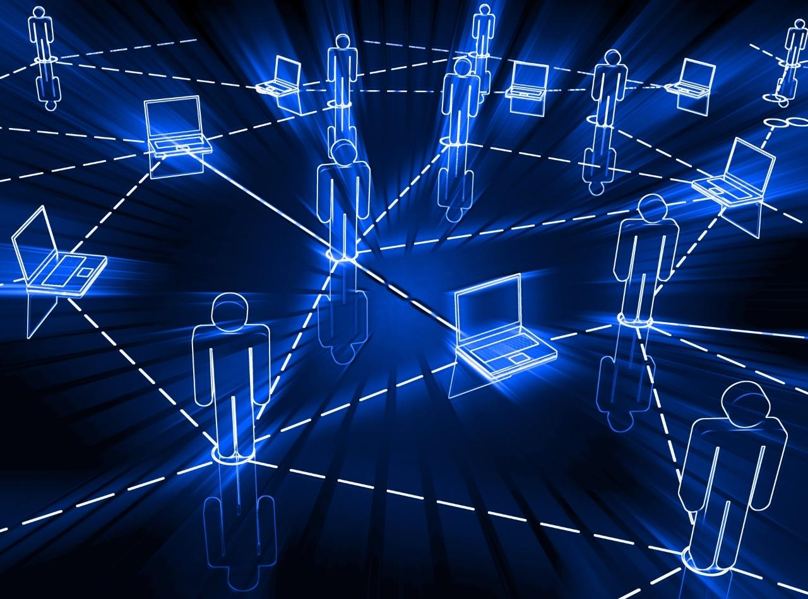{ .img1 .marginbottom40}

**Resultados de aprendizaje y criterios de evaluacion que se evaluarán en esta unidad.**  

| **Resultados de aprendizaje de la unidad didáctica:**|
||
| **RA. 1:** Instala servicios de configuración dinámica, describiendo sus características y aplicaciones.|

|**Criterios de evaluación de la unidad didáctica:**|
||
|**a)** Se ha reconocido el funcionamiento de los mecanismos automatizados de configuración de los parámetros de red.|
|**b)** Se han identificado las ventajas que proporcionan.|
|**c)** Se han ilustrado los procedimientos y pautas que intervienen en una solicitud de configuración de los parámetros de red.|
|**d)** Se ha instalado un servicio de configuración dinámica de los parámetros de red.|
|**e)** Se ha preparado el servicio para asignar la configuración básica a los sistemas de una red local.|
|**f)** Se han realizado asignaciones dinámicas y estáticas.|
|**g)** Se han integrado en el servicio opciones adicionales de configuración.|
|**h)** Se ha verificando la correcta asignación de los parámetros.|

## 1 - Introducción

## 2 - Definiciones de redes de ordenadores

### 2.1 Red informática

**Una red informática** es un conjunto de equipos interconectados entre sí, que comparten información y recursos.  
Una red informática se compone de tres elementos fundamentales **medios de transmisión**, **nodos** y **protocolos**.

- **Medios de transmisión:** Pueden ser tanto físicos como inalámbricos y son los canales que permiten la comunicación entre los equipos de una red.
- **Nodos:** Dispositivos que pueden enviar, recibir o retransmitir datos en una red.
- **Protocolos:** Reglas y convenciones que rigen la comunicación entre los equipos de una red.

### 2.2 Clasificación de las redes informáticas

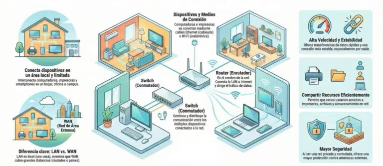{ .marginbottom20 .margintop20}

#### 2.2.1 Red de Área Personal (PAN)

Es el tipo de red más básico (y pequeño). Su alcance se limita a unos pocos metros y está diseñada para conectar dispositivos de uso personal como smartphones, tabletas, ordenadores y periféricos (auriculares, impresoras). La tecnología más común para su funcionamiento inalámbrico (WPAN) es el Bluetooth.

#### 2.2.2 Red de Área Local (LAN y WLAN)

Se puede definir como una red que conecta dispositivos dentro de un área geográfica limitada, como un hogar, oficina o edificio. Dentro de esta categoría se incluyen dos tipos de redes:

- **LAN (Local Area Network):** Conecta dispositivos en un espacio físico limitado (casa, oficina, edificio, ...). Permite el intercambio rápido de grandes cantidades de datos y el uso de recursos comunes como servidores e impresoras.  
- **WLAN (Wireless LAN):** Es la versión inalámbrica de la LAN, comúnmente conocida como Wi-Fi, que ofrece la misma conectividad local sin necesidad de cables físico.

#### 2.2.3 Red de Área de Campus (CAN)

Esta red interconecta varias redes locales (LAN) dentro de un recinto geográfico específico, como un campus universitario, un hospital o un complejo industrial. Es más grande que una LAN pero más pequeña que una red metropolitana.

#### 2.2.4 Red de Área Metropolitana (MAN)

La red MAN da cobertura a un área geográfica más amplia, como un municipio o una ciudad. Suele estar compuesta por varias redes LAN interconectadas a través de infraestructura de alta velocidad, como la fibra óptica, y es utilizada frecuentemente por empresas con varias sedes en la misma ciudad o por ayuntamientos.

#### 2.2.5 Red de Área Amplia (WAN)

Las redes WAN cubren distancias considerables, extendiéndose por países o continentes. Utilizan medios como satélites o cables submarinos para conectar dispositivos que están a kilómetros de distancia. El ejemplo más representativo y conocido de una red WAN es **Internet**.

#### 2.2.6 Red de Área Global (GAN)

Representa la red de mayor escala, con una cobertura global. Da soporte a las comunicaciones móviles a nivel mundial y permite que dispositivos en cualquier punto del planeta se conecten entre sí utilizando infraestructuras de redes de área amplia.

#### 2.2.7 Redes locales virtuales (VLAN)

Además de estas, existen configuraciones específicas como las redes locales virtuales (VLAN), que permiten segmentar el tráfico de forma lógica dentro de una infraestructura física ya existente para mejorar la seguridad y el rendimiento.

#### 2.2.8 Redes privadas virtuales (VPN)

Las redes privadas virtuales (VPN) permiten a los usuarios conectarse de manera segura a una red privada a través de de cualquier in­frae­s­tru­c­tu­ra de red para asociar sistemas in­fo­r­má­ti­cos de manera lógica.  
   Lo más común es utilizar **Internet como medio de tra­n­s­po­r­te**, ya que este permite es­ta­ble­cer la conexión entre todos los or­de­na­do­res a nivel mundial. La tra­n­s­fe­re­n­cia de datos tiene lugar dentro de **un túnel virtual** entre cliente y servidor.  

#### 2.2.9 Actividades

!!! exercise "Identificar el tipo de red de las siguientes imágenes y explicar sus características y aplicaciones."
    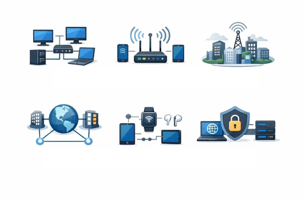{ .margintop20}
    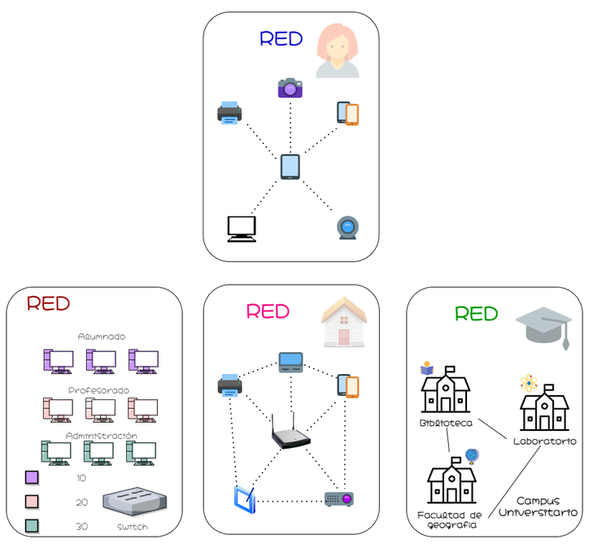{ .marginbottom20 }
    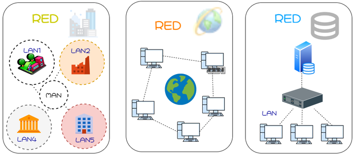

### 2.3 Elementos de una red informática

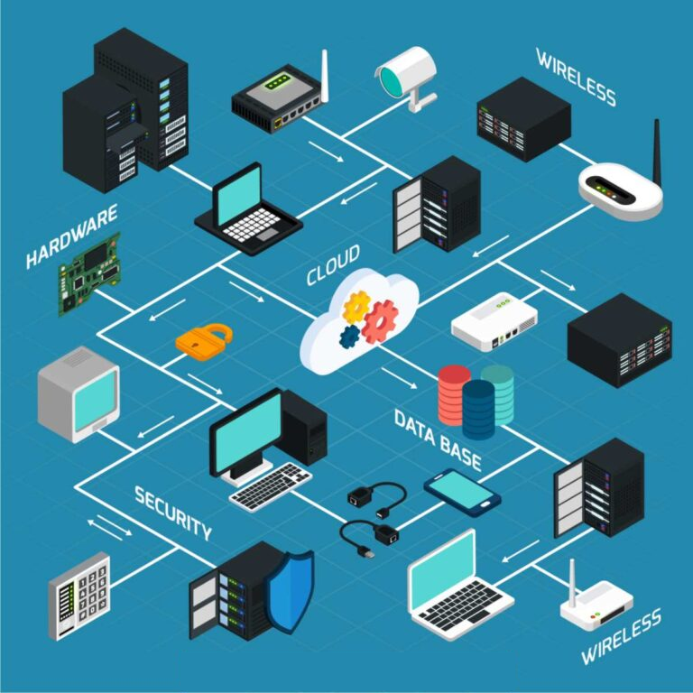

Para que una red informática funcione correctamente, necesita una serie de elementos físicos, lógicos y de conectividad que trabajan de forma coordinada. Los principales son:

1. **Nodos:**  
**Un nodo es cualquier dispositivo conectado a la red**, es decir, ordenadores, impresoras, módems o servidores capaces de enviar, recibir, crear o almacenar datos. Cada nodo necesita una forma de identificación, habitualmente una dirección IP o una dirección MAC, para poder comunicarse con el resto.
1. **Dirección IP:**  
**Es el identificador numérico único asignado a cada dispositivo dentro de la red.** Cuando un dispositivo envía datos a otro, los paquetes incluyen las direcciones IP de origen y destino, lo que permite que la información llegue al lugar correcto.
1. **Enrutadores (routers):**  
**Analizan los paquetes de datos y determinan la ruta óptima para que lleguen a su destino.** Se encargan de dirigir el tráfico **entre redes distintas** de forma eficiente.
1. **Conmutadores (switches):**  
**Conectan entre sí los dispositivos de una misma red local**, gestionando el tráfico de datos con mayor precisión que un enrutador en entornos de área reducida.
1. **Medios de transmisión:**  
El canal por el que viajan los datos puede ser **físico** (cables de cobre, Ethernet o fibra óptica) o **inalámbrico**, mediante ondas electromagnéticas o de radio. La elección del medio condiciona la velocidad, el alcance y la seguridad de la red.
1. **Protocolos de comunicación:**  
Son las reglas que permiten que dispositivos distintos se entiendan entre sí. El **TCP/IP es el más utilizado**, pero existen otros como HTTP, FTP o DNS, cada uno con funciones específicas dentro del ecosistema de la red.
1. **Cortafuegos (firewalls) y sistemas de seguridad:**  
Protegen la red controlando el tráfico entrante y saliente, bloqueando accesos no autorizados y filtrando contenido potencialmente dañino.

**Entender la relación entre los componentes físicos de una red** requiere también conocer bien el **hardware de un ordenador y la diferencia entre hardware y software**, ya que ambas dimensiones se integran en cualquier infraestructura de red.

### 2.4 Tipos de conexión entre nodos en una red informática

- **Cliente-servidor:**  
Un servidor centralizado gestiona los recursos y da servicio a varios dispositivos clientes. Es el modelo dominante en empresas, plataformas web y servicios en la nube.
- **P2P (Peer-to-Peer o red entre iguales):**  
Todos los nodos actúan simultáneamente como clientes y servidores, compartiendo recursos de forma directa sin necesidad de un servidor central. Es el modelo que usan, por ejemplo, algunas plataformas de intercambio de archivos.

### 2.5 Funcionamiento de una red informática

El funcionamiento de una red informática se basa en un proceso ordenado de transmisión de datos donde cada componente cumple un rol específico:

1. **Emisor:** Dispositivo o usuario que genera el mensaje o conjunto de datos que se desea transmitir.

1. **Codificación:** La tarjeta de red del emisor convierte la información en cadenas de bits (lenguaje binario) para que pueda viajar por la red.

1. **Empaquetado y enrutamiento:** Los datos se dividen en pequeños paquetes independientes. Siguiendo el **protocolo TCP/IP**, los enrutadores analizan cada paquete y determinan la ruta más eficiente hacia su destino.

1. **Medio de transmisión:** Canal físico o inalámbrico (cable de red, fibra óptica o Wi-Fi) por el que se desplazan los paquetes.

1. **Decodificación y reensamblado:** El dispositivo receptor captura los bits, organiza los paquetes en el orden correcto y reconstruye el mensaje original.

1. **Receptor:** Dispositivo o usuario final que recibe la información procesada y lista para su uso.

Todo este flujo se completa en fracciones de segundo gracias a la velocidad de la infraestructura actual y la eficiencia de los protocolos de red. La calidad final de la transmisión dependerá de factores como el ancho de banda, la estabilidad del medio y la correcta configuración de los equipos.

### 2.6 Modelos de comunicación

- Un protocolo de comunicación es un conjunto de reglas que define cómo deben intercambiar información dos o más dispositivos de una red. Utilizando una analogía, un protocolo es para una red lo que un idioma es para las personas: si ambos interlocutores utilizan el mismo idioma, pueden entenderse y comunicarse.
- Los equipos de una red pueden utilizar sistemas operativos, programas y hardware muy diferentes. Sin embargo, si emplean protocolos compatibles, podrán intercambiar información sin problemas.
- Para que dos dispositivos puedan comunicarse, ambos deben utilizar los mismos protocolos o protocolos compatibles. Por ejemplo, el protocolo IP permite identificar y direccionar los dispositivos dentro de una red para que los paquetes lleguen a su destino.
- En las redes informáticas existen numerosos protocolos, cada uno diseñado para realizar una función específica. Habitualmente se estudian y clasifican según la capa del modelo OSI en la que desempeñan su función.

#### 2.6.1 Modelo OSI

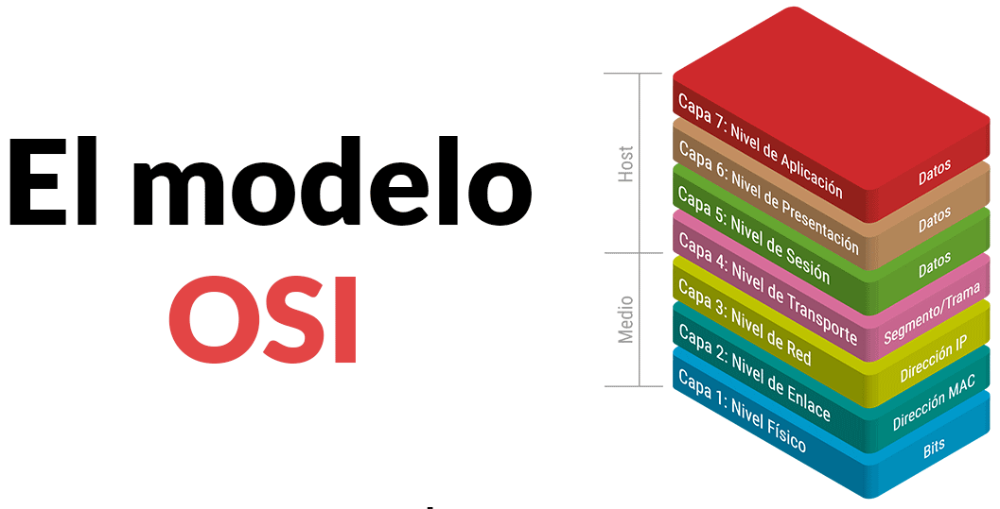{.marco .marginbottom20 }

**El modelo de interconexión de sistemas abiertos (OSI)** es una representación **abstracta** del funcionamiento de Internet.  

**Contiene 7 capas:**

- Cada capa representa una categoría diferente de funciones de red.
- Cada capa dispone de un conjunto de protocolos que permiten que los dispositivos de una red puedan comunicarse entre sí.

!!! info "7. Capa de aplicación:"
    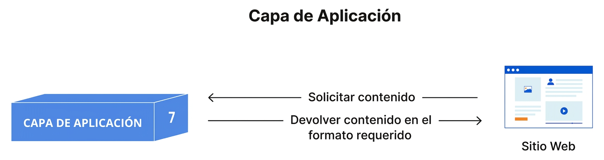{.marco .marginbottom20 .margintop20}

    - Es la capa más cercana al usuario y la única que interactúa directamente con las aplicaciones.
    - Proporciona servicios de red a los programas utilizados por el usuario, como navegadores web, clientes de correo electrónico o aplicaciones de mensajería.
    - Las aplicaciones (Firefox, Chrome, Thunderbird, Outlook, etc.) no forman parte de la capa de aplicación; utilizan los servicios y protocolos que esta proporciona.
    - Se encarga de definir los protocolos y las reglas necesarias para el intercambio de información entre aplicaciones que se ejecutan en diferentes equipos.
    - Algunos protocolos de esta capa son **HTTP** (páginas web), **HTTPS**, **FTP** (transferencia de archivos), **DNS** (resolución de nombres), **SMTP** (envío de correo electrónico), **POP3** e **IMAP** (recepción de correo electrónico).

!!! info "6. Capa de presentación:"
    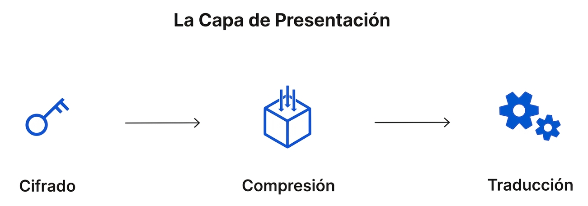{.marco .marginbottom20 .margintop20 .ochozero}

    - Se encarga de representar los datos en un formato común para que puedan ser interpretados por la capa de aplicación del equipo receptor.
    - Sus principales funciones son la traducción de formatos, el cifrado y el descifrado de la información, así como la compresión y descompresión de los datos.
    - Si dos dispositivos utilizan representaciones diferentes de los datos (por ejemplo, distintas codificaciones de caracteres), esta capa realiza la traducción necesaria para que ambos puedan entender la información intercambiada.
    - En el modelo OSI, también es la encargada de cifrar los datos antes de su transmisión y de descifrarlos cuando llegan al equipo receptor, garantizando que solo los destinatarios autorizados puedan interpretarlos.
    - Además, puede comprimir los datos antes de enviarlos para reducir el volumen de información transmitida y mejorar la eficiencia de la comunicación. En el receptor, realiza la operación inversa, descomprimiendo los datos antes de entregarlos a la capa de aplicación.   

!!! info "5. Capa de sesión:"
    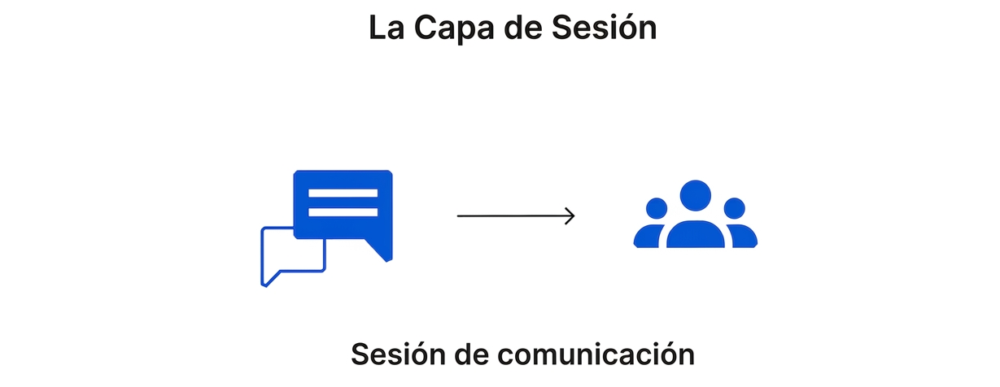{.marco .marginbottom20 .margintop20 .ochozero}

    - Es la encargada de establecer, mantener y finalizar las sesiones de comunicación entre aplicaciones que se ejecutan en diferentes dispositivos.
    - Una sesión es el intercambio de información que mantienen dos aplicaciones desde que comienza la comunicación hasta que finaliza.
    - La capa de sesión garantiza que la sesión permanezca activa mientras sea necesaria y, una vez finalizada la comunicación, la cierra para liberar los recursos utilizados.
    - Además, puede sincronizar la transferencia de datos mediante puntos de control (*checkpoints*). Si la comunicación se interrumpe, estos puntos permiten reanudar la transferencia desde el último punto de control en lugar de comenzar de nuevo desde el principio.

!!! info "4. Capa de transporte:"
    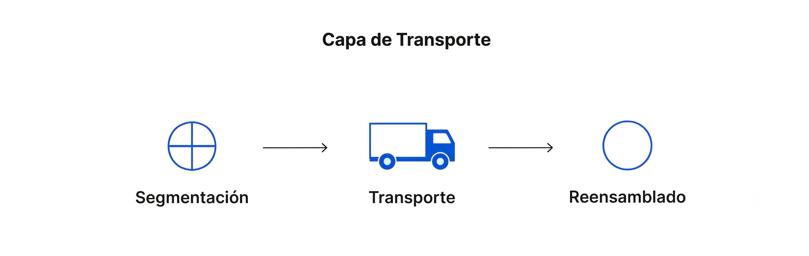{.marco .marginbottom20 .margintop20}

    - Es la encargada de proporcionar una comunicación extremo a extremo entre las aplicaciones que se ejecutan en los dispositivos de origen y destino.
    - En el equipo emisor, recibe los datos de la capa de sesión y los divide en unidades más pequeñas denominadas **segmentos**, que posteriormente entrega a la capa de red para su transmisión.
    - En el equipo receptor, realiza el proceso inverso, reensamblando los segmentos recibidos para reconstruir los datos originales antes de entregarlos a la capa de sesión.
    - También se encarga del **control de flujo**, regulando la velocidad de transmisión para evitar que un emisor rápido envíe datos más deprisa de lo que el receptor puede procesarlos.
    - Además, realiza el **control de errores**, comprobando que los datos lleguen completos y en el orden correcto. Si detecta pérdidas o errores, puede solicitar la retransmisión de los segmentos afectados.
    - Los protocolos más conocidos de esta capa son **TCP (Transmission Control Protocol)**, que ofrece una comunicación fiable y orientada a conexión, y **UDP (User Datagram Protocol)**, que prioriza la velocidad sobre la fiabilidad.

!!! info "3. Capa de red:"
    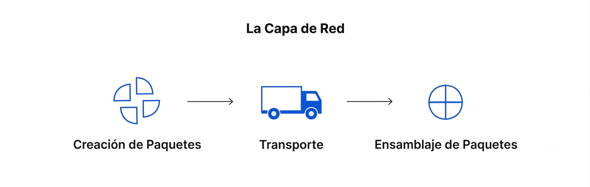{.marco .marginbottom20 .margintop20}

    - Es la encargada de permitir la comunicación entre dispositivos que pertenecen a redes diferentes.
    - En el equipo emisor, recibe los segmentos de la capa de transporte y los divide en unidades de datos denominadas **paquetes**, que serán enviados a través de la red.
    - En el equipo receptor, realiza el proceso inverso, reensamblando los paquetes recibidos antes de entregarlos a la capa de transporte.
    - También se encarga del **direccionamiento lógico**, identificando el origen y el destino de cada paquete mediante direcciones IP.
    - Además, determina la mejor ruta que deben seguir los paquetes para llegar a su destino. Este proceso se conoce como **enrutamiento** (*routing*).
    - Entre los protocolos más importantes de esta capa se encuentran **IP (Internet Protocol)**, responsable del direccionamiento y el encaminamiento de los paquetes, **ICMP (Internet Control Message Protocol)**, utilizado para el envío de mensajes de control y diagnóstico, **IGMP (Internet Group Management Protocol)**, empleado para la gestión de grupos multicast, e **IPsec (Internet Protocol Security)**, un conjunto de protocolos que proporciona autenticación y cifrado a las comunicaciones IP.

!!! info "2. Capa de enlace de datos:"
    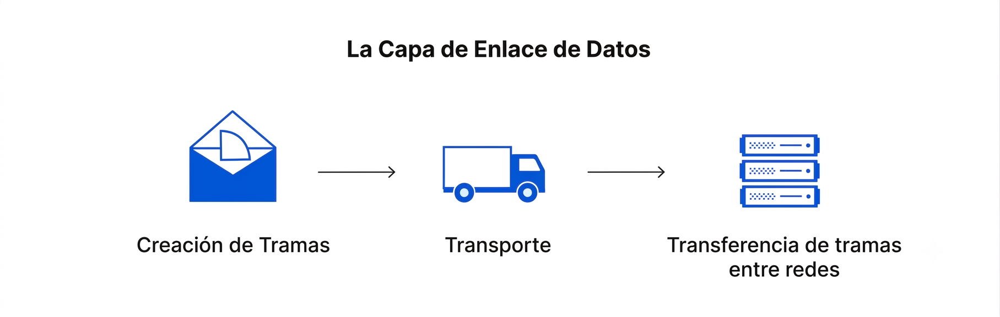{.marco .marginbottom20 .margintop20}

    - Es la encargada de permitir la comunicación entre dispositivos que pertenecen a la misma red local.
    - En el equipo emisor, recibe los paquetes de la capa de red y los encapsula en unidades de datos denominadas **tramas** (*frames*), que serán transmitidas a través del medio físico.
    - En el equipo receptor, realiza el proceso inverso, extrayendo los paquetes de las tramas antes de entregarlos a la capa de red.
    - También se encarga del **control de flujo** y del **control de errores** durante la comunicación dentro de una misma red, garantizando que las tramas lleguen correctamente al dispositivo de destino.
    - Además, utiliza las **direcciones físicas o direcciones MAC** para identificar de forma única los dispositivos dentro de la red local.
    - Entre las tecnologías y protocolos más utilizados en esta capa se encuentran **Ethernet (IEEE 802.3)**, **Wi-Fi (IEEE 802.11)** y **PPP (Point-to-Point Protocol)**.

!!! info "1. Capa física:"
    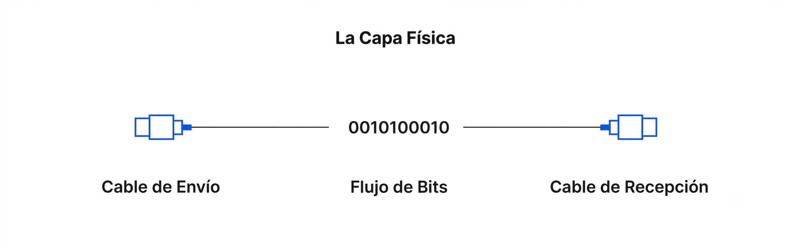{.marginbottom20 .margintop20}

    - Es la capa encargada de transmitir los datos a través del medio físico que conecta los dispositivos de la red.
    - Incluye los elementos físicos necesarios para la comunicación, como los **cables**, **conectores**, **repetidores**, **hubs**, así como las características eléctricas, ópticas o de radio que permiten la transmisión de la información.
    - En el equipo emisor, convierte los datos en una secuencia de **bits** (0 y 1) que puede transmitirse por el medio físico. En el equipo receptor, realiza el proceso inverso, transformando la señal recibida nuevamente en bits.
    - Para que la comunicación sea posible, ambos dispositivos deben utilizar el mismo método de codificación de las señales, de forma que puedan distinguir correctamente los bits **0** y **1** durante la transmisión.
    - Entre las tecnologías asociadas a esta capa se encuentran los diferentes medios de transmisión, como el **cable de par trenzado**, la **fibra óptica**, los **enlaces inalámbricos (Wi-Fi)** y los estándares que definen sus características físicas.

##### 2.6.1.1 Ejemplo de flujo de datos por las capas del modelo OSI

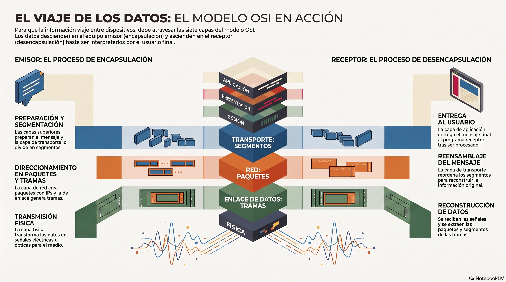{.marco .marginbottom20}

Para que una información pueda viajar desde un dispositivo hasta otro a través de una red, debe atravesar las **siete capas del modelo OSI**.

En el **equipo emisor**, los datos descienden desde la **capa de aplicación** hasta la **capa física**, donde se transmiten por el medio de comunicación. En el **equipo receptor**, ocurre el proceso contrario: los datos ascienden desde la **capa física** hasta la **capa de aplicación**, donde finalmente son interpretados por el programa que los utiliza.

Supongamos que **Ana** quiere enviar un correo electrónico a **Luis**.

!!! tip "Transmisión"
    1. Ana escribe el mensaje en su cliente de correo electrónico y pulsa el botón **Enviar**.
    2. El cliente de correo entrega el mensaje a la **capa de aplicación**, que utiliza el protocolo **SMTP** para  preparar el envío.
    3. La **capa de presentación** adapta los datos al formato adecuado y, si es necesario, los comprime o cifra.
    4. La **capa de sesión** establece la comunicación entre ambos dispositivos y mantiene la sesión mientras dura el   intercambio de información.
    5. La **capa de transporte** divide el mensaje en **segmentos** para facilitar su transmisión.
    6. La **capa de red** encapsula los segmentos en **paquetes**, les asigna las direcciones IP de origen y destino y  determina la ruta que seguirán hasta el equipo receptor.
    7. La **capa de enlace de datos** convierte los paquetes en **tramas**, añadiendo la información necesaria para la  comunicación dentro de la red local.
    8. Finalmente, la **capa física** transforma las tramas en señales eléctricas, ópticas o de radio, que se transmiten por el medio físico (por ejemplo, un cable de red o una conexión Wi-Fi).

Cuando las señales llegan al equipo de Luis, se realiza el proceso inverso:

!!! tip "recepción"
    1. La **capa física** recibe las señales y las convierte nuevamente en una secuencia de bits.
    2. La **capa de enlace de datos** reconstruye las **tramas** y extrae de ellas los **paquetes**.
    3. La **capa de red** verifica el direccionamiento y entrega los paquetes a la **capa de transporte**.
    4. La **capa de transporte** reordena los **segmentos** y reconstruye el mensaje original.
    5. La **capa de sesión** mantiene la comunicación hasta que finaliza el intercambio de información y,   posteriormente, la cierra.
    6. La **capa de presentación** descifra o descomprime los datos si es necesario.
    7. Finalmente, la **capa de aplicación** entrega el mensaje al cliente de correo electrónico, que lo muestra en la pantalla para que Luis pueda leerlo.

##### 2.6.1.2 Encapsulación de los datos

Cuando una aplicación envía información a través de una red, los datos deben atravesar todas las capas del modelo OSI hasta llegar al medio físico. Durante este recorrido, cada capa añade su propia información de control, proceso que recibe el nombre de encapsulación.

Normalmente, esta información de control se incorpora mediante una cabecera (header) y, en algunos protocolos, también mediante una cola (trailer o footer). Estos datos adicionales permiten que la capa equivalente del equipo receptor pueda interpretar correctamente la información recibida.

El resultado de este proceso es una Unidad de Datos de Protocolo o PDU (Protocol Data Unit). Cada vez que los datos descienden una capa, la PDU incorpora nueva información de control y aumenta ligeramente su tamaño. Este proceso continúa hasta la capa de enlace de datos, que genera la trama completa antes de que la capa física la convierta en señales para transmitirla por el medio de comunicación.

En el equipo receptor se realiza el proceso contrario, denominado desencapsulación. Cada capa elimina la información de control que añadió su homóloga en el equipo emisor y entrega los datos a la capa superior. Finalmente, la información llega a la capa de aplicación en el mismo formato en que fue generada por la aplicación del usuario.

Dependiendo de la capa en la que se encuentre, la PDU recibe un nombre diferente:

- Capas de Aplicación, Presentación y Sesión: Datos.
- Capa de Transporte: Segmentos (TCP) o Datagramas (UDP).
- Capa de Red: Paquetes.
- Capa de Enlace de datos: Tramas (Frames).
- Capa Física: Bits.

Aunque en el lenguaje cotidiano suele hablarse de "paquetes" para referirse a cualquier información transmitida por una red, técnicamente cada capa utiliza una denominación distinta para su PDU.

En la mayoría de los protocolos, la información de control se añade al principio de los datos mediante una cabecera. Sin embargo, algunos protocolos de la capa de enlace de datos, como Ethernet, también incorporan un trailer que contiene un CRC (Cyclic Redundancy Check), utilizado para detectar errores durante la transmisión.

**Ejemplo de encapsulación.**
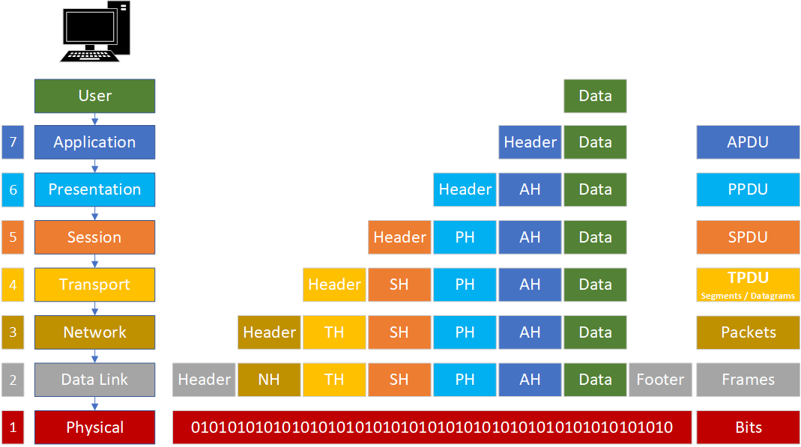{.marco .marginbottom20 .margintop20}

##### 2.6.1.3 Tabla resumen de los protocolos por capas

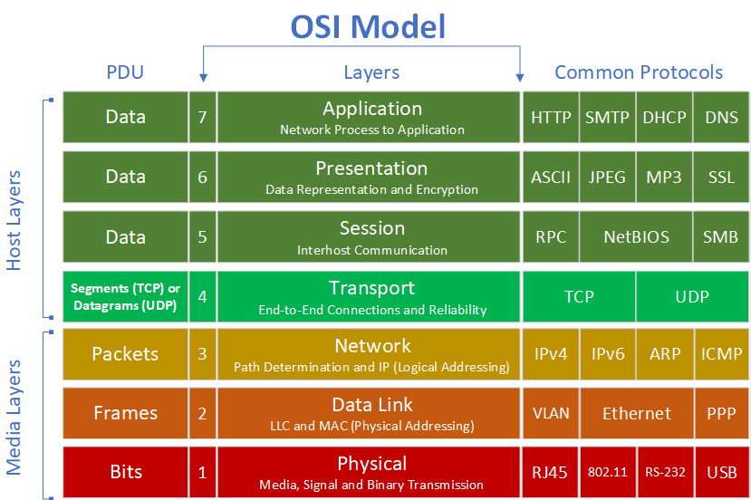{.marco .marginbottom20}

#### 2.6.2 Modelo TCP/IP

El **modelo OSI**, un modelo de referencia que describe cómo se comunican los dispositivos de una red mediante siete capas. El modelo OSI aunque ampliamente utilizado con fines didácticos, **no es el modelo que se emplea en Internet**.

**Internet es una red pública y global** de ordenadores que están interconectados mediante el protocolo de Internet (Internet Protocol) y que se comunican mediante la conmutación de paquetes.  

**Internet es la unión de millones de subredes** domésticas, académicas, comerciales y gubernamentales, por eso a veces se la denomina «la red de redes».

Aunque existe una gran diversidad de arquitecturas de red, **la familia/suite de protocolos TCP/IP** (desarrollado por el Departamento de Defensa de los Estados Unidos) se utiliza en **la mayoría de las redes que conforman Internet**, así como en las intranets de empresas, centros educativos, zonas wifi, oficinas y hogares.

La denominación TCP/IP hace referencia a sus dos protocolos más importantes: el **Protocolo de Internet (IP)** y el **Protocolo de Control de Transmisión (TCP)**.

Al igual que en el modelo **OSI**, el modelo **TCP/IP** divide el proceso de comunicación en diferentes capas. No obstante, lo hace de una forma **más sencilla**, **agrupando algunas de las funciones del modelo OSI**.

##### 2.5.2.1 Capas del modelo TCP/IP

Como acabamos de ver, **el modelo TCP/IP es la arquitectura de red en la que se basa Internet**. Se organiza de forma jerárquica en 4 capas que gestionan cómo se empaqueta, envía y recibe la información: **Aplicación, Transporte, Internet (o Red) y Acceso a la red**.

- **Capa de aplicación**  
Es la más cercana al usuario y donde operan las aplicaciones y servicios de red (como navegadores web o gestores de correo). Utiliza protocolos principales como HTTP, FTP, SMTP y DNS.

- **Capa de transporte**  
 Garantiza que los datos lleguen de forma íntegra y ordenada entre el emisor y el receptor. Sus protocolos clave son TCP (orientado a conexión y fiable) y UDP (rápido, sin conexión).

- **Capa de Internet**  
Se encarga del direccionamiento lógico y del enrutamiento de los paquetes de datos a través de distintas redes hasta llegar a su destino. Su protocolo principal es IP (Internet Protocol).

- **Capa de acceso a la red**  
Controla el hardware físico y los medios de transmisión (cables de cobre, fibra óptica, redes inalámbricas). Define cómo los datos se convierten en señales eléctricas o de radio.

Estas cuatro capas equivalen a las siete capas del modelo OSI, tal y como se muestra en la siguiente tabla:

| Modelo OSI      | Modelo TCP/IP   |
| --------------- | --------------- |
| Aplicación      | Aplicación      |
| Presentación    | Aplicación      |
| Sesión          | Aplicación      |
| Transporte      | Transporte      |
| Red             | Internet        |
| Enlace de datos | Acceso a la red |
| Física          | Acceso a la red |

Como puede observarse, el modelo TCP/IP integra las funciones de las capas de **Aplicación, Presentación y Sesión** del modelo OSI en una única **capa de aplicación**, mientras que las capas **Física** y **Enlace de datos** se agrupan en la **capa de acceso a la red**.

A partir de este momento estudiaremos los protocolos más importantes de cada una de estas cuatro capas, ya que son los que utilizan los dispositivos para comunicarse en las redes actuales e Internet.

##### 2.6.2.2 Pila de protocolos del modelo TCP/IP

**TCP/IP** es el nombre genérico que se le da a todo el conjunto de protocolos de comunicación que usa Internet.  

Como hemos visto, no es un único protocolo, sino un modelo de referencia con varias capas, y TCP/IP engloba a muchísimos protocolos (no solo TCP e IP): también incluye HTTP, FTP, DNS, UDP, SMTP, etc.

1. **El protocolo IP (Internet Protocol)**  
Pertenece a la capa de red (o capa de Internet). Su función es la de direccionamiento y encaminamiento: asigna las direcciones IP a los dispositivos y se encarga de que los paquetes de datos viajen desde el origen hasta el destino correcto, aunque tengan que pasar por varias redes intermedias.

1. **El protocolo TCP (Transmission Control Protocol)**  
Pertenece a la capa de transporte. Su función es garantizar que los datos lleguen de forma fiable y ordenada: divide la información en paquetes, comprueba que todos lleguen, los reordena si es necesario y pide el reenvío de los que se hayan perdido.

##### 2.5.2.3 Protocolos de comunicación del modelo TCP/IP

En la siguiente imagen podemos ver cómo se distribuyen los protocolos más habituales del modelo TCP/IP y cómo se mapearían dentro del marco conceptual del modelo OSI.

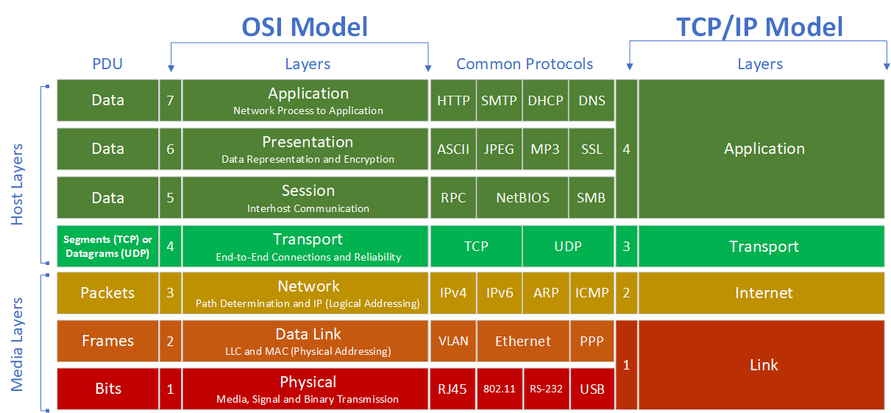{ .marginbottom20}

##### 2.6.2.4 Encapsulación de los datos con el modelo TCP/IP

Al igual que en el modelo OSI, TCP/IP también encapsula los datos mientras van descendiendo por las capas en el emisor y ascendiendo en el receptor.

En el siguiente ejemplo mostraremos **una solicitud HTTP** entre cliente y servidor a la hora de acceder a una página web.

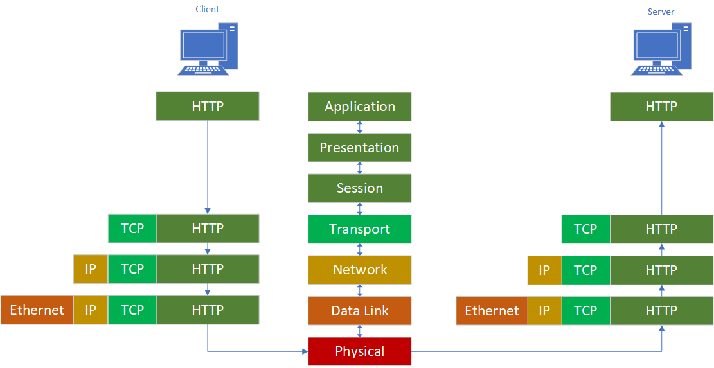{ .marginbottom20}

---

| **Licencia Creative Commons:** | |
| - | - |
|  { .by-nc-nd-eu_ } | **Reconocimiento-NoComercial-CompartirIgual CC BY-NC-SA:** No se permite un uso comercial de la obra original ni de las posibles obras derivadas, la distribución de la cuales se debe hace con una licencia igual a la que regula la obra original. |

<!-- 
muy bien escrito revisar para ver si el texto sigue la misma esstructura.
https://itadmins.es/networking-i-el-modelo-osi/ -->